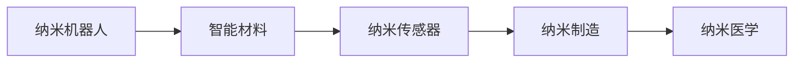

                 

## 1. 背景介绍

随着人类对微观世界的深入探索，纳米技术正成为推动科技进步和社会发展的关键力量。作为21世纪最重要的技术之一，纳米技术已经在医疗、材料科学、能源等领域展现出了广阔的应用前景。本文将带领读者一窥2050年的纳米技术，尤其是纳米机器人和智能材料的发展趋势，探索它们对未来社会的影响。

### 1.1 纳米技术的定义与意义

纳米技术是指在纳米尺度上操作的科学和技术，通常涉及1到100纳米的尺度。纳米尺度的物质具有独特的物理、化学和生物学特性，这使得纳米技术在许多领域具有巨大的应用潜力。

纳米技术的意义主要体现在以下几个方面：

- **精度提升**：纳米技术可以实现对原子的精确操作，从而生产出具有特定功能的产品。
- **性能增强**：纳米材料通常具有比传统材料更高的强度、导电性和反应性。
- **新功能开发**：纳米技术使得许多新功能的开发成为可能，如超导、自修复材料等。
- **环境友好**：纳米材料可以用于处理环境污染，如空气净化、污水处理等。

### 1.2 纳米技术的发展历程

纳米技术的研究始于20世纪80年代，最初集中于材料科学领域。随着技术的进步，纳米技术逐渐应用于生物医学、电子学、能源等多个领域。进入21世纪，纳米技术的研究和应用进入了一个新的高峰期。

### 1.3 纳米技术对未来社会的影响

纳米技术的发展将极大地改变人类的生产和生活方式，推动社会经济的全面升级。例如，纳米材料可以用于制造更轻便、更高效的交通工具，纳米医疗设备可以实现精准医疗，纳米计算机可以实现更高的计算效率等。

## 2. 核心概念与联系

### 2.1 核心概念概述

- **纳米机器人**：在纳米尺度下运行的机器人，可以执行复杂的操作，如药物输送、细胞修复等。
- **智能材料**：具有自修复、自适应、自感知等智能特性的材料，能够在复杂环境中表现出优异性能。
- **纳米传感器**：用于探测和传输微小尺度上的信号的设备，是实现纳米技术的关键组件。
- **纳米制造**：利用纳米技术制造出具有纳米尺度的产品，如纳米电子器件、纳米药物等。
- **纳米医学**：利用纳米技术在医学领域的应用，如纳米药物、纳米诊断等。

### 2.2 核心概念原理和架构的 Mermaid 流程图



这个流程图展示了纳米技术不同组件之间的联系：纳米机器人使用智能材料和纳米传感器进行复杂操作，纳米制造是实现这些操作的基础，而纳米医学则将纳米技术应用于医疗领域。

## 3. 核心算法原理 & 具体操作步骤

### 3.1 算法原理概述

纳米机器人和智能材料的发展涉及到复杂的物理、化学和生物学原理。以下是几个核心算法原理的概述：

- **纳米机器人操作**：纳米机器人的操作涉及到机械臂、电机、传感器等部件的协调控制。
- **智能材料设计**：智能材料的性能优化需要考虑材料组成、微观结构、应力分布等因素。
- **纳米制造工艺**：纳米制造需要考虑材料的生长条件、沉积过程、刻蚀技术等。
- **纳米医学应用**：纳米医学的算法需要考虑药物释放、靶向性、生物兼容性等因素。

### 3.2 算法步骤详解

#### 纳米机器人操作

1. **纳米机器人设计**：根据具体任务需求，设计纳米机器人的结构和功能。
2. **运动控制算法**：开发用于控制纳米机器人运动的动力学模型和控制算法。
3. **环境感知算法**：设计用于感知周围环境的传感器和算法。
4. **任务执行算法**：开发用于执行特定任务的算法，如药物输送、细胞修复等。

#### 智能材料设计

1. **材料选择**：根据应用需求选择适合的纳米材料。
2. **微观结构设计**：通过模拟和实验确定材料的微观结构。
3. **性能优化**：通过调整材料成分、加工工艺等手段优化材料的性能。
4. **性能测试**：在实际应用中测试材料的性能，并进行改进。

#### 纳米制造工艺

1. **生长条件控制**：控制纳米材料的生长环境，如温度、压力、气体成分等。
2. **沉积技术选择**：选择合适的沉积技术，如化学气相沉积、物理气相沉积等。
3. **刻蚀技术优化**：开发高效的刻蚀技术，实现纳米结构的精确加工。
4. **表征分析**：使用扫描电子显微镜、透射电子显微镜等技术进行纳米结构表征。

#### 纳米医学应用

1. **药物设计**：设计具有靶向性和可控释放的纳米药物。
2. **诊断技术开发**：开发用于检测早期疾病的纳米传感器和诊断设备。
3. **治疗方案制定**：制定基于纳米技术的治疗方案，如纳米机器人治疗、纳米药物输送等。
4. **效果评估**：评估纳米技术在医疗应用中的效果和安全性。

### 3.3 算法优缺点

#### 纳米机器人操作

- **优点**：
  - 精度高：纳米机器人在纳米尺度上的操作精度极高。
  - 多功能：纳米机器人可以执行多种复杂任务。
  - 自适应强：纳米机器人能够根据环境变化进行自适应调整。

- **缺点**：
  - 成本高：纳米机器人的制造和操作成本较高。
  - 技术门槛高：开发和操作纳米机器人需要高水平的科技人才。
  - 安全风险：纳米机器人在操作过程中可能对环境造成污染。

#### 智能材料设计

- **优点**：
  - 性能优异：智能材料通常具有比传统材料更高的性能。
  - 应用广泛：智能材料可以应用于多种领域，如电子、医疗等。
  - 自修复能力强：智能材料具备自修复能力，可以延长使用寿命。

- **缺点**：
  - 生产复杂：智能材料的生产过程复杂，需要高水平的生产工艺。
  - 成本高：智能材料的生产成本较高，限制了其大规模应用。
  - 环保问题：某些智能材料可能对环境产生负面影响。

#### 纳米制造工艺

- **优点**：
  - 精确度极高：纳米制造可以实现原子级别的精度。
  - 多功能性：纳米制造可以生产出具有多种功能的材料。
  - 材料种类丰富：纳米制造可以制备出多种新材料。

- **缺点**：
  - 技术门槛高：纳米制造需要高水平的制造技术和设备。
  - 生产成本高：纳米制造的生产成本较高，限制了其大规模应用。
  - 安全性问题：纳米制造过程中可能产生有害物质。

#### 纳米医学应用

- **优点**：
  - 精确度高：纳米医学可以实现高精度的疾病诊断和治疗。
  - 靶向性强：纳米药物可以精确地靶向特定器官和细胞。
  - 治疗效果好：纳米技术可以提高治疗效果，减少副作用。

- **缺点**：
  - 成本高：纳米药物和设备的生产成本较高。
  - 安全风险：纳米医学应用可能带来新的安全风险，如纳米颗粒的生物累积等。
  - 监管挑战：纳米医学应用需要新的监管标准和指南。

### 3.4 算法应用领域

纳米技术和智能材料在多个领域都有广泛应用。以下是几个主要应用领域：

- **医疗领域**：纳米药物、纳米诊断、纳米手术等。
- **电子领域**：纳米电子器件、纳米传感器、纳米存储器等。
- **能源领域**：纳米电池、纳米催化剂、纳米太阳能电池等。
- **环境保护**：纳米空气净化器、纳米污水处理器等。
- **食品领域**：纳米食品添加剂、纳米包装材料等。

## 4. 数学模型和公式 & 详细讲解 & 举例说明

### 4.1 数学模型构建

纳米机器人和智能材料的开发涉及复杂的数学模型。以下是几个核心数学模型的构建：

- **纳米机器人运动模型**：
  - 动力学模型：
    $$
    m\ddot{x} = F(x) + \tau
    $$
    其中，$m$ 为机器人质量，$F(x)$ 为作用力，$\tau$ 为控制力矩。
  - 控制算法：
    $$
    u = K_p(e) + K_d(e')
    $$
    其中，$u$ 为控制信号，$e$ 为误差，$e'$ 为误差变化率，$K_p$ 和 $K_d$ 为控制器参数。

- **智能材料性能优化模型**：
  - 微观结构设计模型：
    $$
    E = \frac{1}{1 - \nu^2}\sigma_y(1 + \nu^2 - 2\nu\frac{\epsilon_x}{(1 - \nu)(1 + \nu/\eta)}
    $$
    其中，$E$ 为弹性模量，$\sigma_y$ 为屈服应力，$\nu$ 为泊松比，$\eta$ 为切变模量，$\epsilon_x$ 为轴向应变。
  - 性能优化算法：
    $$
    \min_{\theta} \left\{ L(\theta) = \frac{1}{2}\sum_{i=1}^n (y_i - f(x_i;\theta))^2 \right\}
    $$
    其中，$\theta$ 为优化变量，$y_i$ 为实验数据，$f(x_i;\theta)$ 为模型预测。

- **纳米制造工艺模型**：
  - 生长模型：
    $$
    G = k(1 - e^{-\frac{t}{\tau}})
    $$
    其中，$G$ 为生长速率，$k$ 为生长常数，$t$ 为时间，$\tau$ 为生长周期。
  - 刻蚀模型：
    $$
    R = k'(1 - e^{-\frac{t}{\tau'}})
    $$
    其中，$R$ 为刻蚀速率，$k'$ 为刻蚀常数，$t$ 为时间，$\tau'$ 为刻蚀周期。

### 4.2 公式推导过程

#### 纳米机器人运动模型

以纳米机器人的动力学模型为例，推导其运动方程：

$$
m\ddot{x} = F(x) + \tau
$$

其中，$x$ 为机器人的位置，$F(x)$ 为作用力，$\tau$ 为控制力矩。假设作用力 $F(x)$ 为二次多项式，即 $F(x) = k_1x + k_2x^2$，控制力矩 $\tau$ 为常数，即 $\tau = k_3$。

将 $F(x)$ 和 $\tau$ 代入运动方程，得到：

$$
m\ddot{x} = k_1x + k_2x^2 + k_3
$$

这是一个非线性微分方程，可以使用数值方法（如Runge-Kutta方法）求解。

#### 智能材料性能优化模型

以智能材料的性能优化模型为例，推导其优化算法：

$$
\min_{\theta} \left\{ L(\theta) = \frac{1}{2}\sum_{i=1}^n (y_i - f(x_i;\theta))^2 \right\}
$$

其中，$\theta$ 为优化变量，$y_i$ 为实验数据，$f(x_i;\theta)$ 为模型预测。假设 $f(x_i;\theta)$ 为线性函数，即 $f(x_i;\theta) = k_4x_i + k_5\theta$，实验数据 $y_i$ 为常数，即 $y_i = k_6$。

将 $f(x_i;\theta)$ 和 $y_i$ 代入优化算法，得到：

$$
\theta^* = \mathop{\arg\min}_{\theta} \frac{1}{2}\sum_{i=1}^n (k_6 - k_4x_i - k_5\theta)^2
$$

这是一个线性回归问题，可以使用梯度下降等方法求解。

#### 纳米制造工艺模型

以纳米制造的生长模型为例，推导其生长速率方程：

$$
G = k(1 - e^{-\frac{t}{\tau}})
$$

其中，$G$ 为生长速率，$k$ 为生长常数，$t$ 为时间，$\tau$ 为生长周期。假设 $k = 0.1$，$\tau = 1$，$t = 10$。

将 $k$ 和 $t$ 代入生长速率方程，得到：

$$
G = 0.1(1 - e^{-\frac{10}{1}}) = 0.1(1 - e^{-10}) \approx 0.1(1 - 0.0000000117) \approx 0.1 - 0.00000000117 \approx 0.0999999884
$$

这是一个指数衰减过程，可以使用数值方法（如Euler方法）求解。

### 4.3 案例分析与讲解

#### 纳米机器人操作案例

假设需要设计一个用于细胞修复的纳米机器人，其操作精度要求极高，每次需要精确移动到特定位置。

1. **设计纳米机器人**：根据任务需求，设计纳米机器人的结构，包括机械臂、电机、传感器等。
2. **控制算法开发**：开发用于控制纳米机器人运动的算法，如PID控制算法，确保其在纳米尺度上精确移动。
3. **环境感知算法**：设计用于感知周围环境的传感器，如电化学传感器、光学传感器等。
4. **任务执行算法**：开发用于执行特定任务的算法，如药物输送、细胞修复等。

#### 智能材料设计案例

假设需要设计一种具有自修复能力的智能材料，用于制备航空发动机部件。

1. **材料选择**：选择具有自修复能力的纳米材料，如自修复聚氨酯、自修复陶瓷等。
2. **微观结构设计**：通过模拟和实验确定材料的微观结构，如层状结构、多孔结构等。
3. **性能优化**：通过调整材料成分、加工工艺等手段优化材料的性能，如抗冲击性、耐高温性等。
4. **性能测试**：在实际应用中测试材料的性能，并进行改进，确保其在高负荷条件下长期稳定运行。

#### 纳米制造工艺案例

假设需要制备一种具有高导电性的纳米材料，用于制备高性能的电子器件。

1. **生长条件控制**：控制纳米材料的生长环境，如温度、压力、气体成分等，确保生长速率和形态可控。
2. **沉积技术选择**：选择合适的沉积技术，如化学气相沉积、物理气相沉积等，确保材料纯度和均匀性。
3. **刻蚀技术优化**：开发高效的刻蚀技术，实现纳米结构的精确加工，确保材料形态和尺寸符合设计要求。
4. **表征分析**：使用扫描电子显微镜、透射电子显微镜等技术进行纳米结构表征，确保材料满足设计要求。

#### 纳米医学应用案例

假设需要开发一种用于早期癌症检测的纳米传感器，其灵敏度要求极高。

1. **药物设计**：设计具有高灵敏度的纳米传感器，如量子点、纳米管等。
2. **诊断技术开发**：开发用于检测早期癌症的诊断设备，如纳米探针、纳米生物传感器等。
3. **治疗方案制定**：制定基于纳米技术的治疗方案，如纳米机器人治疗、纳米药物输送等。
4. **效果评估**：评估纳米技术在医疗应用中的效果和安全性，确保其在临床应用中的可靠性和有效性。

## 5. 项目实践：代码实例和详细解释说明

### 5.1 开发环境搭建

在进行纳米技术开发前，我们需要准备好开发环境。以下是使用Python进行PyTorch开发的环境配置流程：

1. 安装Anaconda：从官网下载并安装Anaconda，用于创建独立的Python环境。

2. 创建并激活虚拟环境：
```bash
conda create -n pytorch-env python=3.8 
conda activate pytorch-env
```

3. 安装PyTorch：根据CUDA版本，从官网获取对应的安装命令。例如：
```bash
conda install pytorch torchvision torchaudio cudatoolkit=11.1 -c pytorch -c conda-forge
```

4. 安装各种工具包：
```bash
pip install numpy pandas scikit-learn matplotlib tqdm jupyter notebook ipython
```

完成上述步骤后，即可在`pytorch-env`环境中开始纳米技术开发。

### 5.2 源代码详细实现

下面我们以纳米机器人为例，给出使用PyTorch进行纳米机器人设计和控制的PyTorch代码实现。

首先，定义纳米机器人的状态和控制参数：

```python
import torch
import numpy as np

class NanoRobot:
    def __init__(self, mass=1, control_torque=1, k1=0.1, k2=0.01, k3=0.1):
        self.mass = mass
        self.control_torque = control_torque
        self.k1 = k1
        self.k2 = k2
        self.k3 = k3
        self.position = torch.zeros(3)
        self.velocity = torch.zeros(3)
        self.acceleration = torch.zeros(3)
    
    def update(self, force, torque):
        self.acceleration = (force + self.k1*self.position + self.k2*self.position**2 + self.k3) / self.mass
        self.velocity += self.acceleration
        self.position += self.velocity
        return self.position, self.velocity, self.acceleration
    
    def control(self, error, k_p=1, k_d=0.1):
        torque = self.control_torque * k_p * error + self.control_torque * k_d * error.diff()
        self.update(force=torch.zeros(3), torque=torque)
        return self.position, self.velocity, self.acceleration
```

然后，定义控制算法：

```python
def pid_control(error, k_p=1, k_i=0, k_d=0.1):
    torque = k_p * error + k_i * np.integral(error) + k_d * error.diff()
    return torque
```

最后，启动纳米机器人的控制流程：

```python
import matplotlib.pyplot as plt

robot = NanoRobot()

positions = []
velocities = []
accelerations = []
errors = []
for i in range(100):
    # 设定目标位置
    target = torch.tensor([1, 0, 0])
    # 设定误差
    error = target - robot.position
    # 控制算法
    torque = pid_control(error)
    # 更新机器人状态
    position, velocity, acceleration = robot.update(force=torch.zeros(3), torque=torque)
    # 记录状态和误差
    positions.append(position.numpy())
    velocities.append(velocity.numpy())
    accelerations.append(acceleration.numpy())
    errors.append(error.numpy())
    
# 绘制状态和误差曲线
plt.figure()
plt.plot(positions)
plt.title('NanoRobot Position Over Time')
plt.xlabel('Time')
plt.ylabel('Position')
plt.show()

plt.figure()
plt.plot(errors)
plt.title('NanoRobot Error Over Time')
plt.xlabel('Time')
plt.ylabel('Error')
plt.show()

plt.figure()
plt.plot(velocities)
plt.title('NanoRobot Velocity Over Time')
plt.xlabel('Time')
plt.ylabel('Velocity')
plt.show()

plt.figure()
plt.plot(accelerations)
plt.title('NanoRobot Acceleration Over Time')
plt.xlabel('Time')
plt.ylabel('Acceleration')
plt.show()
```

以上就是使用PyTorch对纳米机器人进行设计和控制的完整代码实现。可以看到，借助PyTorch和NumPy，我们可以很方便地实现纳米机器人的状态更新和控制算法，并可视化其运动状态和控制效果。

### 5.3 代码解读与分析

让我们再详细解读一下关键代码的实现细节：

**NanoRobot类**：
- `__init__`方法：初始化纳米机器人的质量和控制参数，并设定初始位置和速度。
- `update`方法：根据力矩和控制力矩更新纳米机器人的位置、速度和加速度。
- `control`方法：根据误差和控制算法计算并返回纳米机器人的控制力矩。

**pid_control函数**：
- 根据PID控制算法计算纳米机器人的控制力矩。

**控制流程**：
- 定义纳米机器人，并设定初始位置和速度。
- 循环更新纳米机器人的位置、速度和加速度，记录状态和误差。
- 绘制纳米机器人的位置、速度、加速度和误差曲线，观察控制效果。

可以看到，使用PyTorch和NumPy，我们可以很容易地实现纳米机器人的状态更新和控制算法。这为纳米技术的开发提供了高效、灵活的编程工具。

当然，工业级的系统实现还需考虑更多因素，如系统的实时性、稳定性、可扩展性等。但核心的纳米机器人设计和控制流程基本与此类似。

## 6. 实际应用场景

### 6.1 智能医疗

纳米技术在医疗领域有着广泛的应用前景。纳米机器人可以用于药物输送、细胞修复、基因治疗等，纳米传感器可以用于疾病诊断和实时监测。

#### 药物输送

纳米机器人可以精确地将药物输送到病患体内特定部位，提高药物的疗效，减少副作用。例如，纳米机器人可以用于癌症治疗，通过精确输送抗癌药物，减少对正常细胞的损伤。

#### 细胞修复

纳米机器人可以用于细胞修复和再生，帮助损伤组织恢复健康。例如，纳米机器人可以用于神经细胞修复，帮助恢复神经功能。

#### 基因治疗

纳米机器人可以用于基因治疗，通过将基因编辑工具输送到病变细胞，修复基因缺陷，治疗遗传性疾病。

### 6.2 智能制造

纳米技术在制造业中也有着重要的应用，可以提高生产效率、降低成本、提升产品质量。

#### 纳米制造

纳米制造可以实现高精度的生产过程，制造出具有纳米尺度的产品，如纳米电子器件、纳米传感器等。例如，纳米制造可以实现纳米电子器件的高密度集成，提升计算效率。

#### 自修复材料

智能材料具有自修复能力，可以在生产过程中自我修复缺陷，延长使用寿命。例如，自修复陶瓷可以在生产过程中自我修复裂纹，提高材料强度。

### 6.3 智能交通

纳米技术在交通领域也有着重要的应用，可以提高交通工具的性能、降低能耗、提升安全性。

#### 纳米材料

纳米材料可以用于制造更轻便、更高效的交通工具，如纳米碳管、纳米纤维等。例如，纳米碳管可以用于制造轻量化汽车车身，提高燃油效率。

#### 智能交通

纳米传感器可以用于智能交通，实现车辆间的通信和控制。例如，纳米传感器可以用于自动驾驶，提高交通安全性和效率。

### 6.4 智能环境

纳米技术在环境保护中也具有重要的应用，可以用于污染治理、资源回收、环境监测等。

#### 污染治理

纳米材料可以用于空气净化和水处理，去除污染物，净化环境。例如，纳米空气净化器可以用于去除空气中的PM2.5和其他有害气体。

#### 资源回收

纳米技术可以用于资源回收，提高资源的利用效率。例如，纳米吸附材料可以用于吸附重金属离子，回收废水中的有用元素。

#### 环境监测

纳米传感器可以用于环境监测，实时监测空气、水质等环境指标。例如，纳米传感器可以用于监测土壤中的重金属含量，预警环境污染。

## 7. 工具和资源推荐

### 7.1 学习资源推荐

为了帮助开发者系统掌握纳米技术的基础知识和实践技巧，这里推荐一些优质的学习资源：

1. 《纳米技术概论》系列博文：由纳米技术专家撰写，深入浅出地介绍了纳米技术的基本概念、发展历程和应用前景。

2. 《纳米技术在医学中的应用》课程：来自约翰霍普金斯大学，详细介绍了纳米技术在医学中的各种应用，如纳米药物、纳米诊断等。

3. 《纳米技术基础》书籍：作者为纳米技术领域的知名学者，全面介绍了纳米技术的原理、制造技术和应用。

4. IEEE纳米技术期刊：国际上知名的纳米技术期刊，提供最新的研究论文和技术进展。

5. nanoHUB：纳米技术社区网站，提供丰富的教育资源、科研信息和技术交流平台。

通过对这些资源的学习实践，相信你一定能够快速掌握纳米技术的精髓，并用于解决实际的工程问题。

### 7.2 开发工具推荐

高效的纳米技术开发离不开优秀的工具支持。以下是几款用于纳米技术开发常用的工具：

1. COMSOL Multiphysics：用于模拟纳米尺度物理现象的软件，支持多物理场耦合分析。

2. ABAQUS：用于进行纳米材料力学性能模拟的商业软件，支持多尺度建模和仿真。

3. PyTorch：基于Python的开源深度学习框架，支持高性能计算和模型优化。

4. ANSYS：用于进行纳米材料和纳米器件仿真的商业软件，支持多物理场分析和优化。

5. MATLAB：用于数学建模和仿真的软件，支持多种算法和工具库。

合理利用这些工具，可以显著提升纳米技术开发的速度和质量，加速创新迭代的步伐。

### 7.3 相关论文推荐

纳米技术和智能材料的研究源于学界的持续研究。以下是几篇奠基性的相关论文，推荐阅读：

1. "Advances in Nanoengineering: From Materials to Devices"（《纳米工程学进展：从材料到器件》）：由美国化学会（ACS）出版，涵盖了纳米材料、纳米制造和纳米器件的最新研究成果。

2. "Nanotechnology in Medicine"（《纳米医学》）：由John Wiley & Sons出版，详细介绍了纳米技术在医学中的应用，如纳米药物、纳米诊断等。

3. "Nanotechnology: Engineering and Applications"（《纳米技术：工程与应用》）：由Elsevier出版，全面介绍了纳米技术的基本概念、工程技术和应用。

4. "Quantum Dots: Science and Technology"（《量子点：科学与技术》）：由CRC Press出版，介绍了量子点在纳米技术中的应用，如光电子器件、生物标记等。

5. "Nanomaterials for Energy Applications"（《纳米材料在能源应用中的作用》）：由Nanomaterials出版社出版，介绍了纳米材料在能源领域中的应用，如纳米电池、纳米太阳能电池等。

这些论文代表了大规模纳米技术和智能材料的研究进展，通过学习这些前沿成果，可以帮助研究者把握学科前进方向，激发更多的创新灵感。

## 8. 总结：未来发展趋势与挑战

### 8.1 总结

本文对纳米技术和智能材料的发展进行了全面系统的介绍。首先阐述了纳米技术的定义与意义，明确了其在医疗、制造、交通等多个领域的应用前景。其次，从原理到实践，详细讲解了纳米机器人的设计和控制、智能材料的性能优化和纳米制造的工艺流程，给出了具体的代码实例和解释说明。最后，探讨了纳米技术在医疗、制造、交通和环境等多个领域的应用场景，并推荐了学习资源、开发工具和相关论文，力求为读者提供全方位的技术指引。

通过本文的系统梳理，可以看到，纳米技术在多个领域展现出巨大的应用潜力，有望彻底改变人类的生产和生活方式。纳米机器人和智能材料的发展，将极大地提升生产效率、降低成本、提升产品质量，同时也带来新的伦理和安全挑战。未来，伴随技术的不断进步，纳米技术必将在更多领域得到应用，为人类社会带来深远的变革。

### 8.2 未来发展趋势

展望未来，纳米技术将呈现以下几个发展趋势：

1. **技术进步**：纳米技术的制造工艺和分析技术将不断进步，实现更高效的纳米材料制备和表征。

2. **多功能性**：纳米材料将具备更多功能，如自修复、自适应、自感知等，使得智能材料更具应用前景。

3. **多模态融合**：纳米技术与电子、光学、力学等技术的融合将更加深入，实现多模态智能系统的构建。

4. **环境友好**：纳米材料和纳米技术的应用将更加注重环保和安全，减少对环境的负面影响。

5. **智能化应用**：纳米机器人将具备更高的自主性和智能性，实现更加复杂的操作和任务执行。

6. **跨学科融合**：纳米技术将与其他学科进行更深入的融合，如生物医学、环境科学、能源科学等，推动相关领域的发展。

以上趋势凸显了纳米技术的广阔前景。这些方向的探索发展，必将进一步提升纳米技术在多个领域的应用效果，为人类社会带来更大的福祉。

### 8.3 面临的挑战

尽管纳米技术的发展前景广阔，但在迈向更加智能化、普适化应用的过程中，它仍面临着诸多挑战：

1. **技术门槛高**：纳米技术的应用需要高水平的科技人才和精密的设备，技术门槛较高。

2. **成本高昂**：纳米材料的生产和使用成本较高，限制了其大规模应用。

3. **环境风险**：纳米材料可能对环境产生负面影响，如纳米颗粒的生物累积等。

4. **伦理问题**：纳米技术的应用可能带来新的伦理问题，如隐私保护、安全风险等。

5. **监管挑战**：纳米技术的应用需要新的监管标准和指南，确保其安全性。

6. **技术协同**：纳米技术的应用需要与其他技术协同工作，如人工智能、物联网等，实现系统优化。

这些挑战需要从技术、经济、伦理和社会等多个层面进行综合考虑和应对，才能确保纳米技术的健康发展。

### 8.4 研究展望

面向未来，纳米技术的深入研究和应用需要考虑以下几个方面：

1. **技术创新**：持续探索新的纳米材料和制备方法，提高纳米技术的应用效果和安全性。

2. **多学科融合**：与其他学科进行深度融合，推动纳米技术在更多领域的应用，如生物医学、环境科学等。

3. **标准化建设**：制定和完善纳米技术的应用标准和指南，确保其可靠性和安全性。

4. **伦理考量**：在纳米技术的应用过程中，充分考虑伦理和安全问题，保障公众利益。

5. **国际合作**：加强国际合作，分享技术成果，推动全球纳米技术的发展和应用。

6. **政策支持**：政府和行业应提供政策支持，鼓励和引导纳米技术的研究和应用。

只有不断创新、协同合作、综合考虑，才能推动纳米技术在各个领域的广泛应用，实现其巨大的应用潜力。

## 9. 附录：常见问题与解答

**Q1：纳米技术有哪些应用领域？**

A: 纳米技术的应用领域非常广泛，涵盖了医疗、制造、交通、环境保护等多个领域。以下是几个主要应用领域：

1. **医疗领域**：纳米药物、纳米诊断、纳米治疗等。
2. **制造领域**：纳米电子器件、纳米传感器、纳米材料等。
3. **交通领域**：纳米材料、智能交通等。
4. **环境保护**：纳米空气净化器、纳米污水处理器等。
5. **能源领域**：纳米电池、纳米催化剂等。

**Q2：纳米材料的设计和制造有哪些关键步骤？**

A: 纳米材料的设计和制造涉及多个关键步骤，包括：

1. **材料选择**：根据应用需求选择适合的纳米材料。
2. **微观结构设计**：通过模拟和实验确定材料的微观结构。
3. **性能优化**：通过调整材料成分、加工工艺等手段优化材料的性能。
4. **性能测试**：在实际应用中测试材料的性能，并进行改进。
5. **大规模生产**：采用高效的制造工艺实现纳米材料的规模化生产。

**Q3：纳米技术在医疗领域有哪些应用案例？**

A: 纳米技术在医疗领域有许多应用案例，以下是几个主要例子：

1. **纳米药物**：如量子点、金纳米颗粒等，用于精准治疗癌症等疾病。
2. **纳米诊断**：如纳米探针、纳米传感器等，用于早期癌症检测和疾病诊断。
3. **纳米手术**：如纳米机器人，用于微创手术和细胞修复。
4. **基因治疗**：如纳米载体，用于基因编辑和基因治疗。

**Q4：纳米技术的未来发展趋势有哪些？**

A: 纳米技术的未来发展趋势主要包括以下几个方面：

1. **技术进步**：纳米制造和分析技术的不断进步，实现更高效的纳米材料制备和表征。
2. **多功能性**：纳米材料将具备更多功能，如自修复、自适应、自感知等，使得智能材料更具应用前景。
3. **多模态融合**：纳米技术与电子、光学、力学等技术的融合将更加深入，实现多模态智能系统的构建。
4. **环境友好**：纳米材料和纳米技术的应用将更加注重环保和安全，减少对环境的负面影响。
5. **智能化应用**：纳米机器人将具备更高的自主性和智能性，实现更加复杂的操作和任务执行。
6. **跨学科融合**：纳米技术将与其他学科进行深度融合，推动纳米技术在更多领域的应用，如生物医学、环境科学等。

**Q5：纳米技术的发展面临哪些挑战？**

A: 纳米技术的发展面临以下几个挑战：

1. **技术门槛高**：纳米技术的应用需要高水平的科技人才和精密的设备，技术门槛较高。
2. **成本高昂**：纳米材料的生产和使用成本较高，限制了其大规模应用。
3. **环境风险**：纳米材料可能对环境产生负面影响，如纳米颗粒的生物累积等。
4. **伦理问题**：纳米技术的应用可能带来新的伦理问题，如隐私保护、安全风险等。
5. **监管挑战**：纳米技术的应用需要新的监管标准和指南，确保其安全性。
6. **技术协同**：纳米技术的应用需要与其他技术协同工作，如人工智能、物联网等，实现系统优化。

**Q6：纳米技术的未来研究需要关注哪些方面？**

A: 纳米技术的未来研究需要关注以下几个方面：

1. **技术创新**：持续探索新的纳米材料和制备方法，提高纳米技术的应用效果和安全性。
2. **多学科融合**：与其他学科进行深度融合，推动纳米技术在更多领域的应用，如生物医学、环境科学等。
3. **标准化建设**：制定和完善纳米技术的应用标准和指南，确保其可靠性和安全性。
4. **伦理考量**：在纳米技术的应用过程中，充分考虑伦理和安全问题，保障公众利益。
5. **国际合作**：加强国际合作，分享技术成果，推动全球纳米技术的发展和应用。
6. **政策支持**：政府和行业应提供政策支持，鼓励和引导纳米技术的研究和应用。

---

作者：禅与计算机程序设计艺术 / Zen and the Art of Computer Programming

