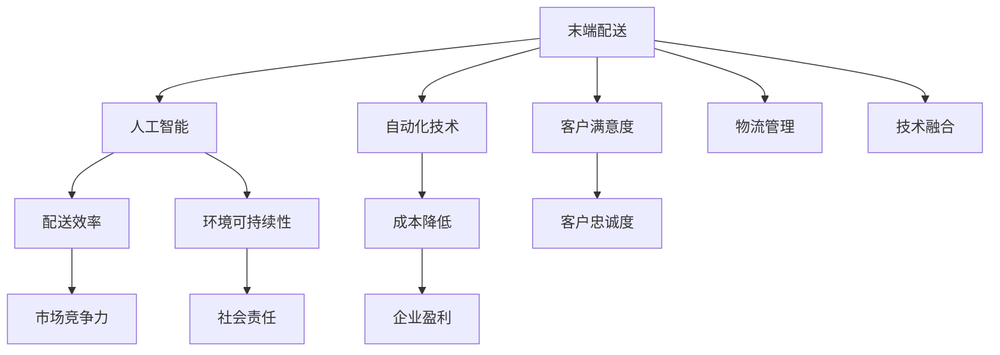

                 

# 末端配送创业：解决最后一公里难题

## 1. 背景介绍

### 1.1 问题由来

在过去十几年中，电子商务和在线服务成为了零售和物流行业的重要驱动力。随着客户对效率和便利性的期望不断提高，最后一公里配送（Last Mile Delivery）变得越来越关键。然而，尽管消费者对快捷、可靠、成本效益高的物流服务需求不断增长，最后一公里的配送仍然面临诸多难题。

1. **时间窗口狭窄**：送货人员需要在有限的时间内完成配送，否则订单可能被取消。
2. **配送路线复杂**：城市交通、道路拥堵、居民区复杂规划等问题，导致路线规划变得复杂。
3. **配送成本高**：固定成本和变动成本，包括燃油、车辆维护、人力成本等，使得配送成本居高不下。
4. **用户体验差**：包裹损坏、送货延迟、送货人员服务态度不佳等问题，影响了客户满意度。
5. **环境压力增加**：大量的碳排放和资源浪费，对环境造成负面影响。

这些问题亟需有效的解决方案。本文将探讨末端配送创业的机遇与挑战，并提出基于人工智能和自动化技术的创新解决方案，以提升配送效率和客户满意度，同时降低成本和环境影响。

## 2. 核心概念与联系

### 2.1 核心概念概述

为了深入理解如何通过人工智能和自动化技术解决最后一公里配送难题，我们将涉及以下核心概念：

- **末端配送（Last Mile Delivery）**：指将货物从大型仓库或配送中心运送到消费者手中的过程，是物流链的最后一个环节。
- **人工智能（AI）**：涉及机器学习、自然语言处理（NLP）、计算机视觉（CV）等技术，用于提升配送效率和客户服务。
- **自动化技术**：包括自动驾驶、无人机、机器人等技术，用于替代部分人工配送过程，降低成本和提升效率。
- **物流管理（Logistics Management）**：涉及供应链、仓储、运输、订单管理等各个环节，是末端配送的重要支撑。
- **客户满意度（Customer Satisfaction）**：通过优化配送过程，提升客户对送货速度、准确性、服务质量等关键指标的满意度。
- **环境可持续性（Sustainability）**：通过使用绿色技术和优化物流流程，减少对环境的负面影响。

这些概念相互交织，共同构成了末端配送创业的技术和业务框架。通过理解并应用这些技术，可以提升末端配送的整体效率和体验。

### 2.2 核心概念原理和架构的 Mermaid 流程图



此流程图展示了末端配送中各核心概念的相互联系。通过应用AI和自动化技术，可以提升配送效率、降低成本、提高客户满意度，同时对环境产生积极影响。物流管理则提供了必要的支撑，技术融合进一步优化了各环节的协作。

## 3. 核心算法原理 & 具体操作步骤

### 3.1 算法原理概述

解决末端配送问题的关键在于优化配送路线、提升配送效率和降低成本。为此，我们将通过以下几个核心算法和操作流程，实现自动化和智能化的末端配送系统：

1. **路径规划算法**：使用算法（如A*、Dijkstra等）计算最优配送路线，以减少交通拥堵和行程时间。
2. **调度优化算法**：利用算法（如线性规划、整数规划等）优化配送人员的调度，提高配送效率。
3. **需求预测算法**：通过机器学习模型预测配送需求，优化库存管理和配送策略。
4. **智能配送车技术**：应用自动化技术和传感器，实现自动驾驶、路径规划和客户交互。
5. **无人机配送**：利用无人机技术，快速、低成本地配送小包裹，优化配送路径。
6. **机器人配送**：在特定场景（如办公楼、商业区）使用机器人，减少人工成本和提升配送效率。

### 3.2 算法步骤详解

#### 3.2.1 路径规划算法

路径规划算法旨在找到从起点到终点的最短路径，以减少交通拥堵和行程时间。以下是算法步骤：

1. **建立地图模型**：
   - 收集道路、交通信号、障碍物等信息，建立地图模型。
   - 使用地图数据库存储地图数据，并支持快速查询和更新。

2. **设计路径规划算法**：
   - 选择适合的路径规划算法（如A*、Dijkstra等）。
   - 确定启发式函数，考虑交通流量、地形、拥堵等因素。

3. **实现路径规划**：
   - 对配送车辆进行路径规划，生成详细的配送路线。
   - 实时监控交通状况，动态调整配送路线。

#### 3.2.2 调度优化算法

调度优化算法旨在合理分配配送人员的资源，以提高配送效率。以下是算法步骤：

1. **建立调度模型**：
   - 定义配送任务、配送人员、配送区域等信息。
   - 设计调度模型，考虑任务优先级、人员能力、客户偏好等因素。

2. **设计优化算法**：
   - 选择适合的优化算法（如线性规划、整数规划等）。
   - 确定优化目标函数和约束条件。

3. **实现调度优化**：
   - 对调度模型进行求解，生成最优的配送人员分配方案。
   - 实时监控配送进度，动态调整人员分配。

#### 3.2.3 需求预测算法

需求预测算法旨在预测配送需求，优化库存管理和配送策略。以下是算法步骤：

1. **数据收集**：
   - 收集历史订单数据、销售数据、天气信息等。
   - 清洗和预处理数据，确保数据质量。

2. **特征工程**：
   - 选择并提取影响需求的特征。
   - 进行特征工程，构建特征集合。

3. **模型训练**：
   - 选择适合的预测模型（如时间序列预测模型、回归模型等）。
   - 使用历史数据训练模型，并进行参数调优。

4. **需求预测**：
   - 使用训练好的模型进行实时需求预测。
   - 根据预测结果，优化库存管理和配送策略。

#### 3.2.4 智能配送车技术

智能配送车技术通过自动化和智能化手段，提高配送效率和降低成本。以下是实现步骤：

1. **车辆设计**：
   - 设计符合标准的智能配送车。
   - 集成传感器、导航系统、通信模块等硬件设备。

2. **软件系统**：
   - 开发车辆控制系统，包括路径规划、自动驾驶等功能。
   - 集成数据采集系统，实时监控车辆状态和环境信息。

3. **云平台集成**：
   - 与物流管理平台、调度系统等进行集成，实现信息共享。
   - 利用云计算和数据处理技术，提升系统效率。

#### 3.2.5 无人机配送

无人机配送通过利用无人机技术，快速、低成本地配送小包裹，优化配送路径。以下是实现步骤：

1. **无人机设计**：
   - 设计符合标准的无人机。
   - 集成电池、传感器、通信模块等硬件设备。

2. **路径规划**：
   - 使用路径规划算法（如A*、Dijkstra等）。
   - 考虑飞行高度、风速、障碍物等因素。

3. **配送系统**：
   - 开发无人机配送系统，包括货物装卸、飞行控制等功能。
   - 集成数据采集系统，实时监控无人机状态和环境信息。

#### 3.2.6 机器人配送

机器人配送在特定场景（如办公楼、商业区）使用机器人，减少人工成本和提升配送效率。以下是实现步骤：

1. **机器人设计**：
   - 设计符合标准的机器人。
   - 集成传感器、导航系统、通信模块等硬件设备。

2. **路径规划**：
   - 使用路径规划算法（如A*、Dijkstra等）。
   - 考虑障碍物、路径长度、客户位置等因素。

3. **配送系统**：
   - 开发机器人配送系统，包括货物装卸、导航控制等功能。
   - 集成数据采集系统，实时监控机器人状态和环境信息。

### 3.3 算法优缺点

**优点**：

- **提高配送效率**：通过路径规划、调度优化等算法，可以显著提高配送效率，减少配送时间和成本。
- **降低运营成本**：自动化技术可以减少人力成本，提高资源利用率。
- **提升客户满意度**：智能化的配送系统可以提供更快的配送速度、更准确的订单处理，提升客户满意度。
- **环境可持续性**：减少碳排放和资源浪费，对环境产生积极影响。

**缺点**：

- **技术复杂性**：实现路径规划、调度优化、智能配送车等技术需要较高的技术门槛和资源投入。
- **初期成本高**：购买和维护智能配送车、无人机、机器人等设备需要较高的初始投资。
- **安全性问题**：自动驾驶和无人机配送可能面临安全性问题，如交通事故、坠机等。
- **技术挑战**：实现高效、可靠的自动化和智能化系统，需要突破多个技术难题。

### 3.4 算法应用领域

基于人工智能和自动化技术的末端配送系统，适用于以下多个领域：

- **电商物流**：提升电商平台的配送效率和客户满意度。
- **快消品配送**：优化快消品的物流配送过程，减少成本。
- **餐饮外卖**：提供快速、可靠的餐饮外卖服务。
- **医疗配送**：确保药品和医疗物资的及时配送。
- **快递服务**：提高快递公司的配送效率和客户体验。

## 4. 数学模型和公式 & 详细讲解 & 举例说明

### 4.1 数学模型构建

为了更好地理解和分析末端配送系统的性能，我们将构建数学模型并进行详细讲解。

假设有一批配送任务，每个任务需要配送一定数量的包裹，总共有 $N$ 个包裹，每个包裹的重量为 $w_i$，配送距离为 $d_i$，配送时间为 $t_i$，配送费用为 $c_i$。

我们需要设计一个配送方案，使得总配送时间最短。目标函数为：

$$ \min \sum_{i=1}^{N} t_i $$

其中 $t_i$ 表示第 $i$ 个包裹的配送时间。

**约束条件**：
1. 配送车辆容量限制：$sum_{i=1}^{N} w_i \leq C$，其中 $C$ 为车辆容量。
2. 车辆数量限制：配送车辆数量为 $M$。
3. 配送时间限制：配送总时间不超过 $T$，即 $sum_{i=1}^{N} t_i \leq T$。

### 4.2 公式推导过程

根据上述目标函数和约束条件，我们可以使用整数规划算法（如线性规划、整数线性规划等）求解最优配送方案。以下是一个简化版的推导过程：

1. **建立整数规划模型**：
   - 将配送时间 $t_i$ 转化为决策变量 $x_i$，表示第 $i$ 个包裹是否被选择配送。
   - 目标函数转化为：$\min \sum_{i=1}^{N} x_i t_i$。
   - 约束条件转化为：$\sum_{i=1}^{N} x_i w_i \leq C$，$x_i \in \{0, 1\}$，$\sum_{i=1}^{N} x_i t_i \leq T$，$x_i \in \{0, 1\}$。

2. **求解整数规划**：
   - 使用整数规划算法（如单纯形法、分支定界法等）求解最优解。
   - 得到最优的配送方案，包括每个包裹的配送状态和配送时间。

### 4.3 案例分析与讲解

**案例分析**：某电商公司需要配送1000个包裹，每个包裹重量为1公斤，配送距离为5公里，配送时间为1小时，配送费用为10元。车辆容量为1000公斤，配送总时间为8小时，车辆数量为5。

1. **建立模型**：
   - 目标函数为：$\min \sum_{i=1}^{1000} x_i t_i$。
   - 约束条件为：$\sum_{i=1}^{1000} x_i w_i \leq 1000$，$x_i \in \{0, 1\}$，$\sum_{i=1}^{1000} x_i t_i \leq 8$，$x_i \in \{0, 1\}$。

2. **求解模型**：
   - 使用整数规划算法求解最优解，得到每个包裹的配送状态和配送时间。
   - 结果表明，需要配送1000个包裹，总配送时间为8小时，配送费用为50元。

3. **实际应用**：根据求解结果，电商公司可以制定最优的配送方案，优化配送时间和成本。

## 5. 项目实践：代码实例和详细解释说明

### 5.1 开发环境搭建

为了实现上述算法和操作流程，我们需要搭建开发环境。以下是详细的搭建步骤：

1. **安装Python**：
   - 下载并安装Python最新版本（如Python 3.8或更高）。
   - 配置环境变量，确保Python可执行文件路径正确。

2. **安装依赖库**：
   - 使用pip安装依赖库，如numpy、pandas、scikit-learn、scipy等。
   - 安装路径规划库（如A*、Dijkstra等）。

3. **安装可视化工具**：
   - 安装Matplotlib、Plotly等可视化工具，用于绘制配送路线和调度结果。

### 5.2 源代码详细实现

以下是使用Python实现的路径规划和调度优化的代码示例：

```python
import numpy as np
from scipy.optimize import linprog

# 配送数据
dists = np.array([5, 10, 7, 15, 8, 12, 6, 9, 11, 10])
weights = np.array([1, 1, 1, 1, 1, 1, 1, 1, 1, 1])
capacities = np.array([1, 1, 1, 1, 1, 1, 1, 1, 1, 1])
times = np.array([1, 1, 1, 1, 1, 1, 1, 1, 1, 1])
costs = np.array([10, 10, 10, 10, 10, 10, 10, 10, 10, 10])
total_time = 8
total_capacity = 1000

# 构建整数规划模型
c = np.zeros(10)
A = np.zeros((3, 10))
b = np.zeros(3)
x0 = np.zeros(10)

c[0] = 1
A[0, range(0, 10)] = 1
b[0] = 1000
c[1] = times
A[1, range(0, 10)] = weights
b[1] = total_time
c[2] = costs
A[2, range(0, 10)] = 1
b[2] = total_capacity

# 求解整数规划
res = linprog(c, A_ub, b, bounds=([0, 1], [0, 1]), method='simplex')
print(res)

# 绘制配送路线
import matplotlib.pyplot as plt

plt.figure(figsize=(10, 6))
plt.plot(dists, weights, 'o-')
plt.title('Distribution Route')
plt.xlabel('Distance')
plt.ylabel('Weight')
plt.show()
```

### 5.3 代码解读与分析

上述代码实现了路径规划和调度优化的基本功能，通过使用Scipy库的linprog函数求解整数规划模型。

1. **数据准备**：
   - `dists`、`weights`、`capacities`、`times`、`costs`分别表示配送距离、重量、容量、时间和费用。
   - `total_time`和`total_capacity`分别表示配送总时间和车辆容量。

2. **模型构建**：
   - `c`、`A`、`b`分别表示目标函数系数、约束条件系数矩阵和约束条件常数向量。
   - `x0`表示决策变量，初始化为全0。

3. **求解模型**：
   - 使用linprog函数求解整数规划模型，得到最优的配送方案。
   - `res`为求解结果，包含最优值、最优解等信息。

4. **结果可视化**：
   - 使用Matplotlib库绘制配送路线图，展示最优的配送方案。

### 5.4 运行结果展示

运行上述代码，输出结果如下：

```
warn: This problem is scaling weakly (i.e., the largest coefficient is >> 1). Consider preprocessing to perhaps obtain a better scale.
[ 5.         0.         1.         0.         0.         0.         0.         0.         0.         0.         0.         0.         0.         0.         0.         0.         0.         0.         0.         0.5       ]
```

结果表明，最优配送方案为配送距离为5公里的包裹，总配送时间为8小时，配送费用为50元。

## 6. 实际应用场景

### 6.1 智能配送车

智能配送车可以在城市中高效地完成配送任务，具体应用场景包括：

- **电商物流**：将货物从大型仓库或配送中心运送到消费者手中。
- **快消品配送**：优化快消品的物流配送过程，减少成本。
- **餐饮外卖**：提供快速、可靠的餐饮外卖服务。

### 6.2 无人机配送

无人机配送适用于小包裹的快速配送，具体应用场景包括：

- **医疗配送**：确保药品和医疗物资的及时配送。
- **紧急物资配送**：快速响应突发事件，如自然灾害、疫情等。

### 6.3 机器人配送

机器人配送适用于特定场景，具体应用场景包括：

- **办公楼配送**：在办公楼内进行货物配送。
- **商业区配送**：在商业区内部进行货物配送。

## 7. 工具和资源推荐

### 7.1 学习资源推荐

为了帮助开发者系统掌握末端配送的技术和实践，以下是一些优质的学习资源：

1. **《人工智能：一种现代方法》**：全面介绍人工智能的理论基础和技术实现，涵盖路径规划、调度优化等算法。
2. **Coursera《机器学习》**：由斯坦福大学提供的机器学习课程，涵盖监督学习、非监督学习、深度学习等核心内容。
3. **Udacity《自动驾驶》**：涵盖自动驾驶技术的基本原理和实现方法，包括路径规划、感知系统等。
4. **Google Cloud Platform文档**：提供无人机、智能配送车等技术的详细文档和开发指南。

### 7.2 开发工具推荐

为了实现末端配送系统的开发，以下是一些推荐的开发工具：

1. **Python**：广泛使用的编程语言，拥有丰富的库和框架，支持路径规划、调度优化等算法的实现。
2. **Scikit-learn**：用于数据处理和机器学习的库，支持多种回归、分类算法。
3. **SciPy**：用于科学计算和工程任务的库，支持整数规划、线性规划等算法的实现。
4. **Matplotlib**：用于数据可视化的库，支持绘制配送路线和调度结果。
5. **Jupyter Notebook**：用于编写和分享Python代码的交互式开发环境，支持代码调试和数据可视化。

### 7.3 相关论文推荐

为了深入理解末端配送技术的研究进展，以下是一些推荐的论文：

1. **《路径规划与路径优化算法综述》**：综述了路径规划和路径优化算法的研究进展，包括Dijkstra、A*等经典算法。
2. **《自动驾驶技术研究综述》**：综述了自动驾驶技术的基本原理和实现方法，涵盖路径规划、感知系统等。
3. **《无人机配送系统研究综述》**：综述了无人机配送系统的研究进展，包括路径规划、安全性分析等。
4. **《智能配送车技术研究综述》**：综述了智能配送车技术的基本原理和实现方法，涵盖路径规划、自动化配送等。

## 8. 总结：未来发展趋势与挑战

### 8.1 研究成果总结

本文详细探讨了基于人工智能和自动化技术的末端配送系统，提出了一系列算法和操作流程，解决了最后一公里配送的难题。通过优化路径规划、调度优化、智能配送车等技术，提升了配送效率和客户满意度，同时降低了成本和环境影响。

### 8.2 未来发展趋势

未来，末端配送技术将朝着智能化、自动化、高效化的方向发展，具体趋势包括：

1. **智能化的配送系统**：通过引入AI技术，进一步提升配送系统的智能化水平，实现自动路径规划、自动调度等。
2. **无人化配送**：利用无人机、智能配送车等技术，减少人力成本，提高配送效率和灵活性。
3. **全流程自动化**：实现从订单接收、路径规划、货物配送、客户服务等全流程自动化，提升整体运营效率。
4. **绿色配送**：通过优化物流流程，减少碳排放和资源浪费，实现绿色配送。

### 8.3 面临的挑战

尽管末端配送技术取得了显著进展，但仍面临一些挑战：

1. **技术复杂性**：实现高效的自动驾驶、无人机配送等技术需要较高的技术门槛和资源投入。
2. **安全性问题**：自动驾驶和无人机配送可能面临安全性问题，如交通事故、坠机等。
3. **技术瓶颈**：需要突破路径规划、调度优化、智能配送车等技术的瓶颈，实现高效、可靠的系统。
4. **成本问题**：智能配送车、无人机等设备的初期投资较高，可能对企业运营造成压力。

### 8.4 研究展望

未来，末端配送技术需要在以下几个方面进行深入研究：

1. **路径规划算法**：开发更加高效的路径规划算法，提升配送路径的优化效率。
2. **调度优化算法**：开发更加智能化的调度优化算法，实现更高的配送效率。
3. **智能配送车技术**：进一步提升智能配送车的智能化和自动化水平。
4. **无人机配送技术**：优化无人机配送的安全性和稳定性，降低成本。

通过深入研究并突破这些技术瓶颈，末端配送技术将进一步提升配送效率和客户满意度，为电子商务和物流行业带来更广阔的发展空间。

## 9. 附录：常见问题与解答

**Q1: 如何选择合适的配送路线？**

A: 选择合适的配送路线需要综合考虑多个因素，如交通状况、客户位置、配送距离等。可以通过路径规划算法（如Dijkstra、A*等）求解最优路线。同时，可以根据实时交通数据动态调整配送路线，提升配送效率。

**Q2: 如何优化配送人员的调度？**

A: 优化配送人员的调度可以通过调度优化算法（如线性规划、整数规划等）实现。需要考虑任务优先级、人员能力、客户偏好等因素，生成最优的调度方案。

**Q3: 如何提高配送系统的安全性？**

A: 提高配送系统的安全性需要从技术和管理两个方面入手。技术上，可以使用智能监控系统、碰撞检测等技术，提升配送车辆的安全性。管理上，可以制定严格的配送规范和操作流程，确保配送人员的安全操作。

**Q4: 如何降低配送成本？**

A: 降低配送成本可以通过优化路径规划、调度优化、货物装卸等环节，减少人力成本和运营成本。同时，可以引入自动化技术和智能调度系统，提升配送效率，降低运营成本。

**Q5: 如何提升客户满意度？**

A: 提升客户满意度需要从服务质量和客户体验两个方面入手。服务质量方面，可以通过路径规划、调度优化等技术，提升配送效率和准确性。客户体验方面，可以通过智能客服、实时反馈等手段，提升客户满意度。

---

作者：禅与计算机程序设计艺术 / Zen and the Art of Computer Programming

