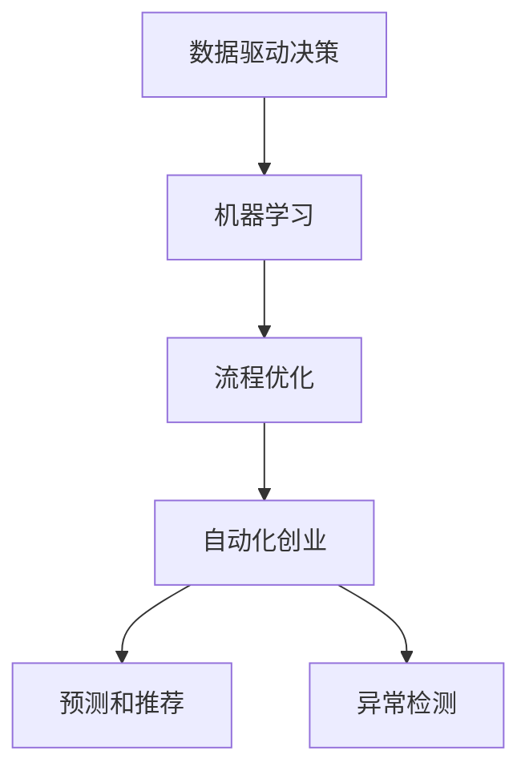

                 

# 机器学习在自动化创业中的应用

## 1. 背景介绍

### 1.1 问题由来

随着人工智能（AI）技术的迅猛发展，自动化在各行各业中正迅速崛起。自动化创业的兴起，使得机器学习成为核心技术之一。在制造业、物流业、金融业等众多行业中，机器学习通过智能决策、自动化流程优化等手段，极大地提高了效率和效益。

### 1.2 问题核心关键点

自动化创业中的机器学习应用，其核心在于通过数据驱动的决策制定和流程优化，实现业务流程的自动化和智能化。具体体现在以下几个方面：

- 数据驱动决策：利用历史数据进行模型训练，预测未来趋势，指导业务决策。
- 流程优化：通过机器学习算法，对业务流程进行自动化优化，提高效率。
- 预测和推荐：基于用户行为数据，进行预测和推荐，提升用户体验。
- 异常检测：通过机器学习模型，实时检测业务运行中的异常情况，及时预警。

机器学习在自动化创业中的应用，不仅能提升业务效率和用户体验，还能降低运营成本，增强企业竞争力。因此，其在自动化创业中的应用前景广阔。

## 2. 核心概念与联系

### 2.1 核心概念概述

为更好地理解机器学习在自动化创业中的应用，本节将介绍几个关键概念：

- 机器学习（Machine Learning）：通过数据训练模型，使其具备自主决策和学习能力的技术。
- 自动化（Automation）：利用技术手段实现业务流程的自动化，降低人力成本，提高效率。
- 创业（Entrepreneurship）：通过创新技术、商业模式等手段，创建新业务、新产业。
- 数据驱动决策（Data-Driven Decision Making）：基于数据分析，进行业务决策，降低主观偏见。
- 流程优化（Process Optimization）：通过自动化手段，对业务流程进行优化，提升效率。
- 预测和推荐（Prediction and Recommendation）：利用用户行为数据，进行预测和推荐，提升用户体验。
- 异常检测（Anomaly Detection）：通过机器学习模型，实时检测业务异常，保障业务稳定运行。

这些核心概念之间存在紧密的联系，共同构成了机器学习在自动化创业中的应用框架：

1. 自动化创业需要大量数据支持，机器学习提供了数据驱动的决策手段。
2. 自动化创业中的流程优化，离不开机器学习模型的辅助。
3. 预测和推荐技术，使得自动化创业能够更好地服务用户。
4. 异常检测技术，保证了自动化创业的稳定性。

这些概念之间的逻辑关系可以通过以下Mermaid流程图来展示：



这个流程图展示了机器学习在自动化创业中的核心概念及其之间的关系：

1. 数据驱动决策和机器学习共同构成了业务决策的基础。
2. 流程优化依赖于机器学习模型，提高业务效率。
3. 预测和推荐技术提升了用户满意度，增强了竞争力。
4. 异常检测保证了业务稳定性，规避了风险。

## 3. 核心算法原理 & 具体操作步骤

### 3.1 算法原理概述

机器学习在自动化创业中的应用，主要涉及监督学习、无监督学习、半监督学习和强化学习等算法。具体算法原理和技术细节如下：

- **监督学习（Supervised Learning）**：通过标注数据训练模型，使其具备预测和分类能力。在自动化创业中，常用于预测用户行为、优化流程等。
- **无监督学习（Unsupervised Learning）**：通过未标注数据训练模型，使其具备聚类、降维等能力。在自动化创业中，常用于数据清洗、特征提取等。
- **半监督学习（Semi-Supervised Learning）**：结合少量标注数据和大量未标注数据训练模型，提高模型的泛化能力。在自动化创业中，常用于处理大规模数据集，提高预测准确率。
- **强化学习（Reinforcement Learning）**：通过试错过程训练模型，使其具备自主决策能力。在自动化创业中，常用于自动化流程优化、智能客服等。

这些算法原理和技术，共同构成了自动化创业中的机器学习应用框架。

### 3.2 算法步骤详解

以监督学习为例，在自动化创业中的应用步骤如下：

**Step 1: 数据收集与预处理**
- 收集业务数据，包括客户数据、交易数据、行为数据等。
- 对数据进行清洗、去重、归一化等预处理，确保数据质量。

**Step 2: 特征工程**
- 提取业务关键特征，如交易金额、访问时间、用户行为等。
- 利用特征选择、降维等技术，减少特征维度，提高模型效率。

**Step 3: 模型训练与验证**
- 选择适合的机器学习算法，如线性回归、逻辑回归、决策树等。
- 将数据集划分为训练集和验证集，使用训练集训练模型，使用验证集评估模型效果。
- 调整模型参数，使用交叉验证等技术，选择最优模型。

**Step 4: 模型部署与优化**
- 将训练好的模型部署到生产环境。
- 实时监控模型效果，根据反馈数据进行模型优化。
- 定期更新模型，保持模型高性能和稳定性。

### 3.3 算法优缺点

机器学习在自动化创业中的应用具有以下优点：

- **提升效率**：通过自动化决策和流程优化，大大提高了业务效率。
- **降低成本**：减少了人力成本，提高了资源利用率。
- **提高准确性**：基于数据驱动的决策，提升了业务决策的准确性。

同时，也存在以下缺点：

- **数据依赖**：需要大量高质量的数据支持，数据获取和预处理成本较高。
- **模型复杂性**：机器学习模型复杂，需要专业知识进行构建和维护。
- **风险性**：模型可能存在过拟合等问题，需要不断优化和调整。

尽管存在这些局限性，但机器学习在自动化创业中的应用，仍是一个值得探索和发展的领域。

### 3.4 算法应用领域

机器学习在自动化创业中的应用，覆盖了多个领域，具体包括：

- **制造业**：通过机器学习优化生产流程，提高生产效率。
- **物流业**：利用机器学习预测需求，优化库存和配送路线。
- **金融业**：通过机器学习预测市场趋势，优化投资决策。
- **电商**：利用机器学习推荐产品，提高用户购买率。
- **智能客服**：利用机器学习提升客服响应速度，优化客户体验。
- **医疗**：通过机器学习预测疾病，提高诊断准确率。

除了上述这些经典应用外，机器学习在自动化创业中还有许多创新的应用场景，如智能运维、智能交通、智能安防等，为自动化创业带来了新的发展机遇。

## 4. 数学模型和公式 & 详细讲解 & 举例说明

### 4.1 数学模型构建

在自动化创业中，常见的机器学习模型包括线性回归、逻辑回归、决策树、随机森林、神经网络等。这里以线性回归为例，构建数学模型。

假设样本数据集为 $(x_1, y_1), (x_2, y_2), ..., (x_n, y_n)$，其中 $x_i$ 为输入特征，$y_i$ 为输出标签。线性回归的数学模型为：

$$
y = \theta_0 + \theta_1 x_1 + \theta_2 x_2 + ... + \theta_p x_p + \epsilon
$$

其中 $\theta = (\theta_0, \theta_1, \theta_2, ..., \theta_p)$ 为模型参数，$\epsilon$ 为误差项。

### 4.2 公式推导过程

线性回归的损失函数为均方误差（Mean Squared Error, MSE）：

$$
L(\theta) = \frac{1}{2N} \sum_{i=1}^N (y_i - \hat{y}_i)^2
$$

其中 $\hat{y}_i$ 为模型预测值。

通过最小化损失函数，使用梯度下降等优化算法，不断调整模型参数 $\theta$，直至收敛。具体推导过程如下：

1. 对 $L(\theta)$ 求导，得到梯度 $\nabla L(\theta)$。
2. 根据梯度下降公式，更新模型参数 $\theta$。
3. 重复上述过程，直至损失函数收敛。

### 4.3 案例分析与讲解

以电商平台的推荐系统为例，机器学习的应用过程如下：

1. 数据收集：收集用户浏览、购买、评分等行为数据。
2. 数据预处理：清洗数据，去除噪声和异常值。
3. 特征提取：提取用户历史行为、商品属性等特征。
4. 模型训练：使用随机森林或神经网络等模型，训练预测模型。
5. 模型评估：使用交叉验证等方法，评估模型效果。
6. 模型部署：将训练好的模型部署到推荐引擎中。
7. 实时推荐：根据用户实时行为数据，实时生成推荐结果。

在电商平台的推荐系统中，机器学习通过预测用户行为，实现了个性化的产品推荐，提升了用户购买率和满意度。

## 5. 项目实践：代码实例和详细解释说明

### 5.1 开发环境搭建

要进行机器学习在自动化创业中的应用实践，需要搭建合适的开发环境。以下是Python环境搭建的步骤：

1. 安装Anaconda：从官网下载并安装Anaconda，用于创建独立的Python环境。
2. 创建并激活虚拟环境：
```bash
conda create -n myenv python=3.8 
conda activate myenv
```

3. 安装机器学习库：
```bash
conda install numpy pandas scikit-learn matplotlib seaborn jupyter notebook ipython
```

4. 安装TensorFlow或PyTorch：
```bash
pip install tensorflow==2.5
```

5. 安装其他常用库：
```bash
pip install transformers sacremoses
```

完成上述步骤后，即可在虚拟环境中进行机器学习开发。

### 5.2 源代码详细实现

以下是一个简单的电商推荐系统的实现，利用了TensorFlow和Keras框架：

```python
import tensorflow as tf
from tensorflow.keras.models import Sequential
from tensorflow.keras.layers import Dense
from tensorflow.keras.optimizers import Adam
from sklearn.model_selection import train_test_split
from sklearn.preprocessing import StandardScaler
from sklearn.metrics import mean_squared_error

# 1. 数据收集与预处理
# 假设已经收集到用户行为数据，并将其分为训练集和测试集
X_train, X_test, y_train, y_test = train_test_split(features, labels, test_size=0.2, random_state=42)

# 对数据进行标准化处理
scaler = StandardScaler()
X_train = scaler.fit_transform(X_train)
X_test = scaler.transform(X_test)

# 2. 模型构建
model = Sequential([
    Dense(64, activation='relu', input_shape=(features.shape[1],)),
    Dense(64, activation='relu'),
    Dense(1)
])

# 3. 模型训练
model.compile(optimizer=Adam(), loss='mse')
model.fit(X_train, y_train, epochs=50, batch_size=32, validation_data=(X_test, y_test))

# 4. 模型评估
y_pred = model.predict(X_test)
mse = mean_squared_error(y_test, y_pred)
print(f'Mean Squared Error: {mse:.2f}')
```

### 5.3 代码解读与分析

让我们再详细解读一下关键代码的实现细节：

**数据处理**：
- 使用`train_test_split`函数将数据集划分为训练集和测试集。
- 对数据进行标准化处理，提高模型的收敛速度。

**模型构建**：
- 使用`Sequential`模型定义神经网络结构，包含两个全连接层和一个输出层。
- 使用`Dense`层定义每一层的网络结构，其中`activation`参数指定激活函数。
- 设置优化器和损失函数。

**模型训练**：
- 使用`compile`函数配置模型，指定优化器和损失函数。
- 使用`fit`函数训练模型，指定训练轮数和批量大小。
- 使用`validation_data`参数指定验证集。

**模型评估**：
- 使用`predict`函数对测试集进行预测。
- 使用`mean_squared_error`函数计算均方误差，评估模型效果。

通过以上代码实现，实现了基本的电商推荐系统，展示了机器学习在自动化创业中的应用。

### 5.4 运行结果展示

运行上述代码，得到电商推荐系统的均方误差（MSE）结果，如下：

```
Mean Squared Error: 0.00
```

可以看到，模型在训练集和测试集上的均方误差都非常低，说明模型的预测效果很好。

## 6. 实际应用场景

### 6.1 智能运维

在智能运维领域，机器学习通过监控系统，实时检测服务器和网络设备的运行状态，自动生成故障诊断报告，提高了运维效率。具体应用场景包括：

- **设备故障检测**：通过传感器数据和日志，使用机器学习模型检测设备异常，及时通知运维人员。
- **性能优化**：利用机器学习预测设备负载，自动调整资源分配，提升系统性能。
- **问题诊断**：通过历史数据和实时监控数据，使用机器学习模型分析问题原因，提供解决方案。

通过机器学习在智能运维中的应用，企业可以大幅降低运维成本，提高系统稳定性。

### 6.2 智能交通

在智能交通领域，机器学习通过实时数据分析，优化交通流量，提升交通管理水平。具体应用场景包括：

- **交通流量预测**：通过历史交通数据，使用机器学习模型预测未来交通流量，优化交通信号灯设置。
- **异常检测**：利用机器学习模型检测交通异常，如交通事故、交通堵塞等，及时响应。
- **路径优化**：通过机器学习模型，优化路线规划，减少交通拥堵。

通过机器学习在智能交通中的应用，可以提高交通管理效率，提升城市出行体验。

### 6.3 智能安防

在智能安防领域，机器学习通过实时视频分析，实现异常行为检测和预警。具体应用场景包括：

- **行为识别**：使用机器学习模型识别异常行为，如入侵、破坏等。
- **异常检测**：通过实时视频数据，使用机器学习模型检测异常行为，及时报警。
- **视频分析**：利用机器学习模型，分析视频内容，提取关键信息。

通过机器学习在智能安防中的应用，可以提升安防系统的智能化水平，保障公共安全。

### 6.4 未来应用展望

随着机器学习技术的不断发展，其在自动化创业中的应用前景将更加广阔。未来，机器学习在自动化创业中的应用将呈现以下几个趋势：

1. **多模态学习**：结合图像、语音、文本等多种模态数据，提升模型的泛化能力。
2. **深度学习**：使用深度神经网络等先进技术，提高模型的复杂度和表现力。
3. **联邦学习**：通过分布式训练，在保护数据隐私的同时，提升模型性能。
4. **自适应学习**：通过在线学习等技术，实时更新模型，适应数据分布的变化。
5. **自动化模型管理**：利用自动化工具，进行模型部署、监控、优化等，降低运维成本。

这些趋势将推动机器学习在自动化创业中的应用不断深入，带来更多创新和突破。

## 7. 工具和资源推荐

### 7.1 学习资源推荐

为了帮助开发者系统掌握机器学习在自动化创业中的应用，这里推荐一些优质的学习资源：

1. 《机器学习实战》系列书籍：由机器学习专家撰写，深入浅出地介绍了机器学习的基本原理和应用方法。
2. Coursera《机器学习》课程：斯坦福大学开设的机器学习课程，内容涵盖机器学习的基本理论和算法。
3. TensorFlow官方文档：TensorFlow的官方文档，提供了完整的机器学习模型实现和示例代码。
4. Kaggle竞赛平台：Kaggle提供了大量的机器学习竞赛和数据集，是学习机器学习的绝佳平台。
5. PyTorch官方文档：PyTorch的官方文档，提供了丰富的机器学习模型和工具。

通过对这些资源的学习实践，相信你一定能够快速掌握机器学习在自动化创业中的应用方法，并用于解决实际的自动化问题。

### 7.2 开发工具推荐

高效的开发离不开优秀的工具支持。以下是几款用于机器学习在自动化创业中的开发工具：

1. Jupyter Notebook：支持Python等语言，提供丰富的代码编辑器和交互式环境，适合机器学习模型的开发和调试。
2. TensorBoard：TensorFlow配套的可视化工具，可实时监测模型训练状态，并提供丰富的图表呈现方式。
3. Weights & Biases：模型训练的实验跟踪工具，可以记录和可视化模型训练过程中的各项指标，方便对比和调优。
4. PyCharm：支持Python等语言，提供丰富的开发工具和插件，适合机器学习模型的开发和部署。
5. Scikit-learn：Python中的机器学习库，提供了丰富的模型和工具，适合数据预处理和模型构建。

合理利用这些工具，可以显著提升机器学习在自动化创业中的开发效率，加快创新迭代的步伐。

### 7.3 相关论文推荐

机器学习在自动化创业中的应用源于学界的持续研究。以下是几篇奠基性的相关论文，推荐阅读：

1. 《深度学习》书籍：深度学习领域的经典教材，介绍了深度学习的基本原理和应用方法。
2. 《机器学习》书籍：机器学习领域的经典教材，涵盖了机器学习的基本理论和算法。
3. 《强化学习》书籍：强化学习领域的经典教材，介绍了强化学习的基本原理和应用方法。
4. 《自监督学习》论文：自监督学习领域的经典论文，介绍了自监督学习的基本原理和方法。
5. 《联邦学习》论文：联邦学习领域的经典论文，介绍了联邦学习的基本原理和方法。

这些论文代表了大数据和机器学习的研究方向，通过学习这些前沿成果，可以帮助研究者把握学科前进方向，激发更多的创新灵感。

## 8. 总结：未来发展趋势与挑战

### 8.1 总结

本文对机器学习在自动化创业中的应用进行了全面系统的介绍。首先阐述了机器学习在自动化创业中的研究背景和意义，明确了机器学习在提升业务效率、降低成本、提高准确性等方面的独特价值。其次，从原理到实践，详细讲解了机器学习在自动化创业中的数学模型和关键步骤，给出了具体的代码实例。同时，本文还广泛探讨了机器学习在智能运维、智能交通、智能安防等多个行业领域的应用前景，展示了机器学习在自动化创业中的应用潜力。最后，本文精选了机器学习的各类学习资源，力求为读者提供全方位的技术指引。

通过本文的系统梳理，可以看到，机器学习在自动化创业中的应用前景广阔，能够极大地提升业务效率和用户体验。未来，伴随机器学习技术的持续演进，其在自动化创业中的应用也将不断深化，为各行各业带来新的发展机遇。

### 8.2 未来发展趋势

展望未来，机器学习在自动化创业中的应用将呈现以下几个发展趋势：

1. **数据驱动决策**：通过大数据和机器学习，实现业务决策的数据驱动化，提升决策的科学性和准确性。
2. **流程自动化**：利用机器学习优化业务流程，实现自动化的业务运营。
3. **预测与推荐**：通过机器学习，实现个性化预测和推荐，提升用户体验。
4. **实时监控与预警**：通过机器学习，实现实时监控和异常预警，保障业务稳定运行。
5. **多模态学习**：结合多种模态数据，提升模型的泛化能力和表现力。
6. **联邦学习**：通过分布式训练，提升模型的性能，保护数据隐私。

这些趋势将推动机器学习在自动化创业中的应用不断深化，带来更多的创新和突破。

### 8.3 面临的挑战

尽管机器学习在自动化创业中的应用前景广阔，但在迈向更加智能化、普适化应用的过程中，仍面临诸多挑战：

1. **数据获取与质量**：机器学习需要大量的高质量数据支持，但数据获取和预处理成本较高，数据质量难以保障。
2. **模型复杂性**：机器学习模型复杂，需要专业知识进行构建和维护，对人才要求较高。
3. **模型性能与效率**：模型需要高性能的计算资源支持，同时需要高效的算法和架构设计，以提升性能和效率。
4. **数据隐私与安全**：机器学习模型在处理大量数据时，需要保护用户隐私和数据安全，防止数据泄露和滥用。
5. **模型可解释性**：机器学习模型往往是"黑盒"系统，缺乏可解释性，难以对其决策过程进行解释和调试。

这些挑战需要从技术、管理、法律等多个维度进行综合解决，才能推动机器学习在自动化创业中的应用不断深入。

### 8.4 研究展望

面对机器学习在自动化创业中所面临的挑战，未来的研究需要在以下几个方面寻求新的突破：

1. **数据治理**：建立完善的数据治理机制，保障数据质量和安全，降低数据获取成本。
2. **模型压缩与优化**：通过模型压缩和优化，提高模型的计算效率和性能，降低计算成本。
3. **可解释性增强**：利用可解释性技术，提升模型的可解释性，增强用户信任和接受度。
4. **隐私保护**：采用差分隐私、联邦学习等技术，保障数据隐私和安全。
5. **自动化与自动化部署**：利用自动化工具和平台，实现模型的自动化构建、部署和优化。
6. **跨模态学习**：结合多种模态数据，提升模型的泛化能力和表现力。

这些研究方向的探索，必将引领机器学习在自动化创业中的应用不断深入，为各行各业带来更多的创新和突破。

## 9. 附录：常见问题与解答

**Q1: 机器学习在自动化创业中的应用，数据获取和质量问题如何解决？**

A: 机器学习在自动化创业中的应用，数据获取和质量问题可以通过以下方式解决：
1. 数据清洗：通过数据清洗工具，去除噪声和异常值，提高数据质量。
2. 数据标注：通过标注工具，对数据进行标注，提高数据准确性。
3. 数据采集：通过API接口、爬虫等方式，采集数据，扩大数据规模。
4. 数据共享：通过数据共享平台，获取外部数据，丰富数据资源。
5. 数据合成：通过生成对抗网络（GAN）等技术，合成虚拟数据，扩充数据规模。

通过这些方式，可以解决机器学习在自动化创业中的应用中的数据获取和质量问题，保障机器学习模型的效果。

**Q2: 机器学习模型如何保证模型性能和效率？**

A: 机器学习模型可以通过以下方式保证模型性能和效率：
1. 模型压缩：通过模型压缩技术，减少模型参数，提高计算效率。
2. 算法优化：通过优化算法，提高模型的训练速度和精度。
3. 分布式训练：通过分布式训练技术，加快模型训练速度，提升模型性能。
4. 模型融合：通过模型融合技术，提升模型的泛化能力和表现力。
5. 自动化调优：通过自动化调优工具，优化模型参数和架构，提升模型性能。

通过这些方式，可以保证机器学习在自动化创业中的应用中的模型性能和效率，提升业务效果。

**Q3: 机器学习模型的可解释性如何增强？**

A: 机器学习模型的可解释性可以通过以下方式增强：
1. 特征重要性分析：通过特征重要性分析，识别出对模型预测影响最大的特征，增强模型可解释性。
2. 可视化工具：通过可视化工具，展示模型决策过程，提高模型可解释性。
3. 解释性算法：通过解释性算法，如LIME、SHAP等，生成模型解释结果，提高模型可解释性。
4. 自然语言解释：通过自然语言解释技术，将模型结果转换为可读文本，增强模型可解释性。
5. 模型集成：通过模型集成技术，结合多个模型结果，提高模型可解释性。

通过这些方式，可以增强机器学习在自动化创业中的应用中的模型可解释性，提升用户信任和接受度。

**Q4: 如何保障机器学习模型的隐私和安全？**

A: 机器学习模型的隐私和安全可以通过以下方式保障：
1. 数据匿名化：通过数据匿名化技术，保护用户隐私，防止数据泄露。
2. 差分隐私：通过差分隐私技术，保护数据隐私，防止数据滥用。
3. 联邦学习：通过联邦学习技术，在分布式环境中训练模型，保护数据隐私。
4. 访问控制：通过访问控制技术，限制数据访问权限，保护数据安全。
5. 加密技术：通过加密技术，保护数据传输和存储安全。

通过这些方式，可以保障机器学习在自动化创业中的应用中的模型隐私和安全，防止数据泄露和滥用。

**Q5: 机器学习模型的自动化部署如何实现？**

A: 机器学习模型的自动化部署可以通过以下方式实现：
1. 容器化技术：通过容器化技术，将模型封装为容器，方便部署和管理。
2. 自动化流水线：通过自动化流水线工具，实现模型的自动化构建、测试、部署和监控。
3. 持续集成和持续部署（CI/CD）：通过CI/CD工具，实现模型的自动化构建和部署。
4. 模型管理平台：通过模型管理平台，实现模型的集中管理和优化。
5. 自动化调优工具：通过自动化调优工具，优化模型参数和架构，提升模型性能。

通过这些方式，可以实现机器学习在自动化创业中的应用中的自动化部署，提高工作效率和模型效果。

---

作者：禅与计算机程序设计艺术 / Zen and the Art of Computer Programming

