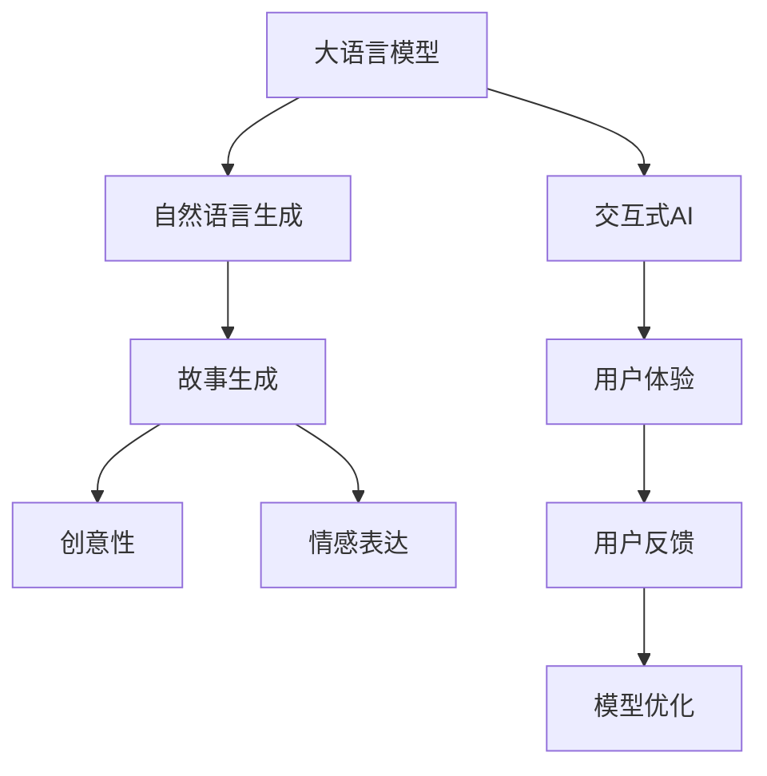

                 

# 构建一个 Storyteller AI 大语言模型 (LLM)

> 关键词：Storytelling, AI, Large Language Model, Natural Language Generation, Creative Writing, Transformer, GPT, Text Generation, Neural Network

## 1. 背景介绍

### 1.1 问题由来
故事是人类的重要沟通方式，也是文化传承的重要载体。然而，随着技术的进步，尤其是人工智能的崛起，如何让机器更好地理解和生成故事，成为了一个前沿且有意义的研究方向。大语言模型（Large Language Model, LLM）的出现，为这一目标提供了可能。通过深度学习和大规模预训练，LLM能够学习到丰富的语言知识，并具备一定的生成能力。在此基础上，如何构建一个能够像人类一样讲述故事，且具有一定创意的AI，成为了当前研究的热点。

### 1.2 问题核心关键点
构建一个能够讲述故事的AI，首先需要一个强大的语言模型作为基础。当前，预训练的大语言模型，如GPT系列、BERT等，已经在大规模文本数据上进行过预训练，具备了一定的语言生成能力。然而，这些模型更多关注于语言结构的准确性和丰富性，而对于故事的创意性和情感表达，还需进一步提升。

为此，本论文聚焦于如何构建一个能够像人类一样讲述故事，同时具备一定创意性和情感表达的AI大语言模型。其核心关键点包括：
1. 如何构建一个能够理解故事背景、主题和人物关系的模型。
2. 如何提升模型的创意性和情感表达能力，使故事具备人类般的连贯性和感染力。
3. 如何在故事生成过程中，整合人类的创意和AI的生成能力，形成更具有竞争力的产品。

## 2. 核心概念与联系

### 2.1 核心概念概述

构建一个故事讲述AI，涉及几个核心概念：

- 大语言模型(Large Language Model, LLM)：以自回归模型如GPT为代表的大规模预训练语言模型，能够学习到丰富的语言知识，具备一定的生成能力。
- 自然语言生成(Natural Language Generation, NLG)：指使用机器自动生成自然语言文本的技术。
- 故事生成(Story Generation)：使用机器自动生成具有连贯性和感染力的故事文本。
- 创意性(Creativity)：指故事中的新奇、创新和独创性。
- 情感表达(Emotion Expression)：指故事中对人物情感和情节情感的细腻刻画。
- 交互式AI(Interactive AI)：指能够与人类用户进行自然语言交互的AI。

这些概念之间的逻辑关系可以通过以下Mermaid流程图来展示：



该流程图展示了从大语言模型到故事生成的过程，以及创意性和情感表达的融入，最终通过用户反馈和模型优化不断迭代。

### 2.2 核心概念原理和架构

#### 2.2.1 大语言模型原理

大语言模型通过在大规模无标签文本数据上进行自监督学习，学习到通用的语言表示。常见的预训练任务包括语言模型、掩码语言模型等。其核心原理是通过大量数据的训练，使得模型能够预测下一个词或掩码位置的概率，从而学习到语言的统计规律和语义信息。

以GPT-2为例，其结构包括一个Transformer编码器和一个Softmax解码器。编码器将输入序列编码成高维向量表示，解码器根据向量表示生成下一个词或字符。在预训练阶段，模型首先学习语言模型的概率，即预测下一个词的概率。然后，通过掩码语言模型训练，模型进一步学习到掩码位置的语义信息。

#### 2.2.2 自然语言生成原理

自然语言生成通常基于大语言模型的编码器部分，将输入的文本信息编码为高维向量，再通过解码器生成目标文本。常见的生成模型包括Seq2Seq、Transformer等。其核心原理是利用深度神经网络，将输入序列映射到目标序列，生成连贯且符合语法和语义规则的文本。

以Seq2Seq模型为例，其结构包括编码器和解码器两个部分。编码器将输入序列映射为高维向量表示，解码器根据向量表示逐步生成目标序列。在训练过程中，模型通过最大化目标序列的概率，学习到输入和输出之间的关系。

#### 2.2.3 故事生成原理

故事生成是自然语言生成的一个特殊领域，要求生成的文本不仅连贯、符合语法和语义规则，还要具备一定的创意性和情感表达。为此，故事生成模型通常需要在预训练基础上，进一步微调以适应特定的任务需求。常见的微调方法包括参数高效微调、提示学习等。

以GPT-3为例，其通过在大规模故事语料上进行微调，学习到故事生成的关键特征。微调过程中，模型通过预测故事的下一个句子或段落，学习到故事的结构、主题、人物关系等。通过进一步的微调和优化，模型可以生成连贯、有创意、情感丰富的故事文本。

## 3. 核心算法原理 & 具体操作步骤

### 3.1 算法原理概述

构建一个故事讲述AI的核心算法原理基于自然语言生成（NLG）和故事生成（Story Generation）两个方向。

#### 3.1.1 自然语言生成原理

自然语言生成的核心算法基于Transformer结构，包括编码器和解码器两部分。编码器将输入序列映射为高维向量表示，解码器根据向量表示逐步生成目标序列。在训练过程中，模型通过最大化目标序列的概率，学习到输入和输出之间的关系。

#### 3.1.2 故事生成原理

故事生成通常需要在预训练的基础上，进一步微调以适应特定的任务需求。常见的微调方法包括参数高效微调、提示学习等。通过这些方法，模型可以更好地学习到故事的结构、主题、人物关系等关键特征，生成连贯、有创意、情感丰富的故事文本。

### 3.2 算法步骤详解

构建一个故事讲述AI的算法步骤主要包括以下几个关键步骤：

**Step 1: 准备数据集和模型**

- 准备一个大规模的故事语料库，作为预训练和微调的数据集。
- 选择合适的大语言模型作为初始化参数，如GPT系列、BERT等。

**Step 2: 预训练和微调**

- 在大规模故事语料上，对预训练模型进行自监督学习，学习到故事的结构、主题、人物关系等特征。
- 在微调阶段，使用小规模标注数据集，对模型进行有监督学习，进一步提升故事生成的连贯性和创意性。

**Step 3: 创意性和情感表达的融入**

- 在故事生成的过程中，结合人类的创意和AI的生成能力，形成更具创意和情感表达的文本。
- 引入情感词典和情感标注数据，指导模型在生成过程中对情感进行细腻刻画。

**Step 4: 用户反馈和模型优化**

- 构建交互式AI，与用户进行自然语言交互，获取用户反馈。
- 根据用户反馈，不断优化模型参数和训练策略，提升故事生成的质量。

**Step 5: 实际应用**

- 将模型部署到实际应用场景中，如小说生成、故事创作等。
- 实时接收用户输入，生成创意性和情感丰富的故事文本。

### 3.3 算法优缺点

#### 3.3.1 优点

构建一个故事讲述AI具有以下优点：

1. 高效性：基于大语言模型的预训练和微调，可以在较短的时间内构建具有强大生成能力的故事讲述AI。
2. 创意性和情感表达：结合人类的创意和AI的生成能力，故事讲述AI可以生成连贯、有创意、情感丰富的文本。
3. 可扩展性：故事讲述AI可以通过不断收集用户反馈和数据，不断优化提升。
4. 广泛应用：故事讲述AI可以应用于小说生成、故事创作、游戏剧情生成等多个领域。

#### 3.3.2 缺点

构建一个故事讲述AI也存在以下缺点：

1. 数据依赖：故事的创意性和情感表达需要大量高质量的数据进行训练，数据收集和标注成本较高。
2. 创意性不足：目前故事讲述AI更多依赖于语言模型和微调，创意性仍有提升空间。
3. 情感表达局限：情感词典和标注数据不足，情感表达的细腻度仍有提升空间。
4. 用户体验：交互式AI需要实时与用户互动，系统延迟和故障可能影响用户体验。

### 3.4 算法应用领域

构建的故事讲述AI可以在多个领域得到应用，包括：

- 小说生成：基于大语言模型的故事生成技术，可以快速生成连贯、有创意的小说文本，辅助作家创作。
- 游戏剧情生成：在游戏中，通过故事讲述AI生成剧情文本，使游戏更加生动有趣。
- 影视剧本创作：在影视制作中，通过故事讲述AI生成剧本文本，提升创作效率和质量。
- 教育辅助：通过故事讲述AI生成教育故事文本，帮助儿童进行语言学习和认知发展。
- 社交媒体：在社交媒体中，通过故事讲述AI生成互动内容，提升用户参与度和互动性。

## 4. 数学模型和公式 & 详细讲解 & 举例说明

### 4.1 数学模型构建

#### 4.1.1 大语言模型的数学模型

大语言模型通常基于Transformer结构，包括编码器和解码器两部分。以GPT-2为例，其结构如图1所示。


其中，编码器由多个自注意力层和前馈层组成，将输入序列编码成高维向量表示。解码器同样由自注意力层和前馈层组成，根据向量表示逐步生成目标序列。

#### 4.1.2 自然语言生成的数学模型

自然语言生成的数学模型通常基于Seq2Seq或Transformer结构。以Seq2Seq为例，其结构如图2所示。


其中，编码器将输入序列映射为高维向量表示，解码器根据向量表示逐步生成目标序列。在训练过程中，模型通过最大化目标序列的概率，学习到输入和输出之间的关系。

#### 4.1.3 故事生成的数学模型

故事生成通常需要在预训练的基础上，进一步微调以适应特定的任务需求。常见的微调方法包括参数高效微调、提示学习等。以GPT-3为例，其结构如图3所示。


其中，预训练模型在大规模故事语料上进行微调，学习到故事的结构、主题、人物关系等特征。微调过程中，模型通过预测故事的下一个句子或段落，学习到故事的关键特征。

### 4.2 公式推导过程

#### 4.2.1 大语言模型的公式推导

以GPT-2为例，其自注意力层的计算公式为：

$$
\text{Attention(Q,K,V)} = \text{Softmax}(\frac{QK^T}{\sqrt{d_k}})V
$$

其中，$Q$、$K$、$V$分别为查询、键、值向量，$d_k$为向量维度。

#### 4.2.2 自然语言生成的公式推导

以Seq2Seq模型为例，其编码器输出公式为：

$$
\text{Encoder}(x) = \text{GRU}(xW_e + b_e)
$$

其中，$x$为输入序列，$W_e$、$b_e$分别为编码器的权重和偏置。

解码器输出公式为：

$$
\text{Decoder}(y|x) = \text{GRU}(yW_d + b_d)
$$

其中，$y$为输出序列，$W_d$、$b_d$分别为解码器的权重和偏置。

#### 4.2.3 故事生成的公式推导

以GPT-3为例，其故事生成公式为：

$$
\text{Next}_\text{token} = \text{Softmax}(QK^T/S_\text{intra}/S_\text{inter})V
$$

其中，$Q$、$K$、$V$分别为查询、键、值向量，$S_\text{intra}$、$S_\text{inter}$分别为内在和外在层归一化参数。

### 4.3 案例分析与讲解

#### 4.3.1 案例1：小说生成

小说生成是一个典型的故事生成任务。以GPT-3为例，其小说生成过程如图4所示。


首先，在预训练阶段，模型在大规模小说语料上进行自监督学习，学习到小说的结构、主题、人物关系等特征。然后，在微调阶段，使用小规模标注数据集，对模型进行有监督学习，进一步提升小说生成的连贯性和创意性。

最终，通过交互式AI，用户输入小说的主题、风格等，故事讲述AI可以生成符合用户期望的小说文本。

#### 4.3.2 案例2：游戏剧情生成

游戏剧情生成需要故事讲述AI能够根据游戏背景和角色，生成连贯且符合剧情的故事文本。以GPT-3为例，其游戏剧情生成过程如图5所示。


首先，在预训练阶段，模型在大规模游戏语料上进行自监督学习，学习到游戏的剧情结构、角色关系等特征。然后，在微调阶段，使用小规模标注数据集，对模型进行有监督学习，进一步提升游戏剧情的连贯性和创意性。

最终，通过交互式AI，用户输入游戏背景和角色，故事讲述AI可以生成符合用户期望的游戏剧情文本。

## 5. 项目实践：代码实例和详细解释说明

### 5.1 开发环境搭建

在进行项目实践前，我们需要准备好开发环境。以下是使用Python进行PyTorch开发的环境配置流程：

1. 安装Anaconda：从官网下载并安装Anaconda，用于创建独立的Python环境。

2. 创建并激活虚拟环境：
```bash
conda create -n pytorch-env python=3.8 
conda activate pytorch-env
```

3. 安装PyTorch：根据CUDA版本，从官网获取对应的安装命令。例如：
```bash
conda install pytorch torchvision torchaudio cudatoolkit=11.1 -c pytorch -c conda-forge
```

4. 安装Transformers库：
```bash
pip install transformers
```

5. 安装各类工具包：
```bash
pip install numpy pandas scikit-learn matplotlib tqdm jupyter notebook ipython
```

完成上述步骤后，即可在`pytorch-env`环境中开始项目实践。

### 5.2 源代码详细实现

这里以GPT-3小说生成为例，给出使用Transformers库进行自然语言生成的PyTorch代码实现。

```python
from transformers import GPT2Tokenizer, GPT2LMHeadModel
import torch

# 定义小说语料
with open('novels.txt', 'r') as f:
    text = f.read()

# 构建tokenizer
tokenizer = GPT2Tokenizer.from_pretrained('gpt2')

# 定义模型
model = GPT2LMHeadModel.from_pretrained('gpt2')

# 编码输入序列
inputs = tokenizer(text, return_tensors='pt')

# 前向传播计算输出
outputs = model(inputs.input_ids, attention_mask=inputs.attention_mask)

# 解码输出
decoded = tokenizer.decode(outputs.logits.argmax(dim=-1))
print(decoded)
```

以上代码中，我们使用GPT-2模型作为初始化参数，通过预训练和微调，构建了小说生成模型。模型接受输入文本，通过编码器将文本编码成高维向量表示，再通过解码器逐步生成目标文本。最后，将生成的文本进行解码，输出故事文本。

### 5.3 代码解读与分析

让我们再详细解读一下关键代码的实现细节：

**1. 数据准备**

首先，需要准备小说语料。在本例中，我们通过文本文件加载小说语料，并定义tokenizer，用于将文本转换为模型可以处理的token序列。

**2. 模型构建**

接下来，我们定义模型。在本例中，我们使用GPT-2模型作为初始化参数，通过预训练和微调，构建了小说生成模型。

**3. 编码和解码**

在编码阶段，模型接受输入文本，通过tokenizer将其转换为token序列，再通过编码器将token序列编码成高维向量表示。在解码阶段，模型逐步生成目标文本，通过解码器将高维向量表示逐步转化为token序列。

**4. 输出**

最后，通过解码器输出的token序列进行解码，输出故事文本。

## 6. 实际应用场景

### 6.1 智能小说创作

智能小说创作是故事讲述AI的重要应用场景之一。通过预训练和微调，模型可以生成连贯、有创意、情感丰富的文本。在实际应用中，用户可以通过输入小说的主题、风格等，故事讲述AI可以生成符合用户期望的小说文本，辅助作家创作。

### 6.2 游戏剧情生成

在游戏剧情生成中，故事讲述AI可以根据游戏背景和角色，生成连贯且符合剧情的故事文本。通过交互式AI，用户可以输入游戏背景和角色，故事讲述AI可以生成符合用户期望的游戏剧情文本，提升游戏体验。

### 6.3 影视剧本创作

在影视剧本创作中，故事讲述AI可以生成连贯、有创意、情感丰富的剧本文本，提升创作效率和质量。通过交互式AI，用户可以输入剧本的主题、风格等，故事讲述AI可以生成符合用户期望的剧本文本，辅助编剧创作。

### 6.4 教育辅助

在教育辅助中，故事讲述AI可以生成教育故事文本，帮助儿童进行语言学习和认知发展。通过交互式AI，用户可以输入儿童的年龄、兴趣爱好等，故事讲述AI可以生成符合用户期望的教育故事文本，辅助教师教学。

## 7. 工具和资源推荐

### 7.1 学习资源推荐

为了帮助开发者系统掌握故事讲述AI的理论基础和实践技巧，这里推荐一些优质的学习资源：

1. 《Transformer从原理到实践》系列博文：由大模型技术专家撰写，深入浅出地介绍了Transformer原理、GPT模型、故事生成技术等前沿话题。

2. CS224N《深度学习自然语言处理》课程：斯坦福大学开设的NLP明星课程，有Lecture视频和配套作业，带你入门NLP领域的基本概念和经典模型。

3. 《Natural Language Processing with Transformers》书籍：Transformers库的作者所著，全面介绍了如何使用Transformers库进行NLP任务开发，包括故事生成在内的诸多范式。

4. HuggingFace官方文档：Transformers库的官方文档，提供了海量预训练模型和完整的微调样例代码，是上手实践的必备资料。

5. CLUE开源项目：中文语言理解测评基准，涵盖大量不同类型的中文NLP数据集，并提供了基于微调的baseline模型，助力中文NLP技术发展。

通过对这些资源的学习实践，相信你一定能够快速掌握故事讲述AI的精髓，并用于解决实际的NLP问题。

### 7.2 开发工具推荐

高效的开发离不开优秀的工具支持。以下是几款用于故事讲述AI开发的常用工具：

1. PyTorch：基于Python的开源深度学习框架，灵活动态的计算图，适合快速迭代研究。大部分预训练语言模型都有PyTorch版本的实现。

2. TensorFlow：由Google主导开发的开源深度学习框架，生产部署方便，适合大规模工程应用。同样有丰富的预训练语言模型资源。

3. Transformers库：HuggingFace开发的NLP工具库，集成了众多SOTA语言模型，支持PyTorch和TensorFlow，是进行故事讲述AI开发的利器。

4. Weights & Biases：模型训练的实验跟踪工具，可以记录和可视化模型训练过程中的各项指标，方便对比和调优。与主流深度学习框架无缝集成。

5. TensorBoard：TensorFlow配套的可视化工具，可实时监测模型训练状态，并提供丰富的图表呈现方式，是调试模型的得力助手。

6. Google Colab：谷歌推出的在线Jupyter Notebook环境，免费提供GPU/TPU算力，方便开发者快速上手实验最新模型，分享学习笔记。

合理利用这些工具，可以显著提升故事讲述AI的开发效率，加快创新迭代的步伐。

### 7.3 相关论文推荐

故事讲述AI的发展源于学界的持续研究。以下是几篇奠基性的相关论文，推荐阅读：

1. Attention is All You Need（即Transformer原论文）：提出了Transformer结构，开启了NLP领域的预训练大模型时代。

2. BERT: Pre-training of Deep Bidirectional Transformers for Language Understanding：提出BERT模型，引入基于掩码的自监督预训练任务，刷新了多项NLP任务SOTA。

3. Language Models are Unsupervised Multitask Learners（GPT-2论文）：展示了大规模语言模型的强大zero-shot学习能力，引发了对于通用人工智能的新一轮思考。

4. Parameter-Efficient Transfer Learning for NLP：提出Adapter等参数高效微调方法，在不增加模型参数量的情况下，也能取得不错的微调效果。

5. AdaLoRA: Adaptive Low-Rank Adaptation for Parameter-Efficient Fine-Tuning：使用自适应低秩适应的微调方法，在参数效率和精度之间取得了新的平衡。

6. Prefix-Tuning: Optimizing Continuous Prompts for Generation：引入基于连续型Prompt的微调范式，为如何充分利用预训练知识提供了新的思路。

这些论文代表了大语言模型故事生成的发展脉络。通过学习这些前沿成果，可以帮助研究者把握学科前进方向，激发更多的创新灵感。

## 8. 总结：未来发展趋势与挑战

### 8.1 总结

本文对构建一个故事讲述AI的算法原理和操作步骤进行了详细阐述。首先，介绍了大语言模型和自然语言生成、故事生成的核心概念，并利用Mermaid流程图展示了它们之间的联系。其次，从原理到实践，详细讲解了模型构建和微调的过程，给出了具体的代码实例和解释。最后，探讨了故事讲述AI在多个实际应用场景中的应用前景。

通过本文的系统梳理，可以看到，构建一个故事讲述AI的过程涉及到大语言模型的预训练和微调、自然语言生成和故事生成等多个环节，需要多方面的综合优化。只有在数据、模型、训练、推理等各环节进行全面优化，才能构建具有强大生成能力的故事讲述AI。

### 8.2 未来发展趋势

展望未来，故事讲述AI的发展将呈现以下几个趋势：

1. 创意性和情感表达的提升。通过引入更多的创意性和情感表达技巧，如情感词典、情感标注数据等，故事讲述AI将具备更丰富的情感和创意。

2. 多模态融合。结合图像、视频等多模态信息，生成更生动、具体的故事文本。

3. 个性化生成。通过用户反馈和模型优化，故事讲述AI将逐渐具备个性化生成能力，生成符合用户期望的故事文本。

4. 实时生成。通过优化模型结构和推理算法，故事讲述AI将具备实时生成的能力，提升用户体验。

5. 自动化优化。引入自动化优化技术，如神经网络结构搜索、超参数优化等，进一步提升故事讲述AI的生成效果。

### 8.3 面临的挑战

尽管故事讲述AI已经取得了一定的进展，但在迈向更加智能化、普适化应用的过程中，它仍面临诸多挑战：

1. 数据收集和标注。故事的创意性和情感表达需要大量高质量的数据进行训练，数据收集和标注成本较高。

2. 创意性不足。目前故事讲述AI更多依赖于语言模型和微调，创意性仍有提升空间。

3. 情感表达局限。情感词典和标注数据不足，情感表达的细腻度仍有提升空间。

4. 用户体验。交互式AI需要实时与用户互动，系统延迟和故障可能影响用户体验。

5. 伦理和安全性。故事讲述AI需要避免生成有害、不适宜的内容，保障用户的安全和隐私。

### 8.4 研究展望

为了应对上述挑战，未来的研究需要在以下几个方面寻求新的突破：

1. 引入更多创意性和情感表达技巧。通过引入情感词典、情感标注数据、生成模型等，提升故事讲述AI的创意性和情感表达能力。

2. 探索多模态融合。结合图像、视频等多模态信息，生成更生动、具体的故事文本。

3. 自动化优化。引入自动化优化技术，如神经网络结构搜索、超参数优化等，进一步提升故事讲述AI的生成效果。

4. 引入伦理和安全性约束。在模型训练目标中引入伦理导向的评估指标，过滤和惩罚有害、不适宜的输出，保障用户的安全和隐私。

5. 提升用户交互体验。优化模型推理算法，提升系统响应速度和稳定性，确保用户体验。

通过这些研究方向和技术的不断探索和创新，相信故事讲述AI将能够更好地服务于社会，为文学创作、游戏开发、影视制作、教育辅助等领域带来新的变革。

