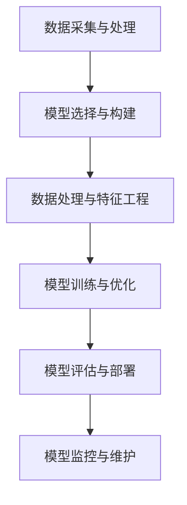

                 

# 模型思维:管理者认知复杂世界的捷径

## 1. 背景介绍

### 1.1 问题由来
在当今这个信息爆炸的时代，管理者面临的决策复杂度越来越高。如何透过现象看本质，从海量数据中提取出有价值的规律，成为每一个管理者必须解决的问题。而模型思维，作为一种系统化、结构化的分析工具，能够帮助管理者更好地认知复杂世界，辅助决策。

### 1.2 问题核心关键点
模型思维的核心在于利用数据和理论构建模型，并通过模型进行预测和推断，辅助管理者进行决策。其关键点包括：

- **数据采集与处理**：构建模型需要大量的数据，因此如何高效、准确地采集和处理数据，是模型思维的首要任务。
- **模型构建与优化**：选择合适的模型，并对其进行参数优化和验证，确保模型的准确性和泛化能力。
- **模型应用与评估**：将模型应用到实际场景中，进行预测和推断，并评估模型的效果。
- **模型维护与更新**：模型需要定期维护和更新，以适应不断变化的环境和需求。

### 1.3 问题研究意义
研究模型思维的实际应用，对于提高管理决策的科学性和准确性，具有重要意义：

- **降低决策成本**：模型思维能够提供基于数据的决策依据，减少主观判断带来的误差，降低决策成本。
- **提高决策效率**：模型提供系统化分析工具，加速决策过程，提高决策效率。
- **提升决策质量**：模型通过数据分析和预测，能够提供更全面、更深入的决策支持。
- **增强决策可靠性**：模型通过量化分析，降低不确定性，增强决策的可靠性。

## 2. 核心概念与联系

### 2.1 核心概念概述

为更好地理解模型思维及其应用，本节将介绍几个核心概念：

- **模型(Modelling)**：指将现实世界中的复杂现象抽象为数学或物理模型，通过数学表达式或程序代码进行描述。模型可以是简单的线性回归，也可以是复杂的深度神经网络。
- **模型选择与构建(Model Selection and Construction)**：选择或构建合适的模型，以适应该现象的复杂度和特性。
- **数据处理与特征工程(Data Preprocessing and Feature Engineering)**：通过数据清洗、特征提取等技术，将原始数据转化为模型所需的格式。
- **模型训练与优化(Model Training and Optimization)**：利用历史数据对模型进行训练，通过参数调整和验证，优化模型性能。
- **模型评估与部署(Model Evaluation and Deployment)**：通过测试数据对模型进行评估，确定模型的有效性，并部署到实际应用中。
- **模型监控与维护(Model Monitoring and Maintenance)**：定期监控模型性能，根据环境变化进行模型更新和维护。

这些概念之间的逻辑关系可以通过以下Mermaid流程图来展示：



这个流程图展示了一系列模型思维的核心流程，各环节相互依赖，共同支撑模型的构建和应用。

## 3. 核心算法原理 & 具体操作步骤

### 3.1 算法原理概述

模型思维的核心在于通过数学模型和算法，对现实世界的复杂现象进行模拟和预测。其基本原理可以概括为以下几点：

- **数据采集与处理**：通过传感器、问卷、数据库等手段，收集数据。对数据进行清洗、筛选、归一化等预处理操作，确保数据的质量和一致性。
- **模型选择与构建**：根据问题特性选择合适的模型，如线性回归、决策树、神经网络等。构建模型时，需要进行特征选择和提取，选择对问题有贡献的特征，构建特征向量。
- **模型训练与优化**：利用历史数据对模型进行训练，通过损失函数最小化，优化模型参数。通常使用梯度下降等优化算法，调整模型权重，使其在训练集上表现最佳。
- **模型评估与部署**：使用测试集对模型进行评估，计算模型的准确率、召回率、F1值等指标。将模型部署到实际应用中，进行预测和推断。
- **模型监控与维护**：定期监控模型性能，检测异常情况。根据环境变化，更新模型参数，重新训练模型，保持模型性能。

### 3.2 算法步骤详解

以下是一个典型的模型思维流程：

1. **数据采集与处理**：
   - 通过传感器、问卷等手段，收集数据。
   - 对数据进行清洗，去除噪声和异常值。
   - 对数据进行归一化、标准化等处理，确保数据的一致性。

2. **模型选择与构建**：
   - 根据问题特性，选择适合的模型，如线性回归、决策树、神经网络等。
   - 通过特征选择和提取，构建特征向量，减少特征维度。
   - 定义损失函数，选择优化算法，如梯度下降。

3. **模型训练与优化**：
   - 利用历史数据对模型进行训练，最小化损失函数。
   - 使用交叉验证等方法，避免过拟合。
   - 调整模型参数，如学习率、正则化系数等，优化模型性能。

4. **模型评估与部署**：
   - 使用测试集对模型进行评估，计算指标如准确率、召回率、F1值等。
   - 将模型部署到实际应用中，进行预测和推断。
   - 集成其他工具，如API，提高模型部署效率。

5. **模型监控与维护**：
   - 定期监控模型性能，检测异常情况。
   - 根据环境变化，更新模型参数，重新训练模型。
   - 定期备份模型，避免数据丢失。

### 3.3 算法优缺点

模型思维的优点包括：

- **系统化分析**：通过数学模型和算法，系统化地分析问题，减少主观判断误差。
- **客观依据**：模型提供了基于数据的决策依据，增强决策的客观性。
- **灵活性**：不同的模型适用于不同的问题，具有高度的灵活性。

模型思维的缺点包括：

- **数据依赖**：模型依赖于历史数据，数据质量和完整性对模型性能有很大影响。
- **复杂度**：模型的构建和优化需要专业知识和技能，对数据科学家有较高要求。
- **资源消耗**：模型训练和优化需要大量计算资源，特别是在大规模数据和复杂模型下。

### 3.4 算法应用领域

模型思维广泛应用于各行各业，以下是几个典型应用领域：

- **金融风控**：利用模型进行信用评估、风险预警、欺诈检测等。
- **医疗诊断**：通过模型进行疾病诊断、治疗方案推荐等。
- **市场营销**：利用模型进行消费者行为分析、广告投放优化等。
- **工业生产**：通过模型进行质量控制、生产优化等。
- **智能客服**：利用模型进行自然语言处理、情感分析等。

## 4. 数学模型和公式 & 详细讲解 & 举例说明

### 4.1 数学模型构建

在实际应用中，模型思维的数学模型构建通常包括以下几个步骤：

1. **问题建模**：将现实问题抽象为数学模型，如线性回归模型、决策树模型、神经网络模型等。
2. **特征工程**：选择和提取特征，构建特征向量，减少模型复杂度。
3. **损失函数定义**：根据问题特性，定义损失函数，如均方误差、交叉熵等。
4. **模型训练**：利用历史数据对模型进行训练，最小化损失函数。

### 4.2 公式推导过程

以线性回归模型为例，其基本公式为：

$$
y = \beta_0 + \beta_1 x_1 + \beta_2 x_2 + \cdots + \beta_n x_n + \epsilon
$$

其中，$y$ 为因变量，$x_1, x_2, \cdots, x_n$ 为自变量，$\beta_0, \beta_1, \cdots, \beta_n$ 为模型参数，$\epsilon$ 为误差项。

通过最小二乘法，可以计算出模型参数 $\beta_0, \beta_1, \cdots, \beta_n$：

$$
\hat{\beta} = (X^T X)^{-1} X^T y
$$

其中，$X = [x_1, x_2, \cdots, x_n]^T$，$y = [y_1, y_2, \cdots, y_n]^T$。

### 4.3 案例分析与讲解

假设我们要预测房价，已知历史数据集 $D = \{(x_i, y_i)\}_{i=1}^N$，其中 $x_i = [x_{i1}, x_{i2}, \cdots, x_{in}]^T$，$y_i$ 为房价。

首先，我们构建线性回归模型：

$$
y = \beta_0 + \beta_1 x_1 + \beta_2 x_2 + \cdots + \beta_n x_n + \epsilon
$$

然后，利用最小二乘法求解模型参数：

$$
\hat{\beta} = (X^T X)^{-1} X^T y
$$

假设 $X$ 为特征矩阵，$y$ 为房价向量，$n$ 为特征数，$N$ 为样本数。

通过训练，我们可以得到一个预测模型 $\hat{y} = X \hat{\beta}$，对新的房价数据进行预测。

## 5. 项目实践：代码实例和详细解释说明

### 5.1 开发环境搭建

在进行模型思维项目实践前，我们需要准备好开发环境。以下是使用Python进行Scikit-Learn开发的环境配置流程：

1. 安装Anaconda：从官网下载并安装Anaconda，用于创建独立的Python环境。

2. 创建并激活虚拟环境：
```bash
conda create -n scikit-learn-env python=3.8 
conda activate scikit-learn-env
```

3. 安装Scikit-Learn和相关依赖：
```bash
conda install scikit-learn matplotlib numpy pandas scipy
```

4. 安装各类工具包：
```bash
pip install tqdm jupyter notebook ipython
```

完成上述步骤后，即可在`scikit-learn-env`环境中开始模型思维实践。

### 5.2 源代码详细实现

这里我们以线性回归模型为例，给出使用Scikit-Learn库对房价预测模型进行训练和预测的Python代码实现。

首先，定义数据集：

```python
import pandas as pd

# 加载数据集
data = pd.read_csv('house_prices.csv')

# 选择特征和标签
X = data.drop(['price'], axis=1)
y = data['price']
```

然后，定义模型并训练：

```python
from sklearn.linear_model import LinearRegression

# 创建线性回归模型
model = LinearRegression()

# 训练模型
model.fit(X, y)
```

最后，使用训练好的模型进行预测：

```python
# 对新的数据进行预测
new_data = [[1000, 2000, 1500]]
predicted_price = model.predict(new_data)

print(f"预测价格为：{predicted_price[0]}")
```

以上就是使用Scikit-Learn对线性回归模型进行房价预测的完整代码实现。可以看到，Scikit-Learn提供了便捷的API，使得模型的构建、训练和预测变得非常简单。

### 5.3 代码解读与分析

让我们再详细解读一下关键代码的实现细节：

**数据集加载**：
- 使用Pandas库加载CSV格式的数据集。
- 选择特征和标签，构建特征矩阵X和标签向量y。

**模型定义与训练**：
- 使用Scikit-Learn的LinearRegression类定义线性回归模型。
- 调用`fit`方法对模型进行训练，利用历史数据拟合模型参数。

**模型预测**：
- 定义新的特征数据`new_data`。
- 调用`predict`方法对新数据进行预测，输出预测结果。

通过这个例子，可以看出模型思维的实现相对简单，但需要良好的数据准备和模型选择。Scikit-Learn等库的便捷API，使得模型构建和训练变得高效便捷。

当然，工业级的系统实现还需考虑更多因素，如模型裁剪、量化加速、服务化封装等。但核心的模型思维基本与此类似。

## 6. 实际应用场景

### 6.1 金融风控

在金融领域，模型思维被广泛应用于信用评估、风险预警、欺诈检测等。例如，利用历史数据构建信用评分模型，对客户的信用风险进行评估。利用异常检测模型，对交易数据进行实时监控，及时发现异常行为，防范欺诈风险。

### 6.2 医疗诊断

在医疗领域，模型思维被广泛应用于疾病诊断、治疗方案推荐等。例如，利用历史数据构建疾病诊断模型，对病人的病情进行预测。利用治疗方案推荐模型，根据病人的病情和历史数据，推荐最适合的治疗方案。

### 6.3 市场营销

在市场营销领域，模型思维被广泛应用于消费者行为分析、广告投放优化等。例如，利用历史数据构建消费者行为模型，分析消费者的购买习惯和偏好。利用广告投放优化模型，根据消费者行为数据，优化广告投放策略，提高广告投放效果。

### 6.4 工业生产

在工业生产领域，模型思维被广泛应用于质量控制、生产优化等。例如，利用历史数据构建质量控制模型，对生产过程中的质量进行预测和控制。利用生产优化模型，根据生产数据，优化生产流程，提高生产效率。

### 6.5 智能客服

在智能客服领域，模型思维被广泛应用于自然语言处理、情感分析等。例如，利用历史数据构建情感分析模型，对客户的情感进行预测和分析。利用自然语言处理模型，对客户的咨询进行理解和回复。

## 7. 工具和资源推荐

### 7.1 学习资源推荐

为了帮助开发者系统掌握模型思维的理论基础和实践技巧，这里推荐一些优质的学习资源：

1. 《统计学习方法》书籍：清华大学出版社，由李航教授撰写，深入浅出地介绍了统计学习的基本概念和常用模型。

2. 《机器学习》课程：斯坦福大学开设的机器学习课程，涵盖了机器学习的理论基础和实践应用，是学习模型思维的重要参考。

3. Kaggle数据科学竞赛：Kaggle平台上有众多机器学习竞赛，通过竞赛可以实践模型的构建和优化，提升实战能力。

4. Coursera机器学习专项课程：Coursera平台上的机器学习专项课程，由深度学习专家Andrew Ng讲授，系统性地介绍了机器学习的各个环节。

5. Scikit-Learn官方文档：Scikit-Learn库的官方文档，提供了丰富的模型案例和API教程，是学习模型思维的必备资料。

通过对这些资源的学习实践，相信你一定能够快速掌握模型思维的精髓，并用于解决实际的决策问题。

### 7.2 开发工具推荐

高效的开发离不开优秀的工具支持。以下是几款用于模型思维开发的常用工具：

1. Jupyter Notebook：Python数据科学平台，支持代码编写、数据可视化、模型评估等。

2. Pandas：Python数据处理库，提供了便捷的数据清洗、特征提取等功能。

3. NumPy：Python科学计算库，提供了高效的数组运算和线性代数操作。

4. Scikit-Learn：Python机器学习库，提供了丰富的模型和评估工具，支持模型的构建和优化。

5. TensorFlow：Google开源的深度学习框架，支持大规模数据处理和模型训练。

6. PyTorch：Facebook开源的深度学习框架，提供了灵活的计算图和模型构建接口。

合理利用这些工具，可以显著提升模型思维的开发效率，加快创新迭代的步伐。

### 7.3 相关论文推荐

模型思维的研究源于学界的持续研究。以下是几篇奠基性的相关论文，推荐阅读：

1. Linear Regression: An Introduction to Linear Models and Regularization：介绍了线性回归模型的基本原理和优化方法，是模型思维的重要基础。

2. Decision Trees and Random Forests：介绍了决策树模型的构建和优化方法，适用于分类和回归任务。

3. Deep Learning：深度学习领域的经典论文，介绍了深度神经网络的结构和训练方法，是模型思维的重要方向。

4. Support Vector Machines: Theory and Applications in Data Mining and Statistical Learning：介绍了支持向量机的基本原理和优化方法，适用于分类和回归任务。

5. Ensemble Methods: Boosting and Bagging：介绍了集成学习的基本原理和优化方法，适用于提升模型的泛化能力。

这些论文代表了大模型思维的发展脉络。通过学习这些前沿成果，可以帮助研究者把握学科前进方向，激发更多的创新灵感。

## 8. 总结：未来发展趋势与挑战

### 8.1 总结

本文对模型思维的实际应用进行了全面系统的介绍。首先阐述了模型思维的研究背景和意义，明确了模型思维在决策支持中的重要价值。其次，从原理到实践，详细讲解了模型思维的构建流程和操作步骤，给出了模型思维任务开发的完整代码实例。同时，本文还广泛探讨了模型思维在金融、医疗、市场营销等各个领域的应用前景，展示了模型思维的广阔潜力。此外，本文精选了模型思维的学习资源，力求为读者提供全方位的技术指引。

通过本文的系统梳理，可以看到，模型思维在决策支持中扮演了重要的角色，能够系统化、结构化地分析复杂现象，提供决策依据。未来，伴随模型的不断演进和应用领域的扩展，模型思维必将在更多场景下大放异彩。

### 8.2 未来发展趋势

展望未来，模型思维将呈现以下几个发展趋势：

1. **模型融合**：未来模型思维将更加注重模型融合，如集成学习、混合模型等，提升模型的泛化能力和鲁棒性。

2. **自动模型选择**：未来模型思维将更加注重模型选择，如自动化机器学习(AutoML)、模型调优等，降低模型构建的复杂度。

3. **实时预测**：未来模型思维将更加注重实时预测，如流数据处理、在线学习等，提升模型的响应速度。

4. **模型解释**：未来模型思维将更加注重模型解释，如可解释性机器学习(Explainable AI)、因果推断等，增强模型的透明度和可信度。

5. **跨模态融合**：未来模型思维将更加注重跨模态融合，如多模态学习、混合现实等，提升模型的多感官感知能力。

以上趋势凸显了模型思维的广泛应用和不断进步，这些方向的探索发展，必将进一步提升决策支持的科学性和精确性。

### 8.3 面临的挑战

尽管模型思维已经取得了显著成果，但在迈向更加智能化、普适化应用的过程中，仍面临诸多挑战：

1. **数据质量问题**：模型依赖于高质量的数据，数据缺失、噪声、不一致等问题会影响模型性能。

2. **模型复杂度**：模型构建和优化需要专业知识和技能，对数据科学家有较高要求。

3. **资源消耗**：模型训练和优化需要大量计算资源，特别是在大规模数据和复杂模型下。

4. **模型解释性**：模型往往是"黑盒"系统，难以解释其内部工作机制和决策逻辑。

5. **跨领域应用**：模型在不同领域的应用需要针对性地进行调整和优化。

6. **模型更新**：模型需要定期维护和更新，以适应环境变化。

正视模型思维面临的这些挑战，积极应对并寻求突破，将使其在决策支持中发挥更大的作用。

### 8.4 研究展望

面对模型思维所面临的挑战，未来的研究需要在以下几个方面寻求新的突破：

1. **数据质量保障**：开发数据清洗和预处理工具，提高数据质量，增强模型性能。

2. **模型自动化**：开发自动化机器学习工具，降低模型构建的复杂度，提升模型构建效率。

3. **实时处理技术**：研究流数据处理和在线学习技术，提升模型的响应速度和实时性。

4. **模型解释工具**：开发可解释性机器学习工具，增强模型的透明度和可信度。

5. **跨领域模型应用**：开发跨领域模型应用工具，提升模型在不同领域的应用效果。

6. **模型维护工具**：开发模型维护和更新工具，提升模型持续应用的能力。

这些研究方向将引领模型思维技术迈向更高的台阶，为决策支持系统提供更科学、更高效、更可靠的解决方案。面向未来，模型思维需要在数据质量、模型自动化、实时处理、模型解释、跨领域应用、模型维护等方面不断创新和优化，才能更好地服务决策支持系统。

## 9. 附录：常见问题与解答

**Q1：模型思维是否适用于所有决策问题？**

A: 模型思维适用于大多数决策问题，特别是数据驱动的决策场景。但对于一些非数据驱动的决策问题，如战略决策、伦理决策等，模型思维可能不适用。

**Q2：如何选择合适的模型？**

A: 选择模型需要考虑问题的特性和数据的特性。一般来说，问题简单时选择线性模型，问题复杂时选择非线性模型，数据规模大时选择分布式模型。

**Q3：模型思维在实际应用中需要注意哪些问题？**

A: 模型思维在实际应用中需要注意数据质量、模型解释、模型更新等问题。需要确保数据的准确性和一致性，增强模型的透明度和可信度，定期维护和更新模型。

**Q4：模型思维的应用前景如何？**

A: 模型思维具有广泛的应用前景，包括金融、医疗、市场营销、工业生产、智能客服等领域。随着技术的不断进步，模型思维必将在更多场景下大放异彩。

**Q5：模型思维的开发工具有哪些？**

A: 常用的模型思维开发工具包括Jupyter Notebook、Pandas、NumPy、Scikit-Learn、TensorFlow、PyTorch等。这些工具提供了便捷的API，使得模型构建和训练变得高效便捷。

---

作者：禅与计算机程序设计艺术 / Zen and the Art of Computer Programming

