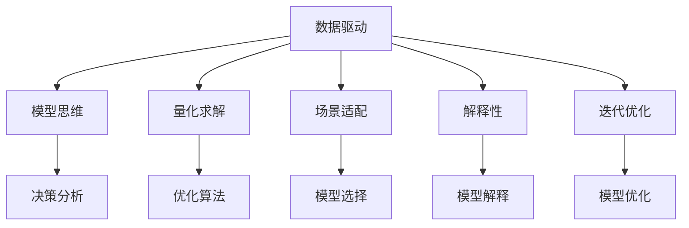

                 

# 模型思维在决策分析中的运用

> 关键词：模型思维, 决策分析, 数据驱动, 机器学习, 贝叶斯网络, 深度学习, 自然语言处理

## 1. 背景介绍

### 1.1 问题由来

在现代经济活动中，决策分析已经成为了企业决策的重要手段。面对复杂多变的市场环境，如何高效地进行决策，成为了管理者面临的共同挑战。传统的数据驱动决策方法，如回归分析、时间序列分析等，虽然有着广泛的适用性，但在面对复杂的非线性、多变量问题时，往往力不从心。近年来，随着机器学习、人工智能技术的兴起，模型思维在决策分析中的运用逐渐成为了新的热点。

模型思维，指的是通过构建数学模型，利用数据和算法对现实问题进行建模和求解，以辅助决策过程的方法。其核心在于利用统计学、概率论、优化理论等数学工具，建立符合现实问题特点的数学模型，并通过优化算法求解，实现对现实问题的理解和预测。这种方法不仅能提供定量的分析结果，还能在一定程度上揭示问题背后的逻辑和机制，从而辅助决策者做出更加科学合理的决策。

### 1.2 问题核心关键点

模型思维在决策分析中的运用，主要包括以下几个核心点：

1. **数据驱动**：模型思维强调数据的重要性，主张从实际数据中提取信息，构建模型，以真实世界的数据为依据。
2. **量化求解**：模型思维通过构建数学模型，将现实问题转化为数值求解问题，利用优化算法求解，提供量化的分析结果。
3. **场景适配**：模型思维强调模型的可适应性，能够根据不同问题场景选择或构建合适的模型，以应对复杂多变的现实问题。
4. **解释性**：模型思维通常提供一定的解释能力，帮助决策者理解模型预测结果的依据和来源。
5. **迭代优化**：模型思维强调模型的可迭代性，即通过不断优化模型参数，提高模型的预测准确性和泛化能力。

## 2. 核心概念与联系

### 2.1 核心概念概述

为了更好地理解模型思维在决策分析中的应用，本节将介绍几个关键概念及其相互联系：

- **决策分析**：指通过数据和模型，对现实问题进行分析和预测，辅助决策的过程。
- **模型思维**：指通过构建数学模型，利用数据和算法对现实问题进行建模和求解，以辅助决策过程的方法。
- **数据驱动**：指决策分析过程中，数据的重要性不亚于算法和模型，决策应基于数据的真实情况。
- **量化求解**：指将现实问题转化为数值求解问题，利用优化算法求解，提供量化的分析结果。
- **场景适配**：指根据不同问题场景选择或构建合适的模型，以应对复杂多变的现实问题。
- **解释性**：指模型提供一定的解释能力，帮助决策者理解模型预测结果的依据和来源。
- **迭代优化**：指通过不断优化模型参数，提高模型的预测准确性和泛化能力。

这些概念之间的逻辑关系可以通过以下Mermaid流程图来展示：



这个流程图展示了几类关键概念及其之间的关系：

1. 数据驱动和模型思维是决策分析的基础，其中数据驱动强调数据的重要性，而模型思维则通过构建数学模型，将数据转化为可操作的工具。
2. 量化求解和场景适配是模型思维的核心环节，其中量化求解将现实问题转化为数值求解问题，而场景适配则根据不同问题场景选择或构建合适的模型。
3. 解释性和迭代优化是模型思维的重要属性，其中解释性帮助决策者理解模型的预测结果，而迭代优化则通过不断优化模型参数，提高模型的预测准确性和泛化能力。

## 3. 核心算法原理 & 具体操作步骤

### 3.1 算法原理概述

模型思维在决策分析中的应用，主要涉及以下几类数学模型：

- **线性回归**：用于预测一个变量（因变量）与一个或多个变量（自变量）之间的线性关系，常用于经济预测、市场分析等领域。
- **逻辑回归**：用于预测二分类或多分类问题，常用于信用评分、客户分类等领域。
- **决策树**：用于分类和回归分析，通过树状结构将数据逐步拆分为更细的子集，常用于客户细分、市场细分等领域。
- **贝叶斯网络**：用于概率建模，表示变量之间的依赖关系，常用于风险评估、因果分析等领域。
- **支持向量机**：用于分类和回归分析，通过寻找最优超平面将数据分开，常用于信用评分、异常检测等领域。
- **深度学习**：用于非线性建模和特征提取，通过多层神经网络学习数据分布，常用于图像识别、自然语言处理等领域。

以上模型覆盖了决策分析中常用的各类算法，其原理和操作步骤可以总结如下：

- **数据准备**：收集数据，并进行清洗、处理、归一化等预处理步骤。
- **模型选择**：根据问题类型和数据特点，选择合适的模型。
- **模型训练**：利用训练数据，对模型进行训练，调整模型参数。
- **模型验证**：利用验证数据，评估模型性能，选择最优模型。
- **模型应用**：利用测试数据，对模型进行测试，辅助决策过程。

### 3.2 算法步骤详解

以贝叶斯网络为例，其构建和求解步骤可以总结如下：

**Step 1: 数据准备**
- 收集问题相关的数据集，并进行预处理，包括清洗、去重、归一化等。
- 确定需要建模的变量及其取值范围。

**Step 2: 模型构建**
- 根据变量间的关系，构建贝叶斯网络的结构图，确定各变量之间的依赖关系。
- 为每个变量确定其取值范围和先验概率分布。

**Step 3: 模型训练**
- 利用已知数据，对模型进行训练，求解每个变量的后验概率分布。
- 利用最大似然估计或贝叶斯估计等方法，确定模型参数。

**Step 4: 模型验证**
- 利用验证数据，对模型进行验证，评估模型性能。
- 根据验证结果，调整模型结构和参数。

**Step 5: 模型应用**
- 利用测试数据，对模型进行测试，输出预测结果。
- 根据模型输出，辅助决策过程。

### 3.3 算法优缺点

模型思维在决策分析中的运用，具有以下优点：

1. **科学性和准确性**：模型思维强调数据驱动和量化求解，通过构建数学模型，提供科学准确的预测结果。
2. **可解释性**：模型思维通常提供一定的解释能力，帮助决策者理解模型预测结果的依据和来源。
3. **可迭代性**：模型思维强调模型的可迭代性，通过不断优化模型参数，提高模型的预测准确性和泛化能力。
4. **适应性**：模型思维强调场景适配，能够根据不同问题场景选择或构建合适的模型，以应对复杂多变的现实问题。

同时，模型思维也存在一些局限性：

1. **模型复杂性**：构建和求解复杂模型需要大量计算资源和时间，可能不适用于数据量较小的问题。
2. **数据依赖**：模型思维高度依赖数据质量，数据偏差可能导致模型预测结果偏差。
3. **解释难题**：一些复杂模型如深度学习，其内部机制难以解释，可能缺乏足够的透明度。
4. **过拟合风险**：模型思维可能存在过拟合风险，特别是在训练数据不足或模型复杂度高的情况下。

### 3.4 算法应用领域

模型思维在决策分析中的应用广泛，涵盖了许多领域，例如：

- **金融分析**：用于信用评分、风险评估、投资组合优化等领域。
- **市场分析**：用于市场预测、客户细分、营销策略优化等领域。
- **供应链管理**：用于库存管理、供应链风险评估、物流优化等领域。
- **健康管理**：用于疾病预测、健康风险评估、治疗方案优化等领域。
- **制造业优化**：用于生产流程优化、质量控制、设备维护等领域。
- **资源管理**：用于能源管理、自然资源评估、环境监测等领域。

## 4. 数学模型和公式 & 详细讲解 & 举例说明

### 4.1 数学模型构建

模型思维的核心在于构建数学模型，将现实问题转化为数值求解问题。以下是一些常见的数学模型及其构建方法：

- **线性回归模型**：假设因变量与自变量之间存在线性关系，模型为 $y = \beta_0 + \beta_1x_1 + \ldots + \beta_px_p + \epsilon$，其中 $y$ 为因变量，$x_1,\ldots,x_p$ 为自变量，$\beta_0,\ldots,\beta_p$ 为模型参数，$\epsilon$ 为误差项。
- **逻辑回归模型**：用于二分类问题，模型为 $P(y=1|x) = \frac{1}{1+\exp(-\beta_0 - \beta_1x_1 - \ldots - \beta_px_p)}$，其中 $y$ 为二分类变量，$x_1,\ldots,x_p$ 为自变量，$\beta_0,\ldots,\beta_p$ 为模型参数。
- **决策树模型**：通过树状结构将数据逐步拆分为更细的子集，模型构建过程如下：
  1. 确定树根节点，计算信息增益或基尼指数。
  2. 选择最优特征作为划分依据，确定子节点。
  3. 重复上述步骤，构建完整决策树。

### 4.2 公式推导过程

以线性回归模型为例，其公式推导过程如下：

**线性回归模型**：$y = \beta_0 + \beta_1x_1 + \ldots + \beta_px_p + \epsilon$

设样本总数为 $N$，样本特征矩阵为 $\mathbf{X} = [\mathbf{x}_1,\ldots,\mathbf{x}_N] \in \mathbb{R}^{N\times p}$，样本标签向量为 $\mathbf{y} = [y_1,\ldots,y_N]^T \in \mathbb{R}^N$。则最小二乘法求解模型参数的过程如下：

$$
\begin{aligned}
\hat{\mathbf{\beta}} &= \arg\min_{\mathbf{\beta}}\sum_{i=1}^N(y_i - \mathbf{x}_i^T\mathbf{\beta})^2 \\
&= \arg\min_{\mathbf{\beta}}\sum_{i=1}^N(y_i - \mathbf{x}_i^T\mathbf{\beta})^2 \\
&= \arg\min_{\mathbf{\beta}}\frac{1}{N}\sum_{i=1}^N(y_i - \mathbf{x}_i^T\mathbf{\beta})^2 \\
&= \arg\min_{\mathbf{\beta}}\mathbf{y}^T\mathbf{y} - 2\mathbf{y}^T\mathbf{X}\mathbf{\beta} + \mathbf{\beta}^T\mathbf{X}^T\mathbf{X}\mathbf{\beta} \\
&= \arg\min_{\mathbf{\beta}}\mathbf{\beta}^T\mathbf{X}^T\mathbf{X}\mathbf{\beta} - 2\mathbf{y}^T\mathbf{X}\mathbf{\beta} + \mathbf{y}^T\mathbf{y}
\end{aligned}
$$

通过求解上述最优化问题，可以得到模型参数的闭式解：

$$
\hat{\mathbf{\beta}} = (\mathbf{X}^T\mathbf{X})^{-1}\mathbf{X}^T\mathbf{y}
$$

### 4.3 案例分析与讲解

**案例：金融信用评分**

假设某银行要评估客户信用评分，收集了历史客户数据，包括收入、年龄、负债等特征，以及客户是否违约的标签。基于此，可以利用线性回归模型构建信用评分模型。

**Step 1: 数据准备**
- 收集历史客户数据，包括收入、年龄、负债等特征。
- 确定客户是否违约的标签。

**Step 2: 模型构建**
- 假设客户是否违约与收入、年龄、负债等特征之间存在线性关系，构建线性回归模型：$P(y=1|x) = \beta_0 + \beta_1x_1 + \beta_2x_2 + \beta_3x_3 + \epsilon$，其中 $y$ 为是否违约的二分类变量，$x_1$ 为收入，$x_2$ 为年龄，$x_3$ 为负债，$\beta_0,\beta_1,\beta_2,\beta_3$ 为模型参数。

**Step 3: 模型训练**
- 利用历史客户数据，对模型进行训练，求解模型参数：$\hat{\beta} = (\mathbf{X}^T\mathbf{X})^{-1}\mathbf{X}^T\mathbf{y}$。

**Step 4: 模型验证**
- 利用验证数据，对模型进行验证，评估模型性能。
- 根据验证结果，调整模型参数，优化模型性能。

**Step 5: 模型应用**
- 利用测试数据，对模型进行测试，输出客户信用评分。
- 根据模型输出，辅助银行进行信用决策。

## 5. 项目实践：代码实例和详细解释说明

### 5.1 开发环境搭建

在进行模型思维的决策分析实践前，我们需要准备好开发环境。以下是使用Python进行项目开发的常见环境配置流程：

1. 安装Anaconda：从官网下载并安装Anaconda，用于创建独立的Python环境。

2. 创建并激活虚拟环境：
```bash
conda create -n my_env python=3.8 
conda activate my_env
```

3. 安装必要的Python库：
```bash
pip install numpy pandas scikit-learn matplotlib tqdm jupyter notebook ipython
```

4. 安装Python依赖库：
```bash
conda install scipy
conda install scikit-learn
conda install statsmodels
```

5. 安装第三方库：
```bash
pip install scikit-learn
pip install pandas
pip install matplotlib
pip install seaborn
```

完成上述步骤后，即可在`my_env`环境中开始项目实践。

### 5.2 源代码详细实现

以下是使用Scikit-learn库构建和训练逻辑回归模型的代码实现。

首先，定义数据集：

```python
import pandas as pd
import numpy as np

# 读取数据集
data = pd.read_csv('credit_data.csv')

# 数据预处理
data['income'] = pd.cut(data['income'], bins=[0, 10000, 20000, 40000, 60000], labels=[1, 2, 3, 4])
data['age'] = pd.cut(data['age'], bins=[0, 18, 35, 50, 65], labels=[1, 2, 3, 4])
data['debt'] = pd.cut(data['debt'], bins=[0, 50000, 100000, 200000, 400000], labels=[1, 2, 3, 4])
```

然后，定义逻辑回归模型并进行训练：

```python
from sklearn.linear_model import LogisticRegression
from sklearn.model_selection import train_test_split
from sklearn.metrics import accuracy_score, confusion_matrix

# 划分训练集和测试集
X_train, X_test, y_train, y_test = train_test_split(data.drop('default', axis=1), data['default'], test_size=0.2, random_state=42)

# 构建逻辑回归模型
model = LogisticRegression(solver='lbfgs', max_iter=10000)

# 训练模型
model.fit(X_train, y_train)

# 预测并评估模型性能
y_pred = model.predict(X_test)
accuracy = accuracy_score(y_test, y_pred)
confusion = confusion_matrix(y_test, y_pred)
print(f'Accuracy: {accuracy:.2f}')
print(f'Confusion Matrix:\n{confusion}')
```

以上就是使用Scikit-learn库对逻辑回归模型进行构建和训练的完整代码实现。可以看到，得益于Scikit-learn的强大封装，我们可以用相对简洁的代码完成模型构建和训练过程。

### 5.3 代码解读与分析

让我们再详细解读一下关键代码的实现细节：

**数据处理**：
- 使用pandas库对数据进行预处理，包括数值型特征的离散化处理。

**模型训练**：
- 使用scikit-learn库中的LogisticRegression模型进行构建和训练。
- 通过train_test_split方法将数据集划分为训练集和测试集，利用交叉验证方法训练模型。
- 利用accuracy_score和confusion_matrix方法评估模型性能。

**结果输出**：
- 打印模型的准确率和混淆矩阵，帮助理解模型的预测效果。

## 6. 实际应用场景

### 6.1 金融风险管理

基于模型思维的决策分析，已经在金融风险管理中得到了广泛应用。银行和保险公司通过构建信用评分和风险评估模型，能够更准确地评估客户的信用风险和保险风险，从而更好地控制信贷和理赔风险。

具体而言，金融机构可以收集客户的历史数据，包括收入、年龄、负债、信用记录等，利用逻辑回归、决策树等模型构建信用评分模型。模型训练后，可以根据客户的特征向量预测其违约概率，辅助银行和保险公司进行信贷审批和理赔评估，从而降低风险损失。

### 6.2 市场营销策略优化

市场营销策略优化也是模型思维在决策分析中常见的应用场景之一。企业通过构建客户细分和产品推荐模型，能够更精准地识别目标客户群体，优化营销策略，提高营销效果。

具体而言，企业可以收集客户的历史购买数据、浏览数据、反馈数据等，构建客户细分模型。模型训练后，可以根据客户的特征向量预测其对不同产品的偏好，辅助企业进行精准营销和个性化推荐，从而提高客户满意度和忠诚度。

### 6.3 供应链管理

基于模型思维的决策分析，在供应链管理中也发挥着重要作用。企业通过构建库存管理、供应链风险评估、物流优化等模型，能够更有效地管理供应链，降低成本，提高效率。

具体而言，企业可以收集历史订单数据、生产数据、物流数据等，构建库存管理模型和供应链风险评估模型。模型训练后，可以预测未来的库存需求和供应链风险，辅助企业进行库存管理和风险控制，从而降低库存成本，提高供应链效率。

## 7. 工具和资源推荐

### 7.1 学习资源推荐

为了帮助开发者系统掌握模型思维在决策分析中的应用，这里推荐一些优质的学习资源：

1. **《机器学习》（周志华著）**：全面介绍机器学习的基本概念、算法和应用，是入门和进阶必读之作。

2. **Coursera《机器学习》课程**：由斯坦福大学Andrew Ng教授开设，系统讲解机器学习的基本理论和算法。

3. **Kaggle平台**：提供大量数据集和竞赛，通过实践提升模型思维能力和数据处理能力。

4. **Scikit-learn官方文档**：详细介绍Scikit-learn库的各类算法和应用，是模型思维实践的重要参考。

5. **Google Colab**：提供免费的GPU/TPU算力，方便开发者实践深度学习模型。

通过对这些资源的学习实践，相信你一定能够快速掌握模型思维的精髓，并用于解决实际的决策分析问题。

### 7.2 开发工具推荐

高效的开发离不开优秀的工具支持。以下是几款用于模型思维决策分析开发的常用工具：

1. **Python**：作为目前最流行的编程语言之一，Python有着丰富的科学计算和数据分析库，是模型思维实践的重要工具。

2. **Jupyter Notebook**：提供交互式的数据分析和编程环境，方便开发者进行代码调试和结果展示。

3. **Scikit-learn**：提供各种机器学习算法和模型，支持数据预处理、特征工程、模型训练等流程。

4. **TensorFlow**：提供强大的深度学习框架，支持各类深度学习模型的构建和训练。

5. **Pandas**：提供高效的数据处理和分析工具，方便开发者进行数据清洗、特征工程等操作。

6. **NumPy**：提供高效的多维数组计算工具，是数据科学和机器学习的基础库之一。

合理利用这些工具，可以显著提升模型思维决策分析的开发效率，加快创新迭代的步伐。

### 7.3 相关论文推荐

模型思维在决策分析中的应用已经得到了广泛研究，以下是几篇奠基性的相关论文，推荐阅读：

1. **“The Elements of Statistical Learning”（Tibshirani、Hastie、Friedman著）**：全面介绍统计学和机器学习的基本理论和算法。

2. **“Pattern Recognition and Machine Learning”（Christopher M. Bishop著）**：系统讲解机器学习和数据挖掘的基本概念和算法。

3. **“Deep Learning”（Ian Goodfellow、Yoshua Bengio、Aaron Courville著）**：全面介绍深度学习的原理和应用。

4. **“Probabilistic Graphical Models”（Fong、Pais、Neal著）**：介绍概率图模型和贝叶斯网络的基本理论和应用。

5. **“Statistical Learning Theory”（Vapnik、Cortes著）**：介绍统计学习和机器学习理论的基本概念和算法。

这些论文代表了大模型思维的研究方向和发展脉络。通过学习这些前沿成果，可以帮助研究者把握学科前进方向，激发更多的创新灵感。

## 8. 总结：未来发展趋势与挑战

### 8.1 总结

本文对模型思维在决策分析中的应用进行了全面系统的介绍。首先阐述了模型思维和决策分析的背景和意义，明确了模型思维在数据驱动和量化求解方面的独特价值。其次，从原理到实践，详细讲解了逻辑回归、贝叶斯网络等模型的构建和求解过程，给出了模型思维决策分析的完整代码实现。同时，本文还广泛探讨了模型思维在金融风险管理、市场营销策略优化、供应链管理等诸多领域的实际应用，展示了模型思维的巨大潜力。此外，本文精选了模型思维的学习资源，力求为读者提供全方位的技术指引。

通过本文的系统梳理，可以看到，模型思维在决策分析中的应用已经成为数据驱动决策的重要工具，极大地拓展了决策分析的应用边界，催生了更多的落地场景。受益于机器学习和深度学习技术的不断发展，模型思维将带来更为科学、准确、灵活的决策辅助工具，为企业的决策管理提供有力支持。未来，随着模型思维的不断完善和优化，其在决策分析中的应用将会更加广泛，为各行各业带来更加智能化、高效的决策支持系统。

### 8.2 未来发展趋势

展望未来，模型思维在决策分析中的应用将呈现以下几个发展趋势：

1. **深度学习模型的普及**：随着深度学习技术的不断发展，深度学习模型将在决策分析中得到更广泛的应用。深度学习模型具有更强的特征提取能力和泛化能力，能够更好地处理复杂多变的现实问题。

2. **端到端决策系统**：传统的决策分析往往需要经过多个环节，如数据预处理、模型构建、结果输出等。未来，端到端的决策系统将成为一个新的发展方向，通过集成数据处理、模型训练、结果输出等环节，提高决策分析的效率和准确性。

3. **自动化决策分析**：自动化决策分析将通过机器学习技术，自动进行数据预处理、模型构建和结果输出，减少人工干预，提高决策分析的效率和一致性。

4. **实时决策分析**：实时决策分析将通过流式数据处理和在线模型训练，实现对实时数据的快速分析和预测，从而提高决策的实时性和精准度。

5. **跨领域融合**：未来，模型思维将与大数据、云计算、人工智能等技术进行更深入的融合，构建跨领域的决策分析系统，实现更广泛的应用场景。

6. **伦理和安全性**：随着模型思维在决策分析中的广泛应用，模型的可解释性、公平性、安全性等伦理问题将成为一个重要的研究方向。如何构建透明、公平、安全的决策分析系统，将是未来的重要课题。

### 8.3 面临的挑战

尽管模型思维在决策分析中的应用已经取得了显著成效，但在实际应用中仍面临一些挑战：

1. **数据质量问题**：模型思维高度依赖数据质量，数据偏差可能导致模型预测结果偏差。如何提高数据质量，减少数据偏差，将是未来的一个重要研究方向。

2. **模型复杂度问题**：一些复杂模型如深度学习模型，其内部机制难以解释，可能导致模型输出缺乏透明度。如何构建可解释的模型，增强模型透明性，将是未来的一个重要研究方向。

3. **资源消耗问题**：模型思维在处理大规模数据时，需要大量的计算资源和时间，可能面临计算资源不足的问题。如何优化计算资源消耗，提高模型训练和推理效率，将是未来的一个重要研究方向。

4. **模型泛化能力**：模型思维在不同数据集和场景下的泛化能力有待提高，可能存在过拟合风险。如何提高模型的泛化能力，减少过拟合风险，将是未来的一个重要研究方向。

5. **隐私保护问题**：模型思维在处理敏感数据时，可能面临隐私保护问题。如何在保证数据隐私的前提下，实现高效的决策分析，将是未来的一个重要研究方向。

### 8.4 研究展望

面向未来，模型思维在决策分析中的应用需要在以下几个方面寻求新的突破：

1. **无监督和半监督学习**：摆脱对大规模标注数据的依赖，利用无监督和半监督学习，提高模型泛化能力和鲁棒性。

2. **多模态数据融合**：将符号化知识与神经网络模型进行融合，提高模型的解释能力和预测准确性。

3. **因果推理**：引入因果推理技术，建立稳定的因果关系，提高模型的预测准确性和可解释性。

4. **强化学习**：将强化学习技术引入决策分析，通过奖励机制优化决策策略，提高决策效果。

5. **跨领域知识整合**：将跨领域知识进行整合，构建更为全面、准确的模型，提升决策分析的效果。

这些研究方向将推动模型思维在决策分析中的应用不断深化，为构建更为智能化、高效化的决策支持系统提供新的思路和方法。总之，模型思维在决策分析中的应用将伴随技术的不断发展，不断拓展其应用边界，推动数据驱动决策向更加科学、高效、智能的方向发展。

