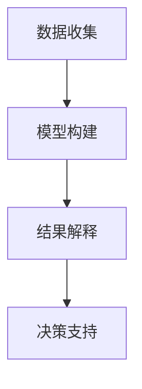

                 

# 模型思维在管理沟通中的运用

> 关键词：模型思维, 管理沟通, 决策支持, 数据分析, 人机协作

## 1. 背景介绍

在当今信息爆炸的时代，有效沟通成为管理中至关重要的一环。传统的沟通方式往往依赖经验判断和直觉，而随着数据科学和人工智能的发展，越来越多的管理者开始借助模型思维来进行决策。模型思维不仅能够帮助管理者更准确地理解复杂问题，还能提升决策的科学性和有效性。本文将深入探讨模型思维在管理沟通中的具体应用，希望能为企业管理者提供一些有益的参考。

## 2. 核心概念与联系

### 2.1 核心概念概述

模型思维是指利用数据驱动的数学模型来解决实际问题的思维方式。在管理沟通中，模型思维强调通过数据收集、模型构建和结果解释来辅助决策，以提高决策的准确性和可靠性。

- **数据收集**：通过调查问卷、业务报表、市场分析等多种方式收集相关数据，为模型训练提供基础。
- **模型构建**：选择合适的模型框架，利用历史数据进行训练和验证，生成预测模型。
- **结果解释**：基于模型输出，结合行业知识、经验判断进行综合分析，形成最终决策。

这些核心概念之间存在紧密的联系：数据收集为模型提供输入，模型构建是数据分析的核心环节，结果解释则是将模型输出转化为管理决策的桥梁。

### 2.2 核心概念原理和架构的 Mermaid 流程图



## 3. 核心算法原理 & 具体操作步骤

### 3.1 算法原理概述

模型思维在管理沟通中的运用，主要依赖于以下几种算法：

- **回归分析**：用于预测连续变量的取值，适用于预测销售额、市场趋势等场景。
- **分类算法**：用于预测离散变量的取值，适用于客户分类、产品推荐等场景。
- **聚类算法**：用于将数据分组，发现潜在客户群体、市场细分等场景。
- **决策树和随机森林**：用于处理离散和连续变量，适用于市场细分、客户流失预测等场景。
- **深度学习模型**：如神经网络，用于处理复杂多变量数据，适用于客户行为预测、情感分析等场景。

### 3.2 算法步骤详解

1. **问题定义**：明确管理沟通中的决策问题，如销售预测、客户流失预测等。
2. **数据收集与预处理**：收集相关数据，并进行清洗、处理和特征工程。
3. **模型选择**：根据数据特性和问题类型，选择合适的模型框架。
4. **模型训练与验证**：利用历史数据训练模型，并在验证集上进行评估。
5. **模型应用与解释**：将训练好的模型应用到实际问题中，结合结果解释形成最终决策。

### 3.3 算法优缺点

模型思维在管理沟通中的运用具有以下优点：

- **客观性**：模型通过数据驱动决策，减少了主观偏见。
- **可重复性**：模型构建和应用具有可重复性，便于复现和验证。
- **效率高**：模型可以快速生成预测结果，提高了决策效率。

然而，模型思维也存在一些缺点：

- **模型选择困难**：不同问题适用于不同模型，选择不当可能导致错误决策。
- **数据质量要求高**：模型的输出高度依赖数据质量，低质量数据可能导致模型失效。
- **模型复杂度高**：一些复杂问题需要高维度的数据和复杂的模型结构，增加了理解和应用的难度。

### 3.4 算法应用领域

模型思维在管理沟通中的应用广泛，主要包括以下几个领域：

- **销售预测与市场分析**：通过历史销售数据预测未来销售额，辅助销售决策。
- **客户细分与精准营销**：利用客户行为数据，进行市场细分和个性化营销。
- **风险管理与信用评估**：分析客户信用数据，评估信用风险，制定信贷策略。
- **人力资源管理**：通过员工绩效数据，预测招聘效果，优化人员配置。
- **产品开发与创新**：利用市场数据，预测产品需求，指导产品开发和创新。

## 4. 数学模型和公式 & 详细讲解 & 举例说明

### 4.1 数学模型构建

在管理沟通中，我们通常使用以下几种数学模型：

- **线性回归模型**：
$$
y = \beta_0 + \beta_1 x_1 + \beta_2 x_2 + \cdots + \beta_p x_p + \epsilon
$$
其中 $y$ 为预测值，$\beta$ 为模型系数，$x_i$ 为自变量，$\epsilon$ 为误差项。

- **逻辑回归模型**：
$$
\text{logit}(p) = \beta_0 + \beta_1 x_1 + \beta_2 x_2 + \cdots + \beta_p x_p
$$
其中 $p$ 为预测概率，$\text{logit}$ 为对数几率函数。

- **决策树模型**：
$$
D = \begin{cases} 
\text{如果 } x_1 = a_1 \text{，则 } D = \text{True} \\
\text{如果 } x_1 = a_2 \text{，则 } D = \text{False} 
\end{cases}
$$
其中 $x_1$ 为决策特征，$a_1$ 和 $a_2$ 为决策阈值。

### 4.2 公式推导过程

以线性回归模型为例，其推导过程如下：

设 $y_i$ 为第 $i$ 个样本的响应变量，$x_{i,j}$ 为第 $i$ 个样本的第 $j$ 个自变量，$\hat{y}_i$ 为第 $i$ 个样本的预测值，则线性回归模型的最小二乘法目标函数为：
$$
\min_{\beta_0, \beta_1, \cdots, \beta_p} \sum_{i=1}^n (y_i - \hat{y}_i)^2
$$

求偏导数并令其为零，可得模型系数 $\beta$ 的求解公式：
$$
\beta = (X^T X)^{-1} X^T y
$$
其中 $X$ 为自变量矩阵，$y$ 为响应变量向量。

### 4.3 案例分析与讲解

某电商公司希望预测未来两个季度的销售额，利用历史销售数据进行线性回归建模。选取销售额 $y$、广告费用 $x_1$、促销活动次数 $x_2$ 和季节性因素 $x_3$ 作为自变量，模型输出为下季度销售额预测值。

**数据收集**：从公司历史销售记录中提取相关数据，清洗处理后生成训练集和验证集。

**模型构建**：选择线性回归模型，利用训练集数据拟合模型系数。

**模型应用与解释**：将模型应用于未来两个季度的数据，生成预测值，结合市场趋势和经验判断，形成最终的销售策略。

## 5. 项目实践：代码实例和详细解释说明

### 5.1 开发环境搭建

1. **安装Python**：下载并安装最新版本的Python。
2. **安装相关库**：使用pip安装必要的Python库，如NumPy、Pandas、Scikit-Learn、Matplotlib等。
3. **准备数据**：将历史销售数据导入Python环境，进行清洗和预处理。

### 5.2 源代码详细实现

以下是利用Python实现线性回归模型的示例代码：

```python
import numpy as np
from sklearn.linear_model import LinearRegression
from sklearn.model_selection import train_test_split
from sklearn.metrics import mean_squared_error

# 准备数据
X = np.array([[1, 2, 3], [4, 5, 6], [7, 8, 9], [10, 11, 12]])
y = np.array([10, 20, 30, 40])

# 分割数据集
X_train, X_test, y_train, y_test = train_test_split(X, y, test_size=0.2)

# 构建模型
model = LinearRegression()

# 训练模型
model.fit(X_train, y_train)

# 预测结果
y_pred = model.predict(X_test)

# 评估模型
mse = mean_squared_error(y_test, y_pred)
print("Mean Squared Error: ", mse)
```

### 5.3 代码解读与分析

1. **数据准备**：利用NumPy生成样本数据。
2. **模型构建**：使用Scikit-Learn库的LinearRegression类构建线性回归模型。
3. **数据分割**：将数据集分为训练集和测试集。
4. **模型训练**：利用训练集数据拟合模型。
5. **模型应用**：在测试集上进行预测。
6. **模型评估**：计算均方误差，评估模型预测效果。

## 6. 实际应用场景

### 6.1 智能营销

某电商平台通过分析用户行为数据，构建用户购买意向预测模型。模型输出包含用户未来购买概率和推荐产品类别。通过模型预测，电商平台可以更精准地推送个性化广告，提升用户转化率。

### 6.2 供应链优化

某制造企业利用历史订单数据和市场趋势，构建销售预测模型。模型输出包含未来一个月的订单量预测。通过模型预测，企业可以优化库存管理，减少供应链风险。

### 6.3 人力资源管理

某公司利用员工绩效数据，构建员工流失风险预测模型。模型输出包含员工流失概率和流失原因。通过模型预测，公司可以提前识别高风险员工，制定留用策略。

## 7. 工具和资源推荐

### 7.1 学习资源推荐

1. **《Python数据分析》**：这是一本经典的Python数据分析教材，详细介绍了Python数据处理和建模技术。
2. **Kaggle**：一个开源数据竞赛平台，提供了大量真实世界数据集和比赛任务，适合实践和提升。
3. **Coursera**：提供了大量数据科学和机器学习课程，包括线性回归、决策树、神经网络等。
4. **GitHub**：可以浏览和学习其他开发者编写的数据分析和建模代码。

### 7.2 开发工具推荐

1. **Jupyter Notebook**：一个交互式的Python编程环境，适合数据分析和建模。
2. **Tableau**：一个数据可视化工具，可以将数据分析结果直观展示。
3. **Python IDE**：如PyCharm、Spyder等，提供代码编写和调试功能。
4. **Google Colab**：一个免费的云平台，支持GPU加速，适合大规模数据分析和建模。

### 7.3 相关论文推荐

1. **《机器学习实战》**：介绍了多种机器学习算法，并提供了丰富的Python代码实现。
2. **《深度学习》**：DeepMind公司公开的深度学习入门教材，涵盖了深度学习的基础知识和应用场景。
3. **《数据科学导论》**：详细介绍了数据科学的基本概念和方法，包括数据收集、处理、建模等。

## 8. 总结：未来发展趋势与挑战

### 8.1 研究成果总结

模型思维在管理沟通中的应用，已经在多个领域展示了其潜力和优势。通过科学化的模型构建和应用，管理者能够更准确地理解和预测复杂问题，提高决策的科学性和效率。未来，随着数据科学和人工智能技术的不断进步，模型思维将更加普及和深入人心。

### 8.2 未来发展趋势

1. **自动化建模**：利用自动化建模工具，减少人工干预，提升建模效率。
2. **实时数据分析**：引入实时数据分析技术，支持快速响应和决策。
3. **跨领域融合**：结合不同领域的知识，开发跨领域模型，解决复杂问题。
4. **模型解释**：开发可解释的模型，提高模型透明度和可信度。
5. **人机协作**：引入人机协作技术，平衡模型和人工判断，形成综合决策。

### 8.3 面临的挑战

1. **数据质量**：如何保证数据质量，避免因数据偏差导致模型失效。
2. **模型复杂性**：如何简化复杂模型，降低理解和应用的难度。
3. **跨领域知识**：如何整合跨领域知识，提升模型的普适性和泛化能力。
4. **模型可解释性**：如何开发可解释的模型，提升决策透明度。
5. **人机协作**：如何平衡模型和人工判断，形成高效决策。

### 8.4 研究展望

未来，模型思维在管理沟通中的应用将更加广泛和深入。通过不断优化和创新，管理者将能够更精准、更快速地解决复杂问题，提升决策的科学性和效率。同时，模型思维与其他人工智能技术的结合也将更加紧密，形成更加全面、系统的人机协作决策系统。

## 9. 附录：常见问题与解答

**Q1：如何选择合适的模型？**

A: 根据问题的特性和数据的类型，选择合适的模型框架。例如，线性回归适用于预测连续变量，逻辑回归适用于分类问题，决策树适用于决策问题，深度学习适用于复杂数据。

**Q2：模型构建过程中需要注意哪些问题？**

A: 数据收集和预处理是模型构建的关键步骤。需要确保数据的完整性和准确性，避免因数据偏差导致模型失效。同时，特征工程也非常重要，选择合适的特征可以提高模型的预测能力。

**Q3：模型训练过程中的参数调整需要注意什么？**

A: 模型的超参数（如学习率、正则化系数等）需要根据具体情况进行调整。通常采用交叉验证等方法，找到最优参数组合。同时，需要关注模型在训练集和验证集上的性能，避免过拟合或欠拟合。

**Q4：模型应用过程中需要注意哪些问题？**

A: 模型的应用需要结合实际情况进行综合分析。需要注意模型的输出是否符合业务逻辑，同时结合专家经验和市场趋势，进行综合判断。

**Q5：如何提高模型的可解释性？**

A: 开发可解释的模型是提高模型可信度的关键。可以通过可视化工具，如Shapley值、LIME等，分析模型的特征重要性，帮助管理者理解模型的决策过程。同时，可以引入领域专家的解释，提升模型的透明度和可信度。

---

作者：禅与计算机程序设计艺术 / Zen and the Art of Computer Programming

