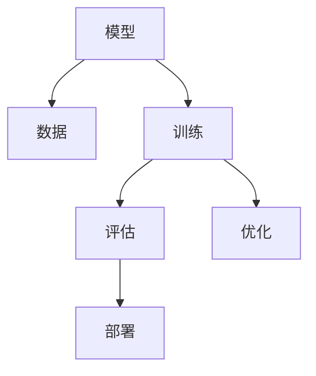

                 

# 模型思维：认知复杂世界的快捷方式

> 关键词：模型思维, 认知复杂性, 决策优化, 数据驱动, 机器学习, 深度学习, 模型选择

## 1. 背景介绍

### 1.1 问题由来
在快速发展的现代社会，人类面临的决策问题日益复杂化。无论是在金融、医疗、制造还是社交媒体等各个领域，决策过程都越来越依赖于数据和算法。如何高效地利用数据，选择合适的模型进行决策，成为当下及未来的一项关键任务。

近年来，随着机器学习（Machine Learning, ML）和深度学习（Deep Learning, DL）技术的不断突破，数据驱动的决策模型逐渐成为主流。从简单的线性回归、决策树到复杂的神经网络、集成学习，以及最新的生成对抗网络（Generative Adversarial Networks, GANs）和自监督学习（Self-Supervised Learning, SSL），模型思维在处理复杂决策问题上展现出巨大潜力。

### 1.2 问题核心关键点
模型思维的核心在于选择合适的模型，并利用数据对其进行训练和优化，从而得到能够解决实际问题的预测或决策能力。在实践中，以下几个关键点值得注意：

1. **模型选择**：根据问题的性质和数据的特点，选择合适的模型结构。不同的模型适用于不同的问题域。
2. **数据准备**：确保数据的质量和量，是模型训练和性能的关键。
3. **模型训练**：使用合适的算法和策略，优化模型的参数，提高模型的泛化能力。
4. **模型评估**：通过测试集或交叉验证等方法，评估模型的性能，确保模型具有良好的泛化能力。
5. **模型部署**：将训练好的模型集成到实际应用中，进行实时或批量推理，得到决策结果。

### 1.3 问题研究意义
研究模型思维，对于提升决策效率和效果，降低决策风险，具有重要意义：

1. **提升决策质量**：通过数据驱动的模型，可以系统地分析问题，减少主观偏差。
2. **加速决策过程**：模型可以自动化处理大量数据，提高决策速度。
3. **降低决策成本**：模型可以辅助决策者进行快速分析，避免人工操作的繁琐和错误。
4. **实现风险控制**：模型可以量化不确定性，帮助决策者制定风险控制策略。
5. **推动技术应用**：模型思维的应用，可以促进更多领域的技术革新和产业升级。

## 2. 核心概念与联系

### 2.1 核心概念概述

为更好地理解模型思维的原理和应用，本节将介绍几个关键概念：

- **模型（Model）**：指用于描述系统行为或规律的数学模型。在数据驱动的决策中，模型通常表示为一系列参数和函数。
- **数据（Data）**：指用于训练和验证模型的输入数据集。数据的质量和多样性直接影响模型的性能。
- **训练（Training）**：指通过已知数据对模型参数进行优化，使其能够预测未知数据的过程。
- **评估（Evaluation）**：指通过测试数据对模型性能进行评估，确保其泛化能力。
- **部署（Deployment）**：指将训练好的模型集成到实际应用中，进行推理预测或决策。
- **优化（Optimization）**：指通过算法和策略，对模型参数进行迭代优化，提升模型性能。
- **泛化（Generalization）**：指模型在新数据上的表现，反映其泛化能力。

这些概念之间的逻辑关系可以通过以下Mermaid流程图来展示：



这个流程图展示了模型思维的关键步骤：模型构建、数据准备、训练优化、评估验证和部署应用。通过理解这些核心概念，我们可以更好地把握模型思维的精髓。

## 3. 核心算法原理 & 具体操作步骤

### 3.1 算法原理概述

模型思维的核心理念是通过数据训练模型，并使用模型进行预测或决策。其基本流程包括：

1. **模型构建**：选择合适的模型结构，定义模型的输入和输出。
2. **数据准备**：收集、清洗和预处理数据，确保数据质量。
3. **模型训练**：使用训练数据对模型参数进行优化。
4. **模型评估**：通过测试数据评估模型性能。
5. **模型部署**：将训练好的模型应用到实际问题中，进行推理预测或决策。

这一过程通常使用统计学习理论进行理论支撑，使用机器学习和深度学习的算法和工具进行实施。其中，梯度下降（Gradient Descent）、随机梯度下降（Stochastic Gradient Descent, SGD）、反向传播（Backpropagation）等算法是常见的优化方法。

### 3.2 算法步骤详解

基于模型思维的决策过程，主要包括以下几个关键步骤：

**Step 1: 模型选择**
选择合适的模型结构，并定义其输入和输出。例如，线性回归模型、决策树模型、神经网络模型、支持向量机模型等。模型选择通常根据问题的性质、数据的特征以及性能需求等因素综合考虑。

**Step 2: 数据准备**
收集和清洗数据，进行特征工程和数据预处理。数据准备环节的关键在于：
- 数据收集：从不同来源获取数据，确保数据的多样性和代表性。
- 数据清洗：去除噪声和异常值，确保数据的质量。
- 特征工程：选择和构建特征，增强模型的表达能力。

**Step 3: 模型训练**
使用训练数据对模型参数进行优化，常用的方法包括：
- 梯度下降（GD）：通过计算损失函数对参数的梯度，迭代更新模型参数。
- 随机梯度下降（SGD）：在每个训练样本上计算梯度，更新参数，加速训练过程。
- 反向传播（Backpropagation）：计算损失函数对模型参数的梯度，更新参数，实现高效训练。
- 正则化（Regularization）：通过引入L1或L2正则项，防止过拟合。
- 交叉验证（Cross Validation）：通过分批训练，评估模型泛化能力。

**Step 4: 模型评估**
通过测试数据评估模型的性能，常用的方法包括：
- 均方误差（Mean Squared Error, MSE）：评估回归模型的性能。
- 准确率（Accuracy）：评估分类模型的性能。
- 混淆矩阵（Confusion Matrix）：评估分类模型的具体表现。
- ROC曲线（Receiver Operating Characteristic, ROC）：评估二分类模型的性能。
- AUC值（Area Under Curve）：评估ROC曲线下的面积，用于比较不同模型性能。

**Step 5: 模型部署**
将训练好的模型应用到实际问题中，进行推理预测或决策。模型部署通常包括以下几个步骤：
- 模型集成：将训练好的模型集成到应用程序中。
- 推理预测：使用测试数据对模型进行推理预测。
- 决策规则：根据模型的输出，制定决策规则。
- 监控和调整：实时监控模型性能，及时调整模型参数。

### 3.3 算法优缺点

模型思维具有以下优点：
1. **高效性**：通过自动化处理数据，模型可以快速提供决策建议。
2. **可解释性**：模型通过学习数据规律，可以提供决策依据，增加决策的透明度。
3. **灵活性**：模型可以通过特征工程，灵活适应不同类型的问题。
4. **可扩展性**：模型可以通过增加数据和调整参数，不断提升性能。

同时，模型思维也存在一些局限性：
1. **数据依赖**：模型的性能依赖于数据的数量和质量，数据不足或质量不高会影响模型性能。
2. **模型选择困难**：不同问题需要不同模型，选择合适的模型需要经验和专业知识。
3. **过拟合风险**：过度复杂的模型可能会过拟合，影响泛化能力。
4. **解释性问题**：复杂模型（如深度学习模型）通常难以解释其内部工作机制。
5. **计算资源需求高**：训练大型模型需要高性能计算资源，如GPU或TPU。

尽管存在这些局限性，但模型思维通过数据驱动的决策方式，在提升决策效率和效果方面发挥了重要作用。未来，随着技术的进步和数据量的增加，模型思维的应用将更加广泛和深入。

### 3.4 算法应用领域

模型思维在各个领域都有广泛应用，以下是几个典型的应用场景：

- **金融领域**：通过模型预测股票价格、评估信用风险、优化投资组合等。
- **医疗领域**：使用模型诊断疾病、预测患者风险、优化治疗方案等。
- **制造领域**：利用模型优化生产流程、预测设备故障、提高产品质量等。
- **社交媒体**：通过模型推荐内容、识别垃圾信息、分析用户情感等。
- **交通领域**：利用模型优化交通流量、预测天气变化、改善出行体验等。
- **能源领域**：通过模型预测能源需求、优化能源分配、降低能源消耗等。

这些应用场景展示了模型思维在处理复杂问题中的强大能力和广泛适用性。随着技术的不断发展，模型思维将在更多领域得到应用，为决策提供更精准、高效的支持。

## 4. 数学模型和公式 & 详细讲解 & 举例说明

### 4.1 数学模型构建

在模型思维中，数学模型是决策的基础。常见的数学模型包括线性回归、逻辑回归、决策树、支持向量机、神经网络等。以线性回归模型为例，其基本形式为：

$$
y = \beta_0 + \beta_1 x_1 + \beta_2 x_2 + \cdots + \beta_p x_p + \epsilon
$$

其中，$y$ 为输出变量，$x_1, x_2, \cdots, x_p$ 为输入变量，$\beta_0, \beta_1, \beta_2, \cdots, \beta_p$ 为模型参数，$\epsilon$ 为误差项。

线性回归模型的目标是通过最小化均方误差（MSE），找到最优的参数 $\beta$：

$$
\min_{\beta} \sum_{i=1}^n (y_i - \hat{y}_i)^2
$$

其中，$\hat{y}_i = \beta_0 + \beta_1 x_{1,i} + \beta_2 x_{2,i} + \cdots + \beta_p x_{p,i}$。

### 4.2 公式推导过程

以线性回归模型的梯度下降算法为例，推导其优化过程。假设训练数据集为 $(x_i, y_i)$，其中 $x_i = (x_{1,i}, x_{2,i}, \cdots, x_{p,i})$，$y_i$ 为真实标签，$\hat{y}_i$ 为模型预测值，$\beta = (\beta_0, \beta_1, \cdots, \beta_p)^T$ 为模型参数。梯度下降算法的目标是最小化均方误差：

$$
\min_{\beta} \frac{1}{n} \sum_{i=1}^n (y_i - \hat{y}_i)^2
$$

对 $\beta$ 求导，得到梯度：

$$
\frac{\partial}{\partial \beta} \frac{1}{n} \sum_{i=1}^n (y_i - \hat{y}_i)^2 = -\frac{2}{n} \sum_{i=1}^n (y_i - \hat{y}_i) x_i
$$

通过迭代更新 $\beta$，得到最终的模型参数：

$$
\beta^{(t+1)} = \beta^{(t)} - \eta \frac{2}{n} X^T (y - \hat{y})
$$

其中，$\eta$ 为学习率，$X = [x_{1,1}, x_{2,1}, \cdots, x_{p,1}, x_{1,2}, x_{2,2}, \cdots, x_{p,n}]^T$ 为输入特征矩阵，$y$ 为真实标签向量，$\hat{y}$ 为预测值向量。

### 4.3 案例分析与讲解

以房价预测为例，说明线性回归模型的构建和应用。假设有一个房屋数据集，包括房屋面积、房间数量、位置等因素，以及对应的房价。使用线性回归模型预测房价，步骤如下：

1. **数据准备**：收集房屋数据集，进行数据清洗和预处理，确保数据质量。
2. **模型构建**：定义线性回归模型，选择输入变量和输出变量。
3. **模型训练**：使用梯度下降算法，对模型参数进行优化，最小化均方误差。
4. **模型评估**：通过测试数据集评估模型性能，计算均方误差等指标。
5. **模型部署**：将训练好的模型集成到应用程序中，进行房价预测。

通过这一案例，可以看出模型思维在实际应用中的操作步骤和关键点。

## 5. 项目实践：代码实例和详细解释说明

### 5.1 开发环境搭建

在进行模型思维的实践前，我们需要准备好开发环境。以下是使用Python进行Scikit-learn开发的环境配置流程：

1. 安装Anaconda：从官网下载并安装Anaconda，用于创建独立的Python环境。

2. 创建并激活虚拟环境：
```bash
conda create -n sklearn-env python=3.8 
conda activate sklearn-env
```

3. 安装Scikit-learn：
```bash
pip install -U scikit-learn
```

4. 安装各类工具包：
```bash
pip install numpy pandas scikit-learn matplotlib tqdm jupyter notebook ipython
```

完成上述步骤后，即可在`sklearn-env`环境中开始模型思维的实践。

### 5.2 源代码详细实现

下面我们以线性回归模型为例，给出使用Scikit-learn进行房价预测的Python代码实现。

首先，定义数据处理函数：

```python
import pandas as pd
from sklearn.model_selection import train_test_split
from sklearn.linear_model import LinearRegression
from sklearn.metrics import mean_squared_error

def load_data(file_path):
    data = pd.read_csv(file_path)
    X = data.drop(['price'], axis=1)
    y = data['price']
    return X, y

def train_model(X, y, test_size=0.2, learning_rate=0.01, max_iter=1000):
    X_train, X_test, y_train, y_test = train_test_split(X, y, test_size=test_size, random_state=42)
    model = LinearRegression()
    model.fit(X_train, y_train)
    return model, X_test, y_test

def evaluate_model(model, X_test, y_test):
    y_pred = model.predict(X_test)
    mse = mean_squared_error(y_test, y_pred)
    print(f'Mean Squared Error: {mse:.2f}')
```

然后，定义训练和评估函数：

```python
def train_and_evaluate(X, y):
    model, X_test, y_test = train_model(X, y)
    evaluate_model(model, X_test, y_test)

if __name__ == '__main__':
    X, y = load_data('data.csv')
    train_and_evaluate(X, y)
```

以上就是使用Scikit-learn进行线性回归模型训练和评估的完整代码实现。可以看到，Scikit-learn封装了大部分模型构建和训练过程，使得开发者可以更加专注于模型的设计和优化。

### 5.3 代码解读与分析

让我们再详细解读一下关键代码的实现细节：

**load_data函数**：
- 定义数据处理函数，读取CSV文件，分割输入和输出变量。

**train_model函数**：
- 使用train_test_split函数对数据集进行划分，定义训练集和测试集。
- 使用LinearRegression模型进行训练，返回训练好的模型、测试集输入和真实标签。

**evaluate_model函数**：
- 使用训练好的模型对测试集进行预测，计算均方误差，并打印输出。

**train_and_evaluate函数**：
- 调用train_model和evaluate_model函数，完成模型训练和评估。

在实际应用中，开发者还可以进一步优化模型，如引入正则化、交叉验证等技术，提升模型性能。

## 6. 实际应用场景

### 6.1 智能推荐系统

智能推荐系统已经成为电商、新闻、视频等领域的重要应用。通过模型思维，推荐系统可以分析用户行为和兴趣，推荐相关内容，提升用户体验。

在技术实现上，可以使用协同过滤、基于内容的推荐、混合推荐等方法。以协同过滤为例，使用用户历史行为数据，构建用户-物品关联矩阵，通过模型训练预测用户对新物品的兴趣。将预测结果与用户历史行为结合，生成推荐列表。

### 6.2 风险评估系统

金融领域需要实时评估客户的信用风险，以降低坏账率。通过模型思维，风险评估系统可以分析客户的历史交易数据，预测其未来行为，量化风险。

在技术实现上，可以使用逻辑回归、支持向量机等分类模型，分析客户特征，构建风险评估模型。通过模型训练，预测客户是否会违约，制定相应的风险控制策略。

### 6.3 客户流失预警系统

客户流失是企业面临的一个重要问题。通过模型思维，客户流失预警系统可以分析客户行为数据，预测客户流失概率，提前采取措施。

在技术实现上，可以使用随机森林、梯度提升树等模型，分析客户行为数据，构建流失预警模型。通过模型训练，预测客户流失概率，及时进行客户挽留。

### 6.4 未来应用展望

随着模型思维的不断发展，未来的应用场景将更加广泛和深入。

在智慧城市治理中，通过模型思维，可以实现智能交通管理、公共安全预警、环境监测等应用。在医疗健康领域，通过模型思维，可以实现疾病预测、诊断辅助、治疗优化等应用。在教育培训领域，通过模型思维，可以实现学习效果评估、个性化推荐、学习路径规划等应用。

未来，随着模型思维的不断进步，其在各个领域的应用将更加丰富和高效，为社会带来更多的便利和价值。

## 7. 工具和资源推荐

### 7.1 学习资源推荐

为了帮助开发者系统掌握模型思维的理论基础和实践技巧，这里推荐一些优质的学习资源：

1. 《机器学习》（周志华著）：经典机器学习教材，系统介绍机器学习的基本概念、算法和应用。
2. 《深度学习》（Ian Goodfellow、Yoshua Bengio、Aaron Courville著）：深度学习领域的经典教材，详细讲解深度学习的基础理论和应用。
3. Coursera《机器学习》课程：由斯坦福大学Andrew Ng教授主讲的入门级课程，涵盖机器学习的基本概念和常用算法。
4. Udacity《深度学习》纳米学位：由Google、Coursera、DeepMind等合作推出的深度学习课程，提供从入门到高级的深度学习实践项目。
5. Kaggle：数据科学竞赛平台，提供大量真实数据集和比赛项目，锻炼模型思维能力。

通过对这些资源的学习实践，相信你一定能够快速掌握模型思维的精髓，并用于解决实际的决策问题。

### 7.2 开发工具推荐

高效的开发离不开优秀的工具支持。以下是几款用于模型思维开发的常用工具：

1. Scikit-learn：Python中流行的机器学习库，封装了多种常用算法，易于上手。
2. TensorFlow：由Google主导开发的深度学习框架，支持GPU加速，适合大规模模型训练。
3. PyTorch：由Facebook开发的高效深度学习框架，易于使用，适合研究和实验。
4. Jupyter Notebook：交互式编程环境，支持代码和文本的混合编辑，方便模型开发和调试。
5. Keras：高级深度学习库，提供简单易用的API，适合快速原型开发和实验。
6. Google Colab：谷歌提供的在线Jupyter Notebook环境，免费提供GPU和TPU资源，适合深度学习实验。

合理利用这些工具，可以显著提升模型思维的开发效率，加快创新迭代的步伐。

### 7.3 相关论文推荐

模型思维的发展源于学界的持续研究。以下是几篇奠基性的相关论文，推荐阅读：

1. 《The Elements of Statistical Learning》（Hastie、Tibshirani、Friedman著）：统计学习领域的经典教材，涵盖统计学习的基础理论和算法。
2. 《Pattern Recognition and Machine Learning》（Christopher Bishop著）：模式识别领域的经典教材，讲解机器学习的基本原理和应用。
3. 《Deep Learning》（Ian Goodfellow、Yoshua Bengio、Aaron Courville著）：深度学习领域的经典教材，详细讲解深度学习的基础理论和应用。
4. 《Understanding Machine Learning: From Theory to Algorithms》（Shai Shalev-Shwartz、Shai Ben-David著）：机器学习理论基础的经典教材，涵盖机器学习的基本概念和算法。
5. 《Probabilistic Graphical Models》（Michael I. Jordan著）：图模型领域的经典教材，讲解概率图模型的基本原理和应用。

这些论文代表了大模型思维的发展脉络。通过学习这些前沿成果，可以帮助研究者把握学科前进方向，激发更多的创新灵感。

## 8. 总结：未来发展趋势与挑战

### 8.1 研究成果总结

本文对模型思维的原理和应用进行了全面系统的介绍。首先阐述了模型思维的研究背景和意义，明确了其在处理复杂决策问题中的独特价值。其次，从原理到实践，详细讲解了模型思维的基本步骤，给出了模型构建和评估的完整代码实现。同时，本文还探讨了模型思维在各个领域的应用前景，展示了其在决策领域的重要作用。

通过本文的系统梳理，可以看到，模型思维通过数据驱动的决策方式，在提升决策效率和效果方面发挥了重要作用。未来，随着技术的不断进步，模型思维的应用将更加广泛和深入。

### 8.2 未来发展趋势

展望未来，模型思维将呈现以下几个发展趋势：

1. **自动化决策**：通过自动化模型，可以实时处理大量数据，提升决策速度和效率。
2. **实时性决策**：模型可以部署在云平台或边缘设备上，实现实时决策。
3. **自适应决策**：通过动态调整模型参数，可以适应环境变化，提高决策的鲁棒性。
4. **跨领域应用**：模型思维可以应用于不同领域，如金融、医疗、制造等，实现更广泛的决策支持。
5. **深度学习的应用**：深度学习模型在处理复杂问题上表现优异，未来将在更多场景中得到应用。
6. **多模态融合**：将不同模态的数据融合，提升模型的综合表达能力。

以上趋势凸显了模型思维的广阔前景。这些方向的探索发展，必将进一步提升决策系统的性能和应用范围，为人类决策带来新的变革。

### 8.3 面临的挑战

尽管模型思维在决策过程中发挥了重要作用，但仍面临一些挑战：

1. **数据质量问题**：数据的噪声、缺失和不一致性会影响模型的性能。
2. **模型复杂性**：过于复杂的模型可能过拟合，影响泛化能力。
3. **计算资源需求高**：训练大规模模型需要高性能计算资源。
4. **模型可解释性**：复杂模型难以解释其内部工作机制，增加决策的透明度。
5. **伦理和安全问题**：模型可能引入偏见，甚至用于不当用途。

正视模型思维面临的这些挑战，积极应对并寻求突破，将是大数据决策系统的关键。

### 8.4 研究展望

面对模型思维的挑战，未来的研究需要在以下几个方面寻求新的突破：

1. **数据预处理技术**：提升数据质量，减少数据噪声和缺失，增强数据一致性。
2. **模型简化和优化**：通过特征选择和正则化，减少模型复杂性，提高模型泛化能力。
3. **高效计算技术**：引入分布式计算、模型压缩等技术，降低计算资源需求。
4. **模型可解释性**：开发可解释性强的模型，增强模型的透明度和可信度。
5. **伦理和安全约束**：引入伦理导向的评估指标，确保模型应用的公正和安全。

这些研究方向将引领模型思维的不断进步，推动大数据决策系统的应用和普及。

## 9. 附录：常见问题与解答

**Q1：模型思维是否适用于所有决策问题？**

A: 模型思维在处理复杂决策问题时表现优异，但并不适用于所有场景。对于一些简单、线性问题，可以直接使用统计方法或规则进行决策。对于需要高度自主性和解释性的决策，可能需要结合其他方法，如专家系统。

**Q2：如何选择适合的模型？**

A: 模型选择通常需要考虑问题的性质、数据的特征以及性能需求等因素。简单问题可以使用线性回归、逻辑回归等基本模型，复杂问题可以使用决策树、支持向量机、神经网络等高级模型。同时，也可以考虑模型之间的组合和集成，提升整体性能。

**Q3：模型思维在实际应用中需要注意哪些问题？**

A: 在实际应用中，需要注意以下几个问题：
1. 数据准备：确保数据的质量和多样性。
2. 模型训练：选择合适的优化算法和正则化方法，避免过拟合。
3. 模型评估：使用合适的评估指标，评估模型性能。
4. 模型部署：选择合适的部署平台，确保系统稳定性。
5. 模型监控：实时监控模型性能，及时调整模型参数。

**Q4：模型思维是否可以与其他技术结合？**

A: 模型思维可以与其他技术进行结合，实现更全面的决策支持。例如，可以将机器学习与自然语言处理结合，实现情感分析、文本分类等应用。也可以将机器学习与计算机视觉结合，实现图像识别、视频分析等应用。

通过本文的系统梳理，我们可以看到模型思维在处理复杂决策问题中的重要价值，以及其在实际应用中的广泛应用。未来，随着技术的不断进步和数据量的不断增加，模型思维的应用将更加深入和广泛，为决策支持系统带来更多的创新和变革。

---
作者：禅与计算机程序设计艺术 / Zen and the Art of Computer Programming

