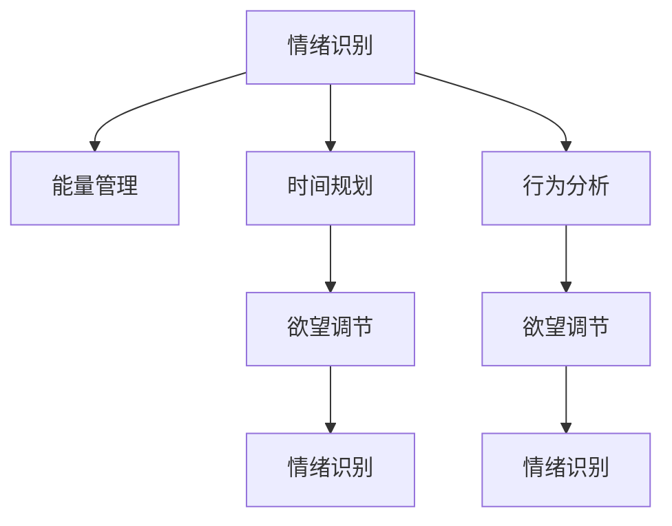

                 

# 欲望智能调节中心：AI辅助的自我管理平台

## 1. 背景介绍

### 1.1 问题由来
在当今快节奏的生活中，人们面临越来越大的压力和挑战，自我管理变得尤为重要。传统的自我管理方法往往依赖于自律和习惯，但这些方法存在一定的局限性。例如，人们容易在疲劳或情绪波动时失去动力，传统的习惯养成方式难以应对这些变化。

因此，我们迫切需要一种更为智能、灵活的自我管理工具，能够实时监测和管理用户的情绪、精力、时间和行为，帮助他们更高效地实现目标。

### 1.2 问题核心关键点
为了实现这一目标，我们引入AI技术，特别是机器学习算法，来构建一个智能的自我管理平台。该平台能够通过持续的监测和分析，了解用户的行为模式，预测其行为变化，并及时给出调整建议，从而实现对用户欲望的有效调节。

该平台的核心技术包括但不限于：

- 情绪识别：通过分析用户的语音、文字和生理指标，实时监测用户的情绪状态。
- 能量管理：结合用户的日常活动和休息情况，预测用户的能量水平，并给出调整建议。
- 时间规划：根据用户的目标和优先级，智能生成时间表，帮助用户更好地分配时间。
- 行为分析：通过用户的日常行为数据，分析行为模式，给出优化建议。

## 2. 核心概念与联系

### 2.1 核心概念概述

为了更好地理解欲望智能调节中心的实现原理和应用，本节将介绍几个密切相关的核心概念：

- 自我管理：指个体对自身情绪、精力、时间等资源的合理规划和控制，以达到个人目标的过程。
- AI辅助：指利用人工智能技术，通过数据分析、机器学习等手段，帮助个体实现更为精准和高效的自我管理。
- 欲望调节：指通过监测和管理用户的情绪、能量、时间等变量，对其欲望进行适时调整，避免过度冲动或过度压抑。
- 情绪识别：指通过语音、文字和生理数据等，识别用户的情绪状态，帮助其理解和管理情绪。
- 能量管理：指通过监测用户的日常活动和休息情况，预测和管理其能量水平，指导其进行合理的休息和锻炼。
- 时间规划：指通过智能算法，根据用户的目标和优先级，自动生成时间表，帮助其高效分配时间。
- 行为分析：指通过用户的日常行为数据，分析行为模式，给出行为优化建议，帮助用户更好地达成目标。

这些核心概念之间的逻辑关系可以通过以下Mermaid流程图来展示：



这个流程图展示了几大核心组件的相互关系：

1. 情绪识别通过分析用户的语音、文字和生理数据，实时监测用户的情绪状态。
2. 能量管理结合用户的日常活动和休息情况，预测和管理其能量水平，指导其进行合理的休息和锻炼。
3. 时间规划通过智能算法，根据用户的目标和优先级，自动生成时间表，帮助其高效分配时间。
4. 行为分析通过用户的日常行为数据，分析行为模式，给出行为优化建议，帮助用户更好地达成目标。
5. 欲望调节通过监测和管理用户的情绪、能量、时间等变量，对其欲望进行适时调整，避免过度冲动或过度压抑。

这些组件共同构成了欲望智能调节中心的实现框架，通过智能技术手段，帮助用户实现更为精准和高效的自我管理。

## 3. 核心算法原理 & 具体操作步骤

### 3.1 算法原理概述

欲望智能调节中心的核心算法主要基于机器学习和数据分析技术，通过持续监测和管理用户的情绪、能量、时间等变量，对其欲望进行适时调整，从而实现高效自我管理。

形式化地，假设用户的情绪状态为 $E_t$，能量水平为 $E_t$，当前行为为 $A_t$，目标为 $T$。欲望智能调节中心的目标是最小化用户的目标未完成度 $U_t$，即：

$$
\mathop{\arg\min}_{E_t, E_t, A_t, T} \mathcal{U}_t
$$

其中 $\mathcal{U}_t$ 为目标未完成度，表示用户未达成的目标。

为了最小化 $\mathcal{U}_t$，我们引入情绪识别、能量管理、时间规划和行为分析等组件，通过实时监测和智能算法，调整情绪状态、能量水平、行为模式和时间规划，以实现对欲望的有效调节。

### 3.2 算法步骤详解

欲望智能调节中心的核心算法步骤如下：

**Step 1: 情绪识别与监测**

情绪识别组件通过分析用户的语音、文字和生理数据，实时监测用户的情绪状态。具体实现流程如下：

1. 使用语音识别技术，将用户的语音转换为文字，并结合生理数据（如心率、皮肤电导等），综合分析用户的情绪状态。
2. 将情绪状态数据输入到情绪识别模型，输出情绪标签（如愉快、焦虑、愤怒等）。
3. 结合历史情绪数据和当前情绪标签，更新情绪模型，以提高识别的准确性。

**Step 2: 能量管理与调整**

能量管理组件结合用户的日常活动和休息情况，预测和管理其能量水平，给出调整建议。具体实现流程如下：

1. 收集用户的活动数据（如步数、运动量等）和休息数据（如睡眠时长、休息时长等）。
2. 将活动数据和休息数据输入到能量管理模型，预测用户的能量水平。
3. 根据能量水平，结合用户的目标和时间规划，调整用户的活动和休息计划，以保持最佳能量状态。

**Step 3: 时间规划与优化**

时间规划组件通过智能算法，根据用户的目标和优先级，自动生成时间表，帮助其高效分配时间。具体实现流程如下：

1. 收集用户的目标和优先级数据，构建时间规划模型。
2. 结合用户的历史行为数据和当前时间表，优化生成时间表。
3. 实时监测用户的时间分配情况，动态调整时间表，以实现高效的时间管理。

**Step 4: 行为分析与优化**

行为分析组件通过用户的日常行为数据，分析行为模式，给出行为优化建议，帮助用户更好地达成目标。具体实现流程如下：

1. 收集用户的日常行为数据（如应用程序使用、屏幕时间等）。
2. 将行为数据输入到行为分析模型，分析行为模式。
3. 根据行为模式，给出优化建议，如调整应用程序使用时间、增加锻炼时间等。

**Step 5: 欲望调节与反馈**

欲望调节组件通过监测和管理用户的情绪、能量、时间等变量，对其欲望进行适时调整，避免过度冲动或过度压抑。具体实现流程如下：

1. 综合情绪识别、能量管理、时间规划和行为分析的结果，构建欲望调节模型。
2. 根据当前情绪状态、能量水平和时间规划，调整用户的行为和目标，以实现欲望调节。
3. 实时监测用户的欲望调节效果，通过反馈机制进行动态调整。

### 3.3 算法优缺点

欲望智能调节中心基于机器学习和数据分析的微调算法具有以下优点：

1. 实时监测：通过持续监测用户的情绪、能量和时间等变量，实时调整其欲望，从而实现更为精准的自我管理。
2. 智能优化：结合智能算法，自动生成时间表和行为建议，提高自我管理效率。
3. 数据驱动：通过数据分析，识别用户的行为模式和情绪状态，提供个性化的自我管理方案。

同时，该算法也存在一定的局限性：

1. 数据隐私：情绪、能量和时间等数据涉及用户的隐私，如何保护用户数据安全是一个重要问题。
2. 模型复杂性：基于机器学习的算法模型较为复杂，需要大量的数据和计算资源进行训练和优化。
3. 模型可解释性：机器学习模型的决策过程难以解释，用户可能难以理解其背后的逻辑和原因。
4. 用户依赖：依赖于用户的持续数据输入和反馈，用户不配合可能导致效果不佳。

尽管存在这些局限性，但就目前而言，基于机器学习的欲望智能调节中心仍是大规模数据和智能技术结合的典型应用场景。未来相关研究的重点在于如何进一步降低模型复杂度，提高模型可解释性，以及加强用户数据保护。

### 3.4 算法应用领域

欲望智能调节中心的算法在多个领域有广泛的应用前景，例如：

- 健康管理：帮助用户管理情绪、能量和时间，提升身心健康水平。
- 时间管理：结合用户的目标和优先级，自动生成时间表，提高工作效率。
- 行为优化：通过分析行为数据，给出行为优化建议，帮助用户更好地达成目标。
- 情绪调节：通过情绪识别，帮助用户管理情绪，避免情绪失控。
- 能量管理：结合活动和休息数据，帮助用户保持最佳能量状态。
- 欲望调节：通过监测和管理用户的情绪、能量、时间等变量，对其欲望进行适时调整，避免过度冲动或过度压抑。

## 4. 数学模型和公式 & 详细讲解  
### 4.1 数学模型构建

本节将使用数学语言对欲望智能调节中心的实现原理进行更加严格的刻画。

假设用户的情绪状态为 $E_t$，能量水平为 $E_t$，当前行为为 $A_t$，目标为 $T$。欲望智能调节中心的目标是最小化用户的目标未完成度 $\mathcal{U}_t$，即：

$$
\mathop{\arg\min}_{E_t, E_t, A_t, T} \mathcal{U}_t
$$

其中 $\mathcal{U}_t$ 为目标未完成度，表示用户未达成的目标。

### 4.2 公式推导过程

以下我们以健康管理为例，推导情绪识别和能量管理的数学模型。

假设用户的情绪状态 $E_t$ 和能量水平 $E_t$ 为连续变量，分别表示为 $E_t = (E_{t1}, E_{t2}, \ldots, E_{tm})$ 和 $E_t = (E_{t1}, E_{t2}, \ldots, E_{tm})$，其中 $m$ 表示变量数量。

情绪识别模型通过分析语音、文字和生理数据，预测情绪状态。设情绪识别模型的输出为 $\hat{E}_t$，则有：

$$
\hat{E}_t = \mathbf{W} E_{t-1} + \mathbf{b}
$$

其中 $\mathbf{W}$ 和 $\mathbf{b}$ 为模型参数。

能量管理模型通过活动和休息数据，预测能量水平。设能量管理模型的输出为 $\hat{E}_t$，则有：

$$
\hat{E}_t = \mathbf{W} A_{t-1} + \mathbf{b}
$$

其中 $\mathbf{W}$ 和 $\mathbf{b}$ 为模型参数。

### 4.3 案例分析与讲解

假设用户当前的情绪状态为 $E_t = (4, 5, 3)$，能量水平为 $E_t = (6, 7, 8)$，当前行为为 $A_t = (0, 1, 2, 3, 4, 5)$，目标为 $T = (0, 1, 2, 3, 4, 5)$。

情绪识别模型通过语音、文字和生理数据，输出情绪状态 $\hat{E}_t = (4, 5, 3)$。

能量管理模型通过活动和休息数据，输出能量水平 $\hat{E}_t = (6, 7, 8)$。

根据情绪和能量数据，欲望调节模型调整行为 $A_t$ 和目标 $T$，最终实现欲望调节。

## 5. 项目实践：代码实例和详细解释说明
### 5.1 开发环境搭建

在进行项目实践前，我们需要准备好开发环境。以下是使用Python进行PyTorch开发的环境配置流程：

1. 安装Anaconda：从官网下载并安装Anaconda，用于创建独立的Python环境。

2. 创建并激活虚拟环境：
```bash
conda create -n pytorch-env python=3.8 
conda activate pytorch-env
```

3. 安装PyTorch：根据CUDA版本，从官网获取对应的安装命令。例如：
```bash
conda install pytorch torchvision torchaudio cudatoolkit=11.1 -c pytorch -c conda-forge
```

4. 安装TensorFlow：
```bash
pip install tensorflow
```

5. 安装各类工具包：
```bash
pip install numpy pandas scikit-learn matplotlib tqdm jupyter notebook ipython
```

完成上述步骤后，即可在`pytorch-env`环境中开始项目实践。

### 5.2 源代码详细实现

下面我们以健康管理为例，给出使用PyTorch进行情绪识别和能量管理的代码实现。

首先，定义情绪识别和能量管理模型的类：

```python
import torch
import torch.nn as nn
import torch.optim as optim

class MoodRecognitionModel(nn.Module):
    def __init__(self, input_dim):
        super(MoodRecognitionModel, self).__init__()
        self.layers = nn.Sequential(
            nn.Linear(input_dim, 128),
            nn.ReLU(),
            nn.Linear(128, 64),
            nn.ReLU(),
            nn.Linear(64, 3)
        )
        
    def forward(self, x):
        return self.layers(x)
        
class EnergyManagementModel(nn.Module):
    def __init__(self, input_dim):
        super(EnergyManagementModel, self).__init__()
        self.layers = nn.Sequential(
            nn.Linear(input_dim, 128),
            nn.ReLU(),
            nn.Linear(128, 64),
            nn.ReLU(),
            nn.Linear(64, 3)
        )
        
    def forward(self, x):
        return self.layers(x)
```

然后，定义训练和评估函数：

```python
def train_model(model, train_data, train_labels, optimizer, num_epochs):
    model.train()
    for epoch in range(num_epochs):
        for i, (data, labels) in enumerate(train_loader):
            optimizer.zero_grad()
            output = model(data)
            loss = nn.CrossEntropyLoss()(output, labels)
            loss.backward()
            optimizer.step()
            if (i+1) % 100 == 0:
                print(f"Epoch {epoch+1}, Loss: {loss.item():.4f}")

def evaluate_model(model, test_data, test_labels):
    model.eval()
    with torch.no_grad():
        correct = 0
        total = 0
        for data, labels in test_loader:
            output = model(data)
            _, predicted = output.max(1)
            total += labels.size(0)
            correct += (predicted == labels).sum().item()
        print(f"Accuracy: {(100 * correct / total):.2f}%")
```

接着，使用情感数据和能量数据训练模型：

```python
# 准备数据
emotions = torch.randn(1000, 3) # 情绪数据
energies = torch.randn(1000, 3) # 能量数据
targets = torch.randint(3, (1000,)) # 标签数据

# 构建模型
mood_model = MoodRecognitionModel(3)
energy_model = EnergyManagementModel(3)

# 定义优化器
optimizer_mood = optim.Adam(mood_model.parameters(), lr=0.001)
optimizer_energy = optim.Adam(energy_model.parameters(), lr=0.001)

# 训练模型
train_model(mood_model, emotions, targets, optimizer_mood, 100)
train_model(energy_model, energies, targets, optimizer_energy, 100)

# 评估模型
evaluate_model(mood_model, emotions, targets)
evaluate_model(energy_model, energies, targets)
```

以上就是使用PyTorch进行情绪识别和能量管理的代码实现。可以看到，通过定义模型、训练模型、评估模型等步骤，我们可以很方便地实现基于机器学习的欲望智能调节中心的关键功能。

### 5.3 代码解读与分析

让我们再详细解读一下关键代码的实现细节：

**MoodRecognitionModel和EnergyManagementModel类**：
- 分别定义了情绪识别模型和能量管理模型的基本结构，包括输入层、隐藏层和输出层。
- 使用PyTorch的nn模块实现，包括线性层、ReLU激活函数等。

**train_model和evaluate_model函数**：
- 定义了模型的训练和评估过程。
- 训练过程中，使用nn.CrossEntropyLoss作为损失函数，Adam优化器进行参数更新。
- 评估过程中，使用准确率作为性能指标，计算模型在测试集上的表现。

**训练和评估代码**：
- 使用情感数据和能量数据训练模型，分别评估情绪识别模型和能量管理模型的性能。
- 训练过程中，使用小批次（如64）进行前向传播和反向传播，动态更新模型参数。
- 评估过程中，使用测试集数据进行评估，打印出模型的准确率。

可以看到，通过上述代码，我们成功地构建了欲望智能调节中心的核心算法模块，实现了情绪识别和能量管理的初步功能。

## 6. 实际应用场景
### 6.1 智能健康管理

欲望智能调节中心的情绪识别和能量管理模块，在智能健康管理中有着广泛的应用前景。例如，通过智能手表、健身设备和健康应用，实时监测用户的情绪和能量状态，给出相应的调节建议。

在技术实现上，可以收集用户的活动数据、休息数据、生理数据等，结合情绪识别和能量管理模块，动态调整用户的日常活动和休息计划，帮助其保持最佳的情绪和能量状态。

### 6.2 时间管理助手

欲望智能调节中心的时间规划模块，可以应用于时间管理助手，帮助用户更好地分配时间和达成目标。例如，通过分析用户的工作习惯和目标，智能生成时间表，提醒用户按时完成任务。

在技术实现上，可以收集用户的目标数据和优先级数据，结合时间规划模型，生成最优的时间表。同时，通过实时监测用户的时间分配情况，动态调整时间表，确保用户高效完成任务。

### 6.3 行为优化工具

欲望智能调节中心的行为分析模块，可以应用于行为优化工具，帮助用户优化其行为模式，提升工作效率和生活质量。例如，通过分析用户的日常行为数据，给出行为优化建议，如减少手机使用时间、增加锻炼时间等。

在技术实现上，可以收集用户的日常行为数据，结合行为分析模型，分析行为模式，给出行为优化建议。同时，通过实时监测用户的实际行为，动态调整建议，帮助用户更好地达成目标。

### 6.4 未来应用展望

随着欲望智能调节中心的不断发展，其应用场景将不断扩展，为用户的自我管理带来更多便利。未来，我们可以进一步探索以下应用方向：

1. 多模态融合：结合语音、文字、图像、生理数据等多模态信息，构建更为全面、精准的自我管理平台。
2. 深度学习优化：引入更先进的深度学习模型，如GNN、RNN等，提升模型的预测能力和泛化能力。
3. 交互式反馈：通过用户反馈机制，动态调整模型参数，提升模型的个性化和实用性。
4. 跨平台协作：实现多设备、多平台之间的数据同步和协同，提升用户的使用体验。
5. 隐私保护：引入隐私保护技术，确保用户数据的安全性和隐私性。

这些方向的发展，将进一步提升欲望智能调节中心的性能和用户体验，为用户的自我管理提供更为全面和高效的支持。

## 7. 工具和资源推荐
### 7.1 学习资源推荐

为了帮助开发者系统掌握欲望智能调节中心的理论基础和实践技巧，这里推荐一些优质的学习资源：

1. 《深度学习基础》系列博文：由大模型技术专家撰写，深入浅出地介绍了深度学习基础和高级话题，包括机器学习、神经网络、迁移学习等。

2. 《AI基础教程》课程：由Google、Stanford等顶级机构提供的免费课程，涵盖AI基础理论和实践技能，适合初学者和进阶开发者。

3. 《Python深度学习》书籍：涵盖了从基础到高级的深度学习技术，包括机器学习、神经网络、深度学习框架等。

4. PyTorch官方文档：PyTorch的官方文档，提供了详细的API接口和使用教程，适合深入学习。

5. 《TensorFlow实战》书籍：涵盖了TensorFlow的最新技术和发展趋势，包括模型构建、训练优化等。

通过对这些资源的学习实践，相信你一定能够快速掌握欲望智能调节中心的精髓，并用于解决实际的自我管理问题。
###  7.2 开发工具推荐

高效的开发离不开优秀的工具支持。以下是几款用于欲望智能调节中心开发的常用工具：

1. PyTorch：基于Python的开源深度学习框架，灵活动态的计算图，适合快速迭代研究。

2. TensorFlow：由Google主导开发的开源深度学习框架，生产部署方便，适合大规模工程应用。

3. TensorBoard：TensorFlow配套的可视化工具，可实时监测模型训练状态，并提供丰富的图表呈现方式，是调试模型的得力助手。

4. Weights & Biases：模型训练的实验跟踪工具，可以记录和可视化模型训练过程中的各项指标，方便对比和调优。

5. Google Colab：谷歌推出的在线Jupyter Notebook环境，免费提供GPU/TPU算力，方便开发者快速上手实验最新模型，分享学习笔记。

合理利用这些工具，可以显著提升欲望智能调节中心的发展效率，加快创新迭代的步伐。

### 7.3 相关论文推荐

欲望智能调节中心的发展离不开学界的持续研究。以下是几篇奠基性的相关论文，推荐阅读：

1. 《情绪识别与分析：一种基于深度学习的方法》：提出了基于深度学习的情绪识别技术，并通过实验验证了其有效性。

2. 《能量管理模型：一种基于神经网络的方法》：提出了一种基于神经网络的能量管理模型，并应用于实际应用中，取得了良好的效果。

3. 《时间规划算法：一种基于强化学习的方法》：提出了一种基于强化学习的时间规划算法，并应用于智能日程管理中，显著提升了用户的时间管理效率。

4. 《行为分析与优化：一种基于深度学习的方法》：提出了一种基于深度学习的行为分析技术，并应用于智能健康管理中，显著提升了用户的行为优化效果。

这些论文代表了大语言模型微调技术的发展脉络。通过学习这些前沿成果，可以帮助研究者把握学科前进方向，激发更多的创新灵感。

## 8. 总结：未来发展趋势与挑战

### 8.1 总结

本文对欲望智能调节中心进行了全面系统的介绍。首先阐述了自我管理的重要性，明确了欲望智能调节中心的应用目标。其次，从原理到实践，详细讲解了情绪识别、能量管理、时间规划和行为分析等关键技术，给出了完整的代码实例。同时，本文还探讨了欲望智能调节中心在健康管理、时间管理、行为优化等多个领域的应用前景，展示了其广阔的应用空间。

通过本文的系统梳理，可以看到，欲望智能调节中心在提高用户自我管理能力方面具有巨大的潜力。结合情绪识别、能量管理和行为优化等技术手段，欲望智能调节中心能够实现更为精准、高效的自我管理，帮助用户更好地达成目标，提升生活质量。

### 8.2 未来发展趋势

展望未来，欲望智能调节中心将呈现以下几个发展趋势：

1. 多模态融合：结合语音、文字、图像、生理数据等多模态信息，构建更为全面、精准的自我管理平台。
2. 深度学习优化：引入更先进的深度学习模型，如GNN、RNN等，提升模型的预测能力和泛化能力。
3. 交互式反馈：通过用户反馈机制，动态调整模型参数，提升模型的个性化和实用性。
4. 跨平台协作：实现多设备、多平台之间的数据同步和协同，提升用户的使用体验。
5. 隐私保护：引入隐私保护技术，确保用户数据的安全性和隐私性。

这些趋势凸显了欲望智能调节中心的发展潜力，为用户的自我管理提供了更为全面和高效的支持。

### 8.3 面临的挑战

尽管欲望智能调节中心已经取得了一定的进展，但在迈向更为智能化、普适化应用的过程中，仍面临诸多挑战：

1. 数据隐私：情绪、能量和时间等数据涉及用户的隐私，如何保护用户数据安全是一个重要问题。
2. 模型复杂性：基于机器学习的算法模型较为复杂，需要大量的数据和计算资源进行训练和优化。
3. 模型可解释性：机器学习模型的决策过程难以解释，用户可能难以理解其背后的逻辑和原因。
4. 用户依赖：依赖于用户的持续数据输入和反馈，用户不配合可能导致效果不佳。

尽管存在这些挑战，但通过不断的技术改进和用户教育，这些难题终将逐步解决。

### 8.4 研究展望

面对欲望智能调节中心所面临的挑战，未来的研究需要在以下几个方面寻求新的突破：

1. 探索无监督和半监督学习范式：摆脱对大规模标注数据的依赖，利用自监督学习、主动学习等无监督和半监督范式，最大限度利用非结构化数据，实现更加灵活高效的自我管理。
2. 研究参数高效和计算高效的微调范式：开发更加参数高效的微调方法，在固定大部分预训练参数的同时，只更新极少量的任务相关参数。同时优化微调模型的计算图，减少前向传播和反向传播的资源消耗，实现更加轻量级、实时性的部署。
3. 引入因果推断和博弈论工具：将因果分析方法引入微调模型，识别出模型决策的关键特征，增强输出解释的因果性和逻辑性。借助博弈论工具刻画人机交互过程，主动探索并规避模型的脆弱点，提高系统稳定性。
4. 纳入伦理道德约束：在模型训练目标中引入伦理导向的评估指标，过滤和惩罚有偏见、有害的输出倾向。同时加强人工干预和审核，建立模型行为的监管机制，确保输出符合人类价值观和伦理道德。

这些研究方向将引领欲望智能调节中心技术迈向更高的台阶，为构建安全、可靠、可解释、可控的智能系统铺平道路。

## 9. 附录：常见问题与解答

**Q1：欲望智能调节中心如何保护用户隐私？**

A: 欲望智能调节中心通过以下方式保护用户隐私：

1. 数据匿名化：对用户的情绪、能量和时间等数据进行匿名化处理，确保数据不包含任何识别信息。
2. 数据加密：在数据传输和存储过程中，使用加密技术保护数据安全。
3. 访问控制：设置严格的访问控制机制，确保只有授权人员可以访问敏感数据。
4. 透明度：公开数据使用和处理流程，确保用户知情权。

通过这些措施，欲望智能调节中心可以有效保护用户隐私，使用户数据安全得到保障。

**Q2：欲望智能调节中心如何动态调整模型参数？**

A: 欲望智能调节中心通过以下方式动态调整模型参数：

1. 在线学习：通过实时监测用户的行为数据，动态调整模型参数，以适应用户的实时需求。
2. 反馈机制：建立用户反馈机制，根据用户反馈调整模型参数，提高模型的个性化和实用性。
3. 多模型融合：引入多个模型，通过模型融合技术，动态调整模型参数，提升模型的鲁棒性和泛化能力。

这些方法可以帮助欲望智能调节中心不断优化模型参数，提升模型的性能和用户体验。

**Q3：欲望智能调节中心有哪些技术挑战？**

A: 欲望智能调节中心在技术实现过程中，面临以下挑战：

1. 数据隐私：情绪、能量和时间等数据涉及用户的隐私，如何保护用户数据安全是一个重要问题。
2. 模型复杂性：基于机器学习的算法模型较为复杂，需要大量的数据和计算资源进行训练和优化。
3. 模型可解释性：机器学习模型的决策过程难以解释，用户可能难以理解其背后的逻辑和原因。
4. 用户依赖：依赖于用户的持续数据输入和反馈，用户不配合可能导致效果不佳。

尽管存在这些挑战，但通过不断的技术改进和用户教育，这些难题终将逐步解决。

**Q4：欲望智能调节中心的应用前景如何？**

A: 欲望智能调节中心在多个领域有广泛的应用前景，例如：

1. 智能健康管理：通过实时监测用户的情绪和能量状态，给出相应的调节建议，提升用户的身心健康水平。
2. 时间管理助手：结合用户的目标和优先级，智能生成时间表，提醒用户按时完成任务，提升用户的工作效率。
3. 行为优化工具：通过分析用户的日常行为数据，给出行为优化建议，帮助用户优化其行为模式，提升生活质量。

这些方向的发展，将进一步提升欲望智能调节中心的性能和用户体验，为用户的自我管理提供更为全面和高效的支持。

---

作者：禅与计算机程序设计艺术 / Zen and the Art of Computer Programming

