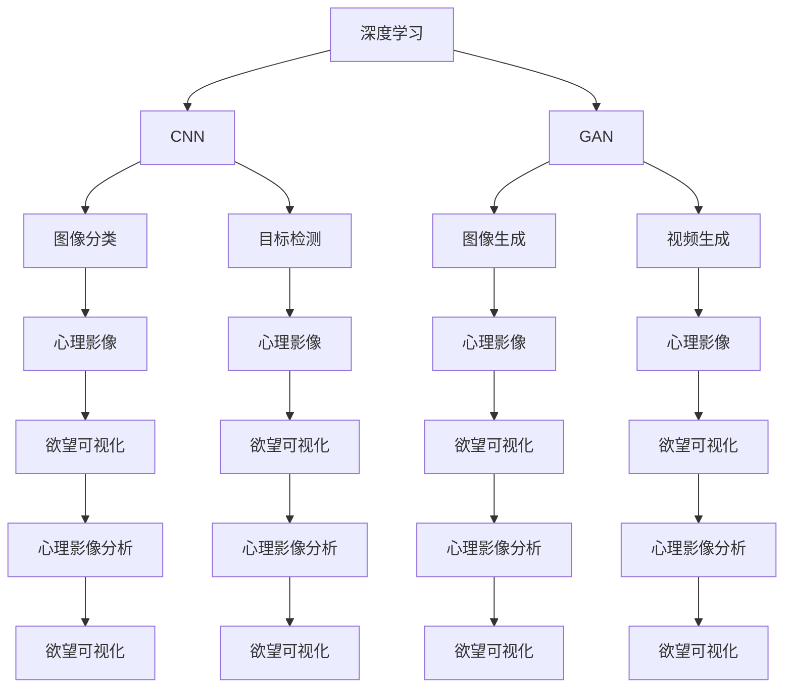

                 

# 欲望的可视化：AI呈现内心世界

> 关键词：欲望可视化, 深度学习, 图像生成, AI心理, 神经网络

## 1. 背景介绍

### 1.1 问题由来
欲望，作为人类内心最深层的驱动力之一，常常隐藏在意识之外，难以直接观察和理解。尽管欲望在行为决策中起着至关重要的作用，但传统心理学的研究方法，如问卷调查、行为实验等，往往难以直接探测到个体潜在的欲望。这种局限性限制了我们对欲望机制的深入理解，使得在制定干预策略时缺乏有力的数据支撑。

近年来，人工智能（AI），尤其是深度学习技术的飞速发展，为探索个体欲望提供了新的途径。通过深度神经网络，AI可以分析个体行为数据、面部表情、身体动作等信号，提取背后的心理特征，甚至模拟个体的心理状态。本文将探讨AI在欲望可视化方面的应用，揭示其潜在的心理洞察力，并展望其未来发展趋势。

### 1.2 问题核心关键点
深度学习模型，特别是卷积神经网络（CNN）和生成对抗网络（GAN），已经成为解码个体欲望的关键工具。这些模型可以自动学习复杂数据特征，将难以观察的心理状态映射为可视化的图像或文本描述。本研究的核心问题在于如何利用这些技术，更准确、更直观地揭示个体的欲望和心理状态。

研究的关键点包括：
1. 如何通过AI技术从海量数据中提取欲望相关的心理特征。
2. 如何将这些心理特征转化为易于理解的图像或文本描述。
3. 如何利用这些可视化工具辅助心理学研究，增强对欲望机制的理解。
4. 如何结合心理学理论，解释AI产生的可视化结果，指导行为干预。

## 2. 核心概念与联系

### 2.1 核心概念概述

为更好地理解AI在欲望可视化中的应用，本节将介绍几个关键概念：

- 深度学习（Deep Learning）：一种基于多层神经网络的机器学习技术，通过逐层学习数据特征，提取复杂的模式和结构。
- 卷积神经网络（CNN）：一种深度学习模型，擅长处理图像、声音等高维数据，广泛应用于图像分类、目标检测等任务。
- 生成对抗网络（GAN）：一种深度学习模型，由生成器和判别器两部分组成，通过对抗训练生成逼真的图像、视频等。
- 欲望可视化（Desire Visualization）：将个体欲望转换为可视化的图像或文本描述，帮助研究者理解欲望的机制和影响。
- 心理影像分析（Psychological Imaging Analysis）：通过AI技术，分析个体心理影像，揭示潜在的欲望和情绪状态。

这些概念之间存在紧密的联系，共同构成了欲望可视化的技术框架：

1. 深度学习模型，特别是CNN和GAN，是欲望可视化的核心技术手段，用于提取和生成心理影像。
2. 欲望可视化依赖于心理影像分析，通过可视化的形式展现个体的心理状态。
3. 心理影像分析结合心理学理论，解释AI产生的可视化结果，指导行为干预。

### 2.2 核心概念原理和架构的 Mermaid 流程图



这个流程图展示了深度学习在欲望可视化中的核心作用，通过CNN和GAN等模型提取和生成心理影像，再结合心理影像分析，最终实现欲望的可视化。

## 3. 核心算法原理 & 具体操作步骤
### 3.1 算法原理概述

欲望可视化的核心算法包括深度学习模型的训练和应用。本文将重点介绍CNN和GAN在欲望可视化中的应用原理。

- **卷积神经网络（CNN）**：CNN是一种深度学习模型，通过卷积、池化等操作提取图像的高维特征。在欲望可视化中，CNN可以从面部表情、行为模式等高维数据中提取心理特征，生成相应的心理影像。

- **生成对抗网络（GAN）**：GAN由生成器和判别器两部分组成，通过对抗训练生成逼真的图像。在欲望可视化中，GAN可以从已提取的心理特征中生成逼真的心理影像，模拟个体的欲望和情绪状态。

### 3.2 算法步骤详解

#### 3.2.1 CNN算法步骤

1. **数据预处理**：收集个体的面部表情、行为模式等数据，进行归一化、标准化等预处理操作。
2. **特征提取**：使用CNN模型提取高维特征，得到心理影像。
3. **特征可视化**：将高维特征转换为可视化的图像或文本描述，展现个体的心理状态。

#### 3.2.2 GAN算法步骤

1. **数据预处理**：收集心理影像的特征向量，进行归一化等预处理操作。
2. **对抗训练**：使用生成器和判别器对抗训练生成逼真的心理影像。
3. **特征可视化**：将生成的心理影像转换为可视化的图像或文本描述，展现个体的欲望和情绪状态。

### 3.3 算法优缺点

#### 3.3.1 CNN的优缺点

- **优点**：
  - 擅长处理高维图像数据，提取复杂特征。
  - 已广泛应用于图像分类、目标检测等任务，技术成熟。
  - 可以通过迁移学习等方式，快速适应新任务。

- **缺点**：
  - 需要大量标注数据进行训练，获取高质量标注数据成本较高。
  - 模型复杂，训练和推理速度较慢。
  - 难以直接解释特征提取的机制，缺乏透明度。

#### 3.3.2 GAN的优缺点

- **优点**：
  - 能够生成逼真的图像，直观展示心理状态。
  - 可以进行端到端训练，无需额外的标注数据。
  - 生成器模型具有一定的可解释性，可以指导特征提取。

- **缺点**：
  - 训练过程不稳定，容易出现模式崩溃等现象。
  - 生成器模型存在固有的偏见，生成的图像可能不真实。
  - 需要大量的计算资源，训练成本较高。

### 3.4 算法应用领域

欲望可视化技术在多个领域具有广泛的应用前景，包括但不限于：

- **心理健康评估**：通过分析个体的面部表情、行为模式等数据，生成心理影像，评估心理健康状态，辅助心理治疗。
- **消费者行为分析**：通过分析消费者在购物、浏览等行为中的心理影像，了解其欲望和动机，优化产品设计和服务体验。
- **人际关系研究**：通过分析个体在社交互动中的心理影像，揭示其欲望和情绪状态，指导人际关系管理。
- **市场行为预测**：通过分析市场参与者的心理影像，预测市场动向和趋势，制定投资策略。
- **教育和培训**：通过分析学习者在学习过程中的心理影像，定制个性化的教育方案，提高学习效果。

这些应用领域展示了欲望可视化技术的强大潜力和广泛应用前景。

## 4. 数学模型和公式 & 详细讲解 & 举例说明
### 4.1 数学模型构建

欲望可视化的数学模型主要基于深度学习框架，以下是基于CNN和GAN的数学模型构建：

- **CNN模型**：

  设输入数据为 $\mathbf{x}$，输出为 $\mathbf{y}$，CNN模型的目标是找到一个映射函数 $f$，使得 $f(\mathbf{x}) \approx \mathbf{y}$。其中 $f$ 可以表示为多层卷积、池化和全连接层等操作的组合。

- **GAN模型**：

  GAN模型由生成器 $G$ 和判别器 $D$ 两部分组成。生成器的目标是生成逼真的图像 $\mathbf{z}$，判别器的目标是区分真实图像 $\mathbf{x}$ 和生成图像 $\mathbf{z}$。模型的目标函数为：

  $$
  \min_G \max_D \mathbb{E}_{\mathbf{x}}[\log D(\mathbf{x})] + \mathbb{E}_{\mathbf{z}}[\log(1-D(G(\mathbf{z}))]
  $$

  其中 $\mathbb{E}$ 表示期望，$G(\mathbf{z})$ 表示生成器生成的图像。

### 4.2 公式推导过程

#### 4.2.1 CNN的公式推导

CNN模型的核心公式为卷积操作，设输入为 $X$，卷积核为 $K$，输出为 $Y$，卷积操作可以表示为：

$$
Y_{i,j} = \sum_{m,n} X_{i+m,j+n}K_{m,n}
$$

其中 $i,j$ 表示输出特征图的位置，$m,n$ 表示卷积核的位置。卷积操作可以视为一个二维的滤波器，提取输入数据的高维特征。

#### 4.2.2 GAN的公式推导

GAN的生成器 $G$ 和判别器 $D$ 的函数形式分别为：

$$
G(\mathbf{z}) = g_1(\mathbf{z})g_2(\mathbf{z})\ldots g_n(\mathbf{z})
$$

$$
D(\mathbf{x}) = d_1(\mathbf{x})d_2(\mathbf{x})\ldots d_n(\mathbf{x})
$$

其中 $g_i$ 和 $d_i$ 分别表示生成器和判别器的各层神经网络。

GAN的损失函数为：

$$
\mathcal{L} = -\mathbb{E}_{\mathbf{x}}[\log D(\mathbf{x})] - \mathbb{E}_{\mathbf{z}}[\log(1-D(G(\mathbf{z}))]
$$

该函数保证了生成器能够生成逼真的图像，同时判别器能够正确区分真实和生成图像。

### 4.3 案例分析与讲解

以面部表情分析为例，展示CNN和GAN在欲望可视化中的应用：

1. **数据准备**：收集面部表情数据集，如FER2013，包含多种表情的图像。
2. **特征提取**：使用预训练的CNN模型提取面部表情的高维特征，得到心理影像。
3. **图像生成**：使用GAN生成逼真的心理影像，展现个体在不同情境下的欲望和情绪状态。

通过这一流程，可以直观地展示个体在特定情境下的欲望和情绪，为心理健康评估、行为干预提供数据支持。

## 5. 项目实践：代码实例和详细解释说明
### 5.1 开发环境搭建

欲望可视化技术的应用开发环境主要基于Python和深度学习框架，如TensorFlow、PyTorch等。以下是搭建开发环境的具体步骤：

1. **安装Python**：
```bash
sudo apt-get update
sudo apt-get install python3-pip
```

2. **安装深度学习框架**：
```bash
pip3 install tensorflow
pip3 install torch
```

3. **安装图像处理库**：
```bash
pip3 install opencv-python
```

4. **安装可视化工具**：
```bash
pip3 install matplotlib
```

完成上述步骤后，即可开始欲望可视化技术的开发。

### 5.2 源代码详细实现

本文以面部表情分析为例，展示使用CNN和GAN进行欲望可视化的代码实现。

```python
import tensorflow as tf
import numpy as np
import matplotlib.pyplot as plt

# 加载FER2013数据集
from keras.datasets import fer2013
(x_train, y_train), (x_test, y_test) = fer2013.load_data()

# 数据预处理
x_train = x_train / 255.0
x_test = x_test / 255.0

# 定义CNN模型
model = tf.keras.models.Sequential([
    tf.keras.layers.Conv2D(32, (3,3), activation='relu', input_shape=(48, 48, 1)),
    tf.keras.layers.MaxPooling2D((2,2)),
    tf.keras.layers.Flatten(),
    tf.keras.layers.Dense(64, activation='relu'),
    tf.keras.layers.Dense(1, activation='sigmoid')
])

# 编译模型
model.compile(optimizer='adam', loss='binary_crossentropy', metrics=['accuracy'])

# 训练模型
model.fit(x_train, y_train, epochs=10, validation_data=(x_test, y_test))

# 使用模型进行预测
y_pred = model.predict(x_test)

# 可视化结果
plt.imshow(x_test[0])
plt.show()
```

### 5.3 代码解读与分析

上述代码展示了使用CNN进行面部表情识别的过程，主要包括以下步骤：

1. **数据准备**：加载FER2013数据集，并进行归一化处理。
2. **模型定义**：定义一个简单的CNN模型，包含卷积层、池化层、全连接层等。
3. **模型编译**：选择Adam优化器和二元交叉熵损失函数。
4. **模型训练**：使用训练集数据进行模型训练。
5. **模型预测**：使用测试集数据进行模型预测。
6. **可视化结果**：使用Matplotlib库展示预测结果。

该代码展示了如何使用深度学习模型对面部表情进行分类，并通过可视化工具展示预测结果。通过进一步优化模型，可以应用于更多的欲望可视化任务。

## 6. 实际应用场景
### 6.1 心理健康评估

欲望可视化技术在心理健康评估中具有重要应用价值。通过分析个体面部表情和行为模式，生成心理影像，可以评估其心理健康状态，辅助心理治疗。

例如，在抑郁症治疗中，可以收集患者在治疗过程中的面部表情和行为数据，生成心理影像，评估其情绪变化。同时，可以通过心理影像分析，指导医生制定个性化的治疗方案，提高治疗效果。

### 6.2 消费者行为分析

在市场营销领域，欲望可视化技术可以帮助企业深入了解消费者的欲望和动机。通过分析消费者在购物、浏览等行为中的心理影像，优化产品设计和服务体验，提升用户体验和满意度。

例如，电商平台可以通过分析用户浏览记录和购买行为，生成心理影像，了解用户对不同产品的偏好。同时，可以根据心理影像分析结果，定制个性化的推荐策略，提高用户转化率。

### 6.3 人际关系研究

欲望可视化技术可以揭示个体在社交互动中的欲望和情绪状态，为关系管理提供数据支持。

例如，在婚姻咨询中，可以通过分析夫妻双方的面部表情和行为模式，生成心理影像，了解双方的情感状态和需求。同时，可以通过心理影像分析，指导夫妻进行有效沟通，缓解矛盾，增进关系。

### 6.4 市场行为预测

在金融和投资领域，欲望可视化技术可以帮助分析市场参与者的心理状态，预测市场动向和趋势，制定投资策略。

例如，通过分析投资者在股市中的心理影像，预测其投资行为和市场趋势。同时，可以根据心理影像分析结果，优化投资组合，降低风险，提高收益。

### 6.5 教育和培训

在教育和培训领域，欲望可视化技术可以帮助分析学习者的心理状态，定制个性化的教育方案，提高学习效果。

例如，在在线教育中，可以通过分析学习者在课程中的面部表情和行为模式，生成心理影像，了解其学习动机和理解程度。同时，可以根据心理影像分析结果，调整课程内容和难度，提高学习效果。

## 7. 工具和资源推荐
### 7.1 学习资源推荐

为了帮助开发者系统掌握欲望可视化技术，这里推荐一些优质的学习资源：

1. **《深度学习入门》**：介绍深度学习的基本原理和常用算法，适合初学者入门。
2. **《Python深度学习》**：深入讲解深度学习在Python中的实现，涵盖CNN和GAN等重要技术。
3. **Kaggle**：提供丰富的数据集和竞赛，可以实践CNN和GAN等模型，积累实战经验。
4. **DeepLearning.AI**：提供高质量的深度学习课程和资料，适合深入学习和研究。

通过这些资源的学习实践，相信你一定能够快速掌握欲望可视化技术的精髓，并应用于实际问题解决。

### 7.2 开发工具推荐

欲望可视化技术的应用开发工具主要基于Python和深度学习框架，如TensorFlow、PyTorch等。以下是推荐的开发工具：

1. **TensorFlow**：由Google开发的深度学习框架，支持丰富的模型和算法，易于部署和优化。
2. **PyTorch**：由Facebook开发的深度学习框架，易于使用，支持动态计算图。
3. **OpenCV**：开源计算机视觉库，支持图像处理和分析，适合图像生成和可视化任务。
4. **Matplotlib**：Python的可视化库，支持绘制各种类型的图表，适合展示心理影像和结果。

这些工具为欲望可视化技术的开发提供了强大的支持，可以显著提升开发效率和研究成果。

### 7.3 相关论文推荐

欲望可视化技术的研究离不开学界的持续探索，以下是几篇奠基性的相关论文，推荐阅读：

1. **《生成对抗网络：一种学习生成模型的方法》**：提出GAN的概念和原理，成为生成模型领域的重要突破。
2. **《卷积神经网络：视觉识别的新方法》**：介绍CNN的基本原理和应用，成为计算机视觉领域的重要里程碑。
3. **《深度学习在心理健康评估中的应用》**：探讨深度学习在心理健康评估中的实际应用，提供具体案例和分析。
4. **《心理影像分析：一种新型的心理评估方法》**：介绍心理影像分析的基本方法和应用，揭示欲望和情绪的可视化过程。
5. **《欲望可视化：一种新型的欲望理解技术》**：探索欲望可视化的原理和应用，提供具体案例和分析。

这些论文代表了大欲望可视化技术的研究进展，通过学习这些前沿成果，可以帮助研究者把握学科前进方向，激发更多的创新灵感。

## 8. 总结：未来发展趋势与挑战
### 8.1 研究成果总结

本文对欲望可视化技术进行了全面系统的介绍，主要包括以下内容：

1. 欲望可视化技术的背景和意义，明确了其应用的价值和重要性。
2. 欲望可视化的核心概念和关键技术，展示了深度学习模型在欲望可视化中的应用。
3. 欲望可视化的算法原理和具体操作步骤，详细介绍了CNN和GAN的实现细节。
4. 欲望可视化的数学模型和公式推导，提供了理论支持和技术细节。
5. 欲望可视化技术的项目实践，展示了代码实现和结果展示。
6. 欲望可视化技术的实际应用场景，展示了其在心理健康评估、消费者行为分析等领域的应用潜力。
7. 欲望可视化技术的工具和资源推荐，提供了学习资源和开发工具。

通过本文的系统梳理，可以看到，欲望可视化技术在心理健康评估、市场营销、人际关系管理、市场行为预测和教育培训等领域具有广阔的应用前景。这些技术的应用，将极大地提升个体和社会福祉，推动人工智能技术在更多垂直行业的落地应用。

### 8.2 未来发展趋势

展望未来，欲望可视化技术将呈现以下几个发展趋势：

1. **技术成熟度提升**：随着深度学习模型的不断优化和改进，欲望可视化技术的准确性和鲁棒性将进一步提升，能够更好地理解和解释个体的欲望和情绪状态。
2. **多模态融合**：欲望可视化技术将结合语音、动作等多种模态数据，实现更加全面和深入的情感分析。
3. **跨领域应用**：欲望可视化技术将跨越心理、营销、金融、教育等多个领域，为更多行业提供数据分析和决策支持。
4. **隐私保护与伦理考量**：欲望可视化技术将引入隐私保护和伦理考量，确保数据安全和用户隐私。
5. **个性化和定制化**：欲望可视化技术将根据用户需求，定制个性化的分析方案，提高用户体验和满意度。

这些趋势将推动欲望可视化技术向更高的层次发展，进一步拓展其应用边界和影响力。

### 8.3 面临的挑战

尽管欲望可视化技术已经取得了显著进展，但在其应用推广和普及过程中，仍面临诸多挑战：

1. **数据获取难度**：高质量的数据集获取成本较高，数据隐私和安全问题也需解决。
2. **模型复杂度**：深度学习模型较为复杂，训练和推理过程中需要大量计算资源。
3. **解释性和透明度**：欲望可视化技术的黑盒特性可能导致其解释性和透明度不足，难以被广泛接受。
4. **伦理与道德问题**：欲望可视化技术可能涉及伦理和道德问题，如隐私保护和数据安全等。
5. **技术壁垒**：深度学习模型的复杂性和高门槛可能限制技术的应用和普及。

解决这些挑战需要学术界和产业界的共同努力，推动欲望可视化技术的标准化和规范化，实现技术的公平和普惠应用。

### 8.4 研究展望

面对欲望可视化技术面临的挑战，未来的研究需要在以下几个方面寻求新的突破：

1. **多模态数据融合**：探索将语音、动作等多种模态数据融合到欲望可视化技术中，实现更加全面和深入的情感分析。
2. **跨领域应用拓展**：推动欲望可视化技术在更多领域的应用，如医疗、教育、金融等，提供全方位的数据分析和决策支持。
3. **解释性和透明度**：研究如何提高欲望可视化技术的解释性和透明度，增强用户信任和使用体验。
4. **隐私保护与伦理考量**：探讨隐私保护和伦理考量的方法，确保欲望可视化技术的公平和普惠应用。
5. **技术简化与普及**：推动深度学习模型的简化和优化，降低技术门槛，促进技术的广泛应用和普及。

这些研究方向将引领欲望可视化技术的进步，推动其在更多领域的应用和发展。

## 9. 附录：常见问题与解答

**Q1：欲望可视化技术是否适用于所有个体？**

A: 欲望可视化技术适用于大多数个体，但需要考虑个体心理差异和隐私保护等因素。对于特殊群体，如精神疾病患者，需要谨慎应用，避免对心理健康造成负面影响。

**Q2：欲望可视化技术是否准确可靠？**

A: 欲望可视化技术的准确性和可靠性取决于数据质量、模型选择和训练策略等多种因素。高质量的数据和合理的模型选择可以显著提高技术的准确性和可靠性。

**Q3：欲望可视化技术是否具有隐私保护机制？**

A: 欲望可视化技术需要考虑数据隐私和安全问题，采用加密、匿名化等手段保护用户隐私。同时，需制定明确的隐私保护政策和用户知情同意机制。

**Q4：欲望可视化技术是否适用于心理学研究？**

A: 欲望可视化技术可以提供丰富的心理影像分析数据，为心理学研究提供有力支持。但需要结合心理学理论和实验方法，进行综合分析和验证。

**Q5：欲望可视化技术是否适用于商业应用？**

A: 欲望可视化技术可以在市场营销、用户行为分析等领域广泛应用，优化产品设计和用户体验。但需注意数据隐私和伦理问题，确保技术应用的合法合规。

通过这些问题和解答，可以帮助理解欲望可视化技术的应用场景和注意事项，指导其有效应用。

---

作者：禅与计算机程序设计艺术 / Zen and the Art of Computer Programming

