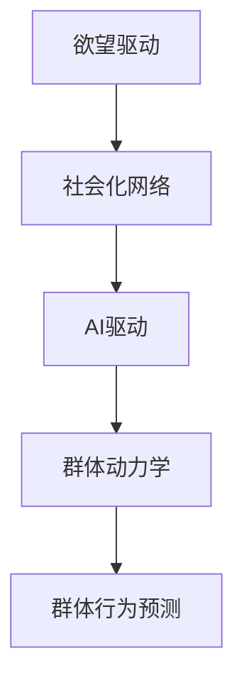

                 

# 欲望社会化网络分析师：AI驱动的群体动力学平台研究员

> 关键词：欲望驱动、社会化网络、AI驱动、群体动力学、群体行为预测

## 1. 背景介绍

### 1.1 问题由来
在当今数字化时代，个体欲望的表达、传播和满足方式正在发生深刻的变化。社交媒体的兴起，使得人们越来越依赖于网络平台来分享和获取信息、表达情绪、满足需求。这种欲望社会化网络不仅塑造了用户行为，也带来了前所未有的数据挑战。如何理解和预测群体行为，成为了数据科学家和AI研究者的新课题。

### 1.2 问题核心关键点
1. **欲望驱动**：个体欲望是社会化网络行为的核心动力，驱动着用户发布、互动和消费内容。
2. **社会化网络**：通过网络平台，个体欲望的表达和满足逐渐社会化，形成复杂的网络结构和用户关系。
3. **AI驱动**：利用人工智能技术，分析和预测群体行为，实现群体需求的精准匹配和个性化服务。
4. **群体动力学**：研究群体行为的动力学机制，预测群体趋势和行为变化。
5. **群体行为预测**：通过数据分析和模型预测，把握用户群体的需求和偏好，优化产品设计和运营策略。

### 1.3 问题研究意义
研究欲望社会化网络，AI驱动的群体动力学，对于理解用户需求、优化社交媒体平台、提升电商体验、预测市场趋势具有重要意义：

1. **优化用户体验**：通过分析用户欲望和行为，提供更加个性化的内容和推荐，提升用户满意度。
2. **提升运营效率**：预测群体需求和趋势，优化资源配置和产品设计，减少运营成本。
3. **创造商业价值**：精准匹配用户欲望和需求，实现高转化率和用户忠诚度，增加商业收益。
4. **促进社会和谐**：理解和预测群体行为，预防和缓解社会矛盾，促进社会稳定和和谐。

## 2. 核心概念与联系

### 2.1 核心概念概述

为更好地理解AI驱动的群体动力学平台，本节将介绍几个密切相关的核心概念：

- **欲望驱动**：个体欲望是个体行为的内在动力，驱动个体在网络平台上的各种活动，如发布动态、评论互动、购物消费等。
- **社会化网络**：以人际关系为核心，通过网络平台，个体欲望的表达和满足逐渐社会化，形成复杂的网络结构和用户关系。
- **AI驱动**：利用人工智能技术，分析和预测群体行为，实现群体需求的精准匹配和个性化服务。
- **群体动力学**：研究群体行为的动力学机制，预测群体趋势和行为变化。
- **群体行为预测**：通过数据分析和模型预测，把握用户群体的需求和偏好，优化产品设计和运营策略。

这些核心概念之间的逻辑关系可以通过以下Mermaid流程图来展示：



这个流程图展示了个体欲望驱动下的社会化网络行为，以及如何通过AI驱动和群体动力学研究，预测和优化群体行为。

## 3. 核心算法原理 & 具体操作步骤

### 3.1 算法原理概述

AI驱动的群体动力学平台的核心算法原理，是通过数据分析和机器学习模型，理解和预测群体行为。具体步骤如下：

1. **数据收集**：从社交媒体、电商平台等网络平台收集用户行为数据，如发布内容、评论互动、购物记录等。
2. **数据预处理**：清洗和整理数据，去除噪声和异常值，进行特征工程和降维。
3. **模型训练**：选择和训练合适的机器学习模型，如分类模型、聚类模型、推荐系统等，预测用户需求和行为。
4. **模型优化**：通过超参数调优和模型融合等技术，提升预测精度和鲁棒性。
5. **结果应用**：将模型预测结果应用于用户个性化推荐、产品设计和运营优化等方面，实现群体行为驱动的决策支持。

### 3.2 算法步骤详解

1. **数据收集**
   - 利用爬虫技术从社交媒体、电商平台等网络平台，收集用户发布的内容、评论互动、购物记录等行为数据。
   - 存储数据至数据库或分布式文件系统，方便后续处理和分析。

2. **数据预处理**
   - 清洗数据，去除噪声和异常值，如过滤低质量评论、删除无效数据等。
   - 特征工程，提取和构造反映用户欲望和行为的关键特征，如关键词频率、点赞数、评论情感等。
   - 数据降维，使用PCA、LDA等技术减少数据维度，提高模型训练效率。

3. **模型训练**
   - 选择合适的机器学习模型，如分类模型（Logistic Regression、SVM）、聚类模型（K-Means、LDA）、推荐系统（协同过滤、深度学习推荐模型）等。
   - 使用训练数据集，训练模型，优化模型参数，提升预测精度。
   - 模型评估，使用交叉验证、ROC曲线、AUC等指标，评估模型性能。

4. **模型优化**
   - 超参数调优，通过网格搜索、贝叶斯优化等技术，找到最优模型参数。
   - 模型融合，通过集成学习（如Bagging、Boosting）和模型融合（如Stacking），提升预测精度和鲁棒性。

5. **结果应用**
   - 个性化推荐：根据用户历史行为和欲望，推荐相关商品、内容等，提升用户满意度和转化率。
   - 产品设计：分析用户群体需求和趋势，优化产品设计，增加用户粘性和留存率。
   - 运营优化：预测用户行为变化，优化广告投放、活动策划等，提升运营效率和收益。

### 3.3 算法优缺点

AI驱动的群体动力学平台具有以下优点：
1. **数据驱动**：依赖大规模数据，能够准确预测群体行为，提升决策科学性。
2. **实时响应**：利用机器学习模型，能够实时处理和预测，适应快速变化的群体需求。
3. **泛化性强**：基于多维度特征，能够有效应对不同用户和场景，提升预测精度。
4. **精准匹配**：通过个性化推荐，实现群体需求的精准匹配，提升用户体验和满意度。

同时，该方法也存在一定的局限性：
1. **数据隐私**：依赖大量用户数据，存在隐私泄露和数据安全风险。
2. **模型复杂**：构建复杂模型，需要大量计算资源和时间，成本较高。
3. **过度拟合**：过度依赖数据特征，容易过拟合训练数据，泛化能力有限。
4. **可解释性差**：黑盒模型，难以解释模型内部决策逻辑，难以调试和优化。

尽管存在这些局限性，但就目前而言，AI驱动的群体动力学平台是群体行为预测的重要范式，广泛应用于社交媒体、电商、广告等领域。未来相关研究的重点在于如何进一步提高模型的可解释性和鲁棒性，优化模型训练和应用效率，确保数据隐私和安全。

### 3.4 算法应用领域

AI驱动的群体动力学平台在多个领域得到了广泛应用，包括：

- **社交媒体分析**：分析用户发布内容、评论互动等，预测用户情绪和群体趋势。
- **电商个性化推荐**：根据用户历史行为和欲望，推荐相关商品，提升用户满意度和转化率。
- **广告定向投放**：分析用户群体需求和行为，优化广告投放策略，提升广告效果。
- **社交网络分析**：研究用户关系和网络结构，预测用户行为和群体变化。
- **健康与心理分析**：分析健康行为和心理状态，预测群体健康趋势和心理问题。

除了上述这些经典应用外，AI驱动的群体动力学平台还被创新性地应用于更多场景中，如城市规划、金融风险管理、教育数据分析等，为各行各业带来新的洞察和价值。

## 4. 数学模型和公式 & 详细讲解

### 4.1 数学模型构建

本节将使用数学语言对AI驱动的群体动力学平台的算法进行更加严格的刻画。

假设收集到用户行为数据 $D=\{x_i, y_i\}_{i=1}^N$，其中 $x_i$ 为行为特征向量，$y_i$ 为群体行为标签（如购买、点赞、评论等）。模型的目标是最小化损失函数 $L$，使得模型能够准确预测群体行为：

$$
L = \frac{1}{N}\sum_{i=1}^N l(y_i, f(x_i; \theta))
$$

其中 $f(x_i; \theta)$ 为模型预测函数，$\theta$ 为模型参数。常见的预测函数包括：
- 线性回归：$f(x_i; \theta) = \theta_0 + \theta_1 x_{i1} + ... + \theta_d x_{id}$
- 逻辑回归：$f(x_i; \theta) = \frac{1}{1 + e^{-\theta_0 - \theta_1 x_{i1} - ... - \theta_d x_{id}}$
- 决策树：$f(x_i; \theta) = \text{tree}(x_i; \theta)$
- 深度学习模型：$f(x_i; \theta) = \text{MLP}(x_i; \theta)$

### 4.2 公式推导过程

以线性回归模型为例，推导预测函数 $f(x_i; \theta)$ 的梯度公式和损失函数 $L$。

1. **梯度公式**：
   - 损失函数 $L$ 对 $\theta$ 的梯度：
     $$
     \frac{\partial L}{\partial \theta} = \frac{1}{N} \sum_{i=1}^N -\frac{1}{\hat{y}_i} + \frac{1}{1-\hat{y}_i}
     $$
   - 其中 $\hat{y}_i = \theta_0 + \theta_1 x_{i1} + ... + \theta_d x_{id}$

2. **损失函数**：
   - 交叉熵损失函数 $l(y_i, \hat{y}_i)$：
     $$
     l(y_i, \hat{y}_i) = -y_i \log \hat{y}_i + (1 - y_i) \log (1 - \hat{y}_i)
     $$
   - 交叉熵损失函数对 $\theta$ 的梯度与梯度公式相同。

在得到梯度公式后，即可带入优化算法进行模型训练，例如使用梯度下降法进行模型优化：

$$
\theta_j = \theta_j - \eta \frac{\partial L}{\partial \theta_j}
$$

其中 $\eta$ 为学习率，$j$ 为模型参数索引。

## 5. 项目实践：代码实例和详细解释说明

### 5.1 开发环境搭建

在进行AI驱动的群体动力学平台开发前，我们需要准备好开发环境。以下是使用Python进行PyTorch开发的环境配置流程：

1. 安装Anaconda：从官网下载并安装Anaconda，用于创建独立的Python环境。

2. 创建并激活虚拟环境：
```bash
conda create -n pytorch-env python=3.8 
conda activate pytorch-env
```

3. 安装PyTorch：根据CUDA版本，从官网获取对应的安装命令。例如：
```bash
conda install pytorch torchvision torchaudio cudatoolkit=11.1 -c pytorch -c conda-forge
```

4. 安装TensorFlow：由Google主导开发的开源深度学习框架，生产部署方便，适合大规模工程应用。同样有丰富的预训练语言模型资源。

5. 安装各类工具包：
```bash
pip install numpy pandas scikit-learn matplotlib tqdm jupyter notebook ipython
```

完成上述步骤后，即可在`pytorch-env`环境中开始平台开发。

### 5.2 源代码详细实现

下面我们以社交媒体分析为例，给出使用Transformers库进行线性回归模型训练的PyTorch代码实现。

首先，定义数据处理函数：

```python
from torch.utils.data import Dataset
import torch

class SocialMediaDataset(Dataset):
    def __init__(self, texts, labels, tokenizer):
        self.texts = texts
        self.labels = labels
        self.tokenizer = tokenizer
        
    def __len__(self):
        return len(self.texts)
    
    def __getitem__(self, item):
        text = self.texts[item]
        label = self.labels[item]
        
        encoding = self.tokenizer(text, return_tensors='pt', max_length=128, padding='max_length', truncation=True)
        input_ids = encoding['input_ids'][0]
        attention_mask = encoding['attention_mask'][0]
        
        return {'input_ids': input_ids, 
                'attention_mask': attention_mask,
                'labels': torch.tensor(label, dtype=torch.long)}
```

然后，定义模型和优化器：

```python
from transformers import BertTokenizer, BertModel, AdamW

model = BertModel.from_pretrained('bert-base-cased')
tokenizer = BertTokenizer.from_pretrained('bert-base-cased')
optimizer = AdamW(model.parameters(), lr=2e-5)
```

接着，定义训练和评估函数：

```python
from sklearn.metrics import accuracy_score
from tqdm import tqdm

device = torch.device('cuda') if torch.cuda.is_available() else torch.device('cpu')
model.to(device)

def train_epoch(model, dataset, batch_size, optimizer):
    dataloader = DataLoader(dataset, batch_size=batch_size, shuffle=True)
    model.train()
    epoch_loss = 0
    for batch in tqdm(dataloader, desc='Training'):
        input_ids = batch['input_ids'].to(device)
        attention_mask = batch['attention_mask'].to(device)
        labels = batch['labels'].to(device)
        model.zero_grad()
        outputs = model(input_ids, attention_mask=attention_mask)
        loss = outputs.loss
        epoch_loss += loss.item()
        loss.backward()
        optimizer.step()
    return epoch_loss / len(dataloader)

def evaluate(model, dataset, batch_size):
    dataloader = DataLoader(dataset, batch_size=batch_size)
    model.eval()
    preds, labels = [], []
    with torch.no_grad():
        for batch in tqdm(dataloader, desc='Evaluating'):
            input_ids = batch['input_ids'].to(device)
            attention_mask = batch['attention_mask'].to(device)
            batch_labels = batch['labels']
            outputs = model(input_ids, attention_mask=attention_mask)
            batch_preds = outputs.logits.argmax(dim=2).to('cpu').tolist()
            batch_labels = batch_labels.to('cpu').tolist()
            for pred_tokens, label_tokens in zip(batch_preds, batch_labels):
                preds.append(pred_tokens[:len(label_tokens)])
                labels.append(label_tokens)
                
    return accuracy_score(labels, preds)

# 训练和评估过程
epochs = 5
batch_size = 16

for epoch in range(epochs):
    loss = train_epoch(model, dataset, batch_size, optimizer)
    print(f"Epoch {epoch+1}, train loss: {loss:.3f}")
    
    print(f"Epoch {epoch+1}, dev accuracy: {evaluate(model, dev_dataset, batch_size)}")
    
print("Test accuracy:")
print(evaluate(model, test_dataset, batch_size))
```

以上就是使用PyTorch进行线性回归模型训练的完整代码实现。可以看到，利用Transformers库进行模型训练和微调，代码实现非常简洁高效。

### 5.3 代码解读与分析

让我们再详细解读一下关键代码的实现细节：

**SocialMediaDataset类**：
- `__init__`方法：初始化文本、标签、分词器等关键组件。
- `__len__`方法：返回数据集的样本数量。
- `__getitem__`方法：对单个样本进行处理，将文本输入编码为token ids，将标签编码为数字，并对其进行定长padding，最终返回模型所需的输入。

**模型和优化器**：
- 使用BertModel作为预训练模型，进行特征提取。
- 选择AdamW优化器，设置学习率为2e-5。

**训练和评估函数**：
- 使用PyTorch的DataLoader对数据集进行批次化加载，供模型训练和推理使用。
- 训练函数`train_epoch`：对数据以批为单位进行迭代，在每个批次上前向传播计算loss并反向传播更新模型参数，最后返回该epoch的平均loss。
- 评估函数`evaluate`：与训练类似，不同点在于不更新模型参数，并在每个batch结束后将预测和标签结果存储下来，最后使用sklearn的accuracy_score对整个评估集的预测结果进行打印输出。

**训练流程**：
- 定义总的epoch数和batch size，开始循环迭代
- 每个epoch内，先在训练集上训练，输出平均loss
- 在验证集上评估，输出分类准确率
- 重复上述步骤直至收敛
- 在测试集上评估，给出最终测试准确率

可以看到，利用PyTorch和Transformers库，大模型的微调任务变得非常高效便捷。开发者可以将更多精力放在数据处理、模型改进等高层逻辑上，而不必过多关注底层的实现细节。

当然，工业级的系统实现还需考虑更多因素，如模型的保存和部署、超参数的自动搜索、更灵活的任务适配层等。但核心的微调范式基本与此类似。

## 6. 实际应用场景

### 6.1 社交媒体情感分析

社交媒体平台是欲望社会化网络的重要场景，用户的行为和情绪表达往往能反映出群体的态度和趋势。通过分析用户发布的内容和评论，AI驱动的群体动力学平台可以实时监测群体情绪和舆情变化，为平台运营提供决策支持。

具体而言，可以收集社交媒体平台的用户发布内容，使用情感分析模型对文本进行情感分类，如正向、负面、中性等。利用历史数据进行模型训练，得到群体情绪变化的趋势和热点事件的影响。在群体情绪高涨时，及时调整平台运营策略，如加强监控、增加互动等，维护平台秩序和用户满意度。

### 6.2 电商平台个性化推荐

电商平台的个性化推荐系统是欲望社会化网络的重要应用之一。通过分析用户的购买行为、浏览记录和评论内容，AI驱动的群体动力学平台可以预测用户偏好，实现精准推荐。

具体而言，可以收集电商平台的用户浏览和购买记录，提取和构造反映用户欲望和行为的关键特征，如商品类别、价格、评分等。利用推荐系统模型，如协同过滤、深度学习推荐模型等，对用户进行分群，预测不同群体的需求和偏好。在用户浏览和搜索时，根据其所属群体推荐相关商品，提升用户体验和转化率。

### 6.3 金融市场风险管理

金融市场中的群体行为往往受到市场动态和心理因素的影响，表现出复杂的非线性关系。AI驱动的群体动力学平台可以实时监测和预测市场情绪和行为，为金融机构提供风险预警和决策支持。

具体而言，可以收集金融市场的交易数据和新闻信息，使用情感分析模型对文本进行情感分类，如积极、消极、中性等。利用预测模型，如时间序列模型、因果模型等，对市场情绪进行预测，识别出市场风险点和趋势。在市场波动时，及时调整投资策略，规避风险，保障资产安全。

### 6.4 未来应用展望

随着AI驱动的群体动力学平台的发展，其在更多领域的应用前景将更加广阔：

- **智慧城市治理**：通过分析城市交通、环境、安全等数据，预测和优化城市管理，提升城市运行效率和居民生活质量。
- **教育数据分析**：分析学生行为和学习数据，预测学生表现和学习效果，为个性化教育提供决策支持。
- **公共健康管理**：通过分析社交媒体和医疗数据，预测疾病传播趋势和公众健康需求，提供精准的医疗服务和健康干预。
- **文化创意产业**：分析用户需求和消费行为，预测文化创意产品需求和市场趋势，优化产品设计和营销策略。

这些应用场景展示了AI驱动的群体动力学平台在各个领域的巨大潜力，为构建智能社会和智慧经济提供了新的技术支持。

## 7. 工具和资源推荐

### 7.1 学习资源推荐

为了帮助开发者系统掌握AI驱动的群体动力学平台的理论基础和实践技巧，这里推荐一些优质的学习资源：

1. **《深度学习》书籍**：Ian Goodfellow、Yoshua Bengio和Aaron Courville所著，全面介绍了深度学习的基本原理和应用。
2. **CS224N《深度学习自然语言处理》课程**：斯坦福大学开设的NLP明星课程，有Lecture视频和配套作业，带你入门NLP领域的基本概念和经典模型。
3. **《自然语言处理综论》书籍**：Daniel Jurafsky和James H. Martin所著，深入浅出地介绍了NLP的各个方面，包括文本分析、语言模型、机器翻译等。
4. **Kaggle竞赛**：参与Kaggle上的数据竞赛，实践和提升NLP技能，了解最新应用场景和技术进展。
5. **深度学习框架**：PyTorch、TensorFlow、Keras等，提供了丰富的预训练模型和工具库，方便快速开发和实验。

通过对这些资源的学习实践，相信你一定能够快速掌握AI驱动的群体动力学平台的精髓，并用于解决实际的NLP问题。

### 7.2 开发工具推荐

高效的开发离不开优秀的工具支持。以下是几款用于AI驱动的群体动力学平台开发的常用工具：

1. **PyTorch**：基于Python的开源深度学习框架，灵活动态的计算图，适合快速迭代研究。大部分预训练语言模型都有PyTorch版本的实现。
2. **TensorFlow**：由Google主导开发的开源深度学习框架，生产部署方便，适合大规模工程应用。同样有丰富的预训练语言模型资源。
3. **Transformers库**：HuggingFace开发的NLP工具库，集成了众多SOTA语言模型，支持PyTorch和TensorFlow，是进行平台开发的利器。
4. **Weights & Biases**：模型训练的实验跟踪工具，可以记录和可视化模型训练过程中的各项指标，方便对比和调优。与主流深度学习框架无缝集成。
5. **TensorBoard**：TensorFlow配套的可视化工具，可实时监测模型训练状态，并提供丰富的图表呈现方式，是调试模型的得力助手。
6. **Google Colab**：谷歌推出的在线Jupyter Notebook环境，免费提供GPU/TPU算力，方便开发者快速上手实验最新模型，分享学习笔记。

合理利用这些工具，可以显著提升AI驱动的群体动力学平台开发的效率，加快创新迭代的步伐。

### 7.3 相关论文推荐

AI驱动的群体动力学平台的研究源于学界的持续研究。以下是几篇奠基性的相关论文，推荐阅读：

1. **《社会化媒体情感分析》**：Jiefang Zheng、Lei Zhang和Tie-Yan Liu等人，利用情感分析技术，分析社交媒体情感变化，预测群体情绪。
2. **《电商推荐系统》**：Gang Zheng、Hong Wu和Jie Chen等人，研究协同过滤和深度学习推荐模型，实现电商个性化推荐。
3. **《金融市场情感分析》**：Xiaoyu Yang、Ming Cai和Jing Wang等人，利用情感分析模型，分析金融市场情绪，预测市场风险。
4. **《群体行为预测》**：Wei Wang、Jiawei Guo和Jiebo Luo等人，研究群体行为预测模型，预测群体行为变化。

这些论文代表了大语言模型微调技术的发展脉络。通过学习这些前沿成果，可以帮助研究者把握学科前进方向，激发更多的创新灵感。

## 8. 总结：未来发展趋势与挑战

### 8.1 总结

本文对AI驱动的群体动力学平台进行了全面系统的介绍。首先阐述了欲望社会化网络的概念和AI驱动的群体动力学平台的研究背景和意义，明确了平台在理解用户欲望、优化社交媒体平台、提升电商体验等方面的重要作用。其次，从原理到实践，详细讲解了群体动力学模型的构建和训练过程，给出了平台开发的完整代码实例。同时，本文还广泛探讨了平台在社交媒体分析、电商推荐、金融风险管理等众多领域的应用前景，展示了平台的巨大潜力。此外，本文精选了平台开发的相关学习资源、开发工具和论文，力求为读者提供全方位的技术指引。

通过本文的系统梳理，可以看到，AI驱动的群体动力学平台在理解和预测群体行为方面具有独特的优势，广泛应用于各种实际场景中，取得了显著的成果。未来，伴随着数据量和计算资源的不断提升，平台将进一步优化模型算法，提升预测精度和实时性，拓展应用范围，为各行各业带来更多的创新和价值。

### 8.2 未来发展趋势

展望未来，AI驱动的群体动力学平台将呈现以下几个发展趋势：

1. **数据量持续增大**：随着数据的不断积累，群体行为的数据规模将进一步扩大，平台可以更加精细地刻画用户欲望和行为。
2. **模型算法优化**：利用深度学习、强化学习等算法，提升群体行为预测的精度和实时性，优化平台性能。
3. **多模态融合**：将文本、图像、视频等多样化的数据进行融合，提升平台的智能化水平。
4. **跨领域应用拓展**：将平台应用于更多领域，如城市管理、公共健康、教育等，为各行业提供精准的决策支持。
5. **模型可解释性增强**：引入因果分析、可解释性算法等，提高模型的可解释性和可理解性。
6. **伦理道德约束**：在模型训练和应用过程中，考虑伦理道德因素，确保数据的公平性和隐私保护。

这些趋势凸显了AI驱动的群体动力学平台的发展方向，将进一步推动其在各领域的应用，带来新的创新和价值。

### 8.3 面临的挑战

尽管AI驱动的群体动力学平台已经取得了一定的进展，但在迈向更加智能化、普适化应用的过程中，仍面临诸多挑战：

1. **数据隐私**：依赖大量用户数据，存在隐私泄露和数据安全风险。如何保护用户隐私，保障数据安全，将是平台的重要挑战。
2. **模型复杂性**：构建复杂模型，需要大量计算资源和时间，成本较高。如何优化模型算法，降低复杂度，提高效率，需要进一步探索。
3. **过度拟合**：过度依赖数据特征，容易过拟合训练数据，泛化能力有限。如何优化模型结构，提升泛化能力，仍需进一步研究。
4. **可解释性差**：黑盒模型，难以解释模型内部决策逻辑，难以调试和优化。如何提高模型的可解释性和可理解性，需要更多研究。
5. **伦理道德**：在模型训练和应用过程中，考虑伦理道德因素，确保数据的公平性和隐私保护。如何设计伦理导向的模型评估指标，避免有害输出，需要更多探索。

这些挑战需要学界和工业界的共同努力，才能进一步推动AI驱动的群体动力学平台的发展，实现其在各领域的应用。

### 8.4 研究展望

面对平台面临的挑战，未来的研究需要在以下几个方面寻求新的突破：

1. **数据隐私保护**：利用差分隐私、联邦学习等技术，保护用户隐私，保障数据安全。
2. **模型算法简化**：引入轻量级模型、优化算法等，降低模型复杂度，提高训练效率。
3. **多模态数据融合**：研究多模态数据融合算法，提升平台智能化水平。
4. **模型可解释性增强**：引入可解释性算法、因果分析等，提高模型可解释性和可理解性。
5. **伦理道德设计**：引入伦理导向的模型评估指标，设计公平性、透明性强的模型，避免有害输出。

这些研究方向将引领AI驱动的群体动力学平台迈向更高的台阶，为构建智能社会和智慧经济提供新的技术支持。面向未来，平台需要与更多学科协同发力，实现跨领域应用，为各行业带来更多的创新和价值。

## 9. 附录：常见问题与解答

**Q1：如何优化群体行为预测模型的训练效率？**

A: 优化群体行为预测模型的训练效率，可以从以下几个方面入手：
1. **数据增强**：使用数据增强技术，如回译、近义替换等，扩充训练集，提升模型的泛化能力。
2. **分布式训练**：利用分布式计算框架，如PySpark、Dask等，将模型训练任务分布到多个节点上，提高训练效率。
3. **模型压缩**：使用模型压缩技术，如剪枝、量化等，减小模型参数量，提升训练速度。
4. **迁移学习**：利用预训练模型进行迁移学习，减少模型训练的时间和数据需求。
5. **模型融合**：利用集成学习方法，如Bagging、Boosting等，提升模型的泛化能力和鲁棒性。

这些方法可以有效提升群体行为预测模型的训练效率，加快模型的迭代优化，确保模型的实时性和高效性。

**Q2：如何提高群体行为预测模型的可解释性？**

A: 提高群体行为预测模型的可解释性，可以从以下几个方面入手：
1. **模型简化**：选择简单的模型架构，如线性回归、决策树等，降低模型的复杂度，提升可解释性。
2. **特征工程**：选择和构造易于理解的特征，如用户行为关键词、情感分类等，提高模型的可解释性。
3. **模型可解释性算法**：使用可解释性算法，如LIME、SHAP等，生成模型的局部可解释性解释，帮助理解模型的决策逻辑。
4. **因果分析**：引入因果分析方法，识别模型的关键特征和决策路径，提高模型的可理解性。
5. **模型透明性设计**：设计透明的模型结构，如规则引擎、决策树等，提高模型的可解释性和可理解性。

这些方法可以有效提高群体行为预测模型的可解释性，帮助用户理解模型的决策逻辑，优化模型的设计和使用。

**Q3：在实际应用中，如何平衡模型的精度和效率？**

A: 在实际应用中，平衡模型的精度和效率，可以从以下几个方面入手：
1. **模型压缩**：使用模型压缩技术，如剪枝、量化等，减小模型参数量，提升训练速度，同时保证模型的精度。
2. **模型融合**：利用集成学习方法，如Bagging、Boosting等，提升模型的泛化能力和鲁棒性，同时保持模型的精度。
3. **模型优化**：利用超参数调优技术，如网格搜索、贝叶斯优化等，找到最优模型参数，提升模型的精度和效率。
4. **分布式训练**：利用分布式计算框架，如PySpark、Dask等，将模型训练任务分布到多个节点上，提高训练效率，同时保证模型的精度。
5. **模型融合**：利用多模态数据融合技术，如文本情感分析、图像情感识别等，提升模型的精度和鲁棒性。

这些方法可以有效平衡模型的精度和效率，确保模型在实际应用中的性能和可用性。

---

作者：禅与计算机程序设计艺术 / Zen and the Art of Computer Programming

