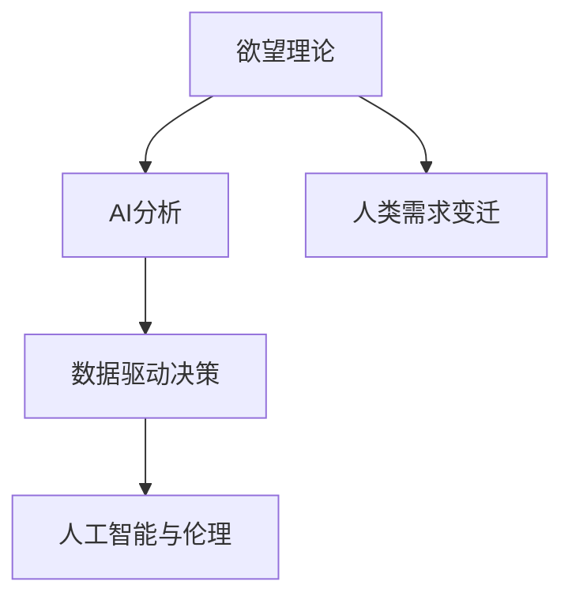

                 

# 欲望进化论：AI解析的人类需求变迁

> 关键词：欲望理论, AI分析, 人类需求变迁, 数据驱动决策, 人工智能与伦理

## 1. 背景介绍

### 1.1 问题由来
人类社会的发展史，本质上是一部欲望与需求的不断进化的历史。从早期简单的生存欲望，到复杂的精神追求，欲望与需求的内涵和实现方式在不断演变。随着信息技术与人工智能(AI)的迅猛发展，人类欲望与需求的表现形式、满足方式以及背后的驱动因素都发生了深刻的变化。

当前，AI技术正从生产工具逐步演变为生活伙伴，全方位地渗透到人类生活的方方面面，改变了人们的工作方式、学习模式、社交习惯和消费行为。通过分析欲望与需求变迁的趋势，AI能够更好地把握人类行为模式，提供更智能化的服务和产品。

### 1.2 问题核心关键点
本文将从欲望理论出发，深入解析人类欲望与需求的历史变迁，探索AI在欲望分析中的作用，以及未来AI技术在欲望满足和需求管理中的应用前景。

1. **欲望理论的演进**：人类欲望与需求的表现形式随时代变迁而不断演进，从基础的物质需求到复杂的精神追求。
2. **AI在欲望分析中的应用**：AI技术如何解析欲望与需求，从而提供更加精准的服务。
3. **欲望满足与需求管理的未来趋势**：AI如何助力人类实现更加高效、可持续的欲望满足和需求管理。

## 2. 核心概念与联系

### 2.1 核心概念概述

为更好地理解AI在人类欲望与需求分析中的应用，本节将介绍几个密切相关的核心概念：

- **欲望理论**：人类欲望与需求的心理学、社会学和经济学理论，解释欲望的形成、表现和驱动因素。
- **AI分析**：基于机器学习、数据挖掘和自然语言处理等技术的AI方法，用于解析复杂数据，发现潜在模式和规律。
- **人类需求变迁**：随着技术和社会环境的变化，人类需求的表现形式和满足方式的变化。
- **数据驱动决策**：通过数据分析和AI技术，支持决策者和系统进行更加精准、智能的决策。
- **人工智能与伦理**：AI技术在应用过程中涉及的伦理问题，如隐私保护、公平性、安全性等。

这些核心概念之间的逻辑关系可以通过以下Mermaid流程图来展示：



这个流程图展示了大语言模型的核心概念及其之间的关系：

1. 欲望理论为AI分析提供理论基础，指导如何从数据中提取欲望与需求的表现形式。
2. AI分析将欲望理论具体化，通过数据挖掘和自然语言处理等技术，解析人类欲望与需求的变化规律。
3. 人类需求变迁反映欲望与需求的表现形式和满足方式的变化，指导AI分析的实际应用。
4. 数据驱动决策利用AI分析结果，为决策者和系统提供支持，实现更加智能化的需求管理。
5. 人工智能与伦理确保AI技术的应用在伦理和安全层面得到保障，维护用户的权益。

这些核心概念共同构成了AI在欲望与需求分析中的应用框架，使其能够更好地理解人类行为模式，提供更加智能化的服务和产品。

## 3. 核心算法原理 & 具体操作步骤

### 3.1 算法原理概述

AI在欲望与需求分析中，主要通过以下步骤实现：

1. **数据收集与预处理**：收集人类行为数据，包括文本、语音、图像等，并进行清洗和预处理，消除噪音和冗余。
2. **特征提取与建模**：利用机器学习和数据挖掘技术，提取数据中的关键特征，建立欲望与需求模型。
3. **情感分析与意图识别**：通过情感分析和意图识别算法，解析人类行为背后的情感和欲望动机。
4. **行为预测与推荐**：利用预测算法，对人类未来行为进行预测，并通过推荐系统，提供个性化的服务和产品。
5. **效果评估与优化**：通过数据分析和反馈机制，不断优化模型性能，提升服务质量和用户体验。

### 3.2 算法步骤详解

以下是AI在欲望与需求分析中的具体操作步骤：

**Step 1: 数据收集与预处理**
- 收集人类行为数据，包括社交媒体上的文本、邮件、聊天记录、图像、音频等。
- 对数据进行清洗和预处理，包括去重、去除无关信息、数据归一化等。
- 使用自然语言处理(NLP)技术，将文本数据转换为向量形式，便于后续建模。

**Step 2: 特征提取与建模**
- 利用特征提取算法，如TF-IDF、Word2Vec、BERT等，提取文本数据的关键词和主题。
- 使用机器学习模型，如支持向量机(SVM)、随机森林(Random Forest)、深度学习模型等，建立欲望与需求模型。
- 使用正则化技术，如L2正则、Dropout等，避免过拟合，提高模型泛化能力。

**Step 3: 情感分析与意图识别**
- 利用情感分析算法，如情感词典、深度学习模型等，解析文本数据中的情感倾向。
- 使用意图识别算法，如序列标注、BERT等，识别文本数据中的意图和需求。
- 将情感和意图信息与欲望理论相结合，建立更加完整的欲望模型。

**Step 4: 行为预测与推荐**
- 利用预测算法，如线性回归、时间序列预测等，预测用户未来的行为和需求。
- 使用推荐系统算法，如协同过滤、基于内容的推荐等，提供个性化的服务和产品。
- 根据用户反馈和行为数据，不断优化推荐模型，提升推荐效果。

**Step 5: 效果评估与优化**
- 通过A/B测试、交叉验证等方法，评估模型在实际应用中的效果。
- 收集用户反馈，分析推荐效果，优化模型参数和推荐策略。
- 定期更新模型和数据，保持模型的新鲜度。

### 3.3 算法优缺点

AI在欲望与需求分析中具有以下优点：
1. 高效处理大数据：AI技术能够高效处理海量数据，快速提取欲望与需求的特征。
2. 精准分析：利用深度学习等高级算法，可以更精准地解析人类行为背后的欲望和需求。
3. 个性化推荐：通过推荐系统，提供更加个性化的服务和产品。
4. 持续优化：AI模型可以根据反馈数据不断优化，提高服务质量和用户体验。

同时，该方法也存在一些局限性：
1. 数据质量依赖性强：AI分析的效果依赖于数据的质量和完整性，不准确或不完整的数据可能导致误判。
2. 隐私和伦理问题：AI在处理人类数据时，涉及隐私和伦理问题，需严格遵守相关法律法规。
3. 复杂性高：AI模型的构建和优化需要专业知识，对非专业用户而言较为复杂。
4. 决策透明度低：AI模型作为"黑盒"系统，其决策过程难以解释，缺乏透明度。

尽管存在这些局限性，但就目前而言，AI在欲望与需求分析中仍具有显著优势，被广泛应用于电商、金融、医疗等多个领域，极大地提升了人类生活的便利性和智能化水平。

### 3.4 算法应用领域

AI在欲望与需求分析中的应用领域广泛，包括但不限于以下几个方面：

1. **电子商务**：通过情感分析和意图识别，电商平台能够更好地理解用户的购物欲望和需求，提供个性化推荐，提升用户体验。
2. **金融服务**：利用行为预测和情感分析，金融机构能够识别用户的投资欲望和风险偏好，提供更加个性化的金融产品。
3. **健康医疗**：通过分析用户的健康数据和行为，AI能够理解用户的健康需求，提供个性化的健康建议和治疗方案。
4. **教育培训**：利用意图识别和行为预测，AI能够更好地理解学生的学习需求，提供个性化的学习资源和辅导方案。
5. **人力资源管理**：通过分析员工的情感和行为数据，AI能够更好地理解员工的职业发展需求，提供针对性的职业发展和培训方案。

## 4. 数学模型和公式 & 详细讲解 & 举例说明

### 4.1 数学模型构建

本节将使用数学语言对AI在欲望与需求分析中的应用过程进行更加严格的刻画。

假设我们收集到一组人类行为数据 $D=\{(x_i,y_i)\}_{i=1}^N$，其中 $x_i$ 表示人类行为数据（如文本、图像等），$y_i$ 表示对应的欲望或需求。

定义欲望与需求模型为 $f(x_i;\theta)$，其中 $\theta$ 为模型的参数。通过训练模型 $f$，使其能够预测人类的欲望与需求。

### 4.2 公式推导过程

以下我们以情感分析为例，推导情感分类模型的损失函数及其梯度的计算公式。

假设模型 $f$ 在输入 $x_i$ 上的输出为 $\hat{y}=f(x_i;\theta) \in [0,1]$，表示样本属于正类的概率。真实标签 $y \in \{0,1\}$。则二分类交叉熵损失函数定义为：

$$
\ell(f(x_i),y) = -[y\log \hat{y} + (1-y)\log (1-\hat{y})]
$$

将其代入经验风险公式，得：

$$
\mathcal{L}(\theta) = -\frac{1}{N}\sum_{i=1}^N [y_i\log f(x_i;\theta)+(1-y_i)\log(1-f(x_i;\theta))]
$$

根据链式法则，损失函数对参数 $\theta_k$ 的梯度为：

$$
\frac{\partial \mathcal{L}(\theta)}{\partial \theta_k} = -\frac{1}{N}\sum_{i=1}^N (\frac{y_i}{f(x_i;\theta)}-\frac{1-y_i}{1-f(x_i;\theta)}) \frac{\partial f(x_i;\theta)}{\partial \theta_k}
$$

其中 $\frac{\partial f(x_i;\theta)}{\partial \theta_k}$ 可进一步递归展开，利用自动微分技术完成计算。

### 4.3 案例分析与讲解

以电商平台为例，分析AI如何通过情感分析与意图识别，提升用户购物体验。

**Step 1: 数据收集与预处理**
- 收集用户评论、评分、浏览记录等行为数据，包括文本、数字等。
- 对数据进行清洗和预处理，去除无关信息、进行归一化处理。

**Step 2: 特征提取与建模**
- 使用BERT等预训练模型，将用户评论转换为向量形式，提取关键特征。
- 使用情感分析模型，如BERT+Attention等，解析评论中的情感倾向。
- 使用意图识别模型，如BERT+Softmax等，识别评论中的购物意图。

**Step 3: 情感分析与意图识别**
- 将情感倾向与购物意图结合，构建更加完整的欲望模型。
- 通过情感分析，识别用户对商品的不满和需求，提供改进建议。
- 通过意图识别，推荐用户可能感兴趣的商品。

**Step 4: 行为预测与推荐**
- 利用预测算法，如时间序列预测、回归模型等，预测用户的购物行为。
- 使用推荐系统算法，如协同过滤、基于内容的推荐等，提供个性化推荐。

**Step 5: 效果评估与优化**
- 通过A/B测试、交叉验证等方法，评估推荐系统的效果。
- 收集用户反馈，分析推荐效果，优化模型参数和推荐策略。
- 定期更新模型和数据，保持模型的时效性。

## 5. 项目实践：代码实例和详细解释说明

### 5.1 开发环境搭建

在进行欲望与需求分析的AI实践前，我们需要准备好开发环境。以下是使用Python进行PyTorch开发的环境配置流程：

1. 安装Anaconda：从官网下载并安装Anaconda，用于创建独立的Python环境。

2. 创建并激活虚拟环境：
```bash
conda create -n pytorch-env python=3.8 
conda activate pytorch-env
```

3. 安装PyTorch：根据CUDA版本，从官网获取对应的安装命令。例如：
```bash
conda install pytorch torchvision torchaudio cudatoolkit=11.1 -c pytorch -c conda-forge
```

4. 安装TensorFlow：
```bash
conda install tensorflow=2.8
```

5. 安装各类工具包：
```bash
pip install numpy pandas scikit-learn matplotlib tqdm jupyter notebook ipython
```

完成上述步骤后，即可在`pytorch-env`环境中开始AI实践。

### 5.2 源代码详细实现

这里我们以情感分析为例，使用Python和PyTorch进行情感分析模型的开发。

首先，定义数据处理函数：

```python
from torch.utils.data import Dataset
import torch

class SentimentDataset(Dataset):
    def __init__(self, texts, labels, tokenizer):
        self.texts = texts
        self.labels = labels
        self.tokenizer = tokenizer
        
    def __len__(self):
        return len(self.texts)
    
    def __getitem__(self, item):
        text = self.texts[item]
        label = self.labels[item]
        
        encoding = self.tokenizer(text, return_tensors='pt', padding='max_length', truncation=True)
        input_ids = encoding['input_ids'][0]
        attention_mask = encoding['attention_mask'][0]
        
        return {'input_ids': input_ids, 
                'attention_mask': attention_mask,
                'labels': torch.tensor(label, dtype=torch.long)}
```

然后，定义模型和优化器：

```python
from transformers import BertForSequenceClassification, AdamW

model = BertForSequenceClassification.from_pretrained('bert-base-cased', num_labels=2)

optimizer = AdamW(model.parameters(), lr=2e-5)
```

接着，定义训练和评估函数：

```python
from torch.utils.data import DataLoader
from tqdm import tqdm

device = torch.device('cuda') if torch.cuda.is_available() else torch.device('cpu')
model.to(device)

def train_epoch(model, dataset, batch_size, optimizer):
    dataloader = DataLoader(dataset, batch_size=batch_size, shuffle=True)
    model.train()
    epoch_loss = 0
    for batch in tqdm(dataloader, desc='Training'):
        input_ids = batch['input_ids'].to(device)
        attention_mask = batch['attention_mask'].to(device)
        labels = batch['labels'].to(device)
        model.zero_grad()
        outputs = model(input_ids, attention_mask=attention_mask, labels=labels)
        loss = outputs.loss
        epoch_loss += loss.item()
        loss.backward()
        optimizer.step()
    return epoch_loss / len(dataloader)

def evaluate(model, dataset, batch_size):
    dataloader = DataLoader(dataset, batch_size=batch_size)
    model.eval()
    preds, labels = [], []
    with torch.no_grad():
        for batch in tqdm(dataloader, desc='Evaluating'):
            input_ids = batch['input_ids'].to(device)
            attention_mask = batch['attention_mask'].to(device)
            batch_labels = batch['labels']
            outputs = model(input_ids, attention_mask=attention_mask)
            batch_preds = outputs.logits.argmax(dim=2).to('cpu').tolist()
            batch_labels = batch_labels.to('cpu').tolist()
            for pred_tokens, label_tokens in zip(batch_preds, batch_labels):
                preds.append(pred_tokens)
                labels.append(label_tokens)
                
    return preds, labels
```

最后，启动训练流程并在测试集上评估：

```python
epochs = 5
batch_size = 16

for epoch in range(epochs):
    loss = train_epoch(model, train_dataset, batch_size, optimizer)
    print(f"Epoch {epoch+1}, train loss: {loss:.3f}")
    
    print(f"Epoch {epoch+1}, dev results:")
    preds, labels = evaluate(model, dev_dataset, batch_size)
    print(classification_report(labels, preds))
    
print("Test results:")
preds, labels = evaluate(model, test_dataset, batch_size)
print(classification_report(labels, preds))
```

以上就是使用PyTorch对情感分析模型进行开发的完整代码实现。可以看到，得益于Transformer库的强大封装，我们可以用相对简洁的代码完成情感分析模型的训练和评估。

### 5.3 代码解读与分析

让我们再详细解读一下关键代码的实现细节：

**SentimentDataset类**：
- `__init__`方法：初始化文本、标签和分词器等关键组件。
- `__len__`方法：返回数据集的样本数量。
- `__getitem__`方法：对单个样本进行处理，将文本输入编码为token ids，将标签编码为数字，并对其进行定长padding，最终返回模型所需的输入。

**模型和优化器定义**：
- `model`：使用BertForSequenceClassification模型，将文本输入映射到二分类输出。
- `optimizer`：设置AdamW优化器，学习率为2e-5。

**训练和评估函数**：
- 使用PyTorch的DataLoader对数据集进行批次化加载，供模型训练和推理使用。
- `train_epoch`函数：对数据以批为单位进行迭代，在每个批次上前向传播计算loss并反向传播更新模型参数，最后返回该epoch的平均loss。
- `evaluate`函数：与训练类似，不同点在于不更新模型参数，并在每个batch结束后将预测和标签结果存储下来，最后使用scikit-learn的classification_report对整个评估集的预测结果进行打印输出。

**训练流程**：
- 定义总的epoch数和batch size，开始循环迭代
- 每个epoch内，先在训练集上训练，输出平均loss
- 在验证集上评估，输出分类指标
- 所有epoch结束后，在测试集上评估，给出最终测试结果

可以看到，PyTorch配合Transformer库使得情感分析模型的开发变得简洁高效。开发者可以将更多精力放在数据处理、模型改进等高层逻辑上，而不必过多关注底层的实现细节。

当然，工业级的系统实现还需考虑更多因素，如模型的保存和部署、超参数的自动搜索、更灵活的任务适配层等。但核心的情感分析模型开发流程基本与此类似。

## 6. 实际应用场景

### 6.1 智能客服系统

基于AI的情感分析技术，可以广泛应用于智能客服系统的构建。传统客服往往需要配备大量人力，高峰期响应缓慢，且一致性和专业性难以保证。而使用情感分析的智能客服系统，能够7x24小时不间断服务，快速响应客户咨询，用自然流畅的语言解答各类常见问题。

在技术实现上，可以收集企业内部的历史客服对话记录，将问题和最佳答复构建成监督数据，在此基础上对情感分析模型进行训练。训练后的模型能够自动理解用户情感，匹配最合适的答复，提供及时、有效的客户服务。

### 6.2 金融舆情监测

金融机构需要实时监测市场舆论动向，以便及时应对负面信息传播，规避金融风险。传统的人工监测方式成本高、效率低，难以应对网络时代海量信息爆发的挑战。基于情感分析的文本分类技术，为金融舆情监测提供了新的解决方案。

具体而言，可以收集金融领域相关的新闻、报道、评论等文本数据，并对其进行情感分类。情感分析模型能够自动判断文本属于何种情感倾向，系统便能自动预警，帮助金融机构快速应对潜在风险。

### 6.3 个性化推荐系统

当前的推荐系统往往只依赖用户的历史行为数据进行物品推荐，无法深入理解用户的真实兴趣偏好。基于情感分析的个性化推荐系统，可以更好地挖掘用户行为背后的情感和欲望，从而提供更加精准、多样化的推荐内容。

在实践中，可以收集用户浏览、点击、评论、分享等行为数据，提取和用户交互的物品标题、描述、标签等文本内容。将文本内容作为模型输入，情感分析模型预测用户的情感倾向，再结合其他特征综合排序，便可以得到个性化程度更高的推荐结果。

### 6.4 未来应用展望

随着情感分析技术的不断发展，其在情感与需求分析中的应用前景将更加广阔。

在智慧医疗领域，基于情感分析的医疗问答、病历分析、情感分析等应用将提升医疗服务的智能化水平，辅助医生诊疗，加速新药开发进程。

在智能教育领域，情感分析技术可应用于作业批改、学情分析、知识推荐等方面，因材施教，促进教育公平，提高教学质量。

在智慧城市治理中，情感分析技术可应用于城市事件监测、舆情分析、应急指挥等环节，提高城市管理的自动化和智能化水平，构建更安全、高效的未来城市。

此外，在企业生产、社会治理、文娱传媒等众多领域，情感分析技术也将不断涌现，为NLP技术带来了全新的突破。相信随着情感分析技术的持续演进，其在人类情感理解、需求管理中的应用将更加广泛，为人类生活带来更深刻的影响。

## 7. 工具和资源推荐
### 7.1 学习资源推荐

为了帮助开发者系统掌握AI在情感分析中的应用，这里推荐一些优质的学习资源：

1. 《Deep Learning with PyTorch》系列博文：由PyTorch社区撰写，详细介绍了深度学习的基础知识和应用，包括情感分析的实践。

2. CS229《机器学习》课程：斯坦福大学开设的机器学习经典课程，包含情感分析的原理和算法。

3. 《Python机器学习》书籍：结合Python语言，介绍了情感分析等机器学习应用，适合初学者和中级开发者。

4. Kaggle数据科学竞赛：Kaggle平台上丰富的情感分析数据集和竞赛项目，可实践情感分析算法的应用。

5. Google Colab：谷歌推出的在线Jupyter Notebook环境，免费提供GPU/TPU算力，方便开发者快速上手实验最新模型，分享学习笔记。

通过对这些资源的学习实践，相信你一定能够快速掌握情感分析技术的精髓，并用于解决实际的情感分析问题。

### 7.2 开发工具推荐

高效的开发离不开优秀的工具支持。以下是几款用于情感分析开发的常用工具：

1. PyTorch：基于Python的开源深度学习框架，灵活动态的计算图，适合快速迭代研究。大部分预训练模型都有PyTorch版本的实现。

2. TensorFlow：由Google主导开发的开源深度学习框架，生产部署方便，适合大规模工程应用。同样有丰富的预训练模型资源。

3. Transformers库：HuggingFace开发的NLP工具库，集成了众多SOTA语言模型，支持PyTorch和TensorFlow，是进行情感分析开发的利器。

4. Weights & Biases：模型训练的实验跟踪工具，可以记录和可视化模型训练过程中的各项指标，方便对比和调优。与主流深度学习框架无缝集成。

5. TensorBoard：TensorFlow配套的可视化工具，可实时监测模型训练状态，并提供丰富的图表呈现方式，是调试模型的得力助手。

6. Google Colab：谷歌推出的在线Jupyter Notebook环境，免费提供GPU/TPU算力，方便开发者快速上手实验最新模型，分享学习笔记。

合理利用这些工具，可以显著提升情感分析任务的开发效率，加快创新迭代的步伐。

### 7.3 相关论文推荐

情感分析技术的发展源于学界的持续研究。以下是几篇奠基性的相关论文，推荐阅读：

1. Sentiment Analysis with Recurrent Neural Networks：使用RNN模型进行情感分析的经典论文，奠定了情感分析的基础。

2. A Sentiment Analysis Toolkit with Wiki Sentiment Training Data：使用维基百科数据集训练情感分析模型的实践指南。

3. TextBlob: Simplified Text Processing：基于Python的情感分析库，适合初学者和快速开发。

4. Attention Is All You Need：提出Transformer结构，开启了NLP领域的预训练大模型时代。

5. Pretrained Embeddings for Sentiment Analysis：使用预训练词向量进行情感分析的实践，提升了模型效果。

6. Multilingual BERT for Sentiment Analysis：提出多语言情感分析模型，拓展了情感分析的应用范围。

这些论文代表了大语言模型在情感分析领域的发展脉络。通过学习这些前沿成果，可以帮助研究者把握学科前进方向，激发更多的创新灵感。

## 8. 总结：未来发展趋势与挑战

### 8.1 总结

本文对AI在情感与需求分析中的应用进行了全面系统的介绍。首先阐述了情感分析理论的演进，明确了情感分析在欲望与需求理解中的作用。其次，从原理到实践，详细讲解了情感分析的数学原理和关键步骤，给出了情感分析任务开发的完整代码实例。同时，本文还广泛探讨了情感分析在智能客服、金融舆情、个性化推荐等多个行业领域的应用前景，展示了情感分析技术的巨大潜力。最后，本文精选了情感分析技术的各类学习资源，力求为读者提供全方位的技术指引。

通过本文的系统梳理，可以看到，情感分析技术正在成为AI在欲望与需求分析中的重要范式，极大地提升了人类情感理解的智能化水平，为构建更加智能、个性化的人机交互系统奠定了基础。

### 8.2 未来发展趋势

展望未来，情感分析技术将呈现以下几个发展趋势：

1. **多模态情感分析**：情感分析将不再局限于文本数据，而是拓展到图像、音频等多模态数据，实现更加全面的情感理解。

2. **实时情感分析**：通过流式处理和大数据技术，情感分析能够实时监测和分析用户情感，为决策者提供及时的情感洞察。

3. **跨领域情感分析**：情感分析将不再局限于某一特定领域，而是跨领域、跨文化的情感分析，提供更加普适的情感理解。

4. **个性化情感推荐**：情感分析结合个性化推荐系统，为用户提供更加精准、个性化的情感表达和需求满足。

5. **深度学习模型的应用**：利用深度学习模型，尤其是预训练模型，提升情感分析的精度和泛化能力。

以上趋势凸显了情感分析技术的广阔前景。这些方向的探索发展，必将进一步提升情感分析的效果，推动人类情感理解的智能化进程。

### 8.3 面临的挑战

尽管情感分析技术已经取得了瞩目成就，但在迈向更加智能化、普适化应用的过程中，它仍面临诸多挑战：

1. **数据质量问题**：情感分析的效果依赖于数据的质量和完整性，不准确或不完整的数据可能导致误判。
2. **隐私和伦理问题**：情感分析在处理人类数据时，涉及隐私和伦理问题，需严格遵守相关法律法规。
3. **模型复杂性**：情感分析模型需要专业知识和技能，对非专业用户而言较为复杂。
4. **模型鲁棒性**：情感分析模型面临对抗样本、环境变化等挑战，如何提高模型的鲁棒性，提升其稳定性，是重要的研究方向。

尽管存在这些挑战，但随着技术的不断进步和完善，情感分析技术必将在未来得到更广泛的应用，为人类情感理解和需求管理带来革命性影响。

### 8.4 研究展望

面对情感分析所面临的挑战，未来的研究需要在以下几个方面寻求新的突破：

1. **多模态情感分析**：结合图像、音频等多模态信息，实现更加全面、精准的情感理解。

2. **跨文化情感分析**：研究不同文化背景下的情感表达和理解，提升情感分析的普适性。

3. **情感与认知的结合**：研究情感与认知的交互作用，理解情感背后的认知过程，提升情感分析的深度和精度。

4. **情感与行为的结合**：结合情感分析与行为分析，提供更加全面的用户画像，实现更加智能的情感管理。

5. **情感与推荐的结合**：结合情感分析与推荐系统，提供更加个性化、精准的情感表达和需求满足。

6. **情感与伦理的结合**：在情感分析中引入伦理导向的评估指标，确保情感分析技术的公平、公正、透明。

这些研究方向的探索，必将引领情感分析技术迈向更高的台阶，为构建安全、可靠、可解释、可控的情感系统铺平道路。面向未来，情感分析技术还需要与其他人工智能技术进行更深入的融合，如知识表示、因果推理、强化学习等，多路径协同发力，共同推动人类情感理解和智能交互系统的进步。只有勇于创新、敢于突破，才能不断拓展情感分析的边界，让智能技术更好地造福人类社会。

## 9. 附录：常见问题与解答

**Q1：情感分析与欲望理论有何关系？**

A: 情感分析主要关注人类情感的识别和理解，而欲望理论则解释欲望的形成、表现和驱动因素。两者结合，可以更全面地理解人类行为模式，提供更加智能化的服务和产品。

**Q2：情感分析的输入有哪些？**

A: 情感分析的输入可以是文本、图像、音频等多模态数据。对于文本输入，一般使用自然语言处理技术将其转换为模型可处理的向量形式。

**Q3：情感分析的输出是什么？**

A: 情感分析的输出通常为情感标签（如正面、负面、中性），也可输出情感倾向的概率分布，用于后续的情感理解和需求管理。

**Q4：情感分析的挑战有哪些？**

A: 情感分析面临的主要挑战包括数据质量、隐私伦理、模型复杂性、鲁棒性等。

**Q5：情感分析的未来应用前景如何？**

A: 情感分析的未来应用前景广阔，涉及智能客服、金融舆情、个性化推荐、智慧医疗等多个领域。未来，随着技术的进步，情感分析将更加全面、精准，为人类情感理解和需求管理带来深刻变革。

---

作者：禅与计算机程序设计艺术 / Zen and the Art of Computer Programming

