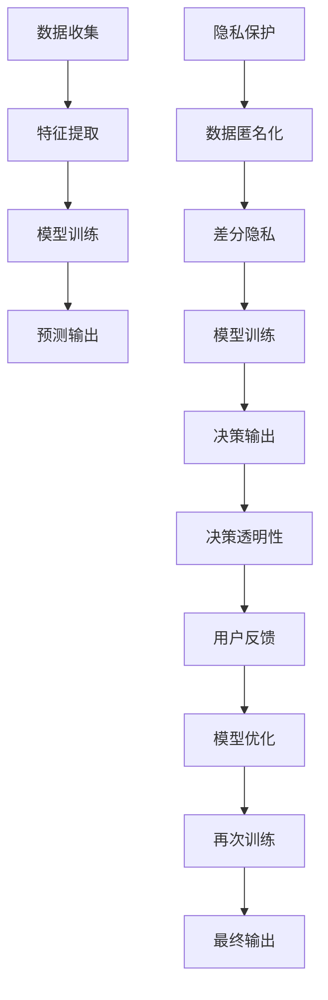

                 

## 1. 背景介绍

### 1.1 问题由来

在人工智能快速发展的今天，欲望预测技术日益成为研究热点。欲望预测不仅涉及如何准确理解和预测个人行为，也关联到隐私保护、自由意志等伦理问题。对于企业而言，欲望预测可以优化供应链管理、提升营销效果；对于政府部门，它可应用于公共政策制定、提升社会治理效率。然而，欲望预测过程中个人隐私的滥用和数据伦理风险亦日益凸显。

### 1.2 问题核心关键点

欲望预测技术的核心在于如何从海量数据中提取出行为特征，并准确预测用户的个性化需求和行为。在技术层面，它主要依赖机器学习算法，尤其是深度学习模型，如循环神经网络(RNN)、长短时记忆网络(LSTM)、自注意力机制(Transformer)等。而在伦理层面，则关注如何保障个人隐私、自由选择权和决策透明性。

当前，欲望预测技术在提升效率和优化决策的同时，也给个人隐私保护和伦理决策带来了新的挑战。如何在提升技术效能的同时，兼顾隐私保护、自由选择和伦理责任，是欲望预测技术需要正视的重要问题。

## 2. 核心概念与联系

### 2.1 核心概念概述

为更好地理解欲望预测技术的伦理问题，本节将介绍几个关键概念：

- 欲望预测(Desire Prediction)：通过机器学习算法，从用户行为数据中提取特征，并预测用户的个性化需求和行为。
- 深度学习(Deep Learning)：以多层神经网络为基础的机器学习方法，通过反向传播算法优化模型，可实现复杂的非线性关系建模。
- 隐私保护(Privacy Protection)：旨在通过技术手段，保护个人信息不被未经授权使用，包括数据匿名化、差分隐私等。
- 自由意志(Free Will)：指个体做出自主选择的能力，是伦理决策的关键考量因素。
- 决策透明性(Decision Transparency)：要求决策过程可解释、可追溯，确保用户了解决策依据，有足够的参与度。

这些核心概念之间相互联系，共同构成了欲望预测技术的研究基础。从数据收集、模型训练到决策应用，每一步都需考量如何平衡技术效能与伦理要求，以期在促进社会进步的同时，保障个人权益。

### 2.2 核心概念原理和架构的 Mermaid 流程图



这个流程图展示了欲望预测技术从数据收集到最终输出的全流程。其中，数据收集后经过特征提取和隐私保护处理，用于模型训练和预测输出。预测输出后需确保决策透明，并基于用户反馈进行模型优化和重新训练。

## 3. 核心算法原理 & 具体操作步骤

### 3.1 算法原理概述

欲望预测主要依赖机器学习算法，尤其是深度学习模型。以下简要介绍循环神经网络(RNN)和长短时记忆网络(LSTM)的工作原理：

- **循环神经网络(RNN)**：RNN是一种特殊的神经网络，适用于序列数据的处理，能够通过循环结构记忆先前的状态，从而捕捉序列数据的长期依赖关系。
- **长短时记忆网络(LSTM)**：LSTM是RNN的一种改进，通过引入门控机制，解决了传统RNN的梯度消失和梯度爆炸问题，更适用于处理长期依赖关系的数据。

### 3.2 算法步骤详解

欲望预测模型的构建和训练大致包括以下步骤：

1. **数据准备**：收集和整理用户行为数据，包括点击、浏览、购买等行为记录。需注意数据的隐私保护，确保数据合法合规。
2. **特征工程**：对原始数据进行预处理，包括去重、归一化、特征编码等。此外，可通过时间序列、频次统计等方式提取更丰富的特征信息。
3. **模型选择与训练**：根据需求选择合适的模型架构，如RNN、LSTM、Transformer等。使用训练集进行模型训练，调整超参数以提升模型效果。
4. **隐私保护**：对训练和预测数据进行匿名化处理，避免个人隐私泄露。例如，使用K匿名化、L_diversity等方法保护用户隐私。
5. **模型评估**：在验证集上评估模型性能，如准确率、召回率、F1-score等指标。结合AUC、ROC曲线等方法，确保模型的泛化能力。
6. **决策透明性**：通过可解释性模型或后处理方式，确保模型的预测结果可解释、可追溯。例如，使用LIME、SHAP等工具生成模型解释。
7. **用户反馈**：收集用户对预测结果的反馈，进一步优化模型性能和决策公平性。

### 3.3 算法优缺点

**优点**：
- **高效性**：深度学习模型能够处理复杂的非线性关系，适用于各类高维数据，预测精度较高。
- **可解释性**：通过模型解释工具，部分深度学习模型能够提供一定的决策依据，增强用户对模型的信任。
- **可扩展性**：欲望预测模型基于通用机器学习框架，易于扩展到不同领域和任务。

**缺点**：
- **数据依赖性**：深度学习模型需要大量标注数据进行训练，数据收集和标注成本高。
- **过拟合风险**：深度学习模型容易过拟合，特别是在数据量较小的情况下。
- **隐私风险**：数据隐私保护措施不足，可能导致个人隐私泄露。
- **伦理挑战**：模型决策过程难以解释，存在偏见和歧视风险，挑战自由意志和决策透明性。

### 3.4 算法应用领域

欲望预测技术已经广泛应用于多个领域，具体包括：

1. **电子商务**：通过预测用户购买欲望，优化库存管理、推荐系统，提升用户体验和销售收益。
2. **健康医疗**：预测患者健康需求，提供个性化医疗建议和治疗方案，改善患者健康状况。
3. **金融服务**：预测用户金融需求和行为，优化贷款审批、风险评估，提升服务质量和客户满意度。
4. **公共安全**：预测犯罪趋势和公共安全事件，提升社会治理效率和应急响应能力。
5. **内容推荐**：预测用户对内容的偏好，优化内容推荐算法，提供更加个性化和精准的服务。

## 4. 数学模型和公式 & 详细讲解 & 举例说明

### 4.1 数学模型构建

本节将使用数学语言对欲望预测模型的训练过程进行详细刻画。

假设我们有训练数据集 $\mathcal{D} = \{(x_i, y_i)\}_{i=1}^N$，其中 $x_i$ 表示用户行为数据，$y_i$ 表示对应欲望标签。模型的目标是通过训练，最小化预测误差。使用均方误差作为损失函数，模型参数优化问题可以形式化为：

$$
\min_{\theta} \frac{1}{N} \sum_{i=1}^N (y_i - \hat{y}_i)^2
$$

其中 $\hat{y}_i = f(x_i; \theta)$，$f$ 为模型预测函数，$\theta$ 为模型参数。

### 4.2 公式推导过程

以最简单的前馈神经网络模型为例，其预测函数可以表示为：

$$
\hat{y}_i = W^{[2]}h(x_i; W^{[1]}, b^{[1]}) + b^{[2]}
$$

其中 $h(x_i; W^{[1]}, b^{[1]})$ 为隐藏层输出，$W^{[1]}$ 和 $b^{[1]}$ 为隐藏层权重和偏置，$W^{[2]}$ 和 $b^{[2]}$ 为输出层权重和偏置。

均方误差损失函数为：

$$
L(y_i, \hat{y}_i) = \frac{1}{2}(y_i - \hat{y}_i)^2
$$

通过反向传播算法，计算梯度并更新模型参数：

$$
\frac{\partial L}{\partial \theta} = \frac{\partial L}{\partial \hat{y}_i} \frac{\partial \hat{y}_i}{\partial x_i} \frac{\partial x_i}{\partial \theta}
$$

其中 $\frac{\partial L}{\partial \hat{y}_i}$ 为链式法则中的当前层梯度，$\frac{\partial \hat{y}_i}{\partial x_i}$ 为当前层的雅可比矩阵，$\frac{\partial x_i}{\partial \theta}$ 为数据和模型参数的导数。

### 4.3 案例分析与讲解

以用户点击行为预测为例，假设输入特征包括用户浏览记录、点击时间、浏览时长等。模型通过多层神经网络对这些特征进行处理，最终输出点击概率。

假设原始数据如下：

$$
\begin{align*}
x_1 &= (1, 2, 3, 4) \\
x_2 &= (5, 6, 7, 8) \\
y_1 &= 1, y_2 &= 0
\end{align*}
$$

经过特征预处理，输入为标准化向量：

$$
\begin{align*}
x_1' &= \frac{x_1 - \mu}{\sigma} \\
x_2' &= \frac{x_2 - \mu}{\sigma}
\end{align*}
$$

其中 $\mu$ 和 $\sigma$ 为均值和标准差。

假设模型预测函数为 $f(x; \theta) = \sigma(W^{[2]}h(x; W^{[1]}, b^{[1]}) + b^{[2]})$，其中 $\sigma$ 为激活函数，$h(x; W^{[1]}, b^{[1]})$ 为隐藏层输出。

通过反向传播算法，计算梯度并更新模型参数：

$$
\begin{align*}
\frac{\partial L}{\partial W^{[1]}} &= \frac{\partial L}{\partial \hat{y}_i} \frac{\partial \hat{y}_i}{\partial h(x_i; W^{[1]}, b^{[1]})} \frac{\partial h(x_i; W^{[1]}, b^{[1]})}{\partial W^{[1]}} \\
\frac{\partial L}{\partial b^{[1]}} &= \frac{\partial L}{\partial \hat{y}_i} \frac{\partial \hat{y}_i}{\partial h(x_i; W^{[1]}, b^{[1]})} \\
\frac{\partial L}{\partial W^{[2]}} &= \frac{\partial L}{\partial \hat{y}_i} \frac{\partial \hat{y}_i}{\partial x_i} \\
\frac{\partial L}{\partial b^{[2]}} &= \frac{\partial L}{\partial \hat{y}_i}
\end{align*}
$$

假设初始化 $W^{[1]} = 0$，$b^{[1]} = 0$，$W^{[2]} = 1$，$b^{[2]} = 0$。通过梯度下降算法更新模型参数：

$$
\begin{align*}
W^{[1]}_{t+1} &= W^{[1]}_t - \eta \frac{\partial L}{\partial W^{[1]}} \\
b^{[1]}_{t+1} &= b^{[1]}_t - \eta \frac{\partial L}{\partial b^{[1]}} \\
W^{[2]}_{t+1} &= W^{[2]}_t - \eta \frac{\partial L}{\partial W^{[2]}} \\
b^{[2]}_{t+1} &= b^{[2]}_t - \eta \frac{\partial L}{\partial b^{[2]}}
\end{align*}
$$

其中 $\eta$ 为学习率。通过迭代更新模型参数，逐步提升模型的预测能力。

## 5. 项目实践：代码实例和详细解释说明

### 5.1 开发环境搭建

在进行欲望预测模型开发前，我们需要准备好开发环境。以下是使用Python进行PyTorch开发的环境配置流程：

1. 安装Anaconda：从官网下载并安装Anaconda，用于创建独立的Python环境。

2. 创建并激活虚拟环境：
```bash
conda create -n pytorch-env python=3.8 
conda activate pytorch-env
```

3. 安装PyTorch：根据CUDA版本，从官网获取对应的安装命令。例如：
```bash
conda install pytorch torchvision torchaudio cudatoolkit=11.1 -c pytorch -c conda-forge
```

4. 安装TensorFlow：由Google主导开发的开源深度学习框架，生产部署方便，适合大规模工程应用。同样有丰富的预训练语言模型资源。

5. 安装各类工具包：
```bash
pip install numpy pandas scikit-learn matplotlib tqdm jupyter notebook ipython
```

完成上述步骤后，即可在`pytorch-env`环境中开始欲望预测模型的开发。

### 5.2 源代码详细实现

下面我们以用户点击行为预测为例，给出使用PyTorch实现的前馈神经网络模型代码。

首先，定义模型结构：

```python
import torch
import torch.nn as nn
import torch.nn.functional as F

class Net(nn.Module):
    def __init__(self, input_size, hidden_size, output_size):
        super(Net, self).__init__()
        self.fc1 = nn.Linear(input_size, hidden_size)
        self.fc2 = nn.Linear(hidden_size, output_size)
        
    def forward(self, x):
        x = F.relu(self.fc1(x))
        x = self.fc2(x)
        return F.sigmoid(x)
```

然后，定义训练和评估函数：

```python
import torch.optim as optim
from sklearn.metrics import accuracy_score

device = torch.device('cuda') if torch.cuda.is_available() else torch.device('cpu')

def train_epoch(model, data_loader, optimizer):
    model.train()
    total_loss = 0
    for batch in data_loader:
        inputs, labels = batch.to(device)
        optimizer.zero_grad()
        outputs = model(inputs)
        loss = F.binary_cross_entropy(outputs, labels)
        loss.backward()
        optimizer.step()
        total_loss += loss.item()
    return total_loss / len(data_loader)

def evaluate(model, data_loader):
    model.eval()
    total_preds = []
    total_labels = []
    with torch.no_grad():
        for batch in data_loader:
            inputs, labels = batch.to(device)
            outputs = model(inputs)
            batch_preds = outputs.argmax(dim=1).to('cpu').tolist()
            batch_labels = labels.to('cpu').tolist()
            total_preds.extend(batch_preds[:len(batch_labels)])
            total_labels.extend(batch_labels)
    accuracy = accuracy_score(total_labels, total_preds)
    print(f"Accuracy: {accuracy:.3f}")
```

最后，启动训练流程并在测试集上评估：

```python
epochs = 10
batch_size = 32

model = Net(input_size=4, hidden_size=64, output_size=1).to(device)
optimizer = optim.SGD(model.parameters(), lr=0.01)

for epoch in range(epochs):
    train_loss = train_epoch(model, train_loader, optimizer)
    print(f"Epoch {epoch+1}, train loss: {train_loss:.3f}")
    
    evaluate(model, test_loader)
```

以上就是使用PyTorch实现欲望预测模型的完整代码实现。可以看到，借助PyTorch的强大封装，我们可以用相对简洁的代码实现欲望预测模型的开发和评估。

### 5.3 代码解读与分析

让我们再详细解读一下关键代码的实现细节：

**Net类**：
- `__init__`方法：定义模型的层结构，包括两个全连接层和激活函数。
- `forward`方法：前向传播计算输出。

**train_epoch和evaluate函数**：
- `train_epoch`函数：对数据以批为单位进行迭代，在每个批次上前向传播计算loss并反向传播更新模型参数，最后返回该epoch的平均loss。
- `evaluate`函数：与训练类似，不同点在于不更新模型参数，并在每个batch结束后将预测和标签结果存储下来，最后使用sklearn的accuracy_score计算模型精度。

**训练流程**：
- 定义总的epoch数和batch size，开始循环迭代
- 每个epoch内，先在训练集上训练，输出平均loss
- 在测试集上评估，输出模型精度
- 所有epoch结束后，在测试集上评估，给出最终测试结果

可以看到，PyTorch配合TensorFlow提供了强大的机器学习开发工具，极大提升了模型开发的效率和效果。开发者可以将更多精力放在数据处理、模型改进等高层逻辑上，而不必过多关注底层的实现细节。

当然，工业级的系统实现还需考虑更多因素，如模型的保存和部署、超参数的自动搜索、更灵活的任务适配层等。但核心的模型构建和训练流程基本与此类似。

## 6. 实际应用场景

### 6.1 智能推荐系统

智能推荐系统能够根据用户历史行为和偏好，实时预测和推荐个性化内容。欲望预测技术在此场景中发挥了重要作用，可以通过分析用户点击、浏览、购买等行为，准确预测其接下来可能感兴趣的内容。

在技术实现上，可以收集用户的行为数据，构建欲望预测模型，根据预测结果实时生成推荐列表。推荐系统可以进一步与自然语言处理技术结合，通过生成个性化文本描述，增强用户体验和互动性。

### 6.2 金融风险管理

金融风险管理中，预测用户投资需求和行为至关重要。欲望预测技术可以用于分析用户的交易历史和行为模式，预测其未来投资行为和风险偏好，帮助金融机构制定个性化服务策略。

在实际应用中，可以通过收集用户历史交易数据，训练欲望预测模型，预测其投资意愿和风险承受能力。金融机构可以据此提供差异化服务，提升用户满意度和业务收益。

### 6.3 公共政策制定

公共政策制定中，预测公众需求和行为可以提升政策的针对性和有效性。欲望预测技术在此场景中能够分析社会舆情、公众反馈，预测各类公共政策的社会接受度和影响效果，为政策制定提供科学依据。

具体而言，可以通过收集社会调查数据、社交媒体反馈等，训练欲望预测模型，预测公众对各类政策的支持度和潜在影响。政府部门可以根据预测结果，调整和优化政策方案，确保政策的可行性和公平性。

## 7. 工具和资源推荐

### 7.1 学习资源推荐

为了帮助开发者系统掌握欲望预测技术，这里推荐一些优质的学习资源：

1. 《深度学习》系列博文：由深度学习领域专家撰写，详细介绍了深度学习模型的构建和训练方法，涵盖了循环神经网络、长短时记忆网络等关键技术。

2. CS231n《深度学习计算机视觉》课程：斯坦福大学开设的深度学习课程，详细讲解了深度学习在计算机视觉中的应用，包括图像分类、目标检测等任务。

3. 《Python深度学习》书籍：深度学习领域经典入门书籍，详细介绍了深度学习框架PyTorch和TensorFlow的使用方法，适合初学者入门。

4. Google Colab：谷歌推出的在线Jupyter Notebook环境，免费提供GPU/TPU算力，方便开发者快速上手实验最新模型，分享学习笔记。

5. GitHub代码库：GitHub上有大量开源的欲望预测模型代码和案例，适合参考学习。

通过对这些资源的学习实践，相信你一定能够快速掌握欲望预测技术的精髓，并用于解决实际的业务问题。

### 7.2 开发工具推荐

高效的开发离不开优秀的工具支持。以下是几款用于欲望预测开发的常用工具：

1. PyTorch：基于Python的开源深度学习框架，灵活动态的计算图，适合快速迭代研究。

2. TensorFlow：由Google主导开发的开源深度学习框架，生产部署方便，适合大规模工程应用。

3. Keras：高层次深度学习框架，适合快速原型设计和模型部署。

4. Weights & Biases：模型训练的实验跟踪工具，可以记录和可视化模型训练过程中的各项指标，方便对比和调优。

5. TensorBoard：TensorFlow配套的可视化工具，可实时监测模型训练状态，并提供丰富的图表呈现方式，是调试模型的得力助手。

6. Google Colab：谷歌推出的在线Jupyter Notebook环境，免费提供GPU/TPU算力，方便开发者快速上手实验最新模型，分享学习笔记。

合理利用这些工具，可以显著提升欲望预测模型的开发效率，加快创新迭代的步伐。

### 7.3 相关论文推荐

欲望预测技术的发展源于学界的持续研究。以下是几篇奠基性的相关论文，推荐阅读：

1. Long Short-Term Memory Networks for Conversational Machine Translation（LSTM在机器翻译中的应用）：提出LSTM网络，提升了机器翻译的长期依赖关系建模能力。

2. Deep Reinforcement Learning for Personalized News Article Recommendation（深度强化学习在个性化新闻推荐中的应用）：提出深度强化学习模型，实现了个性化新闻推荐系统的构建。

3. A Survey on Learning Models for Personalized Recommendation（个性化推荐学习模型的综述）：详细综述了各类个性化推荐学习模型，包括协同过滤、矩阵分解、深度学习等。

4. Explainable AI：Interpreting Black Box Models and Building Transparent AI Systems（可解释人工智能）：提出多种可解释性方法，帮助理解深度学习模型的决策过程。

5. Privacy-Preserving Machine Learning（隐私保护机器学习）：详细介绍隐私保护技术，包括数据匿名化、差分隐私等方法。

这些论文代表了大规模欲望预测技术的发展脉络。通过学习这些前沿成果，可以帮助研究者把握学科前进方向，激发更多的创新灵感。

## 8. 总结：未来发展趋势与挑战

### 8.1 总结

本文对基于机器学习的欲望预测技术进行了全面系统的介绍。首先阐述了欲望预测技术的研究背景和意义，明确了模型训练、数据隐私保护和伦理决策的关键点。其次，从原理到实践，详细讲解了欲望预测模型的构建和训练流程，给出了模型开发的完整代码实例。同时，本文还探讨了欲望预测技术在推荐系统、金融风险管理、公共政策制定等多个领域的应用前景，展示了技术的多样性和潜力。此外，本文精选了模型开发、隐私保护、伦理决策等各类学习资源，力求为开发者提供全方位的技术指引。

通过本文的系统梳理，可以看到，欲望预测技术正在成为人工智能领域的重要范式，通过精准的个性化推荐，提升了用户满意度和业务效益，同时也为社会治理提供了新的视角和方法。欲望预测技术的持续演进，将极大提升信息获取和决策的智能化水平，为构建更加智能、普适、伦理的社会环境做出贡献。

### 8.2 未来发展趋势

展望未来，欲望预测技术将呈现以下几个发展趋势：

1. **模型复杂性提升**：随着深度学习技术的不断发展，模型结构和参数量将进一步增大，提升模型的表现能力和泛化能力。

2. **多模态融合**：结合文本、图像、语音等多种模态数据，提升欲望预测的准确性和鲁棒性。

3. **隐私保护技术进步**：引入差分隐私、联邦学习等技术，进一步保护用户数据隐私，增强模型安全性。

4. **决策透明性提升**：引入可解释性模型和后处理方式，提升模型决策的透明性和可信度。

5. **用户参与度增强**：通过用户反馈和模型优化，增强用户对模型的信任和满意度。

6. **伦理决策的重视**：随着技术的普及和应用，伦理决策将成为欲望预测技术的核心考量，确保技术应用过程中的人权和自由。

以上趋势凸显了欲望预测技术在提升社会智能化水平的同时，也需要兼顾隐私保护、伦理决策等多重因素。这些方向的探索发展，将进一步推动欲望预测技术走向成熟，为构建更加智能、普适、伦理的社会环境提供有力支持。

### 8.3 面临的挑战

尽管欲望预测技术已经取得了显著进展，但在应用过程中仍面临诸多挑战：

1. **数据获取和标注成本**：欲望预测模型需要大量高质量标注数据，数据获取和标注成本较高。

2. **隐私保护不足**：欲望预测模型的训练和应用过程中，数据隐私风险较大，可能存在数据泄露的风险。

3. **伦理决策难题**：欲望预测模型存在偏见和歧视风险，可能对特定群体产生不利影响。

4. **计算资源需求高**：欲望预测模型通常需要大量计算资源进行训练和推理，对硬件设施提出较高要求。

5. **模型泛化能力**：模型在大规模数据上的泛化能力不足，可能在特定场景下表现不佳。

6. **决策透明性不足**：模型的决策过程难以解释，难以进行有效监管和审计。

正视欲望预测面临的这些挑战，积极应对并寻求突破，将是大规模欲望预测技术走向成熟的必由之路。相信随着学界和产业界的共同努力，这些挑战终将一一被克服，欲望预测技术必将在构建智能、普适、伦理的社会环境中发挥更大的作用。

### 8.4 研究展望

面对欲望预测技术所面临的挑战，未来的研究需要在以下几个方面寻求新的突破：

1. **隐私保护技术的创新**：开发更高效、更安全的隐私保护算法，如联邦学习、差分隐私等，保护用户数据隐私。

2. **伦理决策机制的构建**：引入伦理导向的决策机制，确保欲望预测模型的公平性、透明性和可解释性。

3. **可解释性模型的研究**：开发更加可解释的欲望预测模型，增强模型的透明性和可信度。

4. **多模态数据的整合**：结合视觉、语音等多种模态数据，提升欲望预测的准确性和鲁棒性。

5. **跨领域应用的探索**：将欲望预测技术应用于更多领域，如医疗、金融、教育等，提升各领域的智能化水平。

6. **用户参与度的提升**：设计更加互动和个性化的系统，增强用户参与度和满意度。

这些研究方向的探索，必将引领欲望预测技术迈向更高的台阶，为构建智能、普适、伦理的社会环境提供有力支持。面向未来，欲望预测技术还需要与其他人工智能技术进行更深入的融合，如知识表示、因果推理、强化学习等，多路径协同发力，共同推动人工智能技术的进步。只有勇于创新、敢于突破，才能不断拓展欲望预测的边界，让智能技术更好地造福人类社会。

## 9. 附录：常见问题与解答

**Q1：如何评估欲望预测模型的性能？**

A: 欲望预测模型的评估指标主要包括以下几种：

1. **准确率(Accuracy)**：预测正确样本数与总样本数之比，衡量模型的分类准确性。
2. **召回率(Recall)**：预测正确正类样本数与真实正类样本数之比，衡量模型对正类的识别能力。
3. **F1-score**：综合考虑准确率和召回率，衡量模型的整体性能。
4. **ROC曲线和AUC**：绘制ROC曲线，计算曲线下的面积AUC，衡量模型在不同阈值下的性能。

评估指标应根据具体任务和需求进行选择，结合多种指标进行综合评估。

**Q2：如何在欲望预测模型中引入隐私保护技术？**

A: 隐私保护技术主要包括以下几种：

1. **数据匿名化**：通过添加噪声、替换标识符等方法，对原始数据进行匿名化处理，保护用户隐私。
2. **差分隐私**：在模型训练和预测过程中，引入随机噪声，保护个体隐私，同时保证模型性能。
3. **联邦学习**：将模型训练过程分散到多个数据持有方，通过分布式协同训练，保护数据隐私。
4. **安全多方计算**：在模型训练和推理过程中，采用安全多方计算技术，确保数据在多方参与的情况下不泄露。

结合具体场景，选择合适的隐私保护技术，确保模型训练和应用过程中用户数据的安全。

**Q3：欲望预测模型在实际应用中如何处理偏见和歧视问题？**

A: 偏见和歧视问题是欲望预测模型常见的伦理问题，需要通过以下方法进行缓解：

1. **数据多样化**：收集多样化的数据，避免数据偏见，提升模型的公平性。
2. **模型优化**：采用偏见检测和修正算法，去除模型中的偏见成分。
3. **模型解释**：通过可解释性模型和后处理方式，增强模型的透明性，便于识别和修正偏见。
4. **伦理导向**：引入伦理导向的决策机制，确保模型的公平性和透明性。

综合应用以上方法，可以最大限度地减少欲望预测模型中的偏见和歧视问题，提升模型的公平性和可信度。

**Q4：欲望预测模型在实际应用中如何提高决策透明性？**

A: 提高决策透明性是欲望预测模型的重要任务，可通过以下方法实现：

1. **可解释性模型**：采用可解释性强的模型，如LIME、SHAP等，生成模型的决策路径和特征权重。
2. **模型解释工具**：使用模型解释工具，如TensorBoard、Weights & Biases等，可视化模型的训练和推理过程，增强模型的透明性。
3. **用户反馈**：收集用户对模型决策的反馈，进一步优化模型性能和决策透明性。

通过以上方法，可以增强欲望预测模型的决策透明性，提升用户的信任和满意度。

**Q5：欲望预测模型在实际应用中如何提升计算效率？**

A: 提升欲望预测模型的计算效率是实际应用中的重要任务，可通过以下方法实现：

1. **模型压缩**：通过模型剪枝、参数共享等方法，减小模型的计算量和存储空间。
2. **量化加速**：将浮点模型转为定点模型，压缩存储空间，提高计算效率。
3. **硬件优化**：采用GPU、TPU等高性能设备，加速模型推理和训练。
4. **分布式计算**：采用分布式计算框架，如Spark、Dask等，提高模型训练的并行性和效率。

综合应用以上方法，可以显著提升欲望预测模型的计算效率，满足实际应用的需求。

---

作者：禅与计算机程序设计艺术 / Zen and the Art of Computer Programming

