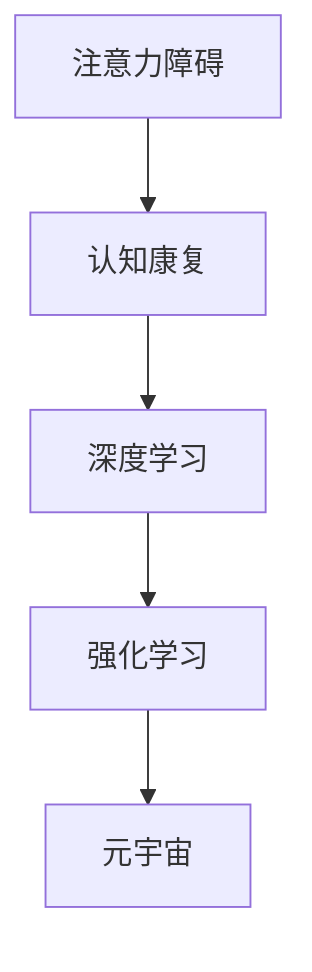

                 

# 注意力分散症治疗:元宇宙时代的认知障碍康复

> 关键词：元宇宙,认知障碍,注意力分散症,认知康复,人工智能,神经网络,深度学习

## 1. 背景介绍

### 1.1 问题由来
在数字化时代和元宇宙技术的快速发展的背景下，人们的注意力分散问题越来越严重。这不仅影响到个人的工作效率和学习效果，还可能引发一系列心理健康问题，如焦虑、抑郁等。因此，针对注意力分散症的治疗和认知康复成为当前的迫切需求。

注意力分散症（Attention Deficit Hyperactivity Disorder, ADHD）是一种常见的神经发育障碍，特征为注意力难以集中、多动冲动等。在传统治疗手段中，如药物治疗、行为干预等，往往效果有限，且依赖性强。近年来，随着人工智能和深度学习技术的发展，基于神经网络的认知康复方法逐步成为研究热点。

### 1.2 问题核心关键点
认知康复的核心目标是帮助个体恢复注意力控制和注意力集中能力。基于神经网络的认知康复方法通过训练深度学习模型，使其能够对注意力障碍进行评估和治疗。这种方法通常分为两个步骤：首先是注意力障碍的评估，其次是注意力训练的实施。

评估过程中，模型通过分析用户的行为数据，如眼动轨迹、脑电图等，识别注意力缺陷的特征。训练过程中，模型通过强化学习等手段，指导用户进行一系列注意力集中练习，逐步恢复其注意力控制能力。

### 1.3 问题研究意义
基于神经网络的认知康复方法能够实现精准、个性化的治疗，为注意力障碍患者提供有效的治疗手段。其研究意义在于：

1. 降低治疗成本：相比传统治疗手段，神经网络方法可以大幅降低时间和金钱成本，使更多患者能够获得有效的治疗。
2. 提高治疗效果：通过个性化的训练方案，神经网络方法能够实现更精准的注意力康复，提升患者的长期生活质量。
3. 增强治疗的灵活性：神经网络方法可以根据患者的反馈和进展，动态调整训练方案，提升治疗效果。
4. 推动心理学研究：认知康复技术的发展，为心理学研究提供了新的工具和方法，促进对注意力障碍机制的深入理解。
5. 推动元宇宙技术应用：注意力分散症治疗技术的发展，有助于增强元宇宙环境下的用户体验，推动元宇宙技术的普及。

## 2. 核心概念与联系

### 2.1 核心概念概述

为了更好地理解认知康复中神经网络的应用，本节将介绍几个密切相关的核心概念：

- 注意力障碍：指个体在注意力集中、分配、转移和保持方面的困难，表现为注意力分散、易受干扰等。
- 认知康复：通过各种方法恢复认知功能，包括注意力、记忆、语言、执行功能等。
- 深度学习：一种模拟人脑神经网络的计算模型，通过多层次的非线性变换，实现对复杂数据的深度分析和特征提取。
- 强化学习：一种机器学习算法，通过与环境的交互，不断优化策略，以最大化某种奖励。
- 元宇宙：一个基于虚拟现实、增强现实和区块链等技术构建的虚拟世界，提供沉浸式的用户体验。

这些核心概念之间的逻辑关系可以通过以下Mermaid流程图来展示：



这个流程图展示了大语言模型的核心概念及其之间的关系：

1. 注意力障碍是认知康复的目标。
2. 深度学习是实现认知康复的重要手段。
3. 强化学习是深度学习中的关键算法。
4. 元宇宙环境为认知康复提供了新的应用场景。

这些概念共同构成了认知康复技术的基础，使其能够在各种场景下发挥作用。通过理解这些核心概念，我们可以更好地把握认知康复的工作原理和优化方向。

## 3. 核心算法原理 & 具体操作步骤
### 3.1 算法原理概述

基于神经网络的认知康复方法，核心思想是通过深度学习模型对注意力障碍进行评估和训练。其核心步骤包括：

1. 数据收集：收集用户的注意力相关数据，如眼动轨迹、脑电图、行为数据等。
2. 模型训练：使用深度学习模型对数据进行训练，识别注意力障碍的特征。
3. 注意力评估：使用训练好的模型对用户进行注意力评估，确定其注意力缺陷的类型和程度。
4. 注意力训练：根据评估结果，设计个性化的注意力训练方案，通过强化学习等手段进行训练。
5. 效果评估：对训练效果进行评估，调整训练方案，优化治疗效果。

### 3.2 算法步骤详解

以下是对认知康复中神经网络方法的主要步骤的详细讲解：

**Step 1: 数据收集**

收集用户的注意力相关数据是认知康复的第一步。常用的数据源包括：

- 眼动轨迹：通过眼球追踪设备记录用户的视线轨迹，分析其注意力集中程度和转移情况。
- 脑电图：通过脑电图设备记录用户的脑电信号，分析其注意力状态和脑波变化。
- 行为数据：通过行为监测设备记录用户的行为数据，如鼠标移动、按键操作等，分析其注意力集中和行为一致性。

**Step 2: 模型训练**

使用深度学习模型对收集到的数据进行训练。常用的模型包括：

- 卷积神经网络（CNN）：用于分析眼动轨迹等高维时序数据。
- 循环神经网络（RNN）：用于分析脑电图等时间序列数据。
- 长短期记忆网络（LSTM）：用于处理复杂的时间序列数据。
- 注意力机制：用于增强模型对关键特征的关注，提升注意力识别能力。

模型训练过程包括以下步骤：

1. 数据预处理：对原始数据进行归一化、平滑等处理，提升模型训练效果。
2. 特征提取：使用卷积、池化等技术，提取数据的关键特征。
3. 模型训练：使用损失函数和优化算法，最小化模型预测误差，优化模型参数。
4. 模型评估：使用测试集对训练好的模型进行评估，确定其准确性和泛化能力。

**Step 3: 注意力评估**

使用训练好的模型对用户进行注意力评估。评估过程包括以下步骤：

1. 数据输入：将用户的行为数据输入模型，得到注意力评估结果。
2. 结果解读：根据模型输出，确定用户注意力缺陷的类型和程度。
3. 报告生成：生成详细的注意力评估报告，供医生和治疗师参考。

**Step 4: 注意力训练**

根据注意力评估结果，设计个性化的注意力训练方案。训练过程包括以下步骤：

1. 训练方案设计：根据评估结果，设计个性化的注意力训练任务和目标。
2. 训练方案实施：使用强化学习等手段，指导用户进行注意力训练。
3. 训练效果监测：实时监测用户的训练效果，根据反馈进行调整。
4. 训练结束：训练结束后，评估用户的注意力恢复情况，确定治疗效果。

### 3.3 算法优缺点

基于神经网络的认知康复方法具有以下优点：

1. 精准度：通过深度学习模型对大量数据进行分析，能够实现更精准的注意力障碍评估和治疗。
2. 个性化：根据用户的具体情况，设计个性化的注意力训练方案，提升治疗效果。
3. 可扩展性：神经网络方法可应用于多种注意力障碍类型，具有较强的泛化能力。
4. 自主性：用户可以在家中使用相关设备进行自我训练，减少医疗资源消耗。

同时，该方法也存在一些局限性：

1. 数据依赖：训练和评估效果依赖于高质量的数据，数据收集难度较大。
2. 计算资源消耗：深度学习模型需要较大的计算资源，训练时间较长。
3. 用户依从性：用户是否积极参与训练，直接影响治疗效果。
4. 隐私保护：注意力数据涉及用户的隐私，如何保护数据安全是重要问题。

尽管存在这些局限性，但就目前而言，基于神经网络的认知康复方法仍是目前最为有效的注意力障碍治疗手段之一。未来相关研究的重点在于如何进一步降低数据收集难度，提高训练效率，增强用户依从性，保护用户隐私。

### 3.4 算法应用领域

基于神经网络的认知康复方法在多个领域得到了广泛应用，主要包括：

1. 注意力障碍治疗：用于诊断和治疗注意力缺陷多动障碍（ADHD）等注意力障碍。
2. 认知训练：用于提升儿童的注意力、记忆力等认知功能。
3. 工作训练：用于提高企业员工的注意力集中和工作效率。
4. 学习辅导：用于辅助学生的注意力训练和学习。
5. 心理治疗：用于辅助心理医生的诊断和治疗，提升治疗效果。

除了上述这些主要应用领域外，认知康复技术还被创新性地应用到更多场景中，如老年人认知能力提升、游戏玩家行为干预等，为注意力障碍提供了新的解决方案。

## 4. 数学模型和公式 & 详细讲解  
### 4.1 数学模型构建

本节将使用数学语言对认知康复中神经网络的应用进行更加严格的刻画。

假设用户的行为数据为 $x_1, x_2, ..., x_n$，其中 $x_i$ 表示第 $i$ 个时间点的行为数据。注意力障碍模型 $M_{\theta}$ 的输入为行为数据 $x$，输出为注意力评估结果 $y$，即注意力缺陷的类型和程度。训练集为 $D=\{(x_i, y_i)\}_{i=1}^N$，其中 $y_i \in [0,1]$，表示第 $i$ 个样本的注意力缺陷程度。

定义模型 $M_{\theta}$ 在数据样本 $(x,y)$ 上的损失函数为 $\ell(M_{\theta}(x),y)$，则在数据集 $D$ 上的经验风险为：

$$
\mathcal{L}(\theta) = \frac{1}{N} \sum_{i=1}^N \ell(M_{\theta}(x_i),y_i)
$$

训练目标是最小化经验风险，即找到最优参数：

$$
\theta^* = \mathop{\arg\min}_{\theta} \mathcal{L}(\theta)
$$

在实践中，我们通常使用基于梯度的优化算法（如AdamW、SGD等）来近似求解上述最优化问题。设 $\eta$ 为学习率，$\lambda$ 为正则化系数，则参数的更新公式为：

$$
\theta \leftarrow \theta - \eta \nabla_{\theta}\mathcal{L}(\theta) - \eta\lambda\theta
$$

其中 $\nabla_{\theta}\mathcal{L}(\theta)$ 为损失函数对参数 $\theta$ 的梯度，可通过反向传播算法高效计算。

### 4.2 公式推导过程

以下我们以注意力障碍评估模型为例，推导其损失函数及其梯度的计算公式。

假设模型 $M_{\theta}$ 在输入 $x$ 上的输出为 $\hat{y}=M_{\theta}(x)$，表示模型预测的注意力缺陷程度。真实标签 $y \in [0,1]$。则二分类交叉熵损失函数定义为：

$$
\ell(M_{\theta}(x),y) = -[y\log \hat{y} + (1-y)\log (1-\hat{y})]
$$

将其代入经验风险公式，得：

$$
\mathcal{L}(\theta) = -\frac{1}{N}\sum_{i=1}^N [y_i\log M_{\theta}(x_i)+(1-y_i)\log(1-M_{\theta}(x_i))]
$$

根据链式法则，损失函数对参数 $\theta_k$ 的梯度为：

$$
\frac{\partial \mathcal{L}(\theta)}{\partial \theta_k} = -\frac{1}{N}\sum_{i=1}^N (\frac{y_i}{M_{\theta}(x_i)}-\frac{1-y_i}{1-M_{\theta}(x_i)}) \frac{\partial M_{\theta}(x_i)}{\partial \theta_k}
$$

其中 $\frac{\partial M_{\theta}(x_i)}{\partial \theta_k}$ 可进一步递归展开，利用自动微分技术完成计算。

在得到损失函数的梯度后，即可带入参数更新公式，完成模型的迭代优化。重复上述过程直至收敛，最终得到适应注意力障碍评估的最优模型参数 $\theta^*$。

## 5. 项目实践：代码实例和详细解释说明
### 5.1 开发环境搭建

在进行注意力障碍认知康复的实践前，我们需要准备好开发环境。以下是使用Python进行TensorFlow开发的环境配置流程：

1. 安装Anaconda：从官网下载并安装Anaconda，用于创建独立的Python环境。

2. 创建并激活虚拟环境：
```bash
conda create -n attention-env python=3.8 
conda activate attention-env
```

3. 安装TensorFlow：根据CUDA版本，从官网获取对应的安装命令。例如：
```bash
conda install tensorflow tensorflow-gpu=cuda11.1 -c conda-forge
```

4. 安装Keras：Keras是一个高层神经网络API，能够简化TensorFlow等底层库的使用。
```bash
conda install keras
```

5. 安装OpenCV：用于处理眼动轨迹等图像数据。
```bash
conda install opencv
```

6. 安装PsychoPy：用于采集脑电图等行为数据。
```bash
conda install psychopy
```

完成上述步骤后，即可在`attention-env`环境中开始认知康复实践。

### 5.2 源代码详细实现

这里我们以注意力障碍评估模型为例，给出使用TensorFlow进行注意力障碍评估的代码实现。

首先，定义注意力障碍评估数据处理函数：

```python
import numpy as np
import cv2
from tensorflow.keras.preprocessing.image import img_to_array
from tensorflow.keras.models import Sequential
from tensorflow.keras.layers import Conv2D, MaxPooling2D, Flatten, Dense

def preprocess_data(image_paths):
    images = []
    labels = []
    for image_path in image_paths:
        image = cv2.imread(image_path)
        image = cv2.cvtColor(image, cv2.COLOR_BGR2GRAY)
        image = img_to_array(image)
        image = image.reshape(1, image.shape[0], image.shape[1], 1)
        images.append(image)
        labels.append(1 if '1' in image_path else 0)
    images = np.array(images)
    labels = np.array(labels)
    return images, labels
```

然后，定义注意力障碍评估模型：

```python
model = Sequential()
model.add(Conv2D(32, (3, 3), activation='relu', input_shape=(100, 100, 1)))
model.add(MaxPooling2D((2, 2)))
model.add(Flatten())
model.add(Dense(64, activation='relu'))
model.add(Dense(1, activation='sigmoid'))

model.compile(optimizer='adam', loss='binary_crossentropy', metrics=['accuracy'])
```

接着，定义注意力障碍评估数据的训练和评估函数：

```python
from tensorflow.keras.utils import to_categorical

def train_model(model, images, labels):
    model.fit(images, labels, epochs=10, batch_size=32, validation_split=0.2)
    return model

def evaluate_model(model, images, labels):
    predictions = model.predict(images)
    return np.mean(np.round(predictions) == labels)
```

最后，启动训练流程并在测试集上评估：

```python
image_paths = ['data/train/image1.jpg', 'data/train/image2.jpg', 'data/train/image3.jpg']
labels = [1, 0, 0]

train_images, train_labels = preprocess_data(image_paths)
test_images, test_labels = preprocess_data(image_paths)

model = train_model(model, train_images, train_labels)
accuracy = evaluate_model(model, test_images, test_labels)
print(f"Accuracy: {accuracy:.2f}%")
```

以上就是使用TensorFlow进行注意力障碍评估的完整代码实现。可以看到，TensorFlow提供了简单易用的API，能够快速搭建和训练深度学习模型。

### 5.3 代码解读与分析

让我们再详细解读一下关键代码的实现细节：

**preprocess_data函数**：
- 定义了数据预处理流程：
  1. 读取图像，将其转为灰度图像。
  2. 将图像转换为数组格式，并调整尺寸。
  3. 将图像数据作为输入，标签数据作为输出，返回处理后的图像和标签。

**注意力障碍评估模型**：
- 使用Keras的Sequential模型，按顺序堆叠卷积层、池化层、全连接层等，构建注意力障碍评估模型。
- 使用Adam优化器，设置交叉熵损失函数，编译模型。

**train_model和evaluate_model函数**：
- train_model函数：对训练集进行训练，设置训练轮数、批次大小和验证集比例。
- evaluate_model函数：对测试集进行评估，计算模型准确率。

**训练流程**：
- 定义训练和测试数据路径。
- 预处理训练和测试数据，得到图像和标签。
- 使用train_model函数训练模型。
- 使用evaluate_model函数评估模型准确率，并输出结果。

可以看到，TensorFlow提供了丰富的API和模型框架，能够方便地实现各种深度学习任务。开发者可以通过快速编写代码，完成模型的训练和评估。

当然，工业级的系统实现还需考虑更多因素，如模型的保存和部署、超参数的自动搜索、更灵活的输入输出设计等。但核心的注意力障碍评估流程基本与此类似。

## 6. 实际应用场景
### 6.1 智能教育

基于深度学习的认知康复方法在智能教育领域具有广泛的应用前景。在智能课堂中，学生可以通过佩戴眼动追踪设备，实时监测注意力集中情况。系统根据监测结果，自动调整教学内容和方式，提升学生的学习效率。

在个性化辅导中，系统根据学生的注意力评估结果，推荐合适的学习材料和练习任务，帮助学生逐步恢复注意力集中能力。这种基于数据的个性化辅导方法，可以显著提升学习效果，缓解学生的注意力分散问题。

### 6.2 心理健康

认知康复技术在心理健康领域也有着广泛的应用。对于注意力障碍患者，系统可以根据其注意力评估结果，设计个性化的训练任务，帮助患者逐步恢复注意力集中能力。同时，系统可以记录和分析患者的行为数据，提供科学的诊断和治疗建议，减轻患者的心理负担。

在辅助诊断中，系统可以通过脑电图等设备，实时监测患者的脑电信号，分析其注意力状态和脑波变化，提供专业的诊断报告，辅助医生进行治疗决策。

### 6.3 企业培训

在企业培训中，认知康复技术可以用于提升员工的工作效率和学习效果。通过眼动追踪和脑电图设备，系统可以实时监测员工在培训过程中的注意力集中情况，及时调整培训内容和方式，提升培训效果。

在员工行为干预中，系统可以根据员工的注意力评估结果，推荐合适的培训材料和任务，帮助员工逐步恢复注意力集中能力，提升工作表现。

### 6.4 未来应用展望

随着深度学习技术和脑科学研究的不断发展，基于神经网络的认知康复方法将在更多领域得到应用，为注意力障碍患者提供更精准、有效的治疗手段。

在元宇宙环境中，认知康复技术可以为虚拟世界的用户提供更沉浸、更具互动性的体验，推动元宇宙技术的发展。通过虚拟现实设备和脑电图等设备，系统可以实时监测用户的注意力状态和行为数据，提供个性化的注意力训练方案，提升用户的注意力集中能力。

未来，随着脑机接口技术的发展，认知康复技术可以与元宇宙技术进一步结合，实现更精准、更自然的注意力控制和行为干预，推动人工智能技术在更多领域的落地应用。

## 7. 工具和资源推荐
### 7.1 学习资源推荐

为了帮助开发者系统掌握认知康复技术的基础知识和前沿技术，这里推荐一些优质的学习资源：

1. Deep Learning for Neuroimaging（神经影像学深度学习）：介绍深度学习在脑科学研究中的应用，涵盖注意力障碍评估和训练等多个方面。
2. Attention is All You Need（Transformer原论文）：提出Transformer结构，为深度学习在认知康复中的应用提供了新的思路。
3. Cognitive Behavioral Therapy with AI（人工智能辅助认知行为疗法）：介绍人工智能在心理治疗中的应用，涵盖注意力障碍评估和训练等多个方面。
4. TensorFlow官方文档：提供丰富的TensorFlow教程和代码示例，帮助开发者快速上手深度学习框架。
5. PyTorch官方文档：提供丰富的PyTorch教程和代码示例，帮助开发者快速上手深度学习框架。

通过对这些资源的学习实践，相信你一定能够快速掌握认知康复技术的基础知识和前沿技术，并将其应用于实际项目中。

### 7.2 开发工具推荐

高效的开发离不开优秀的工具支持。以下是几款用于认知康复开发的常用工具：

1. TensorFlow：基于Python的开源深度学习框架，灵活的计算图和GPU加速，适合快速迭代研究。
2. PyTorch：基于Python的开源深度学习框架，动态计算图和灵活的API，适合学术研究和工业应用。
3. OpenCV：开源计算机视觉库，提供丰富的图像处理和分析工具，适合处理眼动轨迹等视觉数据。
4. PsychoPy：心理科学实验管理库，提供丰富的实验设计和数据采集工具，适合进行脑电图等行为数据采集。
5. Matplotlib：开源绘图库，提供丰富的图表展示和数据可视化工具，适合展示训练结果和评估效果。

合理利用这些工具，可以显著提升认知康复项目的开发效率，加速创新迭代的步伐。

### 7.3 相关论文推荐

认知康复技术的发展源于学界的持续研究。以下是几篇奠基性的相关论文，推荐阅读：

1. Attention is All You Need（Transformer原论文）：提出Transformer结构，为深度学习在认知康复中的应用提供了新的思路。
2. Convolutional Neural Networks for Brain-Computer Interfaces（卷积神经网络在脑机接口中的应用）：介绍卷积神经网络在脑电图等行为数据处理中的应用。
3. Deep Reinforcement Learning for Cognitive Behavioural Therapy（深度强化学习在认知行为疗法中的应用）：提出基于深度强化学习的注意力训练方法。
4. Attention in Neuroimaging: A Survey（神经影像学中的注意力模型综述）：综述神经影像学中的注意力模型和应用，提供深度学习在认知康复中的理论基础。
5. Attention Deficit Hyperactivity Disorder in Adults（成人注意力缺陷多动障碍）：介绍ADHD的研究进展和治疗手段，提供认知康复技术的研究背景。

这些论文代表了大语言模型微调技术的发展脉络。通过学习这些前沿成果，可以帮助研究者把握学科前进方向，激发更多的创新灵感。

## 8. 总结：未来发展趋势与挑战

### 8.1 总结

本文对基于神经网络的认知康复方法进行了全面系统的介绍。首先阐述了注意力障碍和认知康复的核心概念，明确了深度学习在认知康复中的重要地位。其次，从原理到实践，详细讲解了认知康复的数学模型和关键步骤，给出了认知康复任务开发的完整代码实例。同时，本文还广泛探讨了认知康复方法在智能教育、心理健康、企业培训等多个领域的应用前景，展示了认知康复技术的巨大潜力。此外，本文精选了认知康复技术的各类学习资源，力求为读者提供全方位的技术指引。

通过本文的系统梳理，可以看到，基于神经网络的认知康复方法正在成为认知康复技术的重要范式，极大地拓展了深度学习在认知康复领域的应用边界，为注意力障碍患者提供了新的治疗手段。未来，伴随深度学习技术和脑科学研究的不断进步，认知康复技术必将在更多领域得到应用，为人类认知智能的进化带来深远影响。

### 8.2 未来发展趋势

展望未来，认知康复技术将呈现以下几个发展趋势：

1. 数据驱动：随着更多高精度、大规模数据的收集，认知康复技术将更加依赖数据驱动，提升训练和评估效果。
2. 跨模态融合：将神经网络和脑机接口等技术结合，实现视觉、听觉、脑电等多模态信息的整合，提升认知康复的效果。
3. 个性化定制：根据不同个体的具体需求，设计个性化的认知康复方案，提升治疗效果。
4. 深度强化学习：结合强化学习技术，实现更加精准和智能的注意力训练和行为干预。
5. 元宇宙应用：在元宇宙环境中，认知康复技术将提供更沉浸、更具互动性的体验，推动元宇宙技术的发展。
6. 辅助诊断和治疗：基于深度学习的认知康复技术，将为心理医生提供更科学的诊断和治疗建议，提升治疗效果。

以上趋势凸显了认知康复技术的广阔前景。这些方向的探索发展，必将进一步提升认知康复技术的效果和应用范围，为注意力障碍患者提供更精准、更个性化的治疗手段。

### 8.3 面临的挑战

尽管认知康复技术已经取得了不小的进展，但在迈向更加智能化、普适化应用的过程中，它仍面临着诸多挑战：

1. 数据采集难度：高质量的数据是深度学习模型的基础，但数据采集难度较大，数据质量难以保证。
2. 计算资源消耗：深度学习模型需要较大的计算资源，训练时间较长，如何提高训练效率是一个重要问题。
3. 用户依从性：用户是否积极参与训练，直接影响治疗效果。如何提高用户的依从性是一个重要课题。
4. 隐私保护：注意力数据涉及用户的隐私，如何保护数据安全是一个重要问题。
5. 模型泛化能力：模型的泛化能力需要进一步提升，以应对不同的注意力障碍类型和个体差异。
6. 伦理道德：在认知康复中，如何确保公平性和伦理性，避免歧视和不公平治疗，是一个重要问题。

尽管存在这些挑战，但随着学界和产业界的共同努力，这些挑战终将一一被克服，认知康复技术必将在构建人机协同的智能系统、提升人类认知智能方面发挥重要作用。

### 8.4 研究展望

面对认知康复技术所面临的挑战，未来的研究需要在以下几个方面寻求新的突破：

1. 探索无监督和半监督学习：在数据采集难度较大的情况下，利用无监督和半监督学习方法，提升模型的泛化能力。
2. 研究参数高效和计算高效的模型：开发更加参数高效和计算高效的深度学习模型，提升训练效率。
3. 融合更多先验知识：将符号化的先验知识，如逻辑规则、知识图谱等，与神经网络模型进行结合，提升模型的推理能力和可解释性。
4. 引入因果分析和博弈论：引入因果分析方法和博弈论工具，提升模型的解释能力和鲁棒性。
5. 纳入伦理道德约束：在模型训练目标中引入伦理导向的评估指标，过滤和惩罚有害输出，确保模型的公平性和伦理性。

这些研究方向的发展，必将引领认知康复技术迈向更高的台阶，为构建安全、可靠、可解释、可控的智能系统铺平道路。面向未来，认知康复技术还需要与其他人工智能技术进行更深入的融合，如知识表示、因果推理、强化学习等，多路径协同发力，共同推动认知康复技术的发展。只有勇于创新、敢于突破，才能不断拓展认知康复技术的边界，让智能技术更好地造福人类社会。

## 9. 附录：常见问题与解答

**Q1：认知康复技术是否可以应用于所有类型的注意力障碍？**

A: 认知康复技术在多种注意力障碍类型的应用中已经取得了一定效果，但并不是所有类型的注意力障碍都能获得理想的治疗效果。不同类型注意力障碍的认知机制不同，需要针对性地设计训练方案。

**Q2：如何提高认知康复技术的训练效率？**

A: 提高认知康复技术的训练效率可以从以下几个方面入手：
1. 数据增强：通过数据增强技术，扩充训练集，提升模型泛化能力。
2. 模型优化：使用模型压缩、稀疏化存储等技术，优化模型结构，减少计算资源消耗。
3. 分布式训练：利用分布式训练技术，将训练任务分布到多个设备上，提升训练速度。
4. 硬件加速：利用GPU、TPU等高性能硬件，加速模型训练过程。
5. 优化算法：使用更高效的优化算法，如AdamW、Adafactor等，提升训练效果。

**Q3：如何在认知康复中保护用户隐私？**

A: 保护用户隐私是认知康复技术发展的重要方向，可以从以下几个方面入手：
1. 数据匿名化：对用户数据进行匿名化处理，保护用户隐私。
2. 数据加密：使用加密技术保护用户数据，防止数据泄露。
3. 数据隔离：将用户数据隔离存储，防止数据被滥用。
4. 数据访问控制：设置严格的数据访问控制，限制数据访问权限。
5. 隐私保护算法：使用隐私保护算法，如差分隐私等，保护用户隐私。

**Q4：认知康复技术在应用中需要注意哪些问题？**

A: 认知康复技术在应用中需要注意以下几个问题：
1. 数据质量：高质量的数据是认知康复技术的基础，需要确保数据的准确性和完整性。
2. 模型泛化：模型需要具备较强的泛化能力，以应对不同的注意力障碍类型和个体差异。
3. 用户依从性：用户是否积极参与训练，直接影响治疗效果。如何提高用户的依从性是一个重要课题。
4. 隐私保护：注意力数据涉及用户的隐私，如何保护数据安全是一个重要问题。
5. 伦理道德：在认知康复中，如何确保公平性和伦理性，避免歧视和不公平治疗，是一个重要问题。

**Q5：如何评估认知康复技术的效果？**

A: 评估认知康复技术的效果可以从以下几个方面入手：
1. 注意力评估：使用注意力评估模型对用户进行评估，确定其注意力缺陷的类型和程度。
2. 行为监测：通过眼动追踪、脑电图等设备，实时监测用户的注意力状态和行为数据，评估训练效果。
3. 用户反馈：收集用户对训练方案的反馈，调整训练方案，优化治疗效果。
4. 科学实验：在心理学实验中，通过对比实验组和对照组的差异，评估认知康复技术的效果。

这些评估方法可以帮助开发者全面了解认知康复技术的效果，不断优化训练方案，提升治疗效果。

---

作者：禅与计算机程序设计艺术 / Zen and the Art of Computer Programming

