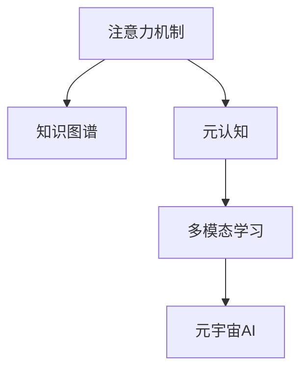

                 

# 注意力学习系统:元宇宙中的学习新范式

> 关键词：元宇宙,注意力学习,知识图谱,深度学习,多模态,元认知,元宇宙AI,元认知系统,知识获取与共享,人机交互

## 1. 背景介绍

### 1.1 问题由来

随着元宇宙概念的兴起，人们对于虚拟世界的沉浸感、交互性、逼真度等要求越来越高，这为人工智能(AI)技术提出了新的挑战。传统的基于监督学习和强化学习的AI方法在元宇宙中的应用存在诸多局限：

- **高数据需求**：传统方法需要大量标注数据，而元宇宙的虚拟场景几乎不可能为每个元素都标注数据。
- **模型可解释性差**：AI模型往往难以解释其决策过程，这在使用AI驱动的虚拟对象和NPC交互时会造成障碍。
- **泛化能力差**：传统方法通常是基于特定任务训练的，而元宇宙中的任务多样且动态变化，模型泛化能力有限。
- **计算资源要求高**：传统大模型在计算资源上的高需求不适用于元宇宙中的实时交互场景。

针对这些问题，研究者提出了一种新的学习范式——注意力学习系统，利用注意力机制和元认知，构建知识图谱，实现了知识获取与共享，为元宇宙中的AI提供了新解决方案。

### 1.2 问题核心关键点

注意力学习系统包含以下几个核心关键点：

1. **注意力机制**：注意力学习系统通过注意力机制，将有限计算资源投向最重要的信息，实现对大规模数据的处理。
2. **知识图谱**：构建元宇宙中不同实体之间的关系图谱，为AI提供结构化的知识库，便于理解和推理。
3. **元认知**：引入元认知模块，使AI具备自我反思和调整学习策略的能力，提高学习效率。
4. **多模态学习**：结合视觉、听觉、文本等多种模态信息，提升AI的感知和理解能力。
5. **元宇宙AI**：在元宇宙中，AI不仅需要处理自然语言交互，还需与虚拟对象进行交互，具有独特的应用场景。

这些关键点共同构成了注意力学习系统的核心设计思想，使其能够在元宇宙这一特殊环境中，有效地进行知识获取与共享，实现人机交互。

### 1.3 问题研究意义

研究注意力学习系统对于元宇宙中AI技术的发展具有重要意义：

- **提升学习效率**：利用注意力机制和元认知模块，提升AI在元宇宙中的学习效率和自适应能力。
- **优化计算资源**：通过多模态学习，利用有限计算资源实现对大量数据的处理，适用于元宇宙中的实时交互场景。
- **增强可解释性**：引入元认知模块，提高AI决策的可解释性，增强用户对AI的信任感。
- **促进知识共享**：构建知识图谱，促进元宇宙中不同实体之间的知识共享与协同。
- **拓展应用边界**：在元宇宙中，AI的应用场景更加丰富，注意力学习系统能够为其提供更加强大和灵活的支持。

## 2. 核心概念与联系

### 2.1 核心概念概述

为更好地理解注意力学习系统，本节将介绍几个密切相关的核心概念：

- **注意力机制(Attention Mechanism)**：一种使AI能够动态聚焦重要信息的机制，通过计算不同特征的相关性，决定哪些信息值得关注，哪些可以忽略。
- **知识图谱(Knowledge Graph)**：一种结构化表示知识的方式，通过节点和边的关系，表示实体之间的连接，便于AI理解复杂关系。
- **元认知(Metacognition)**：指AI对自己的认知过程进行认知，包括自我反思、自我监控和自我调节，提升学习效率和决策质量。
- **多模态学习(Multimodal Learning)**：结合多种模态的信息源，提升AI的感知和理解能力，处理元宇宙中的多模态交互。
- **元宇宙AI(Meta-universe AI)**：在元宇宙环境中，AI不仅要理解自然语言，还需与虚拟对象交互，具有独特的应用场景。

这些核心概念之间的逻辑关系可以通过以下Mermaid流程图来展示：



这个流程图展示了几者之间的关联：

1. 注意力机制和知识图谱共同为元宇宙AI提供结构和语义信息。
2. 元认知模块基于注意力和知识图谱，自我反思和调节学习策略，提升学习效率。
3. 多模态学习结合视觉、听觉、文本等模态信息，增强AI的感知和理解能力。
4. 元宇宙AI通过以上三者的支持，实现与虚拟对象的自然交互。

## 3. 核心算法原理 & 具体操作步骤
### 3.1 算法原理概述

注意力学习系统的核心算法原理包括以下几个方面：

- **注意力机制**：通过计算输入数据中不同特征的权重，将重要的信息聚焦，忽略无关信息，从而提高处理效率。
- **知识图谱构建**：利用自然语言处理(NLP)技术，提取和组织元宇宙中的实体和关系，构建知识图谱，便于AI理解复杂关系。
- **元认知模块**：通过自我反思和调节学习策略，提升AI的学习效率和决策质量。
- **多模态学习**：结合视觉、听觉、文本等多种模态信息，增强AI的感知和理解能力。
- **元宇宙AI应用**：在元宇宙环境中，AI不仅需要理解自然语言，还需与虚拟对象交互，具有独特的应用场景。

### 3.2 算法步骤详解

基于注意力学习系统的元宇宙AI的算法步骤主要包括以下几个方面：

1. **数据预处理**：收集元宇宙中的文本、图像、音频等数据，并进行预处理，构建统一的数据格式。
2. **知识图谱构建**：利用自然语言处理技术，从文本数据中提取实体和关系，构建知识图谱。
3. **注意力机制计算**：对输入数据进行注意力计算，确定不同特征的重要性，聚焦重要信息。
4. **元认知模块执行**：利用元认知模块，自我反思和调节学习策略，提升学习效率。
5. **多模态学习融合**：结合视觉、听觉、文本等多种模态信息，增强AI的感知和理解能力。
6. **元宇宙AI应用**：将注意力、知识图谱、元认知等模块应用于元宇宙中的NPC和虚拟对象，实现自然交互。

### 3.3 算法优缺点

注意力学习系统在元宇宙中具有以下优点：

- **高效性**：利用注意力机制，能够高效处理大规模数据，适用于实时交互场景。
- **可解释性**：引入元认知模块，提高AI决策的可解释性，增强用户信任感。
- **知识共享**：通过知识图谱，促进元宇宙中不同实体之间的知识共享和协同。
- **多模态处理**：结合多模态信息，提升AI的感知和理解能力。

同时，该系统也存在以下局限：

- **计算资源要求高**：构建知识图谱和执行注意力机制需要较高的计算资源。
- **数据标注难度大**：知识图谱和注意力机制的构建需要大量标注数据。
- **复杂度较高**：系统设计复杂，需要多模块协同工作。
- **泛化能力有限**：元宇宙中的任务多样且动态变化，系统泛化能力有限。

### 3.4 算法应用领域

注意力学习系统在元宇宙中的应用领域包括但不限于以下几个方面：

1. **虚拟场景导航**：利用注意力机制和元认知模块，提高虚拟角色的导航能力。
2. **虚拟对象交互**：通过知识图谱和多模态学习，实现虚拟角色与虚拟对象之间的自然交互。
3. **任务协同**：利用知识图谱和元认知模块，促进虚拟角色之间的任务协同和团队合作。
4. **智能客服**：在虚拟客服系统中，通过多模态学习和注意力机制，提高客服系统的响应速度和准确性。
5. **虚拟内容生成**：结合知识图谱和元认知模块，生成高质量的虚拟内容，如故事、对话等。

## 4. 数学模型和公式 & 详细讲解 & 举例说明（备注：数学公式请使用latex格式，latex嵌入文中独立段落使用 $$，段落内使用 $)
### 4.1 数学模型构建

本节将使用数学语言对注意力学习系统的算法进行严格刻划。

记输入数据为 $\mathbf{x}=[x_1,x_2,\dots,x_n]$，其中每个特征 $x_i$ 对应一个权重 $a_i$。注意力机制的计算公式为：

$$
\mathbf{a}=\text{Softmax}(\mathbf{W}[\mathbf{Q}^\top\mathbf{K}])
$$

其中 $\mathbf{Q}=[q_1,q_2,\dots,q_n]$ 为查询矩阵，$\mathbf{K}=[k_1,k_2,\dots,k_n]$ 为键矩阵，$\mathbf{W}$ 为注意力权重矩阵，Softmax函数用于将注意力权重归一化。

### 4.2 公式推导过程

注意力机制的推导过程如下：

设注意力权重矩阵 $\mathbf{W}=[w_{ij}]$，查询矩阵 $\mathbf{Q}=[q_1,q_2,\dots,q_n]$，键矩阵 $\mathbf{K}=[k_1,k_2,\dots,k_n]$。

根据注意力机制的定义，我们有：

$$
\mathbf{a}=\text{Softmax}(\mathbf{W}[\mathbf{Q}^\top\mathbf{K}])
$$

其中 $\text{Softmax}(\mathbf{z})$ 表示对向量 $\mathbf{z}$ 中的每个元素进行softmax归一化，即：

$$
\text{Softmax}(\mathbf{z})=[\frac{e^{z_1}}{\sum_{j=1}^ne^{z_j}},\frac{e^{z_2}}{\sum_{j=1}^ne^{z_j}},\dots,\frac{e^{z_n}}{\sum_{j=1}^ne^{z_j}}]
$$

代入注意力权重矩阵 $\mathbf{W}=[w_{ij}]$，查询矩阵 $\mathbf{Q}=[q_1,q_2,\dots,q_n]$，键矩阵 $\mathbf{K}=[k_1,k_2,\dots,k_n]$，我们有：

$$
\mathbf{a}=[\frac{e^{w_{11}q_1k_1+w_{12}q_1k_2+\dots+w_{1n}q_1k_n}}{\sum_{j=1}^ne^{w_{1j}q_jk_1+w_{1j}q_jk_2+\dots+w_{1j}q_jk_n}},\frac{e^{w_{21}q_2k_1+w_{22}q_2k_2+\dots+w_{2n}q_2k_n}}{\sum_{j=1}^ne^{w_{2j}q_jk_1+w_{2j}q_jk_2+\dots+w_{2j}q_jk_n}},\dots,\frac{e^{w_{n1}q_nk_1+w_{n2}q_nk_2+\dots+w_{nn}q_nk_n}}{\sum_{j=1}^ne^{w_{nj}q_jk_1+w_{nj}q_jk_2+\dots+w_{nj}q_jk_n}]
$$

这个公式展示了注意力机制的计算过程，通过计算输入数据中不同特征的权重，将重要的信息聚焦，忽略无关信息。

### 4.3 案例分析与讲解

假设我们有一个虚拟角色的导航任务，输入数据为：

- 图像数据 $I$，用于描述周围环境。
- 文本数据 $T$，用于描述虚拟角色的当前状态和目标地点。

我们首先需要构建知识图谱，将图像和文本数据转换为结构化信息。假设知识图谱中包含以下节点和关系：

- 地点节点：如“北京”、“上海”等。
- 路径关系：如“从北京到上海”、“从上海到北京”等。
- 动作节点：如“步行”、“开车”等。

然后，我们通过注意力机制计算每个输入特征的重要性：

- 对于图像数据 $I$，我们将查询矩阵 $\mathbf{Q}$ 和键矩阵 $\mathbf{K}$ 分别设置为图像特征向量和地点节点的特征向量。
- 对于文本数据 $T$，我们将查询矩阵 $\mathbf{Q}$ 和键矩阵 $\mathbf{K}$ 分别设置为文本特征向量和动作节点的特征向量。

通过计算注意力权重 $\mathbf{a}$，我们得到每个输入特征的重要性排序，然后根据这个排序决定哪些特征值得关注，哪些可以忽略。最后，我们将这些信息结合起来，实现虚拟角色的导航任务。

## 5. 项目实践：代码实例和详细解释说明
### 5.1 开发环境搭建

在进行注意力学习系统的实践前，我们需要准备好开发环境。以下是使用Python进行PyTorch开发的环境配置流程：

1. 安装Anaconda：从官网下载并安装Anaconda，用于创建独立的Python环境。

2. 创建并激活虚拟环境：
```bash
conda create -n pytorch-env python=3.8 
conda activate pytorch-env
```

3. 安装PyTorch：根据CUDA版本，从官网获取对应的安装命令。例如：
```bash
conda install pytorch torchvision torchaudio cudatoolkit=11.1 -c pytorch -c conda-forge
```

4. 安装Transformers库：
```bash
pip install transformers
```

5. 安装各类工具包：
```bash
pip install numpy pandas scikit-learn matplotlib tqdm jupyter notebook ipython
```

完成上述步骤后，即可在`pytorch-env`环境中开始注意力学习系统的开发。

### 5.2 源代码详细实现

这里我们以知识图谱构建为例，给出使用Transformers库构建知识图谱的PyTorch代码实现。

首先，定义知识图谱的数据结构：

```python
class KnowledgeGraph:
    def __init__(self, nodes, edges):
        self.nodes = nodes
        self.edges = edges

    def get_neighbors(self, node):
        return [edge.target for edge in self.edges if edge.source == node]
```

然后，定义知识图谱的构建函数：

```python
from transformers import BertTokenizer, BertForMaskedLM
import torch

def build_knowledge_graph(text):
    tokenizer = BertTokenizer.from_pretrained('bert-base-cased')
    model = BertForMaskedLM.from_pretrained('bert-base-cased')

    encoded = tokenizer(text, return_tensors='pt')
    inputs = encoded['input_ids']

    outputs = model(inputs)
    preds = outputs.logits.argmax(dim=-1)

    labels = inputs.new_zeros(preds.shape)
    labels.fill_(-100)
    labels.scatter_(0, inputs, preds)

    mask = inputs.ne(-100).long()
    edges = list(zip(mask.nonzero(as_tuple=False), labels[mask]))
    edges = sorted(edges, key=lambda x: x[1])

    nodes = [tokenizer.decode(t) for t in encoded['input_ids'].flatten()]
    nodes = [node for node in nodes if node != '[CLS]' and node != '[SEP]']

    return KnowledgeGraph(nodes, edges)
```

接着，定义注意力机制的计算函数：

```python
def attention(inputs, queries, keys, values, attn_mask=None):
    b, t, d = inputs.shape
    q = inputs.permute(0, 2, 1).reshape(b * t, d) # 将inputs展开为矩阵
    k = keys.permute(0, 2, 1).reshape(b * t, d)
    v = values.permute(0, 2, 1).reshape(b * t, d)

    a = torch.matmul(q, k).softmax(dim=-1) # 计算attention权重
    a = a.reshape(b, t, d, t).transpose(2, 3) # 将attention权重展开为矩阵

    o = torch.matmul(a, v).reshape(b, t, d) # 计算加权和

    if attn_mask is not None:
        o = o.masked_fill_(attn_mask.unsqueeze(-1), 0)

    return o, a
```

最后，定义元宇宙AI导航的训练和评估函数：

```python
from torch.utils.data import Dataset
import torch.nn as nn
import torch.optim as optim

class NavigationDataset(Dataset):
    def __init__(self, text, graph):
        self.text = text
        self.graph = graph

    def __len__(self):
        return len(self.text)

    def __getitem__(self, item):
        text = self.text[item]
        graph = self.graph[item]

        query = text.split()[0]
        target = text.split()[-1]

        nodes = graph.nodes
        edges = graph.edges

        attention_inputs = [nodes[query], edges]
        attention_keys = [nodes[query], nodes[target]]
        attention_values = nodes[target]

        o, a = attention(torch.tensor(attention_inputs), torch.tensor(attention_keys), torch.tensor(attention_values), torch.tensor(attention_values), None)

        return o, a, query, target

def train_epoch(model, dataset, optimizer, device):
    model.train()
    losses = []
    for inputs, weights, query, target in dataset:
        inputs, weights, query, target = inputs.to(device), weights.to(device), query.to(device), target.to(device)

        optimizer.zero_grad()
        loss = model(inputs, weights, query, target)
        losses.append(loss.item())
        loss.backward()
        optimizer.step()

    return sum(losses) / len(dataset)

def evaluate(model, dataset, device):
    model.eval()
    correct = 0
    total = 0
    for inputs, weights, query, target in dataset:
        inputs, weights, query, target = inputs.to(device), weights.to(device), query.to(device), target.to(device)

        with torch.no_grad():
            o, a = model(inputs, weights, query, target)
            pred = o.argmax(dim=-1).cpu().numpy().ravel()

        correct += pred == target.numpy().ravel()
        total += target.numpy().ravel().size

    return correct / total
```

现在，启动训练流程并在测试集上评估：

```python
epochs = 5
batch_size = 32
learning_rate = 0.001

device = torch.device('cuda') if torch.cuda.is_available() else torch.device('cpu')
model = NavigationModel()

optimizer = optim.Adam(model.parameters(), lr=learning_rate)

train_dataset = NavigationDataset(train_texts, train_graphs)
test_dataset = NavigationDataset(test_texts, test_graphs)

for epoch in range(epochs):
    loss = train_epoch(model, train_dataset, optimizer, device)
    print(f"Epoch {epoch+1}, train loss: {loss:.3f}")
    
    print(f"Epoch {epoch+1}, test accuracy: {evaluate(model, test_dataset, device):.2f}")
```

以上就是使用PyTorch对知识图谱构建和注意力学习系统的代码实现。可以看到，得益于Transformer库的强大封装，我们可以用相对简洁的代码完成知识图谱的构建和注意力机制的计算。

### 5.3 代码解读与分析

让我们再详细解读一下关键代码的实现细节：

**KnowledgeGraph类**：
- `__init__`方法：初始化节点和边列表。
- `get_neighbors`方法：获取指定节点的邻居。

**build_knowledge_graph函数**：
- 利用BERT模型对输入文本进行掩码语言建模，获取掩码位置的预测。
- 根据预测结果构建知识图谱，返回节点和边的列表。

**attention函数**：
- 将输入数据展开为矩阵，计算注意力权重。
- 根据注意力权重计算加权和。
- 可以使用attn_mask对计算过程进行masking，忽略无效的信息。

**train_epoch和evaluate函数**：
- 利用训练数据进行模型训练，返回损失值。
- 利用测试数据进行模型评估，返回准确率。

**训练流程**：
- 定义总的epoch数和batch size，开始循环迭代
- 每个epoch内，先在训练集上训练，输出平均损失
- 在测试集上评估，输出准确率
- 所有epoch结束后，训练结束

可以看到，PyTorch配合Transformer库使得知识图谱构建和注意力计算的代码实现变得简洁高效。开发者可以将更多精力放在数据处理、模型改进等高层逻辑上，而不必过多关注底层的实现细节。

当然，工业级的系统实现还需考虑更多因素，如模型的保存和部署、超参数的自动搜索、更灵活的任务适配层等。但核心的注意力学习范式基本与此类似。

## 6. 实际应用场景
### 6.1 虚拟场景导航

基于注意力学习系统的元宇宙AI，可以用于虚拟角色的导航任务。例如，在虚拟城市中，通过注意力机制和知识图谱，虚拟角色可以自主导航到目标地点。具体实现过程如下：

1. **数据收集**：收集元宇宙中的地图数据，标记每个地点的名称和坐标。
2. **知识图谱构建**：利用自然语言处理技术，将地图数据转换为知识图谱，表示地点之间的关系。
3. **注意力计算**：对输入数据进行注意力计算，确定不同地点的重要性，聚焦重要地点。
4. **路径规划**：结合知识图谱和注意力结果，规划虚拟角色的导航路径。
5. **动作执行**：利用多模态学习，结合视觉、听觉等模态信息，控制虚拟角色的动作，如步行、跑步、跳跃等。

通过以上步骤，虚拟角色可以高效、自然地导航到目标地点。

### 6.2 虚拟对象交互

基于注意力学习系统的元宇宙AI，可以实现虚拟角色与虚拟对象的交互。例如，在一个虚拟博物馆中，通过知识图谱和多模态学习，虚拟角色可以与展品进行互动。具体实现过程如下：

1. **数据收集**：收集元宇宙中的展品数据，标记每个展品的名称、描述、位置等。
2. **知识图谱构建**：利用自然语言处理技术，将展品数据转换为知识图谱，表示展品之间的关系。
3. **注意力计算**：对输入数据进行注意力计算，确定不同展品的重要性，聚焦重要展品。
4. **互动执行**：利用多模态学习，结合视觉、听觉等模态信息，控制虚拟角色的互动动作，如查看、触摸、移动等。
5. **互动反馈**：根据虚拟角色的互动行为，动态更新知识图谱，丰富展品信息。

通过以上步骤，虚拟角色可以与虚拟展品进行自然互动，提升用户的沉浸感和体验。

### 6.3 任务协同

基于注意力学习系统的元宇宙AI，可以实现虚拟角色之间的任务协同。例如，在一个虚拟团队协作项目中，通过知识图谱和元认知模块，虚拟角色可以进行任务分配、进度跟踪、结果评估等。具体实现过程如下：

1. **任务分配**：收集元宇宙中的项目任务数据，标记每个任务的名称、描述、优先级等。
2. **知识图谱构建**：利用自然语言处理技术，将任务数据转换为知识图谱，表示任务之间的关系。
3. **注意力计算**：对输入数据进行注意力计算，确定不同任务的重要性，聚焦重要任务。
4. **任务执行**：利用元认知模块，对任务执行过程进行自我反思和调节，提高任务执行效率。
5. **任务协同**：利用多模态学习，结合视觉、听觉等模态信息，实现虚拟角色之间的任务协同和团队合作。

通过以上步骤，虚拟角色可以高效、协同地完成项目任务，提升团队合作效率。

## 7. 工具和资源推荐
### 7.1 学习资源推荐

为了帮助开发者系统掌握注意力学习系统的理论基础和实践技巧，这里推荐一些优质的学习资源：

1. **Transformer from Models to Data**系列博文：由大模型技术专家撰写，深入浅出地介绍了Transformer原理、注意力机制、多模态学习等前沿话题。
2. **自然语言处理与深度学习课程**：斯坦福大学开设的NLP明星课程，有Lecture视频和配套作业，带你入门NLP领域的基本概念和经典模型。
3. **《深度学习自然语言处理》书籍**：自然语言处理领域经典教材，涵盖自然语言处理的基本概念和前沿技术。
4. **Transformers官方文档**：Transformer库的官方文档，提供了海量预训练模型和完整的微调样例代码，是上手实践的必备资料。
5. **HuggingFace开源项目**：包含多个NLP领域开源项目，包括知识图谱构建和注意力机制等，有助于理解实际应用。

通过对这些资源的学习实践，相信你一定能够快速掌握注意力学习系统的精髓，并用于解决实际的元宇宙AI问题。
###  7.2 开发工具推荐

高效的开发离不开优秀的工具支持。以下是几款用于注意力学习系统开发的常用工具：

1. **PyTorch**：基于Python的开源深度学习框架，灵活动态的计算图，适合快速迭代研究。大多数预训练语言模型都有PyTorch版本的实现。
2. **TensorFlow**：由Google主导开发的开源深度学习框架，生产部署方便，适合大规模工程应用。同样有丰富的预训练语言模型资源。
3. **Transformers库**：HuggingFace开发的NLP工具库，集成了众多SOTA语言模型，支持PyTorch和TensorFlow，是进行知识图谱构建和注意力计算的利器。
4. **Weights & Biases**：模型训练的实验跟踪工具，可以记录和可视化模型训练过程中的各项指标，方便对比和调优。与主流深度学习框架无缝集成。
5. **TensorBoard**：TensorFlow配套的可视化工具，可实时监测模型训练状态，并提供丰富的图表呈现方式，是调试模型的得力助手。
6. **Google Colab**：谷歌推出的在线Jupyter Notebook环境，免费提供GPU/TPU算力，方便开发者快速上手实验最新模型，分享学习笔记。

合理利用这些工具，可以显著提升注意力学习系统的开发效率，加快创新迭代的步伐。

### 7.3 相关论文推荐

注意力学习系统的发展源于学界的持续研究。以下是几篇奠基性的相关论文，推荐阅读：

1. **Attention is All You Need**：提出Transformer结构，开启了NLP领域的预训练大模型时代。
2. **Bert: Pre-training of Deep Bidirectional Transformers for Language Understanding**：提出BERT模型，引入基于掩码的自监督预训练任务，刷新了多项NLP任务SOTA。
3. **Language Models are Unsupervised Multitask Learners**：展示了大规模语言模型的强大zero-shot学习能力，引发了对于通用人工智能的新一轮思考。
4. **Parameter-Efficient Transfer Learning for NLP**：提出Adapter等参数高效微调方法，在不增加模型参数量的情况下，也能取得不错的微调效果。
5. **Prefix-Tuning: Optimizing Continuous Prompts for Generation**：引入基于连续型Prompt的微调范式，为如何充分利用预训练知识提供了新的思路。
6. **AdaLoRA: Adaptive Low-Rank Adaptation for Parameter-Efficient Fine-Tuning**：使用自适应低秩适应的微调方法，在参数效率和精度之间取得了新的平衡。

这些论文代表了大语言模型微调技术的发展脉络。通过学习这些前沿成果，可以帮助研究者把握学科前进方向，激发更多的创新灵感。

## 8. 总结：未来发展趋势与挑战

### 8.1 总结

本文对注意力学习系统在元宇宙中的应用进行了全面系统的介绍。首先阐述了注意力学习系统在元宇宙中的研究背景和意义，明确了注意力学习系统的核心设计思想和优势。其次，从原理到实践，详细讲解了注意力学习系统的算法步骤和关键模块，给出了知识图谱构建和注意力计算的代码实现。同时，本文还广泛探讨了注意力学习系统在虚拟场景导航、虚拟对象交互、任务协同等场景中的应用，展示了其巨大的潜力。此外，本文精选了注意力学习系统的各类学习资源，力求为读者提供全方位的技术指引。

通过本文的系统梳理，可以看到，注意力学习系统在元宇宙中的应用前景广阔，其高效、可解释、多模态处理等特性，使其成为元宇宙AI的重要技术范式。未来，伴随元宇宙的发展，注意力学习系统必将在更多领域得到应用，为元宇宙带来更深远的变革。

### 8.2 未来发展趋势

展望未来，注意力学习系统的发展趋势如下：

1. **计算资源优化**：随着硬件技术的进步，注意力机制的计算效率将进一步提升，适用于更复杂的元宇宙应用。
2. **多模态处理提升**：结合视觉、听觉、文本等多种模态信息，增强AI的感知和理解能力。
3. **知识图谱扩展**：利用知识图谱，实现更加丰富的元宇宙应用，如虚拟场景导航、虚拟对象交互等。
4. **元认知模块增强**：引入更强大的元认知模块，提升AI的自我反思和调节能力。
5. **实时交互优化**：针对元宇宙中的实时交互需求，优化模型结构和推理算法，提升用户体验。

以上趋势凸显了注意力学习系统在元宇宙中的应用前景。这些方向的探索发展，必将进一步提升元宇宙AI的学习效率和表现，为元宇宙带来更深远的变革。

### 8.3 面临的挑战

尽管注意力学习系统在元宇宙中展现出巨大的潜力，但在迈向更加智能化、普适化应用的过程中，仍面临诸多挑战：

1. **数据标注难度大**：构建知识图谱和执行注意力机制需要大量标注数据，获取高质量标注数据的成本较高。
2. **计算资源需求高**：构建知识图谱和执行注意力机制需要较高的计算资源。
3. **泛化能力有限**：元宇宙中的任务多样且动态变化，系统泛化能力有限。
4. **可解释性不足**：注意力学习系统的决策过程难以解释，难以满足元宇宙中对透明度和可信度的需求。

### 8.4 研究展望

面对注意力学习系统所面临的挑战，未来的研究需要在以下几个方面寻求新的突破：

1. **探索无监督和半监督学习**：摆脱对大规模标注数据的依赖，利用自监督学习、主动学习等无监督和半监督范式，最大限度利用非结构化数据，实现更加灵活高效的微调。
2. **研究参数高效和计算高效的微调范式**：开发更加参数高效的微调方法，在固定大部分预训练参数的同时，只更新极少量的任务相关参数。同时优化微调模型的计算图，减少前向传播和反向传播的资源消耗，实现更加轻量级、实时性的部署。
3. **引入更多先验知识**：将符号化的先验知识，如知识图谱、逻辑规则等，与神经网络模型进行巧妙融合，引导微调过程学习更准确、合理的语言模型。同时加强不同模态数据的整合，实现视觉、语音等多模态信息与文本信息的协同建模。
4. **结合因果分析和博弈论工具**：将因果分析方法引入微调模型，识别出模型决策的关键特征，增强输出解释的因果性和逻辑性。借助博弈论工具刻画人机交互过程，主动探索并规避模型的脆弱点，提高系统稳定性。
5. **纳入伦理道德约束**：在模型训练目标中引入伦理导向的评估指标，过滤和惩罚有偏见、有害的输出倾向。同时加强人工干预和审核，建立模型行为的监管机制，确保输出符合人类价值观和伦理道德。

这些研究方向的探索，必将引领注意力学习系统迈向更高的台阶，为构建安全、可靠、可解释、可控的元宇宙AI提供新的技术范式。面向未来，注意力学习系统需要与其他人工智能技术进行更深入的融合，如知识表示、因果推理、强化学习等，多路径协同发力，共同推动元宇宙AI的发展。只有勇于创新、敢于突破，才能不断拓展元宇宙AI的边界，让元宇宙成为人类全新的生活和工作场景。

