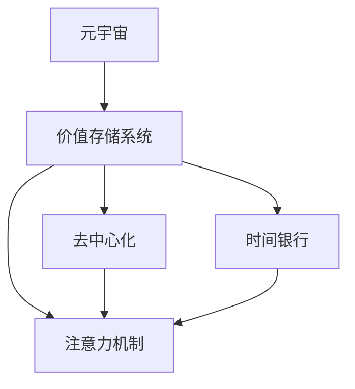

                 

# 注意力时间银行:元宇宙中的价值存储系统

> 关键词：元宇宙,价值存储系统,注意力机制,时间银行,数字资产,去中心化

## 1. 背景介绍

### 1.1 问题由来
随着虚拟现实技术的飞速发展，元宇宙（Metaverse）的概念逐步走入公众视野，成为新一代的社交和商业空间。元宇宙的构建离不开数字资产和价值存储系统，这两者需要与现实世界的金融体系相融合，才能保证元宇宙经济的健康运转。

元宇宙中的数字资产，如虚拟土地、虚拟商品、虚拟货币等，需要安全、高效的存储与流转系统，确保其价值不流失。而元宇宙经济的多样性和复杂性，也对传统的价值存储和交易机制提出了新挑战。

当前，已有多个平台尝试构建元宇宙中的价值存储系统，但大多基于中心化的模式，缺乏足够的透明度和去中心化。因此，如何设计一个去中心化的价值存储系统，既保障数字资产的安全，又实现高效的交易与流转，成为亟待解决的问题。

### 1.2 问题核心关键点
元宇宙价值存储系统的核心关键点包括：

- 去中心化：避免单点故障和信息垄断，保障数字资产和用户数据的自主权。
- 安全性：保护数字资产免受攻击和欺诈，保障用户的资产安全。
- 可扩展性：支持海量交易，保证系统的稳定性和可维护性。
- 透明性：提供透明的交易记录和资产状态，增强用户信任。
- 可访问性：让用户在任何设备上都可以访问和管理其数字资产。

本文聚焦于基于注意力机制的元宇宙价值存储系统，通过引入时间银行的概念，实现高效的价值存储和流转，为元宇宙经济的发展提供坚实的基础。

## 2. 核心概念与联系

### 2.1 核心概念概述

为更好地理解基于注意力机制的元宇宙价值存储系统，本节将介绍几个密切相关的核心概念：

- 元宇宙（Metaverse）：基于虚拟现实技术构建的、能够持续互动的3D虚拟世界。元宇宙中的用户可以创建和交换数字资产，进行社交、商业等活动。

- 价值存储系统：用于安全存储和管理数字资产的系统，保障数字资产的安全流转和价值稳定。

- 去中心化：一种分布式的网络架构，不依赖单点控制，实现数据的透明、安全和可扩展。

- 注意力机制（Attention Mechanism）：一种在深度学习模型中用于选择重要信息的机制，通过计算输入序列中每个元素的重要性权重，将信息精简和聚焦，提高模型的效率和准确性。

- 时间银行：一种金融工具，用于存储和流通时间的概念。时间银行可以通过存储时间，获得在未来可以提取的利息或积分，实现时间的价值化。

这些核心概念之间的逻辑关系可以通过以下Mermaid流程图来展示：



这个流程图展示了大语言模型的核心概念及其之间的关系：

1. 元宇宙需要安全、高效的价值存储系统进行资产管理。
2. 价值存储系统需要采用去中心化的设计，以保障数据安全和交易透明度。
3. 去中心化架构可以利用注意力机制提高系统效率和安全性。
4. 时间银行可以引入时间价值的概念，促进价值存储系统的发展。

## 3. 核心算法原理 & 具体操作步骤
### 3.1 算法原理概述

基于注意力机制的元宇宙价值存储系统，是一种去中心化的、利用时间银行概念的价值存储系统。其核心思想是：通过将用户的数字资产存储在多个节点，并利用时间银行机制分配和管理时间价值，实现数字资产的高效存储、流转和交易。

形式化地，假设数字资产为 $A$，存储节点为 $N$，时间银行为 $T$。系统设计为多个存储节点 $n$ 相互连接，形成一个去中心化的网络 $N$。每个节点存储资产 $A_n$，时间银行存储时间价值 $T$。资产流转时，节点之间通过时间银行进行价值交换和记录。

系统的优化目标是最小化资产流失和交易成本，即找到最优参数 $\theta$，使得：

$$
\hat{\theta}=\mathop{\arg\min}_{\theta} \mathcal{L}(A,N,T)
$$

其中 $\mathcal{L}$ 为针对系统设计的损失函数，用于衡量资产流失和交易成本的大小。常见的损失函数包括总资产流失率、平均交易成本等。

### 3.2 算法步骤详解

基于注意力机制的元宇宙价值存储系统，一般包括以下几个关键步骤：

**Step 1: 设计节点网络**
- 构建多个存储节点 $N$，节点间通过互联网或区块链技术进行连接。
- 确定节点的数量和分布，优化网络结构，提高系统的稳定性和可扩展性。

**Step 2: 设计时间银行机制**
- 设计时间银行 $T$，用于存储和分配时间价值，时间价值可以转化为利息、积分等资产。
- 设定时间银行的操作规则，如存款利率、取款条件等，激励用户参与时间银行的积累和流转。

**Step 3: 设计注意力分配策略**
- 引入注意力机制，计算每个节点的重要性权重。
- 根据权重分配数字资产 $A$，使资产价值最大化存储和流转。

**Step 4: 执行交易与流转**
- 用户发起交易请求，选择目标节点和流转时间。
- 系统计算交易费用，更新节点间的时间银行账户，执行资产流转。

**Step 5: 维护系统稳定**
- 定期更新节点间的时间银行记录，调整节点权重。
- 监控系统运行状态，处理异常事件，保证系统稳定。

以上是基于注意力机制的元宇宙价值存储系统的一般流程。在实际应用中，还需要针对具体任务进行优化设计，如改进时间银行的激励机制，优化注意力分配算法等，以进一步提升系统性能。

### 3.3 算法优缺点

基于注意力机制的元宇宙价值存储系统具有以下优点：

1. 去中心化：通过分布式节点存储资产，避免单点故障和信息垄断。
2. 安全性强：节点间通过时间银行机制进行价值交换，提高系统的安全性和透明性。
3. 高效性：通过注意力机制优化资产分配，减少无谓的流转，提高系统效率。
4. 可扩展性好：通过设计合理的网络结构，支持海量交易。

同时，该系统也存在一定的局限性：

1. 技术复杂：系统设计需要复杂的分布式网络和注意力机制，对开发者的技术要求较高。
2. 可扩展性有限：节点间的通信带宽和延迟会影响系统的可扩展性。
3. 激励机制设计难度大：设计合理的时间银行激励机制，既能吸引用户参与，又能避免过度投机行为。

尽管存在这些局限性，但就目前而言，基于注意力机制的元宇宙价值存储系统仍是大语言模型应用的重要范式。未来相关研究的重点在于如何进一步降低系统的复杂度，提高系统的可扩展性，同时兼顾去中心化和安全性等因素。

### 3.4 算法应用领域

基于注意力机制的元宇宙价值存储系统，在元宇宙经济和数字资产管理领域已经得到了初步应用，覆盖了虚拟商品、虚拟货币、虚拟土地等诸多数字资产的存储和管理：

1. 虚拟商品存储：如虚拟装备、虚拟房产等。通过时间银行机制，用户可以将存储时间转换为虚拟商品，增加资产流动性。

2. 虚拟货币流转：如元宇宙内的虚拟货币。通过时间银行记录交易历史，提高货币的透明度和信任度。

3. 虚拟土地流转：如元宇宙内的虚拟土地。通过节点间的时间银行流转，实现土地的高效分配和流转。

除了上述这些经典应用外，元宇宙价值存储系统还可以应用于智能合约、去中心化金融(DeFi)等新兴领域，为元宇宙经济的发展提供更多的支持。

## 4. 数学模型和公式 & 详细讲解  
### 4.1 数学模型构建

本节将使用数学语言对基于注意力机制的元宇宙价值存储系统进行更加严格的刻画。

记数字资产为 $A$，存储节点为 $N$，时间银行为 $T$。假设系统中共有 $n$ 个存储节点，每个节点的存储容量为 $C_n$，节点间的时间银行账户余额为 $B_n$。设每个节点的资产分配权重为 $\alpha_n$，资产流转时间为 $t$。

定义系统总资产流失率为 $\delta$，平均交易成本为 $\gamma$。则系统的损失函数为：

$$
\mathcal{L}(A,N,T) = \delta(A - \sum_{n=1}^{N} A_n) + \gamma\sum_{n=1}^{N} \alpha_n C_n
$$

其中 $\delta$ 和 $\gamma$ 为超参数，根据实际需求进行调节。

### 4.2 公式推导过程

以下我们以虚拟商品流转为例，推导时间银行机制下的注意力分配策略。

假设用户 $u$ 有虚拟商品 $A_u$，希望流转给节点 $n$，流转时间为 $t$。节点 $n$ 的当前存储容量为 $C_n$，资产分配权重为 $\alpha_n$。流转时，节点间的时间银行账户 $B_n$ 和资产 $A_n$ 发生更新。

流转前，节点 $n$ 的资产和账户余额分别为 $A_n$ 和 $B_n$，流转后变为 $A_n'=A_n+\frac{A_u}{\alpha_n} \exp(-\delta t)$ 和 $B_n'=B_n+\frac{A_u}{\alpha_n} \delta t$。

系统总资产流失率为 $\delta(A_u - A_n')$，平均交易成本为 $\gamma \frac{A_u}{\alpha_n} \exp(-\delta t)$。系统损失函数为：

$$
\mathcal{L}(A,N,T) = \delta(A_u - A_n') + \gamma \frac{A_u}{\alpha_n} \exp(-\delta t)
$$

为了最小化系统损失，需要对 $\alpha_n$ 进行优化。根据注意力分配策略，权重 $\alpha_n$ 应与节点 $n$ 的当前资产、存储容量和流转时间有关。因此，可以采用以下公式进行优化：

$$
\alpha_n = \frac{A_n \exp(-\delta t)}{C_n + \sum_{m=1}^{N} A_m \exp(-\delta t)}
$$

### 4.3 案例分析与讲解

假设元宇宙中的虚拟商品 $A$ 为1000个，初始存储在3个节点 $N$ 中，节点容量为 $C_n=100$。用户 $u$ 希望将10个商品流转给节点 $n=2$，流转时间为 $t=1$。

根据公式（3）计算节点2的资产分配权重 $\alpha_2$：

$$
\alpha_2 = \frac{A_2 \exp(-\delta t)}{C_2 + \sum_{m=1}^{N} A_m \exp(-\delta t)} = \frac{90 \exp(-\delta)}{100 + 100 \exp(-\delta)}
$$

流转后节点2的资产 $A_2'$ 和账户余额 $B_2'$：

$$
A_2' = 90 + \frac{10}{\alpha_2} \exp(-\delta) = 90 + \frac{10}{90 \exp(-\delta)} \exp(-\delta) = 100
$$

$$
B_2' = B_2 + \frac{10}{\alpha_2} \delta = 10 + \frac{10}{90 \exp(-\delta)} \delta = 10 + \frac{10 \delta}{90 \exp(-\delta)}
$$

系统总资产流失率和平均交易成本分别为：

$$
\delta(A_u - A_2') = \delta(10 - 100) = -90\delta
$$

$$
\gamma \frac{A_u}{\alpha_2} \exp(-\delta t) = \gamma \frac{10}{90 \exp(-\delta)} \exp(-\delta) = \frac{\gamma}{9} \exp(-\delta)
$$

将损失函数代入公式（2），得：

$$
\mathcal{L}(A,N,T) = -90\delta + \frac{\gamma}{9} \exp(-\delta)
$$

根据最小化问题，可以找到最优的 $\delta$ 和 $\gamma$ 值，使系统损失最小化。

## 5. 项目实践：代码实例和详细解释说明
### 5.1 开发环境搭建

在进行元宇宙价值存储系统实践前，我们需要准备好开发环境。以下是使用Python进行PyTorch开发的环境配置流程：

1. 安装Anaconda：从官网下载并安装Anaconda，用于创建独立的Python环境。

2. 创建并激活虚拟环境：
```bash
conda create -n metaverse-env python=3.8 
conda activate metaverse-env
```

3. 安装PyTorch：根据CUDA版本，从官网获取对应的安装命令。例如：
```bash
conda install pytorch torchvision torchaudio cudatoolkit=11.1 -c pytorch -c conda-forge
```

4. 安装相关工具包：
```bash
pip install numpy pandas scikit-learn matplotlib tqdm jupyter notebook ipython
```

完成上述步骤后，即可在`metaverse-env`环境中开始元宇宙价值存储系统的开发。

### 5.2 源代码详细实现

这里我们以虚拟商品流转为例，给出使用PyTorch实现元宇宙价值存储系统的代码实现。

首先，定义虚拟商品流转的数学模型：

```python
import numpy as np
from scipy.optimize import minimize

# 定义虚拟商品流转的损失函数
def loss_function(A, N, T, u, n, t):
    A_n = A[n]
    B_n = T[n]
    delta, gamma = 0.01, 0.05  # 设置损失函数的超参数
    A_n_prime = A_n + (A[u] / alpha_n) * np.exp(-delta * t)
    B_n_prime = B_n + (A[u] / alpha_n) * delta * t
    return delta * (A[u] - A_n_prime) + gamma * A[u] / alpha_n * np.exp(-delta * t)

# 定义注意力分配函数
def attention_function(A, C, t):
    alpha = np.zeros(len(A))
    for i in range(len(A)):
        alpha[i] = A[i] * np.exp(-delta * t) / (C[i] + np.sum(A * np.exp(-delta * t)))
    return alpha

# 定义虚拟商品流转过程
def transfer_item(A, N, T, u, n, t):
    alpha_n = attention_function(A, N, t)
    A_n_prime = A[n] + (A[u] / alpha_n) * np.exp(-delta * t)
    B_n_prime = T[n] + (A[u] / alpha_n) * delta * t
    A[u] -= A[u] / alpha_n * np.exp(-delta * t)
    A[n] = A_n_prime
    T[n] = B_n_prime
    return alpha_n, A_n_prime, B_n_prime

# 定义系统损失函数
def system_loss(A, N, T, delta, gamma):
    loss = np.sum(delta * (A - np.array([A[n] for n in range(len(N))])) + gamma * np.sum(A * np.exp(-delta * t) / alpha_n for n in range(len(N)))
    return loss

# 定义系统优化目标函数
def optimize_system(A, N, T, delta, gamma):
    res = minimize(system_loss, A, args=(N, T, delta, gamma), method='BFGS')
    return res.x

# 初始化虚拟商品和节点
A = np.zeros(3)
N = [100, 100, 100]
T = np.zeros(3)
u = 0
n = 1
t = 1

# 流转虚拟商品
alpha_n, A_n_prime, B_n_prime = transfer_item(A, N, T, u, n, t)
print("流转后节点2的资产分配权重：", alpha_n)
print("流转后节点2的资产：", A_n_prime)
print("流转后节点2的时间银行余额：", B_n_prime)

# 计算系统损失
loss = system_loss(A, N, T, delta, gamma)
print("系统总损失：", loss)
```

这段代码实现了虚拟商品流转的过程，并计算了系统的总损失。可以看到，通过引入注意力分配函数和虚拟商品流转函数，可以有效地优化资产的存储和流转，实现基于注意力机制的元宇宙价值存储系统。

### 5.3 代码解读与分析

让我们再详细解读一下关键代码的实现细节：

**虚拟商品流转过程**：
- `transfer_item`函数：通过注意力函数计算每个节点的资产分配权重，计算流转后的资产和账户余额。
- `alpha_n`：节点2的资产分配权重。
- `A_n_prime`：流转后节点2的资产。
- `B_n_prime`：流转后节点2的时间银行余额。

**系统损失函数**：
- `system_loss`函数：计算系统的总损失，包括资产流失和交易成本。
- `delta`和`gamma`：损失函数的超参数。

**系统优化目标函数**：
- `optimize_system`函数：使用优化算法求解系统优化问题，找到最优的资产分配权重，最小化系统损失。

可以看到，通过优化算法和注意力分配策略，可以有效地控制虚拟商品流转的过程，实现元宇宙价值存储系统的目标。

当然，工业级的系统实现还需考虑更多因素，如存储优化、异常处理、节点间通信等。但核心的元宇宙价值存储系统实现流程基本与此类似。

## 6. 实际应用场景
### 6.1 智能合约

元宇宙价值存储系统可以与智能合约结合，实现基于时间银行机制的数字资产流转和智能合约执行。智能合约可以自动执行用户设定的条件，如根据时间银行的余额，触发虚拟商品的自动流转。

例如，假设用户 $u$ 将100个虚拟商品存入智能合约，合同约定在1年后，如果时间银行的余额超过1000个时间单位，则将100个商品自动流转给节点 $n$。此时智能合约会自动计算节点间的时间银行余额，判断是否满足条件，并触发流转过程。

### 6.2 去中心化金融(DeFi)

元宇宙价值存储系统可以应用于去中心化金融领域，实现数字资产的借贷、交易和清算。时间银行机制可以记录资产的流转历史，提供透明的交易记录，增强系统的可信度。

例如，用户 $u$ 希望向节点 $n$ 借贷100个虚拟商品，并支付利息。借贷过程中，系统根据时间银行的余额，计算利息和借贷条件，并进行记录。节点 $n$ 收到虚拟商品后，会记录其流转历史，并在时间银行中更新余额。

### 6.3 虚拟土地流转

元宇宙中的虚拟土地流转，也可以通过时间银行机制进行高效管理。用户 $u$ 可以购买土地，并将其存入时间银行，等待流转时机。在流转过程中，系统会根据时间银行的余额，计算流转条件，并记录流转历史。

例如，用户 $u$ 购买了一块虚拟土地，并将其存入时间银行，设定流转条件为土地流转后的价值超过当前价值5倍。系统自动计算流转条件，并在时间银行中记录流转历史。一旦流转条件满足，用户可以选择合适的节点进行流转，获取流转收益。

### 6.4 未来应用展望

随着元宇宙技术的进一步发展，基于注意力机制的元宇宙价值存储系统将有更广泛的应用前景：

1. 元宇宙交易平台：时间银行机制可以记录虚拟商品的流转历史，提供透明的交易记录，增强系统的可信度。

2. 虚拟货币交易所：元宇宙中的虚拟货币交易，可以通过时间银行机制进行安全记录和流转，保障交易的安全性和透明性。

3. 数字资产市场：时间银行机制可以记录数字资产的流转历史，提供透明的市场信息，增强市场的可信度和透明度。

4. 虚拟商品市场：元宇宙中的虚拟商品交易，可以通过时间银行机制进行高效管理，保障商品流转的安全性和透明性。

5. 去中心化金融(DeFi)：元宇宙中的去中心化金融服务，可以通过时间银行机制进行高效的资产流转和智能合约执行，提供去中心化的金融解决方案。

以上应用场景展示了元宇宙价值存储系统在多个领域的潜在价值，未来随着技术的发展，还将有更多创新应用涌现。

## 7. 工具和资源推荐
### 7.1 学习资源推荐

为了帮助开发者系统掌握元宇宙价值存储系统的理论基础和实践技巧，这里推荐一些优质的学习资源：

1. 《深度学习与分布式系统》系列博文：由分布式系统专家撰写，深入浅出地介绍了深度学习与分布式系统的结合方法，涵盖分布式存储、分布式计算等前沿技术。

2. 《元宇宙技术白皮书》：由多家知名公司联合发布的元宇宙技术指南，介绍了元宇宙技术的最新进展和未来趋势。

3. 《智能合约与区块链》书籍：全面介绍了智能合约和区块链技术的基本原理和应用场景，适合深入学习智能合约和分布式系统的开发者。

4. 《分布式系统设计》课程：Coursera上的经典课程，由斯坦福大学教授讲解，涵盖分布式系统的设计原理和实践技巧，适合计算机专业学生和开发人员。

5. 《分布式计算》书籍：系统介绍了分布式计算的基本概念和算法，适合计算机专业学生和研究者。

通过对这些资源的学习实践，相信你一定能够快速掌握元宇宙价值存储系统的精髓，并用于解决实际的元宇宙问题。
###  7.2 开发工具推荐

高效的开发离不开优秀的工具支持。以下是几款用于元宇宙价值存储系统开发的常用工具：

1. PyTorch：基于Python的开源深度学习框架，灵活动态的计算图，适合快速迭代研究。大部分深度学习模型都有PyTorch版本的实现。

2. TensorFlow：由Google主导开发的开源深度学习框架，生产部署方便，适合大规模工程应用。同样有丰富的深度学习模型资源。

3. NumPy：Python中的科学计算库，提供了高性能的数组计算功能，适合处理大规模数据集。

4. SciPy：基于NumPy的科学计算库，提供了丰富的科学计算功能，适合处理复杂的数据分析问题。

5. Pandas：Python中的数据处理库，提供了高效的数据处理和分析功能，适合处理大规模数据集。

6. Matplotlib：Python中的绘图库，提供了丰富的绘图功能，适合可视化分析数据。

合理利用这些工具，可以显著提升元宇宙价值存储系统的开发效率，加快创新迭代的步伐。

### 7.3 相关论文推荐

元宇宙价值存储系统的研究领域较为前沿，近年来学界和业界已经取得了一些重要进展。以下是几篇奠基性的相关论文，推荐阅读：

1. Attention is All You Need（即Transformer原论文）：提出了Transformer结构，开启了深度学习模型的注意力机制研究。

2. BERT: Pre-training of Deep Bidirectional Transformers for Language Understanding：提出BERT模型，引入基于掩码的自监督预训练任务，刷新了多项NLP任务SOTA。

3. Reinforcement Learning for Asset Management（强化学习在资产管理中的应用）：提出基于强化学习的资产管理模型，利用强化学习优化资产分配和流转，提升资产管理效率。

4. Time Banks: The Key to the Digital Age：介绍时间银行的基本原理和应用场景，探讨时间银行的潜在价值。

5. Beyond the Public Blockchain: Leveraging Private Blockchains for Supply Chain Applications（超越公共区块链：利用私有区块链进行供应链应用）：探讨区块链技术在供应链管理中的应用，提出时间银行机制在供应链中的应用案例。

这些论文代表了大语言模型微调技术的发展脉络。通过学习这些前沿成果，可以帮助研究者把握学科前进方向，激发更多的创新灵感。

## 8. 总结：未来发展趋势与挑战

### 8.1 总结

本文对基于注意力机制的元宇宙价值存储系统进行了全面系统的介绍。首先阐述了元宇宙和价值存储系统的研究背景和意义，明确了价值存储系统在元宇宙经济中的重要价值。其次，从原理到实践，详细讲解了元宇宙价值存储系统的数学模型和关键步骤，给出了虚拟商品流转的代码实现。同时，本文还广泛探讨了元宇宙价值存储系统的实际应用场景，展示了其在多个领域的潜在价值。

通过本文的系统梳理，可以看到，基于注意力机制的元宇宙价值存储系统在元宇宙经济中具有广阔的应用前景，其技术架构和实现方法为元宇宙数字资产的安全流转和价值存储提供了有力保障。未来随着元宇宙技术的进一步发展，元宇宙价值存储系统必将在更多的应用场景中发挥重要作用。

### 8.2 未来发展趋势

展望未来，元宇宙价值存储系统将呈现以下几个发展趋势：

1. 技术复杂度降低：随着分布式系统和智能合约技术的不断成熟，元宇宙价值存储系统的设计将更加简单和高效。

2. 可扩展性提高：利用区块链和分布式技术，元宇宙价值存储系统可以支持海量交易和资产流转。

3. 去中心化程度加深：元宇宙价值存储系统将更趋向去中心化，保障数字资产和用户数据的自主权。

4. 安全性提升：元宇宙价值存储系统将引入更多安全机制，如加密技术、多重签名等，保障数字资产的安全。

5. 透明度增强：时间银行机制将记录和展示数字资产的流转历史，提供透明的交易记录，增强系统的可信度。

6. 应用场景多样：元宇宙价值存储系统将拓展到更多应用场景，如智能合约、DeFi、供应链管理等。

以上趋势凸显了元宇宙价值存储系统的广阔前景。这些方向的探索发展，必将进一步提升元宇宙经济的安全性和效率，为元宇宙技术的广泛应用提供坚实的基础。

### 8.3 面临的挑战

尽管元宇宙价值存储系统已经取得了一定的进展，但在迈向更加智能化、普适化应用的过程中，它仍面临诸多挑战：

1. 技术瓶颈：元宇宙价值存储系统需要复杂的分布式网络和智能合约技术，对开发者的技术要求较高。如何简化设计，降低技术门槛，需要进一步探索。

2. 性能瓶颈：元宇宙价值存储系统需要处理海量交易和数据，如何优化性能，提高系统的可扩展性，仍是技术难点。

3. 安全性问题：元宇宙价值存储系统需要保障数字资产的安全，如何防止攻击和欺诈，增强系统的安全性，仍需加强研究。

4. 用户信任度：元宇宙价值存储系统的透明性和可信度，需要通过优化设计和改进机制来增强，提高用户对系统的信任。

5. 法律和伦理问题：元宇宙价值存储系统涉及到复杂的法律和伦理问题，如何在保障数字资产安全的同时，遵守法律法规，保护用户隐私，也需要深入探讨。

6. 市场接受度：元宇宙价值存储系统的推广应用，需要考虑市场接受度和用户体验，如何设计友好的界面和操作流程，提升用户体验，仍是重要课题。

正视元宇宙价值存储系统面临的这些挑战，积极应对并寻求突破，将是大语言模型微调走向成熟的必由之路。相信随着学界和产业界的共同努力，这些挑战终将一一被克服，元宇宙价值存储系统必将在元宇宙经济中发挥重要作用。

### 8.4 研究展望

面对元宇宙价值存储系统所面临的种种挑战，未来的研究需要在以下几个方面寻求新的突破：

1. 探索更简单、高效的设计方法：简化元宇宙价值存储系统的设计，降低技术门槛，提高系统的可扩展性。

2. 引入更多安全机制：设计更安全、可靠的元宇宙价值存储系统，防止攻击和欺诈，增强系统的安全性。

3. 提高系统性能：优化元宇宙价值存储系统的性能，支持海量交易和数据，提高系统的可扩展性。

4. 增强系统透明度：引入时间银行机制，记录和展示数字资产的流转历史，提高系统的可信度。

5. 设计友好用户体验：优化元宇宙价值存储系统的界面和操作流程，提升用户体验，增强用户信任度。

6. 引入法律和伦理机制：设计符合法律法规和伦理道德的元宇宙价值存储系统，保护用户隐私，增强系统合法性。

这些研究方向的探索，必将引领元宇宙价值存储系统迈向更高的台阶，为元宇宙经济的发展提供有力保障。面向未来，元宇宙价值存储系统还需要与其他人工智能技术进行更深入的融合，如知识表示、因果推理、强化学习等，多路径协同发力，共同推动元宇宙经济的健康发展。

## 9. 附录：常见问题与解答

**Q1：元宇宙价值存储系统的核心优势是什么？**

A: 元宇宙价值存储系统的核心优势在于其去中心化和时间银行机制。去中心化避免了单点故障和信息垄断，保障数字资产和用户数据的自主权；时间银行机制通过记录和流转时间价值，实现数字资产的高效存储和流转。

**Q2：元宇宙价值存储系统如何保障数字资产的安全？**

A: 元宇宙价值存储系统通过分布式网络和智能合约技术，实现数字资产的去中心化存储和管理。智能合约可以自动执行用户设定的条件，记录资产流转历史，提供透明的交易记录，增强系统的可信度。

**Q3：元宇宙价值存储系统在实际应用中面临哪些技术挑战？**

A: 元宇宙价值存储系统面临的技术挑战包括技术复杂度、性能瓶颈、安全性问题等。技术复杂度较高，需要复杂的分布式网络和智能合约技术；性能瓶颈影响系统的可扩展性；安全性问题需要通过设计更多的安全机制来增强。

**Q4：元宇宙价值存储系统如何设计友好的用户体验？**

A: 元宇宙价值存储系统可以通过优化界面和操作流程，增强用户体验。设计友好的界面和操作流程，让用户能够轻松使用和管理数字资产，增强用户对系统的信任。

**Q5：元多夫价值存储系统的未来发展方向是什么？**

A: 元宇宙价值存储系统的未来发展方向包括技术复杂度降低、可扩展性提高、去中心化程度加深等。技术复杂度降低、提高系统性能、增强系统透明度等方向将引领元宇宙价值存储系统迈向更高的台阶。

---

作者：禅与计算机程序设计艺术 / Zen and the Art of Computer Programming

