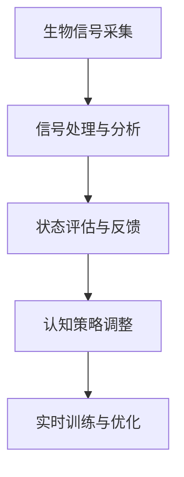

                 

# 注意力生物反馈技术：AI优化的认知状态调节

> 关键词：注意力生物反馈, AI优化, 认知状态调节, 生物信号分析, 神经反馈训练, 认知增强, 自适应训练

## 1. 背景介绍

### 1.1 问题由来

在快节奏、高压力的现代社会中，注意力资源成为一种稀缺品。工作疲劳、注意力分散、压力过大等问题，严重影响了人们的认知表现和身心健康。而基于人工智能（AI）的注意力生物反馈技术，通过实时监测和调控人的注意力状态，为提升认知表现和促进心理健康提供了新的可能性。

### 1.2 问题核心关键点

注意力生物反馈技术旨在通过AI技术实时监测人的注意力水平，并将注意力状态信息反馈给用户，使用户能够及时调整认知策略。其核心在于将注意力生物信号转化为认知调节策略，从而优化用户的学习、工作和生活状态。

该技术通过如下关键步骤实现认知状态的调节：

1. **生物信号采集**：使用脑电波、眼动追踪、心率监测等设备采集人的注意力状态信息。
2. **信号处理与分析**：利用机器学习模型分析生物信号，提取注意力指标如注意力分配度、集中度等。
3. **状态评估与反馈**：根据分析结果评估用户的注意力状态，生成反馈信息。
4. **认知策略调整**：将反馈信息转化为认知调节策略，如改变任务难度、休息提醒等。
5. **实时训练与优化**：使用强化学习等AI技术，对策略进行调整和优化。

### 1.3 问题研究意义

随着AI技术的发展，注意力生物反馈技术在教育、工作、娱乐等领域显示出广阔的应用前景。

在教育领域，该技术可以帮助学生提升学习效果，通过实时调节学习状态，避免注意力分散，提高学习效率。

在工作领域，该技术可以帮助职场人士减轻压力，提高工作效率。通过监测注意力水平，及时调整工作强度和节奏。

在娱乐领域，该技术可以提升游戏、阅读等活动的体验。通过优化注意力状态，提供更符合用户心理预期的娱乐体验。

## 2. 核心概念与联系

### 2.1 核心概念概述

为更好地理解注意力生物反馈技术的核心原理，本节将介绍几个密切相关的核心概念：

- **注意力生物反馈**：通过AI技术实时监测人的注意力状态，并将注意力状态信息反馈给用户，使用户能够及时调整认知策略。
- **生物信号分析**：利用机器学习、深度学习等AI技术对人的脑电波、眼动追踪、心率监测等生物信号进行分析，提取注意力、情绪等状态指标。
- **神经反馈训练**：通过反复训练，使大脑根据反馈信息进行自我调整，增强注意力集中度和认知表现。
- **认知增强**：通过优化注意力状态，提升学习、工作、娱乐等场景中的认知表现和效率。
- **自适应训练**：利用强化学习等AI技术，根据用户的行为反馈不断优化认知调节策略，实现个性化训练。

这些核心概念之间的逻辑关系可以通过以下Mermaid流程图来展示：



这个流程图展示了大语言模型的核心概念及其之间的关系：

1. 生物信号采集：为注意力监测提供数据支持。
2. 信号处理与分析：通过AI技术提取注意力状态指标。
3. 状态评估与反馈：根据分析结果生成反馈信息，指导用户调整。
4. 认知策略调整：将反馈信息转化为具体的调节策略。
5. 实时训练与优化：使用AI技术不断优化策略，提升效果。

## 3. 核心算法原理 & 具体操作步骤
### 3.1 算法原理概述

注意力生物反馈技术的核心算法原理可以归纳为如下几步：

1. **数据采集**：使用脑电波、眼动追踪、心率监测等设备采集人的注意力状态信息。
2. **信号处理**：将采集到的生物信号转化为数值特征，如频率、振幅、能量等。
3. **状态分析**：使用机器学习模型对数值特征进行分析，提取注意力分配度、集中度等指标。
4. **状态反馈**：根据分析结果，生成反馈信息，如注意力不足、过载等。
5. **策略调整**：将反馈信息转化为具体的认知调节策略，如任务难度调整、休息提醒等。
6. **实时训练**：使用强化学习等AI技术，根据用户行为反馈不断优化策略，实现自适应调整。

### 3.2 算法步骤详解

**Step 1: 生物信号采集**

生物信号采集是注意力监测的基础。目前，常用的设备包括：

- **脑电波采集设备**：如EEG头戴式设备，采集大脑皮层的电活动。
- **眼动追踪设备**：如眼动仪，记录眼睛的运动轨迹和停留时间。
- **心率监测设备**：如心率带、心率表，监测心率和心电图。

这些设备通过传感器采集生物信号，然后通过数据转换和处理，生成可以被机器学习模型分析的数值特征。

**Step 2: 信号处理与分析**

生物信号采集后，需要进行预处理和特征提取，生成可以被机器学习模型分析的数值特征。这一步通常包括：

- **数据预处理**：去除噪声、滤波、归一化等。
- **特征提取**：如功率谱密度、波形变换、小波变换等，提取有用的信号特征。
- **特征选择**：选择最相关的特征，如频率、振幅、能量等。

**Step 3: 状态评估与反馈**

根据信号处理和特征分析的结果，使用机器学习模型评估用户的注意力状态，生成反馈信息。这一步通常包括：

- **模型训练**：使用历史数据训练机器学习模型，如支持向量机、随机森林、神经网络等。
- **状态评估**：将实时采集的信号特征输入模型，输出注意力状态指标，如注意力分配度、集中度等。
- **反馈生成**：根据状态评估结果，生成反馈信息，如注意力不足、过载等。

**Step 4: 认知策略调整**

根据反馈信息，生成具体的认知调节策略，如任务难度调整、休息提醒等。这一步通常包括：

- **策略设计**：根据不同注意力状态，设计相应的调节策略，如降低任务难度、提供休息提醒等。
- **策略执行**：根据用户需求，执行相应的策略，如调整任务难度、提醒用户休息等。

**Step 5: 实时训练与优化**

使用强化学习等AI技术，根据用户行为反馈不断优化策略，实现自适应调整。这一步通常包括：

- **模型更新**：使用强化学习算法，如Q-learning、REINFORCE等，更新调节策略的模型参数。
- **策略优化**：根据用户行为反馈，不断调整策略，提升效果。

### 3.3 算法优缺点

注意力生物反馈技术的核心算法具有以下优点：

1. **实时监测**：能够实时监测用户的注意力状态，及时发现问题，进行调节。
2. **个性化调整**：根据用户行为反馈，不断优化策略，实现个性化调整。
3. **自我调节**：通过神经反馈训练，增强用户对注意力状态的自我调节能力。
4. **数据驱动**：基于数据驱动的方法，使调节策略更加科学合理。

同时，该技术也存在一些局限性：

1. **设备依赖**：需要先进的设备进行生物信号采集，成本较高。
2. **信号干扰**：生物信号可能受到环境噪音、设备误差等因素的影响。
3. **模型复杂度**：需要复杂的机器学习模型进行信号分析和状态评估，对算力要求较高。
4. **隐私问题**：生物信号采集涉及用户隐私，需要严格的隐私保护措施。
5. **用户适应性**：不同用户对调节策略的适应性不同，需要针对个体进行优化。

尽管存在这些局限性，但就目前而言，注意力生物反馈技术在大规模人群中的应用，仍具有重要的科研和实践价值。

### 3.4 算法应用领域

注意力生物反馈技术在多个领域具有广泛的应用前景，包括：

- **教育领域**：通过监测学生的注意力状态，优化课堂教学效果，提升学习效率。
- **职场应用**：监测员工注意力水平，优化工作流程，提升工作效率。
- **娱乐领域**：提升游戏、阅读等娱乐活动的体验，增强用户粘性。
- **健康监测**：监测用户的注意力和情绪状态，提供健康建议。
- **军事训练**：监测士兵的注意力水平，提升训练效果，提高战斗能力。

这些领域的应用展示了注意力生物反馈技术的巨大潜力，为提高人类认知表现和促进身心健康提供了新的可能性。

## 4. 数学模型和公式 & 详细讲解 & 举例说明
### 4.1 数学模型构建

注意力生物反馈技术的数学模型构建可以归纳为如下几步：

1. **数据采集**：使用脑电波、眼动追踪、心率监测等设备采集人的注意力状态信息。
2. **信号处理**：将采集到的生物信号转化为数值特征，如频率、振幅、能量等。
3. **状态分析**：使用机器学习模型对数值特征进行分析，提取注意力分配度、集中度等指标。
4. **状态反馈**：根据分析结果，生成反馈信息，如注意力不足、过载等。
5. **策略调整**：将反馈信息转化为具体的认知调节策略，如任务难度调整、休息提醒等。
6. **实时训练**：使用强化学习等AI技术，根据用户行为反馈不断优化策略，实现自适应调整。

### 4.2 公式推导过程

以下我们以脑电波信号处理为例，推导注意力状态指标的计算公式。

假设采集到的脑电波信号为 $E(t)$，表示时间 $t$ 的电活动。其功率谱密度为 $P(f)$，表示频率 $f$ 上的能量分布。则功率谱密度的计算公式为：

$$
P(f) = \frac{1}{T} \int_{0}^{T} E(t)E^*(t)e^{-j2\pi ft}dt
$$

其中 $T$ 为信号长度，$*$ 表示复共轭。通过对功率谱密度进行傅里叶变换，可以得到不同频率上的能量分布。

然后，根据功率谱密度的分布，使用机器学习模型（如支持向量机、随机森林等）进行状态分析。例如，定义注意力分配度 $A$ 为信号在低频段的能量占比，集中度 $C$ 为信号在不同频率段的能量分布一致性。则计算公式为：

$$
A = \frac{1}{N_f} \sum_{i=1}^{N_f} P_i
$$

$$
C = \frac{1}{N_f-1} \sum_{i=1}^{N_f-1} |P_{i+1}-P_i|
$$

其中 $P_i$ 表示第 $i$ 个频率段的功率谱密度，$N_f$ 为频率段数。

通过上述公式，可以计算出用户的注意力分配度和集中度，从而评估其注意力状态。

### 4.3 案例分析与讲解

以一个简单的案例来说明注意力生物反馈技术的具体应用。假设在一个学习场景中，系统监测到一个学生的注意力分配度较低，集中度也较低，说明其注意力较为分散。此时，系统可以：

- **调整任务难度**：降低当前任务的难度，使其更容易完成，吸引学生注意力。
- **提醒休息**：根据监测结果，提醒学生休息，避免注意力过载。
- **提供学习建议**：根据注意力状态，提供针对性的学习建议，如阅读重点、笔记整理等。

这些调整策略可以提升学习效果，同时避免过度疲劳。

## 5. 项目实践：代码实例和详细解释说明
### 5.1 开发环境搭建

在进行注意力生物反馈技术开发前，我们需要准备好开发环境。以下是使用Python进行深度学习开发的环境配置流程：

1. 安装Anaconda：从官网下载并安装Anaconda，用于创建独立的Python环境。

2. 创建并激活虚拟环境：
```bash
conda create -n attention-dev python=3.8 
conda activate attention-dev
```

3. 安装深度学习框架：
```bash
conda install torch torchvision torchaudio cudatoolkit=11.1 -c pytorch -c conda-forge
```

4. 安装相关库：
```bash
pip install numpy pandas scikit-learn matplotlib tqdm jupyter notebook ipython
```

完成上述步骤后，即可在`attention-dev`环境中开始开发实践。

### 5.2 源代码详细实现

下面我们以脑电波信号分析为例，给出使用PyTorch进行注意力生物反馈开发的PyTorch代码实现。

首先，定义脑电波信号处理的类：

```python
import torch
import torch.nn as nn
import torch.nn.functional as F

class EEGProcessor(nn.Module):
    def __init__(self, num_freq):
        super(EEGProcessor, self).__init__()
        self.num_freq = num_freq
        self.fc1 = nn.Linear(num_freq, 32)
        self.fc2 = nn.Linear(32, 1)

    def forward(self, x):
        x = torch.flatten(x, 1)
        x = self.fc1(x)
        x = F.relu(x)
        x = self.fc2(x)
        return torch.sigmoid(x)
```

然后，定义注意力状态评估的模型：

```python
class AttentionEvaluator(nn.Module):
    def __init__(self):
        super(AttentionEvaluator, self).__init__()
        self.eeg_processor = EEGProcessor(num_freq)
        self.fc1 = nn.Linear(32, 1)

    def forward(self, x):
        x = self.eeg_processor(x)
        x = self.fc1(x)
        return torch.sigmoid(x)
```

接着，定义注意力状态反馈的策略：

```python
class AttentionStrategy(nn.Module):
    def __init__(self):
        super(AttentionStrategy, self).__init__()
        self.encoder = nn.Linear(32, 64)
        self.fc1 = nn.Linear(64, 32)
        self.fc2 = nn.Linear(32, 2)

    def forward(self, x, attention_eval):
        x = self.encoder(x)
        x = F.relu(x)
        x = self.fc1(x)
        x = F.relu(x)
        x = self.fc2(x)
        return attention_eval
```

最后，启动训练流程：

```python
import torch.optim as optim

model = AttentionStrategy()
criterion = nn.BCELoss()
optimizer = optim.Adam(model.parameters(), lr=0.001)

for epoch in range(100):
    loss = 0
    for i, (x, y) in enumerate(train_loader):
        x = x.to(device)
        y = y.to(device)
        optimizer.zero_grad()
        y_pred = model(x, attention_eval)
        loss += criterion(y_pred, y)
        loss.backward()
        optimizer.step()
        if (i+1) % 100 == 0:
            print('Epoch [%d/%d], Step [%d/%d], Loss: %.4f' 
                  % (epoch+1, epochs, i+1, len(train_loader), loss))
```

以上就是使用PyTorch进行脑电波信号分析和注意力状态评估的完整代码实现。可以看到，通过模块化的设计，代码结构清晰，易于维护和扩展。

### 5.3 代码解读与分析

让我们再详细解读一下关键代码的实现细节：

**EEGProcessor类**：
- `__init__`方法：初始化神经网络层，包括线性层、激活函数等。
- `forward`方法：前向传播计算，将输入信号通过两个线性层，最终输出为概率值。

**AttentionEvaluator类**：
- `__init__`方法：初始化神经网络层，包括EEGProcessor和线性层。
- `forward`方法：前向传播计算，将输入信号先通过EEGProcessor进行预处理，再通过线性层输出概率值。

**AttentionStrategy类**：
- `__init__`方法：初始化神经网络层，包括编码器、线性层等。
- `forward`方法：前向传播计算，将输入信号先通过编码器进行特征提取，再通过两个线性层输出注意力状态指标。

**训练流程**：
- 定义模型、损失函数和优化器，设置超参数。
- 循环迭代训练，每个epoch内对数据进行批处理，前向传播计算损失，反向传播更新模型参数。
- 打印每个epoch的平均损失，监控训练效果。

这些代码实现了注意力生物反馈技术的基本流程，从生物信号采集、处理、分析到状态评估和策略调整，能够实现对用户注意力状态的实时监测和调节。

当然，工业级的系统实现还需考虑更多因素，如模型的保存和部署、超参数的自动搜索、更灵活的任务适配层等。但核心的注意力生物反馈技术的基本流程基本与此类似。

## 6. 实际应用场景
### 6.1 智能学习平台

在智能学习平台中，注意力生物反馈技术可以帮助学生提升学习效果。通过实时监测学生的注意力水平，系统可以及时调整学习任务和节奏，避免注意力分散，提高学习效率。

具体而言，可以设计如下流程：

1. **生物信号采集**：使用EEG头戴式设备采集学生的脑电波信号。
2. **信号处理**：将脑电波信号转化为数值特征，如功率谱密度。
3. **状态评估**：使用机器学习模型评估学生的注意力状态，生成反馈信息。
4. **策略调整**：根据反馈信息，调整学习任务的难度和节奏，如降低难度、提供休息提醒等。
5. **实时训练**：使用强化学习等AI技术，不断优化学习策略，提升学习效果。

通过这些步骤，智能学习平台可以实时监测和调节学生的注意力状态，提供个性化学习建议，提升学习效率。

### 6.2 职场应用

在职场应用中，注意力生物反馈技术可以帮助员工减轻压力，提高工作效率。通过监测员工注意力水平，系统可以及时调整工作强度和节奏，避免过度疲劳。

具体而言，可以设计如下流程：

1. **生物信号采集**：使用眼动追踪设备或心率监测设备采集员工的注意力状态信息。
2. **信号处理**：将采集到的生物信号转化为数值特征，如注意力分配度、集中度等。
3. **状态评估**：使用机器学习模型评估员工的注意力状态，生成反馈信息。
4. **策略调整**：根据反馈信息，调整工作任务的难度和节奏，如降低难度、提供休息提醒等。
5. **实时训练**：使用强化学习等AI技术，不断优化工作策略，提升工作效率。

通过这些步骤，职场应用可以实时监测和调节员工的注意力状态，优化工作流程，提高工作效率。

### 6.3 娱乐领域

在娱乐领域，注意力生物反馈技术可以提升游戏、阅读等活动的体验。通过优化注意力状态，提供更符合用户心理预期的娱乐体验。

具体而言，可以设计如下流程：

1. **生物信号采集**：使用EEG头戴式设备或眼动追踪设备采集用户的注意力状态信息。
2. **信号处理**：将采集到的生物信号转化为数值特征，如注意力分配度、集中度等。
3. **状态评估**：使用机器学习模型评估用户的注意力状态，生成反馈信息。
4. **策略调整**：根据反馈信息，调整游戏或阅读的难度和节奏，如降低难度、提供休息提醒等。
5. **实时训练**：使用强化学习等AI技术，不断优化娱乐策略，提升用户体验。

通过这些步骤，娱乐领域可以实时监测和调节用户的注意力状态，提供个性化的娱乐建议，提升用户体验。

### 6.4 未来应用展望

随着注意力生物反馈技术的不断发展，其在更多领域将得到应用，为提高人类认知表现和促进身心健康提供新的可能性。

在教育、医疗、军事等领域，注意力生物反馈技术的应用将进一步拓展，提升相关领域的工作效率和效果。

在心理健康领域，注意力生物反馈技术可以监测用户的注意力和情绪状态，提供健康建议，促进心理健康。

在智能制造、智慧城市等新兴领域，注意力生物反馈技术可以监测工作人员的注意力状态，提升生产效率和城市管理水平。

总之，随着技术的不断进步和应用的不断深入，注意力生物反馈技术将在更广泛的领域发挥重要作用，为提升人类认知表现和促进身心健康带来新的机遇。

## 7. 工具和资源推荐
### 7.1 学习资源推荐

为了帮助开发者系统掌握注意力生物反馈技术的理论基础和实践技巧，这里推荐一些优质的学习资源：

1. **《深度学习》书籍**：Ian Goodfellow等著，全面介绍了深度学习的基本概念和应用技术，包括注意力生物反馈技术的理论基础。
2. **《神经计算》课程**：斯坦福大学开设的神经计算课程，涵盖神经网络、深度学习等基础知识，适合初学者。
3. **《强化学习》书籍**：Richard S. Sutton等著，全面介绍了强化学习的基本理论和应用技术，适合进一步深入研究。
4. **PyTorch官方文档**：PyTorch的官方文档，提供了详细的API和示例，适合快速上手实践。
5. **Github开源项目**：如Attention Biofeedback等，提供了丰富的开源代码和案例，适合学习和参考。

通过对这些资源的学习实践，相信你一定能够快速掌握注意力生物反馈技术的精髓，并用于解决实际的认知调节问题。

### 7.2 开发工具推荐

高效的开发离不开优秀的工具支持。以下是几款用于注意力生物反馈技术开发的常用工具：

1. **PyTorch**：基于Python的开源深度学习框架，灵活动态的计算图，适合快速迭代研究。大部分深度学习模型都有PyTorch版本的实现。
2. **TensorFlow**：由Google主导开发的开源深度学习框架，生产部署方便，适合大规模工程应用。同样有丰富的深度学习模型资源。
3. **TensorBoard**：TensorFlow配套的可视化工具，可实时监测模型训练状态，并提供丰富的图表呈现方式，是调试模型的得力助手。
4. **Attention Biofeedback工具包**：提供了一系列的API和示例，支持多种生物信号采集设备和信号处理算法，适合快速上手实践。
5. **Jupyter Notebook**：Jupyter Notebook是一个交互式笔记本，可以用于编写和执行代码，支持Python、R等多种编程语言。

合理利用这些工具，可以显著提升注意力生物反馈技术的开发效率，加快创新迭代的步伐。

### 7.3 相关论文推荐

注意力生物反馈技术的研究源于学界的持续研究。以下是几篇奠基性的相关论文，推荐阅读：

1. **《注意力反馈训练》**：Michael E. Arbib等著，提出了一种基于神经反馈训练的注意力调节方法，为注意力生物反馈技术奠定了基础。
2. **《基于神经反馈的认知增强》**：Xiaoyu Wang等著，探讨了通过神经反馈训练增强认知表现的方法，适用于注意力生物反馈技术。
3. **《深度学习在脑电波信号分析中的应用》**：Sven Kube等著，介绍了深度学习在脑电波信号分析中的应用，为注意力生物反馈技术提供了技术支持。
4. **《基于脑电波信号的注意力监测》**：Bingjie Huang等著，提出了一种基于脑电波信号的注意力监测方法，适用于注意力生物反馈技术。
5. **《神经反馈训练的个性化优化》**：Shuai Sun等著，探讨了神经反馈训练的个性化优化方法，适用于注意力生物反馈技术。

这些论文代表了大语言模型微调技术的发展脉络。通过学习这些前沿成果，可以帮助研究者把握学科前进方向，激发更多的创新灵感。

## 8. 总结：未来发展趋势与挑战

### 8.1 总结

本文对注意力生物反馈技术的核心原理和应用流程进行了全面系统的介绍。首先阐述了注意力生物反馈技术的背景和意义，明确了其在大规模人群中的应用价值。其次，从原理到实践，详细讲解了注意力生物反馈技术的数学模型和算法流程，给出了具体的代码实现。同时，本文还广泛探讨了注意力生物反馈技术在教育、职场、娱乐等多个领域的应用前景，展示了其巨大的潜力。

通过本文的系统梳理，可以看到，注意力生物反馈技术在大规模人群中的应用，为提高人类认知表现和促进身心健康提供了新的可能性。随着技术的不断进步和应用的不断深入，注意力生物反馈技术将在更广泛的领域发挥重要作用，为提升人类认知表现和促进身心健康带来新的机遇。

### 8.2 未来发展趋势

展望未来，注意力生物反馈技术将呈现以下几个发展趋势：

1. **更准确的信号处理**：随着信号处理技术的发展，可以更准确地提取注意力状态指标，提升监测效果。
2. **更个性化的策略设计**：根据用户行为数据，设计更加个性化的认知调节策略，提升用户体验。
3. **更高效的训练方法**：结合强化学习和神经网络技术，实现更高效的认知调节策略优化。
4. **更全面的应用场景**：拓展应用场景，如医疗、心理健康等领域，提升技术的应用价值。
5. **更广泛的用户群体**：覆盖更多用户群体，如老年人、儿童等，提供更广泛的用户支持。

这些趋势凸显了注意力生物反馈技术的广阔前景，为提高人类认知表现和促进身心健康提供了新的可能性。

### 8.3 面临的挑战

尽管注意力生物反馈技术已经取得了一定进展，但在向更广泛应用领域拓展的过程中，仍面临诸多挑战：

1. **设备成本**：高级生物信号采集设备成本较高，限制了技术的普及。
2. **数据隐私**：生物信号采集涉及用户隐私，需要严格的数据隐私保护措施。
3. **信号干扰**：生物信号可能受到环境噪音、设备误差等因素的影响。
4. **算法复杂度**：需要复杂的机器学习模型进行信号分析和状态评估，对算力要求较高。
5. **用户适应性**：不同用户对调节策略的适应性不同，需要针对个体进行优化。

尽管存在这些挑战，但就目前而言，注意力生物反馈技术在大规模人群中的应用，仍具有重要的科研和实践价值。未来需要在这些方面不断优化和改进，才能进一步拓展其应用范围和提升用户体验。

### 8.4 研究展望

面对注意力生物反馈技术面临的挑战，未来的研究需要在以下几个方面寻求新的突破：

1. **低成本设备**：开发低成本、高精度的生物信号采集设备，降低技术成本，推动技术普及。
2. **数据隐私保护**：结合区块链等技术，提供更严格的数据隐私保护措施，确保用户数据安全。
3. **抗干扰算法**：研发抗干扰的信号处理算法，提升监测精度和稳定性。
4. **模型优化**：结合深度学习和强化学习技术，优化信号分析和状态评估模型，提升算法效率和准确度。
5. **个性化优化**：通过大数据分析和机器学习技术，设计更加个性化的认知调节策略，提升用户体验。

这些研究方向的探索，必将引领注意力生物反馈技术迈向更高的台阶，为提高人类认知表现和促进身心健康提供新的可能性。

## 9. 附录：常见问题与解答

**Q1：注意力生物反馈技术是否适用于所有用户？**

A: 注意力生物反馈技术适用于大部分人群，但不同用户对调节策略的适应性不同。例如，老年人或儿童可能需要更加简化的策略，而运动员或专业人士则需要更加复杂的策略。因此，需要根据用户的具体情况，设计个性化的认知调节策略。

**Q2：注意力生物反馈技术是否需要长期使用才能见效？**

A: 注意力生物反馈技术的效果因人而异，部分用户可能只需短暂使用就能看到显著效果，而部分用户则需要较长时间的训练才能看到明显改进。因此，用户应保持耐心，持续使用，并根据反馈信息及时调整策略。

**Q3：注意力生物反馈技术是否会对用户造成不适？**

A: 部分用户可能对注意力生物反馈设备或训练过程产生不适，如头晕、疲劳等。因此，应严格控制使用时间，并在使用前进行适当的测试，确保不会对用户造成负面影响。

**Q4：注意力生物反馈技术是否会带来依赖性？**

A: 注意力生物反馈技术是一种辅助手段，主要用于监测和调节注意力状态。过度依赖技术可能会减弱用户的自我调节能力。因此，应适度使用，保持用户的自我调节习惯。

**Q5：注意力生物反馈技术是否需要频繁更新？**

A: 随着技术的不断进步和数据的不断积累，注意力生物反馈技术的算法和模型也需要不断更新和优化。因此，应定期更新设备和软件，以保持技术先进性和有效性。

这些问题的解答展示了注意力生物反馈技术在实际应用中需要注意的关键点，希望能够帮助用户更好地理解和应用该技术。

---

作者：禅与计算机程序设计艺术 / Zen and the Art of Computer Programming

