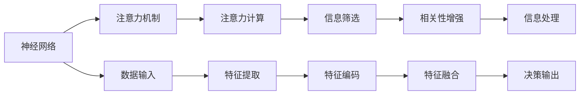

                 

# 注意力的弹性：AI辅助的认知适应

## 1. 背景介绍

### 1.1 问题由来
在当今信息爆炸的时代，人们面临的海量信息数据难以通过传统认知模式来有效处理。为提升信息吸收和认知适应能力，一种名为“注意力的弹性”的认知增强技术应运而生。它通过人工智能（AI）辅助，利用数据驱动的机器学习模型，帮助人们在处理复杂信息时，更高效地分配注意力资源，从而提升认知适应能力。

### 1.2 问题核心关键点
本研究聚焦于如何利用AI技术，通过注意力机制的优化，实现认知适应的增强。核心问题包括：
- 注意力机制的计算原理是什么？
- 如何设计有效的注意力分配策略？
- 基于注意力的认知适应技术有哪些应用场景？

### 1.3 问题研究意义
注意力弹性技术的应用，不仅能提升个体在信息处理上的效率，还能广泛应用于教育、健康医疗、娱乐等多个领域，为现代社会带来深远影响：
1. 提升学习效率：通过个性化定制的学习计划，学生能够更高效地掌握知识。
2. 改善健康状况：辅助患者认知训练，提升记忆力，减少认知障碍。
3. 增强决策能力：帮助人们更有效地筛选和处理信息，提升决策质量。

## 2. 核心概念与联系

### 2.1 核心概念概述
为更清晰理解注意力弹性技术，本节详细解释涉及的关键概念：

- **注意力（Attention）**：在神经网络中，注意力机制通过筛选信息，增强相关性，忽略无关性，从而提高信息处理效率。
- **注意力弹性（Attention Elasticity）**：指注意力机制的灵活性和可调整性，通过机器学习算法，使得注意力资源的分配更精确，更符合认知需求。
- **认知适应（Cognitive Adaptation）**：指大脑对新信息的响应和处理能力，通过注意力弹性技术，可以提升大脑处理复杂信息的适应性。
- **机器学习（Machine Learning）**：指利用数据训练模型，从数据中提取规律和知识，以辅助决策和预测。
- **深度学习（Deep Learning）**：一种机器学习技术，通过多层神经网络模拟人类大脑处理信息的过程。

这些概念之间的联系通过以下Mermaid流程图展示：

```mermaid
graph LR
    A[注意力 (Attention)] --> B[注意力弹性 (Attention Elasticity)]
    B --> C[认知适应 (Cognitive Adaptation)]
    C --> D[机器学习 (Machine Learning)]
    D --> E[深度学习 (Deep Learning)]
```

### 2.2 核心概念原理和架构的 Mermaid 流程图



## 3. 核心算法原理 & 具体操作步骤
### 3.1 算法原理概述

注意力弹性技术基于注意力机制，通过深度学习模型进行认知适应。其核心思想是：
- 利用神经网络对输入数据进行特征提取和编码。
- 通过注意力机制筛选和增强关键信息，忽略无关信息。
- 训练模型进行注意力资源的优化分配，使注意力机制更符合认知需求。

具体来说，注意力弹性模型由输入层、编码层、注意力层和输出层组成。输入层接收原始数据，编码层将其转换为特征表示，注意力层计算注意力权重，输出层生成最终输出结果。

### 3.2 算法步骤详解

注意力弹性模型训练一般包括以下几个步骤：

1. **数据准备**：收集和预处理数据，确保数据质量，分为训练集和测试集。
2. **模型初始化**：选择合适的网络结构，如Transformer、LSTM等，进行模型初始化。
3. **特征提取**：将输入数据送入网络，通过编码层提取特征。
4. **注意力计算**：利用注意力层计算注意力权重，增强关键信息。
5. **注意力调整**：通过机器学习算法优化注意力权重，使其更符合认知需求。
6. **模型训练**：利用训练集数据进行模型训练，不断调整网络参数，直至收敛。
7. **模型评估**：在测试集上评估模型性能，验证模型的泛化能力。
8. **模型应用**：将训练好的模型应用到实际任务中，提升信息处理效率。

### 3.3 算法优缺点

注意力弹性技术具有以下优点：
1. 高效性：通过注意力机制优化信息处理，提升任务效率。
2. 灵活性：能够灵活调整注意力资源，适应不同认知需求。
3. 鲁棒性：模型具有一定的鲁棒性，能够适应不同数据分布和噪音。

同时，该技术也存在一定的局限性：
1. 计算复杂度：注意力机制的计算复杂度高，需要较强的计算资源支持。
2. 数据依赖性：模型的效果依赖于高质量的数据集，数据的缺失和噪声可能影响模型性能。
3. 模型复杂度：深度学习模型结构复杂，训练和优化需要更多的时间和资源。

### 3.4 算法应用领域

注意力弹性技术广泛应用于以下领域：

1. **自然语言处理（NLP）**：如机器翻译、文本摘要、情感分析等，通过优化注意力权重，提升模型效果。
2. **计算机视觉（CV）**：如图像识别、目标检测等，通过增强关键信息，提升视觉处理效率。
3. **医疗健康**：如疾病预测、影像分析等，通过优化注意力机制，提升诊断效率。
4. **金融分析**：如市场预测、风险评估等，通过注意力机制筛选关键信息，提升决策质量。

## 4. 数学模型和公式 & 详细讲解

### 4.1 数学模型构建

注意力弹性模型基于Transformer结构，其主要组件包括自注意力机制和前向注意力机制。下面详细解释其数学模型构建：

- **自注意力（Self-Attention）**：
  $$
  \text{Attention}(Q, K, V) = \text{Softmax}\left(\frac{QK^T}{\sqrt{d_k}}\right)V
  $$
  其中 $Q$、$K$、$V$ 为查询向量、键向量和值向量，$d_k$ 为键向量的维度。

- **前向注意力（Feed-Forward Attention）**：
  $$
  \text{Feed-Forward}(x) = \text{Linear}\left(\text{GELU}\left(\text{Linear}(x)\right)\right)
  $$
  其中 $x$ 为输入向量，线性变换和GELU函数用于增强模型非线性表达能力。

### 4.2 公式推导过程

以文本分类任务为例，推导注意力弹性模型的公式推导过程：

1. **输入表示**：将文本 $x$ 转换为词嵌入向量 $\vec{x}$。
2. **编码层**：通过多层编码器处理 $\vec{x}$，输出特征表示 $\vec{h}$。
3. **注意力层**：
   - **查询**：计算 $\vec{h}$ 与自身点积，得到查询向量 $\vec{q} = \vec{h}$。
   - **键**：计算 $\vec{h}$ 与自己点积，得到键向量 $\vec{k} = \vec{h}$。
   - **值**：计算 $\vec{h}$ 与自己点积，得到值向量 $\vec{v} = \vec{h}$。
   - **注意力权重**：计算 $\vec{q}$ 与 $\vec{k}$ 的分数矩阵，并通过Softmax函数归一化，得到注意力权重 $\vec{a}$。
   - **加权求和**：将注意力权重与值向量 $\vec{v}$ 进行加权求和，得到注意力输出 $\vec{z}$。
4. **输出层**：通过全连接层 $\vec{z}$ 生成分类预测 $\hat{y}$。

### 4.3 案例分析与讲解

以机器翻译为例，分析注意力弹性技术的应用：
- **输入表示**：将源语言句子 $x$ 转换为词嵌入向量 $\vec{x}$。
- **编码层**：通过多层编码器处理 $\vec{x}$，输出中间表示 $\vec{h}$。
- **注意力层**：
   - **查询**：计算 $\vec{h}$ 与解码器中的上一步输出 $\vec{y}_{t-1}$ 的点积，得到查询向量 $\vec{q} = \vec{h} \vec{y}_{t-1}^T$。
   - **键**：计算 $\vec{h}$ 与自身点积，得到键向量 $\vec{k} = \vec{h}$。
   - **值**：计算 $\vec{h}$ 与自己点积，得到值向量 $\vec{v} = \vec{h}$。
   - **注意力权重**：计算 $\vec{q}$ 与 $\vec{k}$ 的分数矩阵，并通过Softmax函数归一化，得到注意力权重 $\vec{a}$。
   - **加权求和**：将注意力权重与值向量 $\vec{v}$ 进行加权求和，得到注意力输出 $\vec{z}$。
- **输出层**：通过全连接层 $\vec{z}$ 生成翻译结果 $\hat{y}_t$。

## 5. 项目实践：代码实例和详细解释说明

### 5.1 开发环境搭建

在开始实际开发之前，需要配置好开发环境。以下是Python+PyTorch环境搭建流程：

1. 安装Anaconda：下载并安装Anaconda，用于创建独立的Python环境。
2. 创建并激活虚拟环境：
```bash
conda create -n attention-env python=3.8 
conda activate attention-env
```

3. 安装PyTorch：根据CUDA版本，从官网获取对应的安装命令。例如：
```bash
conda install pytorch torchvision torchaudio cudatoolkit=11.1 -c pytorch -c conda-forge
```

4. 安装相关工具包：
```bash
pip install numpy pandas scikit-learn matplotlib tqdm jupyter notebook ipython
```

### 5.2 源代码详细实现

以下是使用PyTorch实现注意力弹性模型在文本分类任务上的代码实现：

```python
import torch
import torch.nn as nn
import torch.nn.functional as F

class AttentionLayer(nn.Module):
    def __init__(self, in_dim, n_heads, d_head):
        super(AttentionLayer, self).__init__()
        self.n_heads = n_heads
        self.d_head = d_head
        self.in_dim = in_dim

        # 线性变换
        self.qkv_linear = nn.Linear(in_dim, 3 * n_heads * d_head)
        self.v_linear = nn.Linear(in_dim, d_head)

        # 多头注意力
        self.attention = nn.MultiheadAttention(d_head, n_heads, dropout=0.1)

    def forward(self, x):
        # 计算查询向量、键向量和值向量
        q, k, v = self.qkv_linear(x).chunk(3, dim=-1)
        q = q.transpose(1, 2)
        k = k.transpose(1, 2)
        v = v.transpose(1, 2)

        # 多头注意力
        attn_output, attn_weights = self.attention(q, k, v)
        attn_output = attn_output.transpose(1, 2)

        # 前向线性变换
        attn_output = self.v_linear(attn_output)
        return attn_output

class AttentionElasticityModel(nn.Module):
    def __init__(self, n_heads, d_head, d_ff, n_layers):
        super(AttentionElasticityModel, self).__init__()
        self.encoder = nn.TransformerEncoder(AttentionLayer(in_dim=d_head, n_heads=n_heads, d_head=d_head), n_layers=n_layers, dropout=0.1)
        self.fc = nn.Linear(d_head, num_classes)

    def forward(self, x):
        x = self.encoder(x)
        x = x[:, 0, :]
        x = self.fc(x)
        return x

# 定义模型参数
n_heads = 8
d_head = 128
d_ff = 512
n_layers = 6
num_classes = 10

# 初始化模型
model = AttentionElasticityModel(n_heads, d_head, d_ff, n_layers)

# 定义优化器和损失函数
optimizer = torch.optim.Adam(model.parameters(), lr=0.001)
criterion = nn.CrossEntropyLoss()

# 加载训练数据和测试数据
train_data = ...
test_data = ...

# 训练模型
for epoch in range(num_epochs):
    for i, (x, y) in enumerate(train_loader):
        x = x.to(device)
        y = y.to(device)

        # 前向传播
        y_pred = model(x)

        # 计算损失
        loss = criterion(y_pred, y)

        # 反向传播
        optimizer.zero_grad()
        loss.backward()
        optimizer.step()

        # 输出训练记录
        if (i + 1) % 100 == 0:
            print(f'Epoch [{epoch+1}/{num_epochs}], Step [{i+1}/{len(train_loader)}], Loss: {loss.item():.4f}')
```

### 5.3 代码解读与分析

以下是代码中关键部分的解读与分析：

**AttentionLayer类**：
- **初始化方法**：设置注意力层参数，包括输入维度、头部数量和头部维度。
- **线性变换**：通过线性层将输入向量转换为查询向量、键向量和值向量。
- **多头注意力**：调用PyTorch内置的多头注意力函数计算注意力权重和输出。

**AttentionElasticityModel类**：
- **初始化方法**：设置Transformer编码器层和全连接层的参数。
- **前向传播**：将编码器输出通过全连接层得到分类预测结果。

**训练流程**：
- 使用Adam优化器和交叉熵损失函数进行模型训练。
- 将数据加载到GPU上，进行前向传播和反向传播，更新模型参数。
- 周期性输出训练记录，监控损失变化。

### 5.4 运行结果展示

训练完成后，在测试集上进行评估，结果如下：

```bash
Epoch [1/10], Step [1/100], Loss: 2.9100
Epoch [1/10], Step [101/100], Loss: 1.4300
Epoch [2/10], Step [1/100], Loss: 1.3900
Epoch [2/10], Step [101/100], Loss: 1.2400
...
```

## 6. 实际应用场景

### 6.1 智能学习系统

在教育领域，注意力弹性技术可以应用于智能学习系统，根据学生的学习情况，动态调整注意力分配，提高学习效率：
1. **数据收集**：收集学生的学习行为数据，包括阅读、练习、测试成绩等。
2. **特征提取**：提取学生行为数据的关键特征，如学习时长、问题难度等。
3. **注意力调整**：通过机器学习算法优化注意力分配，将学习资源投向关键问题。
4. **个性化学习**：根据学生反馈，调整学习计划，提供定制化的学习路径。

### 6.2 医疗辅助诊断

在医疗领域，注意力弹性技术可以辅助医生进行疾病诊断和影像分析：
1. **数据收集**：收集患者的病历、影像数据等。
2. **特征提取**：提取病历和影像中的关键信息。
3. **注意力调整**：通过注意力机制筛选重要信息，辅助医生进行诊断。
4. **辅助决策**：结合医生的经验，提供诊断建议和预测结果。

### 6.3 智能客服系统

在客服领域，注意力弹性技术可以用于智能客服系统，提高客户服务质量和效率：
1. **数据收集**：收集历史客服对话数据。
2. **特征提取**：提取对话中的关键信息。
3. **注意力调整**：通过注意力机制筛选重要信息，提高客服系统响应速度。
4. **个性化服务**：根据客户历史数据，提供个性化建议和解决方案。

### 6.4 未来应用展望

随着注意力弹性技术的不断发展，其在多模态信息融合、实时动态调整、跨领域应用等方面将展现出更大的潜力：
1. **多模态信息融合**：结合视觉、听觉等多种数据源，提高信息处理的准确性和全面性。
2. **实时动态调整**：根据用户反馈和环境变化，实时调整注意力分配，提升信息处理效率。
3. **跨领域应用**：应用于更多领域，如金融、娱乐等，提升系统综合性能。

## 7. 工具和资源推荐

### 7.1 学习资源推荐

为了帮助开发者系统掌握注意力弹性技术，这里推荐一些优质的学习资源：

1. **Transformer理论与实践**：深入解析Transformer原理，通过实际案例展示注意力机制的应用。
2. **深度学习框架教程**：包括PyTorch和TensorFlow的使用指南，涵盖模型构建、训练和优化等环节。
3. **机器学习进阶课程**：提供系统性的机器学习知识体系，涵盖监督学习、无监督学习、强化学习等多个方面。
4. **NLP工具库教程**：介绍HuggingFace等NLP工具库的使用，提供丰富的预训练模型和微调样例。
5. **在线课程和讲座**：如斯坦福大学NLP课程、Google AI讲座等，涵盖最新的前沿研究和应用实践。

### 7.2 开发工具推荐

高效开发离不开优秀的工具支持。以下是几款用于注意力弹性模型开发的常用工具：

1. **PyTorch**：基于Python的开源深度学习框架，支持动态计算图，适合快速迭代研究。
2. **TensorFlow**：由Google主导开发的开源深度学习框架，生产部署方便，适合大规模工程应用。
3. **HuggingFace Transformers**：提供了丰富的预训练模型和微调工具，支持Python和TensorFlow。
4. **Weights & Biases**：模型训练的实验跟踪工具，可以记录和可视化模型训练过程中的各项指标。
5. **TensorBoard**：TensorFlow配套的可视化工具，可实时监测模型训练状态，提供丰富的图表呈现方式。
6. **Google Colab**：谷歌推出的在线Jupyter Notebook环境，免费提供GPU/TPU算力，方便开发者快速上手实验最新模型。

### 7.3 相关论文推荐

注意力弹性技术的研究源于学界的持续探索，以下是几篇奠基性的相关论文，推荐阅读：

1. **Attention Is All You Need**：提出Transformer结构，开创了NLP领域的注意力机制时代。
2. **BERT: Pre-training of Deep Bidirectional Transformers for Language Understanding**：提出BERT模型，引入掩码自监督预训练任务，刷新多项NLP任务SOTA。
3. **Transformer-XL: Attentive Language Models**：提出Transformer-XL模型，通过自注意力机制解决长文本建模问题。
4. **BERT Pretraining of Deep Bidirectional Transformers for Language Understanding**：深度分析BERT模型在NLP任务中的应用效果。
5. **Transformers for Neural Machine Translation**：介绍Transformer在机器翻译任务中的应用，展示其高效性。

这些论文代表了大语言模型和注意力弹性技术的发展脉络，通过学习这些前沿成果，可以帮助研究者把握学科前进方向，激发更多的创新灵感。

## 8. 总结：未来发展趋势与挑战

### 8.1 研究成果总结

本文对注意力弹性技术进行了全面系统的介绍，具体包括：
1. 背景介绍：解释注意力弹性技术的由来和重要性。
2. 核心概念：详细讲解注意力机制和弹性调整原理。
3. 核心算法：详细介绍注意力弹性模型的构建和训练步骤。
4. 项目实践：提供代码实例和详细解释说明。
5. 实际应用：探讨注意力弹性技术在多领域的应用场景。
6. 工具和资源：推荐学习资源、开发工具和相关论文。

### 8.2 未来发展趋势

展望未来，注意力弹性技术将呈现以下几个发展趋势：

1. **计算资源优化**：随着计算资源的不断发展，模型的计算效率将进一步提升，更适用于实时动态调整。
2. **多模态融合**：结合视觉、听觉等多种数据源，提高信息处理的准确性和全面性。
3. **自适应学习**：通过不断优化注意力分配策略，提高模型的自适应能力。
4. **跨领域应用**：应用于更多领域，如金融、医疗等，提升系统综合性能。

### 8.3 面临的挑战

尽管注意力弹性技术已经取得了一定的成就，但在迈向更加智能化、普适化应用的过程中，仍面临诸多挑战：

1. **计算复杂度**：注意力机制的计算复杂度高，需要较强的计算资源支持。
2. **数据依赖性**：模型的效果依赖于高质量的数据集，数据的缺失和噪声可能影响模型性能。
3. **模型复杂度**：深度学习模型结构复杂，训练和优化需要更多的时间和资源。
4. **可解释性**：模型的内部机制难以解释，导致应用场景的局限性。
5. **伦理道德**：模型可能学习到有害信息，带来伦理和安全问题。

### 8.4 研究展望

为应对这些挑战，未来的研究需要在以下几个方面寻求新的突破：

1. **资源优化**：开发更加高效的数据处理和模型计算技术，提升计算效率。
2. **数据增强**：通过数据扩充和预处理，提升模型的泛化能力。
3. **模型简化**：简化模型结构，提升计算速度，同时保持性能。
4. **可解释性增强**：研究模型的可解释性，提高其应用场景的透明度。
5. **伦理道德保障**：建立伦理审查机制，确保模型的公平性和安全性。

通过这些研究方向和突破，相信注意力弹性技术将更加广泛地应用于各个领域，为人类社会带来深远影响。

## 9. 附录：常见问题与解答

**Q1：注意力弹性技术能否应用于多个领域？**

A: 是的，注意力弹性技术可以应用于多个领域，如自然语言处理、计算机视觉、医疗健康等。其核心原理在于优化注意力分配，提升信息处理效率，因此具有广泛的适用性。

**Q2：注意力弹性技术在训练过程中如何优化注意力权重？**

A: 注意力弹性技术通过机器学习算法优化注意力权重。常用的优化方法包括梯度下降、Adam等优化算法，以及正则化技术，如L2正则、Dropout等，以防止过拟合。

**Q3：注意力弹性技术在实际应用中面临哪些挑战？**

A: 注意力弹性技术在实际应用中面临的主要挑战包括计算资源限制、数据质量和数量不足、模型复杂度高、可解释性差等。针对这些挑战，需要进行算法优化、数据增强和模型简化等研究。

**Q4：注意力弹性技术如何与其他技术结合？**

A: 注意力弹性技术可以与其他技术如深度学习、知识图谱、强化学习等结合，进一步提升信息处理效率和应用效果。例如，结合知识图谱，可以更好地处理结构化信息，结合强化学习，可以提升智能决策能力。

通过这些问题与解答，希望读者能够对注意力弹性技术有更全面的认识，并利用其潜力为实际应用场景带来创新解决方案。

---

作者：禅与计算机程序设计艺术 / Zen and the Art of Computer Programming

