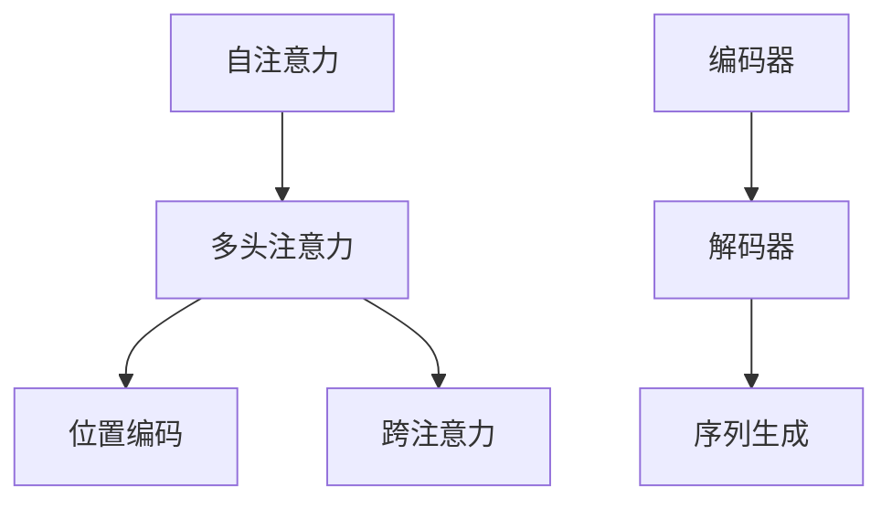

                 

# 注意力的生态系统：AI时代的信息流

## 1. 背景介绍

### 1.1 问题由来
随着人工智能技术的迅猛发展，AI时代的信息流动方式发生了翻天覆地的变化。人类社会正在从传统的集中式信息处理模式，向分布式、去中心化的智能生态系统转变。在这个过程中，注意力机制（Attention Mechanism）作为一种高效的信息处理方式，发挥了举足轻重的作用。

注意力机制最早在自然语言处理领域中被提出，用于解决序列到序列（Sequence to Sequence, Seq2Seq）模型中的长距离依赖问题。随后，注意力机制被广泛应用于图像识别、语音识别、推荐系统等多个领域，极大地提升了模型在各类任务中的表现。

本文将系统介绍注意力机制的原理、架构、应用及其生态系统，深入探讨其在AI时代信息流中的应用场景、未来发展趋势以及面临的挑战。

### 1.2 问题核心关键点
注意力机制的核心思想在于通过计算输入序列中不同部分的重要性权重，来动态地选取和组合信息，实现对复杂输入的精细化处理。其主要包括以下几个关键点：
1. 自注意力（Self-Attention）：在输入序列内计算各部分之间的相关性权重。
2. 跨注意力（Cross-Attention）：在输入序列与其他序列（如目标序列）之间计算相关性权重。
3. 多头注意力（Multi-Head Attention）：通过多组自注意力或跨注意力来捕捉不同角度的信息。
4. 位置编码（Positional Encoding）：为输入序列中的每个位置分配不同的编码，以保留时间顺序信息。
5. 编码器-解码器框架（Encoder-Decoder Framework）：通过编码器提取输入信息，解码器根据编码信息生成输出。

本文将围绕这些关键点，详细阐述注意力机制的原理和应用，探讨其在AI时代信息流中的生态系统构建。

## 2. 核心概念与联系

### 2.1 核心概念概述
注意力机制是深度学习中一种常用的信息处理技术，主要用于解决序列模型中的长距离依赖问题。其核心思想是通过计算输入序列中不同部分的重要性权重，来动态地选取和组合信息，实现对复杂输入的精细化处理。

注意力的生态系统包括但不限于：
1. 自注意力机制：在输入序列内部计算各部分之间的相关性权重，用于捕捉输入序列内部的语义信息。
2. 跨注意力机制：在输入序列与其他序列之间计算相关性权重，用于捕捉输入序列与其他序列之间的语义信息。
3. 多头注意力机制：通过多组自注意力或跨注意力来捕捉不同角度的信息，提升模型对输入的建模能力。
4. 位置编码：为输入序列中的每个位置分配不同的编码，以保留时间顺序信息。
5. 编码器-解码器框架：通过编码器提取输入信息，解码器根据编码信息生成输出，常用于处理序列生成任务。

这些核心概念共同构成了注意力机制的生态系统，覆盖了从基础自注意力到高级多头注意力的各种应用场景，极大地提升了深度学习模型在各类任务中的性能。

### 2.2 核心概念原理和架构的 Mermaid 流程图


该图展示了注意力机制的生态系统，其中自注意力和跨注意力是基础，多头注意力和多组注意力用于提升模型的表达能力，位置编码用于保留时间顺序信息，编码器-解码器框架用于序列生成任务。

## 3. 核心算法原理 & 具体操作步骤
### 3.1 算法原理概述
注意力机制通过计算输入序列中不同部分的重要性权重，来动态地选取和组合信息，实现对复杂输入的精细化处理。其核心思想是通过计算输入序列中不同部分的相关性权重，来动态地选取和组合信息，实现对复杂输入的精细化处理。

在自注意力机制中，输入序列中的每个位置i对其他位置j的注意力权重 $a_{ij}$ 由下式计算：

$$
a_{ij} = \frac{e^{\text{similarity}(x_i, x_j)}}{\sum_{k=1}^K e^{\text{similarity}(x_i, x_k)}}
$$

其中，$similarity(x_i, x_j)$ 是位置i和位置j之间的相似度函数，$e$ 是自然对数底数，$K$ 是输入序列的长度。权重向量 $a_{ij}$ 反映了位置i对位置j的注意力，权重越大，表示位置j对位置i的影响越大。

### 3.2 算法步骤详解
1. **输入准备**：将输入序列转换为向量表示 $x_i$，进行编码和解码。
2. **自注意力计算**：计算输入序列中每个位置对其他位置的注意力权重 $a_{ij}$。
3. **组合信息**：根据注意力权重计算加权和 $z_i$，得到每个位置的信息表示。
4. **多头注意力**：通过多组自注意力或跨注意力，捕捉不同角度的信息，得到最终输出。
5. **位置编码**：为输入序列中的每个位置分配不同的编码，以保留时间顺序信息。
6. **编码器-解码器**：通过编码器提取输入信息，解码器根据编码信息生成输出。

### 3.3 算法优缺点
#### 优点
1. **高效信息处理**：通过动态计算注意力权重，有效地捕捉输入序列中的关键信息，提升模型处理复杂输入的能力。
2. **模型灵活性**：多头注意力的应用使得模型可以捕捉不同角度的信息，增强了模型的表达能力。
3. **泛化能力强**：位置编码和多头注意力机制使得模型能够更好地处理序列生成和信息压缩等任务。

#### 缺点
1. **计算复杂度高**：自注意力机制的计算复杂度较高，尤其是在长序列或大规模数据集上，可能会面临计算资源不足的问题。
2. **参数量较大**：多头注意力和位置编码机制需要引入额外的参数，增加了模型的参数量。
3. **解释性差**：注意力机制的内部计算过程较为复杂，难以直观理解每个位置的注意力权重。

### 3.4 算法应用领域
注意力机制在深度学习领域有着广泛的应用，主要包括以下几个领域：

1. **自然语言处理（NLP）**：用于机器翻译、文本摘要、情感分析等任务。
2. **计算机视觉（CV）**：用于图像描述生成、目标检测、图像生成等任务。
3. **语音识别（ASR）**：用于语音转换、自动字幕生成等任务。
4. **推荐系统**：用于用户行为分析、物品推荐等任务。
5. **强化学习**：用于智能决策、环境建模等任务。

这些领域的应用表明，注意力机制在提升模型表达能力和处理复杂输入方面具有显著优势。

## 4. 数学模型和公式 & 详细讲解 & 举例说明
### 4.1 数学模型构建
在注意力机制中，输入序列 $\{x_i\}_{i=1}^K$ 被映射到 $x_i \in \mathbb{R}^d$ 的向量表示，其中 $d$ 是向量维度。自注意力机制的输入表示可以通过以下公式计算：

$$
Q = W_Q x
$$

$$
K = W_K x
$$

$$
V = W_V x
$$

其中，$Q$、$K$、$V$ 分别是查询向量、键向量和值向量，$W_Q$、$W_K$、$W_V$ 是投影矩阵，用于将输入向量映射到不同的维度。

自注意力机制的权重矩阵 $A$ 可以通过以下公式计算：

$$
A = \text{softmax}\left(\frac{QK^T}{\sqrt{d_k}}\right)
$$

其中，$d_k$ 是键向量维度，$\text{softmax}$ 函数用于计算权重矩阵的归一化。

### 4.2 公式推导过程
自注意力机制的计算过程可以分为以下几个步骤：

1. **输入映射**：将输入序列映射到查询向量、键向量和值向量。
2. **计算注意力权重**：通过查询向量和键向量的点积，计算出注意力权重矩阵。
3. **加权求和**：将注意力权重矩阵与值向量进行加权求和，得到每个位置的注意力向量。

### 4.3 案例分析与讲解
以机器翻译任务为例，输入序列为源语言句子，输出序列为目标语言句子。自注意力机制可以帮助模型更好地捕捉输入序列中不同词的语义关系，从而生成更加准确的翻译结果。

假设输入序列长度为 $K=10$，向量维度为 $d=256$，可以通过以下代码实现自注意力机制的计算：

```python
import torch
import torch.nn as nn

class Attention(nn.Module):
    def __init__(self, d_model, n_heads):
        super(Attention, self).__init__()
        self.d_model = d_model
        self.n_heads = n_heads
        self.depth = d_model // n_heads
        self.W_q = nn.Linear(d_model, d_model)
        self.W_k = nn.Linear(d_model, d_model)
        self.W_v = nn.Linear(d_model, d_model)
        self.fc = nn.Linear(d_model, d_model)

    def forward(self, x):
        Q = self.W_q(x).view(x.size(0), x.size(1), self.n_heads, self.depth).permute(0, 2, 1, 3).contiguous()
        K = self.W_k(x).view(x.size(0), x.size(1), self.n_heads, self.depth).permute(0, 2, 1, 3).contiguous()
        V = self.W_v(x).view(x.size(0), x.size(1), self.n_heads, self.depth).permute(0, 2, 1, 3).contiguous()
        energy = torch.matmul(Q, K.permute(0, 1, 3, 2)) / torch.sqrt(torch.tensor(self.depth, dtype=torch.float32))
        attention_weights = torch.softmax(energy, dim=-1)
        attention_outputs = torch.matmul(attention_weights, V)
        attention_outputs = attention_outputs.permute(0, 2, 1, 3).contiguous().view(x.size(0), x.size(1), self.d_model)
        return self.fc(attention_outputs)
```

以上代码实现了自注意力机制的计算，具体步骤如下：
1. 通过线性变换将输入向量映射到查询向量、键向量和值向量。
2. 计算查询向量和键向量的点积，得到注意力权重矩阵。
3. 通过注意力权重矩阵和值向量进行加权求和，得到每个位置的注意力向量。
4. 将注意力向量进行线性变换，得到最终的输出。

## 5. 项目实践：代码实例和详细解释说明
### 5.1 开发环境搭建
在PyTorch中实现注意力机制需要以下开发环境：
1. **安装PyTorch**：通过pip安装PyTorch库，支持CUDA加速。
2. **安装其他依赖**：安装TensorBoard和Weights & Biases等可视化工具，方便模型调试和评估。

### 5.2 源代码详细实现
以机器翻译任务为例，使用Transformer模型实现注意力机制的计算。Transformer模型包含编码器和解码器，其中编码器和解码器都使用自注意力机制进行信息处理。

**编码器部分**：
```python
class EncoderLayer(nn.Module):
    def __init__(self, d_model, n_heads, d_k, d_v, dropout, activation):
        super(EncoderLayer, self).__init__()
        self.self_attn = MultiheadAttention(d_model, n_heads)
        self.linear1 = nn.Linear(d_model, d_model)
        self.linear2 = nn.Linear(d_model, d_model)
        self.dropout = dropout

    def forward(self, x, mask):
        attn_output = self.self_attn(x, x, x)
        attn_output = dropout(attn_output, training=self.training)
        x = residual connections(x, attn_output)
        x = F.relu(self.linear1(x))
        x = dropout(x, training=self.training)
        x = residual_connections(x, self.linear2(x))
        return x, attn_output

class Encoder(nn.Module):
    def __init__(self, src_vocab_size, d_model, n_layers, n_heads, d_k, d_v, dropout, positional_encoding):
        super(Encoder, self).__init__()
        self.encoder_layer = nn.ModuleList([EncoderLayer(d_model, n_heads, d_k, d_v, dropout, activation) for _ in range(n_layers)])
        self.positional_encoding = positional_encoding
        self.src_mask = None

    def forward(self, src, src_mask):
        if self.src_mask is None or self.src_mask.size(0) != len(src):
            self.src_mask = make_causal_mask(len(src)).to(device)

        x = src
        for encoder_layer in self.encoder_layer:
            x, attn_output = encoder_layer(x, self.src_mask)
        return x
```

**解码器部分**：
```python
class DecoderLayer(nn.Module):
    def __init__(self, d_model, n_heads, d_k, d_v, dropout, activation):
        super(DecoderLayer, self).__init__()
        self.self_attn = MultiheadAttention(d_model, n_heads)
        self.multihead_attn = MultiheadAttention(d_model, n_heads)
        self.linear1 = nn.Linear(d_model, d_model)
        self.linear2 = nn.Linear(d_model, d_model)
        self.dropout = dropout

    def forward(self, x, src_mask, tgt_mask):
        attn_output = self.self_attn(x, x, x)
        attn_output = dropout(attn_output, training=self.training)
        x = residual_connections(x, attn_output)
        attn_output = self.multihead_attn(x, src_mask, src_mask)
        attn_output = dropout(attn_output, training=self.training)
        x = residual_connections(x, attn_output)
        x = F.relu(self.linear1(x))
        x = dropout(x, training=self.training)
        x = residual_connections(x, self.linear2(x))
        return x, attn_output

class Decoder(nn.Module):
    def __init__(self, tgt_vocab_size, d_model, n_layers, n_heads, d_k, d_v, dropout, positional_encoding, src_mask):
        super(Decoder, self).__init__()
        self.decoder_layer = nn.ModuleList([DecoderLayer(d_model, n_heads, d_k, d_v, dropout, activation) for _ in range(n_layers)])
        self.positional_encoding = positional_encoding
        self.tgt_mask = None
        self.src_mask = src_mask

    def forward(self, tgt, src, tgt_mask, src_mask):
        if self.tgt_mask is None or self.tgt_mask.size(0) != len(tgt):
            self.tgt_mask = make_causal_mask(len(tgt)).to(device)

        x = tgt
        for decoder_layer in self.decoder_layer:
            x, attn_output = decoder_layer(x, src_mask, tgt_mask)
        return x
```

### 5.3 代码解读与分析
通过以上代码，实现了Transformer模型的编码器和解码器，其中自注意力机制通过MultiheadAttention实现。具体步骤如下：
1. **编码器部分**：
   - 初始化多个EncoderLayer，每个层使用自注意力机制计算输入序列的表示。
   - 使用位置编码对输入序列进行位置信息保留。
   - 使用残差连接和ReLU激活函数，增强模型的表达能力。
2. **解码器部分**：
   - 初始化多个DecoderLayer，每个层使用自注意力和跨注意力机制计算输入序列的表示。
   - 使用位置编码对输入序列进行位置信息保留。
   - 使用残差连接和ReLU激活函数，增强模型的表达能力。

## 6. 实际应用场景
### 6.1 智能客服系统
在智能客服系统中，基于注意力机制的对话模型可以显著提升系统的响应速度和准确性。通过对用户输入的关键词进行加权处理，模型可以更好地捕捉用户意图，生成更加自然、流畅的回答。

具体实现上，可以采用Transformer模型进行对话建模，通过自注意力机制捕捉用户输入的关键词，生成对应的回复。此外，可以使用多轮对话历史作为上下文，提高模型的对话理解和生成能力。

### 6.2 金融舆情监测
在金融舆情监测中，基于注意力机制的文本分类模型可以实时监测市场舆情变化，帮助金融机构及时应对负面信息传播，规避金融风险。

具体实现上，可以采用Transformer模型进行文本分类，通过自注意力机制捕捉文本中的关键信息，生成对应的分类结果。此外，可以使用情感分析等技术，进一步挖掘文本中的情感倾向，提供更详细的舆情报告。

### 6.3 个性化推荐系统
在个性化推荐系统中，基于注意力机制的推荐模型可以更精准地推荐用户感兴趣的商品。通过对用户浏览、点击、评论等行为数据的加权处理，模型可以捕捉用户兴趣点，生成个性化的推荐结果。

具体实现上，可以采用Transformer模型进行推荐建模，通过自注意力机制捕捉用户行为数据，生成对应的推荐结果。此外，可以使用多组自注意力捕捉不同角度的用户行为信息，进一步提升推荐效果。

### 6.4 未来应用展望
未来，基于注意力机制的AI时代信息流将迎来更多的应用场景，涵盖自然语言处理、计算机视觉、语音识别等多个领域。随着技术不断进步，注意力机制的计算复杂度将进一步优化，模型将更加高效、灵活，适应更复杂的信息处理需求。

## 7. 工具和资源推荐
### 7.1 学习资源推荐
为了帮助开发者系统掌握注意力机制的理论基础和实践技巧，这里推荐一些优质的学习资源：
1. **《深度学习》**：Ian Goodfellow所著，系统介绍了深度学习的基本原理和应用，包括注意力机制。
2. **Coursera《自然语言处理》**：斯坦福大学开设的NLP课程，涵盖了自然语言处理的基本概念和深度学习模型，包括Transformer和注意力机制。
3. **HuggingFace官方文档**：提供了详细的Transformer和注意力机制的实现教程，是学习实践的必备资料。

### 7.2 开发工具推荐
为了实现注意力机制的高效计算和优化，以下是几款常用的开发工具：
1. **PyTorch**：支持动态计算图，适合快速迭代研究，是实现Transformer模型的首选工具。
2. **TensorFlow**：支持静态计算图，适合大规模工程应用，同样有丰富的Transformer实现。
3. **Weights & Biases**：模型训练的实验跟踪工具，可以记录和可视化模型训练过程中的各项指标。

### 7.3 相关论文推荐
注意力机制在深度学习领域有着广泛的应用，以下是几篇奠基性的相关论文，推荐阅读：
1. **Attention is All You Need**：提出了Transformer结构，引入了自注意力机制，开启了NLP领域的预训练大模型时代。
2. **Neural Machine Translation by Jointly Learning to Align and Translate**：提出了基于注意力机制的机器翻译模型，显著提升了翻译效果。
3. **Exploring the Limits of Language Modeling**：展示了大型预训练语言模型在自然语言处理中的强大零样本学习能力，引发了对通用人工智能的思考。

## 8. 总结：未来发展趋势与挑战
### 8.1 总结
本文对注意力机制的原理、架构、应用及其生态系统进行了全面系统的介绍。通过详细阐述自注意力、跨注意力、多头注意力等核心概念，展示了注意力机制在自然语言处理、计算机视觉、语音识别等领域的广泛应用。通过系统分析注意力机制的优点和缺点，探讨了其在AI时代信息流中的应用场景、未来发展趋势以及面临的挑战。

### 8.2 未来发展趋势
随着AI技术的不断进步，基于注意力机制的AI时代信息流将迎来更多的应用场景，涵盖自然语言处理、计算机视觉、语音识别等多个领域。未来的发展趋势包括但不限于：
1. **多模态注意力**：将视觉、语音等多模态信息与文本信息进行协同建模，提升模型的表达能力。
2. **可解释性增强**：通过可解释性工具和方法，提高模型决策的可解释性，增强模型的可信度。
3. **多任务学习**：通过多任务学习，提高模型在多个任务上的表现，提升模型的泛化能力。
4. **联邦学习**：在分布式环境中，通过联邦学习技术，保护数据隐私的同时提升模型的效果。

### 8.3 面临的挑战
尽管注意力机制在AI时代信息流中有着广泛的应用，但在实现过程中仍面临诸多挑战：
1. **计算复杂度高**：自注意力机制的计算复杂度较高，尤其是在长序列或大规模数据集上，可能会面临计算资源不足的问题。
2. **参数量较大**：多头注意力和位置编码机制需要引入额外的参数，增加了模型的参数量。
3. **模型鲁棒性不足**：注意力机制在面对域外数据时，泛化性能往往大打折扣。
4. **可解释性差**：注意力机制的内部计算过程较为复杂，难以直观理解每个位置的注意力权重。

### 8.4 研究展望
未来的研究需要从以下几个方面寻求新的突破：
1. **优化计算复杂度**：开发更加高效的计算方法，如压缩计算图、分块计算等，降低自注意力机制的计算复杂度。
2. **减少参数量**：通过剪枝、量化等方法，减少多头注意力和位置编码的参数量，提高模型的推理速度。
3. **增强鲁棒性**：通过引入对抗训练、数据增强等方法，提高模型的泛化性能和鲁棒性。
4. **提升可解释性**：开发可解释性工具和方法，增强模型决策的可解释性，提高模型的可信度。

通过不断优化计算复杂度、减少参数量、增强鲁棒性和提升可解释性，未来的注意力机制将能够更好地应用于AI时代的信息流中，为深度学习模型的发展提供强大的支持。

## 9. 附录：常见问题与解答
### Q1: 什么是注意力机制？
A: 注意力机制是深度学习中一种常用的信息处理技术，主要用于解决序列模型中的长距离依赖问题。其核心思想是通过计算输入序列中不同部分的重要性权重，来动态地选取和组合信息，实现对复杂输入的精细化处理。

### Q2: 注意力机制的应用场景有哪些？
A: 注意力机制在深度学习领域有着广泛的应用，主要包括以下几个领域：
1. 自然语言处理（NLP）：用于机器翻译、文本摘要、情感分析等任务。
2. 计算机视觉（CV）：用于图像描述生成、目标检测、图像生成等任务。
3. 语音识别（ASR）：用于语音转换、自动字幕生成等任务。
4. 推荐系统：用于用户行为分析、物品推荐等任务。
5. 强化学习：用于智能决策、环境建模等任务。

### Q3: 注意力机制的计算复杂度较高，如何解决？
A: 可以通过优化计算方法、减少参数量、引入对抗训练等方法，降低自注意力机制的计算复杂度。例如，可以通过压缩计算图、分块计算等方法，减少计算量；通过剪枝、量化等方法，减少多头注意力和位置编码的参数量，提高模型的推理速度。

### Q4: 如何增强注意力机制的鲁棒性？
A: 可以通过引入对抗训练、数据增强等方法，提高模型的泛化性能和鲁棒性。例如，可以在训练过程中加入对抗样本，提高模型对噪声数据的鲁棒性；通过数据增强方法，提高模型对数据分布变化的适应能力。

### Q5: 如何提升注意力机制的可解释性？
A: 可以通过开发可解释性工具和方法，增强模型决策的可解释性，提高模型的可信度。例如，可以使用注意力可视化工具，展示模型在处理输入时关注的信息区域；通过可解释性方法，分析模型决策的内部逻辑和推理过程。

通过不断优化计算复杂度、减少参数量、增强鲁棒性和提升可解释性，未来的注意力机制将能够更好地应用于AI时代的信息流中，为深度学习模型的发展提供强大的支持。

