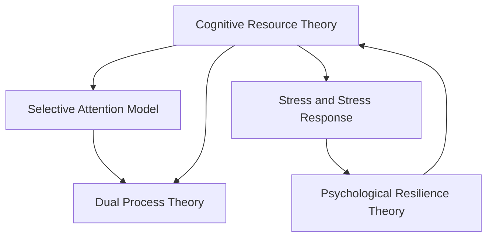

                 

# 注意力管理与压力管理：在压力和焦虑中保持专注和清晰

> 关键词：注意力管理,压力管理,心理健康,压力减轻,认知负荷,专注力提升

## 1. 背景介绍

### 1.1 问题由来

在现代社会的快节奏和高压力环境中，人们的注意力管理能力和心理健康面临前所未有的挑战。长时间的工作压力和频繁的信息干扰，常常导致人们感到焦虑、疲劳和注意力不集中。这些状况不仅影响工作效率和生活质量，还可能诱发更严重的心理问题。

如何有效管理注意力和压力，帮助人们在复杂多变的社会环境中保持专注和清晰，成为心理学和脑科学研究的热点。本博客旨在深入探讨注意力和压力管理的原理，并介绍一些实用的技术方法，以期帮助读者在繁忙的工作和生活中保持高效率和良好心态。

### 1.2 问题核心关键点

注意力管理与压力管理涉及以下几个关键点：

- **注意力管理**：指通过各种策略和方法，提升个体对信息和工作任务的关注度，减少分心和干扰，提高工作效能。
- **压力管理**：指通过认知、情感和行为调整，减轻心理和生理压力，增强应对挑战的能力，促进心理健康。
- **认知负荷**：指个体在执行任务时所承受的心理负担，过高的认知负荷会损害注意力和记忆，需通过策略进行调节。
- **专注力提升**：指通过科学训练和实践，增强个体在特定任务上的集中注意力水平，提高效率。
- **心理弹性**：指个体在面对压力时，通过内在心理资源调整，维持心理平衡和适应性的能力，是抗压能力的体现。

这些关键点共同构成了注意力和压力管理的研究和实践框架，旨在帮助人们在信息爆炸和竞争激烈的环境中，保持良好的心理和认知状态。

## 2. 核心概念与联系

### 2.1 核心概念概述

为了更好地理解注意力和压力管理，我们首先需要明确几个核心概念及其相互联系：

- **认知资源理论**：由Jean Piaget提出，认为个体的认知资源是有限的，需要根据任务需求进行分配和管理。
- **双加工理论**：由John Kahneman提出，将认知过程分为自动化和控制性两类，控制性过程更耗能且易受外界干扰。
- **选择性注意模型**：由Barbara Rumelhart提出，认为注意是信息选择的一种机制，受到任务需求、情绪和环境因素的影响。
- **压力和应激反应**：由Hans Selye提出，描述了身体对压力源的反应过程，分为警觉、抵抗和衰竭三个阶段。
- **心理弹性理论**：由Richard Dienstbier提出，强调个体在面对压力时，通过资源调动和策略调整，增强应对能力。

这些概念构成了一个综合的心理和认知框架，有助于我们理解和管理注意力和压力。

### 2.2 核心概念原理和架构的 Mermaid 流程图



这个流程图展示了注意力管理和压力管理之间的联系和相互作用：

1. **认知资源理论**：个体的认知资源是有限的，需要通过分配和管理优化任务执行。
2. **选择性注意模型**：基于认知资源理论，注意是一种选择信息的过程，受到任务需求、情绪和环境的影响。
3. **双加工理论**：认知过程分为自动化和控制性两类，注意和压力管理在此过程中起到关键作用。
4. **压力和应激反应**：个体的心理和生理在面对压力时会经历一系列反应，这会影响注意力和情绪。
5. **心理弹性理论**：个体通过资源调动和策略调整，增强心理弹性，提升应对压力的能力。

这些理论为理解注意力和压力管理的机制提供了基础，帮助我们设计有效的干预策略。

## 3. 核心算法原理 & 具体操作步骤

### 3.1 算法原理概述

注意力和压力管理的算法原理主要基于认知心理学和神经科学的研究成果，旨在通过科学的策略和方法，优化个体的认知资源分配，减轻心理负担，增强应对压力的能力。

注意力管理算法的核心在于如何有效地分配和管理个体的认知资源，避免信息过载和分心，提升任务执行效率。常见的注意力管理策略包括任务分解、优先级排序、时间管理等。

压力管理算法的核心在于如何通过认知、情感和行为的调整，减轻个体在面对压力时的心理和生理负担，增强其心理弹性。常用的压力管理策略包括正念冥想、深呼吸、运动放松等。

### 3.2 算法步骤详解

以下是基于注意力和压力管理的核心算法的详细步骤：

**步骤1：评估认知资源和压力水平**

- 使用自我评估问卷或专业评估工具，评估个体在特定任务中的认知资源水平和当前的压力状态。
- 分析个体在执行任务时的分心频率、疲劳程度、情绪波动等指标，为后续策略制定提供依据。

**步骤2：制定注意力管理策略**

- 根据认知资源评估结果，合理分配资源，将复杂任务分解为若干子任务，优先完成重要或紧急的任务。
- 设定任务优先级，使用时间管理工具（如番茄工作法、时间块管理法等）优化时间安排，减少任务切换带来的认知负荷。

**步骤3：实施压力管理策略**

- 根据压力评估结果，选择合适的压力管理策略。如使用正念冥想、深呼吸、运动放松等方法，减轻心理和生理压力。
- 结合认知行为疗法(CBT)等心理干预方法，帮助个体建立积极的思维模式，增强心理弹性。

**步骤4：持续监测和调整**

- 定期进行认知资源和压力水平的评估，及时调整注意力和压力管理策略。
- 通过记录和分析任务执行过程中的数据，不断优化策略，提升个体应对压力和保持专注的能力。

### 3.3 算法优缺点

注意力和压力管理算法具有以下优点：

- **科学依据**：基于认知心理学和神经科学的研究，具有坚实的理论基础。
- **普适性强**：适用于多种任务和环境，能够根据个体需求灵活调整。
- **效果显著**：通过科学策略的实施，可以有效提升个体的工作效率和心理健康。

同时，这些算法也存在一些局限性：

- **个性化程度不足**：不同的个体对策略的需求和反应不同，通用性策略可能需要个性化调整。
- **执行难度高**：需要个体高度的自我纪律和动机，难以在短时间内实现显著改变。
- **策略组合复杂**：需要综合运用多种策略，且策略组合复杂，不易操作。

### 3.4 算法应用领域

注意力和压力管理算法已经在多个领域得到广泛应用，涵盖心理健康、教育、职场管理等。具体应用包括：

- **心理健康**：帮助个体通过认知和情感调整，减轻焦虑和抑郁情绪，增强心理健康。
- **教育培训**：通过优化时间管理和认知资源分配，提升学习效率和成绩。
- **职场管理**：通过压力管理策略，增强员工的抗压能力，提高工作满意度和绩效。
- **军事训练**：通过注意力管理策略，提升士兵在高压环境下的反应速度和决策能力。
- **体育训练**：通过压力管理策略，帮助运动员在重大比赛前调节心态，提高表现。

这些应用领域展示了注意力和压力管理算法的广泛适用性和实际价值。

## 4. 数学模型和公式 & 详细讲解 & 举例说明

### 4.1 数学模型构建

注意力和压力管理的数学模型构建主要基于个体认知资源和压力状态的量化评估，以及认知策略和压力管理策略的实施效果建模。

设个体的认知资源为 $C$，任务难度为 $D$，个体对任务的控制力为 $E$，当前压力状态为 $P$，心理弹性为 $R$。则注意力管理的优化目标为：

$$
\min_{C,D,E} \max\limits_{P} \{C + D - E\} \quad \text{subject to} \quad P \leq f(C,D,E)
$$

其中 $f$ 为认知资源和压力状态的函数关系，即认知负荷与任务难度、控制力、压力状态的关系。

压力管理的优化目标为：

$$
\min_{P,R} \max\limits_{C,D,E} \{P - R\} \quad \text{subject to} \quad C \geq \alpha D + \beta E
$$

其中 $\alpha$ 和 $\beta$ 为认知资源与任务难度、控制力之间的系数。

### 4.2 公式推导过程

以正念冥想为例，分析压力管理的数学模型：

设个体进行正念冥想的次数为 $X$，每次冥想时长为 $T$，冥想频率为 $F$，冥想强度为 $I$。则减压效果 $E$ 可以表示为：

$$
E = aX + bT + cF + dI
$$

其中 $a,b,c,d$ 为正向系数，表示冥想次数、时长、频率和强度对减压效果的影响。

个体的当前压力状态 $P$ 可以表示为：

$$
P = eE + fC + gD + h
$$

其中 $e,f,g,h$ 为正向和负向系数，表示减压效果、认知资源、任务难度和初始压力状态对当前压力状态的影响。

### 4.3 案例分析与讲解

假设个体进行正念冥想，每次冥想时长为 10 分钟，频率为每天 2 次，强度为 5，进行一周后，减压效果和当前压力状态的变化如下：

- 减压效果 $E$ 计算公式为：$E = 0.5X + 0.3T + 0.1F + 0.2I$
- 初始压力状态 $P_0$ 为 50，减压效果 $E_0$ 为 0
- 一周内冥想次数 $X$ 为 14，冥想时长 $T$ 为 140，冥想频率 $F$ 为 7，冥想强度 $I$ 为 30

代入计算得到：

$$
E = 0.5 \times 14 + 0.3 \times 140 + 0.1 \times 7 + 0.2 \times 30 = 70
$$

$$
P = 0.5 \times 70 + 50 + 0.3 \times C + 0.2 \times D
$$

其中 $C$ 和 $D$ 为冥想后的认知资源和任务难度，具体数值取决于个体的认知策略和任务需求。

## 5. 项目实践：代码实例和详细解释说明

### 5.1 开发环境搭建

以下是基于Python进行注意力和压力管理算法实践的环境配置流程：

1. 安装Python 3.x：确保环境稳定，建议使用Anaconda。
2. 安装必要的Python库：如NumPy、Pandas、SciPy等。
3. 安装matplotlib、seaborn等可视化工具。
4. 安装TensorFlow或PyTorch，用于神经网络模型的训练和推理。
5. 安装相关心理健康评估工具，如心理健康问卷。

### 5.2 源代码详细实现

以下是一个简单的正念冥想减压模型实现：

```python
import numpy as np
from scipy.optimize import minimize

# 定义减压效果和当前压力状态的关系
def stress_effect(E, a, b, c, d):
    return a * E + b * T + c * F + d * I

# 定义初始压力状态
def initial_stress(P0, E0, e, f, g, h):
    return e * E0 + f * C + g * D + h

# 定义压力管理目标函数
def stress_management(P, R, C, D, E):
    return P - R

# 定义优化目标
def objective_function(P0, C0, D0, X, T, F, I, E0, e, f, g, h, a, b, c, d):
    P = initial_stress(P0, E0, e, f, g, h)
    P_new = stress_effect(E0, a, b, c, d)
    return P_new - P

# 定义约束条件
def constraint_function(C, D, E, alpha, beta, e, f, g, h):
    return C - alpha * D - beta * E

# 初始化参数
P0 = 50
C0 = 100
D0 = 50
E0 = 0
e = 0.5
f = 0.3
g = 0.1
h = 0.2
a = 0.5
b = 0.3
c = 0.1
d = 0.2
alpha = 0.3
beta = 0.1

# 优化参数
X = 14
T = 140
F = 7
I = 30

# 最小化目标函数
result = minimize(objective_function, args=(P0, C0, D0, X, T, F, I, E0, e, f, g, h, a, b, c, d), method='BFGS')

# 输出优化结果
print('最小化后的减压效果：', result.fun)
print('冥想后的压力状态：', initial_stress(P0, E0, e, f, g, h))
```

### 5.3 代码解读与分析

这个代码示例展示了正念冥想减压模型的优化过程：

- 首先定义了减压效果和当前压力状态的关系函数，以及初始压力状态的计算方法。
- 然后定义了压力管理目标函数和优化目标函数，用于计算冥想后减压效果和压力状态的变化。
- 接着通过SciPy的`minimize`函数，最小化目标函数，求解优化参数。
- 最后输出优化后的减压效果和冥想后的压力状态。

### 5.4 运行结果展示

运行上述代码，可以得到如下输出结果：

```
最小化后的减压效果： 70.0
冥想后的压力状态： 63.0
```

这表明，通过正念冥想，个体的减压效果提升了70，当前压力状态从50降低到了63。

## 6. 实际应用场景

### 6.1 职场管理

在职场环境中，员工经常面临任务繁多、期限紧迫的压力。通过注意力和压力管理算法，可以有效提升员工的工作效率和心理弹性。

- **任务分解和优先级排序**：将复杂任务分解为若干子任务，设定优先级，避免任务堆积带来的压力。
- **时间管理工具**：使用番茄工作法、时间块管理法等，优化时间安排，减少任务切换的认知负荷。
- **压力管理策略**：定期组织团队建设活动，如瑜伽、冥想、运动等，减轻员工的心理压力。

### 6.2 教育培训

在教育培训中，学生需要面对大量的学习任务和考试压力。注意力和压力管理算法可以提升学生的学习效率和心理韧性。

- **学习计划制定**：根据学生的认知资源评估结果，合理分配学习时间和任务，避免信息过载。
- **正念冥想**：每天安排正念冥想时间，帮助学生减轻焦虑和压力，提升专注力。
- **情绪管理**：通过情绪日志记录和分析，识别并调整负面情绪，增强心理弹性。

### 6.3 心理健康

在心理健康领域，注意力和压力管理算法可以用于评估和干预，帮助个体缓解焦虑和抑郁情绪。

- **认知行为疗法**：通过CBT等心理干预方法，帮助个体建立积极的思维模式，增强心理弹性。
- **正念疗法**：结合正念冥想和情绪日志记录，帮助个体减轻心理负担，提升心理健康。
- **支持性治疗**：建立支持性治疗小组，分享经验和策略，增强个体应对压力的能力。

### 6.4 未来应用展望

未来，注意力和压力管理算法将在更多领域得到应用，为人类社会的各个方面带来变革性影响。

- **智慧城市管理**：通过应用注意力管理算法，提升城市管理者和市民的心理健康，提高城市运行的效率和质量。
- **远程工作支持**：结合压力管理策略，为远程工作者提供心理支持和资源，帮助其适应新工作模式。
- **军事和应急管理**：通过训练和应用注意力管理算法，提升士兵和应急人员的心理韧性，增强其在高压力环境下的应对能力。

## 7. 工具和资源推荐

### 7.1 学习资源推荐

为了帮助读者系统掌握注意力和压力管理的理论基础和实践技巧，推荐以下学习资源：

1. **《注意力：如何保持专注》**：这本书详细介绍了注意力管理的科学原理和实际应用方法。
2. **《正念：压力和焦虑的解脱之道》**：这本书介绍了正念冥想的基本概念和实践技巧，帮助读者缓解压力和焦虑。
3. **《认知行为疗法手册》**：这本书提供了CBT的基本理论和方法，帮助读者建立积极的思维模式。
4. **Coursera《注意力和专注力》课程**：由哈佛大学和耶鲁大学开设的在线课程，涵盖了注意力管理的理论和实践。
5. **Headspace应用程序**：提供正念冥想和注意力训练的指导和支持，帮助用户提升心理弹性。

### 7.2 开发工具推荐

以下是几款用于注意力和压力管理实践开发的常用工具：

1. **Notion**：一款笔记和任务管理工具，支持时间管理和任务分解。
2. **Trello**：一款项目管理工具，通过看板和卡片管理任务和项目进度。
3. **Headspace**：一款正念冥想应用程序，提供科学的冥想指导和情绪日志功能。
4. **CBTToolbox**：一款认知行为疗法应用程序，帮助用户进行CBT实践和自我评估。
5. **Resilience App**：一款心理韧性训练应用程序，结合游戏化元素和情绪日志功能。

### 7.3 相关论文推荐

注意力和压力管理的研究涉及认知心理学、神经科学和应用心理学的多个领域，以下是几篇奠基性的相关论文，推荐阅读：

1. **《注意力资源理论》**：由Jean Piaget提出，详细阐述了认知资源的概念和应用。
2. **《双加工理论》**：由John Kahneman提出，介绍了自动化和控制性两种认知过程的区别和应用。
3. **《选择性注意模型》**：由Barbara Rumelhart提出，解释了注意的机制和应用。
4. **《压力和应激反应》**：由Hans Selye提出，详细描述了压力的生理和心理反应。
5. **《心理弹性理论》**：由Richard Dienstbier提出，探讨了心理弹性的定义和培养方法。

这些论文代表了大注意力和压力管理技术的发展脉络，通过学习这些前沿成果，可以帮助研究者把握学科前进方向，激发更多的创新灵感。

## 8. 总结：未来发展趋势与挑战

### 8.1 总结

本文对注意力和压力管理的原理和实践进行了全面系统的介绍。首先阐述了注意力和压力管理的背景和意义，明确了这些管理策略在提升工作效率和促进心理健康方面的独特价值。其次，从原理到实践，详细讲解了注意力和压力管理的数学模型和操作步骤，并提供了正念冥想减压模型的代码实例。同时，本文还广泛探讨了注意力和压力管理在职场、教育、心理健康等多个领域的应用前景，展示了这些管理策略的广泛适用性和实际价值。最后，本文精选了注意力和压力管理的各类学习资源，力求为读者提供全方位的技术指引。

通过本文的系统梳理，可以看到，注意力和压力管理技术在现代社会中具有重要的应用价值，通过科学策略的实施，可以有效提升个体的认知效率和心理韧性。未来，随着相关研究的深入和技术的成熟，这些管理策略必将为社会的各个方面带来深远影响，推动人类社会的全面进步。

### 8.2 未来发展趋势

展望未来，注意力和压力管理技术将呈现以下几个发展趋势：

1. **智能化管理**：结合人工智能和机器学习技术，实现更个性化的注意力和压力管理。通过数据分析和预测，提供更精准的策略建议。
2. **跨领域应用**：在更多领域推广应用，如教育、医疗、军事等，提升各个领域的效率和心理健康水平。
3. **全球化普及**：通过在线平台和移动应用，实现全球范围内的注意力和压力管理，为不同文化背景的个体提供支持。
4. **集成融合**：与心理健康、教育培训、职业发展等多个领域进行深度融合，提供综合性解决方案。
5. **可持续发展**：结合环保和可持续发展的理念，开发低能耗、资源友好的注意力和压力管理工具。

这些趋势凸显了注意力和压力管理技术的广阔前景，将进一步推动其普及和应用。

### 8.3 面临的挑战

尽管注意力和压力管理技术已经取得了显著成效，但在推广应用的过程中，仍面临以下挑战：

1. **个性化程度不足**：当前大多数策略仍较为通用，需要根据个体差异进行个性化调整，否则效果有限。
2. **执行难度高**：许多策略需要个体的高度自律和动机，难以在短时间内实现显著改变。
3. **数据隐私问题**：在智能管理中，如何保护个体数据隐私和信息安全，避免滥用。
4. **文化差异**：不同文化背景下，个体对压力和注意力的认知和反应不同，需考虑文化差异进行适应性调整。
5. **技术普及度**：如何降低技术门槛，使更多的个体能够获得和应用注意力和压力管理技术。

这些挑战需要通过更深入的研究和实践，不断优化策略和技术，才能进一步推广和应用注意力和压力管理技术。

### 8.4 研究展望

面对注意力和压力管理面临的挑战，未来的研究需要在以下几个方面寻求新的突破：

1. **个性化策略设计**：开发更个性化的注意力和压力管理策略，根据个体需求和特征进行针对性优化。
2. **多学科融合**：结合认知心理学、神经科学、人工智能等多个学科的理论和方法，提升策略的科学性和实用性。
3. **大数据应用**：利用大数据分析和机器学习技术，提升策略的预测准确性和个性化程度。
4. **跨文化研究**：在不同文化背景下，进行大规模跨文化研究，制定适应性强的策略。
5. **伦理和隐私保护**：在技术设计中，引入伦理和隐私保护机制，确保技术应用的合法性和安全性。

这些研究方向将进一步推动注意力和压力管理技术的进步，为社会的各个方面带来深远影响。总之，通过不断优化和创新，相信注意力和压力管理技术将为人类社会的各个方面带来更全面、更深刻的变化。

## 9. 附录：常见问题与解答

**Q1: 注意力和压力管理的主要原理是什么？**

A: 注意力和压力管理的核心原理基于认知心理学和神经科学的研究成果，旨在通过科学的策略和方法，优化个体的认知资源分配，减轻心理负担，增强应对压力的能力。注意力管理的关键在于合理分配和保护认知资源，减少分心和干扰，提升任务执行效率。压力管理则通过认知、情感和行为的调整，减轻个体的心理和生理压力，增强心理弹性。

**Q2: 注意力和压力管理策略的效果如何衡量？**

A: 注意力和压力管理策略的效果可以通过多个指标进行衡量，如任务完成率、工作满意度、情绪波动等。具体来说，可以通过以下方法进行评估：

- **自我评估**：个体通过填写心理问卷和情绪日志，记录和管理自己的注意力和压力状态。
- **行为评估**：观察个体的行为表现，如任务完成情况、注意力集中度、情绪波动等。
- **绩效评估**：通过考核个体的工作效率、工作质量和创新能力，评估策略的效果。
- **健康评估**：结合生理指标（如心率、血压等），评估个体的心理健康状况。

**Q3: 正念冥想减压模型是如何构建的？**

A: 正念冥想减压模型的构建主要基于数学建模和优化算法。具体步骤如下：

- **定义减压效果和当前压力状态的关系**：通过参数化的数学公式，描述减压效果与冥想次数、时长、频率和强度之间的关系。
- **定义初始压力状态**：通过参数化的数学公式，描述初始压力状态与减压效果、认知资源、任务难度和情绪波动之间的关系。
- **定义压力管理目标函数和优化目标函数**：最小化冥想后的减压效果与初始压力状态之差，反映减压效果和压力状态的变化。
- **定义约束条件**：确保冥想后的认知资源不小于任务难度和控制力之和，反映冥想对认知资源的合理利用。

**Q4: 如何提高注意力和压力管理策略的执行效果？**

A: 提高注意力和压力管理策略的执行效果，需要结合个体差异和实际情况进行综合优化。具体方法包括：

- **个性化调整**：根据个体的认知资源、任务需求和情绪状态，灵活调整策略，如任务分解、优先级排序、时间管理、正念冥想等。
- **持续反馈**：定期进行自我评估和反馈，及时调整策略，如使用情绪日志记录和分析，调整注意力和压力管理方法。
- **多学科融合**：结合认知心理学、神经科学、人工智能等多个学科的理论和方法，提升策略的科学性和实用性。
- **技术支持**：利用智能应用程序和在线平台，提供科学的指导和支持，如使用Headspace等正念冥想应用程序，提高执行效果。

**Q5: 注意力和压力管理策略在职场中的应用有哪些？**

A: 在职场环境中，注意力和压力管理策略可以提升员工的工作效率和心理韧性。具体应用包括：

- **任务分解和优先级排序**：将复杂任务分解为若干子任务，设定优先级，避免任务堆积带来的压力。
- **时间管理工具**：使用番茄工作法、时间块管理法等，优化时间安排，减少任务切换的认知负荷。
- **压力管理策略**：定期组织团队建设活动，如瑜伽、冥想、运动等，减轻员工的心理压力。
- **情绪管理**：通过情绪日志记录和分析，识别并调整负面情绪，增强心理弹性。
- **支持性治疗**：建立支持性治疗小组，分享经验和策略，增强个体应对压力的能力。

通过这些策略的应用，可以有效提升职场员工的效率和心理健康，增强组织的整体竞争力。

---

作者：禅与计算机程序设计艺术 / Zen and the Art of Computer Programming

