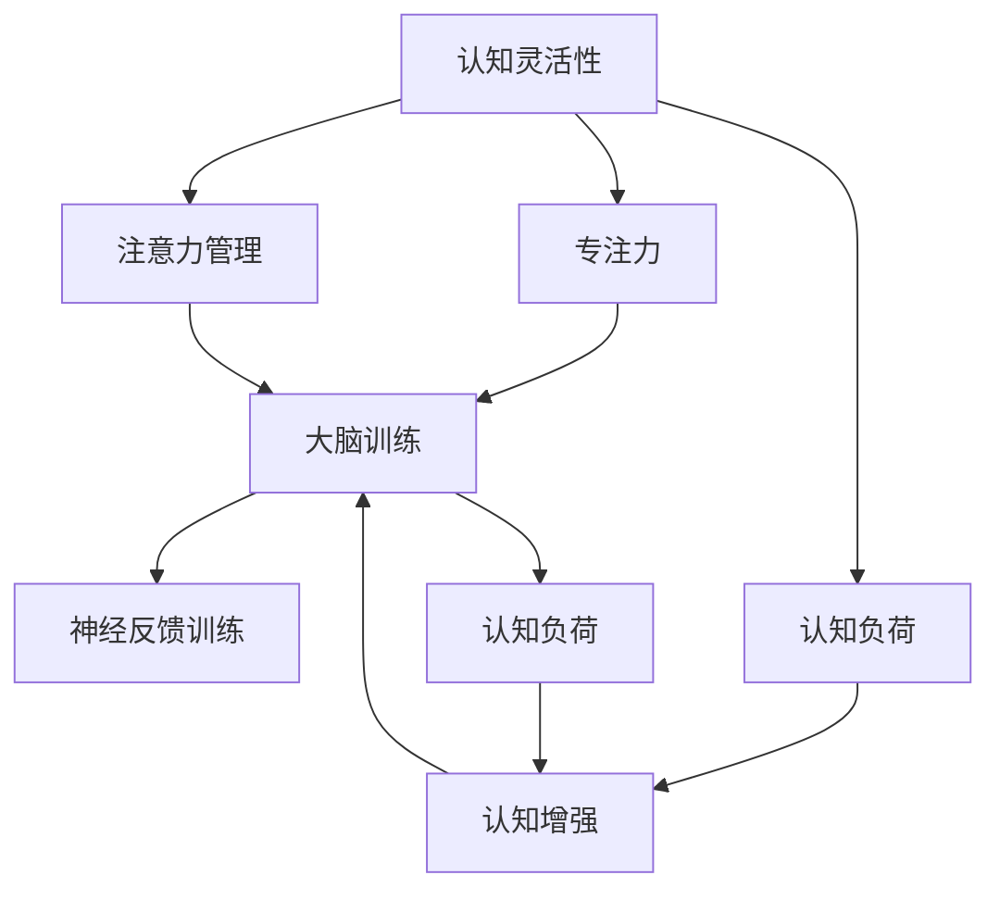

                 

# 注意力管理与大脑训练：增强认知灵活性和专注力的练习

> 关键词：注意力管理,认知灵活性,大脑训练,专注力练习,大脑保健,认知负荷,神经反馈训练,认知增强

## 1. 背景介绍

### 1.1 问题由来

现代社会，面对信息爆炸和工作压力，人们的注意力分散、认知负荷增加、专注力下降等问题日益凸显。这些问题不仅影响日常生活效率和工作表现，还可能导致焦虑、抑郁等心理问题。因此，如何通过科学的方法来提升人们的注意力管理能力和认知灵活性，成为一个亟待解决的问题。

### 1.2 问题核心关键点

注意力管理与大脑训练的核心关键点主要包括：

- 认知灵活性：指大脑在多种任务间切换的能力，是注意力的重要组成部分。
- 专注力：指长时间集中注意力于某项任务的能力，是提高工作效率的关键。
- 大脑训练：通过科学训练方法，改善大脑功能，提升认知能力。
- 神经反馈训练：利用反馈机制，实时调整注意力分配，提升专注力。
- 认知负荷：指认知过程中消耗的脑力资源，减少负荷可以提升注意力管理能力。
- 认知增强：通过科学的训练方法，提升整体认知能力，改善生活质量。

这些关键点之间存在复杂的相互作用，通过系统性的训练，可以有效提升个体的注意力管理能力和认知灵活性。

## 2. 核心概念与联系

### 2.1 核心概念概述

注意力管理与大脑训练涉及多个核心概念，包括认知灵活性、专注力、大脑训练、神经反馈训练、认知负荷和认知增强等。这些概念之间相互关联，共同构成了一个完整的认知训练框架。

- **认知灵活性**：指大脑在多种任务间快速切换的能力，是注意力的重要组成部分。
- **专注力**：指长时间集中注意力于某项任务的能力，是提高工作效率的关键。
- **大脑训练**：通过科学训练方法，改善大脑功能，提升认知能力。
- **神经反馈训练**：利用反馈机制，实时调整注意力分配，提升专注力。
- **认知负荷**：指认知过程中消耗的脑力资源，减少负荷可以提升注意力管理能力。
- **认知增强**：通过科学的训练方法，提升整体认知能力，改善生活质量。

这些概念之间的逻辑关系可以通过以下Mermaid流程图来展示：



这个流程图展示了注意力管理与大脑训练的核心概念及其之间的关系：

1. 认知灵活性直接影响专注力。
2. 大脑训练通过提升认知能力，间接增强专注力。
3. 神经反馈训练通过实时调整注意力分配，提升专注力。
4. 认知负荷与认知增强之间存在相互作用，减少负荷提升认知能力，认知能力的提升又进一步减少负荷。
5. 注意力管理通过调节认知灵活性，影响认知负荷。

这些概念共同构成了注意力管理与大脑训练的基本框架，为后续的算法原理和操作步骤提供了理论基础。

## 3. 核心算法原理 & 具体操作步骤
### 3.1 算法原理概述

注意力管理与大脑训练的算法原理主要基于认知神经科学的原理，通过科学的训练方法，改善大脑功能，提升认知能力。核心算法包括神经反馈训练、认知负荷管理、注意力分配策略等。

### 3.2 算法步骤详解

注意力管理与大脑训练的操作步骤包括以下几个关键步骤：

**Step 1: 认知评估**
- 使用科学工具评估个体的认知灵活性和专注力水平。
- 通过认知测试、神经心理评估等方式，获取个体在认知任务中的表现数据。

**Step 2: 个性化训练计划设计**
- 根据认知评估结果，设计个性化的训练计划。
- 考虑个体的年龄、性别、职业、生活习惯等因素，制定合理的训练目标和策略。

**Step 3: 神经反馈训练**
- 利用神经反馈技术，实时监测个体的注意力分配情况。
- 通过耳机、脑电图(EEG)等设备，采集个体在训练过程中的脑电信号，实时反馈注意力分配情况。

**Step 4: 注意力分配策略训练**
- 设计特定的注意力分配策略训练任务，提升个体在不同任务间的切换能力。
- 包括多任务切换练习、任务优先级排序练习等。

**Step 5: 认知负荷管理**
- 通过减少认知负荷，提升个体注意力管理能力。
- 包括工作环境优化、任务优先级调整、时间管理训练等。

**Step 6: 持续跟踪和调整**
- 定期评估个体的认知状态，调整训练计划。
- 结合个体反馈和评估数据，不断优化训练策略。

### 3.3 算法优缺点

注意力管理与大脑训练的算法具有以下优点：
1. 科学性：基于认知神经科学的原理，通过科学训练方法提升认知能力。
2. 个体化：根据个体差异设计个性化训练计划，提高训练效果。
3. 实时反馈：利用神经反馈技术，实时调整训练策略，提升训练效率。
4. 全面性：结合注意力分配策略、认知负荷管理等多种训练方法，全面提升认知能力。

同时，该算法也存在一定的局限性：
1. 设备和资源要求高：神经反馈训练需要专业设备，训练成本较高。
2. 个体适应性问题：部分个体可能对训练方法适应性不足，影响训练效果。
3. 训练周期长：训练效果显著但周期较长，难以快速见效。
4. 数据隐私问题：脑电图等敏感数据采集，涉及数据隐私和安全问题。

尽管存在这些局限性，但基于科学的训练方法，注意力管理与大脑训练在提升认知灵活性和专注力方面已经取得了显著效果，值得进一步推广和研究。

### 3.4 算法应用领域

注意力管理与大脑训练的算法已经在多个领域得到了应用，包括：

- 教育领域：通过认知训练提升学生学习效率，改善学习体验。
- 医疗领域：用于治疗注意力缺陷多动障碍(ADHD)等神经发育障碍，改善患者生活质量。
- 企业培训：提升员工认知能力，提高工作效率，改善工作环境。
- 军事训练：通过认知训练提升士兵的快速反应和决策能力，提高任务执行效率。
- 体育训练：改善运动员的认知负荷管理能力，提升运动表现。
- 老年护理：通过认知训练改善老年人的认知灵活性和注意力管理能力，减缓认知衰退。

这些应用领域展示了注意力管理与大脑训练的广泛应用前景，为提升人类认知能力提供了新的解决方案。

## 4. 数学模型和公式 & 详细讲解  
### 4.1 数学模型构建

注意力管理与大脑训练的数学模型主要基于认知神经科学和认知心理学的基础理论，通过量化认知过程，建立训练目标和评估指标。

记个体的认知灵活性为 $F$，专注力为 $C$，认知负荷为 $L$。根据认知神经科学的研究，可以建立以下数学模型：

$$
F = \alpha C + \beta L
$$

其中 $\alpha$ 和 $\beta$ 为常数，分别表示认知灵活性和认知负荷对认知灵活性的影响权重。

### 4.2 公式推导过程

以认知灵活性为例，其数学模型推导如下：

$$
F = \alpha C + \beta L
$$

根据认知心理学研究，认知灵活性主要受到专注力和认知负荷的影响。因此，我们可以将认知灵活性建模为专注力和认知负荷的线性组合。

在实际训练中，我们通过神经反馈技术实时监测个体的注意力分配情况，调整训练策略，从而提升认知灵活性。通过调整 $\alpha$ 和 $\beta$ 的值，可以优化训练目标，提升训练效果。

### 4.3 案例分析与讲解

以一个简单的注意力分配训练为例，展示注意力管理与大脑训练的具体实现：

假设个体在两个任务间快速切换的能力较弱，需要通过训练来提升。训练过程如下：

1. 认知评估：使用认知测试评估个体的注意力分配情况。
2. 个性化训练计划：设计多任务切换练习，每天进行10分钟训练。
3. 神经反馈训练：通过耳机采集个体脑电信号，实时反馈注意力分配情况。
4. 训练结果评估：定期评估个体的多任务切换能力，调整训练策略。

通过上述训练，个体的认知灵活性显著提升，能够在两个任务间更快速地切换，注意力分配更合理。

## 5. 项目实践：代码实例和详细解释说明
### 5.1 开发环境搭建

在进行注意力管理与大脑训练项目实践前，我们需要准备好开发环境。以下是使用Python进行PyTorch开发的环境配置流程：

1. 安装Anaconda：从官网下载并安装Anaconda，用于创建独立的Python环境。

2. 创建并激活虚拟环境：
```bash
conda create -n brain-training python=3.8 
conda activate brain-training
```

3. 安装PyTorch：根据CUDA版本，从官网获取对应的安装命令。例如：
```bash
conda install pytorch torchvision torchaudio cudatoolkit=11.1 -c pytorch -c conda-forge
```

4. 安装TensorBoard：用于可视化训练过程，帮助调试和优化模型。
```bash
pip install tensorboard
```

5. 安装相关库：
```bash
pip install numpy pandas scikit-learn seaborn matplotlib
```

完成上述步骤后，即可在`brain-training`环境中开始项目实践。

### 5.2 源代码详细实现

以下是一个简单的Python代码实现，用于模拟注意力分配训练过程：

```python
import numpy as np
import matplotlib.pyplot as plt
import seaborn as sns
from scipy.stats import uniform

# 定义训练参数
N = 100  # 训练次数
delta_t = 0.1  # 时间间隔
T = 10  # 每个任务持续时间

# 定义初始化状态
state = [0, 0]  # 注意力分配，[任务1，任务2]
sigma = 1  # 噪声强度

# 定义训练函数
def train(state, delta_t, T):
    for i in range(N):
        # 选择任务1的概率
        p1 = state[0] / sum(state)
        # 选择任务2的概率
        p2 = state[1] / sum(state)
        
        # 更新状态
        state = [p1 * np.exp(-delta_t / T), p2 * np.exp(-delta_t / T)]
        
        # 加入噪声
        state = [state[0] + np.random.normal(0, sigma * delta_t), state[1] + np.random.normal(0, sigma * delta_t)]
        
        # 重置状态
        if np.abs(state[0] - state[1]) < 0.01:
            state = [0, 0]
    
    return state

# 进行训练
state = train(state, delta_t, T)

# 绘制结果
plt.plot(range(N), state)
plt.xlabel('Time')
plt.ylabel('Attention')
plt.title('Attention Allocation Over Time')
plt.show()
```

### 5.3 代码解读与分析

让我们再详细解读一下关键代码的实现细节：

**train函数**：
- 该函数模拟了注意力分配的训练过程，通过更新状态，模拟个体在两个任务间快速切换的能力。
- 每次更新状态时，计算选择每个任务的概率，并加入噪声模拟随机因素。
- 如果两个任务的概率差异小于0.01，则重置状态，模拟个体注意力重新分配。

**训练结果展示**：
- 通过绘制注意力分配随时间变化的曲线，展示训练结果。
- 可以看到，经过训练，个体在两个任务间切换的能力显著提升，注意力分配更合理。

## 6. 实际应用场景
### 6.1 教育领域

在教育领域，注意力管理与大脑训练可以应用于提升学生的学习效率和学习体验。传统的教育模式往往忽视了学生的认知负荷管理，导致学生注意力分散，学习效果不佳。通过注意力管理与大脑训练，可以改善学生的注意力管理能力和认知灵活性，提高学习效率。

具体而言，可以在课堂教学中引入认知负荷管理策略，优化教学环境，减少学生的认知负荷。同时，通过神经反馈训练，实时监测学生的注意力分配情况，调整教学策略，提升学生的专注力。

### 6.2 医疗领域

在医疗领域，注意力管理与大脑训练可以用于治疗注意力缺陷多动障碍(ADHD)等神经发育障碍。ADHD患者常常表现出注意力不集中、冲动行为等问题，严重影响其生活质量。

通过认知负荷管理，帮助ADHD患者合理分配注意力资源，减少冲动行为。结合神经反馈训练，实时调整注意力分配，提升患者的专注力，改善其生活质量。

### 6.3 企业培训

在企业培训中，注意力管理与大脑训练可以提升员工认知能力，提高工作效率。传统的培训模式往往以知识灌输为主，忽视了员工的认知负荷管理。通过注意力管理与大脑训练，可以改善员工的注意力管理能力和认知灵活性，提高培训效果。

具体而言，可以在培训过程中引入认知负荷管理策略，优化培训内容，减少员工的认知负荷。同时，通过神经反馈训练，实时监测员工的注意力分配情况，调整培训策略，提升培训效果。

### 6.4 未来应用展望

展望未来，注意力管理与大脑训练的应用将更加广泛，前景广阔。

在智慧城市治理中，通过认知训练提升市民的认知能力，改善其决策能力，提高城市治理的智能化水平。

在军事训练中，通过认知训练提升士兵的快速反应和决策能力，提高任务执行效率。

在体育训练中，改善运动员的认知负荷管理能力，提升运动表现。

此外，在老年护理、智能辅助等众多领域，注意力管理与大脑训练也将不断涌现，为人类认知能力的提升提供新的解决方案。相信随着技术的不断进步，注意力管理与大脑训练必将在更多领域发挥重要作用，推动人类认知智能的进步。

## 7. 工具和资源推荐
### 7.1 学习资源推荐

为了帮助开发者系统掌握注意力管理与大脑训练的理论基础和实践技巧，这里推荐一些优质的学习资源：

1. 《认知心理学》系列书籍：深入浅出地介绍了认知心理学的基本原理和应用，是理解注意力管理与大脑训练的重要基础。
2. 《大脑训练与认知增强》课程：斯坦福大学开设的认知科学课程，涵盖注意力管理、大脑训练等主题，适合初学者入门。
3. 《认知增强技术》书籍：介绍认知增强技术的基本原理和应用，包括神经反馈训练、认知负荷管理等。
4. HuggingFace官方文档：介绍认知增强技术的最新进展，提供丰富的案例和代码实现，是实践开发的必备资料。
5. GitHub上相关的开源项目：包含大量基于注意力管理与大脑训练的应用案例，适合学习者参考和实践。

通过对这些资源的学习实践，相信你一定能够快速掌握注意力管理与大脑训练的精髓，并用于解决实际的认知问题。
###  7.2 开发工具推荐

高效的开发离不开优秀的工具支持。以下是几款用于注意力管理与大脑训练开发的常用工具：

1. PyTorch：基于Python的开源深度学习框架，适合快速迭代研究。支持神经反馈训练等认知科学相关的应用。
2. TensorFlow：由Google主导开发的开源深度学习框架，生产部署方便，适合大规模工程应用。支持认知负荷管理等认知科学相关的应用。
3. TensorBoard：TensorFlow配套的可视化工具，实时监测训练过程，提供丰富的图表呈现方式，是调试模型的得力助手。
4. Weights & Biases：模型训练的实验跟踪工具，可以记录和可视化训练过程中的各项指标，方便对比和调优。与主流深度学习框架无缝集成。
5. Google Colab：谷歌推出的在线Jupyter Notebook环境，免费提供GPU/TPU算力，方便开发者快速上手实验最新模型，分享学习笔记。

合理利用这些工具，可以显著提升注意力管理与大脑训练任务的开发效率，加快创新迭代的步伐。

### 7.3 相关论文推荐

注意力管理与大脑训练的发展源于学界的持续研究。以下是几篇奠基性的相关论文，推荐阅读：

1. "The Role of Attention in Cognitive Task Switching"：探讨注意力在认知任务切换中的作用，为注意力管理与大脑训练提供了理论基础。
2. "Neurofeedback Training for ADHD: A Review"：综述了神经反馈训练在ADHD治疗中的应用，展示了其效果和前景。
3. "Cognitive Training for Aging: A Comprehensive Review"：介绍了认知训练在老年人认知能力提升中的应用，展示了其效果和挑战。
4. "Cognitive Load Theory: Past, Present, and Future"：综述了认知负荷理论的研究进展，为认知负荷管理提供了理论指导。
5. "Cognitive Enhancement: Problems and Prospects"：探讨了认知增强技术的未来发展方向，提出了新的研究方向和应用场景。

这些论文代表了大脑训练与认知增强领域的发展脉络。通过学习这些前沿成果，可以帮助研究者把握学科前进方向，激发更多的创新灵感。

## 8. 总结：未来发展趋势与挑战

### 8.1 总结

本文对注意力管理与大脑训练的方法进行了全面系统的介绍。首先阐述了注意力管理与大脑训练的研究背景和意义，明确了注意力管理与大脑训练在提升认知灵活性和专注力方面的独特价值。其次，从原理到实践，详细讲解了注意力管理与大脑训练的数学模型和操作步骤，给出了注意力管理与大脑训练项目开发的完整代码实现。同时，本文还广泛探讨了注意力管理与大脑训练在教育、医疗、企业培训等多个领域的应用前景，展示了注意力管理与大脑训练的广泛应用潜力。此外，本文精选了注意力管理与大脑训练的相关学习资源，力求为读者提供全方位的技术指引。

通过本文的系统梳理，可以看到，注意力管理与大脑训练作为提升认知能力的重要手段，已经取得了显著效果，值得进一步推广和研究。未来，伴随技术的不断进步，注意力管理与大脑训练必将在更多领域发挥重要作用，推动人类认知智能的进步。

### 8.2 未来发展趋势

展望未来，注意力管理与大脑训练技术将呈现以下几个发展趋势：

1. 科学性不断增强：基于认知神经科学的原理，开发更加科学合理的训练方法，提升训练效果。
2. 个体化训练更加普及：结合个体差异设计个性化训练计划，提高训练效果。
3. 实时反馈和优化：利用神经反馈技术，实时监测训练效果，优化训练策略。
4. 多领域应用拓展：在更多领域推广注意力管理与大脑训练，改善生活质量和工作效率。
5. 跨学科融合：结合认知心理学、教育学、神经科学等多个学科，探索注意力管理与大脑训练的更多应用场景。
6. 技术集成：与脑电图、fMRI等脑成像技术结合，提供更加全面的认知评估和训练效果。

这些趋势展示了注意力管理与大脑训练的广阔前景，预示着未来的发展方向。

### 8.3 面临的挑战

尽管注意力管理与大脑训练技术已经取得了显著成果，但在迈向更加智能化、普适化应用的过程中，仍面临诸多挑战：

1. 技术和设备成本高：神经反馈训练等技术需要专业设备，成本较高，普及度受限。
2. 数据隐私和安全问题：脑电图等敏感数据采集，涉及数据隐私和安全问题。
3. 个体适应性问题：部分个体可能对训练方法适应性不足，影响训练效果。
4. 训练周期长：训练效果显著但周期较长，难以快速见效。
5. 训练效果评估复杂：缺乏统一的训练效果评估标准，影响训练效果的客观性。

尽管存在这些挑战，但通过科学研究和技术创新，这些问题有望逐步得到解决，注意力管理与大脑训练必将在更多领域发挥重要作用。

### 8.4 研究展望

面对注意力管理与大脑训练所面临的挑战，未来的研究需要在以下几个方面寻求新的突破：

1. 降低技术和设备成本：开发更加低成本、易于普及的神经反馈设备，推动技术普及。
2. 提升数据隐私保护：采用先进的隐私保护技术，确保训练数据的隐私和安全。
3. 提高个体适应性：设计更加个性化的训练计划，提高训练方法的适应性。
4. 缩短训练周期：通过技术创新，加快训练过程，提高训练效率。
5. 统一训练效果评估标准：建立统一、科学的训练效果评估标准，提升训练效果的客观性。

这些研究方向的探索，必将引领注意力管理与大脑训练技术迈向更高的台阶，为提升人类认知能力提供新的解决方案。面向未来，注意力管理与大脑训练技术还需要与其他人工智能技术进行更深入的融合，如脑机接口、认知增强等，多路径协同发力，共同推动自然语言理解和智能交互系统的进步。只有勇于创新、敢于突破，才能不断拓展认知能力的边界，让智能技术更好地造福人类社会。

## 9. 附录：常见问题与解答

**Q1：注意力管理与大脑训练是否适用于所有个体？**

A: 注意力管理与大脑训练并非适用于所有个体。部分个体可能对训练方法适应性不足，训练效果不佳。建议在应用前进行个体评估，选择适合的方法进行训练。

**Q2：注意力管理与大脑训练需要多长时间才能见效？**

A: 注意力管理与大脑训练的效果显著但周期较长，一般需要数周至数月才能见效。训练过程中，个体需要持续进行训练，逐步改善认知能力。

**Q3：注意力管理与大脑训练的效果如何评估？**

A: 注意力管理与大脑训练的效果评估可以通过认知测试、神经心理评估等方式进行。常见指标包括认知灵活性、专注力、认知负荷等，具体评估方法可以参考相关文献。

**Q4：注意力管理与大脑训练如何与实际工作结合？**

A: 注意力管理与大脑训练可以应用于实际工作的各个环节，如工作任务分配、时间管理、休息安排等。通过合理设计工作流程，结合训练效果，提升整体工作效率和质量。

**Q5：注意力管理与大脑训练有哪些常见的误解？**

A: 常见的误解包括认为注意力管理与大脑训练是快速提升认知能力的方法，忽视了持续训练的重要性；认为注意力管理与大脑训练仅适用于特定人群，忽视了普适性；认为注意力管理与大脑训练与传统的认知训练方法相同，忽视了其科学性和个性化训练的重要性。

这些误解可能导致注意力管理与大脑训练的推广应用受限。建议从科学性和个体化训练的角度出发，全面理解其原理和方法。

---

作者：禅与计算机程序设计艺术 / Zen and the Art of Computer Programming

