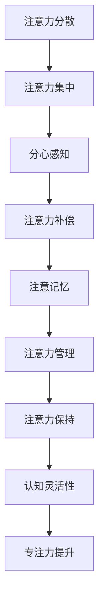

                 

## 1. 背景介绍

在当今快节奏、信息爆炸的时代，注意力管理成为了高效学习和工作不可或缺的能力。然而，注意力容易分散，缺乏有效的管理方法，导致人们常常在处理复杂任务时感到力不从心。因此，开发一套科学合理的注意力管理方法，对提升个人认知灵活性和专注力至关重要。

本文将系统性地探讨注意力管理的核心原理，并详细介绍一系列科学训练方法。通过这些训练，你将学会如何有效地管理你的注意力，提升工作和学习效率，提高认知灵活性和专注力，在繁忙的生活和工作中游刃有余。

## 2. 核心概念与联系

### 2.1 核心概念概述

注意力管理（Attention Management）是指通过科学的训练方法，提升个人在复杂任务处理中的注意力集中度和持久度。其核心目标是通过有针对性的练习，改善大脑神经元的连接方式，强化神经网络中的信息处理效率，从而提升整体认知性能。

### 2.2 核心概念原理和架构的 Mermaid 流程图



**解释：**
- **注意力分散**：指大脑频繁受到外界干扰，导致注意力难以集中。
- **注意力集中**：通过训练，增强大脑神经元之间的连接，提高信息处理的专注度。
- **分心感知**：识别和感知潜在分心的信号，及时调整注意力状态。
- **注意力补偿**：在分心时，通过特定策略恢复注意力，避免任务中断。
- **注意记忆**：将注意力焦点存储在记忆中，以支持长期任务处理。
- **注意力管理**：通过持续练习，形成高效的管理机制。
- **注意力保持**：维持注意力的持久度，避免频繁的中断。
- **认知灵活性**：增强处理多任务时切换注意力的能力。
- **专注力提升**：提高注意力的集中度和持久度，支持长期深度工作。

这些核心概念之间存在着紧密联系，通过科学方法，可以有效提升个人在复杂任务处理中的注意力管理能力。

## 3. 核心算法原理 & 具体操作步骤

### 3.1 算法原理概述

注意力管理的核心在于通过有针对性的训练，提升大脑在处理复杂任务时的注意力集中度和持久度。其基本原理包括以下几个方面：

1. **注意力焦点强化**：通过特定训练方法，增强大脑对注意力焦点的敏感度和集中力。
2. **分心感知提升**：识别并感知分心信号，及时调整注意力状态。
3. **注意力补偿策略**：在分心时，通过特定策略快速恢复注意力。
4. **注意记忆巩固**：通过记忆技巧，将注意力焦点存储在记忆中，以支持长期任务处理。

### 3.2 算法步骤详解

#### 3.2.1 注意力焦点强化训练

**步骤1: 选择注意力焦点**
- 选择一个需要专注的任务或活动，如阅读、写作、编程等。

**步骤2: 设定时间目标**
- 设置每天练习的时长和频率，例如每天10-30分钟。

**步骤3: 集中注意力**
- 选择一个安静的环境，关闭所有干扰因素，如手机通知、社交媒体等。
- 使用番茄工作法（Pomodoro Technique），每25分钟集中注意力工作，休息5分钟。

**步骤4: 记录注意力状态**
- 使用日志记录每次训练的注意力状态，如集中时间、分心原因等。

#### 3.2.2 分心感知提升训练

**步骤1: 识别分心信号**
- 注意观察自身在注意力分散时表现出的行为模式，如频繁看手机、频繁起身等。

**步骤2: 感知分心源头**
- 分析分心的原因，如外部干扰、内部焦虑、疲劳等。

**步骤3: 调整注意力状态**
- 当分心时，及时调整注意力，如深呼吸、短暂冥想、提醒自己回到任务等。

**步骤4: 记录并反思**
- 记录每次分心的情境和调整策略，反思其效果，不断优化调整方法。

#### 3.2.3 注意力补偿策略训练

**步骤1: 准备注意力焦点**
- 选择一个需要专注的任务，明确任务目标。

**步骤2: 设定任务分解**
- 将任务分解为多个小任务，每个小任务设定明确的完成时间。

**步骤3: 时间管理**
- 使用时间管理工具，如GTD（Getting Things Done），管理每日任务。

**步骤4: 灵活调整**
- 当分心时，快速调整任务顺序，优先完成当前小任务，再返回大任务。

#### 3.2.4 注意记忆巩固训练

**步骤1: 记录注意力焦点**
- 每次集中注意力时，记录当前任务和注意力状态。

**步骤2: 使用记忆技巧**
- 使用联想记忆法、故事化记忆法等技巧，巩固注意力焦点。

**步骤3: 定期复习**
- 定期回顾注意力焦点记录，巩固记忆。

### 3.3 算法优缺点

#### 3.3.1 优点

1. **提升专注力**：通过科学训练，有效提升大脑在处理复杂任务时的专注力，支持长时间深度工作。
2. **增强认知灵活性**：通过多任务切换训练，增强大脑在多任务处理中的灵活性和适应性。
3. **提高效率**：有效管理注意力，减少分心和浪费时间，提升整体工作效率。

#### 3.3.2 缺点

1. **训练周期长**：注意力管理需要持续的训练和实践，短期内可能见效不明显。
2. **个体差异**：不同人对于注意力管理的响应不同，需要个性化调整训练方法。
3. **需要毅力**：训练过程可能枯燥，需要持续的毅力和耐心。

### 3.4 算法应用领域

注意力管理技术不仅适用于职场中的高效率工作，也适用于学生的学习和家庭教育。在快速变化的信息时代，对每个人的注意力管理能力都提出了更高的要求。通过科学的注意力管理训练，无论是学生、职场人士还是家长，都能在学习和工作中取得显著的进步和提升。

## 4. 数学模型和公式 & 详细讲解 & 举例说明

### 4.1 数学模型构建

注意力管理的训练模型可以通过神经网络的方式进行建模，其中输入为注意力焦点和分心信号，输出为注意力状态。模型的构建包括以下几个步骤：

1. **输入层**：将注意力焦点和分心信号转换为神经网络可以处理的向量形式。
2. **隐藏层**：设计神经网络结构，进行特征提取和信息处理。
3. **输出层**：根据注意力状态，输出相应的调整策略或任务切换指令。

### 4.2 公式推导过程

以神经网络模型为例，其基本结构包括输入层、隐藏层和输出层。公式如下：

$$
\mathbf{X} = [x_1, x_2, ..., x_n] \in \mathbb{R}^n
$$

$$
\mathbf{W} = [w_{11}, w_{12}, ..., w_{1n}] \in \mathbb{R}^n \times \mathbb{R}^m
$$

$$
\mathbf{b} = [b_1, b_2, ..., b_m] \in \mathbb{R}^m
$$

$$
\mathbf{h} = \tanh(\mathbf{X}\mathbf{W} + \mathbf{b})
$$

$$
\mathbf{Y} = \sigma(\mathbf{h}\mathbf{W} + \mathbf{b})
$$

其中，$\mathbf{X}$ 为输入层向量，$\mathbf{W}$ 为权重矩阵，$\mathbf{b}$ 为偏置向量，$\mathbf{h}$ 为隐藏层输出，$\mathbf{Y}$ 为输出层向量，$\tanh$ 为双曲正切函数，$\sigma$ 为激活函数（如sigmoid函数）。

### 4.3 案例分析与讲解

假设你正在进行一个阅读任务，但在阅读过程中，手机通知不断打扰。通过注意力管理训练，你学会了及时识别分心信号（手机通知），并调整注意力状态（关闭通知）。这个过程可以抽象为以下神经网络模型：

- 输入层：注意力焦点（阅读任务）和分心信号（手机通知）。
- 隐藏层：神经网络对输入进行处理，提取关键特征。
- 输出层：根据注意力状态，输出调整策略（关闭通知）。

## 5. 项目实践：代码实例和详细解释说明

### 5.1 开发环境搭建

在进行注意力管理训练时，需要一定的开发环境和工具支持。以下是搭建开发环境的基本步骤：

1. **安装Python**：下载并安装Python 3.x版本。
2. **安装深度学习框架**：如TensorFlow或PyTorch，可以使用pip安装。
3. **安装神经网络库**：如Keras或MXNet，同样是pip安装。
4. **准备训练数据**：收集注意力焦点和分心信号的数据集，用于训练模型。

### 5.2 源代码详细实现

下面是一个使用PyTorch实现注意力管理训练的示例代码：

```python
import torch
import torch.nn as nn
import torch.optim as optim

class AttentionManager(nn.Module):
    def __init__(self, input_size, hidden_size, output_size):
        super(AttentionManager, self).__init__()
        self.hidden_size = hidden_size
        self.fc1 = nn.Linear(input_size, hidden_size)
        self.fc2 = nn.Linear(hidden_size, output_size)
        self.sigmoid = nn.Sigmoid()

    def forward(self, x):
        x = self.fc1(x)
        x = torch.tanh(x)
        x = self.fc2(x)
        y = self.sigmoid(x)
        return y

# 设置超参数
input_size = 2  # 注意力焦点和分心信号的维度
hidden_size = 10  # 隐藏层的神经元数量
output_size = 2  # 调整策略的维度

# 初始化模型
model = AttentionManager(input_size, hidden_size, output_size)

# 定义损失函数和优化器
criterion = nn.BCELoss()
optimizer = optim.Adam(model.parameters(), lr=0.01)

# 训练数据
X_train = torch.tensor([[0, 0], [0, 1], [1, 0], [1, 1]])
y_train = torch.tensor([[0, 1], [1, 0], [1, 0], [0, 1]])

# 训练模型
for epoch in range(1000):
    optimizer.zero_grad()
    output = model(X_train)
    loss = criterion(output, y_train)
    loss.backward()
    optimizer.step()
    if epoch % 100 == 0:
        print('Epoch: {}, Loss: {}'.format(epoch, loss.item()))
```

### 5.3 代码解读与分析

**代码解析：**
1. **定义模型结构**：使用PyTorch定义了一个简单的神经网络模型，包括一个线性层、一个激活层和一个输出层。
2. **定义损失函数和优化器**：使用了二元交叉熵损失函数和Adam优化器。
3. **训练数据准备**：假设训练数据集中包含四个样本，每个样本有两个特征（注意力焦点和分心信号）和一个输出（调整策略）。
4. **训练模型**：通过不断迭代训练，调整模型参数以最小化损失函数。

## 6. 实际应用场景

### 6.1 智能学习助手

智能学习助手通过个性化推荐，帮助学生和职场人士高效学习和管理任务。通过训练学生在学习过程中的注意力焦点和分心信号，智能学习助手可以提供个性化的学习建议，推荐适合的教材和学习时间，优化学习过程。

### 6.2 职场高效率工作

职场人士常常面临多重任务和外界干扰，注意力管理训练可以帮助他们提升工作效率。通过识别分心信号，及时调整注意力状态，职场人士可以更好地集中精力，提升工作质量和效率。

### 6.3 家庭教育支持

注意力管理训练同样适用于家庭教育。通过帮助家长了解孩子在学习过程中的注意力状态，并提供相应的调整策略，家庭教育可以更加科学和高效。

### 6.4 未来应用展望

随着技术的不断进步，注意力管理训练的应用场景将更加丰富。未来的发展方向包括：

1. **多模态注意力管理**：结合视觉、听觉等多种感官信息，进行综合注意力管理。
2. **实时反馈系统**：利用传感器技术，实时监测用户的注意力状态，提供即时反馈和调整。
3. **个性化推荐系统**：结合用户历史数据和注意力管理训练结果，提供个性化的任务推荐和学习建议。
4. **集成社交网络**：结合社交网络信息，分析用户注意力管理情况，提供相应的社交互动策略。

## 7. 工具和资源推荐

### 7.1 学习资源推荐

1. **《深度学习基础》课程**：斯坦福大学提供的深度学习入门课程，涵盖神经网络的基本原理和应用。
2. **《注意力机制》专题讲座**：讲解注意力机制在深度学习中的应用，适合进阶学习。
3. **《神经网络与深度学习》书籍**：详细介绍了神经网络和深度学习的原理和应用，适合深入学习。

### 7.2 开发工具推荐

1. **Jupyter Notebook**：用于数据处理和模型训练，支持交互式编程。
2. **TensorFlow**：广泛使用的深度学习框架，支持分布式训练和多种模型构建。
3. **PyTorch**：另一个流行的深度学习框架，支持动态图和高效的模型训练。

### 7.3 相关论文推荐

1. **《深度学习中的注意力机制》**：探讨注意力机制在深度学习中的应用，包括Transformer等。
2. **《神经网络中的注意力机制》**：分析注意力机制在神经网络中的作用，及其优化策略。
3. **《注意力管理技术研究》**：综述注意力管理技术的最新进展和应用。

## 8. 总结：未来发展趋势与挑战

### 8.1 研究成果总结

注意力管理技术的发展，主要集中在以下几个方面：

1. **神经网络模型的优化**：通过改进神经网络结构，提升注意力管理的准确性和效率。
2. **数据集的质量提升**：收集更多高质量的注意力焦点和分心信号数据，训练更加准确的模型。
3. **个性化调整策略**：结合用户个性化的需求，设计更合理的注意力管理训练方法。

### 8.2 未来发展趋势

未来的发展趋势包括：

1. **多模态注意力管理**：结合视觉、听觉等多种感官信息，进行综合注意力管理。
2. **实时反馈系统**：利用传感器技术，实时监测用户的注意力状态，提供即时反馈和调整。
3. **个性化推荐系统**：结合用户历史数据和注意力管理训练结果，提供个性化的任务推荐和学习建议。
4. **集成社交网络**：结合社交网络信息，分析用户注意力管理情况，提供相应的社交互动策略。

### 8.3 面临的挑战

尽管注意力管理技术在提升个人注意力管理能力方面取得了显著成果，但仍面临以下挑战：

1. **数据获取困难**：高质量注意力焦点和分心信号数据难以获取，限制了模型的训练效果。
2. **个体差异大**：不同人对注意力管理的响应不同，需要个性化调整训练方法。
3. **模型复杂度高**：神经网络模型复杂度较高，训练和优化难度较大。
4. **应用场景局限**：当前应用场景主要集中在学习和工作场景，对其他场景的适用性还有待进一步研究。

### 8.4 研究展望

未来的研究需要重点解决以下问题：

1. **数据集的多样化**：收集和标注更多不同场景的注意力焦点和分心信号数据，提升模型的泛化能力。
2. **算法的优化**：结合最新的神经网络和深度学习技术，进一步优化注意力管理算法。
3. **应用场景的拓展**：将注意力管理技术应用于更多实际场景，如教育、医疗等。

通过不断探索和优化，注意力管理技术将为提升个人认知灵活性和专注力提供更加科学和有效的方法，帮助人们更好地应对复杂多变的现代生活和工作环境。

## 9. 附录：常见问题与解答

**Q1: 注意力管理训练需要多长时间才能见效？**

A: 注意力管理训练的效果因人而异，通常需要持续训练数周甚至数月才能见效。初期训练可能见效不明显，但长期坚持会逐步提升注意力管理能力。

**Q2: 注意力管理训练对不同任务的效果是否相同？**

A: 注意力管理训练对不同任务的效果可能存在差异，具体效果取决于任务性质和个体差异。例如，阅读和编程任务可能需要的注意力管理策略不同。

**Q3: 注意力管理训练是否需要特殊的训练环境？**

A: 不需要特殊训练环境，但需要一个安静、无干扰的环境进行训练。可以使用番茄工作法等工具辅助训练。

**Q4: 注意力管理训练是否适用于所有人群？**

A: 注意力管理训练对大多数人有效，但需要根据个体差异进行个性化调整。对于特定人群（如注意力缺陷障碍患者），应在医生指导下进行。

**Q5: 注意力管理训练是否可以与其他注意力提升方法结合使用？**

A: 可以与其他注意力提升方法（如冥想、运动等）结合使用，提升注意力管理效果。但需要根据具体情况选择合适的方法。

通过本文的深入探讨，希望你能够对注意力管理技术的原理、操作和应用有更清晰的认识，并开始尝试科学地管理自己的注意力，提升整体认知灵活性和专注力，在复杂多变的现代生活中游刃有余。

作者：禅与计算机程序设计艺术 / Zen and the Art of Computer Programming

