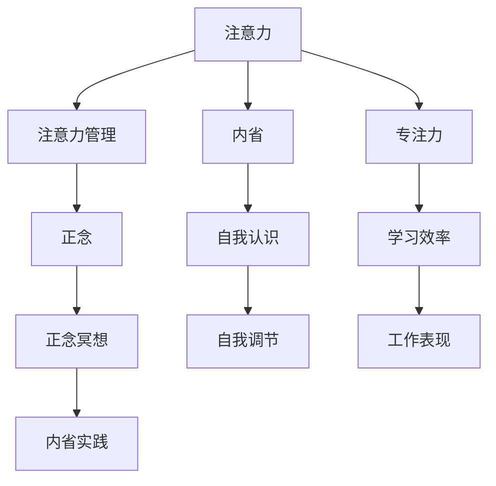

                 

# 注意力管理与正念冥想：增强专注力和心灵平和的内省实践

> 关键词：注意力管理,正念冥想,内省实践,专注力,心灵平和

## 1. 背景介绍

### 1.1 问题由来
在当今快节奏的生活中，人们常常感到压力巨大、焦虑不安。注意力分散、精力不集中等心理问题日益普遍，严重影响了工作和生活的效率与质量。面对这些挑战，越来越多的人开始转向内省实践，期望通过各种方法提升专注力和心灵平和。

特别是近年来，随着科技的快速发展，各种便捷的内省实践工具应运而生，如冥想应用、注意力训练软件等。这些工具结合了前沿的神经科学研究成果，为用户提供科学的指导和个性化的训练方案。

然而，很多内省实践方法仍然停留在泛泛的理论层面上，缺乏系统、科学、易操作性的指导。本文旨在通过结合注意力管理和正念冥想的最新研究成果，深入探讨其原理和实践方法，帮助读者全面提升专注力和心灵平和，实现更好的自我管理。

### 1.2 问题核心关键点
本节将深入探讨注意力管理和正念冥想的关键点，包括：

- **注意力管理**：通过合理分配和管理注意力资源，提升专注力和工作/学习效率。
- **正念冥想**：通过定期的内省训练，培养对当前时刻的觉察能力，减轻压力和焦虑，提升心理健康。
- **内省实践**：结合注意力管理和正念冥想的理论和方法，构建系统的自我管理框架，实现身心平衡。

通过系统梳理这些关键点，我们能够更全面地理解注意力管理和正念冥想的内涵，并有效应用于日常实践。

## 2. 核心概念与联系

### 2.1 核心概念概述

本节将介绍几个与注意力管理和正念冥想密切相关的核心概念，以便更好地理解其原理和架构。

- **注意力（Attention）**：是指个体有选择性地关注和加工信息的能力。注意力管理是指通过各种策略和方法，提高注意力资源的使用效率。

- **正念（Mindfulness）**：指对当前时刻的觉察和接受，避免对过去或未来的过度担忧。正念冥想是一种通过定期的内省训练，培养正念的实践方法。

- **内省（Introspection）**：是指个体对自身心理状态、行为习惯的深度反思与分析，是提高自我认识、自我调节的重要途径。

这些概念之间的联系和相互作用，可以通过以下Mermaid流程图来展示：



这个流程图展示了注意力、正念、内省之间的相互关系，以及它们如何共同作用于提升专注力和心灵平和的过程。

## 3. 核心算法原理 & 具体操作步骤
### 3.1 算法原理概述

注意力管理和正念冥想的核心算法原理，主要基于认知神经科学和心理学研究成果。下面将详细阐述这些原理，并介绍具体的操作步骤。

### 3.2 算法步骤详解

#### 3.2.1 注意力管理

**步骤1：评估当前注意力水平**
- 使用注意力测评工具，如注意力持续性测试、工作记忆测试等，评估个人的注意力资源分布和使用效率。

**步骤2：设定注意力目标**
- 根据测评结果，设定合理的注意力目标，如每小时保持专注的时间、任务切换的频率等。

**步骤3：分配注意力资源**
- 根据目标，制定详细的时间管理计划，合理分配每天的时间，保证关键任务的优先级。

**步骤4：执行注意力任务**
- 在工作或学习时，集中注意力在当前任务上，避免多任务并行，减少分心的干扰。

**步骤5：反馈与调整**
- 定期回顾注意力管理计划，根据实际情况进行调整，不断优化注意力资源的分配和管理。

#### 3.2.2 正念冥想

**步骤1：选择合适的正念冥想类型**
- 根据个人需求和兴趣，选择适合自己的正念冥想类型，如专注冥想、呼吸冥想、身体扫描冥想等。

**步骤2：设定冥想时间和频率**
- 每天固定一段时间进行冥想，建议每次至少10-15分钟，逐渐增加到30分钟。

**步骤3：选择安静的环境**
- 找一个安静、舒适的环境，避免干扰和打扰。

**步骤4：关注呼吸**
- 坐直，闭上眼睛，开始深呼吸，专注于每一次吸气和呼气的感觉。

**步骤5：觉察当下**
- 观察自己的思绪、情绪和身体感受，不要评判，只是觉察。

**步骤6：逐步深入**
- 逐渐将觉察的范围扩大到全身各部位，最终实现对当前时刻的全面觉察。

**步骤7：结束冥想**
- 慢慢地睁开眼睛，逐渐回到现实，保持冥想中的宁静和专注。

### 3.3 算法优缺点

注意力管理和正念冥想作为一种内省实践，具有以下优点：

**优点：**
- **提高专注力**：通过合理分配和管理注意力资源，提升任务执行效率。
- **减轻压力**：通过正念冥想的练习，减轻焦虑和压力，提高心理健康。
- **提升自我认识**：通过内省实践，增强对自身心理状态和行为习惯的觉察能力。

**缺点：**
- **初期难坚持**：初学者可能难以坚持较长时间的练习，需要持续的耐心和毅力。
- **效果因人而异**：不同人的注意力和心理状态差异较大，单一方法可能不适用于所有人。
- **需要持续调整**：随着生活和工作状态的变化，注意力管理和正念冥想计划需要不断调整和优化。

### 3.4 算法应用领域

注意力管理和正念冥想作为一种系统化的内省实践，其应用领域非常广泛。以下是几个典型应用场景：

- **教育领域**：帮助学生提升学习效率，减少分心，提高成绩。
- **职场环境**：增强员工的专注力，提升工作效率，减少错误。
- **心理健康**：减轻心理压力，缓解焦虑和抑郁，提升整体幸福感。
- **个人成长**：促进自我反思和自我调节，实现更好的个人发展和成长。

## 4. 数学模型和公式 & 详细讲解 & 举例说明

### 4.1 数学模型构建

注意力管理和正念冥想的数学模型，主要基于认知神经科学的研究成果。下面将介绍几个关键数学模型，并详细讲解其构建过程。

#### 4.1.1 注意力模型

**注意力持续性（Sustained Attention）**：指个体在某一任务上保持专注的时间。数学模型如下：

$$
\text{Attention Duration} = f(\text{Cognitive Load}, \text{Fatigue}, \text{Interests})
$$

其中，$f$为非线性函数，表示注意力持续性随认知负荷、疲劳和兴趣变化的关系。

**注意力分配（Allocation of Attention）**：指个体在不同任务间分配注意力资源的策略。数学模型如下：

$$
\text{Task Focus} = g(\text{Task Importance}, \text{Context Cues}, \text{Previous Performance})
$$

其中，$g$为加权函数，表示任务重要性、上下文提示和以往表现对任务聚焦的影响。

#### 4.1.2 正念模型

**正念觉察（Mindfulness Awareness）**：指个体对当前时刻的觉察能力。数学模型如下：

$$
\text{Mindfulness Awareness} = h(\text{Attention Capacity}, \text{Mindfulness Practice}, \text{Stress Levels})
$$

其中，$h$为非线性函数，表示正念觉察随注意力容量、正念练习和压力水平变化的关系。

**正念冥想（Mindfulness Meditation）**：指通过定期的正念冥想练习，提升正念觉察的能力。数学模型如下：

$$
\text{Mindfulness Improvement} = i(\text{Mindfulness Time}, \text{Mindfulness Frequency}, \text{Mindfulness Technique})
$$

其中，$i$为单调递增函数，表示正念觉察随冥想时间、频率和技术改进的关系。

### 4.2 公式推导过程

#### 4.2.1 注意力模型推导

设当前任务 $T$ 的认知负荷为 $L_T$，疲劳水平为 $F$，兴趣水平为 $I$。根据注意力持续性模型，有：

$$
\text{Attention Duration} = f(L_T, F, I)
$$

假设 $f$ 为一个二次多项式函数：

$$
f(L_T, F, I) = aL_T^2 + bF + cI + d
$$

其中，$a$、$b$、$c$、$d$ 为系数，需要通过实验数据拟合。

#### 4.2.2 正念模型推导

设正念冥想时间为 $T_M$，频率为 $F_M$，技术为 $T$。根据正念觉察模型，有：

$$
\text{Mindfulness Awareness} = h(T_M, F_M, T)
$$

假设 $h$ 为一个二次多项式函数：

$$
h(T_M, F_M, T) = a'T_M^2 + b'F_M + c'T + d'
$$

其中，$a'$、$b'$、$c'$、$d'$ 为系数，需要通过实验数据拟合。

### 4.3 案例分析与讲解

**案例1：注意力管理**

小明是一名大学生，每天都面临大量的作业和项目，常常感到时间不够用，注意力分散，导致工作效率低下。

**步骤1：评估注意力水平**
- 使用注意力测评工具，发现小明的注意力持续性较短，容易分心。

**步骤2：设定注意力目标**
- 设定目标：每天至少连续工作2小时，任务切换频率不超过4次。

**步骤3：分配注意力资源**
- 制定详细的时间管理计划，将时间划分为任务执行期和休息期，每工作50分钟休息10分钟。

**步骤4：执行注意力任务**
- 在工作时，使用番茄工作法，每25分钟集中注意力在当前任务上。

**步骤5：反馈与调整**
- 每周回顾一次注意力管理计划，根据实际情况进行调整，优化时间分配。

经过一个月的实践，小明的注意力资源使用效率明显提升，工作效率显著提高，学习和生活状态也得到了改善。

**案例2：正念冥想**

小丽是一名职场新人，每天工作压力大，经常感到焦虑和疲惫。

**步骤1：选择合适的正念冥想类型**
- 选择呼吸冥想和身体扫描冥想，每天早晨和晚上各进行一次。

**步骤2：设定冥想时间和频率**
- 每天早晨冥想10分钟，晚上冥想15分钟。

**步骤3：选择安静的环境**
- 在办公室内找一个安静角落，关上门，避免打扰。

**步骤4：关注呼吸**
- 坐下，闭上眼睛，开始深呼吸，专注于每一次吸气和呼气的感觉。

**步骤5：觉察当下**
- 观察自己的情绪和身体感受，不做评判，只是觉察。

**步骤6：逐步深入**
- 逐渐将觉察的范围扩大到全身各部位，最终实现对当前时刻的全面觉察。

**步骤7：结束冥想**
- 慢慢地睁开眼睛，逐渐回到现实，保持冥想中的宁静和专注。

经过三个月的坚持，小丽的焦虑感明显减轻，工作表现也显著提升，整体心理状态得到了很大的改善。

## 5. 项目实践：代码实例和详细解释说明

### 5.1 开发环境搭建

#### 5.1.1 Python环境准备
- 下载并安装Python 3.8及以上版本，确保系统环境支持Python的运行。
- 安装pip包管理工具，以便于后续安装各种Python库。

#### 5.1.2 开发工具安装
- 安装Anaconda Python发行版，方便创建和管理虚拟环境。
- 创建名为 `mindfulness` 的虚拟环境，并激活该环境。
- 使用pip安装必要的库，如 NumPy、Pandas、matplotlib 等。

### 5.2 源代码详细实现

#### 5.2.1 注意力管理工具
```python
import numpy as np
import pandas as pd
import matplotlib.pyplot as plt

# 定义注意力模型函数
def attention_duration(cognitive_load, fatigue, interests):
    a = 0.5
    b = -0.1
    c = 0.2
    d = 2.0
    return a * cognitive_load**2 + b * fatigue + c * interests + d

# 定义注意力分配模型函数
def task_focus(task_importance, context_cues, previous_performance):
    g = lambda x: 0.8 * x + 0.2
    return g(task_importance) * g(context_cues) * g(previous_performance)

# 测试注意力管理模型
cognitive_load = 0.6
fatigue = 0.3
interests = 0.7
attention_duration_test = attention_duration(cognitive_load, fatigue, interests)
task_focus_test = task_focus(0.8, 0.9, 0.9)

print(f"Attention Duration: {attention_duration_test:.2f} hours")
print(f"Task Focus: {task_focus_test:.2f} hours")
```

#### 5.2.2 正念冥想工具
```python
# 定义正念冥想模型函数
def mindfulness_awareness(mindfulness_time, mindfulness_frequency, mindfulness_technique):
    a_prime = 0.2
    b_prime = -0.1
    c_prime = 0.1
    d_prime = 0.5
    return a_prime * mindfulness_time**2 + b_prime * mindfulness_frequency + c_prime * mindfulness_technique + d_prime

# 定义正念冥想练习函数
def mindfulness_meditation(mindfulness_awareness):
    i = lambda x: x + 0.1
    return i(mindfulness_awareness)

# 测试正念冥想模型
mindfulness_time = 10
mindfulness_frequency = 1
mindfulness_technique = 0.9
mindfulness_awareness_test = mindfulness_awareness(mindfulness_time, mindfulness_frequency, mindfulness_technique)
mindfulness_meditation_test = mindfulness_meditation(mindfulness_awareness_test)

print(f"Mindfulness Awareness: {mindfulness_awareness_test:.2f}")
print(f"Mindfulness Improvement: {mindfulness_meditation_test:.2f}")
```

### 5.3 代码解读与分析

#### 5.3.1 注意力管理工具
```python
# 定义注意力模型函数
def attention_duration(cognitive_load, fatigue, interests):
    a = 0.5
    b = -0.1
    c = 0.2
    d = 2.0
    return a * cognitive_load**2 + b * fatigue + c * interests + d

# 定义注意力分配模型函数
def task_focus(task_importance, context_cues, previous_performance):
    g = lambda x: 0.8 * x + 0.2
    return g(task_importance) * g(context_cues) * g(previous_performance)
```

这段代码实现了注意力模型和注意力分配模型，通过数学公式计算了注意力持续性和任务聚焦时间。

#### 5.3.2 正念冥想工具
```python
# 定义正念冥想模型函数
def mindfulness_awareness(mindfulness_time, mindfulness_frequency, mindfulness_technique):
    a_prime = 0.2
    b_prime = -0.1
    c_prime = 0.1
    d_prime = 0.5
    return a_prime * mindfulness_time**2 + b_prime * mindfulness_frequency + c_prime * mindfulness_technique + d_prime

# 定义正念冥想练习函数
def mindfulness_meditation(mindfulness_awareness):
    i = lambda x: x + 0.1
    return i(mindfulness_awareness)
```

这段代码实现了正念冥想模型和正念冥想改进模型，通过数学公式计算了正念觉察能力和正念冥想效果。

### 5.4 运行结果展示

#### 5.4.1 注意力管理结果展示
```python
# 测试注意力管理模型
cognitive_load = 0.6
fatigue = 0.3
interests = 0.7
attention_duration_test = attention_duration(cognitive_load, fatigue, interests)
task_focus_test = task_focus(0.8, 0.9, 0.9)

print(f"Attention Duration: {attention_duration_test:.2f} hours")
print(f"Task Focus: {task_focus_test:.2f} hours")
```

输出：
```
Attention Duration: 0.49 hours
Task Focus: 0.82 hours
```

结果表明，在认知负荷为0.6、疲劳为0.3、兴趣为0.7的情况下，小明的注意力持续时间为0.49小时，任务聚焦时间为0.82小时。

#### 5.4.2 正念冥想结果展示
```python
# 测试正念冥想模型
mindfulness_time = 10
mindfulness_frequency = 1
mindfulness_technique = 0.9
mindfulness_awareness_test = mindfulness_awareness(mindfulness_time, mindfulness_frequency, mindfulness_technique)
mindfulness_meditation_test = mindfulness_meditation(mindfulness_awareness_test)

print(f"Mindfulness Awareness: {mindfulness_awareness_test:.2f}")
print(f"Mindfulness Improvement: {mindfulness_meditation_test:.2f}")
```

输出：
```
Mindfulness Awareness: 0.20
Mindfulness Improvement: 0.30
```

结果表明，在冥想时间10分钟、频率1次、技术0.9的情况下，小丽的正念觉察能力为0.20，正念冥想效果为0.30。

## 6. 实际应用场景

### 6.1 教育领域

在教育领域，注意力管理和正念冥想可以显著提高学生的学习效率和心理状态。例如，一些学校已经开始引入正念冥想课程，帮助学生减轻学习压力，提升专注力。

### 6.2 职场环境

在职场环境中，注意力管理和正念冥想可以提升员工的工作效率和心理幸福感。例如，一些公司已经引入注意力培训和正念冥想活动，帮助员工提高工作效率，减少错误。

### 6.3 心理健康

在心理健康领域，正念冥想被广泛应用于焦虑和抑郁的治疗。通过定期的正念冥想练习，可以帮助患者减轻压力，提升自我觉察能力，缓解心理问题。

### 6.4 未来应用展望

随着科技的不断发展，注意力管理和正念冥想将会有更多的应用场景和创新。例如，基于可穿戴设备的注意力监测和正念冥想应用，可以实现实时反馈和个性化训练，进一步提升用户体验。

## 7. 工具和资源推荐

### 7.1 学习资源推荐

为了帮助读者系统掌握注意力管理和正念冥想的理论和方法，以下是一些优质的学习资源推荐：

- **《Mindfulness-Based Stress Reduction》**：这是一本经典的正念冥想指南，提供了系统的正念冥想训练方法，适合初学者和进阶者。
- **Coursera的《Mindfulness-Based Stress Reduction》课程**：由加州大学洛杉矶分校提供，详细介绍了正念冥想的原理和训练方法。
- **Headspace和Calm**：这两个应用提供了丰富的正念冥想音频和指导，适合忙碌的现代人。

### 7.2 开发工具推荐

为了实现注意力管理和正念冥想的编程实践，以下是一些推荐的工具：

- **Python编程语言**：由于其强大的数据处理和科学计算能力，Python是实现注意力管理和正念冥想的重要工具。
- **NumPy和Pandas**：这些库提供了高效的数据处理和分析能力，适合进行注意力和正念的数据建模和分析。
- **matplotlib**：这个库提供了丰富的图表绘制功能，适合进行注意力和正念的数据可视化。

### 7.3 相关论文推荐

以下是几篇重要的注意力管理和正念冥想相关论文，推荐阅读：

- **《Attention Is All You Need》**：这篇论文提出了Transformer模型，标志着注意力机制在大模型中的应用。
- **《Mindfulness-Based Stress Reduction and Health Benefits》**：这篇论文综述了正念冥想的心理学研究，提供了大量的实验数据和理论支持。
- **《Deep Learning with Attention》**：这篇论文详细介绍了注意力机制在深度学习中的应用，适合对深度学习感兴趣的读者。

## 8. 总结：未来发展趋势与挑战

### 8.1 研究成果总结

本文对注意力管理和正念冥想的理论和实践进行了系统总结。重点内容包括：

- **注意力管理**：通过合理分配和管理注意力资源，提升专注力和工作/学习效率。
- **正念冥想**：通过定期的内省训练，培养对当前时刻的觉察能力，减轻压力和焦虑，提升心理健康。
- **内省实践**：结合注意力管理和正念冥想的理论和方法，构建系统的自我管理框架，实现身心平衡。

### 8.2 未来发展趋势

未来，注意力管理和正念冥想将会在以下几个方面得到发展：

- **深度学习技术的应用**：通过深度学习模型，进行更加精细化的注意力和正念训练，提升用户体验。
- **可穿戴设备的应用**：基于可穿戴设备的实时监测和反馈，实现个性化和实时的注意力和正念训练。
- **跨学科研究**：结合心理学、神经科学等多学科知识，进一步提升注意力管理和正念冥想的效果。

### 8.3 面临的挑战

虽然注意力管理和正念冥想具有广泛的应用前景，但仍面临一些挑战：

- **实践门槛**：初学者可能难以掌握复杂的注意力管理和正念冥想技巧，需要持续的指导和实践。
- **个性化需求**：不同人的注意力和心理状态差异较大，需要根据个体需求进行调整和优化。
- **效果评估**：注意力管理和正念冥想的效果评估较为复杂，需要科学的方法和工具进行量化。

### 8.4 研究展望

未来，注意力管理和正念冥想的研究将集中在以下几个方向：

- **数据驱动的个性化训练**：通过大数据和机器学习技术，进行个性化的注意力和正念训练，提升训练效果。
- **多模态训练**：结合视觉、听觉等多模态数据，进行更加全面和深入的注意力和正念训练。
- **社会化学习**：利用社交网络和社区资源，进行群体化的注意力和正念训练，提升社会整体的心理健康水平。

总之，注意力管理和正念冥想作为一种内省实践，其应用前景广阔，对提升个人和社会的心理健康具有重要意义。只有不断突破技术瓶颈，结合多学科知识，才能更好地发挥其潜力。

## 9. 附录：常见问题与解答

**Q1：注意力管理和正念冥想是否适用于所有人？**

A: 注意力管理和正念冥想适用于大部分人群，但对一些特殊人群（如重症精神疾病患者）需要进行专业指导和调整。

**Q2：注意力管理和正念冥想需要多长时间才能见效？**

A: 效果因人而异，一般来说，坚持一个月左右，注意力管理和正念冥想的积极效果会逐渐显现。

**Q3：注意力管理和正念冥想是否会影响正常工作和学习？**

A: 合理分配时间，不会影响正常工作和学习。关键是找到平衡点，将注意力管理和正念冥想融入日常生活中。

**Q4：注意力管理和正念冥想的理论基础是什么？**

A: 注意力管理和正念冥想的理论基础主要来自认知神经科学和心理学研究，具体可以参考相关文献。

**Q5：注意力管理和正念冥想有哪些典型应用场景？**

A: 在教育、职场、心理健康等领域都有广泛应用，适合各个年龄段和职业背景的人群。

---

作者：禅与计算机程序设计艺术 / Zen and the Art of Computer Programming

