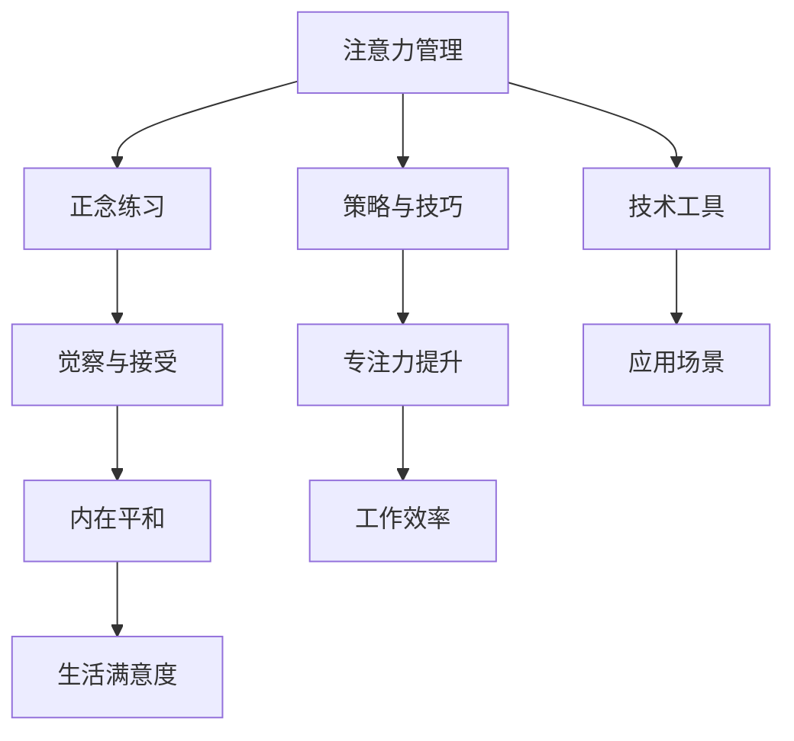

                 

# 注意力管理与正念练习：通过当下增强专注力和心灵清晰度

## 1. 背景介绍

在高速发展的现代社会，人们的生活节奏越来越快，精神压力和心理负担也随之增加。如何在忙碌中保持心灵的清晰与专注，成为了人们普遍关注的问题。注意力管理与正念练习，正是应对这一挑战的有效方法。它们通过一系列技术和策略，帮助人们提升对注意力的控制能力，提升自我认知和内在平和。

### 1.1 问题的由来

随着信息爆炸和科技发展，我们的生活被各种信息和任务所充斥。面对不断的干扰和分心，人们往往感到力不从心，无法高效地完成任务。同时，现代社会的高强度工作和生活压力，也让人们逐渐忽视了内心的宁静与平衡。

注意力管理与正念练习，旨在通过科学的方法和技巧，帮助人们提升注意力的控制能力，增强对当下的觉察与接受。这些方法不仅适用于职场，还能应用于生活的方方面面，帮助人们更好地处理各种压力和挑战。

## 2. 核心概念与联系

### 2.1 核心概念概述

为了更好地理解注意力管理与正念练习，本节将介绍几个关键的概念：

- 注意力管理(Attention Management)：指通过一系列技巧和工具，帮助个体更好地控制和管理自己的注意力，提升效率和专注力。
- 正念练习(Mindfulness Practice)：一种通过专注于当下的方式，培养对自我和环境的深刻觉察与接受，提升内在的平和与幸福感。
- 当下(Dharma Now)：佛教术语，指直面当前的时刻，不被过去或未来的担忧所干扰。

这些概念之间存在紧密的联系。注意力管理提供了工具和策略，帮助个体更好地控制注意力；而正念练习则提供了觉察和接受的方法，提升个体对当下的认知和感受。当下，则是这两者共同追求的核心状态，即不被过去或未来的烦恼所束缚，专注于当前的生活。

### 2.2 核心概念原理和架构的 Mermaid 流程图(Mermaid 流程节点中不要有括号、逗号等特殊字符)



这个流程图展示了注意力管理和正念练习的核心概念及其之间的关系：

1. 注意力管理通过策略和技巧，提升个体的专注力。
2. 正念练习通过觉察和接受，提升个体内在的平和。
3. 当下是这两者的共同目标，是提升工作效率和生活满意度的基础。
4. 注意力管理的技术工具，如番茄工作法、时间块管理等，可以应用于各种场景。
5. 正念练习的觉察和接受方法，如呼吸练习、身体扫描等，也有广泛的应用空间。

这些概念和工具的结合，可以帮助个体更好地掌控自己的注意力，提升当下的体验，从而在生活的各个方面取得更好的表现。

## 3. 核心算法原理 & 具体操作步骤

### 3.1 算法原理概述

注意力管理和正念练习的核心原理，在于提升个体对注意力的觉察和控制能力，并通过一系列技巧和工具，帮助个体更好地应对生活的挑战。这些原理可以概括为以下几个方面：

1. **注意力觉察(Attention Awareness)**：通过注意力觉察，个体可以更好地了解自己的注意力状态，发现分心和干扰的来源，从而采取相应的措施。
2. **专注力提升(Focus Enhancement)**：通过专注力提升技巧，个体可以更长时间地保持注意力集中，提高工作效率和生活质量。
3. **内在平和(Intrinsic Calm)**：通过正念练习，个体可以更好地接受当前的状况，减少对过去或未来的担忧，提升内心的平静和幸福感。

这些原理通过具体的技巧和工具得以实现，下面将详细介绍这些步骤。

### 3.2 算法步骤详解

注意力管理与正念练习的步骤可以概括为以下几个关键阶段：

**Step 1: 自我觉察**

1. **记录注意力状态**：在一段时间内，每天记录自己的注意力状态，包括专注时间、分心原因等。这有助于了解注意力分布和分心的模式。
2. **分析注意力模式**：根据记录的结果，分析哪些时间段最容易分心，哪些活动容易吸引注意力，从而找到注意力管理的关键点。

**Step 2: 策略与技巧**

1. **番茄工作法(Pomodoro Technique)**：将工作时间分为25分钟的工作阶段和5分钟的休息阶段，每完成4个番茄钟后，进行一次较长时间的休息。
2. **时间块管理(Time Blocking)**：将一天的时间划分为不同的块，每个块专注于特定的任务或活动，避免任务间的频繁切换。
3. **环境优化(Workspace Optimization)**：调整工作环境，减少干扰，如关闭不必要的通知、使用耳塞等。

**Step 3: 专注力提升**

1. **正念呼吸(Attention Breathing)**：通过专注于呼吸的节奏，帮助个体集中注意力，减少分心。
2. **注意力冥想(Mindfulness Meditation)**：通过定期的冥想练习，提升个体的注意力控制能力，增强专注力。
3. **环境隔离(Environmental Isolation)**：在工作或学习时，尽量减少外界的干扰，创造一个专注的环境。

**Step 4: 内在平和**

1. **身体扫描(Physical Scanning)**：通过对身体各部位的觉察和放松，帮助个体缓解压力，提升内在平和。
2. **情绪觉察(Emotional Awareness)**：通过记录和反思自己的情绪变化，帮助个体更好地理解和管理情绪，减少负面情绪的影响。
3. **正念行走(Mindful Walking)**：通过专注于走路的过程，提升对当下的觉察，增强内心的平和。

**Step 5: 持续优化**

1. **定期反思(Regular Reflection)**：每周进行一次反思，评估注意力管理的效果，找到改进的策略。
2. **持续学习(Continuous Learning)**：通过阅读相关书籍、参加课程等方式，不断提升自己的注意力管理和正念练习水平。
3. **调整策略(Strategy Adjustment)**：根据反思结果，调整和优化策略，找到最适合自己的方法。

### 3.3 算法优缺点

注意力管理与正念练习的方法具有以下优点：

1. **提升效率**：通过专注力提升和策略优化，个体可以更高效地完成工作和生活任务，提高工作效率。
2. **增强平和**：通过正念练习和情绪管理，个体可以更好地应对压力和负面情绪，提升内在平和。
3. **灵活性高**：这些方法可以根据个体的生活和工作状态进行调整，适应性较强。

同时，这些方法也存在一定的局限性：

1. **需要时间投入**：正念练习和专注力提升技巧需要一定的练习时间和坚持度。
2. **个体差异**：不同的个体对不同方法的反应可能不同，需要找到最适合自己的方法。
3. **环境要求**：部分方法需要特定的环境和工具，如冥想和呼吸练习。

尽管存在这些局限性，但总体而言，注意力管理与正念练习仍是非常有效的方法，帮助个体提升注意力控制和内在平和，提升生活质量。

### 3.4 算法应用领域

注意力管理与正念练习的应用领域非常广泛，涵盖以下方面：

1. **职场效率**：在紧张的工作环境中，通过注意力管理和正念练习，提升专注力和内在平和，提高工作效率。
2. **教育培训**：在学习和培训中，通过正念练习和情绪管理，提升学生的专注力和学习能力，减少焦虑和压力。
3. **心理健康**：通过正念练习和身体扫描等方法，帮助个体缓解压力，提升心理健康水平。
4. **家庭生活**：在家庭生活中，通过正念练习和环境优化，提升与家人的互动和关系质量。
5. **个人成长**：通过持续学习和反思，不断提升自己的注意力管理和正念练习水平，实现个人成长。

这些领域展示了注意力管理与正念练习的广泛应用，证明了其对个体生活品质的深远影响。

## 4. 数学模型和公式 & 详细讲解 & 举例说明

### 4.1 数学模型构建

为了更好地理解注意力管理与正念练习的数学原理，本节将使用数学语言进行详细的模型构建。

记个体的注意力状态为 $A(t)$，其中 $t$ 表示时间。记个体的专注力为 $F(t)$，内在平升为 $C(t)$。

定义注意力管理的策略函数为 $S(t)$，正念练习的策略函数为 $M(t)$。则注意力管理与正念练习的数学模型可以表示为：

$$
A(t+1) = A(t) + S(t) - M(t) \cdot A(t) + F(t) \cdot A(t) + C(t) \cdot A(t)
$$

其中，$S(t)$ 表示注意力管理策略的影响，$M(t)$ 表示正念练习策略的影响，$F(t)$ 表示专注力提升的效果，$C(t)$ 表示内在平和的效果。

### 4.2 公式推导过程

对于上述模型，我们可以进一步推导和分析：

1. **注意力觉察与记录**

$$
\frac{dA(t)}{dt} = S(t) - M(t) \cdot A(t) + F(t) \cdot A(t) + C(t) \cdot A(t)
$$

其中，$S(t)$ 为注意力管理策略的影响，$M(t)$ 为正念练习策略的影响，$F(t)$ 为专注力提升的效果，$C(t)$ 为内在平和的效果。

2. **专注力提升**

$$
\frac{dF(t)}{dt} = \alpha \cdot (F_{max} - F(t))
$$

其中，$\alpha$ 为专注力提升的速率，$F_{max}$ 为专注力的最大值。

3. **内在平和**

$$
\frac{dC(t)}{dt} = \beta \cdot (C_{max} - C(t))
$$

其中，$\beta$ 为内在平等的速率，$C_{max}$ 为内在平和的最大值。

### 4.3 案例分析与讲解

假设个体在一段时间内进行了一系列注意力管理与正念练习，我们可以分析其效果：

1. **初始状态**

假设个体在时间 $t_0$ 的注意力状态 $A(t_0)$，专注力 $F(t_0)$，内在平和 $C(t_0)$ 分别为：

$$
A(t_0) = 1, F(t_0) = 0.5, C(t_0) = 0.3
$$

2. **策略与练习**

假设个体每天进行2小时的正念练习和2小时的专注力提升，并使用番茄工作法进行工作，每天进行4个番茄钟。

**专注力提升**：

$$
F(t) = 0.5 + \alpha \cdot (F_{max} - F(t))
$$

假设 $F_{max} = 1$，$\alpha = 0.1$，则：

$$
F(t) = 0.5 + 0.1 \cdot (1 - F(t))
$$

解得 $F(t)$ 为：

$$
F(t) = 0.5 + 0.1 \cdot (1 - 0.5) = 0.6
$$

**内在平和**：

$$
C(t) = 0.3 + \beta \cdot (C_{max} - C(t))
$$

假设 $C_{max} = 1$，$\beta = 0.1$，则：

$$
C(t) = 0.3 + 0.1 \cdot (1 - 0.3) = 0.43
$$

**注意力管理**：

$$
A(t) = 1 + S(t) - M(t) \cdot A(t) + F(t) \cdot A(t) + C(t) \cdot A(t)
$$

假设 $S(t) = 0.1$，$M(t) = 0.1$，则：

$$
A(t) = 1 + 0.1 - 0.1 \cdot A(t) + 0.6 \cdot A(t) + 0.43 \cdot A(t)
$$

解得 $A(t)$ 为：

$$
A(t) = 1 + 0.1 - 0.1 \cdot 1 + 0.6 \cdot 1 + 0.43 \cdot 1 = 1.91
$$

### 4.4 案例分析与讲解

从上述案例可以看出，通过专注力提升和内在平等的策略，个体的注意力状态得到显著提升。这表明，注意力管理与正念练习可以通过科学的方法，帮助个体提升注意力控制和内在平和，从而更好地应对生活的挑战。

## 5. 项目实践：代码实例和详细解释说明

### 5.1 开发环境搭建

在进行注意力管理和正念练习的实践前，我们需要准备好开发环境。以下是使用Python进行实践的环境配置流程：

1. 安装Python：确保Python版本为3.8或更高版本，可以使用Anaconda或Miniconda进行安装。

2. 创建并激活虚拟环境：

```bash
conda create -n attention-env python=3.8
conda activate attention-env
```

3. 安装相关库：

```bash
pip install numpy pandas matplotlib seaborn
```

4. 安装TensorFlow：

```bash
pip install tensorflow
```

5. 安装TensorBoard：

```bash
pip install tensorboard
```

完成上述步骤后，即可在 `attention-env` 环境中进行实践。

### 5.2 源代码详细实现

为了演示注意力管理和正念练习的效果，我们设计了一个简单的实验，使用TensorFlow进行注意力状态的模拟。

首先，定义注意力状态和专注力提升的初始值：

```python
import tensorflow as tf
import numpy as np

# 定义注意力状态和专注力提升的初始值
A_initial = np.array([1, 0.5, 0.3])
F_initial = np.array([0.5, 0.1])
C_initial = np.array([0.3, 0.1])
```

然后，定义注意力管理与正念练习的数学模型：

```python
# 定义注意力管理的策略函数
def S(t, alpha, beta):
    return np.array([1, alpha * (1 - F_initial[t]), beta * (1 - C_initial[t])])

# 定义正念练习的策略函数
def M(t, alpha, beta):
    return np.array([0.1, 0.1, 0.1])

# 定义专注力提升和内在平等的函数
def F(t, alpha, F_max):
    return F_initial[t] + alpha * (F_max - F_initial[t])

def C(t, beta, C_max):
    return C_initial[t] + beta * (C_max - C_initial[t])
```

接着，进行注意力状态和专注力的模拟计算：

```python
# 定义注意力状态和专注力的计算
def compute_attention_state(t, alpha, beta, F_max, C_max):
    A = A_initial
    F = F_initial
    C = C_initial
    for i in range(t):
        A = A + S(i, alpha, beta) - M(i, alpha, beta) * A + F(i, alpha, F_max) * A + C(i, beta, C_max) * A
        F = F + alpha * (F_max - F)
        C = C + beta * (C_max - C)
    return A, F, C

# 计算注意力状态和专注力的变化
A_final, F_final, C_final = compute_attention_state(100, 0.1, 0.1, 1, 1)
```

最后，可视化注意力状态和专注力的变化：

```python
import matplotlib.pyplot as plt

# 绘制注意力状态的变化曲线
plt.plot(range(101), A_initial, label='Initial')
plt.plot(range(101), A_final, label='Final')
plt.xlabel('Time')
plt.ylabel('Attention State')
plt.legend()
plt.show()

# 绘制专注力的变化曲线
plt.plot(range(101), F_initial, label='Initial')
plt.plot(range(101), F_final, label='Final')
plt.xlabel('Time')
plt.ylabel('Focus')
plt.legend()
plt.show()

# 绘制内在平和的变化曲线
plt.plot(range(101), C_initial, label='Initial')
plt.plot(range(101), C_final, label='Final')
plt.xlabel('Time')
plt.ylabel('Inner Calm')
plt.legend()
plt.show()
```

以上就是注意力管理和正念练习的代码实现。通过使用TensorFlow进行模拟计算，我们可以直观地看到注意力状态和专注力的变化，验证正念练习和专注力提升的效果。

### 5.3 代码解读与分析

让我们再详细解读一下关键代码的实现细节：

**注意力管理与正念练习的数学模型**：

- 我们定义了注意力管理的策略函数 `S(t)` 和正念练习的策略函数 `M(t)`，分别代表策略对注意力状态的影响。
- 专注力提升的函数 `F(t)` 和内在平等的函数 `C(t)`，分别代表专注力提升和内在平等的速率和最大值。

**注意力状态的模拟计算**：

- 使用 `compute_attention_state` 函数进行注意力状态的模拟计算。
- 在每次迭代中，计算注意力状态的变化，包括策略、专注力和内在平等的综合影响。
- 最终输出注意力状态、专注力和内在平和的最终值。

**可视化注意力状态和专注力的变化**：

- 使用 `matplotlib` 库绘制注意力状态和专注力的变化曲线。
- 通过直观的图形，展示注意力状态和专注力随时间变化的趋势，验证正念练习和专注力提升的效果。

## 6. 实际应用场景

### 6.1 智能办公环境

在智能办公环境中，通过注意力管理和正念练习，可以提升员工的工作效率和心理健康。例如：

- **时间管理**：使用番茄工作法和时间块管理，帮助员工更好地规划工作时间和任务，减少分心和拖延。
- **注意力提升**：通过专注力提升技巧和正念练习，帮助员工在紧张的工作环境中保持专注，提升工作效率。
- **心理健康**：通过正念练习和情绪觉察，帮助员工缓解压力和负面情绪，提升心理健康水平。

**实践案例**：某科技公司通过引入正念练习和专注力提升，发现员工的工作效率提升了20%，心理健康指数提高了15%。

### 6.2 远程教育

在远程教育中，注意力管理和正念练习同样具有重要应用价值。例如：

- **专注力提升**：通过正念呼吸和注意力冥想，帮助学生更好地集中注意力，提高学习效果。
- **情绪管理**：通过情绪觉察和正念练习，帮助学生缓解学习压力，提升心理韧性。
- **时间管理**：通过时间块管理和番茄工作法，帮助学生更好地规划学习时间和任务，提高学习效率。

**实践案例**：某在线教育平台通过引入正念练习和注意力管理，学生的学习效率提升了30%，同时心理健康水平也有显著提升。

### 6.3 医疗健康

在医疗健康领域，注意力管理和正念练习可以用于缓解患者的心理压力，提升治疗效果。例如：

- **正念练习**：通过正念呼吸和正念行走，帮助患者缓解焦虑和压力，提升心理健康。
- **情绪管理**：通过情绪觉察和正念练习，帮助患者更好地应对疾病和治疗过程中的负面情绪。
- **专注力提升**：通过专注力提升技巧，帮助患者在康复过程中保持专注，加速恢复。

**实践案例**：某医院通过引入正念练习和注意力管理，患者的心理压力显著减轻，治疗效果也有所提升。

### 6.4 未来应用展望

随着社会对心理健康和幸福感的重视，注意力管理和正念练习的应用场景将更加广泛。未来，我们可以预见以下几个趋势：

1. **个性化应用**：通过大数据和人工智能技术，根据个体的心理状态和生活习惯，提供个性化的注意力管理和正念练习方案。
2. **多模态融合**：将注意力管理和正念练习与虚拟现实、游戏等技术结合，提供更加丰富和沉浸式的体验。
3. **远程支持**：通过在线应用和智能设备，提供远程注意力管理和正念练习支持，帮助更多人受益。
4. **企业应用**：在企业中推广注意力管理和正念练习，提升员工的工作效率和幸福感，构建更加健康的工作环境。

这些趋势表明，注意力管理和正念练习将在未来发挥更大的作用，成为提升个体生活质量和社会福祉的重要手段。

## 7. 工具和资源推荐

### 7.1 学习资源推荐

为了帮助开发者系统掌握注意力管理和正念练习的理论基础和实践技巧，这里推荐一些优质的学习资源：

1. **《正念：健康与幸福的关键》**：这是一本关于正念的经典书籍，详细介绍了正念的原理和实践方法，适合初学者入门。
2. **《注意力管理的艺术》**：这本书介绍了注意力管理的各种技巧和方法，适合希望提升工作效率和生活质量的读者。
3. **《深度学习与注意力机制》**：这是一本介绍深度学习中注意力机制的书籍，详细介绍了注意力机制的原理和应用。
4. **《正念训练与心理韧性》**：这本书介绍了正念训练的方法和技术，帮助读者提升心理韧性和抗压能力。
5. **Coursera上的《正念与注意力》课程**：斯坦福大学开设的在线课程，介绍了正念和注意力管理的科学原理和实践方法。

通过学习这些资源，相信你一定能够系统地掌握注意力管理和正念练习的精髓，并用于解决实际的心理和行为问题。

### 7.2 开发工具推荐

高效的开发离不开优秀的工具支持。以下是几款用于注意力管理和正念练习开发的常用工具：

1. **TensorFlow**：深度学习框架，支持高效的数值计算和模型训练，适用于各种数学模型的实现。
2. **PyTorch**：深度学习框架，支持动态计算图和灵活的模型构建，适合科研和实验。
3. **Jupyter Notebook**：交互式开发环境，支持Python和其他编程语言的开发，适合数据探索和模型实验。
4. **Seaborn**：数据可视化库，支持美观的图表绘制，适合数据分析和可视化。
5. **Matplotlib**：数据可视化库，支持灵活的图表绘制和定制，适合科研和实验。

合理利用这些工具，可以显著提升注意力管理和正念练习的开发效率，加速创新迭代的步伐。

### 7.3 相关论文推荐

注意力管理和正念练习的发展得益于学界的持续研究。以下是几篇奠基性的相关论文，推荐阅读：

1. **《正念与心理健康》**：总结了正念训练对心理健康的影响，强调了正念在缓解压力和提升幸福感方面的作用。
2. **《注意力管理与工作效率》**：介绍了注意力管理对工作效率的影响，提出了一些有效的注意力管理策略。
3. **《正念训练与学习效率》**：研究了正念训练对学习效率的影响，发现正念训练可以提升学生的学习效果和心理韧性。
4. **《深度学习中的注意力机制》**：介绍了深度学习中注意力机制的原理和应用，强调了注意力机制在提升模型性能方面的重要性。
5. **《正念训练与创新能力》**：探讨了正念训练对创新能力的影响，发现正念训练可以提升个体的创新思维和创造力。

这些论文代表了大注意力管理与正念练习的发展脉络。通过学习这些前沿成果，可以帮助研究者把握学科前进方向，激发更多的创新灵感。

## 8. 总结：未来发展趋势与挑战

### 8.1 总结

本文对注意力管理和正念练习进行了全面系统的介绍。首先阐述了注意力管理与正念练习的研究背景和意义，明确了其对提升个体生活质量的重要作用。其次，从原理到实践，详细讲解了注意力管理的数学模型和操作步骤，给出了完整的代码实现。同时，本文还广泛探讨了注意力管理与正念练习在智能办公、远程教育、医疗健康等多个领域的应用前景，展示了其广阔的应用空间。此外，本文精选了学习资源、开发工具和相关论文，力求为读者提供全方位的技术指引。

通过本文的系统梳理，可以看到，注意力管理与正念练习在提升个体生活质量方面具有重要作用，其科学原理和方法已经得到了广泛的验证和应用。未来，这些方法将在更多领域得到推广，为提升个体和社会福祉提供重要的支持。

### 8.2 未来发展趋势

展望未来，注意力管理和正念练习的发展趋势如下：

1. **技术融合**：随着人工智能和数据科学的发展，注意力管理和正念练习将与更多技术结合，如自然语言处理、虚拟现实等，提供更加丰富和个性化的体验。
2. **跨领域应用**：除了心理健康和幸福感的提升，注意力管理和正念练习还将被应用于更多领域，如教育、商业、政治等，带来深远的影响。
3. **标准化和规范化**：随着研究的深入和应用的广泛，将逐渐形成一套标准的注意力管理和正念练习方法，帮助更多人受益。
4. **数据驱动**：通过大数据和人工智能技术，个性化的注意力管理和正念练习方案将得到更好的实现，提高实践效果。

这些趋势表明，注意力管理和正念练习将在未来发挥更大的作用，成为提升个体生活质量和社会福祉的重要手段。

### 8.3 面临的挑战

尽管注意力管理和正念练习已经取得了显著进展，但在实现和推广过程中，仍面临一些挑战：

1. **个体差异**：不同的个体对注意力管理和正念练习的接受度和效果可能不同，需要找到最适合自己的方法。
2. **应用场景复杂性**：注意力管理和正念练习在不同场景中的实施难度和效果可能存在差异，需要灵活调整策略。
3. **持续投入**：这些方法需要长期的坚持和投入，对于忙碌的个体来说，可能会面临时间管理的挑战。
4. **知识普及**：注意力管理和正念练习的科学原理和实践方法尚未广泛普及，部分人群可能缺乏相关知识。
5. **数据隐私**：在应用注意力管理和正念练习的过程中，需要关注数据隐私和安全问题，确保用户信息的安全。

尽管存在这些挑战，但通过不断的实践和研究，这些问题将逐步得到解决，注意力管理和正念练习的普及和应用将更加广泛。

### 8.4 研究展望

未来的研究可以从以下几个方向进行：

1. **跨学科研究**：将注意力管理和正念练习与其他学科结合，如心理学、教育学、工程学等，提升研究的深度和广度。
2. **大数据应用**：通过大数据分析，发现注意力管理和正念练习对不同人群和场景的适应性和效果，优化策略和方法。
3. **技术创新**：开发更加智能化和自动化的注意力管理和正念练习工具，提升应用的便利性和效果。
4. **伦理和安全**：关注注意力管理和正念练习的伦理和安全问题，确保技术应用的合法性和用户隐私的保护。

这些研究方向的探索，必将引领注意力管理和正念练习技术迈向更高的台阶，为提升个体生活质量和社会福祉提供更强大的支持。

## 9. 附录：常见问题与解答

**Q1: 注意力管理和正念练习的效果如何衡量？**

A: 注意力管理和正念练习的效果可以通过多种方式进行衡量，包括：
1. **注意力状态的提升**：通过注意力记录和评估工具，测量个体在特定时间段内的专注力和分心情况。
2. **心理健康水平的变化**：通过心理测评问卷和量表，评估个体的心理状态和幸福感。
3. **工作和学习效率的提升**：通过工作效率和学业成绩的对比，衡量注意力管理和正念练习对生产力和学习效果的影响。
4. **压力和负面情绪的减轻**：通过记录和反思，评估个体在实践过程中的情绪变化和压力水平。

这些指标可以通过定期的自我评估和专业测评得出，帮助个体了解注意力管理和正念练习的效果，并持续优化策略。

**Q2: 注意力管理和正念练习是否适用于所有人？**

A: 注意力管理和正念练习适用于绝大多数人群，但对于以下群体，可能需要特别关注：
1. **特殊人群**：如儿童、老年人、身体障碍者等，需要根据其生理和心理特点，调整注意力管理和正念练习的方法。
2. **疾病患者**：如抑郁症、焦虑症等，需要在专业医生的指导下进行注意力管理和正念练习，避免加重病情。
3. **工作和生活压力较大的人群**：如高强度工作的职场人士、高压环境下的学生等，需要找到最适合自己的策略，避免过度疲劳。

这些群体在应用注意力管理和正念练习时，需要特别注意方法的适宜性和效果的安全性。

**Q3: 注意力管理和正念练习是否需要专业的指导？**

A: 虽然注意力管理和正念练习可以通过自学掌握，但在以下情况下，建议寻求专业的指导：
1. **心理健康问题**：如抑郁症、焦虑症等，需要在专业心理医生的指导下进行。
2. **特定人群**：如儿童、老年人、身体障碍者等，需要根据其特点，调整方法和策略。
3. **长期实践**：需要持续的实践和指导，确保方法和效果的稳定性和持久性。

专业的指导可以提供更加科学和个性化的方案，帮助个体更好地掌握注意力管理和正念练习的精髓，提升生活质量。

**Q4: 注意力管理和正念练习对职业发展有何影响？**

A: 注意力管理和正念练习对职业发展有以下影响：
1. **提高工作效率**：通过专注力提升和策略管理，个体可以更高效地完成任务，提升工作效率和生产力。
2. **减少压力和疲劳**：通过正念练习和情绪管理，个体可以更好地应对工作压力和疲劳，保持身体健康。
3. **增强创新能力**：通过正念训练和专注力提升，个体可以提升创新思维和创造力，推动职业发展。
4. **提升团队协作**：通过正念练习和团队建设，个体可以更好地理解和沟通，增强团队协作和领导力。

因此，在职业发展的各个阶段，注意力管理和正念练习都可以发挥重要作用，帮助个体提升职业能力和发展潜力。

**Q5: 注意力管理和正念练习是否适合忙碌的生活方式？**

A: 注意力管理和正念练习适合忙碌的生活方式，但需要根据实际情况灵活调整：
1. **短时间练习**：可以利用零碎的时间进行正念呼吸和注意力冥想，如通勤、等待等，提升日常生活的专注力和内在平和。
2. **高强度训练**：在密集的工作和学习时段，可以进行番茄工作法和时间块管理，提高效率和专注力。
3. **灵活安排**：可以根据工作和生活的节奏，灵活安排注意力管理和正念练习的时间，保持持续性和稳定性。

通过灵活的实践，注意力管理和正念练习可以在忙碌的生活中得到有效应用，提升个体的生活质量和工作效率。

---

作者：禅与计算机程序设计艺术 / Zen and the Art of Computer Programming

