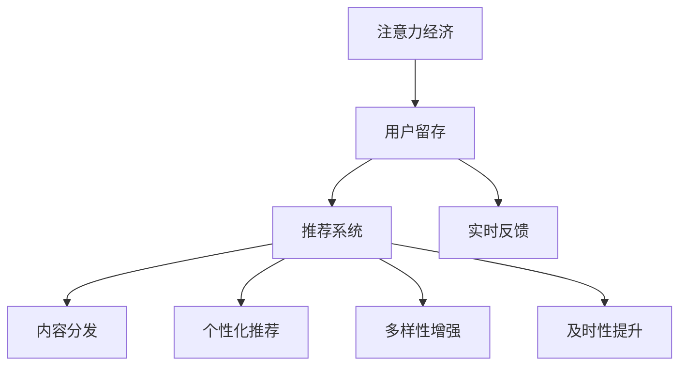

                 

# 注意力经济下的用户留存策略

> 关键词：注意力经济,用户留存,推荐系统,内容分发,个性化推荐

## 1. 背景介绍

在当今互联网时代，信息过载已成为不争的事实。用户在面对海量内容时，很容易被忽略或遗忘，如何有效地吸引和保留用户成为平台关注的重点。这一问题在注意力经济背景下显得尤为突出，因为用户的注意力成为稀缺资源，同时也是平台竞相争夺的对象。

### 1.1 问题由来

随着社交媒体、在线视频、电子商务等平台的迅速发展，用户对内容的需求越来越个性化和多元化。用户不仅希望获取及时、准确的信息，还希望能够与平台建立稳定的关系，形成忠诚的消费习惯。但是，海量内容的涌现使得用户很难主动发现和筛选出最适合自己的内容，导致用户流失率逐年增加。

### 1.2 问题核心关键点

当前，平台普遍采用推荐系统来提升用户留存率。但传统的推荐系统往往是基于用户历史行为进行个性化推荐，忽视了用户当前或未来可能产生的兴趣变化。用户留存问题因此变得更加复杂。

1. **个性化推荐不足**：传统推荐系统只依赖用户历史行为，无法捕捉当前兴趣和未来趋势，导致推荐内容与用户实际需求不符。
2. **多样性不足**：过度个性化往往导致用户接触到的内容单一，限制了用户的认知边界。
3. **及时性不足**：实时性不足，导致用户注意力容易被竞争对手吸引。
4. **个性化不足**：无法根据用户实时反馈进行调整，推荐效果不够精准。

### 1.3 问题研究意义

研究如何构建有效的用户留存策略，对提升平台的用户粘性和忠诚度，具有重要意义。一方面，可以提高用户满意度和平台价值；另一方面，对于平台长期发展和用户口碑建设有着不可忽视的作用。

## 2. 核心概念与联系

### 2.1 核心概念概述

为更好地理解注意力经济下的用户留存策略，本节将介绍几个密切相关的核心概念：

- **注意力经济**：信息时代，用户的注意力成为稀缺资源，平台通过提供优质内容和互动体验，吸引并保持用户关注。
- **用户留存**：通过一系列策略和机制，使用户持续使用平台，减少流失率。
- **推荐系统**：利用用户历史行为和特征，为用户推荐个性化内容，提升用户满意度。
- **内容分发**：根据用户兴趣和行为，动态分发内容，优化用户浏览体验。
- **个性化推荐**：根据用户个体特征和行为偏好，提供差异化的内容推荐。
- **多样性增强**：通过多维度数据分析，提供更加丰富的内容选择，满足用户多样化需求。
- **及时性提升**：通过实时数据分析和互动，及时调整推荐内容，保持用户注意力。
- **实时反馈**：根据用户反馈，快速调整推荐策略，优化推荐效果。

这些概念之间的逻辑关系可以通过以下Mermaid流程图来展示：



这个流程图展示了几大关键概念及其之间的联系：

1. 注意力经济提供平台吸引用户的基础。
2. 用户留存策略是提升用户粘性的核心。
3. 推荐系统和内容分发是实现用户留存的重要手段。
4. 个性化推荐和多样性增强是提升用户满意度的关键。
5. 及时性提升和实时反馈是优化用户体验的关键。

## 3. 核心算法原理 & 具体操作步骤
### 3.1 算法原理概述

在注意力经济下，用户留存策略的核心在于构建高效的推荐系统，通过个性化、多样化和实时化推荐，最大化满足用户需求。推荐系统的目标是预测用户可能感兴趣的内容，并按照一定的顺序进行展示，提升用户满意度，从而提高留存率。

推荐系统通常分为四个步骤：

1. **用户行为建模**：通过收集用户的历史行为数据，构建用户兴趣模型。
2. **内容特征提取**：对推荐内容进行特征提取，形成特征向量。
3. **推荐模型训练**：通过机器学习模型，预测用户对内容的兴趣程度，生成推荐列表。
4. **推荐结果排序**：对推荐列表进行排序，按照一定的顺序展示给用户。

### 3.2 算法步骤详解

接下来，我们详细介绍推荐系统在用户留存策略中的应用，从算法原理到具体操作步骤。

#### 3.2.1 用户行为建模

用户行为建模是推荐系统的第一步，通过分析用户的浏览、点击、购买等行为，构建用户兴趣模型。常见的用户行为建模方法包括：

- **协同过滤**：通过用户历史行为和相似用户行为，推荐相似内容。
- **基于内容的推荐**：根据用户历史浏览和点赞的内容，推荐相关内容。
- **混合推荐**：结合多种推荐算法，提升推荐效果。

#### 3.2.2 内容特征提取

内容特征提取是将推荐内容转化为机器可以理解的特征向量。常见的特征提取方法包括：

- **文本特征提取**：对文章、新闻、视频等文本内容进行TF-IDF、Word2Vec等特征提取。
- **图像特征提取**：对图片内容进行边缘检测、颜色分布等特征提取。
- **音视频特征提取**：对音视频内容进行音频谱图、视频帧等特征提取。

#### 3.2.3 推荐模型训练

推荐模型训练是推荐系统的核心，通过机器学习模型预测用户对内容的兴趣程度。常见的推荐模型包括：

- **协同过滤模型**：基于用户历史行为和相似用户行为，推荐相似内容。
- **基于内容的推荐模型**：通过内容特征向量和用户兴趣模型，推荐相关内容。
- **深度学习模型**：如矩阵分解、深度神经网络等，能够处理高维非线性的推荐问题。

#### 3.2.4 推荐结果排序

推荐结果排序是将推荐列表按照一定顺序展示给用户。常见的排序方法包括：

- **基于用户兴趣的排序**：按照用户对内容的兴趣程度排序。
- **基于内容相关的排序**：按照内容的相关性排序。
- **基于时间相关的排序**：按照内容的时效性排序。

### 3.3 算法优缺点

基于用户行为建模的推荐系统具有以下优点：

1. **效果显著**：通过个性化推荐，显著提升用户满意度和留存率。
2. **算法多样**：结合多种推荐算法，提升推荐效果。
3. **用户粘性高**：通过持续推荐，增强用户粘性。

同时，该方法也存在一些局限性：

1. **数据需求高**：需要大量用户行为数据，获取和存储成本较高。
2. **数据偏差大**：用户历史行为数据可能存在偏差，影响推荐效果。
3. **冷启动问题**：新用户和冷门内容难以推荐。
4. **隐私问题**：用户数据隐私保护问题，需要严格的数据合规和保护措施。

### 3.4 算法应用领域

基于用户行为建模的推荐系统在多个领域得到了广泛应用，例如：

- **电商购物**：通过推荐系统推荐商品，提升用户购买率。
- **新闻阅读**：通过推荐系统推荐新闻，提升用户阅读量和平台流量。
- **视频观看**：通过推荐系统推荐视频，提升用户观看率和平台收益。
- **社交网络**：通过推荐系统推荐好友和内容，提升用户互动和平台粘性。
- **旅游规划**：通过推荐系统推荐旅游目的地和景点，提升用户出行体验和平台用户量。

## 4. 数学模型和公式 & 详细讲解  
### 4.1 数学模型构建

本节将使用数学语言对推荐系统在用户留存策略中的应用进行更加严格的刻画。

记推荐系统中的用户为 $U=\{u_1,u_2,...,u_M\}$，内容为 $I=\{i_1,i_2,...,i_N\}$。假设用户 $u_m$ 对内容 $i_n$ 的兴趣程度为 $r_{mn}$。

定义用户兴趣模型为 $F_u=\{f_u^{(1)},f_u^{(2)},...,f_u^{(K)}\}$，其中 $f_u^{(k)}$ 表示用户 $u_m$ 在 $k$ 维特征空间上的表示。定义内容特征模型为 $F_i=\{i_{mn}^{(1)},i_{mn}^{(2)},...,i_{mn}^{(K)}\}$，其中 $i_{mn}^{(k)}$ 表示内容 $i_n$ 在 $k$ 维特征空间上的表示。

推荐系统的目标是最小化预测误差，即：

$$
\min_{r_{mn}} \sum_{m=1}^M \sum_{n=1}^N (r_{mn} - r_{mn}^*)^2
$$

其中 $r_{mn}^*$ 为模型预测的用户对内容的兴趣程度。

### 4.2 公式推导过程

在推荐系统的训练过程中，通常采用矩阵分解方法。假设用户兴趣模型和内容特征模型分别表示为 $F_u=U^T\Theta$ 和 $F_i=V^TV^T$，其中 $U$ 和 $V$ 分别为用户和内容的特征矩阵，$\Theta$ 为未知矩阵。则用户对内容的兴趣程度 $r_{mn}$ 可以表示为：

$$
r_{mn} = \mathbf{u}_m^T\Theta\mathbf{v}_n
$$

其中 $\mathbf{u}_m$ 和 $\mathbf{v}_n$ 分别为用户 $u_m$ 和内容 $i_n$ 在特征矩阵 $U$ 和 $V$ 中的表示。

假设 $r_{mn}$ 和 $r_{mn}^*$ 的差异可以通过正则化项 $\lambda\|\Theta\|_F^2$ 来控制，则推荐系统的目标函数可以表示为：

$$
\min_{\Theta} \frac{1}{2} \sum_{m=1}^M \sum_{n=1}^N (r_{mn} - r_{mn}^*)^2 + \lambda\|\Theta\|_F^2
$$

通过求解上述最小化问题，可以得到 $\Theta$ 的最优值，进而得到用户对内容的兴趣程度预测。

### 4.3 案例分析与讲解

以电商平台的商品推荐为例，对推荐系统进行详细讲解：

1. **用户行为建模**：收集用户历史浏览、点击、购买等行为数据，构建用户兴趣模型。
2. **内容特征提取**：对商品信息、用户评价等文本内容进行特征提取。
3. **推荐模型训练**：使用矩阵分解模型预测用户对商品的兴趣程度。
4. **推荐结果排序**：根据用户兴趣程度排序，展示推荐商品列表。

## 5. 项目实践：代码实例和详细解释说明
### 5.1 开发环境搭建

在进行推荐系统开发前，我们需要准备好开发环境。以下是使用Python进行Scikit-learn和TensorFlow开发的环境配置流程：

1. 安装Anaconda：从官网下载并安装Anaconda，用于创建独立的Python环境。

2. 创建并激活虚拟环境：
```bash
conda create -n recommendation-env python=3.8 
conda activate recommendation-env
```

3. 安装Scikit-learn和TensorFlow：
```bash
conda install scikit-learn
pip install tensorflow
```

4. 安装各类工具包：
```bash
pip install numpy pandas scikit-learn matplotlib tqdm jupyter notebook ipython
```

完成上述步骤后，即可在`recommendation-env`环境中开始推荐系统实践。

### 5.2 源代码详细实现

下面我们以电商推荐系统为例，给出使用Scikit-learn和TensorFlow进行推荐系统开发的PyTorch代码实现。

首先，定义用户兴趣模型和内容特征模型：

```python
from sklearn.decomposition import TruncatedSVD

# 用户兴趣模型
user_model = TruncatedSVD(n_components=20, random_state=42)
user_model.fit(user_data)

# 内容特征模型
item_model = TruncatedSVD(n_components=20, random_state=42)
item_model.fit(item_data)
```

然后，定义推荐模型并训练：

```python
from tensorflow.keras.layers import Input, Embedding, Dot, Flatten, Dense, Model
from tensorflow.keras.optimizers import Adam

# 定义推荐模型
user_input = Input(shape=(user_model.n_components,))
item_input = Input(shape=(item_model.n_components,))
dot_product = Dot(axes=(1, 1))([user_model.transform(user_input), item_model.transform(item_input)])
recommendation = Flatten()(dot_product)

model = Model(inputs=[user_input, item_input], outputs=recommendation)

# 编译模型
model.compile(optimizer=Adam(lr=0.01), loss='mse')

# 训练模型
model.fit([user_data, item_data], target_data, epochs=10, batch_size=64)
```

最后，定义推荐结果排序：

```python
import numpy as np

# 对推荐结果进行排序
recommendations = model.predict([user_data, item_data])
sorted_indices = np.argsort(recommendations)[::-1]
recommended_items = item_data[sorted_indices]
```

以上就是使用Scikit-learn和TensorFlow对电商推荐系统进行开发的完整代码实现。可以看到，通过结合Scikit-learn和TensorFlow，我们可以高效地构建和训练推荐模型，并在实际应用中进行推荐结果排序。

### 5.3 代码解读与分析

让我们再详细解读一下关键代码的实现细节：

**TruncatedSVD类**：
- `n_components`：表示特征空间的维度。
- `fit`方法：对数据进行特征提取。

**定义推荐模型**：
- `Input`：定义输入层的形状。
- `Embedding`：将用户和内容的特征向量转化为密集向量。
- `Dot`：计算用户和内容的相似度。
- `Flatten`：将相似度向量扁平化。
- `Dense`：输出推荐结果。

**模型编译和训练**：
- `compile`方法：定义优化器和学习率。
- `fit`方法：进行模型训练。

**推荐结果排序**：
- `predict`方法：对推荐结果进行预测。
- `argsort`方法：对预测结果进行排序。
- `item_data`：获取推荐的商品信息。

可以看到，通过Scikit-learn和TensorFlow的组合，推荐系统的开发变得简洁高效。开发者可以将更多精力放在数据处理、模型改进等高层逻辑上，而不必过多关注底层的实现细节。

当然，工业级的系统实现还需考虑更多因素，如模型的保存和部署、超参数的自动搜索、更灵活的任务适配层等。但核心的推荐范式基本与此类似。

## 6. 实际应用场景
### 6.1 智能推荐系统

基于用户行为建模的推荐系统，可以广泛应用于智能推荐系统的构建。推荐系统能够根据用户历史行为和实时兴趣，动态推荐个性化内容，满足用户多样化需求。

在技术实现上，可以收集用户浏览、点击、购买等行为数据，构建用户兴趣模型。结合内容特征提取和推荐模型训练，动态生成推荐列表。推荐系统能够实时调整推荐内容，提升用户满意度和留存率。

### 6.2 金融交易系统

金融交易系统中的推荐系统，可以帮助用户发现潜在的投资机会，提升交易决策的准确性。通过收集用户的历史交易记录和实时操作数据，构建用户兴趣模型。结合内容特征提取和推荐模型训练，动态推荐股票、基金、债券等金融产品。推荐系统能够实时调整推荐内容，帮助用户发现投资价值，提高交易决策的准确性和用户满意度。

### 6.3 新闻聚合平台

新闻聚合平台中的推荐系统，可以帮助用户发现感兴趣的新闻内容，提升阅读体验。通过收集用户的浏览、点击、收藏等行为数据，构建用户兴趣模型。结合内容特征提取和推荐模型训练，动态推荐新闻文章。推荐系统能够实时调整推荐内容，满足用户多样化需求，提升平台流量和用户粘性。

### 6.4 视频流平台

视频流平台中的推荐系统，可以帮助用户发现感兴趣的视频内容，提升观看体验。通过收集用户的观看、点赞、评论等行为数据，构建用户兴趣模型。结合内容特征提取和推荐模型训练，动态推荐视频内容。推荐系统能够实时调整推荐内容，满足用户多样化需求，提升平台观看率和用户满意度。

## 7. 工具和资源推荐
### 7.1 学习资源推荐

为了帮助开发者系统掌握推荐系统的理论和实践，这里推荐一些优质的学习资源：

1. 《推荐系统实战》书籍：介绍了推荐系统从理论到实践的各个方面，包括协同过滤、深度学习等主流算法。
2. 《大规模推荐系统：原理与实践》课程：斯坦福大学开设的推荐系统课程，介绍了推荐系统的基本概念和算法。
3. Kaggle竞赛：参与Kaggle推荐系统竞赛，实践推荐算法的优化和调优。
4. GitHub开源项目：例如recsys开源项目，提供了推荐系统框架和样例代码，方便学习和实践。
5. 博客和论文：如RecSys Conference的论文集，展示最新的推荐系统研究成果和算法创新。

通过对这些资源的学习实践，相信你一定能够快速掌握推荐系统的精髓，并用于解决实际的推荐问题。
###  7.2 开发工具推荐

高效的开发离不开优秀的工具支持。以下是几款用于推荐系统开发的常用工具：

1. Scikit-learn：基于Python的开源机器学习库，简单易用，适合快速迭代研究。
2. TensorFlow：由Google主导开发的开源深度学习框架，生产部署方便，适合大规模工程应用。
3. PyTorch：基于Python的开源深度学习框架，灵活高效，适合研究者和开发者。
4. Weights & Biases：模型训练的实验跟踪工具，可以记录和可视化模型训练过程中的各项指标，方便对比和调优。
5. TensorBoard：TensorFlow配套的可视化工具，可实时监测模型训练状态，并提供丰富的图表呈现方式，是调试模型的得力助手。
6. Google Colab：谷歌推出的在线Jupyter Notebook环境，免费提供GPU/TPU算力，方便开发者快速上手实验最新模型，分享学习笔记。

合理利用这些工具，可以显著提升推荐系统的开发效率，加快创新迭代的步伐。

### 7.3 相关论文推荐

推荐系统的发展源于学界的持续研究。以下是几篇奠基性的相关论文，推荐阅读：

1. "Collaborative Filtering for Implicit Feedback Datasets"：引入了协同过滤算法，解决了推荐系统中的冷启动问题。
2. "BPR: Bayesian Personalized Ranking from Log-by-Log Data"：提出了基于贝叶斯方法的个人化排序算法，提升了推荐效果。
3. "Neural Collaborative Filtering"：引入了深度神经网络，解决了推荐系统中的数据稀疏性和非线性问题。
4. "Matrix Factorization Techniques for Recommender Systems"：系统介绍了矩阵分解算法，用于推荐系统的特征提取和模型训练。
5. "A Tutorial on Matrix Factorization Methods for Predictive Modeling"：系统介绍了矩阵分解算法的理论基础和实际应用。

这些论文代表了大规模推荐系统的演进脉络。通过学习这些前沿成果，可以帮助研究者把握学科前进方向，激发更多的创新灵感。

## 8. 总结：未来发展趋势与挑战
### 8.1 总结

本文对基于用户行为建模的推荐系统进行了全面系统的介绍。首先阐述了推荐系统在用户留存策略中的应用背景和意义，明确了推荐系统在提升用户粘性和留存率方面的独特价值。其次，从算法原理到具体操作步骤，详细讲解了推荐系统的数学模型和实现细节，给出了推荐系统开发的完整代码实例。同时，本文还广泛探讨了推荐系统在智能推荐、金融交易、新闻聚合、视频流平台等多个领域的应用前景，展示了推荐系统的广泛应用场景。

通过本文的系统梳理，可以看到，基于用户行为建模的推荐系统正在成为平台用户留存的重要手段，极大地提升了用户体验和平台价值。未来，伴随推荐算法和技术的不断演进，推荐系统必将在更多领域得到应用，为各行业的数字化转型提供新的技术路径。

### 8.2 未来发展趋势

展望未来，推荐系统将呈现以下几个发展趋势：

1. **个性化推荐**：通过更深层次的用户建模和内容理解，提供更加精准的个性化推荐，提升用户满意度。
2. **多样性增强**：通过多维度数据分析，提供更加丰富的内容选择，满足用户多样化需求。
3. **实时性提升**：通过实时数据分析和互动，及时调整推荐内容，保持用户注意力。
4. **实时反馈**：根据用户反馈，快速调整推荐策略，优化推荐效果。
5. **深度学习应用**：引入深度学习模型，提升推荐系统的准确性和泛化能力。
6. **跨领域推荐**：将推荐系统应用于不同领域，如医疗、金融、教育等，提供定制化服务。

以上趋势凸显了大规模推荐系统的广阔前景。这些方向的探索发展，必将进一步提升推荐系统的性能和应用范围，为各行业的数字化转型提供新的技术路径。

### 8.3 面临的挑战

尽管大规模推荐系统取得了显著进展，但在迈向更加智能化、普适化应用的过程中，它仍面临着诸多挑战：

1. **数据质量问题**：推荐系统的质量很大程度上依赖于数据的质量和完整性，数据采集和处理成本较高。
2. **数据隐私问题**：用户数据的隐私保护问题，需要严格的数据合规和保护措施。
3. **冷启动问题**：新用户和冷门内容难以推荐，推荐系统需要不断优化冷启动策略。
4. **算法复杂度**：深度学习模型和复杂算法导致推荐系统计算成本较高，需要优化模型结构。
5. **实时性问题**：实时推荐系统的扩展性和稳定性需要进一步提升，保证实时性和性能。

### 8.4 研究展望

面对推荐系统面临的这些挑战，未来的研究需要在以下几个方面寻求新的突破：

1. **深度学习优化**：通过优化深度学习模型的结构，提升推荐系统的性能和效率。
2. **数据质量提升**：通过数据清洗和增强技术，提高数据质量和完整性。
3. **冷启动问题解决**：通过协同过滤、混合推荐等方法，解决新用户和冷门内容推荐问题。
4. **隐私保护优化**：通过匿名化、差分隐私等技术，保护用户数据隐私。
5. **实时性提升**：通过分布式计算和缓存技术，提升推荐系统的实时性和稳定性。

这些研究方向的探索，必将引领推荐系统技术迈向更高的台阶，为各行业的数字化转型提供更加智能、高效、安全的解决方案。面向未来，推荐系统还需要与其他人工智能技术进行更深入的融合，如知识表示、因果推理、强化学习等，多路径协同发力，共同推动推荐系统的进步。

## 9. 附录：常见问题与解答
**Q1：推荐系统如何处理冷启动问题？**

A: 冷启动问题是推荐系统面临的重要挑战之一，主要指新用户和冷门内容的推荐。推荐系统通常通过以下方法解决冷启动问题：

1. **协同过滤**：利用用户历史行为和相似用户行为，推荐相似内容。
2. **基于内容的推荐**：通过内容特征向量，推荐相关内容。
3. **混合推荐**：结合多种推荐算法，提升推荐效果。

**Q2：推荐系统如何应对实时性要求？**

A: 推荐系统需要实时调整推荐内容，保持用户注意力。为此，推荐系统通常采用以下方法应对实时性要求：

1. **实时数据采集**：通过实时采集用户行为数据，更新用户兴趣模型。
2. **流式处理**：采用流式处理技术，实时处理用户行为数据，更新推荐结果。
3. **缓存技术**：通过缓存技术，减少实时处理负担，提升系统响应速度。

**Q3：推荐系统如何保护用户隐私？**

A: 推荐系统需要保护用户隐私，防止用户数据泄露和滥用。为此，推荐系统通常采用以下方法保护用户隐私：

1. **匿名化处理**：对用户数据进行匿名化处理，去除个人身份信息。
2. **差分隐私**：通过加入噪声，保护用户数据隐私。
3. **数据加密**：对用户数据进行加密处理，防止数据泄露。

这些方法能够有效保护用户隐私，提升推荐系统的可信度和用户满意度。

**Q4：推荐系统如何应对数据质量问题？**

A: 推荐系统的质量很大程度上依赖于数据的质量和完整性，因此数据采集和处理是推荐系统的重要环节。推荐系统通常通过以下方法应对数据质量问题：

1. **数据清洗**：通过数据清洗技术，去除噪音和异常值，提高数据质量。
2. **数据增强**：通过数据增强技术，扩充数据量，提高数据完整性。
3. **数据校验**：通过数据校验技术，检测数据错误和异常。

通过这些方法，可以提升数据质量和完整性，从而提高推荐系统的准确性和鲁棒性。

**Q5：推荐系统如何应对算法复杂度问题？**

A: 推荐系统需要优化深度学习模型的结构，提升推荐系统的性能和效率。为此，推荐系统通常采用以下方法应对算法复杂度问题：

1. **模型压缩**：通过模型压缩技术，减少模型参数量，提高推理速度。
2. **特征降维**：通过特征降维技术，减少特征维度，提升模型训练速度。
3. **分布式计算**：通过分布式计算技术，提高模型训练效率。

这些方法能够有效应对算法复杂度问题，提升推荐系统的性能和效率。

总之，推荐系统需要不断优化数据质量、隐私保护、冷启动、实时性和算法复杂度等方面，才能满足用户需求，提升用户体验和平台价值。

