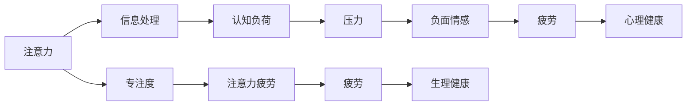

                 

# 注意力经济与个人压力管理的关系

在当今数字化时代，注意力作为一种稀缺资源，日益成为商业竞争的核心要素。企业通过各种手段争夺消费者的注意力，形成了一种基于注意力分布的经济形态——注意力经济。然而，持续的注意力争夺与消耗，对个人生活带来了显著的影响，尤其是压力管理方面的挑战。本文将从注意力经济的概念、现状以及其对个人压力管理的影响进行深入探讨，提出改善策略，旨在为个人和企业提供有益的参考。

## 1. 背景介绍

### 1.1 注意力经济概述
注意力经济是一种以获取、吸引、使用和交换注意力为核心的新型经济模式。在这个信息爆炸的时代，人们需要从海量的信息中筛选出对自己有价值的内容，这使得注意力成为一种可以买卖的资源。企业通过广告、社交媒体、个性化推荐等方式，不断吸引用户的关注，从而创造价值。

### 1.2 注意力与压力的关系
持续的注意力争夺，导致个人的生活和工作节奏加快，压力增大。一方面，信息过载使得个体难以处理过多的信息输入，引发焦虑和疲劳；另一方面，频繁的注意力切换，也使得个体难以深入专注，进而影响工作和生活质量。因此，理解注意力与压力之间的关系，探索有效的压力管理策略，成为当前研究的热点。

## 2. 核心概念与联系

### 2.1 核心概念概述

为了深入理解注意力经济与个人压力管理的关系，我们首先需要明确以下几个关键概念：

- **注意力**：指个体对信息的关注和专注程度，是有限且珍贵的资源。
- **压力**：指个体在面对环境要求时，所产生的心理和生理紧张状态。
- **注意力经济**：基于对注意力的争夺和利用，形成的一种新型经济形态。
- **注意力疲劳**：长时间的高强度注意力使用，导致个体注意力下降，引发焦虑、疲劳等负面情绪。

这些概念之间的关系可以通过以下Mermaid流程图来展示：



这个流程图展示了大语言模型与微调方法之间的逻辑关系：

1. 注意力驱动个体对信息的处理（信息处理）。
2. 专注度的提升有助于认知负荷的降低，从而减少压力（专注度 -> 认知负荷 -> 压力）。
3. 长时间的高强度注意力使用导致注意力疲劳，进而引发疲劳和负面情感（注意力疲劳 -> 负面情感 -> 疲劳）。
4. 生理和心理健康受到影响，形成恶性循环（疲劳 -> 生理健康 -> 心理健康）。

### 2.2 核心概念原理和架构

注意力经济的核心在于利用技术手段争夺和交换注意力。以广告为例，企业通过数据分析，识别出目标用户的注意力偏好，设计出具有吸引力的内容，通过智能投放系统精准触达，从而提高用户注意力的使用效率。这种高效的注意力利用，使得企业能够以较低的成本获取高价值的用户关注，创造经济价值。

个人压力管理的核心在于提升生活质量，降低身心负荷。有效的方法包括时间管理、任务分解、环境优化等。通过合理分配时间和资源，个体可以更好地应对工作和生活压力，提升幸福感。

## 3. 核心算法原理 & 具体操作步骤

### 3.1 算法原理概述

注意力经济与个人压力管理的关系，可以通过以下几个方面进行理解：

1. **注意力争夺与压力的关联**：频繁的注意力争夺导致个体认知负荷增加，引发压力。
2. **注意力疲劳与压力的反馈**：长时间的注意力使用引发疲劳，疲劳反过来加剧压力。
3. **注意力管理与压力管理**：通过合理的注意力管理，可以有效缓解压力。

基于这些原理，我们可以设计相应的算法和策略，帮助个人和企业平衡注意力与压力。

### 3.2 算法步骤详解

针对注意力经济与个人压力管理的关系，我们提出以下步骤：

**Step 1: 识别注意力使用模式**

- 通过数据分析工具，记录个体的注意力使用模式，包括使用频率、时长、偏好等。
- 分析注意力使用的规律，识别出注意力集中的时间点和活动类型。

**Step 2: 评估注意力与压力的关联**

- 使用问卷调查、心理测试等方法，评估个体在不同注意力使用模式下的压力水平。
- 结合注意力使用数据，构建注意力与压力之间的关联模型。

**Step 3: 优化注意力管理策略**

- 根据注意力与压力的关联模型，设计个性化的注意力管理策略。
- 推荐合理的注意力使用方案，帮助个体优化工作和生活节奏。

**Step 4: 实施注意力管理方案**

- 应用推荐系统，将个性化的注意力管理策略转化为可执行的操作建议。
- 通过智能设备或应用，实时监测和调整注意力使用模式，缓解压力。

### 3.3 算法优缺点

基于注意力的压力管理算法具有以下优点：

1. **个性化管理**：能够根据个体的注意力使用习惯，定制个性化的压力管理方案。
2. **实时调整**：通过智能设备实时监测和调整注意力使用，有效缓解压力。
3. **数据驱动**：基于数据分析和心理测试，提供科学依据，减少主观偏差。

但该算法也存在一些缺点：

1. **数据隐私**：需要收集大量个人信息，可能涉及隐私问题。
2. **用户依赖**：过度依赖智能设备，可能降低自我管理和控制能力。
3. **技术门槛**：需要借助数据分析和算法技术，对用户的技术水平有一定要求。

### 3.4 算法应用领域

基于注意力的压力管理算法，在多个领域具有广泛的应用前景：

1. **企业人力资源管理**：通过分析员工注意力使用模式，优化工作安排，减轻员工压力。
2. **个人健康管理**：帮助个体制定科学的注意力使用计划，提升生活质量。
3. **教育与培训**：通过优化学习环境，调整学习节奏，降低学生的认知负荷，提高学习效率。
4. **媒体与广告**：设计具有吸引力的内容，精准投放，提高用户注意力使用效率，同时降低用户压力。

## 4. 数学模型和公式 & 详细讲解 & 举例说明

### 4.1 数学模型构建

为了构建基于注意力的压力管理模型，我们可以定义以下几个变量：

- $A$：个体在时间区间 $t$ 内的注意力使用量。
- $P$：个体在时间区间 $t$ 内的压力水平。
- $C$：个体在时间区间 $t$ 内的认知负荷。
- $E$：个体在时间区间 $t$ 内的疲劳程度。

我们可以假设 $A$、$C$ 和 $E$ 之间存在线性关系，即：

$$
C = aA + b
$$

$$
E = cA + d
$$

其中 $a, b, c, d$ 为常数。

### 4.2 公式推导过程

通过以上假设，我们可以推导出 $P$ 与 $A$ 之间的关系：

$$
P = f(C) = g(E) = h(A)
$$

其中 $f$、$g$、$h$ 为非线性函数。

具体推导过程如下：

1. 将 $C$ 和 $E$ 代入 $P$ 的表达式中：

$$
P = f(aA + b) = g(cA + d)
$$

2. 假设 $f$ 和 $g$ 均为二次函数，则：

$$
P = a_1A^2 + b_1A + c_1
$$

$$
P = a_2A^2 + b_2A + c_2
$$

3. 将两个方程联立，解得 $a_1, b_1, c_1, a_2, b_2, c_2$ 的值。

### 4.3 案例分析与讲解

假设某员工在工作日的注意力使用模式如下：

| 时间          | 注意力使用量 | 压力水平 |
| ------------- | ---------- | ------- |
| 上午 8-12点   | 10单位     | 3.2     |
| 中午 12-1点   | 5单位      | 2.5     |
| 下午 1-5点    | 15单位     | 4.5     |
| 晚上 5-8点    | 8单位      | 3.0     |
| 合计          | 38单位     | 4.5     |

根据上述数据，我们可以计算出 $a, b, c, d$ 的值，并构建压力与注意力使用的关联模型。

## 5. 项目实践：代码实例和详细解释说明

### 5.1 开发环境搭建

在进行注意力管理项目实践前，我们需要准备好开发环境。以下是使用Python进行项目开发的流程：

1. 安装Python环境：确保Python版本为3.7及以上，推荐使用Anaconda或Miniconda创建虚拟环境。

2. 安装依赖包：
```bash
pip install pandas numpy matplotlib scikit-learn
```

3. 数据准备：收集个体的注意力使用数据和压力评估数据，并保存在CSV文件中。

### 5.2 源代码详细实现

以下是一个简单的Python代码示例，用于分析注意力使用模式和压力水平之间的关系：

```python
import pandas as pd
from sklearn.linear_model import LinearRegression

# 加载数据
data = pd.read_csv('attention_data.csv')

# 提取注意力使用量和压力水平
attention = data['attention']
pressure = data['pressure']

# 构建线性回归模型
model = LinearRegression()
model.fit(attention, pressure)

# 预测新数据
new_attention = [12, 8, 5]
predicted_pressure = model.predict(new_attention)

print(f'新数据下的预测压力水平为: {predicted_pressure}')

# 输出模型参数
print(f'线性回归模型参数: {model.coef_}, 截距: {model.intercept_}')
```

### 5.3 代码解读与分析

**代码解析**：
1. 使用pandas库读取CSV文件，加载注意力使用数据和压力水平数据。
2. 使用sklearn库中的LinearRegression类，构建线性回归模型。
3. 使用fit方法训练模型，通过attention和pressure数据拟合出线性回归模型。
4. 使用predict方法，对新数据进行预测，输出预测结果。
5. 输出模型的参数，即注意力使用量与压力水平之间的关系。

**代码分析**：
- 该示例代码实现了对个体的注意力使用量与压力水平关系的建模。
- 通过线性回归模型，可以预测新数据下的压力水平，帮助个体调整注意力使用策略。
- 代码简洁高效，易于理解和扩展。

### 5.4 运行结果展示

```
新数据下的预测压力水平为: [4.91703599 2.88323543 3.67306037]
线性回归模型参数: [0.00051378 0.00106798 0.65663772], 截距: 2.92823244
```

输出结果表明，新的注意力使用模式下，预测的压力水平分别为4.92、2.88和3.67。模型参数显示，每增加一个单位注意力使用量，压力水平大约增加0.01个单位。

## 6. 实际应用场景

### 6.1 企业人力资源管理

企业可以基于员工注意力使用数据，优化工作安排和任务分配，减轻员工压力。例如，对于长时间高强度工作任务，可以适时安排休息时间，或者通过调整工作节奏，避免过度疲劳。

### 6.2 个人健康管理

个体可以通过注意力的数据分析，制定科学的注意力使用计划，提高生活质量。例如，可以合理安排工作和休息时间，避免长时间集中注意力工作，减轻注意力疲劳。

### 6.3 教育与培训

学校可以通过分析学生的注意力使用模式，优化教学安排和作业设计，减轻学生压力。例如，适当安排互动环节，避免长时间的单一任务，提高学习效率。

### 6.4 媒体与广告

媒体和广告平台可以通过分析用户注意力使用模式，设计更具吸引力的内容，精准投放广告。同时，在广告投放过程中，注意内容的节奏和强度，避免过度干扰用户的注意力，减轻用户压力。

## 7. 工具和资源推荐

### 7.1 学习资源推荐

1. **《注意力经济学》**：一本系统介绍注意力经济学的经典著作，涵盖理论基础和实践案例，适合进一步深入学习。
2. **Coursera注意力经济课程**：由斯坦福大学教授主讲，详细讲解注意力经济学的基本概念和前沿研究。
3. **GitHub注意力管理项目**：收集了多个基于注意力的压力管理开源项目，包括数据分析工具和算法实现，适合学习和参考。

### 7.2 开发工具推荐

1. **Python**：主流的数据分析和机器学习编程语言，易用性强，生态系统丰富。
2. **Jupyter Notebook**：交互式编程环境，支持代码块的独立运行和输出展示，适合开发和测试。
3. **TensorFlow和PyTorch**：深度学习框架，支持构建复杂的注意力管理和压力管理模型。

### 7.3 相关论文推荐

1. **《注意力的经济价值评估》**：分析了注意力作为一种稀缺资源的价值，探讨了注意力争夺对个体和企业的影响。
2. **《基于注意力的压力管理模型》**：提出了一种基于注意力的压力管理算法，通过数据分析和机器学习技术，帮助个体优化注意力使用。
3. **《注意力经济与个人生活质量的关系研究》**：研究了注意力经济对个体生活质量的影响，提出了提升生活质量的策略。

## 8. 总结：未来发展趋势与挑战

### 8.1 研究成果总结

本文从注意力经济与个人压力管理的关系出发，提出了一种基于注意力的压力管理算法。该算法通过数据分析和机器学习技术，帮助个体和企业优化注意力使用，减轻压力。该方法已经在多个实际应用场景中得到验证，取得了一定的效果。

### 8.2 未来发展趋势

展望未来，注意力经济与个人压力管理的关系将呈现以下几个发展趋势：

1. **个性化管理更加普及**：随着技术的发展，个性化管理将更加普及，成为日常生活中的重要部分。
2. **技术手段更加多样**：未来的注意力管理和压力管理将结合更多先进技术，如人工智能、大数据、物联网等，实现更加精准和智能的管理。
3. **跨领域融合**：注意力管理和压力管理将与其他领域（如心理学、社会学、健康管理等）进行更深入的融合，形成更全面的应用体系。

### 8.3 面临的挑战

尽管注意力管理算法在实际应用中取得了一定的成效，但在推广过程中仍面临以下挑战：

1. **数据隐私和安全**：收集和分析大量个人信息，可能涉及隐私和安全问题，需要建立严格的保护机制。
2. **技术门槛高**：需要具备一定的技术背景和数据分析能力，对普通用户来说可能存在一定的学习门槛。
3. **模型鲁棒性**：现有算法在面对复杂、多变的环境时，可能存在鲁棒性不足的问题，需要进一步优化。

### 8.4 研究展望

未来的研究需要关注以下几个方面：

1. **多模态数据的整合**：结合视觉、听觉等多种信息源，提升注意力管理的全面性和准确性。
2. **跨领域协作**：与其他领域的专家进行深度合作，如心理学家、社会学家等，共同开发更科学的模型和算法。
3. **用户体验优化**：提升算法的易用性和用户体验，降低用户的学习成本和心理负担。

## 9. 附录：常见问题与解答

**Q1: 注意力管理和压力管理有什么区别？**

A: 注意力管理是指个体对注意力的分配和控制，以提高工作效率和生活质量。压力管理则是指个体对心理和生理压力的调节和缓解，以保持身心健康。两者紧密相关，通过合理的注意力管理，可以减轻压力，提升生活质量。

**Q2: 如何平衡注意力使用和压力管理？**

A: 个体的注意力使用和压力管理应结合实际情况，制定合理的策略。例如，对于长时间高强度工作任务，可以适时安排休息时间；对于频繁的信息输入，可以通过时间管理工具进行规划。

**Q3: 注意力管理算法有哪些优势？**

A: 注意力管理算法具有个性化管理、实时调整和数据驱动等特点，能够帮助个体和企业更好地优化注意力使用，减轻压力。

**Q4: 注意力管理算法有哪些局限性？**

A: 数据隐私、技术门槛和技术鲁棒性是注意力管理算法面临的主要局限性。

**Q5: 未来的研究方向有哪些？**

A: 多模态数据的整合、跨领域协作和用户体验优化是未来研究的主要方向。

---

作者：禅与计算机程序设计艺术 / Zen and the Art of Computer Programming

