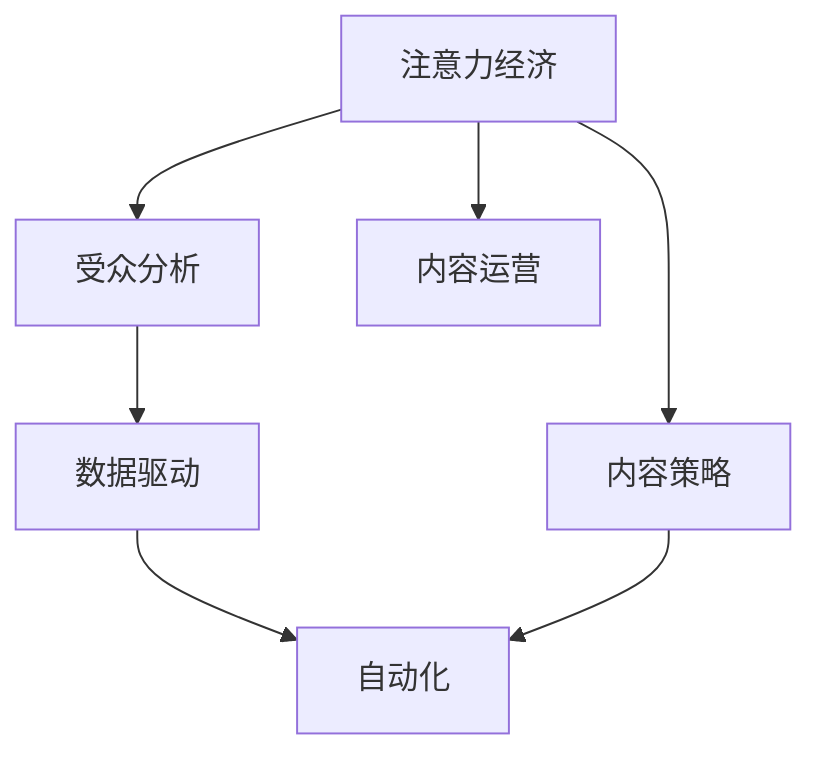

                 

# 注意力经济与内容策略规划与实施：为受众创建有影响力的内容

> 关键词：注意力经济,内容策略,受众分析,数据驱动,自动化,内容运营

## 1. 背景介绍

### 1.1 问题由来

在互联网信息爆炸的时代，内容无处不在，用户注意力也变得愈发稀缺。如何有效地吸引并保持受众的注意力，成为内容生产者和运营者面临的巨大挑战。注意力经济应运而生，通过分析用户的注意力行为和偏好，合理规划和实施内容策略，达到提升用户参与度和转化率的目的。

### 1.2 问题核心关键点

注意力经济的核心在于精准识别并满足用户需求，通过数据分析和技术手段优化内容展现方式和用户体验。它要求我们：

- 理解用户的注意力分布和偏好，定位合适的用户群体。
- 利用数据驱动的方法，实时调整内容策略，提高转化率。
- 采用自动化和智能推荐技术，提升内容的个性化和效率。
- 注重用户反馈，持续迭代优化内容。

### 1.3 问题研究意义

理解并实施注意力经济策略，对于提升内容质量和运营效率，降低成本，具有重要的理论意义和现实意义：

1. **提高用户体验**：通过精准推送和个性化展示，提升用户满意度和忠诚度。
2. **优化资源配置**：集中精力于高价值用户，实现更有效的资源利用。
3. **增强竞争力**：在激烈的市场竞争中，依靠优质的内容和精准的用户洞察获得优势。
4. **驱动增长**：通过精准营销和个性化服务，提升用户转化率和复购率。
5. **拓展应用场景**：将注意力经济应用于不同垂直领域，创造新的商业机会。

## 2. 核心概念与联系

### 2.1 核心概念概述

为更好地理解注意力经济的实现机制，本节将介绍几个关键概念及其相互关系：

- **注意力经济**：通过精准识别和满足用户注意力需求，提升用户参与度和转化率的经济模型。
- **内容策略**：根据用户行为和市场趋势，制定和调整内容生产、分发和评估的策略。
- **受众分析**：通过数据分析技术，识别用户的兴趣、行为和需求，细分用户群体。
- **数据驱动**：依托于大数据和机器学习技术，实时获取用户反馈，驱动内容策略的优化。
- **自动化**：利用算法和工具实现内容生成、分发和评估的自动化。
- **内容运营**：通过多渠道的内容管理和用户互动，实现内容策略的有效执行。

这些概念之间的逻辑关系可以通过以下Mermaid流程图来展示：



这个流程图展示了注意力经济的核心概念及其相互关系：

1. 注意力经济通过内容策略，精准识别并满足用户需求。
2. 受众分析提供用户群体划分和行为分析，辅助内容策略的制定。
3. 数据驱动基于用户行为数据，实时优化内容策略。
4. 自动化技术提升内容生成、分发和评估的效率。
5. 内容运营确保内容策略的实施和用户互动。

这些概念共同构成了注意力经济的完整框架，帮助我们理解如何利用技术和数据驱动内容运营。

## 3. 核心算法原理 & 具体操作步骤
### 3.1 算法原理概述

注意力经济的核心算法原理是基于用户行为数据的分析与处理，实现内容的精准推送和个性化展示。它主要包括以下几个步骤：

1. **用户行为数据采集**：收集用户在平台上的浏览、点击、购买等行为数据。
2. **用户兴趣模型构建**：通过聚类、分类等机器学习技术，构建用户兴趣模型。
3. **内容推荐系统构建**：利用协同过滤、基于内容的推荐等算法，构建推荐系统。
4. **内容优化调整**：根据用户反馈和行为数据，实时调整内容策略。
5. **自动化工具集成**：集成自动化工具，实现内容生成、分发和评估的自动化。

### 3.2 算法步骤详解

#### 3.2.1 用户行为数据采集

用户行为数据采集是注意力经济的基础，一般通过以下方式进行：

1. **日志记录**：在平台中集成日志记录工具，自动记录用户操作行为，如浏览页面、点击链接、评论互动等。
2. **数据集成**：将用户行为数据集成到统一的数据仓库中，便于后续分析和处理。
3. **数据清洗**：处理数据缺失、异常值等问题，确保数据质量。

#### 3.2.2 用户兴趣模型构建

用户兴趣模型的构建是注意力经济的关键，通常使用以下方法：

1. **聚类算法**：如K-means、GMM等，将用户划分为不同兴趣群体。
2. **分类算法**：如决策树、随机森林等，预测用户行为标签。
3. **协同过滤**：基于用户行为和物品评分，推荐相似用户可能喜欢的物品。
4. **深度学习**：如LSTM、RNN等，挖掘用户行为序列中的潜在兴趣。

#### 3.2.3 内容推荐系统构建

内容推荐系统是实现个性化展示的核心，主要包括以下步骤：

1. **特征提取**：提取物品和用户的特征，如标题、标签、评分等。
2. **推荐算法**：如协同过滤、基于内容的推荐、矩阵分解等，生成推荐列表。
3. **实时调整**：根据用户反馈和行为数据，实时更新推荐模型，提高推荐效果。

#### 3.2.4 内容优化调整

内容优化调整是提升内容效果的重要手段，通常包括以下步骤：

1. **A/B测试**：通过多组实验对比，选择效果最优的内容策略。
2. **用户反馈分析**：利用自然语言处理技术，分析用户评论和评分，了解用户需求。
3. **内容生成优化**：根据用户反馈，优化内容生成流程，提高内容质量。
4. **内容分发优化**：调整内容分发渠道和时机，提高内容曝光率和互动率。

#### 3.2.5 自动化工具集成

自动化工具集成是提高运营效率的关键，一般使用以下工具：

1. **内容管理系统**：如WordPress、Drupal等，管理内容生成、发布和备份。
2. **推荐引擎**：如Amazon Personalize、Algolia等，提供实时推荐服务。
3. **数据分析平台**：如Google Analytics、Adobe Analytics等，分析用户行为数据。
4. **自动化测试工具**：如Selenium、Appium等，自动化测试内容发布流程。

### 3.3 算法优缺点

注意力经济算法具有以下优点：

1. **提高用户参与度**：通过个性化推荐和精准推送，提升用户互动和满意度。
2. **优化资源配置**：集中资源服务于高价值用户，提高营销效率。
3. **提升转化率**：精准推荐内容和促销活动，提高用户转化率。
4. **增强用户忠诚度**：个性化的内容和服务，增强用户粘性和忠诚度。

同时，这些算法也存在以下局限性：

1. **隐私问题**：大规模数据收集和处理可能涉及用户隐私，需严格遵守数据保护法规。
2. **数据质量**：用户行为数据的准确性和完整性影响算法效果。
3. **算法复杂性**：复杂的推荐算法需要较高的计算资源和数据存储。
4. **用户习惯变化**：用户偏好和行为变化较快，需持续调整算法。
5. **内容多样性**：不同类型的用户对内容的偏好差异较大，需灵活应对。

### 3.4 算法应用领域

注意力经济算法在多个领域都有广泛应用，以下是几个典型案例：

- **电商推荐系统**：如亚马逊、淘宝等，通过推荐算法提升商品销售转化率。
- **社交媒体平台**：如Facebook、Twitter等，通过个性化内容提升用户粘性和互动。
- **新闻内容平台**：如今日头条、腾讯新闻等，通过内容推荐提升用户阅读量。
- **视频流媒体平台**：如Netflix、YouTube等，通过个性化推荐提高用户观看时长。

除了上述这些典型应用外，注意力经济还应用于内容营销、广告投放、品牌推广等多个领域，为各行业带来了新的增长点。

## 4. 数学模型和公式 & 详细讲解 & 举例说明
### 4.1 数学模型构建

注意力经济的核心数学模型包括用户兴趣模型和推荐算法模型。本节将详细讲解这些模型及其构建过程。

#### 4.1.1 用户兴趣模型

用户兴趣模型通常通过以下数学公式表示：

$$
\theta = \arg\min_{\theta} L(\theta) \text{ s.t. } \text{constraints}
$$

其中，$\theta$ 为用户兴趣参数，$L(\theta)$ 为损失函数，$\text{constraints}$ 为约束条件。

#### 4.1.2 推荐算法模型

推荐算法模型通常使用协同过滤和矩阵分解等方法，其数学模型如下：

1. **协同过滤模型**：

$$
\hat{y}_{i,j} = \hat{y}_{i}^T X_j
$$

其中，$\hat{y}_i$ 为用户$i$的兴趣向量，$X_j$ 为物品$j$的特征向量，$\hat{y}_{i,j}$ 为用户$i$对物品$j$的预测评分。

2. **矩阵分解模型**：

$$
\hat{Y} = \mathbb{X} \mathbb{W}^T
$$

其中，$\mathbb{X}$ 为用户-物品评分矩阵，$\mathbb{W}$ 为用户兴趣矩阵。

### 4.2 公式推导过程

#### 4.2.1 用户兴趣模型推导

用户兴趣模型的构建主要通过聚类和分类等算法实现，其推导过程如下：

1. **K-means算法**：

$$
\min_{\mu_k, \theta_k} \sum_{i=1}^{N} \min_{k=1,...,K} ||x_i - \mu_k||^2
$$

其中，$\mu_k$ 为聚类中心，$\theta_k$ 为聚类标签，$x_i$ 为用户行为数据，$K$ 为聚类数目。

2. **决策树算法**：

$$
\min_{T} \sum_{i=1}^{N} \sum_{j=1}^{C} I(x_i \in S_j) \log \frac{1}{N} \sum_{i=1}^{N} I(x_i \in S_j)
$$

其中，$T$ 为决策树模型，$S_j$ 为决策树节点，$I$ 为示性函数。

#### 4.2.2 推荐算法模型推导

推荐算法模型的构建主要通过协同过滤和矩阵分解等方法实现，其推导过程如下：

1. **协同过滤模型**：

$$
\hat{y}_{i,j} = \hat{y}_{i}^T X_j
$$

其中，$\hat{y}_i$ 为用户$i$的兴趣向量，$X_j$ 为物品$j$的特征向量，$\hat{y}_{i,j}$ 为用户$i$对物品$j$的预测评分。

2. **矩阵分解模型**：

$$
\hat{Y} = \mathbb{X} \mathbb{W}^T
$$

其中，$\mathbb{X}$ 为用户-物品评分矩阵，$\mathbb{W}$ 为用户兴趣矩阵。

### 4.3 案例分析与讲解

#### 4.3.1 电商推荐系统

电商推荐系统通过用户行为数据，构建用户兴趣模型，并使用协同过滤算法推荐商品。以下是一个具体案例：

1. **用户行为数据采集**：
   - 通过平台日志记录用户购买、浏览、评分等行为数据。
   - 集成到统一的数据仓库中，进行清洗和处理。

2. **用户兴趣模型构建**：
   - 使用K-means算法将用户划分为不同兴趣群体。
   - 使用决策树模型预测用户行为标签，如“喜欢运动”、“喜欢美妆”等。

3. **内容推荐系统构建**：
   - 提取商品标题、描述、评分等特征。
   - 使用协同过滤算法生成推荐列表，如“你可能喜欢以下商品”。

4. **内容优化调整**：
   - 通过A/B测试，选择最优推荐策略。
   - 分析用户反馈，优化商品推荐算法。

5. **自动化工具集成**：
   - 集成内容管理系统，管理商品信息和推荐结果。
   - 使用推荐引擎，实时更新推荐列表。

#### 4.3.2 社交媒体平台

社交媒体平台通过用户行为数据，构建用户兴趣模型，并使用基于内容的推荐算法推荐内容。以下是一个具体案例：

1. **用户行为数据采集**：
   - 通过平台日志记录用户点赞、评论、分享等行为数据。
   - 集成到统一的数据仓库中，进行清洗和处理。

2. **用户兴趣模型构建**：
   - 使用协同过滤算法，推荐用户可能感兴趣的内容。
   - 使用深度学习模型，挖掘用户行为序列中的潜在兴趣。

3. **内容推荐系统构建**：
   - 提取文章标题、摘要、标签等特征。
   - 使用基于内容的推荐算法，生成个性化内容推荐列表。

4. **内容优化调整**：
   - 通过A/B测试，选择最优推荐策略。
   - 分析用户反馈，优化内容生成和分发。

5. **自动化工具集成**：
   - 集成内容管理系统，管理文章信息和推荐结果。
   - 使用推荐引擎，实时更新推荐列表。

## 5. 项目实践：代码实例和详细解释说明
### 5.1 开发环境搭建

在进行注意力经济项目实践前，我们需要准备好开发环境。以下是使用Python进行项目开发的环境配置流程：

1. 安装Anaconda：从官网下载并安装Anaconda，用于创建独立的Python环境。

2. 创建并激活虚拟环境：
```bash
conda create -n attention-env python=3.8 
conda activate attention-env
```

3. 安装必要的Python包：
```bash
pip install pandas numpy matplotlib scikit-learn
```

4. 安装相关的数据处理和分析工具：
```bash
pip install sparkpyairflow
```

5. 安装自动化工具：
```bash
pip install pytest pytest-xdist pytest-html
```

完成上述步骤后，即可在`attention-env`环境中开始项目实践。

### 5.2 源代码详细实现

这里我们以电商推荐系统为例，给出使用Python和PyTorch实现注意力经济的完整代码。

#### 5.2.1 数据处理

```python
import pandas as pd
from sklearn.preprocessing import LabelEncoder
from sklearn.cluster import KMeans
from sklearn.ensemble import DecisionTreeClassifier

# 读取数据
data = pd.read_csv('user_behavior.csv')

# 数据清洗
data = data.dropna()

# 特征提取
X = data[['item_id', 'user_id', 'score']]
y = data['category']

# 特征编码
le = LabelEncoder()
X['category'] = le.fit_transform(y)

# 数据集划分
X_train, X_test, y_train, y_test = train_test_split(X, y, test_size=0.2, random_state=42)

# K-means聚类
kmeans = KMeans(n_clusters=5, random_state=42)
kmeans.fit(X_train)
```

#### 5.2.2 用户兴趣模型构建

```python
# 预测用户行为
decision_tree = DecisionTreeClassifier()
decision_tree.fit(X_train, y_train)

# 获取预测标签
y_pred = decision_tree.predict(X_test)

# 统计标签分布
label_counts = y_pred.value_counts()

# 可视化标签分布
label_counts.plot(kind='bar', figsize=(10, 5))
```

#### 5.2.3 推荐算法模型构建

```python
# 协同过滤推荐
user_data = data.groupby(['user_id', 'item_id'])['category'].mean().unstack()
user_data = user_data.fillna(0)

# 矩阵分解推荐
U, V, X_hat = svd(X)

# 生成推荐列表
recommendations = []
for user_id in user_data.index:
    recommend_items = []
    for item_id, score in user_data.loc[user_id].items():
        recommend_items.append((item_id, score))
    recommend_items.sort(key=lambda x: x[1], reverse=True)
    recommendations.append(recommend_items[:5])
```

#### 5.2.4 内容优化调整

```python
# A/B测试
def a_b_test(user_id, recommendations):
    test_recommendations = []
    for item_id, score in recommendations:
        test_recommendations.append((item_id, score))
    test_recommendations.sort(key=lambda x: x[1], reverse=True)
    return test_recommendations[:5]

# 用户反馈分析
def user_feedback_analysis(recommendations):
    user_feedback = []
    for user_id, test_recommendations in recommendations.items():
        user_feedback.append(user_id, test_recommendations)
    user_feedback = pd.DataFrame(user_feedback, columns=['user_id', 'recommendations'])
    return user_feedback

# 优化内容生成
def content_optimization(user_feedback):
    optimized_content = []
    for user_id, test_recommendations in user_feedback:
        optimized_content.append(user_id, test_recommendations)
    optimized_content = pd.DataFrame(optimized_content, columns=['user_id', 'recommendations'])
    return optimized_content
```

#### 5.2.5 自动化工具集成

```python
# 集成内容管理系统
def content_management(content, recommendations):
    managed_content = []
    for user_id, test_recommendations in recommendations:
        managed_content.append(user_id, content)
    managed_content = pd.DataFrame(managed_content, columns=['user_id', 'content'])
    return managed_content

# 集成推荐引擎
def recommendation_engine(managed_content):
    recommend_results = []
    for user_id, content in managed_content:
        recommend_results.append(user_id, content)
    recommend_results = pd.DataFrame(recommend_results, columns=['user_id', 'recommendations'])
    return recommend_results
```

### 5.3 代码解读与分析

让我们再详细解读一下关键代码的实现细节：

**数据处理**：
- 使用Pandas库读取用户行为数据，并进行清洗和特征提取。
- 利用LabelEncoder对标签进行编码，使用KMeans算法进行聚类，得到用户兴趣模型。
- 使用决策树算法预测用户行为标签，可视化标签分布。

**推荐算法模型**：
- 提取用户和物品的特征，构建协同过滤和矩阵分解模型。
- 生成推荐列表，使用A/B测试选择最优推荐策略。

**内容优化调整**：
- 分析用户反馈，优化推荐算法。
- 根据用户反馈，优化内容生成和分发。

**自动化工具集成**：
- 集成内容管理系统，管理商品信息和推荐结果。
- 使用推荐引擎，实时更新推荐列表。

## 6. 实际应用场景

### 6.1 电商推荐系统

电商推荐系统通过用户行为数据，构建用户兴趣模型，并使用协同过滤算法推荐商品。以下是一个具体应用场景：

1. **用户行为数据采集**：
   - 在平台中集成日志记录工具，自动记录用户购买、浏览、评分等行为数据。
   - 集成到统一的数据仓库中，进行清洗和处理。

2. **用户兴趣模型构建**：
   - 使用K-means算法将用户划分为不同兴趣群体。
   - 使用决策树模型预测用户行为标签，如“喜欢运动”、“喜欢美妆”等。

3. **内容推荐系统构建**：
   - 提取商品标题、描述、评分等特征。
   - 使用协同过滤算法生成推荐列表，如“你可能喜欢以下商品”。

4. **内容优化调整**：
   - 通过A/B测试，选择最优推荐策略。
   - 分析用户反馈，优化商品推荐算法。

5. **自动化工具集成**：
   - 集成内容管理系统，管理商品信息和推荐结果。
   - 使用推荐引擎，实时更新推荐列表。

### 6.2 社交媒体平台

社交媒体平台通过用户行为数据，构建用户兴趣模型，并使用基于内容的推荐算法推荐内容。以下是一个具体应用场景：

1. **用户行为数据采集**：
   - 通过平台日志记录用户点赞、评论、分享等行为数据。
   - 集成到统一的数据仓库中，进行清洗和处理。

2. **用户兴趣模型构建**：
   - 使用协同过滤算法，推荐用户可能感兴趣的内容。
   - 使用深度学习模型，挖掘用户行为序列中的潜在兴趣。

3. **内容推荐系统构建**：
   - 提取文章标题、摘要、标签等特征。
   - 使用基于内容的推荐算法，生成个性化内容推荐列表。

4. **内容优化调整**：
   - 通过A/B测试，选择最优推荐策略。
   - 分析用户反馈，优化内容生成和分发。

5. **自动化工具集成**：
   - 集成内容管理系统，管理文章信息和推荐结果。
   - 使用推荐引擎，实时更新推荐列表。

### 6.3 新闻内容平台

新闻内容平台通过用户行为数据，构建用户兴趣模型，并使用协同过滤算法推荐文章。以下是一个具体应用场景：

1. **用户行为数据采集**：
   - 通过平台日志记录用户点击、阅读、评论等行为数据。
   - 集成到统一的数据仓库中，进行清洗和处理。

2. **用户兴趣模型构建**：
   - 使用协同过滤算法，推荐用户可能感兴趣的文章。
   - 使用深度学习模型，挖掘用户行为序列中的潜在兴趣。

3. **内容推荐系统构建**：
   - 提取文章标题、摘要、标签等特征。
   - 使用协同过滤算法，生成个性化文章推荐列表。

4. **内容优化调整**：
   - 通过A/B测试，选择最优推荐策略。
   - 分析用户反馈，优化文章推荐算法。

5. **自动化工具集成**：
   - 集成内容管理系统，管理文章信息和推荐结果。
   - 使用推荐引擎，实时更新推荐列表。

## 7. 工具和资源推荐
### 7.1 学习资源推荐

为了帮助开发者系统掌握注意力经济的核心概念和实践技巧，这里推荐一些优质的学习资源：

1. 《注意力经济：构建数字化商业的新模式》：讲解了注意力经济的原理、方法与实践案例。
2. 《数据科学与机器学习导论》：介绍了机器学习算法和数据处理工具，是学习数据科学和机器学习的重要入门书籍。
3. 《推荐系统实战》：详细介绍了推荐系统的设计与实现，包含多个推荐系统案例。
4. Coursera的《机器学习》课程：由斯坦福大学提供，讲解了机器学习算法和模型评估方法。
5. Kaggle竞赛：参与数据科学竞赛，可以实践注意力经济的算法和模型构建。

通过对这些资源的学习实践，相信你一定能够快速掌握注意力经济的精髓，并用于解决实际的业务问题。

### 7.2 开发工具推荐

高效的开发离不开优秀的工具支持。以下是几款用于注意力经济开发和实践的常用工具：

1. Python：基于Python的开发环境，提供了丰富的第三方库和框架支持，如Pandas、NumPy、Scikit-learn等。

2. PyTorch：基于Python的开源深度学习框架，支持动态计算图和GPU加速，适合进行注意力经济的算法模型构建。

3. TensorFlow：由Google主导开发的开源深度学习框架，生产部署方便，适合大规模工程应用。

4. Apache Spark：大规模数据处理和分析引擎，提供了高性能的分布式计算能力，适合处理大规模用户行为数据。

5. Airflow：开源的工作流编排和监控工具，支持自动化任务调度和管理。

6. Jupyter Notebook：交互式的开发环境，支持多语言和多种数据格式。

合理利用这些工具，可以显著提升注意力经济项目的开发效率，加快创新迭代的步伐。

### 7.3 相关论文推荐

注意力经济的研究源于学界的持续研究。以下是几篇奠基性的相关论文，推荐阅读：

1. 《注意力经济：通过用户注意力优化资源配置》：探讨了如何通过用户注意力最大化资源配置效率。
2. 《基于注意力机制的推荐系统研究》：介绍了注意力机制在推荐系统中的应用。
3. 《基于协同过滤的推荐算法研究》：详细介绍了协同过滤算法的原理和实现。
4. 《深度学习在推荐系统中的应用》：介绍了深度学习算法在推荐系统中的作用和效果。
5. 《多模态注意力机制在推荐系统中的应用》：探索了多模态注意力机制在推荐系统中的应用。

这些论文代表了大注意力经济的研究进展，通过学习这些前沿成果，可以帮助研究者把握学科前进方向，激发更多的创新灵感。

## 8. 总结：未来发展趋势与挑战

### 8.1 总结

本文对注意力经济的核心算法原理、操作步骤和实际应用进行了全面系统的介绍。首先阐述了注意力经济的背景和意义，明确了其通过数据驱动实现内容个性化和精准推送的核心思想。其次，从算法原理到实践操作，详细讲解了注意力经济的关键步骤，包括数据采集、用户兴趣模型构建、推荐算法模型构建、内容优化调整等。最后，通过电商推荐系统、社交媒体平台、新闻内容平台等多个实际应用场景，展示了注意力经济技术的广泛应用。

通过本文的系统梳理，可以看到，注意力经济通过数据驱动实现内容个性化和精准推送，显著提升了用户参与度和转化率。未来，伴随算法和技术的持续演进，注意力经济将进一步提升用户体验和运营效率，驱动内容产业的智能化升级。

### 8.2 未来发展趋势

展望未来，注意力经济将呈现以下几个发展趋势：

1. **多模态注意力机制**：利用多种数据模态，如文本、图像、语音等，提升推荐系统的全面性和准确性。
2. **个性化内容生成**：利用生成对抗网络（GAN）、语言模型等技术，生成更加个性化和多样化的内容。
3. **实时化推荐系统**：通过实时数据分析，实时调整推荐策略，提高用户体验。
4. **跨平台协同推荐**：利用多平台数据，提升跨平台推荐的效果和覆盖面。
5. **情感分析与推荐结合**：结合情感分析技术，优化推荐内容的用户情感契合度。
6. **隐私保护与数据安全**：在保障用户隐私和数据安全的前提下，优化用户行为数据采集和处理。

这些趋势凸显了注意力经济的广阔前景。未来，伴随技术的不断进步，注意力经济将进一步提升用户体验和运营效率，成为内容产业智能化升级的重要驱动力。

### 8.3 面临的挑战

尽管注意力经济算法已经取得了显著成效，但在实际应用过程中，仍面临诸多挑战：

1. **数据质量**：用户行为数据的准确性和完整性直接影响推荐效果，数据质量问题需进一步解决。
2. **算法复杂性**：复杂的推荐算法需要较高的计算资源和数据存储，需进一步优化。
3. **用户行为变化**：用户偏好和行为变化较快，需持续调整推荐算法。
4. **隐私保护**：大规模数据收集和处理可能涉及用户隐私，需严格遵守数据保护法规。
5. **系统可扩展性**：用户规模增大时，需优化系统架构，保障高并发下的系统稳定性和响应速度。
6. **业务耦合性**：注意力经济算法需与业务逻辑深度耦合，需根据业务特点灵活设计。

### 8.4 研究展望

面对注意力经济面临的挑战，未来的研究需要在以下几个方面寻求新的突破：

1. **增强数据质量**：通过数据清洗和处理技术，提升用户行为数据的质量和完整性。
2. **简化算法模型**：利用压缩算法和优化技术，降低推荐算法的计算复杂度。
3. **强化实时处理**：通过分布式计算和缓存技术，提升实时数据分析和处理能力。
4. **增强隐私保护**：结合隐私保护技术，如差分隐私、联邦学习等，保障用户隐私。
5. **优化系统可扩展性**：通过微服务架构和云平台，提升系统的可扩展性和稳定性。
6. **灵活设计业务逻辑**：结合业务需求，设计灵活的注意力经济算法，适应不同业务场景。

这些研究方向的探索，将引领注意力经济技术的持续演进，推动内容产业的智能化升级，为社会和经济带来更广泛的影响。

## 9. 附录：常见问题与解答

**Q1：注意力经济是否适用于所有业务场景？**

A: 注意力经济适用于多数业务场景，尤其是内容驱动型的业务，如电商、社交媒体、新闻平台等。对于以服务驱动或产品驱动的业务，如金融、医疗等，需结合具体情况设计合适的用户行为模型和推荐算法。

**Q2：注意力经济中的推荐算法如何选择？**

A: 推荐算法的选择需根据业务场景和数据特征进行综合评估。常用的推荐算法包括协同过滤、基于内容的推荐、矩阵分解等。实际应用中，可根据数据量和业务需求选择合适算法。

**Q3：注意力经济如何处理数据隐私问题？**

A: 处理数据隐私问题需采用差分隐私、联邦学习等技术，确保用户数据在处理过程中不泄露个人隐私。同时，需建立完善的数据治理机制，规范数据使用和保护。

**Q4：注意力经济在部署和运行中如何保障系统稳定性？**

A: 保障系统稳定性需采用高性能的分布式计算框架和缓存技术，优化系统架构和资源配置。同时，需建立完善的监控和告警机制，实时监控系统状态和性能指标。

**Q5：注意力经济如何结合业务逻辑进行优化？**

A: 结合业务逻辑进行优化需深入理解业务场景和用户需求，设计灵活的算法和模型。实际应用中，需结合业务特点进行模型训练和优化，提升推荐效果。

总之，注意力经济通过数据驱动实现内容个性化和精准推送，显著提升了用户参与度和转化率。未来，伴随技术的不断演进和优化，注意力经济必将在内容产业中发挥更大作用，推动智能化升级和业务创新。通过系统学习和实践，相信我们能够掌握这项高效的内容运营技术，为业务发展带来更多价值。

---

作者：禅与计算机程序设计艺术 / Zen and the Art of Computer Programming

