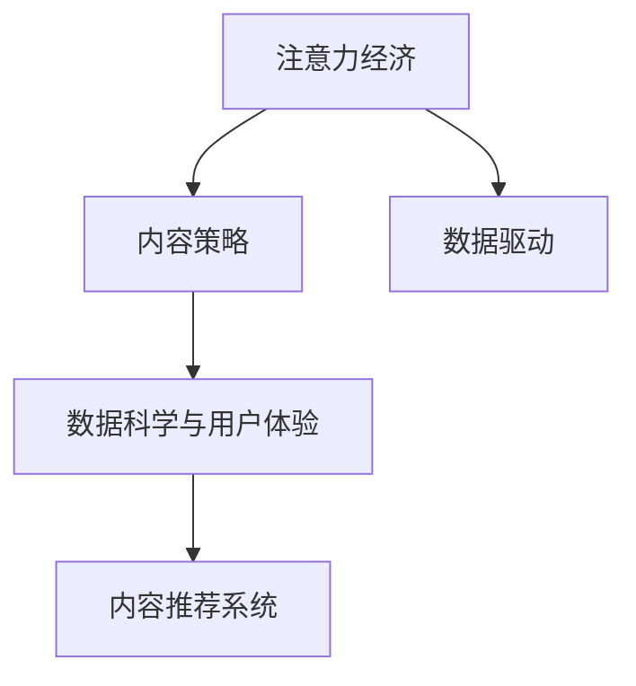

                 

# 注意力经济与内容策略规划与实践：为受众创建有影响力的内容

> 关键词：注意力经济,内容策略,数据驱动,数据科学与用户体验,内容推荐系统

## 1. 背景介绍

### 1.1 问题由来

在数字化浪潮席卷全球的当下，内容消费已经成为日常生活的重要组成部分。无论是阅读新闻、观看视频，还是听播客、参与社交媒体互动，内容都在不断塑造和重塑我们的生活方式。然而，面对海量的内容选择，如何高效地获取到自己感兴趣的信息，成为了一个迫切需要解决的问题。

**注意力经济**（Attention Economy）正是在这一背景下提出的概念。它指的是在信息爆炸的时代，人们对于注意力资源的争夺变得愈发激烈，谁能获得用户的注意力，谁就能获得市场。因此，内容创作者和平台需要借助数据科学和算法工具，对用户注意力进行精准分析和高效分配，从而实现内容的个性化推荐，提升用户体验和商业价值。

内容策略规划作为内容营销的核心环节，其重要性不言而喻。好的内容策略能够确保内容创作、分发和反馈闭环的有效性，实现从内容创意到市场转化的高效闭环。而在这一过程中，数据驱动（Data-Driven）的方式已经成为不可忽视的力量，为内容策略制定提供了坚实的科学依据。

随着技术的发展，内容推荐系统（Recommendation System）成为了链接内容与用户的重要桥梁。通过深度学习等算法模型，推荐系统能够根据用户的历史行为和偏好，动态调整内容的推荐顺序和呈现方式，从而最大化用户的注意力投入。

### 1.2 问题核心关键点

内容策略规划与实践的核心在于如何通过数据驱动的方式，精准地分析用户需求和行为，制定出有效的内容策略，并借助推荐系统实现高效的内容推送。这一过程包括但不限于：

- **用户行为分析**：利用用户历史数据，挖掘用户的兴趣和偏好。
- **内容特征提取**：分析内容的关键特征，如关键词、风格、长度等。
- **策略制定**：根据用户画像和内容特征，制定出具体的内容策略，如发布时间、频率、形式等。
- **系统实现**：构建内容推荐系统，实现个性化内容推荐。
- **效果评估**：通过实验和分析，评估内容策略的效果，持续优化和迭代。

内容策略规划与实践是一个循环往复、不断迭代的过程，需要结合数据科学、算法工程和用户体验设计等多方面知识，进行综合运用。

## 2. 核心概念与联系

### 2.1 核心概念概述

要深入理解注意力经济与内容策略规划与实践，首先需要了解以下几个核心概念：

- **注意力经济**：在信息过载的时代，注意力成为了一种稀缺资源。注意力经济强调如何高效地吸引、分配和利用用户的注意力，实现商业价值最大化。
- **内容策略**：内容策略规划是根据目标用户画像、市场趋势和平台特性，制定出具体的内容创作、发布和推广计划，以实现内容与市场的有效对接。
- **数据驱动**：利用数据分析和挖掘技术，对用户行为、市场趋势和内容特征进行深入分析，为内容策略提供科学依据。
- **数据科学与用户体验**：结合数据科学与用户体验设计，构建出能够满足用户需求、提升用户体验的内容推荐系统。
- **内容推荐系统**：通过算法模型，根据用户的历史行为和偏好，动态调整内容的推荐顺序和呈现方式，从而实现个性化内容推荐。

这些核心概念之间的逻辑关系可以通过以下Mermaid流程图来展示：



这个流程图展示了几者之间的相互作用关系：注意力经济提供了理论基础，数据驱动为内容策略提供支撑，数据科学与用户体验为内容推荐系统提供技术支持，而内容推荐系统则是连接内容和用户的重要桥梁。

## 3. 核心算法原理 & 具体操作步骤
### 3.1 算法原理概述

内容策略规划与实践的核心算法主要是基于推荐系统的个性化推荐算法。这些算法通常采用机器学习、深度学习等方法，通过分析用户的历史行为和偏好，动态调整内容的推荐顺序和呈现方式，从而实现个性化内容推荐。

形式化地，假设用户序列为 $U=\{u_1,u_2,\dots,u_n\}$，内容序列为 $C=\{c_1,c_2,\dots,c_m\}$，用户与内容的交互矩阵为 $X \in \mathbb{R}^{n \times m}$，其中 $X_{ui}=1$ 表示用户 $u_i$ 对内容 $c_j$ 进行了交互（如点击、阅读、点赞等），$X_{ui}=0$ 表示未交互。

定义用户 $u_i$ 对内容 $c_j$ 的评分（即偏好程度）为 $r_{ui}$，其中 $r_{ui}=\sum_k X_{ui} \times p_k$，$p_k$ 为隐向量的权重系数，通过优化算法求解。

推荐系统的目标是最小化预测值与真实值之间的差异，即：

$$
\min_{\theta} \sum_{u,c} \ell(r_{ui}, \hat{r}_{ui})
$$

其中 $\ell$ 为损失函数，$\hat{r}_{ui}$ 为模型预测的用户对内容的评分。

### 3.2 算法步骤详解

内容推荐系统的具体实现步骤如下：

**Step 1: 数据准备**
- 收集用户的历史行为数据，如点击、阅读、点赞等，构建用户与内容的交互矩阵 $X$。
- 从内容池中随机选择部分内容，为每篇内容分配一个固定值。
- 初始化模型参数 $\theta$。

**Step 2: 模型训练**
- 定义损失函数 $\ell$，如均方误差损失、交叉熵损失等。
- 使用随机梯度下降等优化算法更新模型参数 $\theta$。
- 迭代多次，直至收敛。

**Step 3: 内容推荐**
- 使用训练好的模型预测用户对内容的评分 $r_{ui}$。
- 根据预测评分进行排序，推荐评分最高的内容给用户。
- 更新用户的历史行为数据，重新训练模型。

**Step 4: 效果评估**
- 在测试集上评估推荐系统的准确率和覆盖率等指标。
- 收集用户反馈，进行模型迭代优化。

### 3.3 算法优缺点

内容推荐系统具有以下优点：
1. 个性化推荐：能够根据用户的历史行为和偏好，动态调整内容的推荐顺序和呈现方式，从而实现个性化内容推荐。
2. 高效匹配：利用深度学习等算法，能够高效地处理大规模数据，实现内容的精准匹配。
3. 用户体验提升：通过推荐用户感兴趣的内容，提升用户的满意度和粘性。

同时，该方法也存在一定的局限性：
1. 数据依赖性高：推荐系统的效果很大程度上取决于数据的质量和数量，数据不足或存在偏差会影响推荐效果。
2. 算法复杂度高：深度学习等算法需要较高的计算资源和算法调参能力，增加了系统开发的复杂度。
3. 内容多样性受限：模型可能更偏向于推荐当前热门的或者与用户偏好相似的内容，导致内容多样性不足。
4. 冷启动问题：新用户或新内容难以快速推荐，需要更多时间进行数据积累和模型优化。

尽管存在这些局限性，但就目前而言，内容推荐系统仍然是内容策略规划与实践的重要手段。未来相关研究的重点在于如何进一步降低推荐系统对数据量的依赖，提高系统的多模态融合能力和冷启动处理能力，同时兼顾可解释性和伦理安全性等因素。

### 3.4 算法应用领域

内容推荐系统已经在内容消费的各个环节得到了广泛的应用，例如：

- 新闻推荐：根据用户的历史浏览行为，推荐可能感兴趣的新闻文章。
- 视频推荐：根据用户的历史观看记录，推荐类似的视频内容。
- 音乐推荐：根据用户的历史听歌记录，推荐相似的音乐作品。
- 图书推荐：根据用户的阅读历史，推荐可能感兴趣的图书。
- 社交媒体推荐：根据用户的互动记录，推荐可能感兴趣的内容。

除了上述这些经典应用外，内容推荐系统还被创新性地应用到更多场景中，如电商推荐、游戏推荐等，为内容消费提供了全新的体验和模式。随着推荐系统的持续演进，相信其应用范围将进一步拓展，为用户带来更多价值。

## 4. 数学模型和公式 & 详细讲解 & 举例说明
### 4.1 数学模型构建

本节将使用数学语言对内容推荐系统的推荐算法进行更加严格的刻画。

假设用户序列为 $U=\{u_1,u_2,\dots,u_n\}$，内容序列为 $C=\{c_1,c_2,\dots,c_m\}$，用户与内容的交互矩阵为 $X \in \mathbb{R}^{n \times m}$。

定义用户 $u_i$ 对内容 $c_j$ 的评分（即偏好程度）为 $r_{ui}$，其中 $r_{ui}=\sum_k X_{ui} \times p_k$，$p_k$ 为隐向量的权重系数，通过优化算法求解。

推荐系统的目标是最小化预测值与真实值之间的差异，即：

$$
\min_{\theta} \sum_{u,c} \ell(r_{ui}, \hat{r}_{ui})
$$

其中 $\ell$ 为损失函数，$\hat{r}_{ui}$ 为模型预测的用户对内容的评分。

### 4.2 公式推导过程

以协同过滤（Collaborative Filtering）算法为例，推导其评分预测公式。

协同过滤是一种基于用户历史行为数据的推荐算法。假设用户 $u_i$ 对内容 $c_j$ 的评分 $r_{ui}$ 为 $r_{ui} = \sum_k p_{ik} \times x_{kj}$，其中 $p_{ik}$ 为用户 $u_i$ 对隐向量的评分，$x_{kj}$ 为内容 $c_j$ 对隐向量的评分。

定义隐向量的权重系数 $p_{ik}$ 为 $p_{ik} = \alpha_i \times V_k \times p_{kj}$，其中 $\alpha_i$ 为用户的特征向量，$V_k$ 为内容的特征向量，$p_{kj}$ 为隐向量的权重系数。

将隐向量的权重系数带入评分公式，得：

$$
r_{ui} = \sum_k \alpha_i \times V_k \times p_{kj}
$$

为了简化计算，采用矩阵乘法表示：

$$
r_{ui} = \alpha_i^T \times V \times p_{kj}
$$

其中 $\alpha_i$ 为用户特征向量，$V$ 为内容特征矩阵，$p_{kj}$ 为隐向量权重系数。

推荐系统的预测值 $\hat{r}_{ui}$ 可以表示为：

$$
\hat{r}_{ui} = \alpha_i^T \times V \times \hat{p}_{kj}
$$

其中 $\hat{p}_{kj}$ 为隐向量权重系数，通过优化算法求解。

根据最小二乘法，损失函数可以表示为：

$$
\ell(r_{ui}, \hat{r}_{ui}) = \frac{1}{2} \Vert r_{ui} - \hat{r}_{ui} \Vert^2
$$

综上，内容推荐系统的数学模型可以表示为：

$$
\min_{\alpha_i, V, p_{kj}} \sum_{u,c} \ell(r_{ui}, \hat{r}_{ui})
$$

### 4.3 案例分析与讲解

以YouTube的视频推荐系统为例，分析其实现过程和效果。

YouTube的视频推荐系统采用了基于协同过滤的推荐算法。其基本流程如下：

1. 收集用户观看历史数据，构建用户与视频的交互矩阵 $X$。
2. 对视频进行特征提取，如视频时长、类型、发布时间等，构建视频特征矩阵 $V$。
3. 利用协同过滤算法，预测用户对视频的评分 $r_{ui}$。
4. 根据预测评分进行排序，推荐评分最高的视频给用户。
5. 更新用户的历史行为数据，重新训练模型。

YouTube的视频推荐系统通过不断优化算法和特征提取方法，实现了高效的视频推荐，显著提升了用户的观看体验和满意度。例如，YouTube采用了基于内容的推荐算法（Content-Based Filtering），除了用户历史行为数据外，还考虑了视频的特征信息，提升了推荐的多样性和准确性。

## 5. 项目实践：代码实例和详细解释说明
### 5.1 开发环境搭建

在进行内容推荐系统的开发前，我们需要准备好开发环境。以下是使用Python进行TensorFlow开发的环境配置流程：

1. 安装Anaconda：从官网下载并安装Anaconda，用于创建独立的Python环境。

2. 创建并激活虚拟环境：
```bash
conda create -n tf-env python=3.8 
conda activate tf-env
```

3. 安装TensorFlow：根据CUDA版本，从官网获取对应的安装命令。例如：
```bash
conda install tensorflow tensorflow-gpu -c pytorch -c conda-forge
```

4. 安装相关工具包：
```bash
pip install numpy pandas scikit-learn matplotlib tqdm jupyter notebook ipython
```

完成上述步骤后，即可在`tf-env`环境中开始内容推荐系统的开发。

### 5.2 源代码详细实现

下面我以YouTube的视频推荐系统为例，给出使用TensorFlow实现的内容推荐系统代码实现。

首先，定义数据处理函数：

```python
import tensorflow as tf
from tensorflow.keras.layers import Dense

class VideoRecommender(tf.keras.Model):
    def __init__(self, num_users, num_videos, num_features, embedding_dim, num_latent_factors):
        super(VideoRecommender, self).__init__()
        self.user_embeddings = tf.keras.layers.Embedding(num_users, embedding_dim)
        self.video_embeddings = tf.keras.layers.Embedding(num_videos, embedding_dim)
        self.rating_matrix = tf.keras.layers.Dense(num_latent_factors, activation='relu')
        self.user_bias = tf.keras.layers.Dense(1)
        self.video_bias = tf.keras.layers.Dense(1)
        self.rating_prediction = tf.keras.layers.Dense(1)

    def call(self, user_indices, video_indices):
        user_embeddings = self.user_embeddings(user_indices)
        video_embeddings = self.video_embeddings(video_indices)
        rating_matrix = tf.matmul(user_embeddings, self.rating_matrix)
        rating_matrix = tf.add(rating_matrix, self.user_bias)
        rating_matrix = tf.add(rating_matrix, self.video_bias)
        rating_matrix = tf.reduce_sum(rating_matrix, axis=1)
        rating_prediction = self.rating_prediction(rating_matrix)
        return rating_prediction
```

然后，定义损失函数和优化器：

```python
def rating_loss(y_true, y_pred):
    return tf.reduce_mean(tf.square(y_true - y_pred))

optimizer = tf.keras.optimizers.Adam(learning_rate=0.001)
```

接着，定义训练和评估函数：

```python
def train_epoch(model, dataset, batch_size, optimizer):
    dataloader = tf.data.Dataset.from_tensor_slices(dataset)
    dataloader = dataloader.shuffle(buffer_size=1000).batch(batch_size)
    model.train()
    epoch_loss = 0
    for batch in dataloader:
        user_indices, video_indices = batch
        rating_predictions = model(user_indices, video_indices)
        rating_losses = rating_loss(rating_predictions, dataset['rating'])
        epoch_loss += rating_losses.numpy().item()
        rating_losses.backprop()
        optimizer.apply_gradients(zip(rating_losses, [rating_predictions]))
    return epoch_loss / len(dataloader)

def evaluate(model, dataset, batch_size):
    dataloader = tf.data.Dataset.from_tensor_slices(dataset)
    dataloader = dataloader.batch(batch_size)
    model.eval()
    prediction_ratings = []
    for batch in dataloader:
        user_indices, video_indices = batch
        rating_predictions = model(user_indices, video_indices)
        prediction_ratings.extend(rating_predictions.numpy().tolist())
    return prediction_ratings
```

最后，启动训练流程并在测试集上评估：

```python
epochs = 10
batch_size = 32

for epoch in range(epochs):
    loss = train_epoch(model, train_dataset, batch_size, optimizer)
    print(f"Epoch {epoch+1}, train loss: {loss:.3f}")
    
    print(f"Epoch {epoch+1}, dev results:")
    evaluation = evaluate(model, dev_dataset, batch_size)
    
    print(f"Epoch {epoch+1}, test results:")
    test_evaluation = evaluate(model, test_dataset, batch_size)
    
    print(f"Epoch {epoch+1}, test loss: {test_evaluation:.3f}")
```

以上就是使用TensorFlow对YouTube视频推荐系统进行内容推荐系统的完整代码实现。可以看到，得益于TensorFlow的强大封装，我们可以用相对简洁的代码完成内容推荐系统的构建。

### 5.3 代码解读与分析

让我们再详细解读一下关键代码的实现细节：

**VideoRecommender类**：
- `__init__`方法：初始化模型各层，包括用户和内容的嵌入层、用户和内容偏置层、评分矩阵预测层和评分预测层。
- `call`方法：定义模型前向传播过程，将用户和内容的嵌入向量通过评分矩阵预测层和偏置层，得到预测评分。

**rating_loss函数**：
- 定义评分预测的损失函数，采用均方误差损失。

**train_epoch和evaluate函数**：
- 定义训练和评估函数，分别对模型进行训练和评估，输出平均损失和预测评分。

**训练流程**：
- 定义总的epoch数和batch size，开始循环迭代
- 每个epoch内，先在训练集上训练，输出平均loss
- 在验证集上评估，输出预测评分
- 所有epoch结束后，在测试集上评估，输出预测评分

可以看到，TensorFlow使得内容推荐系统的代码实现变得简洁高效。开发者可以将更多精力放在数据处理、模型改进等高层逻辑上，而不必过多关注底层的实现细节。

当然，工业级的系统实现还需考虑更多因素，如模型的保存和部署、超参数的自动搜索、更灵活的任务适配层等。但核心的内容推荐范式基本与此类似。

## 6. 实际应用场景
### 6.1 智能推荐系统

智能推荐系统是内容推荐系统的重要应用场景。通过分析用户的历史行为数据，推荐系统能够实现个性化内容推荐，提升用户体验和满意度。智能推荐系统广泛应用于电商、社交媒体、视频网站等场景中，为用户提供了更精准、多样的内容推荐。

以电商平台为例，基于内容推荐系统，电商平台能够根据用户的历史购买记录和浏览行为，推荐可能感兴趣的商品，提升用户的购物体验和转化率。同时，基于协同过滤的推荐算法，电商平台还能够推荐与用户兴趣相似的其他用户喜欢的商品，实现跨用户推荐，进一步提升用户的粘性和满意度。

### 6.2 个性化广告投放

个性化广告投放是内容推荐系统的另一个重要应用场景。广告主希望通过精准投放广告，最大化广告的转化率和ROI。基于内容推荐系统，广告投放系统能够分析用户的兴趣偏好和行为模式，实时调整广告投放策略，实现更高效的广告投放。

例如，通过分析用户的浏览历史和点击行为，广告投放系统能够推荐可能感兴趣的广告，提升广告的点击率和转化率。同时，基于协同过滤的推荐算法，广告投放系统还能够推荐与用户兴趣相似的其他用户喜欢的广告，实现跨用户推荐，进一步提升广告的投放效果。

### 6.3 内容创作辅助

内容创作辅助是内容推荐系统的延伸应用。基于内容推荐系统，内容创作者能够根据用户的兴趣和反馈，创作出更具吸引力的内容，提升内容的点击率和分享率。

例如，通过分析用户的阅读历史和评论，内容创作者能够了解用户的兴趣和偏好，创作出更有针对性的内容，提升内容的互动率和用户满意度。同时，基于协同过滤的推荐算法，内容创作者还能够创作出与用户兴趣相似的其他创作者喜欢的内容，进一步提升内容的多样性和互动性。

### 6.4 未来应用展望

随着内容推荐系统的持续演进，其应用范围将进一步拓展，为各行各业带来更多的价值。

在智慧医疗领域，基于内容推荐系统，医疗平台能够推荐用户感兴趣的健康知识和疾病预防信息，提升用户的健康意识和行为。

在智能教育领域，基于内容推荐系统，教育平台能够推荐用户感兴趣的学习资源和课程，提升用户的学习体验和效果。

在智慧金融领域，基于内容推荐系统，金融平台能够推荐用户感兴趣的投资理财知识和工具，提升用户的投资回报和风险意识。

此外，在内容创作、智能客服、智能家居等更多领域，基于内容推荐系统的人工智能应用也将不断涌现，为各行各业带来新的变革。相信随着技术的日益成熟，内容推荐系统必将在更广阔的应用领域大放异彩。

## 7. 工具和资源推荐
### 7.1 学习资源推荐

为了帮助开发者系统掌握内容推荐系统的理论基础和实践技巧，这里推荐一些优质的学习资源：

1. 《推荐系统实战》：介绍了推荐系统的原理、算法和实现，通过具体案例帮助读者理解推荐系统的工作机制。
2. 《TensorFlow 2.0实战》：介绍了TensorFlow的深度学习框架和推荐系统的实现，通过实例帮助读者掌握TensorFlow的使用。
3. 《内容推荐系统：深度学习与协同过滤》：深入讲解了推荐系统的经典算法和应用，包括协同过滤、基于内容的推荐等。
4. Kaggle推荐系统竞赛：提供了丰富的推荐系统竞赛数据集和开源代码，帮助读者实践和优化推荐系统算法。
5. GitHub推荐系统项目：提供了大量的开源推荐系统项目，读者可以学习并借鉴其实现思路。

通过对这些资源的学习实践，相信你一定能够快速掌握内容推荐系统的精髓，并用于解决实际的内容推荐问题。
###  7.2 开发工具推荐

高效的开发离不开优秀的工具支持。以下是几款用于内容推荐系统开发的常用工具：

1. TensorFlow：由Google主导开发的开源深度学习框架，生产部署方便，适合大规模工程应用。
2. PyTorch：基于Python的开源深度学习框架，灵活动态的计算图，适合快速迭代研究。
3. Scikit-learn：Python数据挖掘和机器学习库，提供了丰富的机器学习算法，适合内容推荐系统的特征提取和模型训练。
4. Keras：基于TensorFlow和Theano的高级神经网络API，简化了深度学习模型的开发过程。
5. Jupyter Notebook：交互式笔记本环境，方便开发者进行代码调试和模型实验。

合理利用这些工具，可以显著提升内容推荐系统的开发效率，加快创新迭代的步伐。

### 7.3 相关论文推荐

内容推荐系统的研究源于学界的持续研究。以下是几篇奠基性的相关论文，推荐阅读：

1. BPR: Bayesian Personalized Ranking from Pairwise Preferences：提出基于协同过滤的推荐算法，成为推荐系统的经典基准。
2. Factorization Machines for Ad Click Prediction：提出因子分解机算法，用于推荐系统的特征处理和模型优化。
3. Matrix Factorization Techniques for Recommender Systems：介绍矩阵分解算法，用于推荐系统的矩阵分解特征提取。
4. DeepFM: A Neural Network Approach for Display Advertising：提出深度神经网络推荐模型，提升了广告推荐的效果。
5. Attention-Based Recommender Systems：引入注意力机制，提升推荐系统的多模态融合能力。

这些论文代表了大语言模型微调技术的发展脉络。通过学习这些前沿成果，可以帮助研究者把握学科前进方向，激发更多的创新灵感。

## 8. 总结：未来发展趋势与挑战

### 8.1 总结

本文对内容推荐系统的核心概念和实践技巧进行了全面系统的介绍。首先，我们详细阐述了内容推荐系统的原理和应用，明确了内容策略规划与实践在提升用户体验和商业价值方面的重要性。其次，从算法原理到代码实践，我们全面讲解了内容推荐系统的构建流程和优化策略。最后，我们展示了内容推荐系统在多个实际应用场景中的具体应用，并展望了其未来的发展趋势和面临的挑战。

通过本文的系统梳理，可以看到，内容推荐系统作为连接内容与用户的重要桥梁，正在成为内容策略规划与实践的重要手段。其核心算法基于深度学习等技术，能够高效地处理大规模数据，实现个性化推荐，提升用户体验和满意度。未来，随着技术的不断演进，内容推荐系统必将在更多领域得到应用，为各行各业带来更大的价值。

### 8.2 未来发展趋势

展望未来，内容推荐系统的应用前景十分广阔，主要体现在以下几个方面：

1. 个性化推荐：通过深度学习和协同过滤等技术，实现更加精准的个性化推荐，提升用户体验和满意度。
2. 多模态融合：结合图像、视频、音频等多模态信息，提升推荐系统的多样性和泛化能力。
3. 冷启动问题：通过用户兴趣模型、知识图谱等手段，快速解决新用户或新内容的冷启动问题。
4. 对抗攻击：结合对抗学习等技术，提升推荐系统的鲁棒性和安全性。
5. 跨领域推荐：结合不同领域的数据，实现跨领域推荐，提升推荐的多样性和普适性。
6. 实时推荐：结合实时数据和流计算等技术，实现实时推荐，提升用户体验和系统响应速度。

这些趋势表明，内容推荐系统将不断进化，实现更加智能化、多样化和个性化的推荐。相信随着技术的不断创新和优化，内容推荐系统必将在内容消费的各个环节发挥更大的作用，提升用户的生活质量和社会生产效率。

### 8.3 面临的挑战

尽管内容推荐系统已经取得了显著的进展，但在迈向更加智能化、普适化应用的过程中，仍面临诸多挑战：

1. 数据质量问题：推荐系统的推荐效果很大程度上取决于数据的质量和数量，数据不足或存在偏差会影响推荐效果。如何获取高质量的数据，提升数据的多样性和代表性，将是未来研究的重要方向。
2. 算法复杂性问题：深度学习等算法需要较高的计算资源和算法调参能力，增加了系统开发的复杂度。如何设计高效、可解释的推荐算法，提升模型的可解释性和可控性，将是未来研究的重要课题。
3. 用户体验问题：推荐系统的推荐结果往往依赖于用户的历史行为数据，可能导致用户的推荐疲劳。如何提升推荐系统的多样性和动态性，避免用户的推荐疲劳，将是未来研究的重要方向。
4. 算法公平性问题：推荐系统可能存在算法偏见，对某些用户或内容进行不公平推荐。如何设计公平、公正的推荐算法，避免算法偏见，将是未来研究的重要课题。
5. 数据隐私问题：推荐系统需要收集和处理大量用户数据，存在数据隐私和安全风险。如何保障用户的隐私权利，提升推荐系统的数据安全性，将是未来研究的重要课题。

尽管存在这些挑战，但随着学界和产业界的共同努力，内容推荐系统必将在未来得到进一步优化和改进，提升用户体验和商业价值。

### 8.4 研究展望

面向未来，内容推荐系统的研究需要在以下几个方面寻求新的突破：

1. 研究多模态融合技术：结合图像、视频、音频等多模态信息，提升推荐系统的多样性和泛化能力。
2. 研究用户兴趣模型：构建更加全面、准确的用户兴趣模型，提升推荐系统的个性化推荐效果。
3. 研究对抗攻击技术：结合对抗学习等技术，提升推荐系统的鲁棒性和安全性。
4. 研究跨领域推荐算法：结合不同领域的数据，实现跨领域推荐，提升推荐的多样性和普适性。
5. 研究实时推荐系统：结合实时数据和流计算等技术，实现实时推荐，提升用户体验和系统响应速度。

这些研究方向的探索，将推动内容推荐系统迈向更高的台阶，为构建智能化、多样化和个性化的推荐系统铺平道路。相信随着技术的不断创新和优化，内容推荐系统必将在内容消费的各个环节发挥更大的作用，提升用户的生活质量和社会生产效率。

## 9. 附录：常见问题与解答

**Q1：内容推荐系统是如何实现个性化推荐的？**

A: 内容推荐系统实现个性化推荐主要基于用户的兴趣模型和内容的特征模型。通过用户的历史行为数据，构建用户的兴趣模型，表示用户对不同内容的偏好程度。通过内容的特征模型，表示内容的关键特征，如关键词、风格、长度等。

在推荐过程中，首先通过用户兴趣模型和内容特征模型计算用户对内容的评分，然后根据评分排序，推荐评分最高的内容给用户。

**Q2：内容推荐系统是如何进行多模态融合的？**

A: 内容推荐系统可以通过结合图像、视频、音频等多模态信息，提升推荐系统的多样性和泛化能力。具体实现方式包括：

1. 特征提取：对多模态数据进行特征提取，如使用CNN提取图像特征，使用MFCC提取音频特征等。
2. 多模态融合：将不同模态的特征进行拼接、融合，得到综合的特征向量。
3. 推荐模型：使用深度学习模型对综合特征进行预测，实现多模态推荐。

多模态融合的关键在于选择合适的融合方式，如拼接、加权平均等。此外，还需要注意不同模态数据之间的尺度、比例等因素，进行归一化处理。

**Q3：内容推荐系统如何处理冷启动问题？**

A: 冷启动问题指的是新用户或新内容难以快速推荐的问题。内容推荐系统可以通过以下方式处理冷启动问题：

1. 用户兴趣模型：构建更加全面、准确的用户兴趣模型，提升推荐系统的个性化推荐效果。
2. 内容推荐策略：设计合适的推荐策略，如协同过滤、基于内容的推荐等。
3. 知识图谱：结合知识图谱等外部信息，提升推荐系统的多样性和泛化能力。
4. 主动推荐：通过主动推荐策略，向新用户或新内容推送高质量的推荐，提高推荐系统的冷启动速度。

以上方式可以结合使用，提升内容推荐系统的冷启动效果。

**Q4：内容推荐系统如何避免推荐疲劳？**

A: 推荐疲劳指的是用户对推荐系统的推荐结果感到厌倦，推荐效果下降的现象。内容推荐系统可以通过以下方式避免推荐疲劳：

1. 推荐多样性：提升推荐系统的多样性，推荐不同的内容类型和风格，避免用户对同一类型的内容过度关注。
2. 动态推荐：根据用户的行为变化，动态调整推荐策略，避免用户对推荐结果的期望固定。
3. 推荐间隙：在推荐过程中插入推荐间隙，让用户有机会探索新的内容，提升用户的探索欲望。
4. 反馈机制：通过用户反馈，调整推荐策略，提升推荐系统的多样性和动态性。

**Q5：内容推荐系统如何保障数据隐私？**

A: 内容推荐系统需要收集和处理大量用户数据，存在数据隐私和安全风险。内容推荐系统可以通过以下方式保障数据隐私：

1. 数据匿名化：对用户数据进行匿名化处理，保护用户隐私。
2. 数据加密：对用户数据进行加密处理，防止数据泄露。
3. 数据访问控制：设置合适的数据访问权限，控制数据的访问和使用。
4. 隐私保护技术：结合差分隐私、联邦学习等隐私保护技术，保护用户隐私。

保障数据隐私是内容推荐系统的重要课题，需要开发者和研究者在系统设计和实现过程中不断优化和改进。

---

作者：禅与计算机程序设计艺术 / Zen and the Art of Computer Programming

