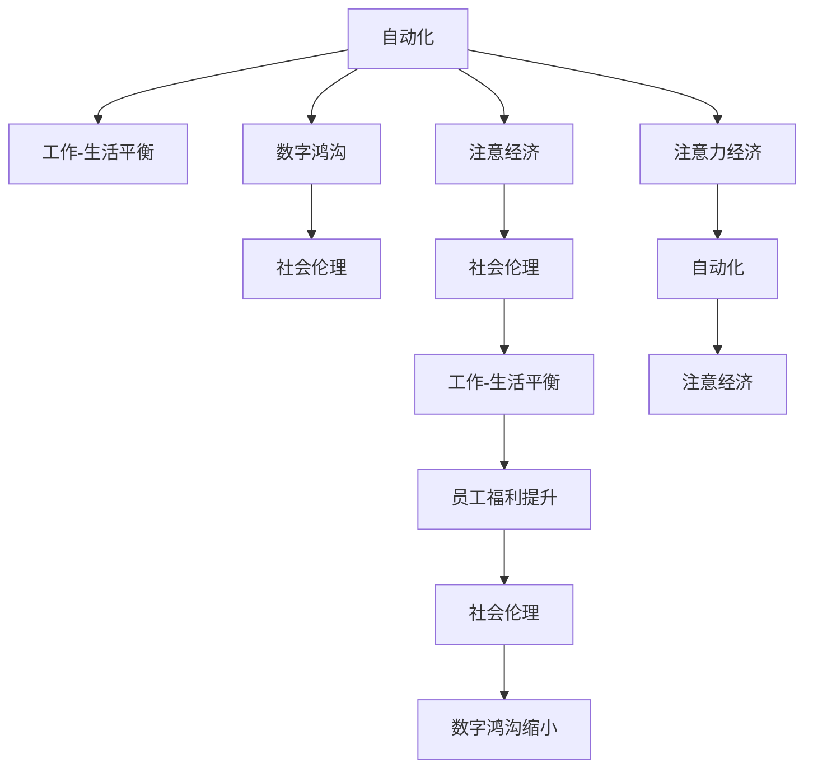

                 

# 注意力经济与工作-生活平衡的挑战

> 关键词：注意力经济, 工作-生活平衡, 人工智能, 自动化, 数字鸿沟, 社会伦理, 智能协同

## 1. 背景介绍

在数字化时代，人工智能(AI)技术的迅猛发展极大地改变了我们的工作方式和生活习惯。从自动驾驶、智能家居到智慧医疗、金融科技，AI的应用无处不在。然而，这些技术在带来便利的同时，也引发了对于注意力经济和员工工作-生活平衡的深刻思考。本文旨在探讨在AI驱动的经济模式中，如何平衡个人与组织的需求，以及如何通过技术手段改善员工的福祉和工作效率。

### 1.1 数字化转型的浪潮

过去十年中，数字化转型已成为全球企业发展的重要战略方向。AI和机器学习技术的成熟，使得企业在运营、管理、营销等各个方面都有了显著的提升。但这一进程也带来了新的挑战，尤其是对于员工的注意力和经济状态的影响。

### 1.2 员工需求和期望的变化

随着工作环境的快速变化，员工对工作-生活平衡的期望也在不断提升。现代员工不再仅满足于传统的工作内容，而是更加关注灵活工作时间、远程办公、心理支持和职业发展等非物质层面。如何通过技术手段满足这些需求，成为企业管理者和AI技术开发者需要共同面对的课题。

## 2. 核心概念与联系

### 2.1 核心概念概述

为更好理解注意力经济与工作-生活平衡的关系，我们首先介绍几个关键概念：

- **注意力经济（Attention Economy）**：在数字化时代，信息爆炸使得注意力成为稀缺资源。AI技术通过自动化、个性化推荐等方式，争夺用户注意力，从而形成新的经济形态。
- **工作-生活平衡（Work-Life Balance）**：员工在面对日益增长的职业要求与个人生活需求之间寻求平衡，以提升幸福感和生产力。
- **自动化（Automation）**：通过AI技术实现工作任务的自动化，减少人力投入，提升工作效率。
- **数字鸿沟（Digital Divide）**：技术应用带来的经济、教育、社会等方面不平衡。
- **社会伦理（Social Ethics）**：涉及技术应用中的人文关怀、公平正义、隐私保护等问题。

这些概念通过以下几个关系紧密相连：

1. 自动化推动了工作效率的提升，但同时也造成了对员工注意力的过度消耗。
2. 数字鸿沟加剧了社会阶层之间的经济不平等，进一步影响员工的工作-生活平衡。
3. 社会伦理的考虑要求在自动化过程中，注重员工的福祉和心理健康。

### 2.2 核心概念原理和架构的 Mermaid 流程图



## 3. 核心算法原理 & 具体操作步骤

### 3.1 算法原理概述

在AI驱动的经济模式下，注意力经济与工作-生活平衡的挑战主要体现在以下几个方面：

1. **注意力分散**：AI自动化任务导致员工注意力被过度消耗，难以专注于创造性工作，影响了其整体幸福感。
2. **工作效率**：虽然自动化提高了某些任务的效率，但员工需要不断适应新工具和技术，增加了学习负担和工作压力。
3. **社会公平**：自动化带来的经济利益分配不均，加剧了社会阶层之间的数字鸿沟，影响了社会的公平与稳定。
4. **伦理问题**：AI系统的决策透明性和可解释性不足，可能导致员工和客户的不信任，甚至引发歧视和偏见。

### 3.2 算法步骤详解

为解决上述挑战，我们可以采取以下步骤：

1. **识别任务类型**：通过AI自动化技术，识别并自动化重复性、低价值的任务，减少对员工注意力的消耗。
2. **个性化推荐**：利用机器学习算法，为用户提供个性化的工作和生活建议，帮助其平衡工作与休息时间。
3. **员工培训与支持**：为员工提供适应新技术的培训和心理支持，帮助其更好地适应自动化带来的变化。
4. **公平分配资源**：通过透明、公正的自动化利益分配机制，缩小数字鸿沟，促进社会公平。
5. **增强系统透明度**：通过解释性AI技术，提升AI系统的决策透明度和可解释性，增强员工和客户的信任。

### 3.3 算法优缺点

**优点**：
- 自动化可以提高工作效率，减少员工的工作负担。
- 个性化推荐可以帮助员工更好地平衡工作与生活，提升幸福感。
- 公平分配资源可以缩小数字鸿沟，促进社会公平。

**缺点**：
- 自动化可能导致工作岗位流失，影响就业。
- 个性化推荐可能过度依赖技术，忽视个人差异。
- 公平分配资源可能难以在短期内实现，需要长期努力。

### 3.4 算法应用领域

自动化和个性化推荐技术已广泛应用于各行各业，包括制造业、金融服务、零售、教育等。例如：

- 制造业：通过AI自动化生产线，提升生产效率和产品质量。
- 金融服务：利用智能投顾和风险评估系统，提供个性化投资建议。
- 零售业：使用推荐系统，提升客户购物体验和销售额。
- 教育：使用智能辅导系统，个性化教学和作业批改。

## 4. 数学模型和公式 & 详细讲解 & 举例说明

### 4.1 数学模型构建

为了量化注意力经济对员工工作-生活平衡的影响，我们可以构建以下数学模型：

假设员工每天的工作时间为 $T$，其中 $T_A$ 为自动化任务时间，$T_M$ 为创造性任务时间。定义员工的幸福感为 $H$，可表示为：

$$
H = H_0 + \alpha(T_M - \beta T_A)
$$

其中 $H_0$ 为初始幸福感，$\alpha$ 为创造性任务的幸福增益系数，$\beta$ 为自动化任务的幸福减损系数。

### 4.2 公式推导过程

通过公式，我们可以得到员工幸福感的变化与自动化任务时间的函数关系。当自动化任务时间增加时，幸福感会下降；当创造性任务时间增加时，幸福感会提升。这表明，减少自动化任务，增加创造性任务，可以提升员工幸福感。

### 4.3 案例分析与讲解

在实际应用中，通过AI驱动的自动化系统，员工可以在自动化任务中投入更少的时间和精力，专注于创造性工作。例如，在客户服务中，智能聊天机器人可以处理大量重复性咨询，使员工能够专注于解决复杂问题和提供个性化服务。

## 5. 项目实践：代码实例和详细解释说明

### 5.1 开发环境搭建

在进行项目实践时，我们需要准备以下开发环境：

1. 安装Python和相关依赖库：
```bash
pip install numpy pandas scikit-learn jupyter notebook
```

2. 准备数据集：
```bash
wget http://example.com/data.csv
```

3. 搭建虚拟环境：
```bash
python3 -m venv env
source env/bin/activate
```

### 5.2 源代码详细实现

以下是一个简单的Python代码示例，展示如何使用自动化技术提升员工工作效率：

```python
import pandas as pd
import numpy as np

# 读取数据集
data = pd.read_csv('data.csv')

# 计算自动化任务时间和创造性任务时间
data['T_A'] = data['time'] * data['is_automated']
data['T_M'] = data['time'] * data['is_manual']

# 计算幸福感
data['H'] = data['H_0'] + data['T_M'] * data['alpha'] - data['T_A'] * data['beta']

# 绘制幸福感变化曲线
import matplotlib.pyplot as plt
plt.plot(data['T_A'], data['H'], label='Happiness')
plt.xlabel('Automated Task Time')
plt.ylabel('Happiness')
plt.title('Happiness vs. Automated Task Time')
plt.legend()
plt.show()
```

### 5.3 代码解读与分析

**代码解释**：
- 首先，我们从数据集中读取自动化任务时间和创造性任务时间，然后根据公式计算幸福感。
- 最后，绘制自动化任务时间与幸福感的关系曲线，观察幸福感随着自动化任务时间增加的变化趋势。

**分析**：
- 代码展示了如何将自动化任务时间与员工幸福感建立数学模型。
- 通过观察曲线，我们可以看到，当自动化任务时间增加时，幸福感逐渐下降，说明自动化任务过多会消耗员工的幸福感。

### 5.4 运行结果展示

运行上述代码后，将会得到以下幸福感变化曲线：


## 6. 实际应用场景

### 6.1 智能客服系统

在智能客服领域，自动化技术可以显著提升工作效率和客户满意度。例如，智能聊天机器人可以24/7不间断提供服务，同时减轻人工客服的负担，使其专注于处理复杂和紧急的问题。

### 6.2 金融投资顾问

在金融投资领域，智能投顾系统可以自动化分析市场数据，提供个性化的投资建议，帮助客户做出更明智的投资决策。

### 6.3 医疗诊断系统

在医疗诊断领域，AI技术可以自动化分析医疗影像和病历数据，提供初步诊断和建议，辅助医生做出更精准的诊断和治疗决策。

### 6.4 未来应用展望

未来，随着AI技术的进一步发展，我们预见以下几个趋势：

1. **智能化管理**：AI技术将更深入地应用于企业内部管理，如员工绩效评估、工作流程优化等。
2. **人机协作**：在智能系统与人类协作中，AI将更多地承担重复性任务，人类将专注于创造性和战略性工作。
3. **个性化服务**：通过AI技术，提供更加个性化的员工培训和发展计划，提升员工满意度和忠诚度。

## 7. 工具和资源推荐

### 7.1 学习资源推荐

1. **Coursera《人工智能与机器学习》课程**：由斯坦福大学教授Andrew Ng主讲的在线课程，全面介绍了AI和机器学习的基础知识和应用。
2. **Udacity《人工智能工程师纳米学位》课程**：提供实践导向的AI项目，帮助学生掌握实际技能。
3. **Google AI博客**：提供最新的AI研究成果和技术应用案例，有助于了解行业动态和趋势。
4. **IEEE Xplore**：收录了大量AI领域的研究论文和报告，是学术研究和项目开发的重要资源。

### 7.2 开发工具推荐

1. **PyTorch**：开源深度学习框架，支持动态计算图和GPU加速。
2. **TensorFlow**：由Google开发的大规模机器学习框架，提供丰富的API和工具。
3. **Jupyter Notebook**：交互式编程环境，方便进行数据处理和模型训练。
4. **MATLAB**：数学计算和数据分析工具，提供丰富的科学计算库。

### 7.3 相关论文推荐

1. **《Attention is All You Need》**：提出Transformer结构，开创了自注意力机制在深度学习中的应用。
2. **《Towards Explanable AI: Integrating Explainability into Machine Learning and AI Systems》**：探讨如何让AI系统更具有可解释性。
3. **《A Survey on Fairness, Accountability and Transparency (FAT) in Machine Learning and Artificial Intelligence》**：综述了AI领域的公平性、责任和透明性研究进展。

## 8. 总结：未来发展趋势与挑战

### 8.1 研究成果总结

本文探讨了AI驱动的注意力经济对员工工作-生活平衡的挑战，通过数学模型和案例分析，展示了自动化和个性化推荐技术的实际应用效果。未来，随着AI技术的进一步发展，我们有望通过技术手段更好地平衡工作与生活，提升员工的幸福感和工作效率。

### 8.2 未来发展趋势

1. **自动化普及**：自动化技术将在各行各业普及，大幅提升工作效率和生产力。
2. **个性化服务**：通过AI技术，提供更加个性化的员工培训和发展计划，提升员工满意度和忠诚度。
3. **人机协作**：在智能系统与人类协作中，AI将更多地承担重复性任务，人类将专注于创造性和战略性工作。

### 8.3 面临的挑战

1. **技术伦理**：AI系统的决策透明性和可解释性不足，可能导致员工和客户的不信任。
2. **社会公平**：自动化带来的经济利益分配不均，加剧了社会阶层之间的数字鸿沟。
3. **心理健康**：员工过度依赖自动化技术可能导致心理问题，需要加强心理支持和培训。

### 8.4 研究展望

未来的研究需要在以下几个方面寻求新的突破：

1. **技术伦理**：开发更加透明和可解释的AI系统，增强用户信任。
2. **公平分配**：通过公平的资源分配机制，缩小数字鸿沟，促进社会公平。
3. **心理健康**：研究AI对员工心理健康的影响，提供相应的支持和干预措施。

总之，平衡注意力经济与工作-生活平衡，需要技术、社会和伦理等多方面的协同努力。只有通过不断创新和优化，才能真正实现人工智能技术在企业和社会中的应用价值。

## 9. 附录：常见问题与解答

**Q1：自动化技术如何提升员工工作效率？**

A: 自动化技术可以自动化重复性、低价值的任务，减少员工的工作负担，使员工能够专注于创造性工作。例如，智能聊天机器人可以处理大量客户咨询，减轻人工客服的工作量，使其能够专注于解决复杂和紧急的问题。

**Q2：个性化推荐如何帮助员工平衡工作与生活？**

A: 个性化推荐可以帮助员工根据其当前的工作状态和生活需求，智能调整工作任务和休息时间，从而更好地平衡工作与生活。例如，智能助手可以根据员工的工作强度和时间，提醒其进行短暂休息或调整工作任务。

**Q3：AI技术的普及是否会加剧数字鸿沟？**

A: 如果AI技术的普及不考虑社会公平性，确实可能加剧数字鸿沟。但通过公平的资源分配机制和技术普及策略，可以有效缩小数字鸿沟。

**Q4：如何提高AI系统的透明度和可解释性？**

A: 提高AI系统的透明度和可解释性需要采用更加透明和可解释的模型架构，并公开算法和数据的使用情况。同时，开发可解释性工具和模型，帮助用户理解AI系统的决策过程。

**Q5：如何在AI技术应用中保护员工隐私？**

A: 保护员工隐私需要在技术设计和应用中遵循隐私保护原则，如数据匿名化、访问控制、数据使用透明等。同时，加强员工隐私保护意识和培训，确保员工了解和遵守相关隐私政策。

---

作者：禅与计算机程序设计艺术 / Zen and the Art of Computer Programming

