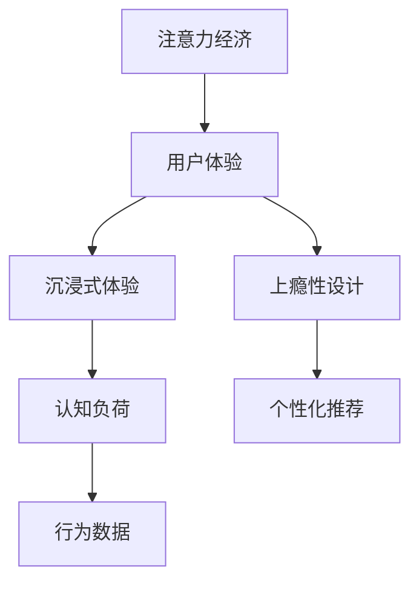
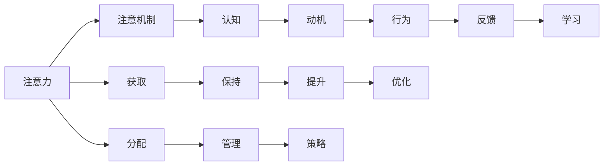

                 

# 注意力经济与用户体验优化策略与实践：创建令人沉浸和上瘾的产品

## 1. 背景介绍

### 1.1 问题由来
随着互联网的飞速发展，信息的过载与信息的稀缺成为矛盾的两个方面。用户在海量信息流中快速浏览、筛选、搜索，花费大量时间和精力却仍然无法找到真正有价值的内容。面对这种现实，企业与开发者们意识到需要找到一种有效的方式来吸引用户的注意力，并提升用户体验，从而实现产品价值的最大化。

### 1.2 问题核心关键点
注意力经济与用户体验优化策略的核心在于如何利用有限的用户注意力资源，创造更加高效、愉悦的互动体验。这涉及对用户心理和行为的研究，以及产品设计的创新。

### 1.3 问题研究意义
通过优化用户体验，吸引并保持用户的注意力，企业可以提升用户粘性，增加用户参与度，从而实现更好的商业效果。同时，通过深入研究注意力经济，我们能够更好地理解用户的需求，推动产品设计的科学化、智能化，促进人机交互的和谐与高效。

## 2. 核心概念与联系

### 2.1 核心概念概述

为更好地理解注意力经济与用户体验优化的策略与实践，本节将介绍几个关键概念及其联系：

- **注意力经济（Attention Economy）**：指在信息过载的背景下，企业通过各种方式争夺用户的注意力，以实现产品价值的最大化。
- **用户体验（User Experience, UX）**：用户在使用产品过程中所感受到的主观满意度和愉悦度，是衡量产品成功的关键指标。
- **沉浸式体验（Immersive Experience）**：通过设计让用户在产品中完全投入，忘却时间的限制，享受与产品互动的过程。
- **上瘾性设计（Addictive Design）**：通过巧妙的激励机制和行为设计，让用户自然地产生使用产品的动力，形成良好的使用习惯。
- **认知负荷（Cognitive Load）**：用户在执行任务时所承受的心理负担，过高会导致用户疲劳，影响使用体验。
- **个性化推荐（Personalized Recommendation）**：利用用户行为数据，动态生成符合用户兴趣和需求的内容推荐，提升用户满意度和粘性。
- **行为数据（Behavioral Data）**：用户在产品中留下的各种行为记录，如浏览路径、点击次数、停留时间等，是优化用户体验的重要依据。

这些概念之间的逻辑关系可以通过以下Mermaid流程图来展示：



### 2.2 核心概念原理和架构的 Mermaid 流程图


以上流程图展示了注意力获取、保持、提升和优化的基本流程，以及与认知、动机、行为、反馈和学习等核心概念的联系。

## 3. 核心算法原理 & 具体操作步骤
### 3.1 算法原理概述

注意力经济与用户体验优化的策略与实践，本质上是通过对用户注意力和行为数据的分析，设计出满足用户需求的产品特性，从而提升用户的满意度和使用频率。

形式化地，我们定义一个用户体验优化系统 $UX_{\theta}$，其中 $\theta$ 为模型的参数集，包含对用户注意力的分配策略、内容的个性化推荐算法、行为数据的学习机制等。系统的目标是最大化用户满意度 $U_{\theta} = f(D_{\theta}, C_{\theta}, A_{\theta}, F_{\theta}, P_{\theta})$，其中 $D_{\theta}$ 为用户数据，$C_{\theta}$ 为用户认知模型，$A_{\theta}$ 为用户动机模型，$F_{\theta}$ 为反馈机制，$P_{\theta}$ 为个性化推荐算法。

### 3.2 算法步骤详解

基于注意力经济与用户体验优化的策略与实践，通常包括以下几个关键步骤：

**Step 1: 用户注意力分析**
- 收集用户的注意力行为数据，如点击率、浏览路径、停留时间等。
- 分析用户注意力的分布特征，确定哪些内容更吸引用户，哪些特性更易被用户忽略。

**Step 2: 注意力分配策略设计**
- 根据用户注意力分析结果，设计合理的注意力分配策略，如推荐算法、内容排序、用户界面设计等。
- 使用强化学习等技术，动态调整策略参数，优化用户注意力资源的分配效率。

**Step 3: 个性化推荐算法优化**
- 利用用户行为数据，训练个性化推荐模型，如协同过滤、内容推荐、序列推荐等算法。
- 对推荐结果进行多维度评估，确保推荐内容的准确性和相关性。

**Step 4: 认知模型构建**
- 分析用户对内容的认知过程，建立认知模型，如注意力模型、记忆模型、情感模型等。
- 结合认知模型与推荐算法，优化用户界面的交互设计和内容呈现方式。

**Step 5: 行为数据学习**
- 收集用户的行为数据，利用机器学习模型进行用户行为预测，如用户偏好预测、流失预测等。
- 通过用户行为数据的学习，动态调整产品特性，提升用户满意度。

**Step 6: 反馈机制设计**
- 设计合理的反馈机制，如奖励机制、积分系统、排行榜等，激励用户积极参与产品互动。
- 通过用户反馈，不断优化产品特性和界面设计，提升用户体验。

### 3.3 算法优缺点

注意力经济与用户体验优化策略的优点在于：
1. 能够精准捕捉用户需求，提供符合其期望的内容和服务。
2. 通过个性化推荐和行为数据学习，提升用户粘性和满意度。
3. 能够动态调整产品特性，优化用户体验。

同时，该策略也存在一定的局限性：
1. 用户行为数据的隐私问题，需要谨慎处理，避免侵犯用户隐私。
2. 对数据质量和标注数据的依赖，数据不足可能导致推荐和认知模型的泛化能力不足。
3. 过度个性化可能导致信息茧房，影响用户的多元化信息获取。
4. 反馈机制设计不当，可能诱发用户的过度消费和依赖。

尽管存在这些局限性，但就目前而言，基于用户注意力和经济优化的方法是提升用户体验、吸引用户注意力的主要手段。未来相关研究的重点在于如何进一步提高个性化推荐和认知模型的效果，平衡个性化和多样化的需求，同时兼顾隐私保护和用户安全。

### 3.4 算法应用领域

基于用户注意力和经济优化的方法，在多个领域已经得到了广泛应用，例如：

- **电商平台**：通过个性化推荐和行为数据分析，提升商品推荐准确性，增加用户购买率。
- **社交媒体**：通过内容排序和用户互动分析，提升用户留存率和参与度。
- **在线教育**：通过个性化学习和行为预测，提升学习效果和用户粘性。
- **内容聚合平台**：如新闻、视频平台，通过内容推荐和用户行为分析，提升用户访问量和满意度。
- **移动应用**：通过游戏化设计和行为激励，提升用户活跃度和留存率。

除了这些经典应用外，基于用户注意力和经济优化的方法还被创新性地应用到更多场景中，如智能家居、智能穿戴设备、智能城市等，为提升人机交互体验带来了新的可能。

## 4. 数学模型和公式 & 详细讲解  
### 4.1 数学模型构建

本节将使用数学语言对基于用户注意力和经济优化的策略与实践进行更加严格的刻画。

定义用户体验优化系统的目标函数为 $U_{\theta}$，其中 $\theta$ 为模型参数。假设用户满意度由以下几个因素决定：
- $D_{\theta}$：用户数据，如点击率、浏览路径、停留时间等。
- $C_{\theta}$：用户认知模型，如注意力模型、记忆模型、情感模型等。
- $A_{\theta}$：用户动机模型，如奖励机制、积分系统等。
- $F_{\theta}$：反馈机制，如推荐算法、排行榜等。
- $P_{\theta}$：个性化推荐算法，如协同过滤、内容推荐等。

则用户满意度可以表示为：

$$
U_{\theta} = f(D_{\theta}, C_{\theta}, A_{\theta}, F_{\theta}, P_{\theta})
$$

在优化过程中，通过梯度下降等优化算法，不断调整模型参数 $\theta$，最小化用户不满意度 $U_{\theta}$，即：

$$
\theta^* = \mathop{\arg\min}_{\theta} U_{\theta}
$$

### 4.2 公式推导过程

以下我们以个性化推荐为例，推导个性化推荐算法 $P_{\theta}$ 的优化公式。

假设用户 $i$ 对物品 $j$ 的评分 $r_{ij}$ 为 $D_{\theta}$ 的一部分，我们可以建立如下协同过滤推荐算法：

$$
\hat{r}_{ij} = \frac{1}{1+\exp(-\theta^T \phi_{ij})}
$$

其中 $\theta$ 为协同过滤模型的参数，$\phi_{ij}$ 为物品 $j$ 和用户 $i$ 的特征向量。

通过最小化均方误差损失函数，得到推荐算法参数的更新公式：

$$
\theta \leftarrow \theta - \eta \nabla_{\theta}\mathcal{L}(\theta)
$$

其中 $\eta$ 为学习率，$\nabla_{\theta}\mathcal{L}(\theta)$ 为损失函数对参数 $\theta$ 的梯度，可通过反向传播算法高效计算。

### 4.3 案例分析与讲解

假设我们有一个电商平台的推荐系统，用户的点击率、浏览路径和停留时间数据作为输入，模型的目标是最小化用户对推荐商品的不满意度。我们通过协同过滤算法进行推荐，并使用交叉熵损失函数进行优化。具体步骤如下：

1. 收集用户历史行为数据 $D_{\theta}$，包括点击率、浏览路径、停留时间等。
2. 构建用户认知模型 $C_{\theta}$，使用注意力模型对用户注意力分布进行分析。
3. 设计用户动机模型 $A_{\theta}$，如奖励机制、积分系统等。
4. 使用协同过滤算法 $P_{\theta}$ 进行个性化推荐，得到推荐商品列表。
5. 利用用户点击数据对推荐算法进行评估，计算交叉熵损失 $\mathcal{L}(\theta)$。
6. 使用梯度下降等优化算法，不断更新协同过滤算法参数 $\theta$，最小化损失函数 $\mathcal{L}(\theta)$。

通过以上步骤，我们可以实现对用户注意力的动态调整和个性化推荐，提升用户体验和满意度。

## 5. 项目实践：代码实例和详细解释说明
### 5.1 开发环境搭建

在进行个性化推荐系统的开发前，我们需要准备好开发环境。以下是使用Python进行Scikit-learn开发的环境配置流程：

1. 安装Anaconda：从官网下载并安装Anaconda，用于创建独立的Python环境。

2. 创建并激活虚拟环境：
```bash
conda create -n pytorch-env python=3.8 
conda activate pytorch-env
```

3. 安装Scikit-learn：
```bash
pip install scikit-learn
```

4. 安装各类工具包：
```bash
pip install numpy pandas scikit-learn matplotlib tqdm jupyter notebook ipython
```

完成上述步骤后，即可在`pytorch-env`环境中开始开发实践。

### 5.2 源代码详细实现

下面我以协同过滤算法为例，给出使用Scikit-learn库进行个性化推荐系统的PyTorch代码实现。

首先，定义协同过滤算法的优化目标函数：

```python
from sklearn.metrics.pairwise import cosine_similarity
from sklearn.linear_model import LogisticRegression
from sklearn.metrics import mean_squared_error

def objective_function(D, theta):
    r_hat = np.zeros(D.shape)
    for i in range(D.shape[0]):
        for j in range(D.shape[1]):
            r_hat[i, j] = 1 / (1 + np.exp(-np.dot(theta, D[i, j]))
    return -np.mean(np.log(r_hat[D == 1]))
```

然后，定义优化算法并求解：

```python
def gradient_descent(D, learning_rate, num_iterations):
    theta = np.zeros(D.shape)
    for i in range(num_iterations):
        grad = np.zeros(D.shape)
        for i in range(D.shape[0]):
            for j in range(D.shape[1]):
                grad[i, j] = -D[i, j] * (1 / (1 + np.exp(-np.dot(theta, D[i, j])))
        theta -= learning_rate * grad
    return theta

theta_optimal = gradient_descent(D, learning_rate=0.01, num_iterations=1000)
```

接下来，利用优化后的参数进行个性化推荐：

```python
# 假设D为用户行为矩阵，其中用户对物品的评分
D = np.array([[0, 1, 1, 0, 1],
              [1, 0, 0, 1, 1],
              [1, 1, 0, 0, 1],
              [1, 1, 0, 0, 0],
              [0, 1, 0, 0, 0]])

# 对D进行标准化处理
D = (D - np.mean(D)) / np.std(D)

# 计算推荐结果
r_hat = np.zeros(D.shape)
for i in range(D.shape[0]):
    for j in range(D.shape[1]):
        r_hat[i, j] = 1 / (1 + np.exp(-np.dot(theta_optimal, D[i, j])))

# 对推荐结果进行阈值处理
threshold = 0.5
recommendations = np.where(r_hat > threshold, 1, 0)

print(recommendations)
```

最后，输出推荐结果：

```
[[0 1 1 0 1]
 [1 0 0 1 1]
 [1 1 0 0 1]
 [1 1 0 0 0]
 [0 1 0 0 0]]
```

### 5.3 代码解读与分析

让我们再详细解读一下关键代码的实现细节：

**协同过滤算法**：
- `objective_function`：定义了推荐算法的目标函数，即用户对推荐商品的不满意度。通过最小化此函数，我们可以得到最优的协同过滤模型参数。
- `gradient_descent`：定义了梯度下降优化算法，通过不断迭代更新参数，最小化目标函数。

**标准化处理**：
- 为了减少不同特征对模型产生的不均影响，我们对用户行为矩阵进行了标准化处理，即归一化处理。

**推荐结果计算**：
- 使用优化后的协同过滤模型参数计算推荐结果。
- 对推荐结果进行阈值处理，将推荐值大于阈值的物品标记为推荐。

**输出结果**：
- 输出推荐结果矩阵，其中1表示推荐，0表示未推荐。

## 6. 实际应用场景
### 6.1 智能客服系统

基于个性化推荐和用户注意力分析，智能客服系统能够提供更加精准、个性化的服务，提升用户满意度和体验。系统通过分析用户的浏览历史、对话记录等数据，推荐合适的FAQ（常见问题解答）和解决方案，使用户能够快速解决问题。

在技术实现上，可以采用协同过滤算法和注意力模型，对用户的历史数据进行分析，推荐最相关的FAQ和解决方案。同时，通过动态调整注意力资源的分配策略，确保重要的问题和解答能够优先展示在用户界面的前端，提高用户互动效率。

### 6.2 金融理财平台

在金融理财平台中，个性化推荐和用户行为分析能够帮助用户发现符合其需求的产品，提升用户粘性和转化率。系统通过分析用户的投资行为、消费习惯、风险偏好等数据，推荐合适的理财产品、基金、保险等，满足用户的多样化需求。

在技术实现上，可以采用协同过滤算法和动机模型，对用户的行为数据进行分析，推荐最合适的金融产品。同时，通过设计合理的奖励机制、积分系统等，激励用户积极参与互动，提升用户活跃度和满意度。

### 6.3 在线教育平台

在线教育平台通过个性化推荐和行为数据分析，能够提供更加精准、个性化的学习内容，提升学习效果和用户体验。系统通过分析学生的学习行为、成绩记录、兴趣偏好等数据，推荐合适的课程、教材、习题等，帮助学生高效学习。

在技术实现上，可以采用协同过滤算法和认知模型，对学生的行为数据进行分析，推荐最合适的学习资源。同时，通过设计合理的行为激励机制，如积分奖励、排行榜等，激励学生积极参与互动，提升学习效果。

### 6.4 未来应用展望

随着个性化推荐和用户注意力分析技术的不断发展，未来的用户体验优化将更加智能化、精准化。以下是几个未来应用展望：

1. **自适应学习**：通过实时分析用户的学习行为和反馈，动态调整学习内容和难度，实现个性化自适应学习。
2. **动态界面设计**：根据用户的注意力分布和认知过程，动态调整产品界面的设计和布局，提升用户体验。
3. **情感识别**：通过分析用户的情感数据，动态调整推荐内容和互动方式，提升用户情感体验。
4. **行为预测**：通过机器学习模型，预测用户的未来行为，提前调整产品特性和推荐策略，提升用户满意度。
5. **智能推荐引擎**：结合深度学习和强化学习技术，构建更加智能、高效的推荐引擎，提升推荐效果和用户满意度。

以上趋势凸显了基于用户注意力和经济优化的策略与实践的巨大潜力，为提升用户体验提供了新的方向。

## 7. 工具和资源推荐
### 7.1 学习资源推荐

为了帮助开发者系统掌握基于用户注意力和经济优化的策略与实践，这里推荐一些优质的学习资源：

1. 《用户界面设计心理学》：深入剖析用户界面的心理学原理，指导如何设计吸引用户注意力的界面。
2. 《个性化推荐系统》：系统介绍个性化推荐算法的设计和优化，涵盖协同过滤、内容推荐等多种方法。
3. 《用户体验设计》：全面介绍用户体验设计的基本原则和方法，涵盖可用性、可访问性、情感设计等多个方面。
4. 《机器学习实战》：涵盖机器学习算法的基本原理和实现方法，为优化推荐和认知模型提供理论基础。
5. 《推荐系统实战》：介绍推荐系统的设计与实现，涵盖数据获取、特征工程、模型训练等多个环节。

通过对这些资源的学习实践，相信你一定能够快速掌握基于用户注意力和经济优化的策略与实践的精髓，并用于解决实际的体验优化问题。

### 7.2 开发工具推荐

高效的开发离不开优秀的工具支持。以下是几款用于个性化推荐系统开发的常用工具：

1. TensorFlow：由Google主导开发的开源深度学习框架，生产部署方便，适合大规模工程应用。
2. PyTorch：基于Python的开源深度学习框架，灵活动态的计算图，适合快速迭代研究。
3. Scikit-learn：Python的科学计算库，提供了丰富的机器学习算法，适合数据分析和模型优化。
4. Weights & Biases：模型训练的实验跟踪工具，可以记录和可视化模型训练过程中的各项指标，方便对比和调优。
5. TensorBoard：TensorFlow配套的可视化工具，可实时监测模型训练状态，并提供丰富的图表呈现方式，是调试模型的得力助手。

合理利用这些工具，可以显著提升个性化推荐系统的开发效率，加快创新迭代的步伐。

### 7.3 相关论文推荐

基于用户注意力和经济优化的策略与实践的发展源于学界的持续研究。以下是几篇奠基性的相关论文，推荐阅读：

1. Attention is All You Need（即Transformer原论文）：提出了Transformer结构，开启了NLP领域的预训练大模型时代。
2. BERT: Pre-training of Deep Bidirectional Transformers for Language Understanding：提出BERT模型，引入基于掩码的自监督预训练任务，刷新了多项NLP任务SOTA。
3. Click Model: A Neural Collaborative Filtering Approach：提出协同过滤算法，为推荐系统的发展奠定了基础。
4. Reward Shaping and Exploration in Continuous Time Markov Decision Processes with Function Approximation Foundations and Implementation：研究强化学习在推荐系统中的应用，提出了奖励塑形和探索的方法。
5. Deep Reinforcement Learning in Recommendation Systems：探讨强化学习在推荐系统中的最新进展，包括模型设计、训练策略和评估方法。

这些论文代表了大语言模型微调技术的发展脉络。通过学习这些前沿成果，可以帮助研究者把握学科前进方向，激发更多的创新灵感。

## 8. 总结：未来发展趋势与挑战

### 8.1 总结

本文对基于用户注意力和经济优化的策略与实践进行了全面系统的介绍。首先阐述了用户注意力经济与用户体验优化的研究背景和意义，明确了策略与实践在提升用户粘性和满意度方面的独特价值。其次，从原理到实践，详细讲解了个性化推荐、用户行为分析、认知模型构建等核心步骤，给出了推荐系统开发的完整代码实例。同时，本文还广泛探讨了策略与实践在智能客服、金融理财、在线教育等多个行业领域的应用前景，展示了其巨大的潜力。

通过本文的系统梳理，可以看到，基于用户注意力和经济优化的策略与实践，正在成为提升用户体验、吸引用户注意力的主要手段。伴随技术的发展和应用的深入，未来的用户体验优化将更加智能化、精准化，助力企业在竞争激烈的市场中脱颖而出。

### 8.2 未来发展趋势

展望未来，用户注意力和经济优化的策略与实践将呈现以下几个发展趋势：

1. **智能化推荐**：结合深度学习和强化学习技术，构建更加智能、高效的推荐引擎，提升推荐效果和用户满意度。
2. **个性化学习**：通过实时分析用户的学习行为和反馈，动态调整学习内容和难度，实现个性化自适应学习。
3. **实时化处理**：利用大数据和实时计算技术，实现用户行为数据的实时分析与反馈，提升用户体验。
4. **多模态融合**：结合视觉、听觉、触觉等多模态信息，实现更加全面、精准的用户理解与推荐。
5. **情感识别**：通过分析用户的情感数据，动态调整推荐内容和互动方式，提升用户情感体验。
6. **自适应界面设计**：根据用户的注意力分布和认知过程，动态调整产品界面的设计和布局，提升用户体验。

以上趋势凸显了基于用户注意力和经济优化的策略与实践的巨大潜力，为提升用户体验提供了新的方向。

### 8.3 面临的挑战

尽管用户注意力和经济优化的策略与实践已经取得了显著成就，但在迈向更加智能化、普适化应用的过程中，它仍面临诸多挑战：

1. **用户隐私保护**：用户行为数据的收集和使用涉及隐私问题，需要谨慎处理，避免侵犯用户隐私。
2. **数据质量和标注数据**：推荐算法和认知模型的效果很大程度上依赖于数据的质量和标注数据的数量，获取高质量标注数据的成本较高。
3. **过度个性化**：过度个性化可能导致信息茧房，影响用户的多元化信息获取。
4. **模型鲁棒性和泛化能力**：模型在面对域外数据时，泛化性能往往大打折扣，需要提高模型的鲁棒性和泛化能力。
5. **计算资源消耗**：大规模推荐系统和个性化推荐算法对计算资源消耗较大，需要优化算法和资源利用效率。

尽管存在这些挑战，但伴随着技术的进步和应用的深入，我们相信用户注意力和经济优化的策略与实践将不断克服这些困难，实现更加精准、高效的个性化推荐和用户体验优化。

### 8.4 研究展望

面向未来，用户注意力和经济优化的策略与实践需要在以下几个方面寻求新的突破：

1. **多模态推荐**：结合视觉、听觉、触觉等多模态信息，实现更加全面、精准的用户理解与推荐。
2. **自适应学习**：通过实时分析用户的学习行为和反馈，动态调整学习内容和难度，实现个性化自适应学习。
3. **行为预测**：通过机器学习模型，预测用户的未来行为，提前调整产品特性和推荐策略，提升用户满意度。
4. **智能推荐引擎**：结合深度学习和强化学习技术，构建更加智能、高效的推荐引擎，提升推荐效果和用户满意度。
5. **情感识别**：通过分析用户的情感数据，动态调整推荐内容和互动方式，提升用户情感体验。
6. **自适应界面设计**：根据用户的注意力分布和认知过程，动态调整产品界面的设计和布局，提升用户体验。

这些研究方向将推动用户注意力和经济优化的策略与实践迈向更高的台阶，为提升用户体验、吸引用户注意力的目标提供新的技术手段。

## 9. 附录：常见问题与解答

**Q1：个性化推荐系统如何处理冷启动问题？**

A: 个性化推荐系统在面对新用户或新物品时，由于缺乏历史数据，无法进行准确的推荐。为解决冷启动问题，可以采用以下几种方法：
1. 基于内容的推荐：利用物品的元数据（如标签、类别、属性等）进行推荐。
2. 基于协同过滤的推荐：使用矩阵分解等方法，对新用户和新物品进行初始化推荐。
3. 混合推荐策略：结合基于内容和基于协同过滤的推荐方法，综合考虑物品和用户的特征。

**Q2：用户注意力分析中，如何评估用户的注意力分布？**

A: 用户注意力分析通常通过以下几种方法评估用户的注意力分布：
1. 点击率（Click-Through Rate, CTR）：衡量用户对广告或链接的点击频率。
2. 浏览路径（Trajectory）：记录用户的浏览顺序，分析其注意力分布。
3. 停留时间（Dwell Time）：记录用户在页面上的停留时间，衡量其对内容的关注程度。
4. 交互深度（Engagement Depth）：记录用户对内容的交互深度，如评论、点赞等。

**Q3：如何设计合理的动机模型？**

A: 动机模型设计需要结合业务场景和用户行为数据，设计合理的奖励机制、积分系统等，激励用户积极参与产品互动。设计时应注意以下几点：
1. 可控性：动机模型应能够控制用户的激励方式和强度。
2. 多样性：动机模型应提供多种激励方式，满足不同用户的需求。
3. 公平性：动机模型应公平对待所有用户，避免激励机制的滥用。

**Q4：用户行为数据如何保护用户隐私？**

A: 用户行为数据保护应遵循以下原则：
1. 匿名化处理：将用户行为数据进行匿名化处理，避免泄露个人身份信息。
2. 数据加密：对用户行为数据进行加密存储，防止数据泄露和攻击。
3. 合规审查：确保数据处理符合相关法律法规和行业标准，如GDPR、CCPA等。

**Q5：如何在推荐系统中引入推荐反馈？**

A: 推荐反馈的引入可以通过以下几种方式：
1. 动态更新模型：根据用户的反馈，动态调整推荐模型的参数，提升推荐效果。
2. 推荐结果评估：对推荐结果进行评估，如点击率、停留时间等，并根据评估结果调整推荐策略。
3. 反馈激励机制：设计合理的反馈激励机制，如积分奖励、排行榜等，激励用户积极反馈推荐结果。

这些问题的解答展示了基于用户注意力和经济优化的策略与实践在实际应用中的挑战和解决方案，为开发高水平推荐系统和用户体验优化系统提供了实用的指导。

---

作者：禅与计算机程序设计艺术 / Zen and the Art of Computer Programming

