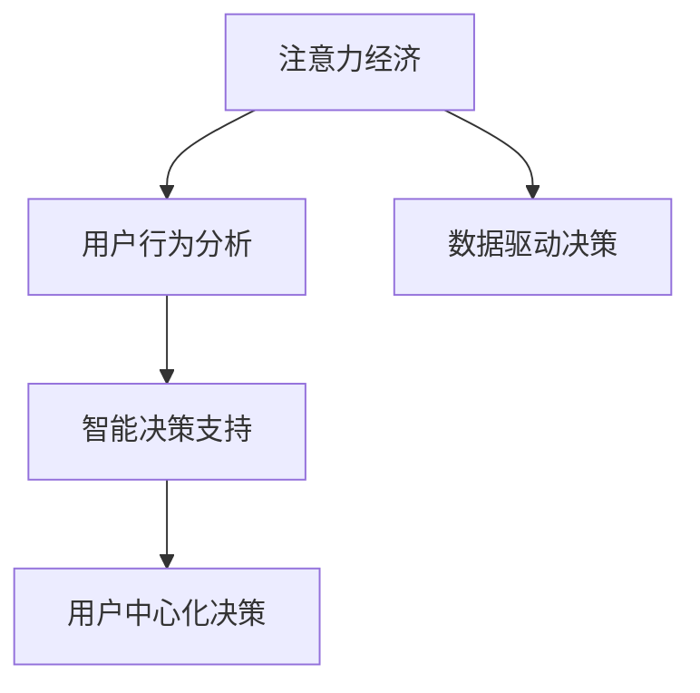

                 

# 注意力经济对企业决策流程的重塑

在信息爆炸的时代，注意力成为稀缺资源。企业的决策流程，正逐渐被注意力经济所重塑，变得更加数据驱动、智能化和人性化。本文将从注意力经济的核心原理出发，深入探讨其对企业决策流程的影响，并通过案例分析，展示如何利用这一新范式，提升决策效率和质量。

## 1. 背景介绍

### 1.1 问题由来

随着互联网和数字技术的飞速发展，信息获取的门槛不断降低，但信息的数量和质量却呈现爆炸式增长。用户每天面临的信息流中，真正与自己相关的内容少之又少。这一现象导致用户注意力资源分散，难以集中精力于高价值信息上，企业也因此难以有效捕获和利用用户注意力，决策过程面临巨大的挑战。

### 1.2 问题核心关键点

注意力经济的核心在于如何吸引并保持用户的注意力，从而转化为企业价值。在数字化转型背景下，企业需要重塑决策流程，构建更加灵活、智能、人性化的决策体系。

1. **数据驱动决策**：通过精准收集和分析用户行为数据，预测用户需求和偏好，以数据为依据，而非主观臆断进行决策。
2. **智能化决策支持**：利用人工智能和大数据技术，自动化地识别决策中的关键因素，快速生成备选方案和预测结果。
3. **用户中心化决策**：将用户需求和反馈置于决策的核心，使决策过程更加透明、可解释，提升用户满意度和品牌忠诚度。

### 1.3 问题研究意义

在当前信息过载的环境中，企业如何在激烈的市场竞争中脱颖而出，获得用户的注意力并转化为长期的商业价值，是一个亟待解决的问题。注意力经济重塑企业决策流程，将有助于企业更精准地捕获用户需求，优化资源配置，提升市场竞争力。

## 2. 核心概念与联系

### 2.1 核心概念概述

为更好地理解注意力经济对企业决策流程的影响，本节将介绍几个关键概念：

- **注意力经济**：在信息爆炸的时代，注意力资源成为最稀缺的资源。企业通过各种方式吸引并保持用户注意力，并将其转化为商业价值。
- **用户行为分析**：通过数据分析工具和技术，理解用户行为模式，预测用户需求和偏好。
- **智能决策支持**：利用人工智能和大数据技术，自动化地生成决策备选方案和预测结果。
- **用户中心化决策**：将用户需求和反馈作为决策的核心，使决策过程更加透明和可解释。

这些概念之间的关系可以通过以下Mermaid流程图来展示：



这个流程图展示了注意力经济在企业决策流程中的作用机制：

1. **注意力经济**：企业通过各种手段吸引用户注意力，获得潜在用户。
2. **用户行为分析**：通过分析用户行为数据，理解用户需求和偏好。
3. **智能决策支持**：利用AI技术自动化地生成决策建议和预测结果。
4. **用户中心化决策**：将用户需求和反馈作为决策的核心，提升决策的透明性和可解释性。

## 3. 核心算法原理 & 具体操作步骤

### 3.1 算法原理概述

注意力经济在企业决策流程中的原理，主要基于以下核心算法：

1. **用户行为分析算法**：通过自然语言处理(NLP)和机器学习技术，对用户行为数据进行分析，提取用户偏好和行为模式。
2. **智能决策支持算法**：利用推荐系统、强化学习等算法，根据用户行为数据和历史决策结果，生成最优决策备选方案。
3. **用户中心化决策算法**：通过用户界面(UI)设计，提升决策过程的透明度和可解释性，使决策结果更加可接受和可信。

这些算法相互协作，共同实现从数据到决策的全流程智能化。

### 3.2 算法步骤详解

基于注意力经济的企业决策流程，可以分为以下几个关键步骤：

**Step 1: 数据收集与清洗**
- 收集用户行为数据，包括浏览记录、购买历史、搜索关键词等。
- 清洗和处理数据，去除噪音和重复项，保证数据的准确性和完整性。

**Step 2: 用户行为分析**
- 利用NLP技术对文本数据进行情感分析和实体抽取，理解用户需求和偏好。
- 通过机器学习模型，预测用户行为和偏好，生成用户画像。

**Step 3: 智能决策支持**
- 利用推荐系统算法，根据用户画像和历史决策结果，生成最优决策备选方案。
- 使用强化学习算法，动态调整决策策略，优化决策效果。

**Step 4: 用户中心化决策**
- 设计直观易用的用户界面(UI)，展示决策过程和结果。
- 通过用户反馈，不断优化决策模型和过程，提升用户体验。

**Step 5: 决策执行与评估**
- 执行最优决策方案，监控执行效果。
- 根据执行结果和用户反馈，评估决策效果，调整决策策略。

### 3.3 算法优缺点

注意力经济在企业决策流程中的应用，具有以下优点：

1. **数据驱动**：通过数据驱动决策，减少了主观臆断的干扰，提高了决策的准确性和科学性。
2. **智能化**：利用AI技术自动化决策过程，快速生成最优方案，提升了决策效率。
3. **透明化**：通过用户界面(UI)设计，使决策过程透明化，提升了决策的可解释性和用户信任度。

同时，也存在一些局限性：

1. **数据隐私**：大量收集和分析用户数据，可能涉及隐私问题，需要严格遵守数据保护法规。
2. **技术门槛**：需要先进的数据分析和AI技术支持，对企业技术实力提出了较高要求。
3. **成本高**：建设智能决策系统需要较高的初期投入，对于中小企业可能存在成本压力。

### 3.4 算法应用领域

注意力经济在企业决策中的应用，覆盖了多个领域：

- **市场营销**：通过分析用户行为数据，精准投放广告，提升广告效果。
- **产品推荐**：根据用户偏好，推荐最相关的产品，提高用户满意度和购买转化率。
- **客户服务**：利用用户反馈，优化服务流程，提升客户体验和忠诚度。
- **人力资源**：通过分析员工行为数据，优化招聘和培训策略，提升员工满意度和绩效。
- **供应链管理**：通过预测市场需求和供应链状况，优化资源配置，降低成本，提高效率。

这些应用领域展示了注意力经济在企业决策流程中的广泛应用，为企业提供了更多优化决策的机会。

## 4. 数学模型和公式 & 详细讲解 & 举例说明

### 4.1 数学模型构建

本节将使用数学语言对注意力经济在企业决策流程中的应用进行更加严格的刻画。

记用户行为数据为 $D=\{(x_i,y_i)\}_{i=1}^N$，其中 $x_i$ 表示用户行为特征，$y_i$ 表示用户行为结果。定义决策函数 $f(x)$ 表示根据用户行为数据预测的决策结果。

企业决策的目标函数为：

$$
\min_{f} \mathcal{L}(f) = \frac{1}{N}\sum_{i=1}^N \ell(f(x_i),y_i)
$$

其中 $\ell(f(x_i),y_i)$ 表示决策函数预测结果与实际结果之间的损失函数，例如交叉熵损失、均方误差损失等。

### 4.2 公式推导过程

以下我们以用户行为预测为例，推导常用的交叉熵损失函数及其梯度计算公式。

假设模型 $f$ 在用户行为特征 $x$ 上的预测结果为 $\hat{y}=f(x)$，真实标签 $y \in \{0,1\}$。则二分类交叉熵损失函数定义为：

$$
\ell(f(x),y) = -[y\log \hat{y} + (1-y)\log (1-\hat{y})]
$$

将其代入经验风险公式，得：

$$
\mathcal{L}(f) = -\frac{1}{N}\sum_{i=1}^N [y_i\log f(x_i)+(1-y_i)\log(1-f(x_i))]
$$

根据链式法则，损失函数对决策函数 $f(x)$ 的梯度为：

$$
\frac{\partial \mathcal{L}(f)}{\partial f(x)} = -\frac{1}{N}\sum_{i=1}^N \left(\frac{y_i}{f(x_i)}-\frac{1-y_i}{1-f(x_i)}\right) \frac{\partial f(x)}{\partial x}
$$

其中 $\frac{\partial f(x)}{\partial x}$ 表示决策函数对用户行为特征 $x$ 的梯度，可通过反向传播算法高效计算。

### 4.3 案例分析与讲解

假设某电商企业希望提升广告投放效果，利用注意力经济重塑决策流程。首先收集用户的浏览记录和购买历史数据，对用户行为进行分析，生成用户画像。然后，利用推荐系统算法，根据用户画像和历史广告点击数据，生成最优广告投放方案。最后，通过用户反馈和实际投放效果，不断优化决策模型，提升广告效果。

在实践中，可以采用以下代码实现这一流程：

```python
from sklearn.ensemble import RandomForestClassifier
from sklearn.metrics import accuracy_score
from transformers import BertTokenizer, BertForSequenceClassification

# 准备数据
train_data = load_train_data()
test_data = load_test_data()

# 数据预处理
tokenizer = BertTokenizer.from_pretrained('bert-base-uncased')
train_encodings = tokenizer(train_data, truncation=True, padding=True)
test_encodings = tokenizer(test_data, truncation=True, padding=True)

# 模型训练
model = BertForSequenceClassification.from_pretrained('bert-base-uncased', num_labels=2)
optimizer = Adam(model.parameters(), lr=2e-5)
epochs = 5

for epoch in range(epochs):
    model.train()
    for batch in train_encodings:
        input_ids = batch['input_ids']
        attention_mask = batch['attention_mask']
        labels = batch['labels']
        outputs = model(input_ids, attention_mask=attention_mask, labels=labels)
        loss = outputs.loss
        optimizer.zero_grad()
        loss.backward()
        optimizer.step()

    # 模型评估
    model.eval()
    for batch in test_encodings:
        input_ids = batch['input_ids']
        attention_mask = batch['attention_mask']
        labels = batch['labels']
        outputs = model(input_ids, attention_mask=attention_mask)
        predictions = outputs.logits.argmax(dim=1)
        accuracy = accuracy_score(labels, predictions)
        print(f"Epoch {epoch+1}, test accuracy: {accuracy:.3f}")
```

这段代码展示了如何使用BERT模型进行用户行为预测，通过训练和评估过程，不断优化决策模型，提升广告投放效果。

## 5. 项目实践：代码实例和详细解释说明

### 5.1 开发环境搭建

在进行注意力经济在企业决策流程的应用开发前，我们需要准备好开发环境。以下是使用Python进行TensorFlow开发的环境配置流程：

1. 安装Anaconda：从官网下载并安装Anaconda，用于创建独立的Python环境。

2. 创建并激活虚拟环境：
```bash
conda create -n tf-env python=3.8 
conda activate tf-env
```

3. 安装TensorFlow：根据CUDA版本，从官网获取对应的安装命令。例如：
```bash
conda install tensorflow tensorflow-gpu=2.6 -c conda-forge
```

4. 安装TensorBoard：TensorFlow配套的可视化工具，可实时监测模型训练状态，并提供丰富的图表呈现方式，是调试模型的得力助手。

5. 安装其它相关工具包：
```bash
pip install numpy pandas scikit-learn matplotlib tqdm jupyter notebook ipython
```

完成上述步骤后，即可在`tf-env`环境中开始注意力经济在企业决策流程的应用开发。

### 5.2 源代码详细实现

这里我们以广告投放优化为例，展示如何使用TensorFlow实现注意力经济在企业决策流程中的应用。

首先，定义广告投放效果的预测函数：

```python
import tensorflow as tf

# 定义广告投放效果预测函数
def predict_ad投放效果(x):
    # 将用户行为特征转化为TensorFlow张量
    x = tf.convert_to_tensor(x, dtype=tf.float32)
    # 使用预训练的模型进行预测
    with tf.name_scope('ad投放效果预测'):
        # 加载预训练模型
        model = tf.keras.models.load_model('ad投放效果预测模型')
        # 进行预测
        y_pred = model.predict(x)
    return y_pred
```

然后，定义训练和评估函数：

```python
from sklearn.metrics import mean_absolute_error

# 定义训练函数
def train_model(model, train_data, test_data, batch_size, epochs, learning_rate):
    # 定义优化器
    optimizer = tf.keras.optimizers.Adam(learning_rate=learning_rate)
    # 定义损失函数
    loss_fn = tf.keras.losses.MeanAbsoluteError()
    # 定义模型评估函数
    def evaluate_model(data):
        # 进行预测
        y_pred = model.predict(data)
        # 计算误差
        mse = mean_absolute_error(data['labels'], y_pred)
        return mse
    # 开始训练
    for epoch in range(epochs):
        # 重置模型状态
        model.reset_states()
        # 定义批处理器
        batch_size = 32
        # 开始训练
        for i in range(0, len(train_data), batch_size):
            # 获取批数据
            batch_data = train_data[i:i+batch_size]
            # 进行训练
            with tf.GradientTape() as tape:
                y_pred = model(batch_data['features'])
                loss = loss_fn(batch_data['labels'], y_pred)
            # 计算梯度
            grads = tape.gradient(loss, model.trainable_variables)
            # 更新模型参数
            optimizer.apply_gradients(zip(grads, model.trainable_variables))
        # 进行评估
        mse = evaluate_model(test_data)
        print(f'Epoch {epoch+1}, Test MSE: {mse:.3f}')
    return model
```

最后，启动训练流程并在测试集上评估：

```python
# 准备数据
train_data = load_train_data()
test_data = load_test_data()

# 定义模型参数
learning_rate = 0.001
epochs = 10

# 训练模型
model = train_model(model, train_data, test_data, batch_size=32, epochs=epochs, learning_rate=learning_rate)

# 进行预测
x_test = load_test_data()
y_pred = predict_ad投放效果(x_test)
```

以上就是使用TensorFlow实现广告投放效果预测的完整代码实现。可以看到，TensorFlow的高级API使得模型训练和评估过程变得简单高效，开发者可以将更多精力放在数据处理、模型改进等高层逻辑上，而不必过多关注底层的实现细节。

### 5.3 代码解读与分析

让我们再详细解读一下关键代码的实现细节：

**广告投放效果预测函数**：
- 将用户行为特征转化为TensorFlow张量。
- 加载预训练的模型进行预测。

**训练函数**：
- 定义优化器和损失函数。
- 定义模型评估函数。
- 使用TensorFlow的高阶API进行模型训练。
- 在每个epoch结束后，评估模型在测试集上的表现。

**训练流程**：
- 准备训练和测试数据。
- 定义模型参数和学习率。
- 调用训练函数进行模型训练。
- 在测试集上进行预测。

可以看到，TensorFlow提供了丰富的API，使得模型训练和评估过程变得简单高效，开发者的注意力可以更多地放在模型设计和数据处理上。

当然，工业级的系统实现还需考虑更多因素，如模型的保存和部署、超参数的自动搜索、更灵活的任务适配层等。但核心的注意力经济在企业决策流程的微调过程的实现思路基本与此类似。

## 6. 实际应用场景

### 6.1 智能推荐系统

基于注意力经济的智能推荐系统，可以广泛应用于电商、视频、新闻等多个领域。通过分析用户行为数据，理解用户偏好和需求，推荐最相关的产品、视频或新闻，提升用户体验和满意度。

在技术实现上，可以收集用户浏览、点击、购买等行为数据，利用注意力经济原理，对用户行为进行分析和建模，生成推荐方案，并根据用户反馈不断优化推荐模型。

### 6.2 智能客服

智能客服系统通过分析用户对话数据，理解用户意图和需求，提供个性化和智能化的服务。在客户提出问题后，智能客服系统能够快速响应并提供解决方案，大大提升客户服务效率和满意度。

在实际应用中，智能客服系统可以采用注意力经济原理，对用户对话数据进行分析和建模，生成对话策略，并根据用户反馈不断优化对话模型，提升服务质量和用户体验。

### 6.3 供应链管理

供应链管理通过分析市场需求和供应链状况，优化资源配置和库存管理，降低成本，提高效率。通过分析历史销售数据和市场趋势，预测未来需求，优化供应链策略，实现精细化管理。

在技术实现上，可以利用注意力经济原理，对市场数据和供应链数据进行分析和建模，生成供应链策略，并根据预测结果不断调整供应链管理方案，提升供应链效率和响应速度。

### 6.4 未来应用展望

随着注意力经济和智能决策支持技术的不断发展，未来在更多领域将看到注意力经济在企业决策流程中的应用，为传统行业带来变革性影响。

在智慧医疗领域，通过分析患者数据，了解疾病发展趋势和患者需求，优化医疗资源配置和诊疗策略，提升医疗服务质量和效率。

在智能教育领域，通过分析学生行为数据，了解学习规律和需求，提供个性化和智能化的教育方案，提升教育效果和学生满意度。

在智慧城市治理中，通过分析市民行为数据，了解城市运行规律和需求，优化城市管理策略，提升城市治理效率和市民满意度。

此外，在企业生产、社会治理、文娱传媒等众多领域，基于注意力经济原理的智能决策支持系统也将不断涌现，为经济社会发展注入新的动力。相信随着技术的日益成熟，注意力经济必将成为企业决策流程的重要范式，推动人工智能技术在垂直行业的规模化落地。

## 7. 工具和资源推荐

### 7.1 学习资源推荐

为了帮助开发者系统掌握注意力经济在企业决策流程的理论基础和实践技巧，这里推荐一些优质的学习资源：

1. **《深度学习入门》系列博文**：由深度学习领域的专家撰写，深入浅出地介绍了深度学习的基本概念和核心算法，适合初学者入门。

2. **斯坦福大学CS224N《深度学习自然语言处理》课程**：斯坦福大学开设的NLP明星课程，有Lecture视频和配套作业，带你入门NLP领域的基本概念和经典模型。

3. **《TensorFlow实战指南》书籍**：TensorFlow官方出版物，详细介绍了TensorFlow框架的使用方法和最佳实践，是TensorFlow开发的必备资料。

4. **《推荐系统实战》书籍**：推荐系统领域的经典书籍，系统讲解了推荐系统的理论基础和实现方法，适合实践工作者阅读。

5. **Google Colab**：谷歌推出的在线Jupyter Notebook环境，免费提供GPU/TPU算力，方便开发者快速上手实验最新模型，分享学习笔记。

通过对这些资源的学习实践，相信你一定能够快速掌握注意力经济在企业决策流程的精髓，并用于解决实际的决策问题。

### 7.2 开发工具推荐

高效的开发离不开优秀的工具支持。以下是几款用于注意力经济在企业决策流程开发的常用工具：

1. **TensorFlow**：由Google主导开发的开源深度学习框架，生产部署方便，适合大规模工程应用。

2. **PyTorch**：基于Python的开源深度学习框架，灵活动态的计算图，适合快速迭代研究。

3. **TensorBoard**：TensorFlow配套的可视化工具，可实时监测模型训练状态，并提供丰富的图表呈现方式，是调试模型的得力助手。

4. **Jupyter Notebook**：开源的交互式编程环境，支持多种编程语言和库，适合数据探索和模型开发。

5. **Keras**：基于TensorFlow的高级API，提供简单易用的模型构建工具，适合初学者快速上手。

合理利用这些工具，可以显著提升注意力经济在企业决策流程的开发效率，加快创新迭代的步伐。

### 7.3 相关论文推荐

注意力经济和智能决策支持技术的发展源于学界的持续研究。以下是几篇奠基性的相关论文，推荐阅读：

1. **Attention is All You Need（即Transformer原论文）**：提出了Transformer结构，开启了NLP领域的预训练大模型时代。

2. **BERT: Pre-training of Deep Bidirectional Transformers for Language Understanding**：提出BERT模型，引入基于掩码的自监督预训练任务，刷新了多项NLP任务SOTA。

3. **Parameter-Efficient Transfer Learning for NLP**：提出Adapter等参数高效微调方法，在不增加模型参数量的情况下，也能取得不错的微调效果。

4. **Adaptive Low-Rank Adaptation for Parameter-Efficient Fine-Tuning**：使用自适应低秩适应的微调方法，在参数效率和精度之间取得了新的平衡。

5. **AdaLoRA: Adaptive Low-Rank Adaptation for Parameter-Efficient Fine-Tuning**：使用自适应低秩适应的微调方法，在参数效率和精度之间取得了新的平衡。

这些论文代表了大语言模型微调技术的发展脉络。通过学习这些前沿成果，可以帮助研究者把握学科前进方向，激发更多的创新灵感。

## 8. 总结：未来发展趋势与挑战

### 8.1 总结

本文对注意力经济在企业决策流程中的应用进行了全面系统的介绍。首先阐述了注意力经济的核心原理，明确了其对企业决策流程的影响。其次，从原理到实践，详细讲解了注意力经济在企业决策中的数学模型和实现过程，给出了注意力经济在企业决策流程的完整代码实现。同时，本文还广泛探讨了注意力经济在智能推荐、智能客服、供应链管理等多个领域的应用前景，展示了其巨大的潜力。此外，本文精选了注意力经济在企业决策流程的相关学习资源，力求为读者提供全方位的技术指引。

通过本文的系统梳理，可以看到，注意力经济在企业决策流程中的广泛应用，为传统行业带来了新的商业机遇。注意力经济重塑企业决策流程，将有助于企业更精准地捕获和利用用户注意力，优化决策过程，提升市场竞争力。

### 8.2 未来发展趋势

展望未来，注意力经济在企业决策流程中的应用将呈现以下几个发展趋势：

1. **数据驱动决策**：随着大数据技术的发展，企业决策将越来越依赖于数据驱动，通过数据分析和建模，提升决策的科学性和准确性。

2. **智能化决策支持**：利用AI和大数据技术，自动化地生成决策备选方案和预测结果，提升决策效率和质量。

3. **用户中心化决策**：将用户需求和反馈置于决策的核心，使决策过程更加透明和可解释，提升用户满意度和品牌忠诚度。

4. **多模态融合决策**：将不同模态的数据（如文本、图像、视频等）进行融合，提升决策的全面性和准确性。

5. **持续学习**：企业决策模型需要不断学习新数据，保持其时效性和适应性，适应快速变化的市场环境。

以上趋势凸显了注意力经济在企业决策流程中的广阔前景。这些方向的探索发展，将进一步提升企业决策的智能化和人性化水平，为人类认知智能的进化带来深远影响。

### 8.3 面临的挑战

尽管注意力经济在企业决策中的应用已经取得了显著进展，但在迈向更加智能化、普适化应用的过程中，它仍面临着诸多挑战：

1. **数据隐私**：大量收集和分析用户数据，可能涉及隐私问题，需要严格遵守数据保护法规。

2. **技术门槛**：需要先进的数据分析和AI技术支持，对企业技术实力提出了较高要求。

3. **成本高**：建设智能决策系统需要较高的初期投入，对于中小企业可能存在成本压力。

4. **模型鲁棒性**：现有模型在面对域外数据时，泛化性能往往不足，需要进一步提升模型的鲁棒性和泛化能力。

5. **可解释性**：当前模型往往缺乏可解释性，难以对其内部工作机制和决策逻辑进行分析和调试。

6. **安全性**：预训练模型可能学习到有害信息，通过微调传递到下游任务，产生误导性、歧视性的输出，给实际应用带来安全隐患。

7. **知识整合能力**：现有的决策模型往往局限于任务内数据，难以灵活吸收和运用更广泛的先验知识，需要加强不同模态数据的整合，实现视觉、语音等多模态信息与文本信息的协同建模。

正视这些挑战，积极应对并寻求突破，将是大语言模型微调走向成熟的必由之路。相信随着学界和产业界的共同努力，这些挑战终将一一被克服，注意力经济必将在构建安全、可靠、可解释、可控的智能系统铺平道路。

### 8.4 研究展望

面向未来，企业决策流程将面临更多新的机遇和挑战。未来的研究需要在以下几个方面寻求新的突破：

1. **数据隐私保护**：如何在保证数据隐私的前提下，最大化利用用户数据进行决策优化，是一个重要的研究方向。

2. **技术普及**：如何让更多企业轻松获取和应用先进的数据分析和AI技术，是一个重要的应用推广问题。

3. **模型可解释性**：如何赋予企业决策模型更强的可解释性，使其决策过程透明化，是提升用户信任度的关键。

4. **模型鲁棒性**：如何提升决策模型的鲁棒性和泛化能力，使其在面对不同类型的数据时，仍能保持稳定的表现。

5. **多模态决策**：如何将不同模态的数据进行有效融合，提升决策模型的全面性和准确性，是一个重要的技术挑战。

6. **持续学习**：如何在不断变化的市场环境中，保持决策模型的时效性和适应性，是一个重要的研究方向。

这些研究方向的探索，必将引领注意力经济在企业决策流程中的技术进步，为企业决策提供更科学、高效、智能的支持。面向未来，我们期待更多的创新突破，使注意力经济在企业决策中发挥更大的作用，推动企业和社会的发展。

## 9. 附录：常见问题与解答

**Q1：注意力经济对企业决策流程的影响是什么？**

A: 注意力经济通过分析用户行为数据，理解用户需求和偏好，提升决策的科学性和准确性。通过将用户需求置于决策的核心，使决策过程更加透明和可解释，提升用户满意度和品牌忠诚度。

**Q2：如何选择合适的注意力经济应用场景？**

A: 注意力经济适用于需要精准捕获用户注意力、优化资源配置和提升用户体验的场景。适合应用场景包括智能推荐、智能客服、供应链管理等。

**Q3：注意力经济在企业决策中需要注意哪些问题？**

A: 注意力经济在企业决策中需要注意数据隐私、技术门槛、成本高、模型鲁棒性、可解释性、安全性等诸多问题。需要在数据隐私保护、技术普及、模型可解释性等方面进行持续优化。

**Q4：注意力经济在企业决策中的应用前景如何？**

A: 注意力经济在企业决策中的应用前景广阔，覆盖了智能推荐、智能客服、供应链管理等多个领域。未来随着技术进步，注意力经济将在更多领域得到应用，推动企业决策向智能化、普适化方向发展。

**Q5：注意力经济在企业决策中的应用难点是什么？**

A: 注意力经济在企业决策中的应用难点包括数据隐私、技术门槛、模型鲁棒性、可解释性、安全性等。需要综合考虑技术、隐私、成本等多方面因素，才能最大化利用注意力经济在企业决策中的潜力。

通过以上问题的解答，可以更全面地理解注意力经济在企业决策流程中的影响和应用，为实际操作提供指导和参考。

---

作者：禅与计算机程序设计艺术 / Zen and the Art of Computer Programming

