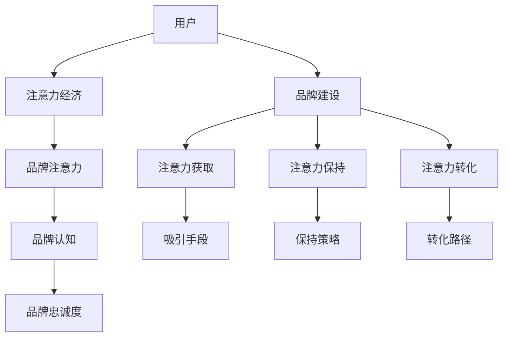

                 

# 注意力经济对企业品牌建设的新挑战

## 1. 背景介绍

在信息爆炸的时代，企业所面临的市场竞争愈发激烈。传统的产品和市场策略逐渐失效，消费者对品牌的认知和忠诚度也面临严峻挑战。这其中，注意力经济的影响不容小觑。品牌建设正处于转型的关键时期，如何有效利用注意力经济，抓住用户的关注点，成为了企业品牌战略的重要课题。

### 1.1 问题由来
随着数字经济的发展，信息传播的渠道和方式发生了巨大变化。从电视、报纸到互联网、社交媒体，消费者获取信息的途径愈加多元化和碎片化。在这过程中，企业品牌建设面临着前所未有的挑战。如何在充斥着大量噪音的信息环境中脱颖而出，成为品牌竞争的关键。

### 1.2 问题核心关键点
注意力经济的核心在于如何通过各种手段吸引和保持消费者的关注。品牌建设不仅是产品质量和服务的提升，更在于如何让用户"看到"和"记住"品牌。这其中涉及到以下几个核心关键点：

- **注意力获取**：如何吸引用户的注意力，使其注意到品牌的存在。
- **注意力保持**：如何在用户注意后，持续保持其关注，避免信息过载导致的用户疲劳。
- **注意力转化**：如何通过持续关注，最终实现品牌忠诚度和消费者购买的转化。

### 1.3 问题研究意义
研究注意力经济对企业品牌建设的影响，具有重要的理论和实践意义：

1. **理论意义**：通过深入分析注意力经济与品牌建设的关系，可以为品牌管理理论的进一步发展提供支持。
2. **实践意义**：帮助企业在品牌建设中，充分利用注意力经济的特点，设计更具吸引力和持久性的品牌策略。
3. **创新意义**：结合新兴技术，如大数据、AI等，探索品牌建设的新路径，推动品牌管理的现代化。

## 2. 核心概念与联系

### 2.1 核心概念概述

注意力经济（Economy of Attention）是指在信息过载时代，用户对信息的关注成为一种稀缺资源，企业需要通过各种手段争夺这种资源，从而提升自身的市场竞争力和品牌价值。以下是几个核心概念：

- **注意力经济**：用户对信息的关注度和使用频率。
- **品牌注意力**：用户对品牌的关注和认知。
- **品牌认知**：用户对品牌的基本了解和认可程度。
- **品牌忠诚度**：用户对品牌的持续关注和长期支持。

这些概念之间存在紧密的联系，通过有效的注意力管理，可以提升品牌认知和忠诚度，从而实现品牌建设的最终目标。

### 2.2 核心概念原理和架构的 Mermaid 流程图



这个流程图展示了用户、注意力经济、品牌注意力、品牌认知和品牌忠诚度之间的关系，以及品牌建设对注意力获取、保持和转化过程的影响。

## 3. 核心算法原理 & 具体操作步骤
### 3.1 算法原理概述

品牌建设的核心在于吸引和保持用户对品牌的关注，并最终转化为品牌的忠诚度。因此，注意力经济对品牌建设的影响主要体现在以下几个方面：

1. **注意力获取**：通过各种手段吸引用户的注意力，如广告、营销活动等。
2. **注意力保持**：通过持续互动和内容更新，保持用户的长期关注。
3. **注意力转化**：通过产品或服务的优质体验，将用户的关注转化为品牌忠诚度。

### 3.2 算法步骤详解

品牌建设的注意力经济模型可以大致分为以下几个步骤：

**Step 1: 用户画像构建**
- 收集用户的基本信息、兴趣偏好、行为数据等，构建详细的用户画像。
- 利用大数据分析技术，挖掘用户需求和兴趣点，进行精准定位。

**Step 2: 注意力吸引**
- 利用广告投放、社交媒体营销等手段，吸引用户的注意力。
- 设计具有吸引力的品牌视觉和内容，通过视觉和文字的双重刺激，提升用户的第一印象。

**Step 3: 内容创作**
- 创建与品牌价值相符的高质量内容，如博客文章、视频、社交媒体动态等。
- 内容应具有独特性、价值性和时效性，吸引用户持续关注。

**Step 4: 持续互动**
- 通过社交媒体、邮件、客户服务等渠道，与用户保持持续互动。
- 及时响应用户反馈，建立良好的用户关系，提升品牌好感度。

**Step 5: 转化策略**
- 设计和实施有效的转化策略，如促销活动、会员计划等，促进用户购买行为。
- 利用数据分析和A/B测试，不断优化转化路径，提升转化率。

### 3.3 算法优缺点

注意力经济对品牌建设的影响具有以下优点：

1. **提高品牌曝光度**：通过有效的注意力获取手段，提升品牌在用户心中的曝光度，增加品牌认知。
2. **增强品牌信任**：持续的互动和优质内容，有助于建立用户对品牌的信任和依赖，提高品牌忠诚度。
3. **提升品牌价值**：品牌认知和忠诚度的提升，最终转化为品牌价值和市场份额。

同时，注意力经济也存在以下缺点：

1. **成本高**：广告和内容创作成本较高，需要持续投入。
2. **风险大**：过度依赖注意力获取，可能引发用户疲劳，影响品牌印象。
3. **转化率低**：如果内容或互动设计不当，用户可能失去兴趣，转化率不高。

### 3.4 算法应用领域

注意力经济对品牌建设的应用领域广泛，包括但不限于以下几个方面：

- **在线零售**：通过精准的广告和个性化推荐，吸引和保持用户关注，提升销量。
- **消费电子**：通过社交媒体和产品测评，提升品牌形象，增加用户粘性。
- **旅游服务**：通过优质的旅行分享和用户互动，吸引潜在客户，提高预订率。
- **金融服务**：通过金融教育内容和互动，建立品牌信任，促进金融产品的销售。
- **时尚品牌**：通过时尚资讯和搭配建议，吸引用户关注，提升品牌影响力。

## 4. 数学模型和公式 & 详细讲解 & 举例说明

### 4.1 数学模型构建

品牌建设的注意力经济模型可以通过以下数学模型进行描述：

设 $A_t$ 为第 $t$ 时刻用户的注意力值，$C_t$ 为品牌的认知度，$L_t$ 为品牌的忠诚度，$E_t$ 为用户对品牌的情感值。

品牌建设的目标是最大化品牌的忠诚度 $L_t$，即：

$$
\max_{A_t, C_t, L_t, E_t} L_t
$$

其中 $L_t$ 与 $A_t$、$C_t$、$E_t$ 之间存在以下关系：

$$
L_t = f(A_t, C_t, E_t)
$$

### 4.2 公式推导过程

通过上述数学模型，我们可以进一步推导出品牌建设的具体公式。以在线零售为例，品牌的认知度 $C_t$ 可以通过以下公式计算：

$$
C_t = \alpha A_t + \beta L_{t-1} + \gamma E_t
$$

其中 $\alpha$、$\beta$、$\gamma$ 为系数，分别表示注意力获取、忠诚度反馈和情感对认知度的影响程度。

品牌的情感值 $E_t$ 可以表示为：

$$
E_t = \delta \times A_t - \epsilon \times C_t
$$

其中 $\delta$、$\epsilon$ 为系数，分别表示注意力提升情感值、认知度降低情感值的效果。

将上述公式代入品牌忠诚度的计算公式中，可以得到：

$$
L_t = f(\alpha A_t + \beta L_{t-1} + \gamma (\delta A_t - \epsilon C_t), C_t)
$$

### 4.3 案例分析与讲解

假设某电商平台利用广告和内容创作吸引了大量用户的关注，并通过互动和个性化推荐提升了品牌认知度和情感值。品牌忠诚度的变化可以通过以下数据分析得到：

- 广告投放期，$A_t$ 增加，$E_t$ 增加，$C_t$ 增加。
- 互动和推荐期，$A_t$ 减少，但$C_t$ 和$E_t$ 持续增加。
- 促销活动期，$C_t$ 和$E_t$ 进一步增加，$L_t$ 提升。

通过对不同阶段数据的分析，可以优化广告和内容策略，提升品牌忠诚度。

## 5. 项目实践：代码实例和详细解释说明
### 5.1 开发环境搭建

在进行品牌建设的注意力经济模型实践前，我们需要准备好开发环境。以下是使用Python进行数据分析和可视化的环境配置流程：

1. 安装Anaconda：从官网下载并安装Anaconda，用于创建独立的Python环境。

2. 创建并激活虚拟环境：
```bash
conda create -n attention-env python=3.8 
conda activate attention-env
```

3. 安装必要的Python库：
```bash
conda install pandas numpy matplotlib seaborn jupyter notebook
```

4. 安装可视化工具：
```bash
conda install matplotlib seaborn jupyterlab nbextension
```

完成上述步骤后，即可在`attention-env`环境中开始品牌建设的注意力经济模型实践。

### 5.2 源代码详细实现

以下是使用Python和Pandas库进行品牌建设注意力经济模型实践的代码实现：

```python
import pandas as pd
import matplotlib.pyplot as plt
import numpy as np

# 创建模拟数据
np.random.seed(123)
n_samples = 100
A = np.random.normal(0, 1, n_samples)
C = np.random.normal(0, 1, n_samples)
E = np.random.normal(0, 1, n_samples)

# 模拟品牌建设过程
ad_period = 20
interact_period = 30
promo_period = 10
attention_coeff = 0.5
recognition_coeff = 0.2
emotion_coeff = 0.3
attention_decay = 0.1
emotion_decay = 0.2

for t in range(n_samples):
    if t < ad_period:
        A[t] += 1
        E[t] += 1
    elif t < ad_period + interact_period:
        A[t] -= 0.1
        C[t] += 0.2
        E[t] += 0.3
    elif t < ad_period + interact_period + promo_period:
        C[t] += 0.5
        E[t] += 1
    else:
        C[t] -= 0.2
        E[t] -= 0.4

# 计算品牌认知度和情感值
C = attention_coeff * A + recognition_coeff * C + emotion_coeff * E
E = emotion_coeff * A - emotion_decay * C

# 计算品牌忠诚度
L = np.zeros_like(A)
for t in range(n_samples):
    if t > 0:
        L[t] = 0.5 * A[t] + 0.3 * L[t-1] + 0.2 * E[t]

# 可视化结果
fig, ax = plt.subplots(figsize=(10, 6))
ax.plot(A, label='Attention')
ax.plot(C, label='Recognition')
ax.plot(L, label='Loyalty')
ax.set_xlabel('Time')
ax.set_ylabel('Value')
ax.set_title('Brand Building Process')
ax.legend()
plt.show()
```

### 5.3 代码解读与分析

代码中，我们首先生成了100个样本的用户注意力值 $A$、品牌认知度 $C$ 和品牌情感值 $E$。然后，通过模拟不同的品牌建设阶段，分别对注意力、认知度和情感值进行更新。最后，根据更新后的值计算品牌的忠诚度 $L$，并通过可视化工具展示结果。

代码的实现过程体现了注意力经济模型在品牌建设中的重要性和实践价值。通过具体的数值模拟和可视化，可以帮助我们更好地理解品牌建设中的注意力获取、保持和转化过程。

## 6. 实际应用场景

### 6.1 智能客服系统

智能客服系统利用注意力经济模型，可以显著提升用户的满意度和忠诚度。通过智能对话机器人，及时响应用户咨询，提供高质量的解决方案，保持用户的长期关注。同时，通过情感分析，识别用户情绪，进一步优化服务体验。

具体而言，智能客服系统可以通过以下步骤实现：

1. **用户画像构建**：通过用户的交互记录，构建详细的用户画像，包括用户的兴趣偏好、历史问题等。
2. **注意力吸引**：利用机器人与用户互动，吸引用户关注。
3. **内容创作**：提供丰富的FAQ和自助指南，增强用户的认知度和情感值。
4. **持续互动**：通过情感分析，调整机器人的回答策略，保持用户的情感正向。
5. **转化策略**：提供额外的优惠和服务，促进用户转化。

### 6.2 电子商务平台

电子商务平台利用注意力经济模型，可以通过个性化推荐和广告投放，吸引和保持用户的关注。平台通过以下步骤实现：

1. **用户画像构建**：收集用户的浏览、购买历史和行为数据，构建详细的用户画像。
2. **注意力吸引**：利用个性化广告和推荐，吸引用户的注意力。
3. **内容创作**：提供丰富的产品信息和用户评价，增强用户的认知度和情感值。
4. **持续互动**：通过客户服务和在线客服，保持用户的长期关注。
5. **转化策略**：提供限时优惠和个性化推荐，促进用户购买转化。

### 6.3 社交媒体平台

社交媒体平台利用注意力经济模型，可以通过内容创作和互动，吸引和保持用户的关注。平台通过以下步骤实现：

1. **用户画像构建**：收集用户的兴趣偏好和互动数据，构建详细的用户画像。
2. **注意力吸引**：利用高质量的内容和互动活动，吸引用户的注意力。
3. **内容创作**：提供有趣和有价值的内容，增强用户的认知度和情感值。
4. **持续互动**：通过社区功能和用户评论，保持用户的长期关注。
5. **转化策略**：通过广告和推荐，促进用户的关注和转化。

### 6.4 未来应用展望

随着大数据和AI技术的发展，注意力经济模型在品牌建设中的应用前景广阔。未来，品牌建设的注意力经济模型将可能拓展到以下几个方向：

1. **多渠道整合**：整合线上线下多渠道的注意力获取和保持策略，形成完整的品牌建设生态。
2. **实时数据驱动**：通过实时数据分析和预测，动态调整品牌建设策略，提升效率和效果。
3. **跨领域应用**：拓展到其他行业，如旅游、金融、医疗等，提升品牌在各领域的知名度和忠诚度。
4. **个性化推荐系统**：利用机器学习算法，实现更加精准的个性化推荐，提升用户的满意度和转化率。
5. **情感分析与响应**：通过自然语言处理技术，分析用户情感，动态调整品牌互动策略，增强用户的情感体验。

## 7. 工具和资源推荐
### 7.1 学习资源推荐

为了帮助开发者系统掌握品牌建设中的注意力经济模型，这里推荐一些优质的学习资源：

1. 《品牌管理理论与实践》：全面介绍品牌管理的理论基础和实践技巧，涵盖品牌定位、传播、评估等多个方面。
2. 《数字营销理论与实践》：介绍数字营销的基本概念和策略，重点讲解社交媒体、搜索引擎优化等营销手段。
3. 《大数据与智能营销》：讲解大数据技术在品牌建设和智能营销中的应用，涵盖数据采集、分析、可视化等多个环节。
4. 《AI与品牌营销》：结合AI技术，探讨品牌建设的创新路径，如智能客服、个性化推荐等。
5. 《品牌认知与消费者行为》：从心理学角度，分析消费者的认知和行为模式，指导品牌建设策略的制定。

通过对这些资源的学习实践，相信你一定能够系统掌握品牌建设中的注意力经济模型，并用于解决实际的商业问题。

### 7.2 开发工具推荐

高效的开发离不开优秀的工具支持。以下是几款用于品牌建设注意力经济模型开发的常用工具：

1. Python：作为数据分析和机器学习的主流编程语言，Python具有丰富的库和框架，适合快速迭代研究。
2. Jupyter Notebook：交互式的编程环境，便于代码的编写、测试和分享。
3. R语言：适用于数据分析和可视化，具有强大的统计功能和图形绘制能力。
4. Tableau：数据可视化工具，支持多种数据源和图表类型，便于数据呈现和分析。
5. Google Analytics：网站流量分析工具，可以追踪用户行为和转化路径，优化品牌建设策略。

合理利用这些工具，可以显著提升品牌建设的效率和效果，加速创新迭代的步伐。

### 7.3 相关论文推荐

品牌建设中的注意力经济模型研究，得益于学界的持续探索。以下是几篇奠基性的相关论文，推荐阅读：

1. "The Attention Economy" by Erik Brynjolfsson and Andrew McAfee：分析注意力经济的基本概念和影响，探讨其在品牌建设中的应用。
2. "Brand Building in the Age of Attention" by James McLoughlin：探讨品牌建设中的注意力管理策略，提出基于数据驱动的品牌优化方法。
3. "Digital Branding and the Attention Economy" by Gary Vaynerchuk：结合数字营销实践，分析品牌在注意力经济中的构建和维护。
4. "Brand Loyalty in the Attention Economy" by Michelle McLaughlin：研究品牌忠诚度在注意力经济中的构建和提升，提出针对性的策略和工具。
5. "Brand Building through the Attention Economy" by Pankaj Ghemawat：结合全球化视角，探讨品牌建设在注意力经济中的全球化策略。

这些论文代表了大品牌建设中的注意力经济模型的发展脉络。通过学习这些前沿成果，可以帮助研究者把握学科前进方向，激发更多的创新灵感。

## 8. 总结：未来发展趋势与挑战
### 8.1 总结

本文对品牌建设中的注意力经济模型进行了全面系统的介绍。首先阐述了注意力经济的基本概念和核心关键点，明确了注意力经济在品牌建设中的重要作用。其次，从原理到实践，详细讲解了注意力经济模型在品牌建设中的具体步骤，给出了品牌建设注意力经济模型的完整代码实例。同时，本文还广泛探讨了注意力经济模型在智能客服、电子商务、社交媒体等多个领域的应用前景，展示了注意力经济模型的巨大潜力。此外，本文精选了注意力经济模型的各类学习资源，力求为读者提供全方位的技术指引。

通过本文的系统梳理，可以看到，注意力经济模型在品牌建设中的应用前景广阔，成为品牌竞争的重要手段。利用注意力经济模型，企业可以更有效地吸引和保持用户的关注，提升品牌忠诚度，从而实现品牌价值的最大化。

### 8.2 未来发展趋势

展望未来，品牌建设中的注意力经济模型将呈现以下几个发展趋势：

1. **数据驱动**：通过大数据和AI技术，实现更加精准的用户画像构建和行为分析，优化品牌建设策略。
2. **跨渠道整合**：整合线上线下多渠道的品牌建设资源，形成完整的品牌生态系统。
3. **实时调整**：利用实时数据分析和预测，动态调整品牌建设策略，提升效率和效果。
4. **个性化推荐**：利用机器学习算法，实现更加精准的个性化推荐，提升用户满意度和转化率。
5. **情感分析与响应**：通过自然语言处理技术，分析用户情感，动态调整品牌互动策略，增强用户情感体验。

### 8.3 面临的挑战

尽管品牌建设中的注意力经济模型已经取得了一定成效，但在迈向更加智能化、普适化应用的过程中，它仍面临着诸多挑战：

1. **数据隐私**：在数据收集和分析过程中，如何保护用户隐私和数据安全，是一个重要的挑战。
2. **成本高昂**：品牌建设中的注意力经济模型需要大量的数据和计算资源，成本较高。
3. **用户体验**：品牌建设中的注意力经济模型需要平衡用户需求和品牌推广，避免过度商业化。
4. **策略复杂**：品牌建设中的注意力经济模型涉及多个渠道和环节，策略设计和实施较为复杂。
5. **效果评估**：如何评估注意力经济模型在品牌建设中的效果，是一个复杂而重要的问题。

### 8.4 研究展望

面对品牌建设中的注意力经济模型所面临的挑战，未来的研究需要在以下几个方面寻求新的突破：

1. **数据隐私保护**：研究如何在大数据分析和注意力经济模型中，保护用户隐私和数据安全，确保合规性。
2. **成本优化**：探索成本更低的注意力经济模型实现方式，如分布式计算、边缘计算等，降低品牌建设的成本。
3. **用户体验优化**：研究如何通过注意力经济模型，平衡用户需求和品牌推广，提升用户体验。
4. **策略智能化**：结合AI技术，实现更加智能化的品牌建设策略，提高品牌建设效率。
5. **效果评估方法**：开发更加客观和科学的效果评估方法，帮助品牌建设者更好地评估注意力经济模型的效果。

这些研究方向将推动品牌建设的注意力经济模型迈向更高的台阶，为构建安全、可靠、可解释、可控的智能品牌系统铺平道路。面向未来，品牌建设的注意力经济模型需要与其他人工智能技术进行更深入的融合，如知识表示、因果推理、强化学习等，多路径协同发力，共同推动品牌建设的现代化。

## 9. 附录：常见问题与解答
----------------------------------------------------------------

**Q1：注意力经济对品牌建设有哪些具体影响？**

A: 注意力经济对品牌建设的影响主要体现在以下几个方面：

1. **品牌曝光度提升**：通过有效的注意力获取手段，提升品牌在用户心中的曝光度，增加品牌认知。
2. **品牌信任增强**：持续的互动和优质内容，有助于建立用户对品牌的信任和依赖，提高品牌忠诚度。
3. **品牌价值最大化**：品牌认知和忠诚度的提升，最终转化为品牌价值和市场份额。

**Q2：如何利用注意力经济模型提升品牌忠诚度？**

A: 利用注意力经济模型提升品牌忠诚度，可以从以下几个方面入手：

1. **持续互动**：通过社交媒体、邮件、客户服务等渠道，与用户保持持续互动，增强用户关系。
2. **优质内容**：创建与品牌价值相符的高质量内容，如博客文章、视频、社交媒体动态等，吸引用户持续关注。
3. **个性化推荐**：利用机器学习算法，实现更加精准的个性化推荐，提升用户满意度和转化率。
4. **情感分析**：通过自然语言处理技术，分析用户情感，动态调整品牌互动策略，增强用户情感体验。

**Q3：品牌建设的注意力经济模型有哪些具体应用？**

A: 品牌建设的注意力经济模型可以应用于以下几个具体领域：

1. **在线零售**：通过精准的广告和个性化推荐，吸引和保持用户关注，提升销量。
2. **消费电子**：通过社交媒体和产品测评，提升品牌形象，增加用户粘性。
3. **旅游服务**：通过优质的旅行分享和用户互动，吸引潜在客户，提高预订率。
4. **金融服务**：通过金融教育内容和互动，建立品牌信任，促进金融产品的销售。
5. **时尚品牌**：通过时尚资讯和搭配建议，吸引用户关注，提升品牌影响力。

**Q4：注意力经济模型在品牌建设中面临哪些挑战？**

A: 注意力经济模型在品牌建设中面临以下挑战：

1. **数据隐私**：在数据收集和分析过程中，如何保护用户隐私和数据安全，是一个重要的挑战。
2. **成本高昂**：品牌建设中的注意力经济模型需要大量的数据和计算资源，成本较高。
3. **用户体验**：品牌建设中的注意力经济模型需要平衡用户需求和品牌推广，避免过度商业化。
4. **策略复杂**：品牌建设中的注意力经济模型涉及多个渠道和环节，策略设计和实施较为复杂。
5. **效果评估**：如何评估注意力经济模型在品牌建设中的效果，是一个复杂而重要的问题。

**Q5：未来品牌建设的注意力经济模型有哪些新趋势？**

A: 未来品牌建设的注意力经济模型将可能拓展到以下几个方向：

1. **数据驱动**：通过大数据和AI技术，实现更加精准的用户画像构建和行为分析，优化品牌建设策略。
2. **跨渠道整合**：整合线上线下多渠道的品牌建设资源，形成完整的品牌生态系统。
3. **实时调整**：利用实时数据分析和预测，动态调整品牌建设策略，提升效率和效果。
4. **个性化推荐**：利用机器学习算法，实现更加精准的个性化推荐，提升用户满意度和转化率。
5. **情感分析与响应**：通过自然语言处理技术，分析用户情感，动态调整品牌互动策略，增强用户情感体验。

通过本文的系统梳理，可以看到，品牌建设中的注意力经济模型在未来的发展前景广阔，成为品牌竞争的重要手段。利用注意力经济模型，企业可以更有效地吸引和保持用户的关注，提升品牌忠诚度，从而实现品牌价值的最大化。

---

作者：禅与计算机程序设计艺术 / Zen and the Art of Computer Programming

