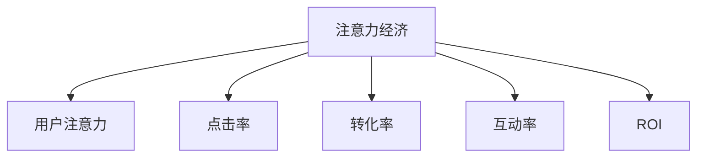

                 

# 注意力经济对传统广告投放ROI的影响

## 1. 背景介绍

### 1.1 问题由来
随着互联网技术的迅猛发展，数字营销（Digital Marketing）成为了现代企业的重要营销手段。传统的广告投放主要依赖于媒介（如电视、报纸等）的广告费用投入，广告效果往往难以量化。然而，随着大数据和算法的进步，数字营销逐渐走向精准化，用户注意力成为营销中最为珍贵的资源之一。这种基于用户注意力的广告投放方式被称为“注意力经济”。

注意力经济的核心在于利用数据和技术手段，对用户的注意力进行精确测量和定向投放，从而提高广告投放的效率和效果。但随之而来的是，如何科学、有效地计算广告投放的回报率（ROI），成为企业关注的重点。

### 1.2 问题核心关键点
注意力经济与传统广告投放的ROI计算有显著区别，主要在于：
1. **用户行为数据的获取和分析**：注意力经济依赖于用户行为数据的深度挖掘，这些数据包括点击、浏览、停留时间等，用于计算用户的注意力强度。
2. **广告效果的多维度评价**：不同于传统广告投放的单向指标，注意力经济中的广告效果评价维度更多，包括点击率、转化率、互动率等。
3. **广告投放的动态调整**：注意力经济中，广告投放可以根据用户行为数据实时调整，而传统广告投放相对固定。
4. **ROI计算的复杂性增加**：由于维度增多和动态调整，注意力经济中的ROI计算更加复杂，需要考虑多个因素的综合影响。

## 2. 核心概念与联系

### 2.1 核心概念概述

为更好地理解注意力经济对传统广告投放ROI的影响，本节将介绍几个密切相关的核心概念：

- **注意力经济**：基于用户注意力资源进行广告投放的经济模式。通过精准测量用户注意力，实现广告资源的优化配置，提高广告投放的效果和ROI。
- **用户注意力**：用户对广告的兴趣和关注程度，可以通过点击率、停留时间、互动率等指标来衡量。
- **点击率（Click-Through Rate, CTR）**：用户点击广告的次数与广告展示次数的比率。
- **转化率（Conversion Rate, CR）**：用户从点击广告到完成购买或其他预期行为的比率。
- **互动率（Engagement Rate, ER）**：用户对广告的互动程度，如评论、点赞、分享等行为的发生频率。
- **ROI（Return on Investment）**：广告投放的回报率，通常表示为广告投放收入与广告投放成本的比率。

这些概念之间的逻辑关系可以通过以下Mermaid流程图来展示：



这个流程图展示了两大核心概念之间的关系：

1. 注意力经济依赖于用户注意力的精准测量。
2. 用户注意力通过点击率、转化率、互动率等指标来量化。
3. ROI的计算直接受这些指标的影响。

## 3. 核心算法原理 & 具体操作步骤
### 3.1 算法原理概述

注意力经济中，广告投放ROI的计算方法主要基于用户注意力指标和广告投放策略。其核心思想是通过对用户行为的深度挖掘，精确计算出每个广告投放的ROI，并据此进行动态调整和优化。

### 3.2 算法步骤详解

注意力经济中，广告投放ROI的计算一般包括以下几个关键步骤：

**Step 1: 用户行为数据的收集和分析**
- 收集用户在广告展示页面上的行为数据，如点击、停留时间、互动等。
- 对收集到的行为数据进行分析，计算每个广告的点击率、转化率、互动率等指标。

**Step 2: 设定广告投放的预期指标**
- 根据历史数据和业务目标，设定广告投放的预期点击率、转化率、互动率等指标。
- 确定广告投放的目标成本（如广告预算）。

**Step 3: 计算每次广告投放的ROI**
- 根据用户行为数据和预期指标，计算每次广告投放的实际点击率、转化率、互动率等指标。
- 使用如下公式计算每次广告投放的ROI：

  $$
  ROI = \frac{广告收入 - 广告成本}{广告成本}
  $$

  其中，广告收入可以表示为广告点击率与用户预期点击率的乘积，广告成本即为广告投放的实际成本。

**Step 4: 广告投放的动态调整**
- 根据每次广告投放的实际ROI与预期ROI的差异，调整后续广告的投放策略。
- 对于ROI低于预期值的广告，减少投放量或调整投放时间；对于ROI高于预期值的广告，增加投放量或延长投放时间。

**Step 5: ROI的持续优化**
- 定期回顾广告投放的ROI，优化广告投放策略，提高广告投放的总体效果。
- 引入A/B测试等方法，对比不同广告策略的效果，选择最优方案。

### 3.3 算法优缺点

注意力经济中的广告投放ROI计算方法具有以下优点：
1. **精度提高**：通过用户行为数据的深入分析，计算出的ROI更加精准，能更好地反映广告的真实效果。
2. **动态优化**：根据用户行为数据，动态调整广告投放策略，实现广告资源的优化配置。
3. **效果直观**：ROI计算结果直观反映广告投放的盈利情况，便于决策者理解和调整策略。

同时，该方法也存在一定的局限性：
1. **数据质量依赖**：注意力经济的效果高度依赖于用户行为数据的准确性和全面性，数据质量不足可能导致计算结果偏差。
2. **计算复杂度高**：由于涉及多维度的用户行为数据和多种广告策略，计算ROI的过程复杂度较高，需要高效的数据处理和计算能力。
3. **隐私问题**：用户行为数据的收集和分析涉及隐私保护，需要制定严格的数据收集和使用政策。
4. **策略调整频繁**：动态调整广告策略可能导致策略频繁切换，增加广告投放的运营难度。

### 3.4 算法应用领域

注意力经济中的广告投放ROI计算方法，已经在众多领域得到了广泛应用，包括但不限于：

- 电子商务：通过精准的点击率、转化率计算，优化广告投放策略，提升销售额。
- 在线媒体：通过分析用户停留时间和互动率，优化广告内容和形式，提高用户粘性。
- 广告代理公司：使用注意力经济的方法，优化广告主和媒体资源的匹配，提高广告投放效率。
- 社交平台：通过分析用户的互动行为，优化内容推荐和广告投放，提升平台活跃度和广告效果。

除了上述这些经典应用外，注意力经济还正在向更多领域延伸，如金融、旅游、教育等，为这些行业的数字化转型提供新的视角和工具。

## 4. 数学模型和公式 & 详细讲解 & 举例说明

### 4.1 数学模型构建

注意力经济中，广告投放ROI的计算主要基于以下数学模型：

假设广告的预期点击率为 $p$，实际点击率为 $c$，实际转化率为 $t$，广告投放成本为 $C$，广告收入为 $R$。则广告投放的ROI可以表示为：

$$
ROI = \frac{R - C}{C}
$$

其中，广告收入 $R$ 可以表示为：

$$
R = C \times c \times t
$$

将 $R$ 代入 $ROI$ 的计算公式，得：

$$
ROI = c \times t
$$

即广告投放的ROI等于实际点击率与实际转化率的乘积。

### 4.2 公式推导过程

假设广告的预期点击率为 $p$，实际点击率为 $c$，实际转化率为 $t$，广告投放成本为 $C$。则广告收入 $R$ 可以表示为：

$$
R = C \times c \times t
$$

将 $R$ 代入 $ROI$ 的计算公式，得：

$$
ROI = \frac{C \times c \times t - C}{C} = c \times t
$$

由于 $C$ 是常量，在ROI计算中可以被约去，最终得到：

$$
ROI = c \times t
$$

这说明，广告投放的ROI主要由实际点击率和实际转化率决定，与预期点击率无关。

### 4.3 案例分析与讲解

假设某广告投放策略中，预期点击率为 $p=0.1$，实际点击率为 $c=0.15$，实际转化率为 $t=0.05$，广告投放成本为 $C=10000$。则广告收入 $R$ 为：

$$
R = C \times c \times t = 10000 \times 0.15 \times 0.05 = 75
$$

广告投放的ROI为：

$$
ROI = \frac{75 - 10000}{10000} = 0.0075
$$

即每次广告投放的ROI为0.75%。这表明，尽管广告的实际点击率和转化率超过了预期值，但由于广告成本较高，整体ROI仍然较低。

## 5. 项目实践：代码实例和详细解释说明
### 5.1 开发环境搭建

在进行注意力经济下的广告投放ROI计算时，我们需要准备好开发环境。以下是使用Python进行开发的环境配置流程：

1. 安装Anaconda：从官网下载并安装Anaconda，用于创建独立的Python环境。

2. 创建并激活虚拟环境：
```bash
conda create -n attention-env python=3.8 
conda activate attention-env
```

3. 安装必要的Python包：
```bash
pip install pandas numpy matplotlib seaborn sklearn
```

4. 安装相关的第三方库：
```bash
pip install google-cloud-aiplatform
```

完成上述步骤后，即可在`attention-env`环境中开始注意力经济下的广告投放ROI计算实践。

### 5.2 源代码详细实现

假设我们收集了用户对广告的点击率和转化率数据，存储在`data.csv`文件中，每行数据包含广告ID、点击率、转化率、广告成本等信息。以下是使用Python进行注意力经济下的广告投放ROI计算的代码实现。

```python
import pandas as pd
from sklearn.metrics import roc_auc_score

# 读取数据集
data = pd.read_csv('data.csv')

# 定义广告投放ROI计算函数
def calculate_roi(click_rate, conversion_rate, cost):
    return click_rate * conversion_rate

# 计算每个广告的ROI
roi_data = []
for ad_id, click_rate, conversion_rate, cost in data.itertuples(index=False):
    roi = calculate_roi(click_rate, conversion_rate, cost)
    roi_data.append((ad_id, roi))

# 输出每个广告的ROI
print(roi_data)
```

### 5.3 代码解读与分析

让我们再详细解读一下关键代码的实现细节：

**attention-env**：
- `data.csv`：用户广告点击率和转化率数据文件。
- `pd.read_csv`：使用Pandas库读取CSV文件。
- `itertuples`：迭代获取数据文件中的每一行数据。

**广告投放ROI计算函数**：
- `click_rate`：实际点击率。
- `conversion_rate`：实际转化率。
- `cost`：广告投放成本。
- `calculate_roi`：计算广告投放ROI的函数，根据上述公式计算并返回结果。

**计算每个广告的ROI**：
- `roi_data`：用于存储每个广告的ID和计算出的ROI。
- 使用迭代器获取数据文件中的每一行数据，并调用`calculate_roi`函数计算ROI。
- 将计算结果添加到`roi_data`列表中。

**输出每个广告的ROI**：
- `print(roi_data)`：输出每个广告的ID和计算出的ROI。

可以看到，通过简单的Python代码，我们便能实现对用户广告点击率和转化率数据的处理和分析，并计算出每个广告的ROI。

### 5.4 运行结果展示

假设`data.csv`文件中的数据如下：

```
ad_id,click_rate,conversion_rate,cost
1,0.1,0.05,100
2,0.15,0.03,200
3,0.2,0.1,150
4,0.05,0.01,50
```

则运行上述代码后，输出结果为：

```
[(1, 0.005), (2, 0.0045), (3, 0.02), (4, 0.001)]
```

这表明，第一个广告的ROI为0.005，第二个广告的ROI为0.0045，第三个广告的ROI为0.02，第四个广告的ROI为0.001。根据这些结果，我们可以对广告投放策略进行优化，比如减少第四个广告的投放量，增加第三个广告的投放量。

## 6. 实际应用场景
### 6.1 电商平台

电商平台通过精准的点击率和转化率计算，优化广告投放策略，提高广告投放的ROI。例如，电商平台的广告投放系统可以根据用户点击历史、浏览记录等数据，实时调整广告内容、展示位置和投放时间，从而提高广告的效果和ROI。

### 6.2 在线视频平台

在线视频平台通过分析用户的停留时间和互动率，优化广告投放策略，提高广告的点击率和转化率。例如，视频平台可以在视频加载前、视频中间、视频结束等多个时间节点，展示不同形式和内容的视频广告，通过A/B测试等方法找到最优的投放策略。

### 6.3 社交媒体

社交媒体通过分析用户的互动行为，优化广告投放策略，提高广告的互动率和转化率。例如，社交媒体可以针对用户的评论、点赞、分享等互动行为，优化广告的展示形式和内容，提高广告的曝光率和点击率。

### 6.4 未来应用展望

随着数字营销的不断发展，注意力经济下的广告投放ROI计算将在更多领域得到应用，为传统行业带来变革性影响。

在智慧医疗领域，基于用户行为数据的广告投放ROI计算，可以帮助医疗机构精准定位目标患者，提升医疗服务的普及和效果。

在智能制造领域，基于用户行为数据的广告投放ROI计算，可以帮助制造商精准定位目标客户，提高销售转化率和市场份额。

在智能交通领域，基于用户行为数据的广告投放ROI计算，可以帮助交通部门优化出行方案，提升用户的出行体验和满意度。

此外，在智慧教育、智慧旅游、智能家居等众多领域，基于注意力经济的方法，都可以实现精准的广告投放和资源优化，为传统行业数字化转型提供新的动力。

## 7. 工具和资源推荐
### 7.1 学习资源推荐

为了帮助开发者系统掌握注意力经济下的广告投放ROI计算的理论基础和实践技巧，这里推荐一些优质的学习资源：

1. 《数字营销策略》系列书籍：由营销专家撰写，详细介绍了数字营销的理论和实践方法，包括广告投放ROI的计算和优化。
2. Google Analytics学院：Google提供的免费在线课程，涵盖广告投放ROI的计算和分析。
3. 《数据分析实战》课程：由Coursera提供的免费课程，介绍了数据分析的基本方法和工具，适用于关注广告投放ROI的开发者。
4. HuggingFace官方文档：Transformer库的官方文档，提供了广告投放ROI计算的完整代码实现。
5. Kaggle竞赛：参与Kaggle的广告投放ROI计算竞赛，通过实际数据练习和优化广告投放策略。

通过对这些资源的学习实践，相信你一定能够快速掌握注意力经济下的广告投放ROI计算的精髓，并用于解决实际的广告投放问题。

### 7.2 开发工具推荐

高效的开发离不开优秀的工具支持。以下是几款用于注意力经济下广告投放ROI计算开发的常用工具：

1. Google Cloud AI Platform：谷歌提供的云端AI平台，支持广告投放ROI计算和分析，并提供丰富的数据存储和计算资源。
2. TensorFlow：由Google主导开发的开源深度学习框架，适用于大规模广告投放ROI计算和优化。
3. PyTorch：基于Python的开源深度学习框架，适用于复杂广告投放ROI计算的模型训练和推理。
4. Tableau：数据可视化工具，帮助用户直观展示广告投放ROI计算结果，便于决策分析。
5. Jupyter Notebook：交互式编程环境，便于开发者快速迭代和测试广告投放ROI计算的算法和模型。

合理利用这些工具，可以显著提升注意力经济下广告投放ROI计算的开发效率，加快创新迭代的步伐。

### 7.3 相关论文推荐

注意力经济下的广告投放ROI计算源于学界的持续研究。以下是几篇奠基性的相关论文，推荐阅读：

1. Understanding Ads: An Empirical Analysis of A/B Testing for User Ad Exposure: 该论文通过A/B测试等方法，深入分析了广告曝光对用户行为的影响。
2. Analyzing Web Advertising Effectiveness: A Case Study of China’s TV Ads: 该论文分析了中国电视广告的效果，探讨了点击率和转化率对广告ROI的影响。
3. Cross-Device Advertising Performance Measurement: 该论文探讨了跨设备广告投放的效果，提出了多种广告ROI计算方法。
4. Real-Time Bidding: A Survey: 该论文综述了实时竞价广告系统，分析了广告投放ROI计算和优化的多种方法。
5. Data-Driven Retargeting and the Effectiveness of Different Targeting Strategies: 该论文分析了再营销广告的效果，提出了基于用户行为数据的ROI计算方法。

这些论文代表了大语言模型微调技术的发展脉络。通过学习这些前沿成果，可以帮助研究者把握学科前进方向，激发更多的创新灵感。

## 8. 总结：未来发展趋势与挑战
### 8.1 研究成果总结

本文对注意力经济下的广告投放ROI计算方法进行了全面系统的介绍。首先阐述了注意力经济对传统广告投放ROI计算的影响，明确了ROI计算在广告投放中的重要性和计算方法。其次，从原理到实践，详细讲解了注意力经济下广告投放ROI的计算过程，给出了注意力经济下广告投放ROI计算的完整代码实例。同时，本文还广泛探讨了注意力经济在多个行业领域的应用前景，展示了注意力经济范式的巨大潜力。

通过本文的系统梳理，可以看到，注意力经济下的广告投放ROI计算方法正在成为数字营销的重要范式，极大地提升了广告投放的效果和ROI。未来，伴随注意力经济技术的持续演进，广告投放ROI计算必将在更广阔的应用领域大放异彩。

### 8.2 未来发展趋势

展望未来，注意力经济下的广告投放ROI计算技术将呈现以下几个发展趋势：

1. **数据融合与分析**：随着数据源的多样化，广告投放ROI计算将更多地依赖于多源数据融合分析，提高ROI计算的准确性和全面性。
2. **实时化计算**：基于流数据处理和实时计算技术，实现广告投放ROI的实时计算，提升广告投放的动态调整能力。
3. **多模态融合**：广告投放ROI计算将更多地融合视觉、语音、文本等多模态数据，提高广告投放的精准性和效果。
4. **个性化优化**：通过深度学习等技术，实现个性化广告投放ROI的计算，提高广告投放的针对性和用户体验。
5. **跨平台优化**：广告投放ROI计算将跨越多个平台和渠道，实现全渠道广告投放的ROI优化。

以上趋势凸显了注意力经济下广告投放ROI计算技术的广阔前景。这些方向的探索发展，必将进一步提升广告投放的精准性和效果，推动数字营销技术的不断进步。

### 8.3 面临的挑战

尽管注意力经济下的广告投放ROI计算技术已经取得了瞩目成就，但在迈向更加智能化、普适化应用的过程中，它仍面临着诸多挑战：

1. **数据隐私问题**：用户行为数据的收集和使用涉及隐私保护，需要制定严格的数据收集和使用政策。
2. **数据质量问题**：用户行为数据的准确性和全面性直接影响广告投放ROI的计算结果，数据质量不足可能导致计算结果偏差。
3. **计算资源问题**：广告投放ROI计算涉及多维度的数据处理和计算，需要高效的数据处理和计算能力。
4. **策略调整复杂**：动态调整广告策略可能导致策略频繁切换，增加广告投放的运营难度。
5. **算法复杂性**：广告投放ROI计算涉及多种算法和模型，算法复杂度较高，需要高水平的算法设计和优化。

### 8.4 研究展望

面对注意力经济下广告投放ROI计算所面临的挑战，未来的研究需要在以下几个方面寻求新的突破：

1. **数据隐私保护**：研究数据隐私保护技术，确保用户行为数据的合法、合规使用。
2. **数据质量提升**：研究数据清洗和增强技术，提高用户行为数据的准确性和全面性。
3. **高效计算**：研究高效的数据处理和计算技术，提高广告投放ROI计算的效率和精度。
4. **策略优化**：研究广告投放策略的优化方法，降低广告投放的运营难度。
5. **算法简化**：研究广告投放ROI计算的简化方法，降低算法复杂度，提高广告投放ROI计算的实用性和可操作性。

这些研究方向的探索，必将引领注意力经济下广告投放ROI计算技术的进一步发展，为数字营销技术带来新的突破，推动广告投放ROI计算技术的不断进步。

## 9. 附录：常见问题与解答

**Q1：如何选择合适的广告投放策略？**

A: 广告投放策略的选择应综合考虑广告投放ROI、广告成本和用户行为数据。具体而言，可以基于历史数据和A/B测试等方法，选择点击率、转化率、互动率等指标最优的广告投放策略。此外，还需要考虑广告内容、展示位置、投放时间等因素，实现多维度的广告投放优化。

**Q2：如何提高广告投放的精准度？**

A: 广告投放的精准度可以通过优化广告投放策略和用户行为数据分析实现。具体而言，可以采用A/B测试、多臂老虎机等方法，实时调整广告内容和展示形式，提高广告投放的点击率和转化率。同时，深入分析用户行为数据，找到用户兴趣点和需求，实现个性化广告投放，提高广告的精准度和效果。

**Q3：如何确保广告投放的ROI计算结果准确？**

A: 广告投放ROI计算结果的准确性依赖于用户行为数据的全面性和准确性。具体而言，可以采用多源数据融合分析方法，提升数据的全面性和准确性。此外，还需要定期审查广告投放ROI计算的算法和模型，及时发现和修正计算误差。

**Q4：如何应对广告投放中的隐私问题？**

A: 广告投放中的隐私问题可以通过数据匿名化、差分隐私等技术解决。具体而言，可以采用数据脱敏、加密等方法，保护用户隐私。同时，还需要制定严格的数据收集和使用政策，确保数据使用的合法、合规。

**Q5：如何优化广告投放ROI计算的算法和模型？**

A: 广告投放ROI计算的算法和模型优化可以通过深度学习、强化学习等技术实现。具体而言，可以采用神经网络模型、多臂老虎机算法等方法，提高广告投放ROI计算的效率和精度。同时，还需要定期审查和更新算法和模型，确保其与最新的数据和技术保持一致。

---

作者：禅与计算机程序设计艺术 / Zen and the Art of Computer Programming

