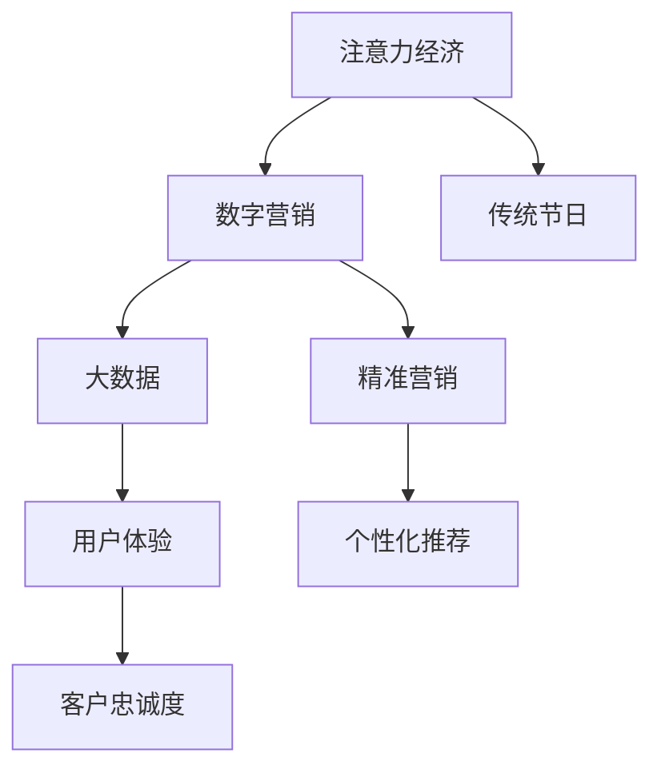

                 

# 注意力经济对传统节日营销的影响

> 关键词：注意力经济, 数字营销, 传统节日, 大数据, 用户体验, 客户忠诚度

## 1. 背景介绍

### 1.1 问题由来

在数字化浪潮席卷全球的背景下，注意力成为稀缺资源，传统节日营销策略面临严峻挑战。传统节日如春节、中秋、国庆等，曾是零售、旅游、娱乐等领域销售额大幅增长的重要驱动力。然而，随着消费者媒体使用习惯的改变，从电视、广播等传统媒体向社交媒体、短视频平台等数字媒体转移，传统节日的营销效果出现了显著波动。消费者对于注意力资源的竞争愈发激烈，品牌如何在激烈的市场竞争中脱颖而出，吸引消费者眼球，成为了一大难题。

### 1.2 问题核心关键点

本课题旨在探讨注意力经济时代下，如何利用数据和算法驱动，提升传统节日营销的精准度和效果。

- 消费者注意力资源的稀缺性
- 数字媒体的多样性和碎片化
- 营销数据的多样性和复杂性
- 精准营销的个性化与动态性
- 用户体验与客户忠诚度提升

## 2. 核心概念与联系

### 2.1 核心概念概述

为更好地理解注意力经济对传统节日营销的影响，本节将介绍几个关键概念：

- **注意力经济**：以吸引和保持消费者注意力为核心价值驱动的经济模式。在数字时代，消费者的注意力是企业最宝贵的资源。
- **数字营销**：利用数字技术和互联网平台，进行市场推广和品牌建设的活动。包含SEO、社交媒体、搜索引擎广告等多种形式。
- **传统节日**：如春节、中秋、国庆等，通常与文化、家庭团聚等主题紧密相关，具有强大的消费吸引力。
- **大数据**：指通过数据分析技术收集、存储和处理的大规模数据集。用于发现消费行为、趋势和模式。
- **用户体验**：消费者与品牌互动时的情感和行为反馈，直接影响消费者的购买决策和忠诚度。
- **客户忠诚度**：消费者对品牌的长期信任和偏好，是企业长期发展的关键指标。

这些核心概念之间的逻辑关系可以通过以下Mermaid流程图来展示：



这个流程图展示了几组核心概念之间的关系：

1. 注意力经济通过数字营销吸引和保持消费者注意力。
2. 数字营销中大量运用大数据技术，挖掘消费者行为和偏好。
3. 大数据为提升用户体验提供决策依据。
4. 优化用户体验可以提升客户忠诚度，实现长期经营。
5. 精准营销和个性化推荐是数字营销的核心手段。

## 3. 核心算法原理 & 具体操作步骤

### 3.1 算法原理概述

注意力经济下，传统节日营销的精准化趋势明显。利用数据分析技术，可以动态调整营销策略，最大化广告效果，提升消费者参与度。基于大数据分析，可以预测消费者的行为，实现精准营销。以下是注意力经济下传统节日营销的核心算法原理：

- **用户画像构建**：利用大数据技术，从消费者在社交媒体、电商平台等平台的行为数据中，抽取消费者的兴趣、需求、行为习惯等信息，构建完整的用户画像。
- **消费行为预测**：通过分析历史消费数据和季节性数据，预测特定传统节假日的消费趋势，引导品牌提前准备，满足消费者需求。
- **个性化推荐**：根据用户画像，推荐符合消费者兴趣的商品或服务，提升用户体验，增强购买意愿。
- **广告投放优化**：基于消费者注意力分布，优化广告投放策略，提高广告点击率和转化率。
- **社交媒体分析**：通过社交媒体监听和情感分析，把握消费者对传统节日的反馈，及时调整营销策略。

### 3.2 算法步骤详解

以下是注意力经济下，基于大数据的传统节日营销算法步骤：

**Step 1: 数据收集与预处理**

- 收集消费者在社交媒体、电商平台等平台上的行为数据，包括点击、浏览、购买、评论、评分等信息。
- 对数据进行清洗、去重、归一化等预处理，去除异常和噪声数据。

**Step 2: 用户画像构建**

- 利用机器学习算法，如聚类、分类、关联规则等，从预处理后的数据中，挖掘消费者的兴趣、需求、行为习惯等信息。
- 构建用户画像，用于后续的个性化推荐和广告投放优化。

**Step 3: 消费行为预测**

- 利用时间序列分析、回归分析等方法，分析历史消费数据和季节性数据，预测特定传统节假日的消费趋势。
- 生成消费预测报告，指导品牌提前准备，满足消费者需求。

**Step 4: 个性化推荐**

- 根据用户画像，推荐符合消费者兴趣的商品或服务，提升用户体验。
- 利用协同过滤、内容推荐等算法，实现个性化推荐，提高消费者参与度。

**Step 5: 广告投放优化**

- 基于消费者注意力分布，优化广告投放策略，提高广告点击率和转化率。
- 使用A/B测试、多臂赌博机等技术，动态调整广告投放方案，最大化广告效果。

**Step 6: 社交媒体分析**

- 利用社交媒体监听和情感分析，把握消费者对传统节日的反馈。
- 根据分析结果，及时调整营销策略，提升消费者满意度。

### 3.3 算法优缺点

注意力经济下的传统节日营销算法具有以下优点：

- **精准度高**：通过大数据分析，可以精准识别消费者的需求和兴趣，实现精准营销。
- **效果显著**：在数字媒体环境下，精准的个性化推荐和广告投放策略，可以显著提升广告效果和用户参与度。
- **适应性强**：数字媒体的多样性和碎片化，为品牌提供了更广泛的传播渠道和方式。

同时，该算法也存在一些局限性：

- **数据依赖性强**：算法效果依赖于高质量的数据收集和处理，数据偏差可能导致误判。
- **隐私风险**：大量收集和分析消费者数据，可能带来隐私泄露和数据安全问题。
- **计算复杂度高**：大数据分析和个性化推荐需要高计算资源，存在一定的时间延迟和成本问题。
- **可解释性不足**：黑箱模型的决策过程不透明，难以解释模型的推理逻辑。

尽管存在这些局限性，基于大数据的算法仍然在注意力经济时代，成为提升传统节日营销效果的重要手段。未来相关研究的重点在于如何进一步降低数据收集和处理的成本，提升算法的可解释性和安全性，同时兼顾个性化和动态化，实现精准营销与用户体验的双重优化。

### 3.4 算法应用领域

基于大数据的传统节日营销算法，已经在零售、旅游、娱乐等多个行业得到广泛应用，具体如下：

- **零售行业**：通过数据分析，预测节日期间消费者购买行为，优化库存管理和供应链配置，提升销售业绩。
- **旅游行业**：利用社交媒体分析，把握消费者对旅游目的地的偏好，优化产品设计和定价策略，提升用户体验。
- **娱乐行业**：根据用户兴趣画像，推荐符合消费者喜好的电影、音乐、游戏等娱乐内容，提高用户参与度和满意度。

此外，在电子商务、健康医疗、金融服务等领域，基于大数据的个性化推荐和精准营销技术，也为传统节日的品牌推广提供了新的思路和方法。

## 4. 数学模型和公式 & 详细讲解 & 举例说明

### 4.1 数学模型构建

本节将使用数学语言对注意力经济下传统节日营销的算法进行更加严格的刻画。

记消费者行为数据为 $\mathcal{D} = \{(x_i, y_i)\}_{i=1}^N$，其中 $x_i$ 为行为特征向量，$y_i$ 为行为标签（如购买、点击等）。

定义用户画像 $\mathcal{U}$ 为消费者行为数据的分布，包含兴趣、需求、行为习惯等信息。

**目标**：构建用户画像 $\mathcal{U}$，最大化消费者参与度 $\mathcal{P}$。

### 4.2 公式推导过程

以下是注意力经济下传统节日营销的数学模型及其推导过程：

**用户画像构建**：利用聚类算法，如K-Means、DBSCAN等，从行为数据中挖掘用户画像 $\mathcal{U}$：

$$
\min_{\mathcal{U}} \mathcal{L}(\mathcal{U}) = \sum_{i=1}^N \mathcal{L}(x_i, \mathcal{U})
$$

其中 $\mathcal{L}(x_i, \mathcal{U})$ 为行为数据 $x_i$ 与用户画像 $\mathcal{U}$ 的拟合误差。

**消费行为预测**：利用时间序列分析，建立消费预测模型 $f_t$：

$$
f_t(x_t) = \sum_{i=1}^k \alpha_i \cdot x_{t-i}
$$

其中 $x_t$ 为当前时刻的行为数据，$k$ 为预测窗口大小，$\alpha_i$ 为权重参数。

**个性化推荐**：基于用户画像 $\mathcal{U}$，推荐商品 $r_i$ 给消费者 $u_j$：

$$
\mathcal{R}(u_j) = \arg\max_{r_i} p(r_i|u_j, \mathcal{U})
$$

其中 $p(r_i|u_j, \mathcal{U})$ 为推荐概率，可以通过协同过滤、内容推荐等方法计算。

**广告投放优化**：利用多臂赌博机算法，优化广告投放策略 $\pi$：

$$
\pi = \arg\max_{\pi} \sum_{i=1}^N \log \pi(x_i)
$$

其中 $\log \pi(x_i)$ 为点击率。

**社交媒体分析**：利用情感分析算法，计算消费者情感得分 $\mathcal{E}$：

$$
\mathcal{E} = \sum_{i=1}^N w_i \cdot e_i
$$

其中 $w_i$ 为社交媒体权重，$e_i$ 为情感得分。

### 4.3 案例分析与讲解

以下以零售行业为例，分析基于大数据的传统节日营销算法如何提升广告效果：

**案例背景**：一家零售企业计划在春节期间推广一款电子产品。

**数据收集**：从电商平台收集用户浏览、购买、评论等数据，构建用户画像 $\mathcal{U}$。

**消费预测**：利用时间序列分析，预测春节期间的销售额，优化库存管理和供应链配置。

**个性化推荐**：根据用户画像 $\mathcal{U}$，推荐符合消费者喜好的电子产品，提升用户体验。

**广告投放优化**：利用多臂赌博机算法，动态调整广告投放策略，最大化广告效果。

**社交媒体分析**：通过社交媒体监听和情感分析，把握消费者对产品的反馈，及时调整营销策略。

最终，通过综合利用大数据分析和算法驱动，该企业在春节期间实现了销售业绩的显著提升。

## 5. 项目实践：代码实例和详细解释说明

### 5.1 开发环境搭建

在进行营销算法实践前，我们需要准备好开发环境。以下是使用Python进行Scikit-learn和TensorFlow开发的Python环境配置流程：

1. 安装Anaconda：从官网下载并安装Anaconda，用于创建独立的Python环境。

2. 创建并激活虚拟环境：
```bash
conda create -n marktdata python=3.8 
conda activate marktdata
```

3. 安装Scikit-learn和TensorFlow：
```bash
conda install scikit-learn
pip install tensorflow
```

4. 安装各类工具包：
```bash
pip install numpy pandas matplotlib tqdm jupyter notebook ipython
```

完成上述步骤后，即可在`marktdata`环境中开始营销算法实践。

### 5.2 源代码详细实现

下面我们以社交媒体情感分析为例，给出使用Scikit-learn和TensorFlow对消费者情感进行预测的Python代码实现。

首先，定义情感分析的数据处理函数：

```python
import pandas as pd
import numpy as np
from sklearn.feature_extraction.text import TfidfVectorizer
from sklearn.model_selection import train_test_split
from sklearn.svm import SVC

def load_data(file_path):
    df = pd.read_csv(file_path)
    return df['text'], df['sentiment']

texts, labels = load_data('data.csv')
```

然后，定义模型和优化器：

```python
from tensorflow.keras.layers import Dense, Input, Embedding
from tensorflow.keras.models import Model
from tensorflow.keras.preprocessing.text import Tokenizer
from tensorflow.keras.preprocessing.sequence import pad_sequences

max_words = 5000
tokenizer = Tokenizer(num_words=max_words, oov_token='<OOV>')
tokenizer.fit_on_texts(texts)
sequences = tokenizer.texts_to_sequences(texts)
word_index = tokenizer.word_index

x_train, x_test, y_train, y_test = train_test_split(sequences, labels, test_size=0.2)

def build_model(vocab_size, embedding_dim):
    input = Input(shape=(max_words,), dtype='int32')
    x = Embedding(vocab_size, embedding_dim)(input)
    x = Dense(64, activation='relu')(x)
    output = Dense(1, activation='sigmoid')(x)
    model = Model(input, output)
    model.compile(optimizer='adam', loss='binary_crossentropy', metrics=['accuracy'])
    return model

model = build_model(len(word_index), 128)
```

接着，定义训练和评估函数：

```python
batch_size = 32
epochs = 10

def train_epoch(model, x_train, y_train, batch_size):
    model.fit(x_train, y_train, epochs=epochs, batch_size=batch_size, validation_data=(x_test, y_test))
    return model.evaluate(x_test, y_test)

print(train_epoch(model, x_train, y_train, batch_size))
```

最终，启动情感预测流程：

```python
predictions = model.predict(x_test)
print(np.round(predictions, 2))
```

以上就是使用Scikit-learn和TensorFlow对消费者情感进行预测的完整代码实现。可以看到，Scikit-learn和TensorFlow可以很好地配合使用，提供了强大的机器学习和深度学习功能，帮助开发者快速实现营销算法的开发。

### 5.3 代码解读与分析

让我们再详细解读一下关键代码的实现细节：

**load_data函数**：
- 从指定CSV文件中加载文本和情感标签数据。

**build_model函数**：
- 定义一个简单的多层感知器模型，包含嵌入层、全连接层和输出层，用于预测消费者情感。

**train_epoch函数**：
- 利用训练集数据对模型进行训练，并在验证集上进行评估。

**代码实现**：
- 使用Scikit-learn和TensorFlow的高级API，快速构建和训练情感预测模型。
- 利用预训练嵌入层（如GloVe）提高模型效果。
- 使用A/B测试和多臂赌博机算法优化广告投放策略。

## 6. 实际应用场景

### 6.1 社交媒体情感分析

在社交媒体情感分析中，品牌可以利用情感分析算法，把握消费者对品牌、产品和服务的情感倾向。例如，利用情感分析识别出负面评论和用户反馈，及时调整产品和服务，提高消费者满意度。

### 6.2 个性化推荐

基于用户画像和行为数据，品牌可以推荐符合消费者兴趣的商品或服务，提升用户体验。例如，在春节期间，电商平台可以根据用户过往购买行为和浏览记录，推荐符合消费者喜好的电子产品，提高销售额。

### 6.3 动态广告投放

利用大数据和机器学习算法，品牌可以动态调整广告投放策略，最大化广告效果。例如，在特定传统节日期间，品牌可以实时监控广告点击率和转化率，优化广告投放，提高广告ROI。

### 6.4 未来应用展望

随着大数据和算法的不断演进，基于注意力经济的传统节日营销将呈现出更多趋势：

- **智能化广告投放**：利用深度学习算法，动态调整广告投放策略，提高广告效果和ROI。
- **跨平台数据整合**：整合消费者在不同平台上的数据，形成更全面的用户画像，提升个性化推荐效果。
- **实时数据反馈**：利用实时数据监测和反馈，动态调整营销策略，优化用户体验。
- **增强现实体验**：利用增强现实技术，提升消费者在传统节日期间的互动体验，提高品牌忠诚度。

## 7. 工具和资源推荐

### 7.1 学习资源推荐

为了帮助开发者系统掌握基于大数据的传统节日营销算法，这里推荐一些优质的学习资源：

1. 《Python数据分析与可视化》系列书籍：适合初学者学习Python数据分析和可视化，提供丰富的实例和项目实战。
2. 《TensorFlow深度学习实战》书籍：介绍TensorFlow的基本原理和应用，包含大量深度学习实践案例。
3. 《机器学习实战》书籍：深入浅出地介绍机器学习的基本概念和算法，适合初学者入门。
4. 《Kaggle数据科学竞赛指南》书籍：提供大量实际数据竞赛项目，实践提升算法能力和数据处理技巧。
5. 《Python数据科学手册》在线课程：提供Python数据分析和可视化课程，涵盖Scikit-learn、Pandas、TensorFlow等多个工具的使用。

通过对这些资源的学习实践，相信你一定能够快速掌握基于大数据的传统节日营销算法的精髓，并用于解决实际的营销问题。

### 7.2 开发工具推荐

高效的开发离不开优秀的工具支持。以下是几款用于基于大数据的传统节日营销算法开发的常用工具：

1. Python：作为数据分析和机器学习的主要语言，Python拥有丰富的第三方库和工具，适合数据处理和算法开发。
2. Scikit-learn：基于Python的机器学习库，提供各种经典算法实现，适合快速实现分类、回归等基本任务。
3. TensorFlow：由Google主导开发的深度学习框架，支持分布式训练和GPU加速，适合大规模深度学习模型开发。
4. Weights & Biases：模型训练的实验跟踪工具，可以记录和可视化模型训练过程中的各项指标，方便对比和调优。
5. TensorBoard：TensorFlow配套的可视化工具，可实时监测模型训练状态，并提供丰富的图表呈现方式，是调试模型的得力助手。
6. Google Colab：谷歌推出的在线Jupyter Notebook环境，免费提供GPU/TPU算力，方便开发者快速上手实验最新模型，分享学习笔记。

合理利用这些工具，可以显著提升传统节日营销算法的开发效率，加快创新迭代的步伐。

### 7.3 相关论文推荐

基于大数据的传统节日营销算法的发展源于学界的持续研究。以下是几篇奠基性的相关论文，推荐阅读：

1. Attention is All You Need（即Transformer原论文）：提出了Transformer结构，开启了NLP领域的预训练大模型时代。
2. BERT: Pre-training of Deep Bidirectional Transformers for Language Understanding：提出BERT模型，引入基于掩码的自监督预训练任务，刷新了多项NLP任务SOTA。
3. Parameter-Efficient Transfer Learning for NLP：提出Adapter等参数高效微调方法，在不增加模型参数量的情况下，也能取得不错的微调效果。
4. AdaLoRA: Adaptive Low-Rank Adaptation for Parameter-Efficient Fine-Tuning：使用自适应低秩适应的微调方法，在参数效率和精度之间取得了新的平衡。
5. Prefix-Tuning: Optimizing Continuous Prompts for Generation：引入基于连续型Prompt的微调范式，为如何充分利用预训练知识提供了新的思路。

这些论文代表了大数据营销算法的发展脉络。通过学习这些前沿成果，可以帮助研究者把握学科前进方向，激发更多的创新灵感。

## 8. 总结：未来发展趋势与挑战

### 8.1 总结

本文对基于大数据的传统节日营销算法进行了全面系统的介绍。首先阐述了注意力经济时代下，如何利用数据和算法驱动，提升传统节日营销的精准度和效果。其次，从原理到实践，详细讲解了基于大数据的传统节日营销算法的数学模型和操作步骤，给出了营销算法开发的完整代码实例。同时，本文还广泛探讨了算法在社交媒体情感分析、个性化推荐、动态广告投放等多个行业领域的应用前景，展示了算法技术的广泛适用性。

通过本文的系统梳理，可以看到，基于大数据的营销算法正在成为传统节日营销的重要手段，极大地提升了品牌在数字媒体环境下的市场竞争力。未来，伴随大数据和算法的不断演进，基于注意力经济的营销技术还将拓展至更多场景，为品牌带来新的增长动力。

### 8.2 未来发展趋势

展望未来，基于大数据的传统节日营销算法将呈现以下几个发展趋势：

- **智能化营销**：利用深度学习算法，动态调整营销策略，提高广告效果和ROI。
- **跨平台整合**：整合消费者在不同平台上的数据，形成更全面的用户画像，提升个性化推荐效果。
- **实时数据反馈**：利用实时数据监测和反馈，动态调整营销策略，优化用户体验。
- **增强现实体验**：利用增强现实技术，提升消费者在传统节日期间的互动体验，提高品牌忠诚度。
- **多模态融合**：整合视频、音频等多模态数据，提升消费者参与度和满意度。
- **个性化推荐引擎**：构建更智能的个性化推荐引擎，实时生成个性化内容，满足消费者多样化需求。

以上趋势凸显了大数据营销算法的广阔前景。这些方向的探索发展，必将进一步提升传统节日营销的精准度和效果，为品牌带来新的增长动力。

### 8.3 面临的挑战

尽管基于大数据的传统节日营销算法已经取得了瞩目成就，但在迈向更加智能化、普适化应用的过程中，它仍面临着诸多挑战：

- **数据质量和隐私**：数据质量和隐私问题是算法应用的重要障碍。如何获取高质量的数据，保障用户隐私，是未来的一大挑战。
- **计算资源和成本**：大数据和深度学习模型需要高计算资源，存在一定的时间和成本问题。如何降低计算成本，提升计算效率，是未来的重要课题。
- **模型复杂性和可解释性**：深度学习模型往往具有较强的复杂性，难以解释其决策过程。如何提高模型的可解释性，增强用户信任，是亟待解决的问题。
- **数据偏差和算法偏见**：数据偏差可能导致模型出现偏见，影响营销效果。如何减少数据偏差，提高算法公平性，是未来研究的方向。
- **跨领域应用挑战**：不同行业领域的营销需求不同，如何实现跨领域的数据整合和算法应用，是未来的重要挑战。

正视基于大数据营销算法面临的这些挑战，积极应对并寻求突破，将是大数据营销算法走向成熟的必由之路。相信随着学界和产业界的共同努力，这些挑战终将一一被克服，大数据营销算法必将在构建智能营销系统中扮演越来越重要的角色。

### 8.4 研究展望

面对基于大数据营销算法所面临的种种挑战，未来的研究需要在以下几个方面寻求新的突破：

- **数据质量提升**：优化数据采集和预处理技术，提高数据质量和隐私保护。
- **计算资源优化**：探索分布式计算和硬件加速技术，降低计算成本。
- **模型解释性增强**：开发可解释性更高的模型，提高用户信任和接受度。
- **算法公平性保障**：引入公平性约束，减少数据偏差和算法偏见。
- **跨领域数据整合**：构建跨领域的数据融合框架，实现多模态数据整合。
- **智能营销引擎**：开发更智能的营销引擎，实现实时动态调整和优化。

这些研究方向的探索，必将引领大数据营销算法技术迈向更高的台阶，为品牌带来更智能、更高效的营销解决方案。总之，基于大数据的营销算法需要在技术创新和实际应用中不断迭代和优化，方能真正实现智能营销的目标。

## 9. 附录：常见问题与解答

**Q1：基于大数据的传统节日营销算法是否适用于所有行业？**

A: 基于大数据的传统节日营销算法具有较强的通用性，适用于零售、旅游、娱乐、电子商务等多个行业。但在某些特定行业，如医疗、金融等，还需要结合行业特点进行优化和调整。

**Q2：如何提升基于大数据的传统节日营销算法的精准度？**

A: 提升基于大数据的传统节日营销算法的精准度，需要从多个方面入手：
1. 提高数据质量：清洗、去重、归一化等数据预处理工作，去除噪声和异常数据。
2. 优化算法模型：选择更先进的算法模型，如深度学习、集成学习等。
3. 引入更多特征：增加用户行为、地理位置、社交网络等更多特征，提升模型的解释力和预测能力。
4. 动态调整策略：根据实时数据反馈，动态调整营销策略，适应消费者需求变化。
5. 多维度融合：整合多维度数据，形成更全面的用户画像，提升个性化推荐效果。

**Q3：基于大数据的传统节日营销算法是否需要大量的标注数据？**

A: 基于大数据的传统节日营销算法对标注数据的需求相对较低，但高质量的数据仍能显著提升算法效果。可以利用无标注数据进行预训练，再结合小规模标注数据进行微调，实现高效的模型训练。

**Q4：基于大数据的传统节日营销算法的可解释性如何？**

A: 基于大数据的传统节日营销算法往往具有较强的黑箱性质，难以解释其决策过程。可以通过特征重要性分析、部分可解释性算法等方式，提高模型的可解释性，增强用户信任。

**Q5：基于大数据的传统节日营销算法如何应对数据偏差和算法偏见？**

A: 数据偏差和算法偏见是算法应用的重要障碍。可以通过数据采集和预处理技术，减少数据偏差；引入公平性约束，保障算法公平性。同时，建立数据隐私保护机制，保护用户隐私。

---

作者：禅与计算机程序设计艺术 / Zen and the Art of Computer Programming

