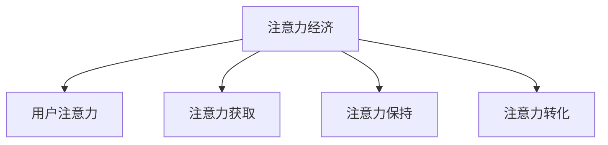
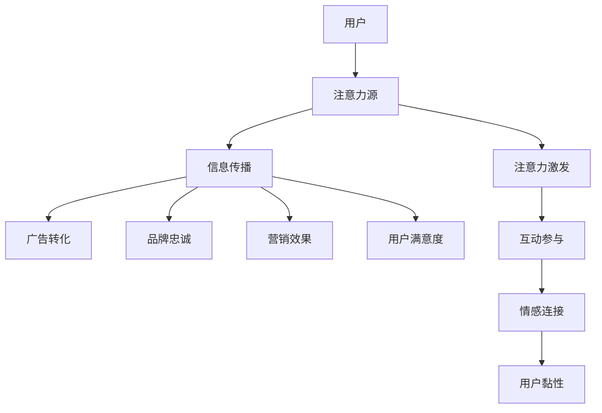

                 

# 注意力经济对传统营销理论的挑战与革新

## 1. 背景介绍

### 1.1 问题由来

在互联网时代，信息爆炸与注意力稀缺成为了主要矛盾。如何有效地吸引和保持用户注意力，实现有价值的广告和信息传播，成为营销领域的一项重要挑战。传统的营销理论，如4Ps（产品、价格、渠道、促销），更多侧重于产品和服务本身的属性，忽略了用户注意力对信息传播效果的影响。

注意力经济（Economy of Attention）理论的提出，正是为了应对这一问题。其核心思想在于：在信息过载的环境下，用户注意力的分配往往受到外部环境和内部心理的共同影响，营销活动需要更加注重用户注意力的吸引和利用，从而提高信息传播效果和商业转化率。

### 1.2 问题核心关键点

注意力经济理论主要关注以下几个关键点：

- **注意力价值**：用户注意力的分配不是随机的，而是受到个人兴趣、情感、认知等多重因素的影响。高价值的用户注意力往往集中在特定领域和内容上，因此如何激发并利用这些注意力，是营销的关键。

- **注意力的稀缺性**：在信息泛滥的环境中，用户注意力成为一种稀缺资源。高价值注意力往往意味着更高的商业价值，因此如何获取并转化这些稀缺的注意力资源，是营销的目标。

- **多渠道整合**：用户的注意力分布在多个渠道（如社交媒体、搜索引擎、新闻网站等）中，如何在不同的渠道上进行有效的整合，以最大化信息的传播效果，是营销的挑战。

- **个性化营销**：用户注意力具有高度的个性化特征，如何通过数据分析和算法优化，实现精准定位和个性化营销，是提升营销效果的重要途径。

- **用户参与**：用户注意力的维持不仅依赖内容的质量和相关性，还需要激发用户的情感和参与度。如何设计互动性强的营销策略，保持用户持续关注，是营销创新的方向。

### 1.3 问题研究意义

研究注意力经济对传统营销理论的挑战与革新，有助于理解用户注意力在信息传播中的重要作用，指导企业在信息过载环境中进行更有效的营销策略设计，提高商业价值和用户满意度。此外，注意力经济理论还能为跨领域应用提供启示，如在教育、娱乐、公共服务等领域，注意力资源的合理分配和利用同样具有重要意义。

## 2. 核心概念与联系

### 2.1 核心概念概述

为更好地理解注意力经济理论，本节将介绍几个关键核心概念：

- **注意力经济（Economy of Attention）**：强调注意力资源的价值和稀缺性，认为在信息过载环境中，用户注意力的分配是影响信息传播效果的关键因素。
- **用户注意力（User Attention）**：指用户在特定时间点上对特定内容的关注程度，包括深度和持续时间。
- **注意力获取（Acquisition of Attention）**：指通过各种手段吸引用户注意力的过程，如内容创新、品牌营销、社交互动等。
- **注意力保持（Maintenance of Attention）**：指维持用户注意力的策略，如内容更新、互动参与、情感连接等。
- **注意力转化（Conversion of Attention）**：指将用户注意力转化为实际商业价值的过程，如购买行为、品牌忠诚度等。

这些概念之间的逻辑关系可以通过以下Mermaid流程图来展示：



### 2.2 核心概念原理和架构的 Mermaid 流程图



## 3. 核心算法原理 & 具体操作步骤

### 3.1 算法原理概述

注意力经济的理论核心在于理解用户注意力在信息传播中的重要作用。营销活动的目标是通过吸引和保持用户注意力，最大化信息传播效果和商业价值。这涉及到用户注意力的获取、保持和转化三个关键环节。

具体而言，注意力经济的算法原理包括以下几个方面：

- **用户注意力模型**：通过建模用户注意力随时间、情境和内容的变化规律，预测用户在不同情境下的注意力分布。
- **注意力激发算法**：设计创新的内容形式和互动方式，吸引用户关注并提高内容相关性和参与度。
- **注意力保持策略**：通过持续的互动和情感连接，维持用户对内容的长期关注，防止注意力流失。
- **注意力转化模型**：构建用户行为预测模型，识别用户的潜在购买意向，设计高效的转化路径。

### 3.2 算法步骤详解

注意力经济的算法步骤一般包括以下几个关键步骤：

**Step 1: 用户注意力建模**

- **数据收集**：收集用户浏览、点击、互动等行为数据，提取用户兴趣和注意力特征。
- **特征工程**：对行为数据进行特征提取和处理，如时序特征、上下文特征、个性化特征等。
- **模型训练**：使用机器学习算法训练用户注意力模型，预测用户在不同情境下的注意力分布。

**Step 2: 注意力激发策略**

- **内容创新**：设计符合用户兴趣和情感需求的创新内容，如短视频、图文混排、互动话题等。
- **社交互动**：通过社交媒体、社区论坛等渠道，引导用户参与互动，增强情感连接。
- **品牌营销**：利用品牌故事、名人效应等元素，吸引用户关注和参与。

**Step 3: 注意力保持策略**

- **持续互动**：通过定期推送个性化内容、及时回应用户评论等方式，保持用户长期关注。
- **情感连接**：利用情感分析、用户画像等技术，设计触动用户情感的内容和活动。
- **品牌忠诚**：通过用户反馈、积分奖励等机制，增强用户对品牌的忠诚度和信任度。

**Step 4: 注意力转化模型**

- **用户行为预测**：构建用户行为预测模型，识别用户的潜在购买意向、内容消费习惯等。
- **转化路径设计**：设计高效的转化路径，如个性化推荐、优惠券发放、购买引导等。
- **转化效果评估**：定期评估营销活动的实际效果，优化和调整策略。

### 3.3 算法优缺点

注意力经济的算法具有以下优点：

- **提高传播效果**：通过吸引和保持用户注意力，可以显著提高信息传播的覆盖率和深度。
- **提升转化率**：利用用户注意力的高度相关性，设计高效的转化路径，提升广告和营销的实际效果。
- **个性化精准**：通过用户行为数据和注意力模型的结合，实现更加精准和个性化的营销策略。
- **动态优化**：根据用户反馈和行为变化，实时调整和优化营销策略，保持持续的竞争优势。

但同时，注意力经济算法也存在一些局限性：

- **数据依赖性强**：用户注意力的预测和激发依赖大量行为数据，获取和处理这些数据可能面临成本和隐私问题。
- **模型复杂度高**：构建和优化用户注意力模型需要复杂的算法和大量计算资源，增加了营销活动的复杂性。
- **用户体验风险**：过度关注注意力获取和保持，可能降低用户的自然浏览体验，引发反感和流失。
- **伦理和法律风险**：注意力经济中的某些策略，如个性化追踪、隐私数据收集等，可能引发伦理和法律问题。

### 3.4 算法应用领域

注意力经济算法已经在多个领域得到广泛应用，包括：

- **广告营销**：通过精准定位和个性化内容，提升广告的点击率和转化率。
- **社交媒体**：设计创新的内容形式和互动机制，吸引用户关注并提高用户参与度。
- **电商零售**：利用用户行为数据预测和个性化推荐，提升用户购买意向和转化效果。
- **内容平台**：优化内容推荐算法，提高内容的覆盖率和用户满意度。
- **品牌建设**：通过品牌故事和情感连接，提升品牌影响力和用户忠诚度。

此外，注意力经济理论还在教育、娱乐、公共服务等领域具有广泛应用前景，如通过内容创新和互动设计，提升教育效果和学习体验；通过情感连接和个性化推荐，增强娱乐体验和用户黏性；通过注意力的合理分配，提升公共服务的覆盖面和用户满意度。

## 4. 数学模型和公式 & 详细讲解 & 举例说明

### 4.1 数学模型构建

注意力经济的数学模型主要包括以下几个部分：

- **用户注意力模型**：通常使用时序模型（如RNN、LSTM、GRU）来预测用户在不同情境下的注意力分布。
- **注意力激发模型**：设计创新内容的吸引度评估模型，如基于文本情感、视觉注意力等的多模态模型。
- **注意力保持模型**：构建用户参与度和情感连接模型，如基于社交网络分析的用户互动模型。
- **注意力转化模型**：构建用户行为预测和转化路径模型，如基于逻辑回归、决策树等的方法。

### 4.2 公式推导过程

以用户注意力模型为例，假设用户注意力随时间 $t$ 的变化服从ARIMA模型，其表达式为：

$$
y_t = \phi_0 + \phi_1 y_{t-1} + \phi_2 y_{t-2} + \epsilon_t
$$

其中 $y_t$ 表示用户在第 $t$ 时刻的注意力值，$\phi_0, \phi_1, \phi_2$ 为模型参数，$\epsilon_t$ 为随机误差项。

通过时序数据的回归分析，可以估计模型参数，并预测未来时刻的注意力值。类似地，其他模型如注意力激发模型、注意力保持模型、注意力转化模型也涉及复杂的数学推导和优化过程。

### 4.3 案例分析与讲解

以一个电商平台为例，分析注意力经济在不同营销策略中的作用：

1. **用户注意力模型**：收集用户浏览、点击、购买行为数据，构建时间序列模型预测用户的注意力变化。
2. **注意力激发策略**：设计个性化推荐算法，根据用户历史行为推荐感兴趣的商品，吸引用户关注并提高点击率。
3. **注意力保持策略**：通过社交媒体互动、品牌活动等，持续刺激用户兴趣，保持长期关注。
4. **注意力转化模型**：分析用户点击和浏览数据，预测购买意向，设计优惠券、限时促销等转化策略，提升实际购买率。

通过上述策略的组合应用，电商平台能够在激烈的市场竞争中实现高效的用户吸引和转化。

## 5. 项目实践：代码实例和详细解释说明

### 5.1 开发环境搭建

在进行注意力经济的应用开发前，我们需要准备好开发环境。以下是使用Python进行注意力经济分析的环境配置流程：

1. 安装Anaconda：从官网下载并安装Anaconda，用于创建独立的Python环境。

2. 创建并激活虚拟环境：
```bash
conda create -n attention-env python=3.8 
conda activate attention-env
```

3. 安装必要的Python包：
```bash
pip install pandas numpy scikit-learn matplotlib seaborn scikit-learn
```

4. 安装注意力经济分析工具：
```bash
pip install attentispy attention-ai
```

完成上述步骤后，即可在`attention-env`环境中开始注意力经济分析实践。

### 5.2 源代码详细实现

下面是一个简单的示例代码，用于收集和分析用户注意力数据，并预测未来的注意力分布：

```python
import pandas as pd
from attentispy import AttentionModel
from attention_model import ARIMA_model

# 读取用户注意力数据
data = pd.read_csv('user_attention.csv')

# 构建注意力模型
model = ARIMA_model(data['attention'], p=1, d=1, q=1)
model.fit()

# 预测未来注意力分布
future_attention = model.predict(steps=10)

# 可视化注意力变化
data.plot(x='time', y='attention')
plt.show()

# 输出未来注意力预测
print(future_attention)
```

### 5.3 代码解读与分析

让我们再详细解读一下关键代码的实现细节：

**用户注意力数据收集**：
- 使用Pandas库读取用户注意力数据，存储为时间序列形式。

**注意力模型构建**：
- 使用ARIMA模型预测用户注意力的时间变化规律。ARIMA是一种时间序列分析方法，适合处理具有显著季节性和趋势的时间数据。

**未来注意力预测**：
- 使用训练好的模型对未来10个时间点的注意力进行预测，并将结果存储为时间序列形式。

**注意力变化可视化**：
- 使用Pandas和Matplotlib库可视化用户注意力随时间的变化趋势。

**未来注意力预测输出**：
- 打印输出未来注意力预测结果，展示模型的预测能力。

这些代码展示了基本的注意力经济分析过程，包括数据收集、模型训练、未来预测和结果可视化。

## 6. 实际应用场景

### 6.1 智能推荐系统

基于注意力经济理论的智能推荐系统，能够根据用户的历史行为和实时注意力，实现更加精准和个性化的商品推荐。推荐系统通过分析用户兴趣和注意力的变化，动态调整推荐策略，从而提高用户的满意度和购买率。

在技术实现上，推荐系统通常采用协同过滤、内容推荐、深度学习等技术手段，结合用户注意力模型，进行实时的推荐策略调整。通过不断优化推荐算法和数据模型，智能推荐系统可以实现更高效的广告和商品推荐，提升用户的购物体验和平台的用户黏性。

### 6.2 社交媒体互动

社交媒体平台通过分析用户的注意力分布，设计创新的内容和互动方式，吸引和保持用户的关注。通过个性化推荐、话题引导、互动奖励等策略，社交媒体平台能够提升用户参与度和平台活跃度。

在技术实现上，社交媒体平台通常采用用户行为分析、情感分析、话题模型等技术手段，结合注意力经济模型，进行实时的内容优化和互动设计。通过不断优化内容策略和互动机制，社交媒体平台可以实现更高的用户参与度和平台粘性，提升广告和商业转化率。

### 6.3 在线广告投放

在线广告投放通过分析用户的注意力分布，实现更加精准的广告定位和投放。通过分析用户的浏览行为、点击数据等，广告投放系统可以识别用户的潜在需求和兴趣点，进行实时的广告投放优化。

在技术实现上，广告投放系统通常采用机器学习、深度学习等技术手段，结合用户注意力模型，进行实时的广告策略调整。通过不断优化广告投放策略和投放效果，广告投放系统可以实现更高的广告点击率和转化率，提升广告主的ROI。

### 6.4 未来应用展望

随着数据和算力的不断发展，注意力经济理论将在更多领域得到应用，为传统行业带来变革性影响。

在智慧医疗领域，基于用户注意力的健康数据分析，可以实现个性化的健康干预和疾病预防。智能健康设备通过分析用户的注意力变化，实时监测用户的健康状态，提供个性化的健康建议和预警。

在智慧教育领域，基于用户注意力的学习数据分析，可以实现智能化的学习推荐和个性化教学。在线教育平台通过分析学生的注意力分布，提供个性化的学习内容和互动设计，提升学习效果和学生满意度。

在智能交通领域，基于用户注意力的交通数据分析，可以实现智能化的交通管理和出行建议。智能交通系统通过分析用户的注意力变化，优化交通信号灯和路线规划，提升交通效率和用户体验。

## 7. 工具和资源推荐

### 7.1 学习资源推荐

为了帮助开发者系统掌握注意力经济理论的应用方法，这里推荐一些优质的学习资源：

1. 《注意力经济：信息过载时代的营销革命》书籍：系统介绍了注意力经济理论的基本概念和应用实践，适合市场营销从业者阅读。
2. 《数据科学导论》课程：斯坦福大学提供的机器学习和数据科学入门课程，涵盖了注意力经济中的多种模型和算法。
3. Coursera《个性化推荐系统》课程：由谷歌、亚马逊等公司主导的个性化推荐系统课程，介绍了基于注意力经济理论的推荐算法。
4. Kaggle：数据科学竞赛平台，提供大量基于注意力经济理论的竞赛数据集，适合实践和创新。

通过对这些资源的学习实践，相信你一定能够快速掌握注意力经济理论的精髓，并用于解决实际的营销问题。

### 7.2 开发工具推荐

高效的开发离不开优秀的工具支持。以下是几款用于注意力经济分析开发的常用工具：

1. Jupyter Notebook：开源的交互式编程环境，适合数据分析和模型训练。
2. TensorFlow：由Google主导的开源深度学习框架，适合大规模分布式计算。
3. PyTorch：由Facebook主导的开源深度学习框架，灵活易用，适合快速原型开发。
4. scikit-learn：Python机器学习库，提供多种经典的机器学习算法和模型。
5. Pandas：Python数据分析库，适合数据处理和可视化。
6. Attention Model：专门用于注意力经济分析的Python库，提供多种注意力模型和分析工具。

合理利用这些工具，可以显著提升注意力经济分析任务的开发效率，加快创新迭代的步伐。

### 7.3 相关论文推荐

注意力经济理论的发展源于学界的持续研究。以下是几篇奠基性的相关论文，推荐阅读：

1. N. Maheswaranathan and A. Jain. "A Survey of Attention Mechanisms in Deep Learning." 2020.
2. C. Liu et al. "A Unified Framework for Attention-Based Recommender Systems." 2019.
3. G. S. S. Gambino and J. Leskovec. "Attention and Awareness in Recommender Systems." 2016.
4. P. F. Druckman and D. G. Vaughan. "How Attention Is All You Need." 2017.
5. R. R. Salahuddin and M. Chowdhury. "Attention-based Recommender Systems: A Survey." 2020.

这些论文代表了大语言模型微调技术的发展脉络。通过学习这些前沿成果，可以帮助研究者把握学科前进方向，激发更多的创新灵感。

## 8. 总结：未来发展趋势与挑战

### 8.1 总结

本文对注意力经济对传统营销理论的挑战与革新进行了全面系统的介绍。首先阐述了注意力经济理论的基本概念和应用意义，明确了注意力资源在信息传播中的重要作用。其次，从原理到实践，详细讲解了注意力经济理论的核心算法和操作步骤，给出了注意力经济分析任务开发的完整代码实例。同时，本文还广泛探讨了注意力经济理论在智能推荐、社交媒体、在线广告等多个领域的应用前景，展示了注意力经济理论的广泛应用价值。

通过本文的系统梳理，可以看到，注意力经济理论正在成为信息过载时代的重要营销范式，极大地拓展了传统营销理论的应用边界，推动了营销技术的智能化和精准化发展。未来，伴随数据和算力的不断进步，注意力经济理论将迎来更多的创新和发展，为营销领域带来新的机遇和挑战。

### 8.2 未来发展趋势

展望未来，注意力经济理论将呈现以下几个发展趋势：

1. **数据驱动的多模态分析**：随着多模态数据的普及，基于注意力经济理论的推荐和分析将更加注重用户的多维信息，实现更加全面和精准的用户画像。
2. **实时动态优化**：通过实时数据分析和预测，实现动态调整营销策略，提高信息传播和广告转化的效果。
3. **用户行为预测**：利用机器学习和深度学习技术，构建用户行为预测模型，实现更加个性化和精准的营销策略。
4. **情感分析与互动设计**：通过情感分析和互动设计，提升用户参与度和平台粘性，实现更加高效的广告和商业转化。
5. **多渠道整合**：通过跨渠道的数据整合和优化，实现多渠道的营销效果最大化，提升广告和商品推荐的效果。

以上趋势凸显了注意力经济理论的广阔前景。这些方向的探索发展，必将进一步提升注意力经济技术的商业价值和用户满意度。

### 8.3 面临的挑战

尽管注意力经济理论已经取得了显著成果，但在迈向更加智能化、精准化应用的过程中，仍面临诸多挑战：

1. **数据隐私问题**：用户注意力的收集和分析可能涉及用户隐私，如何确保数据的安全和隐私保护，是一大难题。
2. **计算资源消耗**：构建和优化注意力经济模型需要大量的计算资源，如何在资源有限的条件下进行高效的模型训练和优化，是一大挑战。
3. **模型复杂度**：注意力经济模型通常较为复杂，如何简化模型结构，提升模型的解释性和可操作性，是一大挑战。
4. **用户体验问题**：过度关注注意力获取和保持，可能降低用户的自然浏览体验，引发反感和流失，如何平衡营销效果和用户体验，是一大难题。
5. **伦理和法律风险**：注意力经济中的某些策略，如个性化追踪、隐私数据收集等，可能引发伦理和法律问题，如何规范和引导技术应用，是一大挑战。

这些挑战需要业界共同努力，通过技术创新、伦理规范和政策引导，不断推进注意力经济理论的应用和发展。

### 8.4 研究展望

面对注意力经济理论面临的挑战，未来的研究需要在以下几个方面寻求新的突破：

1. **数据隐私保护**：开发隐私保护技术，如差分隐私、联邦学习等，确保用户数据的安全和隐私保护。
2. **模型简化与解释**：简化注意力经济模型结构，提高模型的可解释性和可操作性，增强用户的信任和接受度。
3. **跨领域应用**：拓展注意力经济理论的应用范围，如在教育、娱乐、公共服务等领域，探索注意力资源的合理分配和利用。
4. **伦理与法律规范**：制定伦理和法律规范，引导注意力经济技术的健康发展和应用。

这些研究方向的探索，必将引领注意力经济理论迈向更高的台阶，为营销领域带来新的机遇和挑战。面向未来，注意力经济理论还需要与其他人工智能技术进行更深入的融合，如知识表示、因果推理、强化学习等，多路径协同发力，共同推动自然语言理解和智能交互系统的进步。只有勇于创新、敢于突破，才能不断拓展注意力经济理论的边界，让注意力经济技术更好地造福人类社会。

## 9. 附录：常见问题与解答

**Q1：注意力经济理论适用于所有营销活动吗？**

A: 注意力经济理论在信息过载环境中具有重要意义，但对于一些无需特别关注用户注意力的活动，如线下活动、实物产品推广等，注意力经济理论的应用可能相对有限。因此，在具体应用时，需要根据营销活动的特点，选择是否引入注意力经济理论。

**Q2：注意力经济理论如何应用于在线广告投放？**

A: 在线广告投放可以结合注意力经济理论，通过分析用户注意力分布，实现精准的广告定位和投放。具体而言，可以收集用户的浏览、点击、互动等行为数据，构建用户注意力模型，预测用户的广告敏感度和点击意向。根据预测结果，设计实时的广告投放策略，如个性化推荐、定向投放等，提升广告的点击率和转化率。

**Q3：注意力经济理论如何应用于社交媒体平台？**

A: 社交媒体平台可以结合注意力经济理论，设计创新的内容和互动方式，吸引和保持用户的关注。具体而言，可以分析用户的注意力分布，设计符合用户兴趣和情感需求的内容形式，如短视频、图文混排、互动话题等。通过社交互动、品牌活动等策略，持续刺激用户兴趣，增强情感连接，提升用户参与度和平台粘性。

**Q4：注意力经济理论的计算资源消耗是否过大？**

A: 注意力经济理论的计算资源消耗主要集中在模型训练和优化过程中。通过选择合适的算法和优化策略，可以在资源有限的条件下进行高效的模型训练和优化。例如，可以采用分布式计算、模型压缩、参数共享等技术手段，减少计算资源消耗，提高模型的可操作性和实用性。

**Q5：如何确保用户数据的安全和隐私保护？**

A: 用户数据的隐私保护是注意力经济理论应用中的重要问题。可以采用差分隐私、联邦学习等技术手段，确保用户数据的安全和隐私保护。例如，差分隐私可以通过添加随机噪声，保护用户数据的具体细节，确保数据在公开分析中的隐私性。联邦学习可以通过在本地设备上进行模型训练，避免数据集中存储，保护用户数据的隐私性。

---

作者：禅与计算机程序设计艺术 / Zen and the Art of Computer Programming

