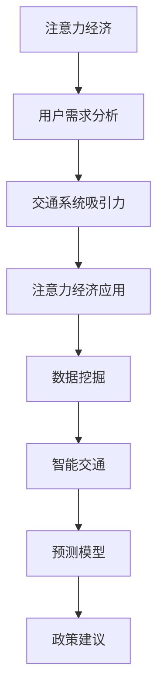

                 

# 注意力经济对城市交通的影响

> 关键词：注意力经济, 城市交通, 数据挖掘, 智能交通, 预测模型, 政策建议

## 1. 背景介绍

在数字化时代，“注意力”成为了一种宝贵的资源。信息爆炸使得人们的注意力变得分散，而通过特定的策略吸引并保持用户的注意力，即“注意力经济”，已经成为企业和个人成功的关键。这种趋势同样渗透到了城市交通领域，其影响深远且复杂。

### 1.1 问题由来
随着互联网和智能设备的普及，人们的出行方式和习惯发生了根本性的变化。城市交通不再是简单的地理运动问题，而成为了一场注意力争夺的战斗。公交、地铁、共享单车等传统交通方式，面临着来自打车、网约车、电动汽车等新兴交通方式的竞争。如何在城市交通管理中运用注意力经济的策略，吸引并保持用户的注意力，成为城市交通规划和管理的重要课题。

### 1.2 问题核心关键点
- **用户需求和行为分析**：理解用户在不同交通方式之间的选择偏好，是制定策略的基础。
- **交通系统的吸引力**：城市交通系统如何通过服务质量、价格、便利性等因素吸引用户。
- **注意力经济的应用**：通过数据挖掘和智能算法，预测用户行为并采取针对性措施。
- **政策和法规框架**：如何在保持市场竞争的同时，通过政策引导和规范交通行为。

## 2. 核心概念与联系

### 2.1 核心概念概述

为更好地理解注意力经济在城市交通中的应用，本节将介绍几个关键概念：

- **注意力经济**：指通过特定策略吸引和保持用户注意力的经济活动。
- **城市交通**：包括公交、地铁、打车、共享单车等多种交通方式和基础设施，是城市运行和居民生活质量的重要组成部分。
- **数据挖掘**：从大量数据中提取有用信息的过程，可用于分析用户行为和偏好。
- **智能交通**：利用先进的信息技术和管理方法，提升交通系统的效率和安全性。
- **预测模型**：通过机器学习算法，预测用户行为和交通流量，为决策提供依据。
- **政策建议**：基于数据分析和模型预测，提出交通管理和规划方面的建议。

这些核心概念之间的逻辑关系可以通过以下Mermaid流程图来展示：



这个流程图展示了一系列的逻辑步骤：首先从注意力经济出发，通过分析用户需求和行为吸引用户，然后通过优化交通系统吸引用户，利用数据挖掘和智能交通技术提升系统效率，最后基于预测模型提出政策建议。

## 3. 核心算法原理 & 具体操作步骤
### 3.1 算法原理概述

注意力经济在城市交通中的应用，主要基于以下几个核心算法：

- **用户行为分析**：通过分析用户的出行行为数据，识别出用户偏好和需求模式。
- **需求预测模型**：使用机器学习算法预测用户在不同交通方式之间的选择概率，为交通系统设计提供依据。
- **流量优化算法**：通过智能算法调整交通流量，缓解拥堵，提高效率。
- **政策评估模型**：基于预测结果和用户反馈，评估政策对交通系统的影响，提出优化建议。

这些算法的核心在于通过数据的分析和处理，实现对用户行为和需求的精确理解，从而设计出更加吸引人的城市交通系统，并根据反馈不断优化。

### 3.2 算法步骤详解

以下是对注意力经济在城市交通中应用的核心算法步骤的详细讲解：

**Step 1: 数据收集与处理**
- 收集用户出行数据，包括行程时间、距离、使用频率、支付信息等。
- 对数据进行清洗、归一化、特征提取等预处理，确保数据的准确性和可用性。

**Step 2: 用户行为分析**
- 使用聚类、分类等数据挖掘技术，识别出不同用户群体的行为特征。
- 通过关联分析，挖掘用户在不同交通方式之间的偏好模式。

**Step 3: 需求预测建模**
- 使用监督学习算法（如线性回归、随机森林、神经网络等）构建预测模型。
- 使用交叉验证等技术评估模型的准确性，并进行参数调优。

**Step 4: 流量优化算法**
- 根据需求预测结果，设计智能流量调控策略。
- 通过仿真模拟等手段，测试策略的效果，并进行优化。

**Step 5: 政策评估模型**
- 根据预测结果和用户反馈，构建政策效果评估模型。
- 使用蒙特卡罗模拟等方法评估不同政策对交通系统的影响，提出优化建议。

### 3.3 算法优缺点

注意力经济在城市交通中的应用，有以下优点：

- **个性化服务**：通过分析用户行为，提供个性化的出行建议和服务，提升用户体验。
- **效率提升**：通过智能调控，缓解交通拥堵，提高运输效率。
- **数据驱动**：以数据为基础，科学决策，避免主观判断的偏差。

同时，也存在一些局限性：

- **数据隐私**：大量数据收集和处理可能导致用户隐私泄露。
- **技术复杂性**：需要复杂的算法和先进的技术支持，实施难度较大。
- **政策执行**：即使预测模型准确，政策的执行和落地仍然面临挑战。

### 3.4 算法应用领域

注意力经济在城市交通中的应用，涉及多个领域：

- **公共交通优化**：分析用户使用习惯，优化公交、地铁等公共交通系统。
- **共享经济服务**：分析用户对共享单车、网约车的使用行为，优化服务策略。
- **智能交通系统**：结合大数据和AI技术，构建智能交通管理系统。
- **交通政策设计**：基于用户需求预测，制定交通管理政策和法规。

## 4. 数学模型和公式 & 详细讲解

### 4.1 数学模型构建

在城市交通中，注意力经济的应用通常涉及以下几个数学模型：

- **用户行为模型**：描述用户在不同交通方式之间的选择概率，通常使用多分类逻辑回归模型。
- **流量优化模型**：预测不同交通方式下的流量变化，使用线性回归或神经网络模型。
- **政策效果模型**：评估政策对交通流量的影响，使用差异化回归模型。

以用户行为模型为例，假设用户的出行方式选择可以用向量 $\mathbf{y} \in \{0,1\}^k$ 表示，其中 $k$ 是交通方式的种类数。令 $X$ 为特征矩阵，$w$ 为模型参数，则逻辑回归模型的输出为：

$$
\hat{\mathbf{y}} = \sigma(Xw)
$$

其中 $\sigma(z) = \frac{1}{1 + e^{-z}}$ 为sigmoid函数。

### 4.2 公式推导过程

以用户行为模型为例，推导其训练和预测公式：

**训练公式**：
$$
\min_{w} L(w) = -\frac{1}{N} \sum_{i=1}^N \sum_{j=1}^k y_{ij} \log \hat{y}_{ij} + (1-y_{ij})\log(1-\hat{y}_{ij})
$$

**预测公式**：
$$
\hat{y}_{ij} = \sigma(X_iw)
$$

其中 $N$ 为样本数，$y_{ij}$ 表示样本 $i$ 选择第 $j$ 种交通方式的概率。

**优化算法**：通常使用随机梯度下降（SGD）、Adam等优化算法，调整模型参数 $w$ 以最小化损失函数 $L(w)$。

### 4.3 案例分析与讲解

以北京市交通系统为例，通过对大量用户出行数据的分析，构建用户行为模型。通过逻辑回归模型，识别出不同用户群体在不同天气和路况下的出行偏好。具体步骤如下：

1. **数据收集**：收集北京市公交、地铁、共享单车、网约车等交通方式的使用数据，包括用户ID、行程时间、距离、支付方式等。
2. **数据预处理**：对数据进行去重、归一化、特征提取等预处理，确保数据质量。
3. **模型构建**：使用逻辑回归模型，训练得到用户行为预测模型。
4. **模型评估**：在验证集上评估模型准确率，使用AUC、精确度、召回率等指标衡量模型性能。
5. **策略优化**：根据模型结果，优化交通系统的服务策略，如调整公交线路、优化共享单车投放点、制定出行补贴政策等。

## 5. 项目实践：代码实例和详细解释说明
### 5.1 开发环境搭建

在进行城市交通应用开发前，需要准备好开发环境。以下是使用Python进行机器学习和深度学习开发的环境配置流程：

1. 安装Anaconda：从官网下载并安装Anaconda，用于创建独立的Python环境。

2. 创建并激活虚拟环境：
```bash
conda create -n traffic-env python=3.8 
conda activate traffic-env
```

3. 安装必要的Python库：
```bash
pip install numpy pandas scikit-learn tensorflow matplotlib seaborn
```

4. 安装数据处理和分析工具：
```bash
pip install pytorch torchvision torchaudio transformers pyspark sqlalchemy
```

5. 安装机器学习库和模型评估工具：
```bash
pip install lightgbm catboost xgboost keras tensorflow
```

完成上述步骤后，即可在`traffic-env`环境中开始城市交通应用开发。

### 5.2 源代码详细实现

以下是对用户行为分析模型的代码实现。

```python
import pandas as pd
import numpy as np
from sklearn.model_selection import train_test_split
from sklearn.linear_model import LogisticRegression
from sklearn.metrics import accuracy_score, roc_auc_score

# 数据预处理
data = pd.read_csv('traffic_data.csv')
# 特征选择和编码
# ...

# 分割数据集
X_train, X_test, y_train, y_test = train_test_split(X, y, test_size=0.2, random_state=42)

# 模型训练
model = LogisticRegression()
model.fit(X_train, y_train)

# 模型评估
y_pred = model.predict_proba(X_test)
accuracy = accuracy_score(y_test, np.round(y_pred[:, 1]))
auc = roc_auc_score(y_test, y_pred[:, 1])
print('Accuracy:', accuracy)
print('AUC:', auc)
```

### 5.3 代码解读与分析

在上述代码中，我们使用了逻辑回归模型来预测用户选择不同交通方式的概率。代码实现主要包括以下几个步骤：

1. **数据预处理**：使用Pandas库对原始数据进行清洗、归一化、特征选择等预处理，确保数据质量。
2. **模型训练**：使用sklearn库中的LogisticRegression模型进行训练，优化模型参数。
3. **模型评估**：在测试集上评估模型性能，使用准确率和AUC等指标衡量模型效果。

## 6. 实际应用场景

### 6.1 智能交通系统

智能交通系统是城市交通中注意力经济应用的重要场景之一。通过智能算法和大数据，可以实现交通信号灯优化、路线智能规划、事故预测等功能，提升城市交通的整体效率。

具体应用场景包括：

- **信号灯优化**：分析交通流量，自动调整信号灯时长，减少交通拥堵。
- **路线智能规划**：根据用户出行习惯和实时路况，推荐最佳路线，提升出行效率。
- **事故预测**：分析历史事故数据，预测可能发生的事故点，提前采取措施。

### 6.2 共享经济服务

共享单车和网约车等共享经济服务，通过分析用户行为数据，提供更加个性化的服务，提升用户体验。

具体应用场景包括：

- **投放优化**：分析用户骑行习惯，优化共享单车的投放点，提升利用率。
- **价格调控**：根据需求变化，动态调整共享单车和网约车的价格，优化用户选择行为。
- **用户忠诚度管理**：分析用户使用行为，设计个性化服务，提升用户粘性。

### 6.3 公共交通优化

公共交通是城市交通中的基础，通过分析用户数据，优化公交线路和班次，提升公共交通的效率和舒适性。

具体应用场景包括：

- **线路优化**：根据用户出行习惯，优化公交线路，减少乘客等待时间。
- **班次调整**：根据用户需求和实时交通情况，动态调整班次，提高运输效率。
- **站点设计**：分析用户到达站点的方式，优化站点设计，提升乘坐体验。

## 7. 工具和资源推荐
### 7.1 学习资源推荐

为了帮助开发者系统掌握注意力经济在城市交通中的应用，这里推荐一些优质的学习资源：

1. **《智能交通系统与大数据》**：详细介绍了智能交通系统和大数据技术在交通管理中的应用。
2. **《机器学习实战》**：通过实例讲解机器学习算法在交通数据分析中的应用。
3. **《深度学习与城市交通管理》**：介绍了深度学习技术在交通预测和决策中的应用。
4. **《数据科学与城市交通》**：全面介绍了数据挖掘和分析技术在城市交通中的应用。
5. **Kaggle智能交通数据集**：提供了大量真实的智能交通数据集，供开发者实践和研究。

通过对这些资源的学习实践，相信你一定能够快速掌握注意力经济在城市交通中的应用，并用于解决实际的交通问题。

### 7.2 开发工具推荐

高效的开发离不开优秀的工具支持。以下是几款用于城市交通应用开发的常用工具：

1. **PyTorch**：基于Python的开源深度学习框架，灵活动态的计算图，适合快速迭代研究。
2. **TensorFlow**：由Google主导开发的开源深度学习框架，生产部署方便，适合大规模工程应用。
3. **H2O**：开源的机器学习平台，提供易用的API和丰富的算法支持，适合快速开发。
4. **Kubeflow**：开源的机器学习平台，支持分布式训练和模型部署，适合大规模应用。
5. **Jupyter Notebook**：用于数据科学和机器学习实验的交互式编程环境，方便调试和分享。

合理利用这些工具，可以显著提升城市交通应用开发的效率，加快创新迭代的步伐。

### 7.3 相关论文推荐

注意力经济在城市交通中的应用，涉及多个交叉学科领域。以下是几篇奠基性的相关论文，推荐阅读：

1. **《基于大数据的城市交通优化》**：详细介绍了城市交通优化中的数据分析和建模方法。
2. **《智能交通系统中的机器学习技术》**：介绍了机器学习在智能交通系统中的广泛应用。
3. **《基于深度学习的交通流量预测》**：介绍了深度学习在交通流量预测中的应用。
4. **《城市交通中的注意力经济》**：讨论了注意力经济在城市交通中的重要性和应用方法。
5. **《城市交通系统的数据挖掘与智能分析》**：介绍了数据挖掘和智能分析在城市交通中的应用。

这些论文代表了大数据和机器学习在城市交通中的应用趋势，通过学习这些前沿成果，可以帮助研究者把握学科前进方向，激发更多的创新灵感。

## 8. 总结：未来发展趋势与挑战
### 8.1 总结

本文对注意力经济在城市交通中的应用进行了全面系统的介绍。首先阐述了注意力经济和城市交通的基本概念及其相互关系，明确了注意力经济在城市交通管理中的重要性。其次，从原理到实践，详细讲解了基于用户行为分析的注意力经济应用方法，并给出了具体代码实现。同时，本文还探讨了注意力经济在智能交通系统、共享经济服务、公共交通优化等多个领域的应用前景，展示了注意力经济在城市交通中的巨大潜力。

通过本文的系统梳理，可以看到，注意力经济在城市交通中的应用，已经成为提升城市交通效率和用户体验的重要手段。这种数据驱动、智能化的管理方式，将为未来城市交通的智能化、绿色化、个性化发展提供新的思路和方法。

### 8.2 未来发展趋势

展望未来，注意力经济在城市交通中的应用将呈现以下几个发展趋势：

1. **智能化和自动化**：随着物联网、5G等技术的成熟，城市交通系统将更加智能化和自动化，通过实时数据分析和智能决策，实现交通管理的智能化。
2. **个性化和定制化**：基于用户行为数据，提供更加个性化的出行建议和服务，满足不同用户的需求。
3. **多模态和跨领域**：结合交通、环保、公共安全等多个领域的知识和数据，实现跨领域的数据融合和智能管理。
4. **政策引导和规范**：通过数据分析和预测，制定更加科学的交通政策和法规，引导和规范交通行为，提升交通系统的整体效率和安全性。

### 8.3 面临的挑战

尽管注意力经济在城市交通中的应用已经取得了显著成果，但在迈向更加智能化、普适化应用的过程中，仍面临诸多挑战：

1. **数据隐私和安全**：大量用户数据的收集和处理可能带来隐私泄露和数据安全问题。如何在保障用户隐私的前提下，实现数据的有效利用，是一个重要的挑战。
2. **技术复杂性**：复杂的算法和模型需要较高的技术门槛，对开发者的要求较高。如何简化算法模型，降低技术门槛，需要更多的研究和实践。
3. **政策执行**：即使模型预测准确，政策的落地执行仍然面临诸多挑战。如何在政策制定和执行之间找到平衡，需要更多的实践和经验积累。
4. **用户接受度**：新的交通管理和服务方式可能受到用户习惯和认知的阻碍。如何在推广新技术的同时，提升用户接受度，需要更多的宣传和教育。
5. **资源优化**：大型交通系统对计算资源和存储资源的需求极高，如何在保证性能的同时，优化资源使用，是一个重要的技术挑战。

### 8.4 研究展望

未来的研究需要在以下几个方面寻求新的突破：

1. **隐私保护技术**：开发更加高效、安全的隐私保护技术，确保用户数据的安全和隐私。
2. **模型可解释性**：提升模型的可解释性，使用户能够理解和信任模型决策过程。
3. **跨领域融合**：将交通系统与其他领域（如环境保护、公共安全等）的知识和数据进行融合，实现跨领域智能管理。
4. **政策和法规研究**：结合数据驱动的决策，制定更加科学和规范的交通政策和法规，引导交通系统的健康发展。
5. **用户行为研究**：深入研究用户行为模式，设计更加个性化和定制化的服务，提升用户体验。

这些研究方向的探索，将推动注意力经济在城市交通中的应用迈向新的高度，为构建更加智能、安全、绿色、便捷的城市交通系统提供坚实的理论和技术基础。

## 9. 附录：常见问题与解答

**Q1: 注意力经济在城市交通中的应用有哪些具体方法？**

A: 注意力经济在城市交通中的应用主要包括以下方法：

1. **用户行为分析**：通过分析用户出行数据，识别出用户偏好和需求模式。
2. **需求预测建模**：使用机器学习算法预测用户在不同交通方式之间的选择概率，为交通系统设计提供依据。
3. **流量优化算法**：通过智能算法调整交通流量，缓解拥堵，提高效率。
4. **政策评估模型**：基于预测结果和用户反馈，评估政策对交通系统的影响，提出优化建议。

**Q2: 如何保证用户数据隐私和安全？**

A: 保证用户数据隐私和安全，需要采取以下措施：

1. **数据匿名化**：在数据分析过程中，使用数据匿名化技术，保护用户隐私。
2. **加密技术**：使用加密技术保护数据传输和存储的安全性。
3. **访问控制**：通过严格的访问控制机制，限制对数据的访问权限。
4. **隐私政策**：制定明确的隐私政策，告知用户数据使用方式，并获得用户同意。

**Q3: 注意力经济在城市交通中的应用面临哪些挑战？**

A: 注意力经济在城市交通中的应用面临以下挑战：

1. **数据隐私和安全**：大量数据收集和处理可能带来隐私泄露和数据安全问题。
2. **技术复杂性**：复杂的算法和模型需要较高的技术门槛。
3. **政策执行**：政策的落地执行仍然面临挑战。
4. **用户接受度**：新的交通管理和服务方式可能受到用户习惯和认知的阻碍。
5. **资源优化**：大型交通系统对计算资源和存储资源的需求极高。

**Q4: 未来的研究方向有哪些？**

A: 未来的研究方向包括：

1. **隐私保护技术**：开发更加高效、安全的隐私保护技术。
2. **模型可解释性**：提升模型的可解释性，使用户理解和信任模型决策。
3. **跨领域融合**：将交通系统与其他领域的知识和数据进行融合。
4. **政策和法规研究**：制定更加科学和规范的交通政策和法规。
5. **用户行为研究**：深入研究用户行为模式，设计更加个性化和定制化的服务。

通过这些研究方向的探索，将推动注意力经济在城市交通中的应用迈向新的高度，为构建更加智能、安全、绿色、便捷的城市交通系统提供坚实的理论和技术基础。

---

作者：禅与计算机程序设计艺术 / Zen and the Art of Computer Programming

