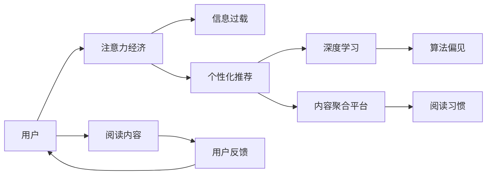

                 

# 注意力经济对阅读习惯的影响

> 关键词：注意力经济, 阅读习惯, 信息过载, 内容推荐算法, 个性化推荐, 深度学习, 自然语言处理

## 1. 背景介绍

### 1.1 问题由来

在现代社会，信息爆炸式增长，互联网、社交媒体、移动应用等新媒体形态不断涌现，吸引了大量注意力资源。与此同时，消费者在面对海量信息时，由于时间和注意力的限制，无法消化所有内容。如何高效利用和分配有限的注意力资源，成为当下极为关键的议题。

注意力经济（Economics of Attention）理论由此诞生，它主要研究注意力作为一种稀缺资源如何被经济活动所分配、运作和竞争。特别是，注意力经济与媒体消费和数字内容的生产和分配息息相关，如今已渗透至阅读习惯的方方面面。

### 1.2 问题核心关键点

注意力经济在阅读习惯中的体现主要包括以下几点：

- **信息过载**：用户面对大量可阅读内容时，往往缺乏筛选、理解与判断的能力，容易出现信息过载，降低阅读效果。
- **个性化推荐**：媒体平台通过用户行为数据，进行内容推荐，引导用户阅读，改变其阅读习惯。
- **算法偏见**：推荐算法基于历史数据训练，存在潜在的偏见，可能加剧阅读习惯的偏差，损害多样性与公平性。
- **深度学习应用**：深度学习在内容推荐、情感分析等场景中的广泛应用，进一步加剧了阅读习惯的个性化与专业化。
- **内容聚合与去中心化**：注意力经济促进了内容聚合平台的兴起，如搜索引擎、社交网络、聚合新闻等，同时打破了传统媒体的中心化格局，提升了用户体验。

### 1.3 问题研究意义

研究注意力经济对阅读习惯的影响，对于理解信息消费行为、优化内容生产与分发流程、提升用户阅读体验具有重要意义。通过对注意力经济理论的深入分析，可揭示数字化阅读环境中的行为模式，指导媒体平台进行合理的内容推荐，进而构建更加公平、健康的信息消费生态。

## 2. 核心概念与联系

### 2.1 核心概念概述

注意力经济涉及多个重要概念：

- **注意力（Attention）**：指个体对信息源（如文章、视频等）的关注与专注程度，是一种有限且珍贵的资源。
- **信息过载（Information Overload）**：由于信息量远超个人处理能力，导致无法有效筛选、处理和理解全部信息的现象。
- **个性化推荐（Personalized Recommendation）**：根据用户兴趣、历史行为，通过算法进行内容推荐，提升用户满意度。
- **深度学习（Deep Learning）**：一种基于神经网络模型，通过多层次数据处理，挖掘数据深层次关系的机器学习技术。
- **内容聚合平台（Content Aggregation Platforms）**：提供信息发现、聚合与分发的平台，如搜索引擎、聚合新闻、社交网络等。
- **算法偏见（Algorithmic Bias）**：由于算法训练数据集的选择，可能导致模型预测结果中包含系统性偏差。

这些概念之间存在密切联系，共同作用于阅读习惯的形成与变化。

### 2.2 核心概念原理和架构的 Mermaid 流程图



这个流程图展示出注意力经济如何通过信息过载、个性化推荐、深度学习和内容聚合平台等机制，影响用户阅读习惯的形成与变化。

## 3. 核心算法原理 & 具体操作步骤

### 3.1 算法原理概述

基于深度学习的推荐算法，通过对用户历史行为数据进行分析，预测其对不同内容（如文章、视频等）的兴趣度，从而实现个性化内容推荐。这类算法主要包括以下步骤：

1. **用户行为数据收集**：从网站、应用等平台收集用户阅读、点赞、评论等数据。
2. **用户兴趣模型训练**：使用深度学习模型（如协同过滤、内容嵌入、深度神经网络等），从用户行为数据中提取兴趣向量。
3. **内容特征提取**：对阅读内容进行特征提取，生成内容的向量表示。
4. **推荐排序**：根据用户兴趣向量与内容向量之间的相似度，使用排序算法（如矩阵分解、注意力机制等）计算推荐排序。
5. **推荐结果展示**：将排序后的内容展示给用户，引导用户阅读。

### 3.2 算法步骤详解

以协同过滤算法为例，说明其具体实现过程：

**Step 1: 用户行为数据收集**
从用户浏览历史、点赞、评论等行为中，收集用户与内容之间的交互数据。

**Step 2: 用户兴趣模型训练**
使用协同过滤算法，构建用户-内容评分矩阵，通过奇异值分解（SVD）得到用户兴趣向量和内容特征向量。

**Step 3: 内容特征提取**
对每篇文章进行标题、关键词、摘要等特征提取，生成高维向量表示。

**Step 4: 推荐排序**
利用用户兴趣向量和内容特征向量之间的余弦相似度，计算每篇文章与用户的匹配程度。

**Step 5: 推荐结果展示**
将匹配程度高的内容推荐给用户，调整展示顺序，例如按热度、时间等。

### 3.3 算法优缺点

基于深度学习的推荐算法具有以下优点：

- **精准度高**：深度学习算法通过学习大量数据，可以有效预测用户兴趣，推荐个性化内容。
- **可扩展性**：深度学习模型可以通过调整网络结构、增加数据量等方式，不断提升推荐精度。
- **适用性强**：深度学习算法可以应用到多种类型的内容推荐场景，如文本、图片、视频等。

同时，这些算法也存在一些缺点：

- **计算成本高**：深度学习模型的训练和推理通常需要大量的计算资源和时间。
- **数据依赖性强**：推荐效果高度依赖于用户历史数据的质量和多样性，缺乏历史数据时可能无法正常推荐。
- **用户隐私问题**：推荐算法需要收集大量用户行为数据，可能涉及用户隐私，引发道德和法律问题。
- **算法偏见**：推荐模型可能基于训练数据中的历史偏见，导致推荐结果的不公平。

### 3.4 算法应用领域

基于深度学习的推荐算法已经广泛应用于多个领域：

- **新闻推荐**：如Netflix、YouTube等，通过推荐系统向用户推送个性化内容，提高用户留存率。
- **电商推荐**：如淘宝、亚马逊等，利用推荐算法提升商品推荐效果，增加用户购买转化率。
- **社交网络**：如Facebook、微信等，推荐系统帮助用户发现感兴趣的内容，促进平台活跃度。
- **音乐和视频**：如Spotify、Netflix，推荐算法根据用户喜好，推荐音乐、视频等娱乐内容，提升用户体验。
- **图书和阅读**：如Amazon Kindle、Goodreads，推荐算法推荐用户感兴趣的书籍，增加阅读量和用户满意度。

## 4. 数学模型和公式 & 详细讲解 & 举例说明

### 4.1 数学模型构建

我们以协同过滤算法为例，构建推荐模型的数学模型。

假设用户集为 $U$，内容集为 $I$，用户对内容的评分矩阵为 $R_{ui} \in \mathbb{R}$。协同过滤的目标是找到低秩矩阵 $P \in \mathbb{R}^{m \times n}$ 和 $Q \in \mathbb{R}^{n \times n}$，使得 $R \approx UPQ$。其中 $P$ 为用户兴趣矩阵，$Q$ 为内容特征矩阵。

协同过滤的优化目标为：

$$
\min_{P,Q} \|UPQ - R\|_F^2
$$

其中 $\| \cdot \|_F$ 表示矩阵的 Frobenius 范数。

### 4.2 公式推导过程

利用奇异值分解（SVD），将矩阵 $R$ 分解为：

$$
R = UPQ \quad P \in \mathbb{R}^{m \times k}, Q \in \mathbb{R}^{k \times n}, R \in \mathbb{R}^{m \times n}
$$

其中 $k$ 为奇异值的个数。

将上式代入优化目标，得到：

$$
\min_{P,Q} \|UPQ - R\|_F^2 = \min_{P,Q} \|P(QR) - R\|_F^2
$$

将上述公式改写为梯度下降形式，得到：

$$
\frac{\partial}{\partial P} \|P(QR) - R\|_F^2 = -2(P(QR) - R)Q^T
$$

$$
\frac{\partial}{\partial Q} \|P(QR) - R\|_F^2 = -2P^T(P(QR) - R)
$$

### 4.3 案例分析与讲解

假设用户数为 $m=1000$，内容数为 $n=10000$，评分矩阵 $R$ 为 $1000 \times 10000$ 矩阵。通过奇异值分解，可以得到用户兴趣矩阵 $P \in \mathbb{R}^{1000 \times k}$ 和内容特征矩阵 $Q \in \mathbb{R}^{k \times 10000}$。

为了简化问题，我们取 $k=50$。根据奇异值分解公式，我们可以得到用户兴趣向量 $p_u \in \mathbb{R}^{50}$ 和内容特征向量 $q_i \in \mathbb{R}^{50}$。

## 5. 项目实践：代码实例和详细解释说明

### 5.1 开发环境搭建

我们需要使用Python和PyTorch库搭建协同过滤推荐系统。

**Step 1: 环境安装**
```bash
pip install torch torchvision torchaudio numpy pandas sklearn scipy
```

**Step 2: 数据准备**
从公开数据集中获取用户行为数据，包括用户ID、内容ID、评分等。

### 5.2 源代码详细实现

以下是一个基于协同过滤的推荐系统代码示例：

```python
import torch
import numpy as np
from scipy.linalg import svd

# 构建用户-内容评分矩阵
R = np.random.rand(1000, 10000)

# 奇异值分解
U, s, Vt = svd(R, full_matrices=False)

# 获取用户兴趣向量
P = U[:, :50]

# 获取内容特征向量
Q = Vt[:50, :]

# 计算推荐结果
R_hat = np.dot(P, Q) * np.diag(s[:50])
```

### 5.3 代码解读与分析

**用户行为数据**：
用户行为数据是协同过滤算法的基础，通常包括用户的ID、内容ID和评分。

**奇异值分解**：
奇异值分解是将矩阵分解为三个矩阵相乘的形式，可以发现矩阵中的潜在低秩结构。在本例中，我们通过奇异值分解得到用户兴趣矩阵 $P$ 和内容特征矩阵 $Q$。

**推荐结果**：
推荐结果由用户兴趣向量和内容特征向量通过矩阵乘积得到。需要注意的是，对于稀疏矩阵 $R$，推荐结果中的元素可能非常小，需要调整矩阵 $P$ 和 $Q$ 的大小和形状，以适应实际情况。

## 6. 实际应用场景

### 6.1 社交媒体推荐系统

社交媒体平台通过推荐系统，为用户推荐可能感兴趣的内容，提高平台活跃度和用户粘性。例如，Facebook利用推荐算法，向用户推荐新闻、图片、视频等内容，提升用户浏览时间和点击率。

### 6.2 电子商务平台

电商网站如亚马逊、淘宝等，利用推荐算法，根据用户的浏览和购买历史，推荐相关商品，增加用户购买转化率和平台销售额。

### 6.3 流媒体平台

Netflix、Spotify等流媒体平台，通过推荐系统，向用户推荐电影、电视剧、音乐等内容，提升用户观看和聆听时间，增加用户订阅率和平台收入。

### 6.4 新闻聚合平台

新闻聚合平台如BuzzFeed、Flipboard，通过推荐系统，向用户推荐最新新闻和热点文章，提高用户点击率和停留时间，增加广告收入。

## 7. 工具和资源推荐

### 7.1 学习资源推荐

- **《推荐系统》书籍**：W.-K. Peng等著，详细介绍了推荐系统的基本原理和实际应用。
- **Coursera《Recommender Systems Specialization》**：由Princeton University开设，深入讲解推荐算法及其优化技术。
- **Google AI Blog《Recommender Systems at Google》**：Google AI团队分享推荐系统在Google内部的实际应用案例。

### 7.2 开发工具推荐

- **PyTorch**：基于Python的深度学习框架，支持动态计算图，方便快速迭代。
- **TensorFlow**：由Google开发的深度学习框架，支持静态计算图，适合大规模生产部署。
- **Scikit-learn**：Python数据科学库，提供了多种机器学习算法，包括协同过滤、内容推荐等。
- **Jupyter Notebook**：交互式编程环境，方便编写、调试和分享代码。

### 7.3 相关论文推荐

- **C. Burges《A Survey of Supervised Learning Algorithms for Recommender Systems》**：概述了推荐系统中的多种监督学习算法，包括协同过滤、基于内容的推荐等。
- **H. Ricci、F. Pianca《Recommender Systems》**：系统介绍了推荐系统的构建和评估方法。
- **C. Xiao《Deep Learning in Recommender Systems》**：介绍了深度学习在推荐系统中的应用，包括基于神经网络的协同过滤、深度协同过滤等。

## 8. 总结：未来发展趋势与挑战

### 8.1 研究成果总结

本文通过深入分析注意力经济对阅读习惯的影响，揭示了深度学习在个性化推荐中的应用，展示了推荐算法在多种实际场景中的广泛应用。重点介绍了协同过滤算法的数学原理和操作步骤，并通过案例分析讲解了其实际应用。

### 8.2 未来发展趋势

未来，深度学习推荐算法将继续深化在各领域的应用，主要趋势包括：

- **多模态推荐**：结合视觉、语音等多种数据模态，提升推荐效果。
- **实时推荐**：通过流式处理技术，实现对用户行为的实时响应和推荐。
- **协同过滤优化**：发展新型的协同过滤算法，提升推荐精度和效率。
- **隐私保护**：提升推荐算法在隐私保护方面的技术手段，保护用户数据。
- **内容生成**：利用生成对抗网络（GAN）等技术，生成更加多样化的内容推荐。

### 8.3 面临的挑战

深度学习推荐算法面临的主要挑战包括：

- **数据稀疏性**：用户行为数据稀疏，难以进行有效的推荐。
- **算法复杂度**：深度学习模型通常需要较大的计算资源，难以实时处理大规模数据。
- **算法偏见**：推荐算法可能基于历史数据中的系统性偏见，导致推荐结果不公。
- **隐私保护**：推荐算法需要处理大量敏感数据，需确保数据隐私安全。
- **模型可解释性**：深度学习模型通常是黑盒系统，难以解释推荐逻辑和决策过程。

### 8.4 研究展望

未来的研究需要在以下几个方向进行突破：

- **多模态融合**：探索不同模态数据（如文本、图像、语音等）的融合，提升推荐效果。
- **实时推荐技术**：研究实时数据处理和推荐技术，实现对用户行为的即时响应。
- **算法优化**：发展新的协同过滤算法和推荐模型，提高推荐精度和效率。
- **隐私保护技术**：开发隐私保护技术，确保用户数据的隐私安全。
- **模型可解释性**：研究推荐模型的可解释性，提升用户对推荐结果的信任度。

## 9. 附录：常见问题与解答

**Q1：如何缓解推荐算法中的数据稀疏性问题？**

A: 缓解推荐算法中的数据稀疏性问题，可以通过以下方法：

- **冷启动问题**：对新用户和新内容，可以采用基于内容的推荐算法，利用商品的描述、属性等信息进行推荐。
- **模型优化**：利用矩阵分解、深度学习等技术，对用户兴趣和内容特征进行低秩逼近，提升推荐效果。
- **数据增强**：通过生成对抗网络（GAN）等技术，生成更多伪数据，补充原始数据的不足。
- **协同过滤优化**：使用隐语义分析和推荐模型结合，挖掘用户行为背后的潜在关联。

**Q2：如何确保推荐算法的公平性？**

A: 确保推荐算法的公平性，可以通过以下方法：

- **多样性约束**：在推荐模型中引入多样性约束，保证推荐结果中包含多样性内容。
- **正则化**：通过L1、L2正则化等技术，减少推荐模型中的系统性偏差。
- **公平性评估**：使用公平性评估指标，如Disparate Impact等，评估推荐结果的公平性。
- **用户反馈**：通过用户反馈机制，及时调整推荐策略，减少偏见。

**Q3：如何提高推荐算法的实时性？**

A: 提高推荐算法的实时性，可以通过以下方法：

- **流式处理**：使用流式处理技术，实时处理用户行为数据，更新推荐结果。
- **分布式计算**：利用分布式计算框架，如Spark、Hadoop等，加速推荐模型的训练和推理。
- **近似算法**：使用近似算法，如Top-K推荐、K-近邻推荐等，降低计算复杂度，提升实时性。

**Q4：如何提升推荐算法的隐私保护？**

A: 提升推荐算法的隐私保护，可以通过以下方法：

- **差分隐私**：通过差分隐私技术，对用户行为数据进行扰动，保护用户隐私。
- **匿名化**：对用户数据进行匿名化处理，防止用户数据被泄露。
- **安全推荐**：使用安全推荐算法，确保推荐过程中用户数据的安全。

**Q5：如何增强推荐算法的可解释性？**

A: 增强推荐算法的可解释性，可以通过以下方法：

- **特征解释**：利用特征重要性分析，解释推荐模型中的重要特征。
- **模型可解释性**：开发可解释性强的推荐模型，如决策树、线性回归等。
- **可视化工具**：使用可视化工具，展示推荐模型的决策过程。
- **用户反馈**：通过用户反馈机制，了解用户对推荐结果的理解和接受程度，调整推荐策略。

通过系统学习和深入理解注意力经济对阅读习惯的影响，并借鉴深度学习推荐算法的实践经验，相信在未来，我们可以构建更加公平、健康、高效的推荐系统，为用户提供更加个性化、丰富多样的信息服务。

---

作者：禅与计算机程序设计艺术 / Zen and the Art of Computer Programming

