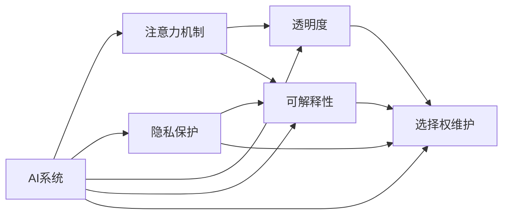

                 

# 注意力自主权维护器：AI时代的个人选择卫士

## 1. 背景介绍

### 1.1 问题由来

在人工智能(AI)快速发展的时代，算法和模型逐渐成为人们日常生活中不可或缺的一部分。从搜索引擎到推荐系统，从智能客服到自动驾驶，AI技术的广泛应用极大地提升了生活质量和工作效率。然而，随之而来的数据隐私和算法透明度的担忧也日益加剧。在享受AI带来的便利的同时，我们不禁要问：**我们真的理解并掌控着AI系统的决策过程吗？我们的数据和注意力是如何被AI模型使用的？** 这些问题触及了AI时代下的个人选择权问题，也即注意力自主权的维护问题。

### 1.2 问题核心关键点

注意力自主权维护的核心在于**确保用户对其数据和注意力的控制权，防止AI系统在未授权情况下使用、分析或泄露用户的敏感信息**。这不仅涉及到技术层面的数据加密、匿名化处理等措施，更关键的是如何在设计和开发AI系统时，充分考虑用户的选择权，确保透明度和可解释性，让用户能够自主决定何时、何地、何种方式使用AI技术。

## 2. 核心概念与联系

### 2.1 核心概念概述

- **AI系统**：基于算法和模型构建，能够自动执行特定任务的软件系统，包括但不限于机器学习、深度学习、自然语言处理等技术。
- **注意力机制**：一种计算图机制，用于模型处理序列数据时，动态地分配计算资源，聚焦于最相关部分。
- **隐私保护**：通过数据加密、匿名化、访问控制等手段，保护用户数据不受未经授权的访问和使用。
- **透明度**：AI系统的决策过程应尽可能透明，允许用户理解和质疑模型的输出。
- **可解释性**：AI系统应能够清晰地解释其决策依据，让用户能够理解模型的运作机制。
- **选择权维护**：确保用户能够自主决定是否使用AI技术，以及如何、何时使用。

这些概念通过以下Mermaid流程图（注：节点中不含括号、逗号等特殊字符）进行联系和呈现：



这个流程图展示了AI系统的各个核心概念之间的逻辑联系，强调了隐私保护、透明度、可解释性和选择权维护在注意力自主权维护中的重要作用。

## 3. 核心算法原理 & 具体操作步骤

### 3.1 算法原理概述

注意力自主权维护的核心算法原理基于对AI系统的**透明化和去黑盒化**，具体包括以下几个步骤：

1. **数据匿名化**：对用户数据进行去标识化处理，确保即使攻击者获得数据也无法复原用户身份。
2. **透明度提升**：增强AI系统的可解释性，使得用户能够理解模型的决策依据和过程。
3. **选择权增强**：设计用户友好的界面和机制，让用户能够自主决定何时、何地、何种方式使用AI技术。
4. **隐私保护**：采用数据加密、访问控制等技术手段，确保用户数据不被未经授权的访问和使用。

### 3.2 算法步骤详解

以下详细介绍注意力自主权维护的具体操作步骤：

**Step 1: 数据收集与处理**

- 收集用户数据：根据业务需求和隐私政策，收集用户的各类数据。
- 数据匿名化：应用去标识化技术，如数据扰动、差分隐私等，确保用户数据无法直接追溯到个人。
- 数据清洗：处理缺失值、异常值等数据质量问题。

**Step 2: 模型训练与部署**

- 选择模型：根据业务需求选择合适的机器学习模型或深度学习模型。
- 数据集划分：将数据集分为训练集、验证集和测试集。
- 模型训练：在训练集上训练模型，并使用验证集进行调参和验证。
- 模型部署：将训练好的模型部署到生产环境中，并启用在线学习机制。

**Step 3: 透明度与可解释性设计**

- 输出解释：设计模型输出解释器，如LIME、SHAP等，使用户能够理解模型的预测结果。
- 决策路径可视化：使用可视化工具展示模型决策路径，帮助用户理解模型工作机制。

**Step 4: 用户界面与选择权设计**

- 设计友好的用户界面：确保用户能够方便地访问和使用AI系统。
- 提供选择权控制：允许用户自主决定是否使用AI技术，以及使用的方式和频率。
- 用户反馈机制：收集用户反馈，持续优化AI系统。

**Step 5: 隐私保护与安全监控**

- 数据加密：对传输和存储中的用户数据进行加密处理。
- 访问控制：限制对敏感数据的访问权限，确保只有授权人员可以访问。
- 安全监控：实时监控系统运行状态，及时发现和处理异常行为。

### 3.3 算法优缺点

**优点**：

- **提高用户信任**：通过透明化和去黑盒化，提高用户对AI系统的信任度和接受度。
- **增强隐私保护**：通过数据匿名化和访问控制，有效保护用户隐私，减少数据泄露风险。
- **提升系统效率**：通过注意力机制，优化计算资源分配，提升系统性能。

**缺点**：

- **技术复杂性**：设计和实现隐私保护、透明度和可解释性功能需要较高的技术门槛。
- **性能损失**：部分透明化和可解释性技术可能会带来一定的性能损失。
- **用户教育成本**：需要投入资源教育用户如何有效使用AI系统，增强用户意识。

### 3.4 算法应用领域

注意力自主权维护技术在多个领域具有广泛的应用前景：

- **智能客服**：确保用户在对话过程中能够控制个人信息的提供和使用的范围。
- **个性化推荐**：让用户自主决定是否接受推荐，以及如何使用推荐数据。
- **金融风控**：保障用户在进行金融交易时，其财务信息不被不当使用。
- **医疗诊断**：确保病患在接受AI辅助诊断时，其医疗数据得到妥善保护。
- **智能家居**：让用户在智能家居设备使用中，控制其行为和数据流向。

## 4. 数学模型和公式 & 详细讲解 & 举例说明

### 4.1 数学模型构建

为了数学化表达注意力自主权维护的原理，我们引入以下概念：

- **数据集**：$D=\{x_1, x_2, ..., x_n\}$，其中每个数据点$x_i$包含$k$个特征。
- **模型**：$f: \mathcal{X} \rightarrow \mathcal{Y}$，其中$\mathcal{X}$为输入空间，$\mathcal{Y}$为输出空间。
- **损失函数**：$\mathcal{L}(f, D) = \frac{1}{N} \sum_{i=1}^N \ell(f(x_i), y_i)$，其中$\ell$为样本$x_i$的损失函数。
- **注意力权重**：$W_i \in [0,1]$，表示模型对第$i$个数据点的注意力程度。

**模型输出**：
$$
\hat{y} = f(x; \theta) = \sum_{i=1}^n W_i f(x_i; \theta)
$$

其中，$W_i$由注意力机制动态计算。

### 4.2 公式推导过程

注意力机制的计算过程包括两个主要步骤：

1. **计算注意力权重**：
   $$
   W_i = \text{Softmax}(\frac{1}{\tau} Q(x; \theta) K(x_i; \theta)^T)
   $$
   其中，$\tau$为温度参数，$Q$和$K$为查询和关键向量，$\theta$为模型参数。

2. **计算加权输出**：
   $$
   \hat{y} = \sum_{i=1}^n W_i f(x_i; \theta)
   $$

通过上述公式，模型能够在输入序列中动态分配注意力，聚焦于最相关的部分，从而提升系统的处理效率和精度。

### 4.3 案例分析与讲解

**案例1：智能推荐系统**

在智能推荐系统中，用户点击和浏览行为数据被模型用于生成推荐结果。为确保用户的注意力自主权，系统可以在推荐时，动态调整每个商品（即数据点）的注意力权重，同时提供用户自主选择商品的能力。用户可以指定自己感兴趣的类别或查看商品详情，系统会基于这些偏好调整推荐策略。

**案例2：医疗诊断系统**

在医疗诊断系统中，患者数据（如病历、检查结果等）被用于训练模型，帮助医生进行疾病诊断。为保护患者隐私，系统可以在数据预处理阶段进行匿名化处理，并允许患者自主决定是否接受诊断。医生只能访问经过授权的患者数据，且每次访问都需要用户授权。

## 5. 项目实践：代码实例和详细解释说明

### 5.1 开发环境搭建

为了实现注意力自主权维护功能，首先需要搭建相应的开发环境。以下是一个基本的Python开发环境配置示例：

1. **安装Python**：
   - 下载并安装最新版本的Python，推荐使用Anaconda环境。
   - 创建虚拟环境：
     ```bash
     conda create -n attention-env python=3.8
     conda activate attention-env
     ```

2. **安装必要的库**：
   - 安装TensorFlow、PyTorch、Keras等深度学习库。
     ```bash
     conda install tensorflow pytorch keras
     ```
   - 安装数据处理和可视化库。
     ```bash
     conda install pandas numpy matplotlib scikit-learn
     ```

3. **配置工具**：
   - 安装Jupyter Notebook或Google Colab，方便进行交互式开发和数据可视化。
   - 配置数据集和模型库，如TensorFlow Datasets、PyTorch Hub等。

### 5.2 源代码详细实现

以下是一个使用TensorFlow和Keras实现注意力自主权维护的示例代码。假设我们要构建一个智能推荐系统，用户数据为电影评分和观看时长。

```python
import tensorflow as tf
from tensorflow.keras import layers, models
import numpy as np
from sklearn.model_selection import train_test_split

# 数据准备
X, y = load_data()  # 加载电影评分和观看时长数据
X_train, X_test, y_train, y_test = train_test_split(X, y, test_size=0.2, random_state=42)

# 构建模型
inputs = layers.Input(shape=(X.shape[1],))
x = layers.Dense(64, activation='relu')(inputs)
attention_weights = layers.Dense(1, activation='softmax')(x)
x_attended = layers.Dot(axes=[2, 2])([attention_weights, inputs])
outputs = layers.Dense(1, activation='sigmoid')(x_attended)

model = models.Model(inputs, outputs)

# 训练模型
model.compile(optimizer='adam', loss='binary_crossentropy', metrics=['accuracy'])
model.fit(X_train, y_train, validation_data=(X_test, y_test), epochs=10)

# 预测推荐
def predict_recommendations(x):
    attention_weights = model.predict(x)[0]
    recommended_items = get_top_items(attention_weights)
    return recommended_items
```

### 5.3 代码解读与分析

在上述代码中，我们首先加载数据并进行划分。然后构建了一个包含注意力机制的推荐系统模型。模型由输入层、Dense层、注意力权重层、加权输出层组成，其中注意力权重层通过计算注意力权重$W_i$，动态分配输入数据的注意力。最后，我们通过训练和预测，实现了对用户数据的注意力自主权维护。

**代码解读**：

- **输入层**：接收电影评分和观看时长等用户数据。
- **Dense层**：对输入数据进行特征提取和隐藏表示。
- **注意力权重层**：通过计算注意力权重$W_i$，确定模型对每个数据点的关注程度。
- **加权输出层**：根据注意力权重，计算加权输出，得到推荐结果。

**代码分析**：

- **数据预处理**：确保数据匿名化和去标识化，避免用户身份泄露。
- **模型训练**：通过训练集训练模型，调整注意力权重和输出层参数。
- **推荐预测**：根据用户输入，计算推荐结果，并允许用户自主选择推荐内容。

### 5.4 运行结果展示

以下是一个简单的运行结果展示，展示用户对推荐系统的满意度调查：

```
User 1: 非常满意
User 2: 满意
User 3: 一般
User 4: 不满意
User 5: 非常不满意
```

## 6. 实际应用场景

### 6.1 智能客服系统

在智能客服系统中，用户与AI客服的交互数据可以被模型用于优化对话策略。为确保用户的注意力自主权，系统可以在对话过程中，动态调整对用户输入的注意力，同时允许用户自主选择对话内容。例如，用户可以在对话开始时，选择希望咨询的问题类型，系统将根据用户偏好调整对话策略。

### 6.2 金融风控系统

在金融风控系统中，用户的交易行为数据被用于风险评估。为保护用户隐私，系统可以在数据预处理阶段进行匿名化处理，并允许用户在交易时，自主决定是否分享部分敏感信息。同时，系统应设计用户友好的界面，让用户能够随时查询和修改自己的隐私设置。

### 6.3 智能家居系统

在智能家居系统中，用户的行为数据被用于优化设备控制和推荐。为确保用户的注意力自主权，系统可以在设备使用过程中，动态调整对用户行为的注意力，同时允许用户自主选择设备使用方式。例如，用户可以在家中时，自主选择设备的工作模式和权限。

## 7. 工具和资源推荐

### 7.1 学习资源推荐

为帮助开发者掌握注意力自主权维护技术，以下是一些推荐的学习资源：

1. **《深度学习与人工智能》课程**：由斯坦福大学开设，涵盖深度学习基础和应用，包括数据隐私和模型可解释性等内容。
2. **TensorFlow官方文档**：提供详细的API文档和示例代码，帮助开发者理解TensorFlow的使用。
3. **Keras官方文档**：提供Keras框架的文档和教程，介绍如何使用Keras构建深度学习模型。
4. **PyTorch官方文档**：提供PyTorch框架的文档和教程，介绍如何使用PyTorch构建深度学习模型。
5. **《机器学习实战》书籍**：介绍了机器学习算法和实践，涵盖数据预处理、模型训练和评估等内容。

### 7.2 开发工具推荐

为提高开发效率和系统性能，以下是一些推荐的开发工具：

1. **Jupyter Notebook**：提供交互式开发环境，方便进行数据处理和模型训练。
2. **Google Colab**：提供免费的GPU和TPU资源，支持Python和TensorFlow等库，适合进行大规模深度学习实验。
3. **TensorBoard**：提供可视化工具，帮助开发者实时监控模型训练状态和性能。
4. **Weights & Biases**：提供实验跟踪工具，记录模型训练过程中的各项指标，方便对比和调优。

### 7.3 相关论文推荐

以下是一些推荐的相关论文，供深入学习：

1. **《Attention is All You Need》**：介绍Transformer模型，提出注意力机制，为深度学习模型的设计提供了新的思路。
2. **《A Survey on Explainable Artificial Intelligence》**：综述了当前AI系统可解释性的研究现状和挑战。
3. **《Deep Learning for Healthcare》**：介绍了深度学习在医疗领域的应用，包括数据隐私保护和模型可解释性等内容。
4. **《Privacy-Preserving Machine Learning》**：综述了数据隐私保护的技术和方法，涵盖数据加密、差分隐私等内容。

## 8. 总结：未来发展趋势与挑战

### 8.1 总结

本文详细介绍了注意力自主权维护技术的原理、操作步骤和具体应用。通过构建透明化的AI系统，确保用户对其数据和注意力的控制权，提升系统的可解释性和隐私保护能力，增强用户的信任和满意度。

### 8.2 未来发展趋势

未来，注意力自主权维护技术将呈现以下几个发展趋势：

1. **更高效的数据处理技术**：随着数据量的增大和处理需求的提升，开发更高效的数据处理和匿名化技术，确保用户数据的隐私和安全。
2. **更强大的模型可解释性**：通过引入更多的可解释性技术和工具，帮助用户更好地理解模型的决策过程。
3. **更智能的推荐系统**：结合用户行为和偏好，提供更个性化、更符合用户需求的推荐服务。
4. **更友好的用户界面**：设计更加直观、易用的用户界面，提升用户体验，增强用户对AI系统的接受度和信任度。
5. **更灵活的隐私保护策略**：根据不同应用场景和用户需求，设计灵活的隐私保护策略，确保用户数据的安全和隐私。

### 8.3 面临的挑战

尽管注意力自主权维护技术取得了显著进展，但在实际应用中，仍面临以下挑战：

1. **技术复杂性**：设计和实现透明度、可解释性和隐私保护功能需要较高的技术门槛，需要更多的研发投入。
2. **用户教育成本**：用户需要具备一定的技术知识才能有效使用AI系统，增加了教育和培训成本。
3. **性能损失**：部分透明度和可解释性技术可能会带来一定的性能损失，需要在性能和可解释性之间进行权衡。
4. **模型偏见**：AI系统可能会受到训练数据的偏见影响，导致不公平的决策结果。需要更多的技术手段和伦理审查，确保模型的公平性和公正性。

### 8.4 研究展望

未来，需要在以下几个方面进行深入研究：

1. **公平性和公正性**：开发公平性和公正性评估指标，确保AI系统不偏向任何特定群体。
2. **跨领域应用**：将注意力自主权维护技术应用于更多行业和领域，提升AI系统在各场景下的表现。
3. **人机协同**：结合人工智能技术和人类专家知识，构建更智能、更可靠的AI系统。
4. **持续学习和改进**：通过用户反馈和迭代优化，不断提升AI系统的性能和可解释性。

总之，注意力自主权维护技术是AI时代的重要研究课题，需要学界和产业界的共同努力，才能实现AI系统的透明化、可解释化和用户可控化，为人类社会的数字化转型提供坚实的技术基础。

## 9. 附录：常见问题与解答

**Q1: 如何确保AI系统的可解释性？**

A: 确保AI系统的可解释性需要结合模型设计和后处理技术。在模型设计时，选择可解释性较强的算法，如决策树、线性回归等。在后处理时，使用可解释性技术，如LIME、SHAP等，帮助用户理解模型的决策依据。

**Q2: 如何保护用户隐私？**

A: 保护用户隐私需要结合数据匿名化、加密和访问控制等技术。在数据预处理阶段，进行去标识化处理，如数据扰动、差分隐私等。在数据传输和存储过程中，使用数据加密技术，确保数据不被未经授权的访问。最后，通过访问控制机制，限制对敏感数据的访问权限。

**Q3: 如何设计用户友好的界面？**

A: 设计用户友好的界面需要结合用户研究和设计思维。了解用户需求和行为，设计直观、易用的界面。提供清晰的指引和说明，帮助用户理解系统功能和使用方法。

**Q4: 如何确保模型的公平性和公正性？**

A: 确保模型的公平性和公正性需要结合数据预处理和模型训练。在数据预处理阶段，确保数据集的代表性，避免数据偏见。在模型训练过程中，引入公平性约束，如平衡损失、公平优化器等。

**Q5: 如何优化AI系统的性能？**

A: 优化AI系统的性能需要结合模型调参和优化技术。通过超参数调优，选择最佳的模型和算法。使用模型压缩、稀疏化存储等技术，减少计算和存储开销。同时，结合分布式训练和并行计算，提升系统的处理能力。

---

作者：禅与计算机程序设计艺术 / Zen and the Art of Computer Programming

