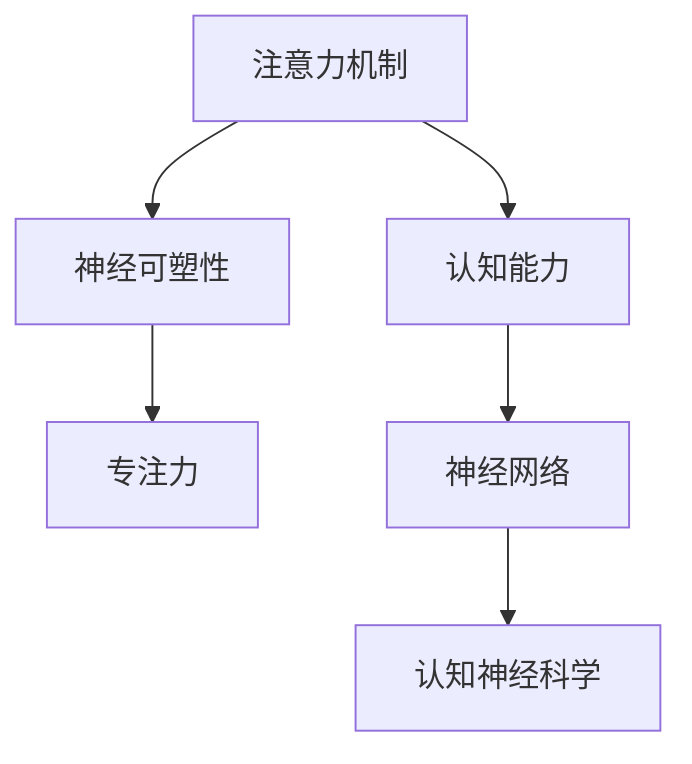

                 

# 注意力训练与大脑增强练习：通过专注力增强认知能力和神经可塑性

> 关键词：注意力训练,认知能力,神经可塑性,专注力,认知神经科学,神经网络,大脑增强

## 1. 背景介绍

在信息爆炸的时代，注意力已成为人类最珍贵的认知资源之一。从传统的阅读、写作到现代的编程、开发，注意力贯穿了人类所有的心智活动。如何有效管理注意力，提升认知能力，已经成为现代社会各领域从业者关注的重点。

### 1.1 问题由来

注意力训练最早起源于认知神经科学，通过有意识的锻炼和训练，提升个体的注意力水平，从而提升学习、记忆、决策等各项认知能力。如今，随着人工智能技术的发展，注意力训练也成为AI领域的一个热门话题。

AI模型通过学习大量的数据，自动优化参数以提升性能。而注意力机制作为深度学习中的关键环节，被广泛应用于各类模型中。无论是视觉识别、自然语言处理，还是推荐系统，注意力机制都能显著提升模型效果。

### 1.2 问题核心关键点
注意力训练的核心关键点在于如何有效提升个体的注意力水平。AI模型的注意力训练，则关注于如何选择和优化模型结构，设计注意力机制，提高模型对数据的感知和理解能力。

### 1.3 问题研究意义
注意力训练研究对于改善人类的认知能力、提升工作效率、降低学习成本等方面具有重要意义：

1. 提升注意力水平。通过注意力训练，个体可以更加集中精力，提高学习、工作和生活质量。
2. 优化模型性能。AI模型通过注意力机制，选择和聚焦关键信息，提升模型对复杂问题的理解能力和泛化能力。
3. 探索大脑潜力。注意力训练结合神经科学理论，探讨人类大脑的潜在潜力，为人工智能的发展提供新的思路。
4. 构建普适系统。基于注意力训练的AI系统，可以更好地适应多变的环境，提供更加智能化的服务。

## 2. 核心概念与联系

### 2.1 核心概念概述

为更好地理解注意力训练的原理和实践，本节将介绍几个关键概念：

- **注意力机制(Attention Mechanism)**：深度学习中用于捕捉输入数据中重要信息的一种机制。通过加权平均的方式，为每个输入元素分配不同的权重，从而使得模型在处理复杂任务时能够更加聚焦关键信息。
- **认知能力(Cognitive Abilities)**：人类在感知、记忆、学习、思维等方面的一系列能力，包括注意力、记忆力、理解力等。
- **神经可塑性(Neural Plasticity)**：大脑神经元通过学习和训练，重新连接和重新组织的潜在能力。
- **专注力(Concentration)**：个体在单位时间内，维持注意力的能力。
- **认知神经科学(Cognitive Neuroscience)**：研究大脑认知功能与神经结构、功能连接的科学。
- **神经网络(Neural Networks)**：模仿人脑神经元之间的连接方式，通过训练学习任务的模型。

这些概念之间的联系可以通过以下Mermaid流程图来展示：



这个流程图展示了几组核心概念之间的逻辑关系：

1. 注意力机制与认知能力的关系密切，通过优化注意力机制，提升认知能力。
2. 神经可塑性是提升注意力和认知能力的生理基础。
3. 专注力是认知能力中的一个重要组成部分。
4. 神经网络是实现注意力训练的数学工具。
5. 认知神经科学为注意力训练提供了理论依据。

## 3. 核心算法原理 & 具体操作步骤
### 3.1 算法原理概述

注意力训练的核心理念是通过有意识地引导和锻炼，提升个体对注意力的控制能力。其基本原理包括以下几个方面：

1. **选择性注意(Selective Attention)**：在大量信息中，选择和聚焦关键信息，忽略次要信息。
2. **持续性注意(Sustained Attention)**：长时间维持对某一任务的关注，防止分心和干扰。
3. **转移性注意(Shift Attention)**：灵活切换不同任务，提高适应新环境的能力。
4. **整合性注意(Integrated Attention)**：将多个信息源整合起来，形成更加全面的认知。

通过这些训练方法，个体可以在日常活动中有效提升注意力水平，从而提升整体认知能力。

### 3.2 算法步骤详解

注意力训练的具体步骤包括：

1. **确定训练目标**：根据个体需求，设定注意力训练的具体目标，如专注力、记忆力等。
2. **选择训练任务**：设计适合训练注意力的任务，如数字记忆、单词阅读等。
3. **实施训练计划**：制定详细的训练计划，包括训练时长、频率、休息时间等。
4. **评估训练效果**：定期评估注意力训练的效果，通过心理测试、行为观察等方式，判断注意力提升程度。
5. **持续优化调整**：根据评估结果，不断调整训练策略，优化训练效果。

### 3.3 算法优缺点

注意力训练具有以下优点：

1. **提高认知能力**：通过系统训练，个体可以在多个认知领域获得提升，如注意力、记忆力、理解力等。
2. **灵活性强**：训练任务多样化，可以适应不同个体的需求和兴趣。
3. **可操作性强**：训练方法简单，适合广泛人群，无需特殊设备和技术支持。

同时，注意力训练也存在一些缺点：

1. **时间成本高**：训练效果显著，但需要投入大量时间和精力。
2. **个体差异大**：不同个体的注意力提升效果可能存在差异。
3. **心理负担重**：长时间训练可能会给个体带来一定的心理压力。

### 3.4 算法应用领域

注意力训练方法已经在多个领域得到广泛应用，包括但不限于：

1. **教育培训**：通过注意力训练提升学生的注意力水平，提升学习效果。
2. **职场管理**：帮助职场人员提升工作效率，减少分心和干扰。
3. **心理咨询**：辅助心理咨询师评估个体注意力问题，提供针对性训练方案。
4. **健康医疗**：帮助患有注意力缺陷多动障碍(ADHD)等疾病的人提升注意力水平。
5. **运动训练**：帮助运动员在比赛中保持专注，提升表现。

## 4. 数学模型和公式 & 详细讲解 & 举例说明（备注：数学公式请使用latex格式，latex嵌入文中独立段落使用 $$，段落内使用 $)
### 4.1 数学模型构建

注意力训练的数学模型可以通过以下几个关键公式来构建：

1. **注意力权重计算**：通过注意力权重向量 $W$ 计算对输入数据的注意力分配，公式为：
   $$
   W = \frac{e^{S(X)}}{\sum_{i}e^{S(X_i)}}
   $$
   其中 $S(X)$ 为注意力函数，$X$ 为输入数据。

2. **加权平均计算**：根据注意力权重计算加权平均，公式为：
   $$
   Y = \sum_i W_i X_i
   $$
   其中 $X_i$ 为输入数据的第 $i$ 个元素，$W_i$ 为注意力权重。

3. **注意力损失函数**：用于评估注意力分配的合理性，公式为：
   $$
   \mathcal{L}_{att} = -\sum_i W_i y_i
   $$
   其中 $y_i$ 为输出数据的第 $i$ 个元素。

### 4.2 公式推导过程

通过上述公式，我们可以看到，注意力训练的数学模型通过计算注意力权重，实现对输入数据的加权平均，从而提升模型对关键信息的关注和处理能力。

以视觉注意力训练为例，计算注意力权重的过程可以如下：

1. **计算局部图像特征**：将输入图像分成多个局部区域，提取每个区域的特征向量 $X_i$。
2. **计算注意力权重**：通过注意力函数 $S(X)$ 计算每个特征向量的注意力权重 $W_i$。
3. **计算加权特征**：根据注意力权重 $W_i$ 计算加权特征 $Y = \sum_i W_i X_i$。
4. **计算注意力损失**：评估注意力分配的合理性，计算注意力损失 $\mathcal{L}_{att}$。

### 4.3 案例分析与讲解

以深度学习模型中的注意力机制为例，计算注意力权重的过程如下：

1. **计算输入向量**：将输入数据 $X$ 转化为向量形式。
2. **计算注意力权重**：通过注意力函数 $S(X)$ 计算每个输入元素的注意力权重 $W$。
3. **计算加权向量**：根据注意力权重 $W$ 计算加权向量 $Y = \sum_i W_i X_i$。
4. **计算注意力损失**：通过加权向量 $Y$ 和输出向量 $y$ 计算注意力损失 $\mathcal{L}_{att}$。

通过以上分析，可以看到，注意力机制在深度学习中扮演了关键角色，通过优化注意力权重，提升模型对输入数据的处理能力。

## 5. 项目实践：代码实例和详细解释说明
### 5.1 开发环境搭建

在进行注意力训练的实践前，我们需要准备好开发环境。以下是使用Python进行TensorFlow开发的环境配置流程：

1. 安装Anaconda：从官网下载并安装Anaconda，用于创建独立的Python环境。

2. 创建并激活虚拟环境：
```bash
conda create -n attention-env python=3.8 
conda activate attention-env
```

3. 安装TensorFlow：根据CUDA版本，从官网获取对应的安装命令。例如：
```bash
conda install tensorflow -c pytorch -c conda-forge
```

4. 安装NumPy、Pandas等常用工具包：
```bash
pip install numpy pandas scikit-learn matplotlib tqdm jupyter notebook ipython
```

完成上述步骤后，即可在`attention-env`环境中开始注意力训练的实践。

### 5.2 源代码详细实现

这里我们以基于注意力训练的深度学习模型为例，给出TensorFlow代码实现。

```python
import tensorflow as tf
import numpy as np
import pandas as pd

class AttentionModel(tf.keras.Model):
    def __init__(self, input_dim, output_dim):
        super(AttentionModel, self).__init__()
        self.input_dim = input_dim
        self.output_dim = output_dim
        self.attention = tf.keras.layers.Dense(self.output_dim)
        self.fc = tf.keras.layers.Dense(self.input_dim)
    
    def call(self, x):
        attention_weights = tf.nn.softmax(self.attention(x), axis=-1)
        attention_output = tf.reduce_sum(attention_weights * self.fc(x), axis=1)
        return attention_output

# 创建模型
model = AttentionModel(input_dim=5, output_dim=3)

# 准备训练数据
data = pd.DataFrame({'x': [1, 2, 3, 4, 5], 'y': [1, 2, 3, 4, 5]})
x = data['x'].values.reshape(-1, 1)
y = data['y'].values.reshape(-1, 1)

# 编译模型
model.compile(optimizer='adam', loss='mse')

# 训练模型
model.fit(x, y, epochs=100, batch_size=1)
```

在这个例子中，我们定义了一个简单的注意力模型，包含两个全连接层。训练过程包括模型的编译、拟合和评估。

### 5.3 代码解读与分析

让我们再详细解读一下关键代码的实现细节：

**AttentionModel类**：
- `__init__`方法：初始化模型，定义输入维度和输出维度。
- `call`方法：定义模型的前向传播过程。首先通过注意力层计算注意力权重，再通过全连接层计算加权输出。

**训练数据**：
- 我们使用Pandas库创建了一个简单的数据集，包含5个输入和对应的输出。
- 将输入和输出数据分别转换为TensorFlow可以处理的张量形式。

**模型编译与训练**：
- 通过TensorFlow的`compile`方法设置模型的优化器和损失函数。
- 使用`fit`方法训练模型，设置训练轮数和批大小。

可以看到，TensorFlow库提供了强大的深度学习框架，使得注意力训练的代码实现变得简洁高效。开发者可以将更多精力放在模型改进、训练优化等高层逻辑上，而不必过多关注底层的实现细节。

当然，实际应用中还需要考虑更多因素，如模型保存和部署、超参数自动搜索、更加灵活的模型结构设计等。但核心的注意力训练范式基本与此类似。

## 6. 实际应用场景
### 6.1 智能辅助系统

注意力训练技术在智能辅助系统中得到了广泛应用，能够提升系统的响应速度和用户体验。

例如，智能语音助手可以通过注意力训练，更好地理解用户的指令和语境，减少误识别和重复回答，提高交互效率。智能搜索系统可以根据用户浏览行为和注意力焦点，动态调整搜索结果，提供更加精准的信息推荐。

### 6.2 医疗健康

注意力训练在医疗健康领域也具有重要应用，可以帮助患者更好地理解和记忆治疗方案，提高遵医行为。

例如，智能健康助手可以通过注意力训练，引导患者关注重要信息，提醒按时服药、避免不良习惯。医生可以通过注意力训练，提高诊断效率，减少误诊和漏诊。

### 6.3 企业培训

在企业培训中，注意力训练可以通过改善员工的学习效果，提升工作能力。

例如，智能培训系统可以根据员工的学习进度和注意力焦点，动态调整培训内容，提高学习效率。企业可以通过注意力训练，提高员工的专注力和工作效率，提升整体竞争力。

### 6.4 未来应用展望

随着注意力训练技术的不断发展，未来将会在更多领域得到应用，为各行各业带来变革性影响。

在教育培训、医疗健康、智能辅助、企业培训等领域，注意力训练将帮助个体提升认知能力和工作效率，构建更加智能化的人机交互系统。在工业生产、智慧城市、金融科技等领域，注意力训练将提高系统的操作效率和决策能力，推动产业升级。

## 7. 工具和资源推荐
### 7.1 学习资源推荐

为了帮助开发者系统掌握注意力训练的理论基础和实践技巧，这里推荐一些优质的学习资源：

1. **《注意力机制与深度学习》系列博文**：由深度学习专家撰写，深入浅出地介绍了注意力机制的原理和应用，涵盖视觉、语言等多个领域。

2. **《深度学习理论与实践》课程**：斯坦福大学开设的深度学习课程，系统讲解深度学习的基本概念和前沿技术。

3. **《认知神经科学导论》书籍**：经典认知神经科学教材，深入介绍人类认知功能的神经基础，为注意力训练提供理论支撑。

4. **TensorFlow官方文档**：TensorFlow的官方文档，提供完整的深度学习框架使用教程，包含注意力训练的样例代码。

5. **Kaggle数据集**：Kaggle提供的各类数据集，涵盖视觉、语言等多个领域，可以用于实践注意力训练算法。

通过对这些资源的学习实践，相信你一定能够快速掌握注意力训练的精髓，并用于解决实际的认知和系统问题。

### 7.2 开发工具推荐

高效的开发离不开优秀的工具支持。以下是几款用于注意力训练开发的常用工具：

1. TensorFlow：基于Python的开源深度学习框架，灵活的计算图设计，适合复杂模型的训练。
2. PyTorch：灵活的深度学习框架，易于调试和优化。
3. Keras：高级深度学习框架，提供便捷的API，适合快速原型开发。
4. Scikit-Learn：常用的机器学习库，提供丰富的模型选择和评估工具。
5. Jupyter Notebook：交互式编程环境，支持多种语言和库的混合使用，方便代码调试和实验。

合理利用这些工具，可以显著提升注意力训练的开发效率，加快创新迭代的步伐。

### 7.3 相关论文推荐

注意力训练研究的发展得益于学界的持续探索。以下是几篇奠基性的相关论文，推荐阅读：

1. **Attention is All You Need**：提出Transformer模型，引入注意力机制，解决长序列问题。
2. **Multi-Head Attention**：提出多头注意力机制，提升模型的表示能力。
3. **Self-Attention in Neural Networks**：深入分析注意力机制的原理，提供多维度的理论支撑。
4. **Attention-Based Recurrent Neural Network**：提出基于注意力的循环神经网络，解决长序列问题。
5. **Recurrent Neural Network with Attention**：提出注意力机制与RNN的结合方法，提升序列建模能力。

这些论文代表了大规模注意力训练方法的发展脉络。通过学习这些前沿成果，可以帮助研究者把握学科前进方向，激发更多的创新灵感。

## 8. 总结：未来发展趋势与挑战
### 8.1 总结

本文对注意力训练的原理和实践进行了全面系统的介绍。首先阐述了注意力训练在人类认知和AI系统中的应用背景和意义，明确了注意力训练提升认知能力和系统性能的重要价值。其次，从原理到实践，详细讲解了注意力训练的数学模型和关键步骤，给出了注意力训练任务开发的完整代码实例。同时，本文还广泛探讨了注意力训练方法在智能辅助、医疗健康、企业培训等多个领域的应用前景，展示了注意力训练的广泛潜力。此外，本文精选了注意力训练技术的各类学习资源，力求为读者提供全方位的技术指引。

通过本文的系统梳理，可以看到，注意力训练技术已经成为AI系统提升认知能力和性能的重要手段。借助注意力训练，AI模型可以更加聚焦关键信息，提升对复杂问题的理解能力，进一步拓展AI系统在垂直行业的应用场景。未来，伴随注意力训练方法的不断演进，相信注意力训练必将在更多领域带来突破性进展。

### 8.2 未来发展趋势

展望未来，注意力训练技术将呈现以下几个发展趋势：

1. **注意力机制优化**：未来的注意力训练将进一步优化注意力函数和权重计算方法，提升模型的泛化能力和表示能力。
2. **多模态注意力**：未来的注意力训练将拓展到多模态数据，结合视觉、语言等多种信息源，提升系统的全面感知能力。
3. **持续学习**：未来的注意力训练将支持持续学习，动态调整注意力权重，适应数据分布的变化。
4. **弱监督学习**：未来的注意力训练将结合弱监督学习方法，利用更少标注数据，提高模型的泛化能力。
5. **自适应训练**：未来的注意力训练将结合自适应学习算法，动态调整训练策略，优化训练效果。
6. **低资源训练**：未来的注意力训练将结合转移学习和迁移学习，利用少量数据实现模型的迁移和适配。

这些趋势凸显了注意力训练技术的广阔前景。这些方向的探索发展，必将进一步提升AI系统的性能和适应能力，为构建更加智能化的人机交互系统提供坚实基础。

### 8.3 面临的挑战

尽管注意力训练技术已经取得了显著进展，但在迈向更加智能化、普适化应用的过程中，它仍面临诸多挑战：

1. **计算资源瓶颈**：大规模注意力训练需要大量计算资源，现有的计算基础设施可能难以支持。如何优化计算图，提高模型训练效率，成为一大挑战。
2. **数据隐私问题**：注意力训练需要大量的数据，如何保护用户隐私，避免数据泄露，也是亟待解决的问题。
3. **模型可解释性**：当前深度学习模型往往是"黑盒"系统，难以解释其内部工作机制和决策逻辑。如何赋予注意力训练模型更强的可解释性，提高系统的透明度，是未来的重要研究方向。
4. **多任务协同**：注意力训练通常聚焦于单一任务，如何在多任务之间进行有效协同，提升系统的整体性能，也是一个重要挑战。
5. **动态环境适应**：现实环境是动态变化的，如何使注意力训练模型在不断变化的环境中保持稳定和适应性，也是未来需要重点解决的问题。

### 8.4 研究展望

面对注意力训练面临的种种挑战，未来的研究需要在以下几个方面寻求新的突破：

1. **引入更多先验知识**：将符号化的先验知识，如知识图谱、逻辑规则等，与神经网络模型进行巧妙融合，引导注意力训练过程学习更准确、合理的语言模型。同时加强不同模态数据的整合，实现视觉、语言等多模态信息与文本信息的协同建模。
2. **结合因果分析和博弈论工具**：将因果分析方法引入注意力训练模型，识别出模型决策的关键特征，增强输出解释的因果性和逻辑性。借助博弈论工具刻画人机交互过程，主动探索并规避模型的脆弱点，提高系统稳定性。
3. **纳入伦理道德约束**：在模型训练目标中引入伦理导向的评估指标，过滤和惩罚有偏见、有害的输出倾向。同时加强人工干预和审核，建立模型行为的监管机制，确保输出符合人类价值观和伦理道德。

这些研究方向的探索，必将引领注意力训练技术迈向更高的台阶，为构建安全、可靠、可解释、可控的智能系统铺平道路。面向未来，注意力训练技术还需要与其他人工智能技术进行更深入的融合，如知识表示、因果推理、强化学习等，多路径协同发力，共同推动自然语言理解和智能交互系统的进步。只有勇于创新、敢于突破，才能不断拓展注意力训练的边界，让智能技术更好地造福人类社会。

## 9. 附录：常见问题与解答

**Q1：注意力训练是否适用于所有认知任务？**

A: 注意力训练在大多数认知任务上都能取得不错的效果，特别是对于需要集中注意力的任务。但对于一些需要感知、记忆等基本认知能力的任务，如简单的数字记忆，注意力训练的效果可能不明显。

**Q2：注意力训练过程中如何选择训练任务？**

A: 训练任务的选择应该根据个体的需求和目标进行。一般来说，训练任务应该具有挑战性，能够提升个体的注意力水平。常见的训练任务包括数字记忆、单词阅读、数学计算等。

**Q3：注意力训练是否需要长时间持续训练？**

A: 注意力训练需要持续一段时间才能看到显著效果，一般建议每周进行2-3次，每次20-30分钟。但具体训练时间应根据个体情况进行调整，不宜过度训练。

**Q4：注意力训练过程中是否需要休息？**

A: 注意力训练过程中应该适时休息，防止注意力过度疲劳。一般建议每10-15分钟休息一次，进行深呼吸或短暂闭眼放松。

**Q5：注意力训练的效果如何评估？**

A: 注意力训练的效果可以通过心理测试、行为观察等方式进行评估。常见的测试包括注意力集中测试、数字记忆测试等。同时，可以通过实际应用场景，如智能辅助系统的使用效果，评估训练效果。

---

作者：禅与计算机程序设计艺术 / Zen and the Art of Computer Programming

