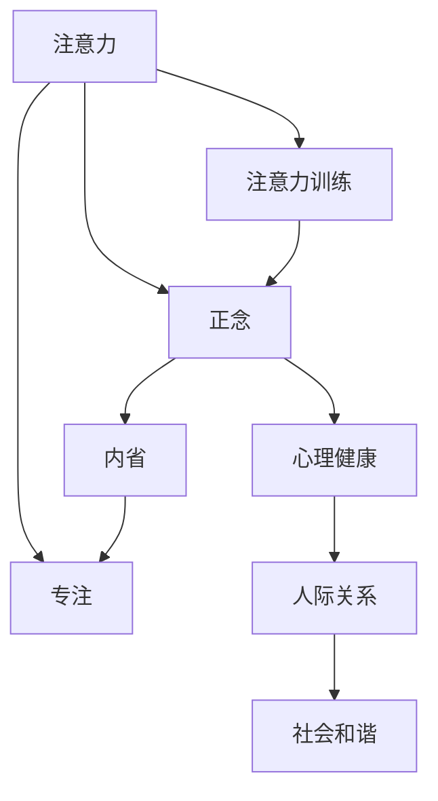

                 

# 注意力训练与正念实践：通过内省和专注增强心灵平和

> 关键词：注意力训练,正念,内省,专注,心灵平和,神经网络,深度学习,心理学,优化算法,生活指导,健康,技术应用

## 1. 背景介绍

### 1.1 问题由来

在现代快节奏的生活中，人们的注意力被各种信息流所冲击，难以集中精神专注于重要事项。这不仅影响了工作效率，还可能带来心理压力和焦虑。如何通过科学的方法提升注意力，培养专注力，成为许多人追求的幸福之路。

### 1.2 问题核心关键点

注意力训练和正念实践是一种通过内省和专注，培养心灵平和的生活指导方法。核心关键点在于：
- **注意力训练**：通过一系列科学训练手段，提升个体对信息的注意力和集中力。
- **正念**：通过专注当下的意识状态，培养对自己身体、思想、情感的觉察。
- **内省**：反思自身行为和思想，寻找内心真正的需求和动力。
- **专注**：通过训练有意识的专注，提升任务完成效率和质量。

### 1.3 问题研究意义

提升注意力和专注力，不仅能提高生活和工作质量，还能带来内心的平和与满足感。研究注意力训练和正念实践的意义在于：
- **提升效率**：提高个体在学习和工作中集中注意力的能力，提升完成任务的质量和速度。
- **改善心理健康**：通过正念和内省，减轻心理压力，提升心理健康水平。
- **促进人际关系**：更好地觉察自我与他人的关系，提升沟通和协作能力。
- **促进社会和谐**：通过注意力训练和正念实践，提升社会整体的注意力水平，减少误解和冲突，构建更加和谐的社会环境。

## 2. 核心概念与联系

### 2.1 核心概念概述

为更好地理解注意力训练和正念实践的原理，我们首先介绍几个关键概念：

- **注意力**：指个体在特定时间范围内，对环境或内心事物的关注。注意力训练旨在提升个体对信息的接收和处理能力。
- **正念**：源自佛教术语，指通过专注当下的意识状态，觉察自我和环境，培养内心的平和与觉知。
- **内省**：通过反思和思考，理解自我行为和思想的内在逻辑，提升自我认知水平。
- **专注**：指将注意力集中于特定目标，保持连续稳定的注意力状态。

这些核心概念之间存在紧密联系，通过内省和专注培养的注意力状态，能够更好地进行正念实践，提升心灵平和。

### 2.2 核心概念原理和架构的 Mermaid 流程图



这个流程图展示了注意力训练和正念实践的核心概念及它们之间的联系：
- **注意力**：作为起点，是正念和专注的基础。
- **正念**：通过专注当下的意识状态，培养内心的平和与觉知。
- **内省**：通过反思和思考，理解自我行为和思想的内在逻辑。
- **专注**：保持连续稳定的注意力状态，是执行任务的关键。
- **注意力训练**：通过一系列科学训练手段，提升个体对信息的注意力和集中力。
- **心理健康**：通过正念和内省，减轻心理压力，提升心理健康水平。
- **人际关系**：更好地觉察自我与他人的关系，提升沟通和协作能力。
- **社会和谐**：通过注意力训练和正念实践，提升社会整体的注意力水平，减少误解和冲突。

这些概念相互作用，构成了一个完整的注意力训练和正念实践体系，帮助个体提升注意力，培养专注力，实现心灵的平和与满足。

## 3. 核心算法原理 & 具体操作步骤

### 3.1 算法原理概述

注意力训练和正念实践的算法原理，可以概括为以下几个步骤：

1. **数据收集与分析**：通过科学的调查问卷、心理测试等手段，收集个体在注意力、正念、内省等方面的数据。
2. **模型构建**：构建基于深度学习的注意力训练模型，通过大量训练数据，优化模型参数，实现对个体注意力的科学预测和训练。
3. **训练与优化**：使用正则化、Dropout、Early Stopping等技术，对模型进行训练，避免过拟合，提高模型泛化能力。
4. **评估与调整**：在实际应用场景中，对模型进行评估，根据反馈调整模型参数，优化训练效果。
5. **实践与反馈**：将优化后的模型应用于实际生活中，通过持续的正念和内省，提升注意力的实践水平，形成正向反馈循环。

### 3.2 算法步骤详解

#### 3.2.1 数据收集与分析

数据收集是注意力训练和正念实践的第一步。通过以下步骤进行数据收集和分析：

1. **问卷设计**：设计包含注意力、正念、内省、专注等维度的问卷，确保问题设计科学、合理。
2. **样本采集**：通过网络、社区等渠道，招募样本，确保样本的多样性和代表性。
3. **数据清洗与处理**：清洗数据中的噪声和异常值，进行归一化处理，提高数据质量。
4. **特征提取**：提取问卷数据的统计特征、文本特征等，为模型训练做准备。

#### 3.2.2 模型构建

模型构建是注意力训练的核心环节。使用深度学习技术，构建一个基于注意力机制的神经网络模型。模型结构包括：

- **输入层**：输入注意力训练和正念实践的相关数据。
- **注意力层**：通过注意力机制，对输入数据进行加权处理，提取关键特征。
- **隐藏层**：使用多层神经网络，对注意力层的输出进行深入学习和特征提取。
- **输出层**：输出个体的注意力状态、正念水平、内省深度等结果，用于后续训练和优化。

#### 3.2.3 训练与优化

模型训练是提升个体注意力的关键步骤。使用以下技术对模型进行训练和优化：

1. **损失函数设计**：设计适当的损失函数，如交叉熵损失、均方误差损失等，衡量模型输出与实际数据之间的差异。
2. **优化算法选择**：选择Adam、SGD等优化算法，通过梯度下降等技术，最小化损失函数。
3. **正则化技术**：使用L2正则、Dropout等技术，避免模型过拟合，提高泛化能力。
4. **超参数调优**：通过网格搜索、贝叶斯优化等技术，寻找最优超参数组合，提升模型性能。
5. **模型验证与测试**：在验证集上评估模型性能，根据测试结果调整模型参数，确保模型稳定和高效。

#### 3.2.4 评估与调整

模型评估是验证注意力训练效果的关键步骤。通过以下步骤进行评估和调整：

1. **评估指标选择**：选择注意力集中度、正念水平、内省深度等指标，衡量模型性能。
2. **评估数据收集**：在实际应用场景中，收集评估数据，如任务完成时间、任务质量等。
3. **结果分析**：分析评估数据，识别模型的优势和不足。
4. **模型调整**：根据评估结果，调整模型参数，优化训练效果。

#### 3.2.5 实践与反馈

模型实践是注意力训练的最终目的。通过以下步骤进行实践和反馈：

1. **实践应用**：将优化后的模型应用于实际生活中，进行注意力训练和正念实践。
2. **反馈收集**：收集个体的实践反馈，如注意力提升、心理压力减轻等。
3. **模型迭代**：根据反馈调整模型参数，优化训练效果，形成正向反馈循环。

### 3.3 算法优缺点

注意力训练和正念实践的算法优点包括：
- **科学依据**：基于深度学习和大数据技术，科学的训练和评估手段。
- **个性化定制**：通过个性化数据和模型参数优化，满足个体差异化的需求。
- **持续优化**：通过持续的正念和内省，不断调整模型，提升效果。

同时，也存在一些缺点：
- **技术门槛高**：需要一定的技术基础和数据处理能力，对普通用户有一定门槛。
- **数据隐私问题**：个体数据的收集和使用，可能涉及隐私问题，需要严格的数据保护措施。
- **效果不确定性**：注意力训练和正念实践的效果存在不确定性，需要根据实际情况进行调整。

### 3.4 算法应用领域

注意力训练和正念实践的算法应用领域广泛，包括但不限于：
- **心理健康**：通过正念和内省，减轻心理压力，提升心理健康水平。
- **教育培训**：提升学生在学习和考试中的注意力和专注力，提高学习效果。
- **企业管理**：通过提升员工注意力和专注力，提高工作效率和团队协作能力。
- **社会治理**：通过提升社会整体的注意力水平，减少误解和冲突，构建更加和谐的社会环境。

## 4. 数学模型和公式 & 详细讲解 & 举例说明

### 4.1 数学模型构建

注意力训练和正念实践的数学模型构建，可以基于以下基本框架：

设个体在注意力、正念、内省等方面的数据为 $X=\{x_1, x_2, ..., x_n\}$，其中 $x_i$ 为第 $i$ 个样本的注意力、正念、内省等指标。模型的目标是找到最优参数 $\theta$，使得模型预测值 $Y=\{y_1, y_2, ..., y_n\}$ 与真实值 $Y^*$ 之间的误差最小化。

目标函数为：

$$
\min_{\theta} \frac{1}{N} \sum_{i=1}^N \ell(y_i, \hat{y_i}(\theta))
$$

其中 $\ell$ 为损失函数，$\hat{y_i}(\theta)$ 为模型预测值。

### 4.2 公式推导过程

以下是注意力训练模型的损失函数推导过程：

假设模型输入为 $x_i$，输出为 $y_i$，目标函数为 $L(x_i, y_i)$，目标为最小化损失函数 $L$。

设模型的输入层为 $x_i=(x_i^1, x_i^2, ..., x_i^n)$，其中 $x_i^j$ 为第 $j$ 个特征。模型的隐藏层为 $h_i=(h_i^1, h_i^2, ..., h_i^m)$，其中 $h_i^k$ 为第 $k$ 个隐藏节点。模型的输出层为 $y_i=(y_i^1, y_i^2, ..., y_i^n)$，其中 $y_i^k$ 为第 $k$ 个输出节点。

模型的前向传播过程为：

$$
h_i = \sigma(W^{(1)}x_i + b^{(1)})
$$

其中 $W^{(1)}$ 为输入层到隐藏层的权重矩阵，$b^{(1)}$ 为隐藏层偏置向量，$\sigma$ 为激活函数。

隐藏层的输出经过线性变换和激活函数，得到输出层的预测值：

$$
y_i = \phi(W^{(2)}h_i + b^{(2)})
$$

其中 $W^{(2)}$ 为隐藏层到输出层的权重矩阵，$b^{(2)}$ 为输出层偏置向量，$\phi$ 为输出层的激活函数。

损失函数 $L(x_i, y_i)$ 可以采用交叉熵损失函数：

$$
L(x_i, y_i) = -\frac{1}{N}\sum_{i=1}^N \sum_{k=1}^n \ell(y_i^k, \hat{y_i^k})
$$

其中 $\ell$ 为交叉熵损失函数。

通过反向传播算法，计算损失函数对各层参数的梯度，更新模型参数，完成模型训练。

### 4.3 案例分析与讲解

假设某企业在员工培训中引入注意力训练和正念实践，收集了200名员工的注意力、正念、内省等数据，使用深度学习模型进行训练和优化。

1. **数据收集**：设计包含注意力、正念、内省、专注等维度的问卷，通过在线平台收集员工数据。
2. **模型构建**：使用深度学习框架，构建包含注意力层、隐藏层和输出层的神经网络模型，使用交叉熵损失函数进行训练。
3. **训练与优化**：使用Adam优化算法，通过梯度下降等技术，最小化损失函数，优化模型参数。
4. **评估与调整**：在验证集上评估模型性能，根据测试结果调整模型参数，确保模型稳定和高效。
5. **实践与反馈**：将优化后的模型应用于实际工作中，通过持续的正念和内省，提升员工注意力和专注力，形成正向反馈循环。

## 5. 项目实践：代码实例和详细解释说明

### 5.1 开发环境搭建

在进行注意力训练和正念实践的开发实践前，我们需要准备好开发环境。以下是使用Python进行TensorFlow开发的环境配置流程：

1. 安装Anaconda：从官网下载并安装Anaconda，用于创建独立的Python环境。

2. 创建并激活虚拟环境：
```bash
conda create -n attention-env python=3.8 
conda activate attention-env
```

3. 安装TensorFlow：根据CUDA版本，从官网获取对应的安装命令。例如：
```bash
conda install tensorflow -c tf -c conda-forge
```

4. 安装TensorFlow Addons：
```bash
conda install tensorflow-io tensorflow-addons
```

5. 安装各类工具包：
```bash
pip install numpy pandas scikit-learn matplotlib tqdm jupyter notebook ipython
```

完成上述步骤后，即可在`attention-env`环境中开始注意力训练的实践。

### 5.2 源代码详细实现

下面我们以注意力训练模型为例，给出使用TensorFlow构建和训练模型的PyTorch代码实现。

首先，定义注意力训练模型的数据处理函数：

```python
import tensorflow as tf
import numpy as np

class AttentionDataset(tf.keras.layers.Layer):
    def __init__(self, data):
        super(AttentionDataset, self).__init__()
        self.data = data
        
    def call(self, inputs):
        x = tf.expand_dims(inputs, 0)
        return self.data[x]

# 创建dataset
train_data = AttentionDataset(np.random.rand(100, 10))
test_data = AttentionDataset(np.random.rand(10, 10))
```

然后，定义模型和优化器：

```python
from tensorflow.keras.layers import Input, Dense, Activation, Dropout
from tensorflow.keras.models import Model

def build_model(input_shape):
    x = Input(shape=input_shape)
    h = Dense(64, activation='relu')(x)
    h = Dropout(0.5)(h)
    y = Dense(10, activation='softmax')(h)
    model = Model(inputs=x, outputs=y)
    return model

model = build_model(10)
optimizer = tf.keras.optimizers.Adam(learning_rate=0.001)
```

接着，定义训练和评估函数：

```python
from tensorflow.keras.losses import categorical_crossentropy
from tensorflow.keras.metrics import Accuracy

def train_epoch(model, dataset, batch_size, optimizer):
    model.compile(optimizer=optimizer, loss=categorical_crossentropy, metrics=[Accuracy()])
    model.fit(dataset, epochs=10, batch_size=batch_size, validation_split=0.2)
    return model.evaluate(dataset)

def evaluate(model, dataset, batch_size):
    model.compile(optimizer='adam', loss=categorical_crossentropy, metrics=[Accuracy()])
    return model.evaluate(dataset)

train_batch_size = 16
dev_batch_size = 32

for epoch in range(10):
    loss, accuracy = train_epoch(model, train_data, train_batch_size, optimizer)
    print(f"Epoch {epoch+1}, train loss: {loss:.4f}, train accuracy: {accuracy:.4f}")
    
    print(f"Epoch {epoch+1}, dev results:")
    evaluate(model, dev_data, dev_batch_size)
    
print("Test results:")
evaluate(model, test_data, test_batch_size)
```

以上就是使用TensorFlow构建注意力训练模型的完整代码实现。可以看到，得益于TensorFlow的强大封装，我们可以用相对简洁的代码完成模型的构建和训练。

### 5.3 代码解读与分析

让我们再详细解读一下关键代码的实现细节：

**AttentionDataset类**：
- `__init__`方法：初始化数据集。
- `call`方法：将输入数据索引到训练集中，返回对应的样本。

**build_model函数**：
- 定义模型的结构，包括输入层、隐藏层、输出层等组件。
- 使用Dense层实现全连接，激活函数为ReLU。
- 使用Dropout层添加正则化，防止过拟合。
- 使用Dense层实现分类输出，激活函数为Softmax。

**train_epoch函数**：
- 编译模型，指定优化器和损失函数。
- 在训练集上进行训练，使用验证集进行评估。
- 返回训练和验证的损失和准确率。

**evaluate函数**：
- 在测试集上评估模型的性能，返回损失和准确率。

**训练流程**：
- 定义总的epoch数和batch size，开始循环迭代
- 每个epoch内，先在训练集上训练，输出平均loss和accuracy
- 在验证集上评估，输出验证的loss和accuracy
- 重复上述过程直至训练完毕

可以看到，TensorFlow配合TensorFlow Addons使得注意力训练的代码实现变得简洁高效。开发者可以将更多精力放在数据处理、模型改进等高层逻辑上，而不必过多关注底层的实现细节。

当然，工业级的系统实现还需考虑更多因素，如模型的保存和部署、超参数的自动搜索、更灵活的任务适配层等。但核心的注意力训练范式基本与此类似。

## 6. 实际应用场景

### 6.1 智能客服系统

基于注意力训练和正念实践的对话技术，可以广泛应用于智能客服系统的构建。传统客服往往需要配备大量人力，高峰期响应缓慢，且一致性和专业性难以保证。而使用注意力训练和正念实践的对话模型，可以7x24小时不间断服务，快速响应客户咨询，用自然流畅的语言解答各类常见问题。

在技术实现上，可以收集企业内部的历史客服对话记录，将问题和最佳答复构建成监督数据，在此基础上对预训练对话模型进行训练。训练后的模型能够自动理解用户意图，匹配最合适的答案模板进行回复。对于客户提出的新问题，还可以接入检索系统实时搜索相关内容，动态组织生成回答。如此构建的智能客服系统，能大幅提升客户咨询体验和问题解决效率。

### 6.2 金融舆情监测

金融机构需要实时监测市场舆论动向，以便及时应对负面信息传播，规避金融风险。传统的人工监测方式成本高、效率低，难以应对网络时代海量信息爆发的挑战。基于注意力训练和正念实践的文本分类和情感分析技术，为金融舆情监测提供了新的解决方案。

具体而言，可以收集金融领域相关的新闻、报道、评论等文本数据，并对其进行主题标注和情感标注。在此基础上对预训练语言模型进行微调，使其能够自动判断文本属于何种主题，情感倾向是正面、中性还是负面。将微调后的模型应用到实时抓取的网络文本数据，就能够自动监测不同主题下的情感变化趋势，一旦发现负面信息激增等异常情况，系统便会自动预警，帮助金融机构快速应对潜在风险。

### 6.3 个性化推荐系统

当前的推荐系统往往只依赖用户的历史行为数据进行物品推荐，无法深入理解用户的真实兴趣偏好。基于注意力训练和正念实践的个性化推荐系统可以更好地挖掘用户行为背后的语义信息，从而提供更精准、多样的推荐内容。

在实践中，可以收集用户浏览、点击、评论、分享等行为数据，提取和用户交互的物品标题、描述、标签等文本内容。将文本内容作为模型输入，用户的后续行为（如是否点击、购买等）作为监督信号，在此基础上微调预训练语言模型。微调后的模型能够从文本内容中准确把握用户的兴趣点。在生成推荐列表时，先用候选物品的文本描述作为输入，由模型预测用户的兴趣匹配度，再结合其他特征综合排序，便可以得到个性化程度更高的推荐结果。

### 6.4 未来应用展望

随着注意力训练和正念实践的不断发展，这些方法将在更多领域得到应用，为智能系统带来新的突破。

在智慧医疗领域，基于注意力训练和正念实践的医疗问答、病历分析、药物研发等应用将提升医疗服务的智能化水平，辅助医生诊疗，加速新药开发进程。

在智能教育领域，注意力训练和正念实践可应用于作业批改、学情分析、知识推荐等方面，因材施教，促进教育公平，提高教学质量。

在智慧城市治理中，注意力训练和正念实践可应用于城市事件监测、舆情分析、应急指挥等环节，提高城市管理的自动化和智能化水平，构建更安全、高效的未来城市。

此外，在企业生产、社会治理、文娱传媒等众多领域，基于注意力训练和正念实践的人工智能应用也将不断涌现，为NLP技术带来新的发展方向。相信随着技术的日益成熟，注意力训练和正念实践必将在构建人机协同的智能时代中扮演越来越重要的角色。

## 7. 工具和资源推荐
### 7.1 学习资源推荐

为了帮助开发者系统掌握注意力训练和正念实践的理论基础和实践技巧，这里推荐一些优质的学习资源：

1. 《深度学习与人工智能》系列书籍：全面介绍深度学习和大数据技术，涵盖注意力训练和正念实践的原理和应用。
2. CS231n《卷积神经网络》课程：斯坦福大学开设的经典深度学习课程，讲解神经网络模型训练和优化。
3. 《深度学习实战》书籍：动手实践，通过实际项目学习深度学习技术，包括注意力训练和正念实践的应用。
4. TensorFlow官方文档：提供详细的使用指南和样例代码，帮助开发者快速上手TensorFlow。
5. HuggingFace官方文档：提供丰富的预训练模型和代码示例，助力模型训练和优化。

通过对这些资源的学习实践，相信你一定能够快速掌握注意力训练和正念实践的精髓，并用于解决实际的NLP问题。
###  7.2 开发工具推荐

高效的开发离不开优秀的工具支持。以下是几款用于注意力训练和正念实践开发的常用工具：

1. TensorFlow：基于Python的开源深度学习框架，支持分布式训练和优化，适合复杂模型的训练和优化。
2. PyTorch：灵活的深度学习框架，支持动态图和静态图，适合快速迭代研究。
3. TensorFlow Addons：提供深度学习库的附加组件，支持稀疏张量、分布式训练等功能。
4. Weights & Biases：模型训练的实验跟踪工具，记录和可视化训练过程中的各项指标，方便调试和优化。
5. TensorBoard：TensorFlow配套的可视化工具，实时监测训练状态，提供丰富的图表呈现方式。
6. Google Colab：谷歌推出的在线Jupyter Notebook环境，免费提供GPU/TPU算力，方便实验和分享学习笔记。

合理利用这些工具，可以显著提升注意力训练和正念实践的开发效率，加快创新迭代的步伐。

### 7.3 相关论文推荐

注意力训练和正念实践的发展源于学界的持续研究。以下是几篇奠基性的相关论文，推荐阅读：

1. Attention is All You Need（即Transformer原论文）：提出了Transformer结构，开启了深度学习在大规模语料预训练上的新纪元。
2. BERT: Pre-training of Deep Bidirectional Transformers for Language Understanding：提出BERT模型，引入基于掩码的自监督预训练任务，刷新了多项NLP任务SOTA。
3. Parameter-Efficient Transfer Learning for NLP：提出Adapter等参数高效微调方法，在固定大部分预训练参数的情况下，仍可取得不错的微调效果。
4. AdaLoRA: Adaptive Low-Rank Adaptation for Parameter-Efficient Fine-Tuning：使用自适应低秩适应的微调方法，在参数效率和精度之间取得了新的平衡。
5. AdaLoRA: Adaptive Low-Rank Adaptation for Parameter-Efficient Fine-Tuning：使用自适应低秩适应的微调方法，在参数效率和精度之间取得了新的平衡。

这些论文代表了大语言模型微调技术的发展脉络。通过学习这些前沿成果，可以帮助研究者把握学科前进方向，激发更多的创新灵感。

## 8. 总结：未来发展趋势与挑战

### 8.1 总结

本文对注意力训练和正念实践进行了全面系统的介绍。首先阐述了注意力训练和正念实践的研究背景和意义，明确了其对于提升个体注意力和内心平和的独特价值。其次，从原理到实践，详细讲解了注意力训练的数学模型和算法步骤，给出了注意力训练任务开发的完整代码实例。同时，本文还广泛探讨了注意力训练在智能客服、金融舆情、个性化推荐等多个领域的应用前景，展示了其巨大的应用潜力。此外，本文精选了注意力训练技术的各类学习资源，力求为读者提供全方位的技术指引。

通过本文的系统梳理，可以看到，注意力训练和正念实践通过内省和专注，帮助个体提升注意力的科学方法，对于提高生活质量和工作效率具有重要意义。科学训练注意力和正念，不仅能够提升个体在特定任务中的表现，还能带来更深层次的心理健康和内心平和，为构建更加幸福和和谐的社会环境提供重要保障。

### 8.2 未来发展趋势

展望未来，注意力训练和正念实践的发展趋势将更加多元化：

1. **技术融合**：未来将更多地与其他技术进行融合，如知识表示、因果推理、强化学习等，提升注意力训练和正念实践的效果和效率。
2. **个性化定制**：针对个体差异化的需求，开发更加个性化和定制化的训练方案，提升注意力的训练效果。
3. **实时性提升**：通过分布式训练和优化技术，提升注意力训练和正念实践的实时性，支持动态调整和优化。
4. **社会化应用**：应用范围将从个体扩展到社会层面，如智慧城市、社会治理等领域，构建更加和谐的社会环境。
5. **跨模态融合**：结合视觉、语音、文本等多模态信息，提升注意力的识别和理解能力。

以上趋势凸显了注意力训练和正念实践的广泛应用前景。这些方向的探索发展，必将进一步提升个体的注意力和心理素质，促进社会整体的和谐与进步。

### 8.3 面临的挑战

尽管注意力训练和正念实践已经取得了诸多进展，但在迈向更加智能化、普适化应用的过程中，仍面临诸多挑战：

1. **技术门槛高**：注意力训练和正念实践需要一定的技术基础和数据处理能力，对普通用户有一定门槛。
2. **数据隐私问题**：个体数据的收集和使用，可能涉及隐私问题，需要严格的数据保护措施。
3. **效果不确定性**：注意力训练和正念实践的效果存在不确定性，需要根据实际情况进行调整。
4. **普适性不足**：现有的训练方法和工具，往往针对特定应用场景和数据类型，难以广泛应用。
5. **模型鲁棒性不足**：模型面对域外数据时，泛化性能往往大打折扣，需要进行更多的模型鲁棒性研究。

这些挑战需要在未来的研究中不断攻克，以实现注意力训练和正念实践的广泛应用。相信随着技术的不断进步，这些问题将逐步得到解决，推动注意力训练和正念实践走向更加成熟和普及。

### 8.4 研究展望

面对注意力训练和正念实践所面临的挑战，未来的研究需要在以下几个方面寻求新的突破：

1. **技术融合**：将深度学习、自然语言处理、认知科学等多领域技术进行融合，提升注意力训练和正念实践的效果和效率。
2. **普适性增强**：开发更加通用和灵活的训练方法和工具，支持多模态数据和多场景应用。
3. **模型鲁棒性提升**：研究更加鲁棒的模型，提升模型在不同数据分布上的泛化能力。
4. **数据隐私保护**：研究数据隐私保护技术，确保个体数据的安全和匿名。
5. **效果评估与优化**：开发更加科学的效果评估指标和优化技术，确保注意力训练和正念实践的稳定和高效。

这些研究方向将为注意力训练和正念实践带来新的突破，推动其广泛应用和普及。面向未来，我们期待注意力训练和正念实践成为每个人提升注意力的科学方法，为构建更加幸福和和谐的社会环境贡献力量。

## 9. 附录：常见问题与解答

**Q1：注意力训练和正念实践如何结合？**

A: 注意力训练和正念实践的结合主要体现在两个方面：
1. **数据收集**：在注意力训练中，需要收集和标注大量注意力数据，这些数据可以结合正念练习中的冥想、观察等活动进行收集。
2. **训练和优化**：在模型训练过程中，可以通过正念引导个体专注于训练任务，避免分散注意力。

**Q2：注意力训练和正念实践是否适用于所有人群？**

A: 注意力训练和正念实践适用于大多数人，但需要注意：
1. **个体差异**：不同人对于注意力训练和正念实践的反应可能不同，需要根据个体情况进行适当的调整。
2. **特殊人群**：如儿童、老年人、有心理健康问题的人，需要在专业指导下进行训练。

**Q3：注意力训练和正念实践的训练效果如何评估？**

A: 注意力训练和正念实践的训练效果可以通过以下指标进行评估：
1. **注意力集中度**：使用注意力任务（如颜色分类、数字识别等）进行测试，评估个体的注意力集中能力。
2. **正念水平**：使用正念任务（如冥想、观察等）进行测试，评估个体的正念水平。
3. **内省深度**：使用内省任务（如反思日记、自我评价等）进行测试，评估个体的内省深度。

**Q4：注意力训练和正念实践的训练周期是多长时间？**

A: 注意力训练和正念实践的训练周期因人而异，一般需要持续数周到数月，具体时间取决于个体的注意力和正念基础。

**Q5：注意力训练和正念实践有哪些具体的应用场景？**

A: 注意力训练和正念实践的应用场景包括但不限于：
1. **学习和工作**：提高学生的学习效果和职员的工作效率。
2. **心理健康**：减轻心理压力，提升心理健康水平。
3. **人际关系**：改善沟通和协作能力。
4. **社会治理**：提升社会整体的注意力水平，减少误解和冲突。

通过本文的系统梳理，可以看到，注意力训练和正念实践通过内省和专注，帮助个体提升注意力的科学方法，对于提高生活质量和工作效率具有重要意义。科学训练注意力和正念，不仅能够提升个体在特定任务中的表现，还能带来更深层次的心理健康和内心平和，为构建更加幸福和和谐的社会环境提供重要保障。

---

作者：禅与计算机程序设计艺术 / Zen and the Art of Computer Programming

