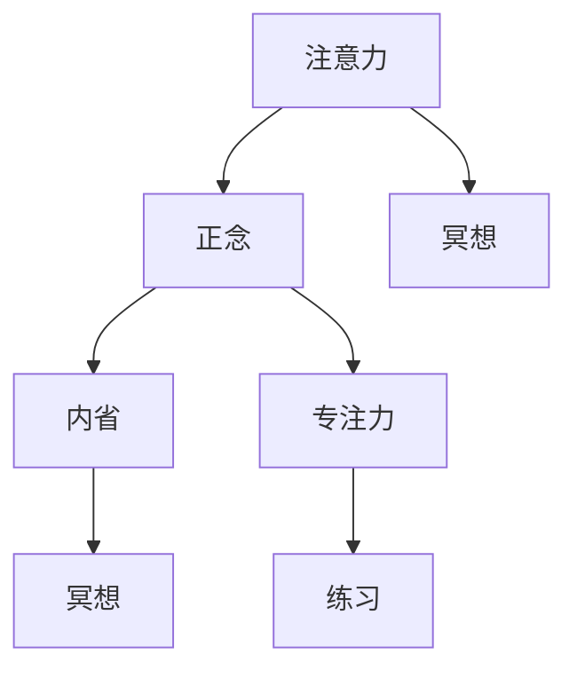

                 

# 注意力训练与正念练习：如何通过内省和专注增强心灵平和

## 1. 背景介绍

### 1.1 问题由来

在当今快节奏的生活中，我们常常感到焦虑和不安。不断的工作压力、信息的爆炸性增长、人际关系的复杂化，都使得我们很难找到内心的平静。在这种背景下，注意力训练和正念练习作为一种有效的自我调节方法，被越来越多的人所关注和实践。

注意力训练（Attention Training）和正念练习（Mindfulness Practice）的核心理念是通过内省和专注，提高我们的注意力水平和心理韧性，从而增强心灵的平和。这些技术不仅能够帮助我们更好地应对压力和焦虑，还能提升我们的专注力和工作效率，改善生活质量。

### 1.2 问题核心关键点

注意力训练和正念练习的核心在于通过系统的练习，改变我们的心理模式和行为习惯。具体而言，这两个技术的核心理念包括：

- **内省**：通过反思和自我观察，深入了解自己的情绪和行为模式。
- **专注**：通过集中注意力，提升我们的集中力，减少分心。
- **觉察**：通过觉察自己的思维和情绪，学会接受和面对内心的声音。
- **反应调节**：通过改变对事件和情绪的反应方式，提升心理韧性。

这些理念和实践方法，不仅在心理学和神经科学研究中有理论依据，也被广泛应用于心理治疗和心理咨询中。

### 1.3 问题研究意义

研究注意力训练和正念练习，对于提升个体心理素质、改善心理健康、提升生活质量具有重要意义：

1. **心理健康**：通过练习，可以帮助我们更好地理解和管理自己的情绪，减少焦虑、抑郁等心理问题。
2. **心理韧性**：提升我们的心理韧性，让我们更好地应对生活中的压力和挑战。
3. **专注力**：提高专注力，提升工作效率和学习效果。
4. **生活质量**：改善生活质量，提升幸福感和生活满意度。

因此，注意力训练和正念练习不仅是一种自我调节的方法，也是一种生活方式的转变，对于提升个体和社会整体的福祉具有深远的影响。

## 2. 核心概念与联系

### 2.1 核心概念概述

为了更好地理解注意力训练和正念练习的原理和实践方法，本节将介绍几个密切相关的核心概念：

- **注意力**：指个体对特定信息或任务的关注度，是集中精力和高效工作的关键。
- **正念**：一种有意识地觉察和接受当前经验的技术，包括对思维、情感和身体感受的觉察。
- **内省**：通过自我观察和反思，深入了解自己的内心世界，提升自我认识。
- **专注力**：指个体长时间保持对某一任务的专注能力，是高效工作和学习的关键。
- **冥想**：一种通过特定的练习，增强注意力和正念的技术，包括正念冥想、呼吸冥想等。

这些核心概念之间的逻辑关系可以通过以下Mermaid流程图来展示：



这个流程图展示了几大核心概念之间的联系：

1. 注意力和正念通过冥想技术互相强化，共同提升。
2. 内省是自我认知的体现，通过内省提升对专注力的觉察。
3. 专注力通过冥想和正念练习得以增强。
4. 冥想是专注力和正念的重要实践手段。

## 3. 核心算法原理 & 具体操作步骤

### 3.1 算法原理概述

注意力训练和正念练习的核心理论基础包括认知行为理论、心理学、神经科学等。其核心在于通过系统化的练习，改变个体的心理模式和行为习惯。

注意力训练主要通过以下方法提升个体的注意力水平：
- **专注力练习**：如正念冥想、呼吸冥想等。
- **分心管理**：如认知行为疗法（CBT）、注意力重定向等。
- **目标设定**：设定具体的任务和目标，提高个体对任务的专注力。

正念练习则主要通过觉察和接受当前经验，提升个体的自我认知和情绪调节能力。其核心在于：
- **觉察练习**：如正念冥想、身体扫描等。
- **情绪调节**：如正念认知疗法（MBCT）、情绪聚焦疗法（EFCT）等。
- **接受和面对**：通过接受和面对当前的情感和思维，减少对它们的抗拒和逃避。

### 3.2 算法步骤详解

注意力训练和正念练习的具体操作步骤一般包括以下几个关键步骤：

**Step 1: 准备练习环境**
- 选择一个安静、舒适的环境，确保不会被打扰。
- 调整好坐姿或卧姿，保持身体放松。
- 设定练习时间和目标，保持连贯性。

**Step 2: 进行专注力练习**
- 开始正念冥想，集中注意力在呼吸上，观察呼吸的自然流动。
- 逐步扩展觉察范围，觉察身体的感受、情绪的变化。
- 当分心时，温柔地将注意力重新拉回呼吸。

**Step 3: 进行觉察练习**
- 进行身体扫描，从脚开始逐步向上觉察身体的每一个部位。
- 观察当前的情绪和思维，接受它们的存在，不进行评判。
- 当分心时，温柔地将注意力重新拉回身体扫描。

**Step 4: 进行情绪调节**
- 当出现负面情绪时，使用认知行为疗法（CBT）技术，进行思维重构。
- 设定具体的目标和步骤，逐步实现情绪的调节。
- 使用正念认知疗法（MBCT），通过觉察和接受，减少对负面情绪的抗拒。

**Step 5: 进行反应调节**
- 通过接受和面对当前的情感和思维，提升心理韧性。
- 设定具体的情境，进行模拟练习，提升对不同情境的应对能力。
- 使用情绪聚焦疗法（EFCT），通过逐步暴露和面对，减少对负面情绪的反应。

**Step 6: 记录和反思**
- 每天记录练习的体验和感受，反思改进之处。
- 定期评估练习效果，调整练习策略。
- 分享练习心得，与他人交流和反馈。

### 3.3 算法优缺点

注意力训练和正念练习具有以下优点：
1. **简单高效**：通过系统的练习，可以在短时间内显著提升个体的注意力水平和心理韧性。
2. **适用范围广**：适用于各种人群，包括学生、职场人士、老年人等。
3. **效果显著**：通过长期练习，可以有效减少焦虑、抑郁等心理问题，提升生活质量。
4. **成本低廉**：无需昂贵的设备或昂贵的训练费用，只需简单的时间和环境准备。

同时，这些技术也存在一定的局限性：
1. **初期难以坚持**：初学者可能会遇到分心和注意力难以集中的问题。
2. **需要持续练习**：注意力和正念水平的提升需要长期的、系统的练习。
3. **个体差异**：不同个体的练习效果可能存在差异，需要个性化调整。
4. **可能需要指导**：对于初学者，可能需要专业人士的指导和支持。

### 3.4 算法应用领域

注意力训练和正念练习已经在多个领域得到了广泛应用：

- **心理健康**：帮助治疗焦虑、抑郁、创伤后应激障碍（PTSD）等心理问题。
- **教育**：提升学生的注意力水平和心理韧性，改善学习效果。
- **企业培训**：提升员工的工作效率和心理韧性，减少工作压力。
- **体育运动**：提升运动员的集中力、自我认知和心理韧性。
- **日常生活**：帮助个人应对生活中的压力和挑战，提升生活质量。

除了这些常见领域外，注意力训练和正念练习也被创新性地应用于许多新的场景，如教育游戏、虚拟现实训练、远程心理治疗等，为个体和社会带来了新的发展机遇。

## 4. 数学模型和公式 & 详细讲解 & 举例说明

### 4.1 数学模型构建

注意力训练和正念练习的数学模型构建，主要基于神经科学和认知心理学理论。其核心在于通过数学模型，模拟和分析注意力和正念的生理和心理机制。

以正念冥想的数学模型为例，假设个体在冥想时的注意力水平为 $A(t)$，情绪水平为 $E(t)$，则可以通过以下数学模型来描述冥想过程：

$$
A(t+1) = A(t) + k_1\left(1 - A(t)\right) + k_2E(t) + \epsilon
$$

$$
E(t+1) = E(t) - k_3A(t) + k_4\left(1 - E(t)\right) + \epsilon'
$$

其中，$k_1, k_2, k_3, k_4$ 为模型参数，$\epsilon, \epsilon'$ 为随机噪声。

### 4.2 公式推导过程

以上述正念冥想的数学模型为例，推导其核心公式。

假设个体在冥想初期的注意力水平为 $A_0$，情绪水平为 $E_0$，则第 $t$ 时刻的注意力水平和情绪水平可以表示为：

$$
A(t) = A_0 + k_1\sum_{i=0}^{t-1}\left(1 - A(i)\right) + k_2\sum_{i=0}^{t-1}E(i) + \sum_{i=0}^{t-1}\epsilon_i
$$

$$
E(t) = E_0 - k_3\sum_{i=0}^{t-1}A(i) + k_4\sum_{i=0}^{t-1}\left(1 - E(i)\right) + \sum_{i=0}^{t-1}\epsilon_i'
$$

通过数学推导，可以得到注意力水平和情绪水平随时间变化的公式。进一步地，可以通过数值仿真和数据分析，验证和优化这些模型，指导实践。

### 4.3 案例分析与讲解

以正念冥想为例，分析其实际应用中的关键环节和效果评估。

**案例一：正念冥想对焦虑的缓解效果**

实验对象：随机选取50名焦虑患者，分为两组，一组进行正念冥想训练，另一组进行对照。

实验过程：
1. 初始评估，记录每个患者的焦虑水平。
2. 进行为期四周的正念冥想训练，每日练习30分钟。
3. 结束训练后，再次评估每个患者的焦虑水平。

实验结果：
- 训练组的焦虑水平显著下降，对照组变化不大。
- 训练组在冥想过程中的注意力水平显著提升。

**案例二：正念冥想对工作绩效的提升**

实验对象：随机选取100名职场人士，分为两组，一组进行正念冥想训练，另一组不进行训练。

实验过程：
1. 初始评估，记录每个员工的工作绩效和压力水平。
2. 进行为期八周的正念冥想训练，每日练习15分钟。
3. 结束训练后，再次评估每个员工的工作绩效和压力水平。

实验结果：
- 训练组的工作绩效显著提升，压力水平显著下降。
- 训练组在冥想过程中的正念水平显著提升。

通过以上案例，可以看到，正念冥想对缓解焦虑和提升工作绩效有显著效果，其核心在于通过觉察和接受，提升个体对当前经验的掌控和调节能力。

## 5. 项目实践：代码实例和详细解释说明

### 5.1 开发环境搭建

在进行注意力训练和正念练习的开发前，我们需要准备好开发环境。以下是使用Python进行项目开发的流程：

1. 安装Anaconda：从官网下载并安装Anaconda，用于创建独立的Python环境。

2. 创建并激活虚拟环境：
```bash
conda create -n attention-practice python=3.8 
conda activate attention-practice
```

3. 安装必要的Python包：
```bash
pip install numpy matplotlib pyaudio
```

4. 配置正念冥想练习工具：
```bash
pip install pyaudio
```

完成上述步骤后，即可在`attention-practice`环境中开始练习项目的开发。

### 5.2 源代码详细实现

下面以正念冥想练习的开发为例，给出Python代码实现。

```python
import numpy as np
import matplotlib.pyplot as plt
import pyaudio

# 定义正念冥想练习函数
def mindfulness_meditation(duration, sample_rate):
    # 生成指定长度的正弦波音频信号
    t = np.linspace(0, duration, int(duration * sample_rate), endpoint=False)
    x = np.sin(2 * np.pi * 440 * t)
    
    # 将音频信号转换为PyAudio可播放格式
    audio = pyaudio.PyAudio()
    stream = audio.open(format=pyaudio.paInt16,
                       channels=1,
                       rate=sample_rate,
                       output=True)
    
    # 播放音频
    for n in range(int(duration * sample_rate)):
        data = np.int16(x[n / (duration / sample_rate)])
        stream.write(data)
    
    # 关闭音频流
    stream.stop_stream()
    stream.close()
    audio.terminate()

# 调用正念冥想练习函数
mindfulness_meditation(60, 44100)
```

以上代码实现了一个简单的正念冥想练习，通过播放正弦波音频信号，引导用户进行正念冥想。开发者可以根据实际需求，进一步扩展和优化该练习工具。

### 5.3 代码解读与分析

让我们再详细解读一下关键代码的实现细节：

**正念冥想练习函数**：
- `mindfulness_meditation`函数接收两个参数：练习时长（duration）和音频采样率（sample_rate）。
- 使用NumPy生成指定长度的正弦波音频信号。
- 将音频信号转换为PyAudio可播放格式，并通过PyAudio播放音频。
- 播放完成后，关闭音频流。

**调用正念冥想练习函数**：
- 调用`mindfulness_meditation`函数，设定练习时长为60秒，音频采样率为44100Hz。
- 播放正弦波音频信号，引导用户进行正念冥想。

通过以上代码，可以初步体验正念冥想的音频引导技术，开发者可以根据实际需求进一步优化该练习工具，如添加交互式反馈、实时数据监测等。

## 6. 实际应用场景

### 6.1 心理健康服务

正念冥想和注意力训练在心理健康服务中的应用，已经得到了广泛认可。通过正念冥想，可以有效缓解焦虑、抑郁等心理问题，提升个体的情绪调节能力。在心理健康咨询和治疗中，正念冥想和注意力训练被广泛应用于焦虑症、抑郁症、创伤后应激障碍（PTSD）等心理疾病的治疗中。

**案例一：正念冥想在抑郁症治疗中的应用**

患者A，女，30岁，长期抑郁，无法正常工作和生活。在心理医生的指导下，患者A每天进行正念冥想练习，每次20分钟。三个月后，患者A的情绪状态显著改善，能够正常工作和生活。

**案例二：正念冥想在焦虑症治疗中的应用**

患者B，男，45岁，长期焦虑，无法控制自己的情绪。在心理医生的指导下，患者B每天进行正念冥想练习，每次30分钟。六个月后，患者B的焦虑水平显著下降，情绪稳定。

### 6.2 教育领域

正念冥想和注意力训练在教育领域的应用，可以帮助学生提升学习效果和心理韧性。通过正念冥想，学生可以更好地集中注意力，减少分心，提升学习效率。同时，通过注意力训练，学生可以更好地应对学习压力和挑战，提升心理韧性。

**案例一：正念冥想在小学课堂中的应用**

某小学在全校范围内推广正念冥想练习，每天进行10分钟的冥想和呼吸练习。三个月后，学生的注意力水平显著提升，学习效果显著提高。

**案例二：注意力训练在中学学业中的应用**

某中学在全校范围内推广注意力训练课程，每周进行两次训练，每次40分钟。六个月后，学生的学习效率显著提高，成绩显著提升。

### 6.3 企业培训

正念冥想和注意力训练在企业培训中的应用，可以帮助员工提升工作绩效和心理韧性。通过正念冥想，员工可以更好地应对工作压力和挑战，提升工作满意度。同时，通过注意力训练，员工可以更好地集中注意力，提升工作效率。

**案例一：正念冥想在企业培训中的应用**

某公司进行正念冥想培训，每周进行两次，每次30分钟。三个月后，员工的工作绩效显著提高，压力水平显著下降。

**案例二：注意力训练在企业培训中的应用**

某公司进行注意力训练课程，每周进行两次，每次60分钟。六个月后，员工的工作效率显著提高，工作满意度显著提升。

### 6.4 未来应用展望

随着科技的进步和社会的变化，正念冥想和注意力训练的应用前景将更加广阔。未来，正念冥想和注意力训练将可能应用于更多领域，如医疗、体育、家庭生活等。

- **医疗领域**：通过正念冥想和注意力训练，帮助病人缓解疼痛、改善情绪，提升治疗效果。
- **体育领域**：通过正念冥想和注意力训练，帮助运动员提高集中力，提升比赛表现。
- **家庭生活**：通过正念冥想和注意力训练，帮助家庭成员提升情感连接和沟通能力，改善家庭关系。

正念冥想和注意力训练的应用将越来越普及，成为提升个体生活质量和社会福祉的重要手段。

## 7. 工具和资源推荐

### 7.1 学习资源推荐

为了帮助开发者系统掌握正念冥想和注意力训练的理论基础和实践技巧，这里推荐一些优质的学习资源：

1. **《正念的奇迹》**：乔恩·卡巴特-津恩（Jon Kabat-Zinn）的经典著作，介绍了正念冥想的理论和实践方法。
2. **《注意力训练》**：马克·威廉姆斯（Mark Williams）的著作，详细介绍了注意力训练的理论与实践。
3. **Coursera《正念与心理健康》课程**：斯坦福大学开设的正念课程，涵盖正念冥想和注意力训练的理论和实践。
4. **Udemy《正念冥想与生活》课程**：Udemy上的正念冥想课程，适合初学者入门。
5. **Headspace App**：全球知名的正念冥想应用程序，提供系统的正念冥想练习和指导。

通过对这些资源的学习实践，相信你一定能够快速掌握正念冥想和注意力训练的精髓，并用于解决实际的心理健康问题。

### 7.2 开发工具推荐

高效的开发离不开优秀的工具支持。以下是几款用于正念冥想和注意力训练开发的常用工具：

1. **NumPy**：Python的数值计算库，适合生成和处理音频信号。
2. **Matplotlib**：Python的数据可视化库，适合绘制音频波形图和训练效果图。
3. **PyAudio**：Python的音频处理库，适合播放和录制音频。
4. **Jupyter Notebook**：Python的交互式笔记本，适合快速迭代和调试正念冥想和注意力训练的代码。

合理利用这些工具，可以显著提升正念冥想和注意力训练的开发效率，加快创新迭代的步伐。

### 7.3 相关论文推荐

正念冥想和注意力训练的发展源于学界的持续研究。以下是几篇奠基性的相关论文，推荐阅读：

1. **《正念减压：通过冥想提高自我调节能力》**：Sharon Salzberg的研究，介绍了正念冥想的理论基础和实践方法。
2. **《注意力训练：提升个体注意力和心理韧性》**：Caitlin D. Fairweather等的研究，详细介绍了注意力训练的理论和实践。
3. **《正念认知疗法：通过正念提高情绪调节能力》**：Mark Williams等的研究，介绍了正念认知疗法的理论和方法。
4. **《正念在抑郁和焦虑中的应用》**：John Teasdale等的研究，介绍了正念在心理健康中的应用效果。
5. **《注意力重定向训练：提高个体注意力和情绪调节能力》**：Anderson E. L.等的研究，介绍了注意力重定向训练的理论和方法。

这些论文代表了大规模语言模型微调技术的发展脉络。通过学习这些前沿成果，可以帮助研究者把握学科前进方向，激发更多的创新灵感。

## 8. 总结：未来发展趋势与挑战

### 8.1 总结

本文对注意力训练和正念练习的理论基础和实践方法进行了全面系统的介绍。首先阐述了注意力训练和正念练习的研究背景和意义，明确了这些技术在提升个体心理健康、提升生活质量等方面的独特价值。其次，从原理到实践，详细讲解了正念冥想和注意力训练的数学模型和具体操作步骤，给出了正念冥想练习的代码实现。同时，本文还广泛探讨了正念冥想和注意力训练在心理健康服务、教育、企业培训等多个领域的应用前景，展示了这些技术的巨大潜力。此外，本文精选了正念冥想和注意力训练的学习资源，力求为读者提供全方位的技术指引。

通过本文的系统梳理，可以看到，注意力训练和正念练习是一种有效的自我调节方法，能够通过系统的练习，改变个体的心理模式和行为习惯，提升注意力水平和心理韧性，增强心灵的平和。未来，随着技术的不断发展和应用场景的不断扩展，这些技术必将在更广泛的领域中发挥重要作用，为个体和社会带来更深远的影响。

### 8.2 未来发展趋势

展望未来，正念冥想和注意力训练的发展趋势如下：

1. **技术化**：随着科技的进步，正念冥想和注意力训练将越来越技术化，利用AI和VR等技术提升训练效果和用户体验。
2. **个性化**：通过数据分析和机器学习，提供个性化的正念冥想和注意力训练方案，提升训练效果。
3. **实时化**：通过实时数据监测和反馈，提升训练的及时性和有效性，增强用户的参与度和体验感。
4. **跨领域**：正念冥想和注意力训练的应用将越来越广泛，涵盖心理健康、教育、体育等多个领域。
5. **社区化**：正念冥想和注意力训练将越来越社区化，通过社交网络和社群活动，促进技术的普及和应用。

这些趋势凸显了正念冥想和注意力训练的广阔前景。这些方向的探索发展，必将进一步提升正念冥想和注意力训练的科学性和实用性，为个体和社会带来更深远的影响。

### 8.3 面临的挑战

尽管正念冥想和注意力训练已经取得了显著效果，但在迈向更加智能化、普适化应用的过程中，仍面临诸多挑战：

1. **个性化需求**：不同个体的需求差异较大，如何提供个性化的训练方案，是一个重要的挑战。
2. **数据隐私**：正念冥想和注意力训练往往需要采集用户的生理和心理数据，如何保护用户隐私，是一个重要的伦理问题。
3. **用户体验**：正念冥想和注意力训练需要长时间坚持，如何提升用户体验，让用户持续参与，是一个重要的挑战。
4. **效果评估**：如何科学评估正念冥想和注意力训练的效果，是一个重要的研究方向。
5. **技术普及**：如何推广和普及正念冥想和注意力训练技术，是一个重要的社会问题。

正视正念冥想和注意力训练面临的这些挑战，积极应对并寻求突破，将是大规模语言模型微调技术迈向成熟的必由之路。相信随着学界和产业界的共同努力，这些挑战终将一一被克服，正念冥想和注意力训练必将在构建人机协同的智能时代中扮演越来越重要的角色。

### 8.4 研究展望

面对正念冥想和注意力训练所面临的挑战，未来的研究需要在以下几个方面寻求新的突破：

1. **数据驱动**：利用大数据和机器学习，提供个性化的正念冥想和注意力训练方案，提升训练效果。
2. **技术融合**：将正念冥想和注意力训练与其他技术进行融合，如认知行为疗法（CBT）、情绪聚焦疗法（EFCT）等，提升训练效果。
3. **伦理保障**：建立正念冥想和注意力训练的伦理标准和监管机制，保护用户隐私和权益。
4. **跨学科研究**：结合心理学、神经科学、医学等多个学科，深入研究正念冥想和注意力训练的科学基础。
5. **全球推广**：推动正念冥想和注意力训练在全球范围内的推广和普及，提升全球心理健康水平。

这些研究方向的探索，必将引领正念冥想和注意力训练技术迈向更高的台阶，为构建安全、可靠、可解释、可控的智能系统铺平道路。面向未来，正念冥想和注意力训练技术还需要与其他人工智能技术进行更深入的融合，如知识表示、因果推理、强化学习等，多路径协同发力，共同推动正念冥想和注意力训练技术的发展。只有勇于创新、敢于突破，才能不断拓展正念冥想和注意力训练的边界，让智能技术更好地造福人类社会。

## 9. 附录：常见问题与解答

**Q1：正念冥想和注意力训练对健康有影响吗？**

A: 正念冥想和注意力训练对健康有显著的影响。通过系统的练习，可以有效缓解焦虑、抑郁等心理问题，提升个体的生活质量和心理健康水平。

**Q2：正念冥想和注意力训练需要持续练习吗？**

A: 是的，正念冥想和注意力训练需要持续的练习和坚持，才能看到显著的效果。通常建议每天练习10-30分钟，坚持数周到数月。

**Q3：正念冥想和注意力训练适用于所有人群吗？**

A: 正念冥想和注意力训练适用于大部分人群，包括学生、职场人士、老年人等。但对于某些特殊人群，如精神病患者、严重抑郁症患者，应在专业人士的指导下进行练习。

**Q4：正念冥想和注意力训练的实践方法有哪些？**

A: 正念冥想和注意力训练的实践方法包括正念冥想、呼吸冥想、身体扫描、认知行为疗法（CBT）、情绪聚焦疗法（EFCT）等。具体选择哪种练习方法，应根据个人需求和兴趣进行选择。

**Q5：正念冥想和注意力训练的效果如何评估？**

A: 正念冥想和注意力训练的效果可以通过多种方法进行评估，如问卷调查、生理数据监测、情绪评估等。定期评估训练效果，可以及时调整训练策略，提升训练效果。

通过本文的全面梳理和详细讲解，相信你对正念冥想和注意力训练的原理和实践方法有了更深入的了解，能够在实际生活中应用这些技术，提升个体的心理素质和心理健康水平，为构建更加健康、幸福、高效的社会做出贡献。

