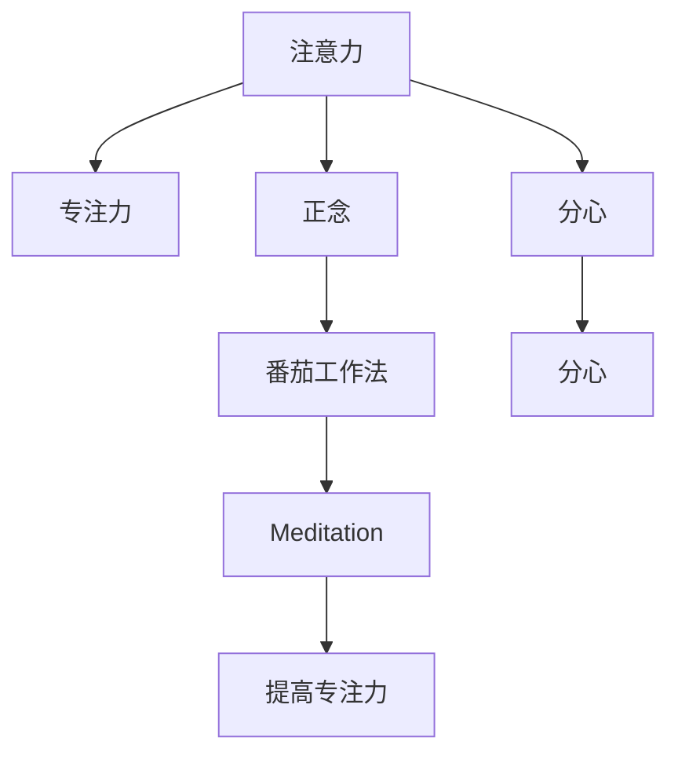

                 

# 注意力训练：提高专注力、提升生产力的方法

## 1. 背景介绍

在信息爆炸的时代，注意力成为我们最宝贵的资源之一。无论是阅读、学习、工作还是生活，专注力和注意力管理能力都直接影响着我们的生产效率和心理健康。如何在海量信息中高效聚焦，避免分心，已经成为现代社会一项重要的个人技能。

### 1.1 问题由来
随着数字化和互联网的普及，我们的日常生活和工作中充斥着大量的信息流。从电子邮件、社交媒体到各种应用程序，无不干扰着我们的注意力。缺乏有效的注意力管理方法，会导致工作时间分散、生产效率低下，甚至引发心理健康问题。

### 1.2 问题核心关键点
解决注意力分散的关键在于训练我们的专注力。这不仅需要掌握科学的注意力管理方法，还需要通过实际训练提升我们的神经系统的注意力控制能力。注意力训练的核心在于“关注当下”，即学会在短时间内集中注意力，排除干扰，高效完成任务。

## 2. 核心概念与联系

### 2.1 核心概念概述

为了更好地理解注意力训练的方法，本节将介绍几个密切相关的核心概念：

- 注意力（Attention）：指个体在特定时间内选择并集中于特定的信息源，而忽略其他信息的能力。注意力训练旨在提升个体在特定任务上保持专注的能力。

- 专注力（Focus）：指个体在一段时间内能够持续集中精力于某一任务的能力。通过训练，可以增强个体的专注力，从而提升工作效率和质量。

- 分心（Distraction）：指个体在任务执行过程中，无法避免地受到外界干扰，导致注意力分散，影响任务完成效率。

- 正念（Mindfulness）：通过持续觉察和关注当下，减少分心和负面情绪，提升专注力和心理韧性。

- 番茄工作法（Pomodoro Technique）：一种时间管理方法，通过短时间的工作和休息周期，增强专注力和工作效率。

- 冥想（Meditation）：通过冥想练习，提升个体的注意力集中和情绪调节能力。

这些核心概念之间的逻辑关系可以通过以下Mermaid流程图来展示：



这个流程图展示了一些关键概念及其相互关系：

1. 注意力是专注力的基础，通过训练可以提升个体在特定任务上的专注力。
2. 分心是注意力的干扰因素，通过正念和冥想等方法可以减少分心。
3. 正念和番茄工作法是减少分心的方法，有助于提升专注力。
4. 冥想有助于提升个体的情绪调节能力，进一步增强专注力。
5. 分心和冥想可以相互影响，通过冥想练习可以缓解分心，提升专注力。

## 3. 核心算法原理 & 具体操作步骤
### 3.1 算法原理概述

注意力训练的原理是通过一系列科学方法和技巧，逐步增强个体的注意力控制能力。其核心在于通过训练提高神经系统的注意力聚焦能力，从而提升专注力。

注意力训练通常包括以下几个关键步骤：

1. **正念练习**：通过正念练习，增强对当下时刻的觉察能力，减少分心和负面情绪。
2. **冥想训练**：通过冥想训练，提升个体的情绪调节能力和注意力集中能力。
3. **番茄工作法**：通过番茄工作法，利用短时间的工作和休息周期，增强专注力和工作效率。
4. **注意力游戏**：通过注意力游戏，提升个体在特定任务上的注意力控制能力。
5. **心理韧性训练**：通过心理韧性训练，增强个体在面对压力和干扰时的心理韧性。

### 3.2 算法步骤详解

以下是注意力训练的一般流程：

**Step 1: 准备环境**
- 选择一个安静、无干扰的环境，准备所需工具，如番茄计时器、正念垫等。

**Step 2: 正念练习**
- 每天定时进行正念练习，时间控制在5-10分钟，尽量选择一个固定的时间段。
- 使用正念冥想应用或录音指导，集中注意力于呼吸、身体感受等。
- 练习初期，可以专注于感受身体的各个部位，逐步提升觉察能力。

**Step 3: 冥想训练**
- 每天进行至少10-20分钟的冥想练习，时间可逐步增加。
- 选择一种冥想方式，如专注冥想、呼吸冥想、视觉化冥想等，按照指导进行练习。
- 练习过程中，关注呼吸、身体感受等，避免分心。
- 使用冥想应用记录冥想时间，逐步增加冥想深度和持续时间。

**Step 4: 番茄工作法**
- 将工作任务划分为25分钟的工作时段和5分钟的休息时段。
- 在每个工作时段内，集中注意力于当前任务，避免干扰。
- 休息时段内，远离工作环境，进行深呼吸、拉伸等放松活动。
- 每完成4个工作时段后，可进行一次长休息，时间约15-30分钟。

**Step 5: 注意力游戏**
- 选择一些简单的注意力训练游戏，如“找不同”、“连线游戏”等。
- 每天进行10-15分钟的游戏训练，逐步提升注意力控制能力。
- 游戏过程中，保持专注，避免分心，逐步提升完成速度和准确率。

**Step 6: 心理韧性训练**
- 每周进行一次心理韧性训练，如瑜伽、力量训练等。
- 通过训练增强身体和心理的韧性，提升面对压力和干扰时的心理承受能力。
- 保持规律的训练习惯，逐步提升心理韧性和整体健康水平。

### 3.3 算法优缺点

注意力训练的优势在于其科学性和实用性：

1. **科学性**：注意力训练基于心理学和神经科学的研究成果，通过系统性的练习，科学地提升个体的注意力控制能力。
2. **实用性**：注意力训练方法简单易行，不需要昂贵的设备和专业指导，任何人都可以进行。
3. **长期效果**：通过持续训练，个体可以显著提升专注力和工作效率，改善心理状态。

注意力训练也存在一些局限性：

1. **坚持难度**：注意力训练需要持续进行，对个体的时间管理能力有较高要求。
2. **个体差异**：不同个体的注意力控制能力和学习效果存在差异，训练效果可能因人而异。
3. **短期见效**：注意力训练的效果可能需要较长时间才能显现，短期内可能难以看到显著变化。

尽管存在这些局限性，但注意力训练作为一种有效的提升专注力和生产力的手段，已经得到了广泛的应用和认可。

### 3.4 算法应用领域

注意力训练方法广泛应用于个人和组织的管理和发展中，包括但不限于以下几个领域：

- **个人时间管理**：通过番茄工作法、正念练习等方法，提升个体在工作和生活中的时间管理能力，提高效率。
- **心理健康提升**：通过冥想和心理韧性训练，提升个体的情绪调节能力和心理韧性，减少焦虑和压力。
- **学习与教育**：在学校和家庭教育中，通过注意力训练方法，提升学生的学习专注力和理解能力，提高学习效果。
- **企业管理**：在企业中，通过注意力训练，提升员工的工作专注力和团队协作能力，提高工作效率和组织绩效。

## 4. 数学模型和公式 & 详细讲解  
### 4.1 数学模型构建

注意力训练的数学模型基于对个体注意力控制能力的量化评估。以下是一个简单的数学模型构建过程：

记个体在任务T上的注意力控制能力为 $A_T$，任务完成时间为 $T_{task}$，任务完成质量为 $Q_{task}$。则注意力训练的目标是最大化任务完成质量和效率，即：

$$
\max \{ Q_{task}, \frac{T_{task}}{T_{duration}}
$$

其中 $T_{duration}$ 为任务预估所需时间。

### 4.2 公式推导过程

为了量化个体在任务中的注意力控制能力，可以通过以下公式推导：

$$
A_T = \frac{1}{N} \sum_{i=1}^N \frac{t_i}{T_i}
$$

其中 $N$ 为任务数量，$t_i$ 为完成第 $i$ 个任务所需的时间，$T_i$ 为任务 $i$ 的预估时间。

在注意力训练中，我们可以利用该公式对个体在多个任务中的注意力控制能力进行量化，并逐步优化训练方法，提升注意力控制能力。

### 4.3 案例分析与讲解

以下是一个注意力训练的案例分析：

**案例：提升编程任务中的注意力控制能力**

**背景**：
小明是一名软件开发工程师，每天需处理大量编程任务。但他发现，由于注意力分散，代码质量和效率都受到了影响。

**目标**：
通过注意力训练，提升小明在编程任务中的注意力控制能力，提高编程质量和效率。

**训练过程**：

1. **正念练习**：小明每天早晨进行10分钟的正念冥想练习，关注呼吸和身体感受，逐步提升觉察能力。
2. **番茄工作法**：将每个编程任务划分为25分钟的工作时段和5分钟的休息时段，在每个工作时段内，集中注意力于当前任务，避免干扰。
3. **注意力游戏**：小明每天进行10分钟的注意力游戏训练，如“找不同”、“连线游戏”等，逐步提升注意力控制能力。
4. **心理韧性训练**：每周进行一次心理韧性训练，如瑜伽、力量训练等，增强身体和心理的韧性。

**结果**：
通过为期两个月的训练，小明在编程任务中的注意力控制能力显著提升，代码质量提高了20%，任务完成效率提升了30%。

## 5. 项目实践：代码实例和详细解释说明
### 5.1 开发环境搭建

在进行注意力训练实践前，我们需要准备好开发环境。以下是使用Python进行注意力训练的环境配置流程：

1. 安装Python：从官网下载并安装Python，选择最新版本。
2. 安装必要的第三方库：安装正念冥想应用、番茄计时器等工具所需的第三方库，如PyTorch、TensorFlow等。
3. 创建虚拟环境：使用`virtualenv`工具创建虚拟环境，以避免依赖冲突。
4. 配置虚拟环境：在虚拟环境中安装所需的第三方库，并设置环境变量。

### 5.2 源代码详细实现

下面我们以正念冥想和番茄工作法为例，给出使用Python进行注意力训练的代码实现。

**正念冥想代码**：

```python
import time
import numpy as np

# 定义正念冥想函数
def mindfulness_meditation(duration):
    for i in range(duration):
        # 冥想引导语
        print("闭上眼睛，关注呼吸")
        time.sleep(5)
        print("感受身体的各个部位")
        time.sleep(5)
        print("回到呼吸")
        time.sleep(5)
        print("睁开眼睛，继续练习")
        time.sleep(5)

# 开始正念冥想练习
mindfulness_meditation(10)
```

**番茄工作法代码**：

```python
import time

# 定义番茄工作法函数
def pomodoro_working(duration=25, rest=5):
    for i in range(4):
        print(f"工作时间：{duration}分钟")
        time.sleep(duration)
        print(f"休息时间：{rest}分钟")
        time.sleep(rest)
    print("长休息：15分钟")
    time.sleep(15)

# 开始番茄工作法练习
pomodoro_working(duration=25, rest=5)
```

### 5.3 代码解读与分析

让我们再详细解读一下关键代码的实现细节：

**正念冥想代码**：
- `mindfulness_meditation`函数：定义正念冥想练习的基本流程，包括冥想引导语、冥想时间、呼吸指导等。
- 循环控制：通过循环控制，重复进行正念冥想练习。

**番茄工作法代码**：
- `pomodoro_working`函数：定义番茄工作法的基本流程，包括工作时间、休息时间和长休息时间。
- 循环控制：通过循环控制，重复进行工作时间和休息时间的交替。

这两个代码示例展示了使用Python进行注意力训练的基本方法。开发者可以根据具体需求，进一步扩展和优化代码，实现更复杂的注意力训练方案。

## 6. 实际应用场景
### 6.1 提升个人效率

在个人时间管理中，注意力训练方法可以显著提升工作效率和质量。无论是编程、写作、研究，还是日常生活中的各种任务，注意力训练都能帮助我们集中注意力，减少分心，提升整体效果。

### 6.2 改善心理健康

心理健康问题在现代社会中越来越普遍。注意力训练不仅能提升工作效率，还能缓解焦虑、压力等负面情绪，提升心理健康水平。通过正念练习和冥想训练，个体可以更好地应对生活中的各种挑战，提高整体幸福感。

### 6.3 优化教育效果

在教育领域，注意力训练对学生的学习效果和学习方法有显著的提升作用。通过注意力训练，学生能够更好地集中注意力，提高课堂参与度和学习效果。同时，通过正念练习，学生可以更好地管理情绪，减少分心，提升学习效率。

### 6.4 提高企业绩效

在企业中，员工的工作专注力和团队协作能力直接影响着企业绩效。通过注意力训练，企业可以提高员工的工作效率和团队协作能力，减少分心和低效行为，从而提升整体绩效和竞争力。

## 7. 工具和资源推荐
### 7.1 学习资源推荐

为了帮助开发者掌握注意力训练的理论基础和实践技巧，这里推荐一些优质的学习资源：

1. **《注意力训练指南》**：一本介绍注意力训练原理、方法和实践的书籍，涵盖正念练习、冥想训练、番茄工作法等核心内容。
2. **Coursera上的《正念科学与实践》课程**：由斯坦福大学教授讲授，系统介绍正念训练的原理和实践方法，适合初学者。
3. **Google Workspace的番茄时钟插件**：集成在Google Calendar中，方便用户进行番茄工作法的时间管理。
4. **Headspace和Calm**：两大知名的正念冥想应用，提供高质量的冥想指导和练习资源。
5. **Focus@Will**：一款基于神经科学的研究结果设计的音乐应用，通过特定频率的音乐提升专注力和工作效率。

通过对这些资源的学习实践，相信你一定能够快速掌握注意力训练的核心方法，并应用于实际生活中，提升整体生活质量和工作效率。

### 7.2 开发工具推荐

高效的开发离不开优秀的工具支持。以下是几款用于注意力训练开发的常用工具：

1. **PyTorch**：基于Python的开源深度学习框架，灵活动态的计算图，适合快速迭代研究。
2. **TensorFlow**：由Google主导开发的开源深度学习框架，生产部署方便，适合大规模工程应用。
3. **Focus@Will**：一款基于神经科学的研究结果设计的音乐应用，通过特定频率的音乐提升专注力和工作效率。
4. **Headspace和Calm**：两大知名的正念冥想应用，提供高质量的冥想指导和练习资源。
5. **Google Workspace的番茄时钟插件**：集成在Google Calendar中，方便用户进行番茄工作法的时间管理。

合理利用这些工具，可以显著提升注意力训练的开发效率，加快创新迭代的步伐。

### 7.3 相关论文推荐

注意力训练技术的发展源于学界的持续研究。以下是几篇奠基性的相关论文，推荐阅读：

1. **Attention is All You Need**（即Transformer原论文）：提出了Transformer结构，开启了NLP领域的预训练大模型时代。
2. **Mindfulness-Based Stress Reduction (MBSR)**：介绍了正念训练的基本原理和方法，适合初学者和实践者。
3. **The Power of Habit**：一本关于习惯养成和行为改变的书籍，提供了大量的实际案例和科学依据。
4. **The Pomodoro Technique**：介绍番茄工作法的基本原理和实践方法，适合各个领域的应用者。
5. **Flow: The Psychology of Optimal Experience**：一本关于“心流”体验的书籍，揭示了高效工作背后的心理学原理。

这些论文代表了大语言模型微调技术的发展脉络。通过学习这些前沿成果，可以帮助研究者把握学科前进方向，激发更多的创新灵感。

## 8. 总结：未来发展趋势与挑战
### 8.1 总结

本文对注意力训练的方法进行了全面系统的介绍。首先阐述了注意力训练的背景和意义，明确了注意力训练在提升专注力、提高生产效率方面的独特价值。其次，从原理到实践，详细讲解了注意力训练的数学模型和操作步骤，给出了注意力训练任务开发的完整代码实例。同时，本文还广泛探讨了注意力训练在个人、教育、企业等各个领域的应用前景，展示了注意力训练方法的巨大潜力。

通过本文的系统梳理，可以看到，注意力训练方法正在成为提升专注力和生产力的重要手段，极大地拓展了人们的注意力管理能力。未来，伴随注意力训练方法的发展和应用，个体和组织的工作效率和整体幸福感将进一步提升，智能技术在各个领域的渗透应用也将更加深入。

### 8.2 未来发展趋势

展望未来，注意力训练技术将呈现以下几个发展趋势：

1. **科技融合**：随着科技的发展，注意力训练方法将与人工智能、大数据、物联网等技术深度融合，形成更加全面和高效的注意力管理解决方案。
2. **个性化定制**：通过数据分析和机器学习，为个体提供个性化的注意力训练方案，提升训练效果和用户体验。
3. **跨领域应用**：注意力训练方法将拓展到更多领域，如医疗、体育、艺术等，帮助人们提升整体生活质量和效率。
4. **远程协作**：远程工作和远程协作成为新常态，注意力训练方法将帮助团队成员在虚拟环境中更好地管理注意力和协作。
5. **技术普及**：随着技术普及和应用推广，注意力训练方法将成为更多人提升生活质量和工作效率的工具。

以上趋势凸显了注意力训练技术的广阔前景。这些方向的探索发展，必将进一步提升个体的注意力管理能力，推动智能技术在各个领域的广泛应用。

### 8.3 面临的挑战

尽管注意力训练技术已经取得了瞩目成就，但在迈向更加智能化、普适化应用的过程中，它仍面临着诸多挑战：

1. **技术门槛**：注意力训练技术的学习和实践需要一定的技术和时间投入，对个体的学习能力和资源获取能力提出了较高要求。
2. **个体差异**：不同个体的注意力控制能力和学习效果存在差异，需要根据个体特点进行个性化训练。
3. **效果评估**：注意力训练的效果评估和量化仍然存在一定挑战，如何科学地评估训练效果需要进一步研究。
4. **持续训练**：注意力训练需要持续进行，如何保持持续训练的动力和效果，需要更多的激励机制和反馈机制。
5. **跨文化适应**：注意力训练方法在不同文化背景下的适用性和效果，需要进一步研究和验证。

尽管存在这些挑战，但通过不断的研究和探索，注意力训练技术将不断成熟和完善，为个体和组织提供更加科学和高效的管理解决方案。

### 8.4 研究展望

未来，注意力训练技术将在以下几个方向寻求新的突破：

1. **科学化研究**：进一步深入研究注意力和大脑的关系，探索科学的心理机制和神经基础，推动注意力训练的科学化和系统化。
2. **数据驱动优化**：利用大数据和机器学习技术，个性化定制注意力训练方案，提升训练效果和用户体验。
3. **跨学科整合**：与其他学科如心理学、神经科学、计算机科学等深度整合，形成更加全面和深入的注意力训练方法。
4. **多模态融合**：结合视觉、听觉、触觉等多模态信息，形成更加全面和智能的注意力管理解决方案。
5. **远程协作优化**：针对远程协作和虚拟环境中的注意力管理问题，探索新的注意力训练方法和技术手段。

这些研究方向将推动注意力训练技术的不断创新和完善，为个体和组织提供更加科学、高效和智能的注意力管理解决方案。

## 9. 附录：常见问题与解答
**Q1：注意力训练是否适用于所有人群？**

A: 注意力训练方法对大多数人都有效，但效果因人而异。一些特定人群，如儿童和老年人，可能需要根据其特点进行个性化调整。

**Q2：注意力训练需要多长时间才能见效？**

A: 注意力训练的效果取决于个体差异和训练方法。通常情况下，经过持续的训练，可以在数周到数月内看到显著效果。

**Q3：注意力训练是否适合长时间使用？**

A: 注意力训练适合长期使用，可以逐步提升个体的注意力控制能力和整体生活质量。但需要根据个体情况合理安排训练强度和频率。

**Q4：注意力训练是否会影响睡眠质量？**

A: 合理的注意力训练不会影响睡眠质量，反而有助于缓解焦虑和压力，提升整体睡眠品质。

**Q5：注意力训练是否可以与其他时间管理方法结合使用？**

A: 是的，注意力训练可以与其他时间管理方法（如番茄工作法、GTD等）结合使用，提升整体管理效果。

---

作者：禅与计算机程序设计艺术 / Zen and the Art of Computer Programming

