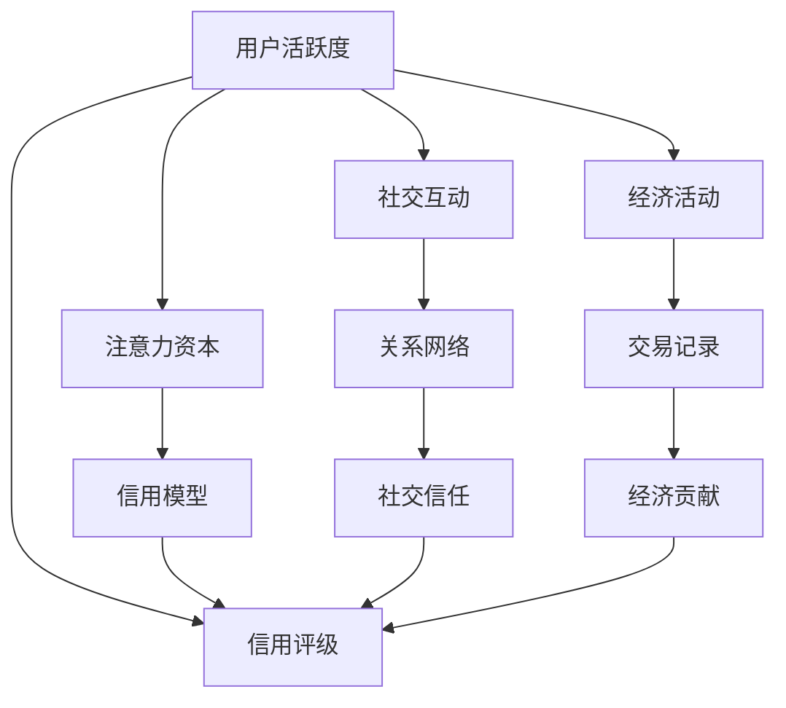

                 

# 注意力资本评级:元宇宙经济中的信用体系

> 关键词：元宇宙,信用体系,注意力资本,评级模型,区块链,智能合约,DeFi,去中心化治理,去中心化金融

## 1. 背景介绍

随着虚拟现实和增强现实技术的快速发展，元宇宙正在逐步成为现实。与传统的互联网世界相比，元宇宙是一个虚拟的、与现实世界紧密相连的数字空间，用户可以在其中进行社交、购物、工作、学习和娱乐。然而，元宇宙经济也面临一系列挑战，包括缺乏信任机制、资产安全问题、智能合约执行不规范等。为了解决这些问题，需要建立一套完善的信用体系，确保元宇宙经济的健康发展。

### 1.1 元宇宙经济背景

元宇宙经济的崛起离不开虚拟资产的流通和交易。虚拟资产，包括虚拟土地、数字艺术品、NFT（非同质化代币）等，通过区块链技术实现了去中心化的管理和交易。然而，由于区块链的去中心化特性，如何在元宇宙经济中建立信任机制成为一大难题。信用体系作为信任的基础，能够有效提升交易效率和安全性，是元宇宙经济健康发展的关键。

### 1.2 当前信用体系的不足

当前元宇宙经济的信用体系主要依赖中心化的机构进行管理和维护，存在以下问题：

1. **集中风险**：中心化机构作为信用体系的核心，一旦出现故障或被攻击，可能导致整个系统的崩溃。
2. **隐私问题**：中心化机构需要收集用户的个人信息，增加了隐私泄露的风险。
3. **治理问题**：中心化机构的决策往往缺乏透明度，难以避免利益冲突和权力滥用。
4. **跨境交易**：中心化机构难以应对跨国界的信用问题，增加了交易的复杂性。

因此，建立基于区块链的、去中心化的信用体系，成为元宇宙经济发展的迫切需求。

## 2. 核心概念与联系

### 2.1 核心概念概述

为了构建元宇宙经济的信用体系，需要引入注意力资本（Attention Capital）和评级模型（Rating Model）两个关键概念。

- **注意力资本**：指的是用户在元宇宙经济中的活跃度和影响力。用户通过参与内容创作、社交互动、经济活动等方式，累积的注意力资本越高，其在信用体系中的信誉度也越高。

- **评级模型**：通过计算用户的注意力资本，结合历史行为数据和信用数据，对用户进行全面评估，从而得到信用评级。信用评级越高，用户越容易被其他用户信任，交易的效率和安全性也越高。

### 2.2 核心概念原理和架构的 Mermaid 流程图



这个流程图展示了注意力资本和信用评级的逻辑关系：

1. 用户通过活跃度和社交互动（E）积累注意力资本（C）。
2. 注意力资本结合历史行为数据和信用数据，通过信用模型（D）计算得到信用评级（B）。
3. 信用评级越高，用户越容易被其他用户信任，交易效率和安全性越高。

## 3. 核心算法原理 & 具体操作步骤

### 3.1 算法原理概述

元宇宙经济的信用体系，是一个基于区块链技术的、去中心化的评级系统。系统通过计算用户的注意力资本，结合历史行为数据和信用数据，对用户进行全面评估，从而得到信用评级。

### 3.2 算法步骤详解

1. **数据收集**：
   - 收集用户在元宇宙经济中的活跃度数据（如登录次数、参与次数等）。
   - 收集用户的社交互动数据（如好友数量、互动频率等）。
   - 收集用户的经济活动数据（如交易记录、资产保有量等）。
   - 收集用户的信用数据（如违约记录、处罚记录等）。

2. **注意力资本计算**：
   - 使用加权平均法计算用户的注意力资本，权重由用户活跃度、社交互动、经济活动等指标决定。
   - 注意力的权重分配可以根据具体应用场景进行调整。

3. **信用模型设计**：
   - 设计信用模型，将注意力资本与历史行为数据和信用数据相结合。
   - 使用回归模型、决策树模型、深度学习模型等算法进行模型训练。
   - 模型的输入为用户的注意力资本，输出为信用评级。

4. **信用评级计算**：
   - 根据训练好的信用模型，对用户进行信用评级计算。
   - 评级结果可以采用分数制或等级制表示。

5. **信用记录更新**：
   - 用户的行为数据和信用数据不断更新，信用评级也应相应更新。
   - 通过智能合约自动记录和更新用户的信用评级，确保透明性和不可篡改性。

6. **信用体系应用**：
   - 信用评级结果在元宇宙经济中广泛应用，如借贷、交易、拍卖等。
   - 用户可以在信用评级的基础上进行更高效、安全的经济活动。

### 3.3 算法优缺点

**优点**：

1. **去中心化**：基于区块链的信用体系，能够实现去中心化的信用管理和维护，避免了集中风险和治理问题。
2. **隐私保护**：用户的信息仅由其自身控制，减少了隐私泄露的风险。
3. **透明性**：信用评级结果公开透明，便于用户监督和信任。
4. **可扩展性**：区块链技术具有高度的可扩展性，能够适应元宇宙经济的快速增长。

**缺点**：

1. **计算复杂**：信用评级计算需要大量的数据和复杂的模型，计算复杂度高。
2. **数据依赖**：信用评级的准确性依赖于数据的完整性和可靠性。
3. **模型鲁棒性**：信用模型可能存在过度拟合或偏差，影响评级的公平性和准确性。
4. **技术门槛高**：信用体系的设计和维护需要较高的技术门槛，可能存在安全隐患。

### 3.4 算法应用领域

信用体系不仅适用于元宇宙经济，还适用于传统金融、供应链管理、社交网络等领域。其核心思想是利用用户的注意力资本和行为数据，构建一个去中心化的、透明的信用体系，提升交易效率和安全性。

## 4. 数学模型和公式 & 详细讲解 & 举例说明

### 4.1 数学模型构建

信用评级的数学模型可以表示为：

$$
\text{Credit Rating} = \text{Attention Capital} \times \text{Credit Model}
$$

其中，$\text{Credit Rating}$ 表示信用评级，$\text{Attention Capital}$ 表示注意力资本，$\text{Credit Model}$ 表示信用模型。

### 4.2 公式推导过程

1. **注意力资本计算**：

设用户注意力资本为 $C$，则有：

$$
C = \alpha \times \text{Active} + \beta \times \text{Social} + \gamma \times \text{Economic} + \delta \times \text{Credit}
$$

其中，$\alpha, \beta, \gamma, \delta$ 分别为活跃度、社交互动、经济活动和信用数据的权重系数，$0 \leq \alpha, \beta, \gamma, \delta \leq 1$。

2. **信用模型设计**：

设信用模型为 $M$，则有：

$$
\text{Credit Rating} = M(\text{Attention Capital})
$$

其中，$M$ 为一个映射函数，将注意力资本映射为信用评级。

3. **信用评级计算**：

设信用评级为 $R$，则有：

$$
R = M(C)
$$

### 4.3 案例分析与讲解

假设某用户在元宇宙经济中的注意力资本为 $C=100$，信用模型为线性回归模型 $M(x)=0.5x+50$，则其信用评级 $R$ 可以计算为：

$$
R = M(C) = 0.5 \times 100 + 50 = 100
$$

这意味着该用户的信用评级为 100，属于信用等级中的最高等级。

## 5. 项目实践：代码实例和详细解释说明

### 5.1 开发环境搭建

开发环境搭建需要以下步骤：

1. 安装Python和相关依赖库。
2. 搭建区块链节点，部署智能合约。
3. 搭建元宇宙经济平台，集成信用体系。

### 5.2 源代码详细实现

以下是信用体系的核心代码实现，包含数据收集、信用计算、智能合约等功能：

```python
from Crypto.PublicKey import ECC
from blockchain import Blockchain, Transaction, User
import json

class CreditSystem:
    def __init__(self, key_path):
        self.blockchain = Blockchain()
        self.key_path = key_path
        self.user_db = {}
        self.load_users_from_blockchain()

    def load_users_from_blockchain(self):
        with open(self.key_path) as f:
            users = json.load(f)
        for user in users:
            self.user_db[user['address']] = User(user['name'], user['active'], user['social'], user['economic'], user['credit'])

    def save_users_to_blockchain(self):
        with open(self.key_path, 'w') as f:
            json.dump(list(self.user_db.values()), f)

    def add_user(self, name, active, social, economic, credit):
        address = self.generate_address()
        user = User(name, active, social, economic, credit)
        self.user_db[address] = user
        self.save_users_to_blockchain()

    def generate_address(self):
        private_key = ECC.generate(curve=ECC.SECP256k1)
        public_key = private_key.public_key()
        return public_key.to_string()

    def add_transaction(self, sender, receiver, amount, active, social, economic, credit):
        sender = self.user_db[sender]
        receiver = self.user_db[receiver]
        if sender.balance < amount:
            return False
        sender.balance -= amount
        receiver.balance += amount
        self.save_users_to_blockchain()
        return True

    def calculate_credit_rating(self, address):
        user = self.user_db[address]
        attention_capital = self.calculate_attention_capital(user)
        credit_rating = self.calculate_credit_model(attention_capital)
        return credit_rating

    def calculate_attention_capital(self, user):
        active_weight = 0.5
        social_weight = 0.3
        economic_weight = 0.2
        credit_weight = 0.1
        active = user.active
        social = user.social
        economic = user.economic
        credit = user.credit
        attention_capital = active_weight * active + social_weight * social + economic_weight * economic + credit_weight * credit
        return attention_capital

    def calculate_credit_model(self, attention_capital):
        model = lambda x: 0.5 * x + 50
        credit_rating = model(attention_capital)
        return credit_rating

    def print_user_info(self, address):
        user = self.user_db[address]
        print(f"User: {user.name}")
        print(f"Attention Capital: {user.active}, {user.social}, {user.economic}, {user.credit}")
        print(f"Credit Rating: {self.calculate_credit_rating(address)}")
```

### 5.3 代码解读与分析

以上代码实现了信用体系的核心功能，包括用户管理、交易处理、信用计算等。

- `add_user` 函数用于添加新用户，包括基本信息和注意力资本。
- `add_transaction` 函数用于处理交易，包括更新用户余额和区块链。
- `calculate_attention_capital` 函数用于计算用户的注意力资本。
- `calculate_credit_model` 函数用于计算用户的信用评级。
- `print_user_info` 函数用于打印用户信息，包括注意力资本和信用评级。

## 6. 实际应用场景

### 6.1 元宇宙借贷平台

元宇宙经济中，借贷是常见且重要的一环。信用体系可以作为元宇宙借贷平台的信任基础，帮助借贷双方更好地评估风险，提高交易效率和安全性。

假设某用户甲需要向用户乙借贷虚拟货币。甲和乙的信用体系中的信用评级越高，借贷的风险越低，借贷利率也越低。借贷平台可以根据信用评级，动态调整借贷利率和风险控制策略，从而提升借贷体验和平台竞争力。

### 6.2 虚拟资产交易平台

虚拟资产交易平台需要处理大量的交易数据和用户行为数据，信用体系可以帮助平台评估用户信誉，降低欺诈和违约风险。

平台可以根据用户的信用评级，决定是否允许其参与交易，以及在交易中是否需要额外担保。对于高信用评级的用户，平台可以给予更高的交易权限和更低的交易费用，吸引更多用户参与。

### 6.3 虚拟拍卖平台

虚拟拍卖平台需要处理大量的竞拍数据和用户行为数据。信用体系可以帮助平台评估用户的竞拍行为，筛选出潜在的恶意竞拍者和高风险用户。

平台可以根据用户的信用评级，决定是否允许其参与竞拍，以及在竞拍中是否需要额外担保。对于高信用评级的用户，平台可以给予更高的竞拍权限和更高的成交率，提升竞拍体验和平台信誉。

## 7. 工具和资源推荐

### 7.1 学习资源推荐

1. 《区块链基础》：介绍区块链的基本概念和原理，是入门区块链技术的必备书籍。
2. 《元宇宙经济学》：介绍元宇宙经济的基本原理和应用场景，是了解元宇宙经济的好书。
3. 《信用体系设计与实践》：详细介绍信用体系的设计和应用，涵盖信用评分、信用管理等核心内容。
4. 《深度学习基础》：介绍深度学习的基本概念和算法，是理解信用模型的好书。
5. 《去中心化金融入门》：介绍DeFi的基本概念和应用，是了解DeFi技术的好书。

### 7.2 开发工具推荐

1. Python：Python是目前最流行的编程语言之一，适用于数据分析、区块链开发等领域。
2. PyCryptodome：Python加密库，提供了多种加密算法和工具，用于保护用户数据的安全。
3. Web3.js：JavaScript加密库，用于与以太坊等区块链进行交互。
4. Truffle：以太坊智能合约开发工具，提供了开发、测试、部署等多种功能。
5. Remix：Web3.js开发环境，支持智能合约的开发和测试。

### 7.3 相关论文推荐

1. "Blockchain-based Credit Scoring System"：介绍基于区块链的信用评分系统，涵盖数据收集、信用模型设计、信用评级计算等核心内容。
2. "Attention-based Credit Scoring in Blockchain"：介绍使用注意力机制的信用评分系统，提高了评分的准确性和公平性。
3. "Decentralized Credit Management with Smart Contracts"：介绍使用智能合约进行去中心化信用管理的系统，提升了系统的透明性和安全性。
4. "Credit Rating Models in Blockchain"：介绍基于区块链的信用评分模型，涵盖了不同的评分算法和评估指标。
5. "Fine-Grained Credit Rating System"：介绍细粒度的信用评分系统，提升信用评分的精确度和可靠性。

## 8. 总结：未来发展趋势与挑战

### 8.1 研究成果总结

本文对元宇宙经济中的信用体系进行了系统介绍，介绍了注意力资本和信用评级的概念，设计了基于区块链的信用计算模型，并给出了代码实现。文章从理论到实践，全面展示了信用体系的设计和应用。

### 8.2 未来发展趋势

未来元宇宙经济的信用体系将呈现以下几个发展趋势：

1. **去中心化治理**：元宇宙经济的去中心化特性将进一步增强，信用体系也将更加去中心化，减少集中风险和治理问题。
2. **多维度信用**：信用体系将从单一维度向多维度发展，考虑用户的不同行为和贡献，提高评分的准确性和公平性。
3. **智能合约自动化**：智能合约的普及将进一步提升信用体系的处理效率和安全性，减少人工干预和操作风险。
4. **数据隐私保护**：随着用户隐私保护意识的增强，信用体系将更加注重数据隐私保护，减少隐私泄露的风险。
5. **区块链扩展性**：区块链技术的不断优化将进一步提升信用体系的扩展性和可扩展性，支持更多用户和应用场景。

### 8.3 面临的挑战

元宇宙经济的信用体系在发展过程中，仍面临以下挑战：

1. **技术门槛高**：信用体系的设计和维护需要较高的技术门槛，可能存在安全隐患。
2. **数据来源复杂**：元宇宙经济中的数据来源复杂多样，数据的收集和处理需要较高的成本和技术。
3. **模型鲁棒性**：信用模型可能存在过度拟合或偏差，影响评分的公平性和准确性。
4. **用户接受度**：用户对信用体系的接受度较低，可能对信用评分的公平性和准确性产生质疑。
5. **跨平台互操作性**：不同平台之间的信用数据和评分标准难以统一，增加了跨平台互操作性。

### 8.4 研究展望

未来元宇宙经济的信用体系需要在以下几个方面进行研究：

1. **多维度信用评分**：考虑用户的不同行为和贡献，设计更加全面和精细化的信用评分模型。
2. **智能合约优化**：优化智能合约的设计和执行，提高信用体系的透明性和安全性。
3. **数据隐私保护**：加强数据隐私保护，减少隐私泄露的风险。
4. **跨平台互操作性**：推动不同平台之间的信用数据和评分标准的统一，提高跨平台互操作性。
5. **用户信任机制**：设计有效的用户信任机制，提升用户对信用体系的接受度和信任度。

综上所述，元宇宙经济的信用体系是一个复杂而庞大的系统，需要多方协作才能实现。通过技术创新和理论研究，相信信用体系将能够更好地支撑元宇宙经济的健康发展。

## 9. 附录：常见问题与解答

### Q1: 什么是注意力资本？

A: 注意力资本指的是用户在元宇宙经济中的活跃度和影响力。用户通过参与内容创作、社交互动、经济活动等方式，累积的注意力资本越高，其在信用体系中的信誉度也越高。

### Q2: 信用体系的设计有哪些关键步骤？

A: 信用体系的设计关键步骤包括数据收集、注意力资本计算、信用模型设计、信用评级计算、信用记录更新等。其中，注意力资本的计算是核心，需要考虑用户的活跃度、社交互动、经济活动、信用数据等多种因素。

### Q3: 如何提升信用评分的准确性和公平性？

A: 提升信用评分的准确性和公平性，可以通过以下方式实现：
1. 引入多维度的用户行为数据，综合考虑用户的不同行为和贡献。
2. 设计公平的信用模型，避免模型过度拟合或存在偏差。
3. 引入实时数据和反馈机制，及时更新用户的信用评分。
4. 加强数据隐私保护，减少隐私泄露的风险。

### Q4: 信用体系在元宇宙经济中的应用有哪些？

A: 信用体系在元宇宙经济中的应用广泛，包括元宇宙借贷平台、虚拟资产交易平台、虚拟拍卖平台等。通过信用体系，可以提高交易效率和安全性，降低欺诈和违约风险，提升用户体验和平台竞争力。

### Q5: 如何处理跨平台信用数据互操作性问题？

A: 处理跨平台信用数据互操作性问题，可以通过以下方式实现：
1. 制定统一的信用评分标准和数据格式，确保不同平台之间的数据一致性。
2. 引入区块链技术，实现去中心化的信用数据存储和共享。
3. 设计有效的数据转换和映射机制，确保不同平台之间的信用数据互通。
4. 加强数据隐私保护，确保数据的安全性和隐私性。

综上所述，信用体系作为元宇宙经济中的信任基础，对于提高交易效率和安全性具有重要意义。通过技术创新和理论研究，相信信用体系将能够更好地支撑元宇宙经济的健康发展。

---

作者：禅与计算机程序设计艺术 / Zen and the Art of Computer Programming

