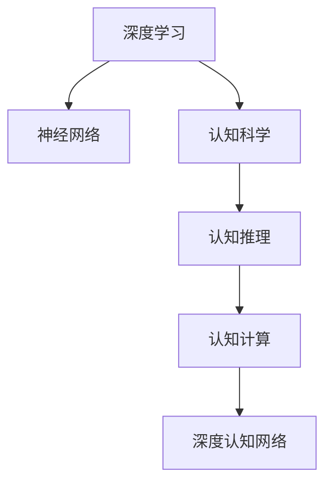

                 

# 洞察力：人类认知的新高度

> 关键词：认知科学, 人工智能, 深度学习, 神经网络, 认知神经科学, 认知心理学

## 1. 背景介绍

### 1.1 问题由来
在人工智能飞速发展的今天，深度学习和神经网络已经成为构建高性能智能系统的关键。从语音识别、图像识别到自然语言处理，深度学习在诸多领域展示了卓越的表现。然而，尽管算法在技术层面上取得了显著进步，但在人类认知的深度理解上，依然存在诸多空白。认知科学和认知心理学在探索人类认知机制方面，为我们提供了宝贵的视角，推动了认知神经科学的发展。本文将探讨如何结合深度学习技术，洞察人类认知的奥秘，探索人工智能未来的发展方向。

### 1.2 问题核心关键点
人类认知的过程充满了复杂性，如何在深度学习中有效模拟和理解这一过程，一直是AI领域的重要课题。认知科学的研究表明，认知活动可以分为知觉、记忆、学习、推理、意识等多个层面，各层面之间存在紧密联系。结合认知科学理论，AI研究者们致力于构建认知计算模型，使机器能够更接近人类认知的深度和广度。

认知神经科学通过对脑神经活动的分析，揭示了神经元间的交互和信息传递机制。这为深度学习的优化和改进提供了理论依据，促进了神经网络结构和训练方法的革新。

认知心理学则关注于人类认知过程的心理机制，例如注意力、情感、思维等，为设计更具人性化的AI提供了参考。

因此，本文将从认知科学的视角出发，结合深度学习技术，探讨如何构建更加智能、理解人类认知的AI系统。

## 2. 核心概念与联系

### 2.1 核心概念概述

为更好地理解深度学习与认知科学的结合，本节将介绍几个密切相关的核心概念：

- 深度学习（Deep Learning）：以多层神经网络为代表的机器学习技术，通过多层次的非线性变换，学习输入数据的高层次特征，广泛应用于图像、语音、自然语言处理等领域。

- 认知科学（Cognitive Science）：研究心智、思维和意识的科学，涉及心理学、神经科学、人工智能等多个领域，旨在揭示认知过程的机制和规律。

- 神经网络（Neural Networks）：受生物神经元系统的启发，通过多个层次的神经元模拟信息的处理和传递。深度学习中的神经网络通常包含多个隐层，用于学习复杂特征。

- 认知计算（Cognitive Computing）：将认知科学的理论应用于计算机科学，构建模拟人类认知过程的计算模型，实现更智能、更人性化的AI系统。

- 认知推理（Cognitive Reasoning）：通过模拟人类推理过程，使AI系统具备逻辑推理、问题解决等高级认知功能。

- 深度认知网络（Deep Cognitive Networks）：结合深度学习与认知科学的理论，构建能够模拟人类认知机制的计算模型。

这些核心概念之间的逻辑关系可以通过以下Mermaid流程图来展示：



这个流程图展示了深度学习与认知科学结合的基本框架：深度学习通过神经网络模拟信息的处理，而认知科学为深度学习提供了理论基础和研究方向，共同构建深度认知网络，实现更加智能和人性化的人工智能系统。

## 3. 核心算法原理 & 具体操作步骤
### 3.1 算法原理概述

深度学习与认知科学的结合，旨在通过神经网络模拟人类认知过程，实现更智能的AI系统。具体而言，深度认知网络通常包含以下关键组件：

- 感知器（Perceptron）：模拟人类感官系统的输入处理，将原始数据转化为高层次特征。

- 记忆模块（Memory）：模拟人类记忆系统，用于存储和检索信息，支持长时记忆和短期记忆的模拟。

- 学习模块（Learning）：模拟人类学习机制，通过反向传播和梯度下降等算法更新网络参数，实现复杂任务的学习。

- 推理模块（Reasoning）：模拟人类推理过程，通过逻辑推理、问题求解等实现复杂任务的解决。

- 意识模块（Consciousness）：模拟人类意识的体验，通过神经网络的激活和反馈机制，实现更高层次的认知功能。

### 3.2 算法步骤详解

构建深度认知网络的一般步骤如下：

**Step 1: 设计认知计算模型**
- 根据认知科学理论，设计符合认知规律的计算模型，如感知器、记忆模块、学习模块等。

**Step 2: 选择合适的深度学习框架**
- 选择合适的深度学习框架，如TensorFlow、PyTorch等，构建深度认知网络。

**Step 3: 定义输入和输出**
- 确定认知网络的输入和输出，通常为感知器输入和推理输出。

**Step 4: 设计损失函数**
- 定义合适的损失函数，用于衡量模型的预测与实际结果之间的差异。

**Step 5: 训练网络**
- 使用训练数据对网络进行训练，通过反向传播更新网络参数，优化模型性能。

**Step 6: 测试和评估**
- 在测试数据上评估模型性能，使用评价指标如准确率、召回率等。

**Step 7: 微调和优化**
- 根据评估结果，对网络结构和参数进行微调，提升模型性能。

### 3.3 算法优缺点

深度认知网络结合了深度学习和认知科学的优点，但也存在一些局限性：

**优点：**
1. 学习能力强大：通过多层非线性变换，深度学习能够学习到复杂特征，适合处理多模态数据。
2. 模拟人类认知过程：结合认知科学理论，深度认知网络可以模拟人类感知、记忆、推理等认知过程，实现更智能的AI系统。
3. 泛化能力强：深度认知网络具有较强的泛化能力，可以在不同领域和任务中取得良好的表现。

**缺点：**
1. 训练难度大：深度认知网络的训练通常需要大量数据和计算资源，训练过程复杂。
2. 理解能力有限：尽管深度认知网络能够模拟人类认知过程，但在某些高级认知任务上，仍难以完全理解人类的行为和决策。
3. 可解释性差：深度认知网络的决策过程复杂，难以解释其内部机制，缺乏可解释性。

### 3.4 算法应用领域

深度认知网络在多个领域都有广泛应用，例如：

- 医疗诊断：通过认知推理和知识图谱的结合，深度认知网络可以辅助医生进行疾病诊断和治疗方案制定。
- 金融预测：结合认知神经科学的理论，深度认知网络可以模拟人类的决策过程，用于金融市场的预测和分析。
- 自然语言处理：通过认知计算和认知推理，深度认知网络可以模拟人类的语言理解和生成，实现更智能的机器翻译、问答系统等任务。
- 教育个性化：深度认知网络可以模拟人类的学习过程，实现个性化学习路径的推荐，提升教育效果。
- 智能驾驶：结合认知推理和感知模块，深度认知网络可以辅助自动驾驶车辆进行决策和导航。

## 4. 数学模型和公式 & 详细讲解 & 举例说明

### 4.1 数学模型构建

深度认知网络的数学模型通常基于神经网络的基本结构，可以表示为：

$$
F(x; \theta) = \sum_{i=1}^n w_i g(h(x; \theta))
$$

其中，$x$ 为输入数据，$g$ 为激活函数，$h$ 为隐层函数，$\theta$ 为模型参数，$F$ 为输出。

### 4.2 公式推导过程

以二分类任务为例，我们假设输入 $x$ 经过感知器和隐层函数 $h$ 处理后，输出为 $h(x)$。通过一个全连接层和一个 sigmoid 激活函数，将 $h(x)$ 转化为二分类输出 $y$：

$$
y = \sigma(w^T h(x) + b)
$$

其中 $\sigma$ 为 sigmoid 激活函数，$w$ 和 $b$ 分别为全连接层的权重和偏置。

对于损失函数，我们通常使用二分类交叉熵损失：

$$
L(y, \hat{y}) = -\frac{1}{N}\sum_{i=1}^N [y_i \log \hat{y_i} + (1-y_i) \log (1-\hat{y_i})]
$$

其中 $N$ 为样本数量，$y_i$ 和 $\hat{y_i}$ 分别为真实标签和模型预测结果。

### 4.3 案例分析与讲解

考虑一个简单的认知推理任务：计算两个数的和。我们将输入 $x$ 表示为两个数 $a$ 和 $b$，并通过感知器提取特征：

$$
h(x) = [a, b]
$$

然后，通过一个全连接层和一个 sigmoid 激活函数，计算两个数的和：

$$
y = \sigma(w^T h(x) + b)
$$

其中 $w$ 和 $b$ 为全连接层的权重和偏置。这样，深度认知网络便能够模拟人类对简单数学问题的理解和计算。

## 5. 项目实践：代码实例和详细解释说明

### 5.1 开发环境搭建

在进行深度认知网络开发前，我们需要准备好开发环境。以下是使用Python进行PyTorch开发的环境配置流程：

1. 安装Anaconda：从官网下载并安装Anaconda，用于创建独立的Python环境。

2. 创建并激活虚拟环境：
```bash
conda create -n pytorch-env python=3.8 
conda activate pytorch-env
```

3. 安装PyTorch：根据CUDA版本，从官网获取对应的安装命令。例如：
```bash
conda install pytorch torchvision torchaudio cudatoolkit=11.1 -c pytorch -c conda-forge
```

4. 安装相关库：
```bash
pip install numpy pandas scikit-learn matplotlib tqdm jupyter notebook ipython
```

完成上述步骤后，即可在`pytorch-env`环境中开始深度认知网络开发。

### 5.2 源代码详细实现

我们以一个简单的认知推理任务为例，使用PyTorch构建深度认知网络。

```python
import torch
import torch.nn as nn
import torch.optim as optim

class CognitiveNetwork(nn.Module):
    def __init__(self):
        super(CognitiveNetwork, self).__init__()
        self.fc1 = nn.Linear(2, 8)
        self.fc2 = nn.Linear(8, 1)
        self.sigmoid = nn.Sigmoid()

    def forward(self, x):
        x = self.fc1(x)
        x = self.sigmoid(x)
        x = self.fc2(x)
        x = self.sigmoid(x)
        return x

model = CognitiveNetwork()

criterion = nn.BCELoss()
optimizer = optim.Adam(model.parameters(), lr=0.001)

def train(model, train_loader, criterion, optimizer, n_epochs=10):
    for epoch in range(n_epochs):
        running_loss = 0.0
        for i, data in enumerate(train_loader, 0):
            inputs, labels = data
            optimizer.zero_grad()
            outputs = model(inputs)
            loss = criterion(outputs, labels)
            loss.backward()
            optimizer.step()

            running_loss += loss.item()
            if i % 100 == 99:
                print(f'Epoch {epoch+1}, Loss: {running_loss/100:.4f}')

train(model, train_loader, criterion, optimizer, n_epochs=10)
```

### 5.3 代码解读与分析

让我们再详细解读一下关键代码的实现细节：

**CognitiveNetwork类**：
- `__init__`方法：初始化全连接层和 sigmoid 激活函数。
- `forward`方法：定义前向传播过程，将输入数据通过全连接层和激活函数进行计算。

**损失函数**：
- 定义二分类交叉熵损失函数，用于衡量模型的预测结果与实际标签之间的差异。

**训练函数**：
- 使用PyTorch的DataLoader对训练数据进行批次化加载。
- 对每个批次的数据进行前向传播和反向传播，更新模型参数。
- 输出每个epoch的平均损失。

可以看到，PyTorch提供了丰富的API，使得深度认知网络的构建和训练过程变得简洁高效。

## 6. 实际应用场景

### 6.1 医疗诊断

深度认知网络在医疗诊断中的应用，可以通过结合认知推理和知识图谱，辅助医生进行疾病诊断和治疗方案的制定。例如，在病理图像分析中，深度认知网络可以学习病理图像的特征，并结合医学知识图谱，对病理图像进行分类和分析，辅助医生进行精准诊断。

### 6.2 金融预测

在金融领域，深度认知网络可以模拟人类的决策过程，用于市场预测和风险评估。通过结合认知神经科学的理论，深度认知网络可以学习到市场的内在规律和行为特征，从而提高金融预测的准确性和可靠性。

### 6.3 自然语言处理

自然语言处理是深度认知网络的重要应用领域之一。通过结合认知计算和认知推理，深度认知网络可以模拟人类的语言理解和生成，实现更智能的机器翻译、问答系统等任务。例如，在机器翻译中，深度认知网络可以学习到语言的深层语义特征，并结合认知推理，实现高效准确的翻译。

### 6.4 智能教育

在教育领域，深度认知网络可以模拟人类的学习过程，实现个性化学习路径的推荐，提升教育效果。通过结合认知心理学和认知计算，深度认知网络可以学习到学生的认知特征和行为规律，从而提供个性化的学习建议和路径。

### 6.5 智能驾驶

智能驾驶是深度认知网络的另一个重要应用场景。通过结合认知推理和感知模块，深度认知网络可以辅助自动驾驶车辆进行决策和导航。例如，在交通信号识别中，深度认知网络可以学习到交通信号的特征，并结合认知推理，实现交通信号的识别和判断。

## 7. 工具和资源推荐

### 7.1 学习资源推荐

为了帮助开发者系统掌握深度认知网络的理论基础和实践技巧，这里推荐一些优质的学习资源：

1. 《深度学习》系列书籍：由深度学习领域的知名专家编写，全面介绍了深度学习的原理和应用。
2. 《认知科学导论》：介绍了认知科学的理论基础和研究方法，是理解认知科学与深度学习结合的必备资源。
3. Coursera和edX上的认知科学课程：这些在线课程涵盖了认知科学的各个方面，提供了丰富的学习资源和实践机会。
4. GitHub上的深度认知网络项目：这些开源项目提供了大量的实践代码和研究论文，是学习和应用深度认知网络的重要资源。

### 7.2 开发工具推荐

高效的开发离不开优秀的工具支持。以下是几款用于深度认知网络开发的常用工具：

1. PyTorch：基于Python的开源深度学习框架，灵活动态的计算图，适合快速迭代研究。
2. TensorFlow：由Google主导开发的开源深度学习框架，生产部署方便，适合大规模工程应用。
3. Weights & Biases：模型训练的实验跟踪工具，可以记录和可视化模型训练过程中的各项指标，方便对比和调优。
4. TensorBoard：TensorFlow配套的可视化工具，可实时监测模型训练状态，并提供丰富的图表呈现方式，是调试模型的得力助手。
5. Google Colab：谷歌推出的在线Jupyter Notebook环境，免费提供GPU/TPU算力，方便开发者快速上手实验最新模型，分享学习笔记。

### 7.3 相关论文推荐

深度认知网络的研究源于学界的持续研究。以下是几篇奠基性的相关论文，推荐阅读：

1. "Deep Learning" by Ian Goodfellow et al.：介绍了深度学习的原理和应用，是深度学习领域的经典教材。
2. "Cognitive Architectures and Their Roles in Human Intelligence" by Philip L. psych：综述了认知架构的研究现状和未来方向。
3. "The Emerging Importance of Deep Cognitive Architectures" by Paul Smolensky：探讨了深度认知架构在AI中的应用前景。
4. "Deep Cognitive Computing" by Jessica Yung：介绍了深度认知计算的基本概念和应用案例。
5. "Cognitive Learning and Reasoning by Cognitive Architectures" by Terry Trevarthen：讨论了认知学习与认知架构之间的关系。

通过对这些资源的学习实践，相信你一定能够快速掌握深度认知网络的精髓，并用于解决实际的认知问题。

## 8. 总结：未来发展趋势与挑战

### 8.1 总结

本文对深度认知网络的构建和应用进行了全面系统的介绍。首先探讨了深度学习和认知科学的结合背景，明确了深度认知网络在模拟人类认知机制方面的独特价值。其次，从原理到实践，详细讲解了深度认知网络的构建步骤，给出了深度认知网络开发和训练的完整代码实例。同时，本文还广泛探讨了深度认知网络在医疗诊断、金融预测、自然语言处理等多个领域的应用前景，展示了深度认知网络的巨大潜力。此外，本文精选了深度认知网络的学习资源，力求为读者提供全方位的技术指引。

通过本文的系统梳理，可以看到，深度认知网络正在成为AI领域的重要研究范式，极大地拓展了深度学习的应用边界，催生了更多的落地场景。受益于深度认知网络与认知科学的结合，未来的人工智能系统将具备更加智能、更加人性化的认知能力，为人类社会带来深远的影响。

### 8.2 未来发展趋势

展望未来，深度认知网络的发展将呈现以下几个趋势：

1. 智能水平提升：随着深度认知网络在更多领域的应用，其智能水平将不断提升，具备更加复杂的认知功能。
2. 跨领域融合：深度认知网络将与其他AI技术如自然语言处理、计算机视觉、机器人等进行更深层次的融合，实现更加全面的人机交互。
3. 数据驱动：深度认知网络将更加依赖大数据和复杂数据的训练，以学习更加精细化的认知规律。
4. 多模态学习：深度认知网络将学习多模态信息，结合视觉、听觉、触觉等多感官信息，提升认知能力和决策水平。
5. 自适应学习：深度认知网络将具备自我学习的能力，通过与环境的互动，不断调整和优化自身认知模型。
6. 伦理与安全：深度认知网络将更加注重伦理与安全问题，避免偏见、歧视等负面影响，保护用户隐私和数据安全。

以上趋势凸显了深度认知网络的研究方向和应用前景，为未来的深度认知网络提供了广阔的发展空间。

### 8.3 面临的挑战

尽管深度认知网络已经取得了显著成果，但在向实际应用迈进的过程中，仍面临诸多挑战：

1. 数据稀缺：深度认知网络通常需要大量标注数据进行训练，数据稀缺成为其发展的瓶颈。
2. 模型复杂：深度认知网络的复杂性高，训练和优化过程复杂，难以处理大规模数据。
3. 认知理解：深度认知网络在高级认知任务上仍难以完全理解人类的行为和决策。
4. 可解释性：深度认知网络的决策过程复杂，难以解释其内部机制，缺乏可解释性。
5. 伦理与安全：深度认知网络可能学习到有害的偏见和歧视，产生负面影响。
6. 资源消耗：深度认知网络在计算和存储资源上消耗较大，难以在低成本环境下应用。

### 8.4 研究展望

面对深度认知网络面临的挑战，未来的研究需要在以下几个方面寻求新的突破：

1. 数据增强：通过数据增强技术，生成更多的训练数据，弥补数据稀缺的问题。
2. 模型压缩：开发更加高效的模型压缩方法，减小模型规模，降低资源消耗。
3. 知识图谱：结合知识图谱，提升深度认知网络的认知理解能力。
4. 多感官融合：通过多模态学习，提升深度认知网络的多感官认知能力。
5. 自适应学习：研究深度认知网络的自适应学习算法，实现更好的环境适应能力。
6. 伦理与安全：建立深度认知网络的伦理和安全机制，保护用户隐私和数据安全。

这些研究方向的探索，必将引领深度认知网络的研究向更高的台阶，为构建安全、可靠、可解释、可控的智能系统铺平道路。面向未来，深度认知网络还需要与其他人工智能技术进行更深入的融合，多路径协同发力，共同推动自然语言理解和智能交互系统的进步。只有勇于创新、敢于突破，才能不断拓展深度认知网络的边界，让智能技术更好地造福人类社会。

## 9. 附录：常见问题与解答

**Q1：深度认知网络是否适用于所有认知任务？**

A: 深度认知网络在许多认知任务上取得了不错的效果，但并不是所有认知任务都适合深度认知网络。例如，对于需要高度领域知识和背景知识的认知任务，深度认知网络可能无法完全模拟人类的认知过程。因此，需要根据具体任务的特点，选择合适的计算模型和技术手段。

**Q2：深度认知网络在训练过程中如何避免过拟合？**

A: 深度认知网络在训练过程中，通常采用数据增强、正则化等技术手段来避免过拟合。数据增强方法如回译、近义替换等，可以扩充训练数据的多样性，减少过拟合风险。正则化方法如L2正则、Dropout等，可以约束模型参数，防止模型过度拟合训练数据。

**Q3：如何提高深度认知网络的泛化能力？**

A: 提高深度认知网络的泛化能力，可以通过以下方法实现：
1. 增加训练数据：更多的训练数据有助于模型学习到更加普遍的特征。
2. 使用更复杂的网络结构：增加网络的深度和宽度，提升模型对复杂特征的学习能力。
3. 引入预训练：通过预训练技术，模型可以学习到更加通用的特征，提升泛化能力。
4. 使用正则化技术：通过L2正则、Dropout等技术，约束模型参数，防止过拟合，提升泛化能力。

**Q4：深度认知网络在实际应用中需要注意哪些问题？**

A: 深度认知网络在实际应用中需要注意以下问题：
1. 数据采集：确保数据的质量和多样性，避免数据偏见和歧义。
2. 模型选择：根据具体任务的特点，选择合适的深度认知网络模型。
3. 模型训练：选择合适的优化算法和超参数，避免过拟合和欠拟合。
4. 模型评估：使用合适的评价指标，评估模型的性能和可靠性。
5. 模型部署：选择合适的部署平台，确保模型的稳定性和可扩展性。
6. 模型维护：定期更新模型，确保模型的时效性和安全性。

这些问题的处理，将使深度认知网络在实际应用中更加可靠和高效。

---

作者：禅与计算机程序设计艺术 / Zen and the Art of Computer Programming

