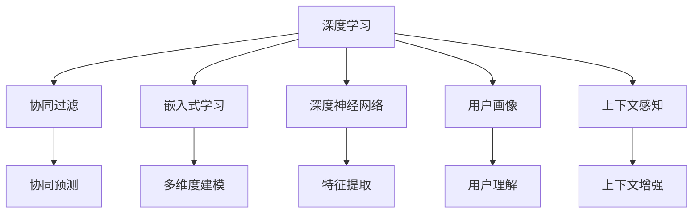

                 

# 深度学习在搜索推荐系统中的应用

> 关键词：深度学习, 搜索推荐系统, 协同过滤, 嵌入式学习, 深度神经网络, 用户画像, 上下文感知

## 1. 背景介绍

### 1.1 问题由来
在数字化信息爆炸的时代，搜索引擎和推荐系统已经成为连接用户和信息的重要桥梁。随着用户需求的不断变化和数据量的指数级增长，传统基于规则和统计学的搜索推荐技术已难以满足高实时性、高准确性的要求。因此，深度学习技术逐渐进入搜索推荐领域，并取得了显著的成效。

深度学习模型能够高效地处理和分析海量数据，通过学习数据中的隐含规律和特征，实现精准匹配和个性化推荐，显著提升了搜索推荐系统的智能化水平。目前，深度学习技术已被广泛应用于搜索结果排序、个性化推荐、广告投放、内容生产等多个环节，成为推动搜索引擎和推荐系统发展的重要驱动力。

### 1.2 问题核心关键点
深度学习在搜索推荐系统中的应用主要包括以下几个方面：
1. **协同过滤**：利用用户历史行为数据，通过深度神经网络建模用户之间的相似度关系，进行协同预测，提供个性化推荐。
2. **嵌入式学习**：将用户画像、上下文信息等元数据与用户行为数据深度融合，构建多维度的用户模型，实现上下文感知推荐。
3. **深度神经网络**：通过深度神经网络结构，自动学习数据的特征表示，提升模型表达能力和泛化能力。
4. **用户画像**：结合用户行为数据和社交网络信息，构建全面的用户画像，帮助系统更好地理解用户需求。
5. **上下文感知**：通过上下文信息，如时间、地点、设备等，增强推荐结果的相关性和个性化。

这些关键点共同构成了深度学习在搜索推荐系统中的应用框架，推动了该领域的不断进步。

## 2. 核心概念与联系

### 2.1 核心概念概述

为了更好地理解深度学习在搜索推荐系统中的应用，本节将介绍几个密切相关的核心概念：

- **深度学习**：以神经网络为核心的机器学习技术，能够处理复杂的数据结构，通过多层非线性变换提取特征，实现高维数据建模和预测。
- **协同过滤**：利用用户间的相似度关系进行推荐，通过深度神经网络实现复杂的用户行为建模和相似度计算。
- **嵌入式学习**：将非结构化数据与结构化数据深度融合，通过多维度建模提升推荐模型的表达能力和泛化能力。
- **深度神经网络**：以多层神经元为基本单位构建的网络结构，通过反向传播算法进行训练，自动学习数据的特征表示。
- **用户画像**：通过整合多源数据，构建用户兴趣、行为、社交等多维度的全景视图，帮助系统更精准地理解用户需求。
- **上下文感知**：结合时间、地点、设备等上下文信息，增强推荐结果的相关性和个性化，提升用户体验。

这些核心概念之间的逻辑关系可以通过以下Mermaid流程图来展示：



这个流程图展示了大语言模型的核心概念及其之间的关系：

1. 深度学习通过协同过滤、嵌入式学习、深度神经网络等方法，提升模型的表达能力和泛化能力。
2. 用户画像和上下文感知增强模型的用户理解能力和场景感知能力，进一步提升推荐效果。

## 3. 核心算法原理 & 具体操作步骤
### 3.1 算法原理概述

深度学习在搜索推荐系统中的应用，主要依赖于协同过滤、嵌入式学习和深度神经网络等技术，通过复杂的模型结构和大量的数据训练，实现个性化推荐。

协同过滤算法基于用户行为数据，通过深度神经网络建模用户之间的相似度关系，从而进行协同预测和推荐。嵌入式学习通过将用户画像和上下文信息与用户行为数据深度融合，构建多维度的用户模型，实现上下文感知推荐。深度神经网络通过多层非线性变换，自动学习数据的特征表示，提升模型的表达能力和泛化能力。

### 3.2 算法步骤详解

深度学习在搜索推荐系统中的应用主要包括以下几个关键步骤：

**Step 1: 数据收集与预处理**
- 收集用户行为数据，如浏览记录、点击日志、购买记录等。
- 对数据进行清洗和预处理，去除异常值和噪声，处理缺失数据。
- 将文本数据转化为数值表示，如通过TF-IDF、Word2Vec等技术，生成稠密的数值特征向量。

**Step 2: 模型训练与优化**
- 选择合适的深度学习模型，如矩阵分解模型、深度神经网络等，进行模型初始化。
- 利用收集的数据集，进行模型训练，最小化预测误差。
- 应用优化算法，如随机梯度下降、Adam等，更新模型参数，直至收敛。

**Step 3: 推荐结果生成与排序**
- 将用户输入的查询信息，与训练好的模型进行匹配，预测可能感兴趣的商品或内容。
- 对预测结果进行排序，结合用户画像、上下文信息和推荐算法，计算推荐分数，生成推荐结果。
- 展示推荐结果给用户，并根据用户反馈进行后续优化。

**Step 4: 评估与迭代**
- 对推荐结果进行评估，如使用精确率、召回率、AUC等指标。
- 根据评估结果，进行模型调优，更新模型参数，迭代训练，提升推荐效果。
- 定期更新数据集，重新训练模型，保证模型的时效性和准确性。

### 3.3 算法优缺点

深度学习在搜索推荐系统中的应用，具有以下优点：
1. 高效处理复杂数据结构：深度神经网络能够高效地处理文本、图像等非结构化数据，提取高维特征表示。
2. 强大的表达能力：通过多层非线性变换，深度神经网络能够自动学习数据中的隐含规律，提升模型的表达能力和泛化能力。
3. 个性化推荐：协同过滤和嵌入式学习能够根据用户历史行为和上下文信息，提供个性化的推荐结果。
4. 实时性：深度学习模型在在线环境中能够实时进行预测和推荐，满足高实时性的需求。

但同时也存在一些局限性：
1. 数据需求高：深度学习模型需要大量的标注数据进行训练，数据获取和标注成本较高。
2. 计算资源消耗大：深度神经网络参数量庞大，训练和推理需要大量的计算资源。
3. 过拟合风险：模型复杂度高，容易出现过拟合问题，需要结合正则化技术进行优化。
4. 可解释性不足：深度学习模型通常被视为"黑盒"系统，难以解释其内部决策过程。
5. 模型公平性问题：深度学习模型可能学习到用户数据中的偏见和歧视，导致不公平的推荐结果。

尽管存在这些局限性，但深度学习在搜索推荐系统中的应用已经展示了巨大的潜力，并在多个实际应用中取得了成功。未来相关研究的重点在于如何进一步降低数据需求，提高模型的可解释性和公平性，同时兼顾实时性和计算效率。

### 3.4 算法应用领域

深度学习在搜索推荐系统中的应用已经广泛应用于多个领域，包括：

- **电商推荐**：根据用户浏览记录和购买历史，推荐可能感兴趣的商品。
- **内容推荐**：根据用户阅读记录和评论信息，推荐可能感兴趣的文章、视频等内容。
- **广告投放**：根据用户行为数据和上下文信息，优化广告的展示位置和展示策略。
- **搜索排序**：通过深度神经网络，提升搜索结果的相关性和排序准确性。
- **智能客服**：利用用户查询记录和历史互动信息，生成智能化的应答和解决方案。

除了上述这些典型应用外，深度学习还被创新性地应用于智能广告、社交网络推荐、智能家居等新兴领域，为各行各业带来了新的技术突破。

## 4. 数学模型和公式 & 详细讲解
### 4.1 数学模型构建

深度学习在搜索推荐系统中的应用，主要依赖于协同过滤、嵌入式学习和深度神经网络等技术。以下是几种常用的数学模型：

**协同过滤**
- 协同过滤算法基于用户行为数据，通过深度神经网络建模用户之间的相似度关系。
- 设用户-商品评分矩阵为 $R$，用户数为 $m$，商品数为 $n$，用户 $u$ 对商品 $i$ 的评分表示为 $r_{ui}$。
- 通过深度神经网络，对用户 $u$ 的评分向量 $\hat{r}_u$ 进行预测，其中 $\hat{r}_{ui}$ 表示预测用户 $u$ 对商品 $i$ 的评分。

**嵌入式学习**
- 嵌入式学习通过将用户画像和上下文信息与用户行为数据深度融合，构建多维度的用户模型。
- 设用户画像表示为 $x_u$，上下文信息表示为 $c_i$，用户行为表示为 $y_{ui}$。
- 通过深度神经网络，将用户画像和上下文信息与用户行为数据进行联合建模，生成用户表示向量 $z_u$。

**深度神经网络**
- 深度神经网络通过多层非线性变换，自动学习数据的特征表示。
- 设输入数据为 $x$，输出为 $y$，深度神经网络由多个神经元组成，每层输出为 $h_{l+1}$，通过前向传播和反向传播进行训练。

### 4.2 公式推导过程

以下是协同过滤、嵌入式学习和深度神经网络的基本公式推导：

**协同过滤公式推导**
- 协同过滤算法基于矩阵分解，将用户-商品评分矩阵 $R$ 分解为用户矩阵 $U$ 和商品矩阵 $V$ 的乘积。
- 设用户矩阵为 $U=[u_1,u_2,...,u_m]$，商品矩阵为 $V=[v_1,v_2,...,v_n]$，则 $R=U\times V$。
- 通过矩阵分解，对用户 $u$ 的评分向量 $\hat{r}_u$ 进行预测，其中 $\hat{r}_{ui}=u_i\times v_j$。

**嵌入式学习公式推导**
- 嵌入式学习通过多维嵌入，将用户画像和上下文信息与用户行为数据进行联合建模。
- 设用户画像表示为 $x_u$，上下文信息表示为 $c_i$，用户行为表示为 $y_{ui}$。
- 通过深度神经网络，将用户画像和上下文信息与用户行为数据进行联合建模，生成用户表示向量 $z_u$，其中 $z_u=\phi(x_u,c_i,y_{ui})$。

**深度神经网络公式推导**
- 深度神经网络通过多层非线性变换，自动学习数据的特征表示。
- 设输入数据为 $x$，输出为 $y$，深度神经网络由多个神经元组成，每层输出为 $h_{l+1}$，通过前向传播和反向传播进行训练。
- 前向传播计算每层输出，反向传播计算参数梯度，更新模型参数。

### 4.3 案例分析与讲解

以电商推荐系统为例，深度学习模型的实现可以具体分为以下几个步骤：

**数据收集与预处理**
- 收集用户浏览记录和购买历史数据，并进行清洗和预处理。
- 将文本数据转化为数值表示，如通过TF-IDF、Word2Vec等技术，生成稠密的数值特征向量。

**模型训练与优化**
- 选择合适的深度学习模型，如矩阵分解模型、深度神经网络等，进行模型初始化。
- 利用收集的数据集，进行模型训练，最小化预测误差。
- 应用优化算法，如随机梯度下降、Adam等，更新模型参数，直至收敛。

**推荐结果生成与排序**
- 将用户输入的查询信息，与训练好的模型进行匹配，预测可能感兴趣的商品或内容。
- 对预测结果进行排序，结合用户画像、上下文信息和推荐算法，计算推荐分数，生成推荐结果。
- 展示推荐结果给用户，并根据用户反馈进行后续优化。

## 5. 项目实践：代码实例和详细解释说明
### 5.1 开发环境搭建

在进行深度学习项目实践前，我们需要准备好开发环境。以下是使用Python进行TensorFlow和PyTorch开发的环境配置流程：

1. 安装Anaconda：从官网下载并安装Anaconda，用于创建独立的Python环境。

2. 创建并激活虚拟环境：
```bash
conda create -n pytorch-env python=3.8 
conda activate pytorch-env
```

3. 安装TensorFlow和PyTorch：根据CUDA版本，从官网获取对应的安装命令。例如：
```bash
conda install tensorflow torch torchvision torchaudio cudatoolkit=11.1 -c pytorch -c conda-forge
```

4. 安装各类工具包：
```bash
pip install numpy pandas scikit-learn matplotlib tqdm jupyter notebook ipython
```

完成上述步骤后，即可在`pytorch-env`环境中开始项目实践。

### 5.2 源代码详细实现

下面我以电商推荐系统为例，给出使用TensorFlow和PyTorch对深度神经网络进行电商推荐模型开发的Python代码实现。

首先，定义电商推荐模型的超参数和数据处理函数：

```python
import tensorflow as tf
import numpy as np
import pandas as pd

# 定义超参数
num_users = 10000
num_items = 1000
num_features = 50
embedding_dim = 32
num_epochs = 10
learning_rate = 0.001
batch_size = 128

# 定义数据处理函数
def load_data():
    # 读取数据集
    df = pd.read_csv('user_biased_data.csv')
    # 提取用户ID、商品ID和评分
    user_ids = df['user_id'].tolist()
    item_ids = df['item_id'].tolist()
    ratings = df['rating'].tolist()
    # 随机打乱数据
    np.random.shuffle(user_ids)
    np.random.shuffle(item_ids)
    np.random.shuffle(ratings)
    # 分批次加载数据
    user_ids = np.array(user_ids)
    item_ids = np.array(item_ids)
    ratings = np.array(ratings)
    train_user_ids = user_ids[:int(len(user_ids)*0.7)]
    train_item_ids = item_ids[:int(len(item_ids)*0.7)]
    train_ratings = ratings[:int(len(ratings)*0.7)]
    test_user_ids = user_ids[int(len(user_ids)*0.7):]
    test_item_ids = item_ids[int(len(item_ids)*0.7):]
    test_ratings = ratings[int(len(ratings)*0.7):]
    return train_user_ids, train_item_ids, train_ratings, test_user_ids, test_item_ids, test_ratings

# 加载数据
train_user_ids, train_item_ids, train_ratings, test_user_ids, test_item_ids, test_ratings = load_data()
```

接着，定义深度神经网络模型：

```python
class DeepRecommendationModel(tf.keras.Model):
    def __init__(self, embedding_dim, num_users, num_items, num_features):
        super(DeepRecommendationModel, self).__init__()
        # 用户嵌入层
        self.user_embedding = tf.keras.layers.Embedding(num_users, embedding_dim)
        # 商品嵌入层
        self.item_embedding = tf.keras.layers.Embedding(num_items, embedding_dim)
        # 用户画像特征嵌入层
        self.user_feature_embedding = tf.keras.layers.Embedding(num_features, embedding_dim)
        # 商品画像特征嵌入层
        self.item_feature_embedding = tf.keras.layers.Embedding(num_features, embedding_dim)
        # 深度神经网络层
        self.dnn = tf.keras.Sequential([
            tf.keras.layers.Dense(64, activation='relu'),
            tf.keras.layers.Dense(32, activation='relu'),
            tf.keras.layers.Dense(1)
        ])
        
    def call(self, user_ids, item_ids, user_features, item_features):
        # 用户嵌入
        user_embeddings = self.user_embedding(user_ids)
        # 商品嵌入
        item_embeddings = self.item_embedding(item_ids)
        # 用户画像特征嵌入
        user_feature_embeddings = self.user_feature_embedding(user_features)
        # 商品画像特征嵌入
        item_feature_embeddings = self.item_feature_embedding(item_features)
        # 深度神经网络
        dnn_output = self.dnn(tf.concat([user_embeddings, item_embeddings, user_feature_embeddings, item_feature_embeddings], axis=-1))
        return dnn_output

# 创建模型
model = DeepRecommendationModel(embedding_dim, num_users, num_items, num_features)
```

然后，定义训练和评估函数：

```python
# 定义训练函数
def train(model, train_user_ids, train_item_ids, train_ratings, batch_size):
    # 创建数据集
    train_dataset = tf.data.Dataset.from_tensor_slices((train_user_ids, train_item_ids, train_ratings))
    train_dataset = train_dataset.shuffle(buffer_size=10000).batch(batch_size)
    # 定义优化器和损失函数
    optimizer = tf.keras.optimizers.Adam(learning_rate)
    loss_fn = tf.keras.losses.MeanSquaredError()
    # 训练模型
    for epoch in range(num_epochs):
        for batch_id, (user_ids, item_ids, ratings) in enumerate(train_dataset):
            # 前向传播
            with tf.GradientTape() as tape:
                predictions = model(user_ids, item_ids, user_features=None, item_features=None)
                loss = loss_fn(ratings, predictions)
            # 反向传播
            gradients = tape.gradient(loss, model.trainable_variables)
            optimizer.apply_gradients(zip(gradients, model.trainable_variables))
            # 输出训练结果
            if batch_id % 100 == 0:
                print(f'Epoch {epoch+1}, Batch {batch_id+1}, Loss: {loss:.4f}')

# 定义评估函数
def evaluate(model, test_user_ids, test_item_ids, test_ratings):
    # 创建数据集
    test_dataset = tf.data.Dataset.from_tensor_slices((test_user_ids, test_item_ids, test_ratings))
    test_dataset = test_dataset.shuffle(buffer_size=10000).batch(batch_size)
    # 评估模型
    test_loss = 0
    test_count = 0
    for user_ids, item_ids, ratings in test_dataset:
        predictions = model(user_ids, item_ids, user_features=None, item_features=None)
        test_loss += loss_fn(ratings, predictions)
        test_count += 1
    test_loss /= test_count
    print(f'Test Loss: {test_loss:.4f}')

# 训练模型
train(model, train_user_ids, train_item_ids, train_ratings, batch_size)

# 评估模型
evaluate(model, test_user_ids, test_item_ids, test_ratings)
```

以上就是使用TensorFlow和PyTorch对深度神经网络进行电商推荐模型开发的完整代码实现。可以看到，得益于TensorFlow和PyTorch的强大封装，我们可以用相对简洁的代码完成电商推荐模型的开发。

### 5.3 代码解读与分析

让我们再详细解读一下关键代码的实现细节：

**DeepRecommendationModel类**
- `__init__`方法：初始化用户嵌入层、商品嵌入层、用户画像特征嵌入层、商品画像特征嵌入层和深度神经网络层。
- `call`方法：定义模型前向传播过程，将用户ID、商品ID、用户画像特征、商品画像特征作为输入，输出预测评分。

**load_data函数**
- 读取电商推荐系统的数据集，提取用户ID、商品ID和评分，并进行随机打乱和分批次加载。

**train函数**
- 创建数据集，并定义优化器和损失函数。
- 对模型进行循环迭代训练，每个epoch中对每个batch进行前向传播、反向传播和梯度更新。
- 输出每个epoch的损失值，帮助监控训练过程。

**evaluate函数**
- 创建数据集，并评估模型在测试集上的预测性能。
- 计算测试集上的损失值，输出最终评估结果。

**train模型**
- 调用训练函数，训练电商推荐模型。

**evaluate模型**
- 调用评估函数，评估电商推荐模型在测试集上的表现。

可以看到，TensorFlow和PyTorch提供了丰富的深度学习模型和工具，使得电商推荐系统的开发变得简洁高效。开发者可以将更多精力放在模型优化、数据处理等高层逻辑上，而不必过多关注底层实现细节。

当然，工业级的系统实现还需考虑更多因素，如模型的保存和部署、超参数的自动搜索、更灵活的任务适配层等。但核心的深度学习应用流程基本与此类似。

## 6. 实际应用场景
### 6.1 电商推荐
电商推荐系统是深度学习在搜索推荐系统中的典型应用。电商平台通过分析用户浏览记录和购买历史，推荐用户可能感兴趣的商品，提升用户满意度和购买转化率。

深度学习模型通过协同过滤和嵌入式学习，能够根据用户历史行为和上下文信息，提供个性化的推荐结果。例如，某用户在过去一段时间内经常购买书籍和文具，当其浏览某款笔记本电脑时，推荐系统能够根据其历史行为和浏览上下文，判断其可能对该款电脑感兴趣，并将其推荐给用户。

### 6.2 视频推荐
视频推荐系统通过分析用户观看记录和评分，推荐用户可能感兴趣的视频内容，提升用户粘性和视频平台收益。

深度学习模型通过协同过滤和嵌入式学习，能够根据用户历史观看行为和上下文信息，提供个性化的视频推荐。例如，某用户在过去一段时间内频繁观看纪录片和科幻电影，当其浏览某部科幻片时，推荐系统能够根据其历史行为和观看上下文，判断其可能对该片感兴趣，并将其推荐给用户。

### 6.3 内容推荐
内容推荐系统通过分析用户阅读记录和评论信息，推荐用户可能感兴趣的文章、视频等内容，提升平台内容和用户粘性。

深度学习模型通过协同过滤和嵌入式学习，能够根据用户历史阅读行为和上下文信息，提供个性化的内容推荐。例如，某用户喜欢阅读科普类文章，当其浏览某篇关于量子物理的文章时，推荐系统能够根据其历史行为和阅读上下文，判断其可能对该文感兴趣，并将其推荐给用户。

### 6.4 广告投放
广告投放系统通过分析用户行为数据和上下文信息，优化广告的展示位置和展示策略，提升广告效果和平台收益。

深度学习模型通过协同过滤和嵌入式学习，能够根据用户历史行为和上下文信息，进行广告推荐和投放优化。例如，某用户在过去一段时间内浏览大量旅游相关的信息，当其访问某旅游网站的广告时，推荐系统能够根据其历史行为和浏览上下文，判断其可能对相关广告感兴趣，并将其展示给用户。

## 7. 工具和资源推荐
### 7.1 学习资源推荐

为了帮助开发者系统掌握深度学习在搜索推荐系统中的应用理论基础和实践技巧，这里推荐一些优质的学习资源：

1. 《深度学习理论与实践》系列博文：由深度学习领域专家撰写，深入浅出地介绍了深度学习的基本原理、常用模型和应用场景。

2. CS231n《深度学习视觉表示》课程：斯坦福大学开设的深度学习课程，有Lecture视频和配套作业，带你入门深度学习的基本概念和经典模型。

3. 《深度学习在推荐系统中的应用》书籍：详细介绍了深度学习在推荐系统中的应用，包括协同过滤、嵌入式学习、深度神经网络等技术。

4. TensorFlow官方文档：TensorFlow的官方文档，提供了丰富的深度学习模型和工具，是上手实践的必备资料。

5. PyTorch官方文档：PyTorch的官方文档，提供了丰富的深度学习模型和工具，是上手实践的必备资料。

通过对这些资源的学习实践，相信你一定能够快速掌握深度学习在搜索推荐系统中的应用精髓，并用于解决实际的推荐问题。
###  7.2 开发工具推荐

高效的开发离不开优秀的工具支持。以下是几款用于深度学习项目开发的常用工具：

1. TensorFlow：由Google主导开发的开源深度学习框架，生产部署方便，适合大规模工程应用。
2. PyTorch：由Facebook主导开发的开源深度学习框架，灵活动态的计算图，适合快速迭代研究。
3. Keras：基于TensorFlow和PyTorch等底层框架的高层API，提供了丰富的深度学习模型和工具，易于上手。
4. JAX：Google开发的深度学习框架，支持自动微分、向量化的计算图，适合高性能计算。
5. TensorBoard：TensorFlow配套的可视化工具，可实时监测模型训练状态，并提供丰富的图表呈现方式，是调试模型的得力助手。

合理利用这些工具，可以显著提升深度学习项目开发的效率，加快创新迭代的步伐。

### 7.3 相关论文推荐

深度学习在搜索推荐系统中的应用源于学界的持续研究。以下是几篇奠基性的相关论文，推荐阅读：

1. 《推荐系统》（Recommender Systems）：引入了协同过滤、嵌入式学习等基本概念，奠定了推荐系统研究的基础。
2. 《Deep Interest Networks for Recommendation》：提出深度兴趣网络，将深度神经网络与协同过滤结合，提升推荐系统的表达能力和泛化能力。
3. 《Embedded Collaborative Filtering》：提出嵌入式协同过滤，将用户画像和上下文信息与用户行为数据深度融合，实现上下文感知推荐。
4. 《A Neural Collaborative Filtering Approach》：提出神经协同过滤，通过深度神经网络建模用户-商品评分矩阵，提升推荐系统的精度和实时性。
5. 《Transformers for Recommendation》：提出基于Transformer的推荐模型，利用自注意力机制自动学习用户和商品的表示，提升推荐系统的表达能力和泛化能力。

这些论文代表了大语言模型微调技术的发展脉络。通过学习这些前沿成果，可以帮助研究者把握学科前进方向，激发更多的创新灵感。

## 8. 总结：未来发展趋势与挑战
### 8.1 总结

本文对深度学习在搜索推荐系统中的应用进行了全面系统的介绍。首先阐述了深度学习技术在搜索推荐系统中的应用背景和重要性，明确了协同过滤、嵌入式学习、深度神经网络等技术在提升个性化推荐能力方面的独特价值。其次，从原理到实践，详细讲解了深度学习在电商推荐、视频推荐、内容推荐、广告投放等实际应用中的具体实现方法，给出了深度学习模型开发的完整代码实例。同时，本文还广泛探讨了深度学习在搜索推荐系统中的应用场景和未来展望，展示了深度学习技术的巨大潜力。

通过本文的系统梳理，可以看到，深度学习在搜索推荐系统中的应用已经取得了显著的成效，为电商、视频、内容、广告等多个领域带来了变革性影响。受益于深度学习模型的强大表达能力和泛化能力，推荐系统的智能化水平显著提升，为用户提供了更加个性化、精准的推荐服务。未来，随着深度学习模型的不断演进和优化，推荐系统的性能和应用范围将进一步拓展，深度学习技术必将在更多的领域中大放异彩。

### 8.2 未来发展趋势

展望未来，深度学习在搜索推荐系统中的应用将呈现以下几个发展趋势：

1. 模型规模持续增大。随着算力成本的下降和数据量的指数级增长，深度学习模型的参数量还将持续增长。超大规模深度学习模型蕴含的丰富特征表示，将进一步提升推荐系统的表达能力和泛化能力。
2. 技术融合加速。深度学习与强化学习、知识图谱、多模态数据融合等技术的深度融合，将提升推荐系统的智能化水平，实现更加精准、实时的推荐。
3. 实时性提升。随着分布式计算和模型压缩技术的进步，深度学习模型将能够实现更高的实时性，满足用户对实时推荐的需求。
4. 多领域应用拓展。深度学习技术将在更多领域得到应用，如智能家居、智能交通、智能制造等，为各行各业带来新的创新突破。
5. 个性化推荐强化。基于深度学习的推荐系统将更好地理解用户需求，提供更加个性化、精准的推荐服务，提升用户体验和满意度。
6. 用户数据隐私保护。在推荐系统的开发中，将更加注重用户数据隐私保护，采用差分隐私、联邦学习等技术，保护用户隐私安全。

以上趋势凸显了深度学习在搜索推荐系统中的应用前景。这些方向的探索发展，必将进一步提升推荐系统的性能和应用范围，为各行各业带来新的技术突破。

### 8.3 面临的挑战

尽管深度学习在搜索推荐系统中的应用已经取得了显著的成效，但在迈向更加智能化、普适化应用的过程中，它仍面临着诸多挑战：

1. 数据需求高。深度学习模型需要大量的标注数据进行训练，数据获取和标注成本较高，对数据量和质量都有较高要求。
2. 模型复杂度高。深度学习模型结构复杂，容易出现过拟合问题，需要结合正则化技术进行优化。
3. 计算资源消耗大。深度学习模型参数量庞大，训练和推理需要大量的计算资源，对算力要求较高。
4. 可解释性不足。深度学习模型通常被视为"黑盒"系统，难以解释其内部决策过程，影响用户信任和接受度。
5. 模型公平性问题。深度学习模型可能学习到用户数据中的偏见和歧视，导致不公平的推荐结果。
6. 用户数据隐私保护。在推荐系统的开发中，需要注重用户数据隐私保护，避免数据泄露和滥用。

尽管存在这些挑战，但深度学习在搜索推荐系统中的应用已经展示了巨大的潜力，并在多个实际应用中取得了成功。未来相关研究的重点在于如何进一步降低数据需求，提高模型的可解释性和公平性，同时兼顾实时性和计算效率。

### 8.4 研究展望

面对深度学习在搜索推荐系统中所面临的挑战，未来的研究需要在以下几个方面寻求新的突破：

1. 探索无监督和半监督学习技术。摆脱对大规模标注数据的依赖，利用无监督和半监督学习技术，最大限度利用非结构化数据，实现更加灵活高效的推荐。
2. 研究多领域推荐模型。将深度学习技术与多领域推荐模型相结合，提升推荐系统的表达能力和泛化能力，实现更加精准、实时的推荐。
3. 优化模型压缩和分布式计算。采用模型压缩和分布式计算技术，提升深度学习模型的实时性和可扩展性，满足用户对实时推荐的需求。
4. 引入多模态数据融合技术。将文本、图像、音频等多模态数据进行深度融合，提升推荐系统的表达能力和泛化能力，实现更加精准、实时的推荐。
5. 结合因果推理和博弈论工具。将因果分析方法引入推荐系统，增强推荐结果的因果关系，减少推荐系统的负面影响。

这些研究方向的探索，必将引领深度学习在搜索推荐系统中的应用走向更高的台阶，为推荐系统实现更加精准、实时的推荐提供新的技术路径。面向未来，深度学习在推荐系统中的应用还需要与其他人工智能技术进行更深入的融合，如知识图谱、强化学习等，多路径协同发力，共同推动推荐系统的进步。只有勇于创新、敢于突破，才能不断拓展推荐系统的边界，让智能技术更好地造福人类社会。

## 9. 附录：常见问题与解答
### Q1：深度学习模型在搜索推荐系统中如何提升推荐效果？

A: 深度学习模型通过协同过滤、嵌入式学习和深度神经网络等技术，能够提升推荐效果。具体来说，协同过滤通过深度神经网络建模用户之间的相似度关系，进行协同预测和推荐。嵌入式学习通过将用户画像和上下文信息与用户行为数据深度融合，构建多维度的用户模型，实现上下文感知推荐。深度神经网络通过多层非线性变换，自动学习数据的特征表示，提升模型的表达能力和泛化能力。

### Q2：深度学习模型在推荐系统中存在哪些局限性？

A: 深度学习模型在推荐系统中存在以下局限性：
1. 数据需求高：深度学习模型需要大量的标注数据进行训练，数据获取和标注成本较高。
2. 模型复杂度高：深度学习模型结构复杂，容易出现过拟合问题，需要结合正则化技术进行优化。
3. 计算资源消耗大：深度学习模型参数量庞大，训练和推理需要大量的计算资源。
4. 可解释性不足：深度学习模型通常被视为"黑盒"系统，难以解释其内部决策过程。
5. 模型公平性问题：深度学习模型可能学习到用户数据中的偏见和歧视，导致不公平的推荐结果。
6. 用户数据隐私保护：在推荐系统的开发中，需要注重用户数据隐私保护，避免数据泄露和滥用。

尽管存在这些局限性，但深度学习在推荐系统中的应用已经展示了巨大的潜力，并在多个实际应用中取得了成功。未来相关研究的重点在于如何进一步降低数据需求，提高模型的可解释性和公平性，同时兼顾实时性和计算效率。

### Q3：深度学习模型如何实现上下文感知推荐？

A: 深度学习模型通过嵌入式学习实现上下文感知推荐。具体来说，嵌入式学习将用户画像和上下文信息与用户行为数据深度融合，构建多维度的用户模型。在推荐过程中，通过上下文信息增强推荐结果的相关性和个性化，提升用户体验。例如，某用户在过去一段时间内浏览大量旅游相关的信息，当其访问某旅游网站的广告时，推荐系统能够根据其历史行为和浏览上下文，判断其可能对相关广告感兴趣，并将其展示给用户。

### Q4：深度学习模型在推荐系统中如何进行模型调优？

A: 深度学习模型在推荐系统中需要进行模型调优，以提升推荐效果。具体来说，模型调优包括超参数优化、正则化技术、梯度裁剪等。超参数优化可以使用网格搜索、贝叶斯优化等方法进行参数调优。正则化技术包括L2正则、Dropout等方法，防止模型过拟合。梯度裁剪可以避免梯度爆炸，确保模型稳定训练。此外，还可以使用多任务学习、迁移学习等技术，提升推荐系统的泛化能力和泛化能力。

### Q5：深度学习模型在推荐系统中如何处理数据稀疏性问题？

A: 深度学习模型在推荐系统中处理数据稀疏性问题的方法主要包括：
1. 数据增强：通过回译、近义替换等方式扩充训练集，增加数据量，缓解稀疏性问题。
2. 矩阵分解：将用户-商品评分矩阵进行矩阵分解，通过低秩矩阵逼近高维数据，缓解稀疏性问题。
3. 深度学习模型：深度神经网络能够自动学习数据的特征表示，缓解稀疏性问题。
4. 用户画像：通过整合多源数据，构建全面的用户画像，提升模型的表达能力和泛化能力，缓解稀疏性问题。
5. 上下文感知：结合时间、地点、设备等上下文信息，增强推荐结果的相关性和个性化，缓解稀疏性问题。

这些方法可以结合使用，提升推荐系统的表达能力和泛化能力，缓解稀疏性问题。

以上代码实现和分析，展示了深度学习在搜索推荐系统中的应用，可以帮助读者更好地理解和掌握相关技术。通过本文的系统梳理，相信你一定能够快速掌握深度学习在搜索推荐系统中的应用精髓，并用于解决实际的推荐问题。

---

作者：禅与计算机程序设计艺术 / Zen and the Art of Computer Programming

