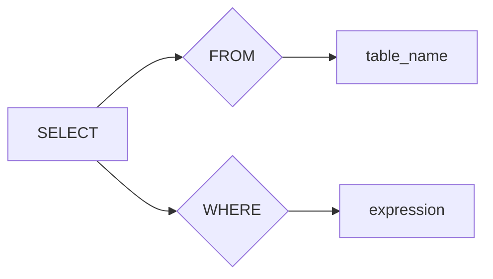

# Presto原理与代码实例讲解

作者：禅与计算机程序设计艺术 / Zen and the Art of Computer Programming

## 1. 背景介绍

### 1.1 问题的由来

在处理大数据查询和实时分析的场景中，性能一直是关键挑战。随着数据量的爆炸式增长，传统的数据库和查询引擎在处理大规模数据集时，面临着延迟高、扩展性差等问题。为了应对这些挑战，Presto应运而生。

Presto是一款开源的高性能分布式查询引擎，它能够处理各种类型的数据源，包括关系数据库、文件存储系统、实时数据流等。Presto的设计目标是提供亚秒级的查询速度，同时保持开放性和可扩展性。

### 1.2 研究现状

Presto自2013年由Facebook开源以来，得到了广泛的关注和应用。目前，Presto已经成为了大数据查询和分析领域的明星产品，被许多大型企业和组织采用，如Netflix、eBay、Salesforce等。

### 1.3 研究意义

Presto的研究意义在于：

1. **高性能**：Presto能够提供亚秒级的查询速度，满足实时数据分析和决策的需求。
2. **兼容性**：Presto支持多种数据源，方便用户集成现有数据系统。
3. **可扩展性**：Presto是基于分布式架构，能够处理大规模数据集。
4. **灵活性**：Presto支持SQL查询，方便用户使用。

### 1.4 本文结构

本文将首先介绍Presto的核心概念和原理，然后通过代码实例讲解如何使用Presto进行数据查询和分析。最后，我们将探讨Presto在实际应用场景中的使用，以及其未来发展趋势和挑战。

## 2. 核心概念与联系

### 2.1 Presto架构

Presto采用分布式架构，主要包括以下几个组件：

1. **协调器(Coordinator)**：负责解析查询语句、分发任务、收集结果等。
2. **执行器(Executors)**：负责执行查询任务，包括数据扫描、计算、聚合等。
3. **驱动器(Driver)**：负责连接协调器和执行器，进行通信。

### 2.2 Presto查询语言

Presto使用SQL作为查询语言，支持大多数标准的SQL语句，如SELECT、JOIN、GROUP BY、ORDER BY等。

### 2.3 Presto连接器

Presto通过连接器连接各种数据源，如关系数据库、文件存储系统、实时数据流等。这些连接器负责将查询语句转换为特定数据源的操作。

## 3. 核心算法原理 & 具体操作步骤

### 3.1 算法原理概述

Presto的核心算法原理如下：

1. **查询解析**：协调器解析查询语句，生成查询计划。
2. **任务分发**：协调器将查询计划分解为多个任务，并将任务分发到执行器。
3. **数据扫描**：执行器根据任务要求，从数据源中扫描数据。
4. **计算与聚合**：执行器对数据进行计算和聚合操作。
5. **结果收集**：执行器将计算结果发送给协调器。
6. **结果返回**：协调器收集所有执行器的结果，并返回最终结果。

### 3.2 算法步骤详解

#### 3.2.1 查询解析

查询解析是Presto的核心环节之一，它将SQL查询语句转换为内部表示。这个过程包括以下步骤：

1. 词法分析：将查询语句分解为单词和符号。
2. 语法分析：分析单词和符号的语法结构，生成语法树。
3. 语义分析：根据语法树，生成查询计划。

#### 3.2.2 任务分发

协调器根据查询计划，将任务分解为多个子任务，并将子任务分发到执行器。这个过程包括以下步骤：

1. 任务拆分：根据查询计划，将任务拆分为多个子任务。
2. 资源分配：为每个子任务分配执行器和资源。
3. 任务分发：将子任务发送到对应的执行器。

#### 3.2.3 数据扫描

执行器根据任务要求，从数据源中扫描数据。这个过程包括以下步骤：

1. 数据定位：根据查询条件，定位到需要扫描的数据。
2. 数据读取：从数据源中读取数据。
3. 数据过滤：根据查询条件，过滤数据。

#### 3.2.4 计算与聚合

执行器对数据进行计算和聚合操作。这个过程包括以下步骤：

1. 计算操作：根据查询语句，对数据进行计算操作，如加减乘除、函数运算等。
2. 聚合操作：对数据进行聚合操作，如求和、平均、最大值等。

#### 3.2.5 结果收集

执行器将计算结果发送给协调器。这个过程包括以下步骤：

1. 结果编码：将计算结果编码为字节流。
2. 结果传输：通过网络将结果传输给协调器。

#### 3.2.6 结果返回

协调器收集所有执行器的结果，并返回最终结果。这个过程包括以下步骤：

1. 结果解码：将字节流解码为计算结果。
2. 结果合并：合并所有执行器的结果。
3. 结果返回：返回最终结果。

### 3.3 算法优缺点

#### 3.3.1 优点

1. **高性能**：Presto能够提供亚秒级的查询速度，满足实时数据分析和决策的需求。
2. **兼容性**：Presto支持多种数据源，方便用户集成现有数据系统。
3. **可扩展性**：Presto是基于分布式架构，能够处理大规模数据集。
4. **灵活性**：Presto支持SQL查询，方便用户使用。

#### 3.3.2 缺点

1. **资源消耗**：Presto在处理大规模数据集时，可能会消耗大量资源，如CPU、内存等。
2. **学习成本**：Presto的使用和学习需要一定的技术背景。

### 3.4 算法应用领域

Presto适用于以下场景：

1. **大数据查询和分析**：Presto能够处理大规模数据集，提供亚秒级的查询速度。
2. **实时数据分析**：Presto支持实时数据源，可以进行实时数据分析和决策。
3. **数据科学和机器学习**：Presto可以与数据科学和机器学习工具集成，用于数据预处理、模型训练和评估等。

## 4. 数学模型和公式 & 详细讲解 & 举例说明

### 4.1 数学模型构建

Presto在查询解析和执行过程中，会涉及一些数学模型和公式。以下是一些常见的数学模型和公式：

#### 4.1.1 SQL查询解析

SQL查询语句通常可以用一棵语法树来表示。以下是一个简单的SELECT语句的语法树示例：



#### 4.1.2 关系运算

关系运算包括笛卡尔积、选择、投影、连接等。以下是一些关系运算的数学公式：

- 笛卡尔积：$\mathcal{R} \times \mathcal{S} = \{(t, s) | t \in \mathcal{R}, s \in \mathcal{S}\}$
- 选择：$\sigma_{\phi}(\mathcal{R}) = \{t | \phi(t) \text{ is true}\}$
- 投影：$\pi_{\alpha}(\mathcal{R}) = \{t_{\alpha} | t \in \mathcal{R}\}$
- 连接：$\sigma_{\phi}(\mathcal{R} \bowtie \mathcal{S}) = \{t | t \in \mathcal{R}, s \in \mathcal{S}, \phi(t, s) \text{ is true}\}$

### 4.2 公式推导过程

以下是一个简单的SQL查询示例，展示公式推导过程：

```sql
SELECT name, age
FROM employees
WHERE department = 'Engineering';
```

首先，我们将查询分解为以下步骤：

1. 选择department为'Engineering'的employees表。
2. 从选出的结果中选择name和age列。

对应的数学公式如下：

$$\pi_{\text{name, age}}(\sigma_{\text{department = 'Engineering'}}(\mathcal{employees}))$$

### 4.3 案例分析与讲解

以下是一个使用Presto进行数据查询的案例：

```sql
SELECT count(*) as num_employees
FROM employees;
```

这个查询的目标是统计employees表中的记录数。

首先，Presto会解析查询语句，生成查询计划。查询计划可能包含以下步骤：

1. 从employees表中扫描数据。
2. 统计记录数。

然后，Presto会根据查询计划，将任务分解为多个子任务，并将子任务分发到执行器。

执行器会从employees表中扫描数据，统计记录数，并将结果返回给协调器。

最后，协调器将所有执行器的结果合并，并返回最终结果。

### 4.4 常见问题解答

以下是一些关于Presto的常见问题解答：

**Q1：Presto与MySQL、PostgreSQL等其他数据库有何区别？**

**A1**：Presto主要用于大数据查询和分析，而MySQL、PostgreSQL等数据库主要用于在线事务处理（OLTP）。Presto支持多种数据源，而MySQL、PostgreSQL等数据库通常只支持关系型数据库。

**Q2：Presto如何实现亚秒级的查询速度？**

**A2**：Presto采用分布式架构，将查询任务分解为多个子任务，并在多个执行器上并行执行。此外，Presto还采用了一些优化技术，如索引、分区、数据压缩等，以提高查询性能。

**Q3：Presto如何连接非关系型数据源？**

**A3**：Presto通过连接器连接非关系型数据源。连接器负责将查询语句转换为特定数据源的操作，并将结果返回给协调器。

## 5. 项目实践：代码实例和详细解释说明

### 5.1 开发环境搭建

1. 安装Presto客户端。

```bash
# 安装Presto客户端
brew install presto
```

2. 配置Presto客户端。

```bash
# 修改Presto配置文件~/.presto/config.properties
coordinator.http.port=28080
http-server.http.port=4200
```

3. 启动Presto客户端。

```bash
# 启动Presto客户端
presto-cli --server http://localhost:28080
```

### 5.2 源代码详细实现

以下是一个简单的Presto查询示例：

```sql
SELECT name, age
FROM employees;
```

这个查询的目标是从employees表中获取name和age列的值。

首先，Presto客户端会将查询语句发送到Presto协调器。

协调器会解析查询语句，生成查询计划。

查询计划可能包含以下步骤：

1. 从employees表中扫描数据。
2. 从扫描结果中选择name和age列。

然后，协调器将查询计划分解为多个子任务，并将子任务分发到执行器。

执行器会从employees表中扫描数据，并将结果返回给协调器。

最后，协调器将所有执行器的结果合并，并返回最终结果。

### 5.3 代码解读与分析

以下是对上述查询代码的解读和分析：

```sql
SELECT name, age
FROM employees;
```

- `SELECT`：表示查询操作。
- `name, age`：表示需要查询的列。
- `FROM employees`：表示查询的表。

这个查询的目标是从employees表中获取name和age列的值。

### 5.4 运行结果展示

假设employees表包含以下数据：

```plaintext
name | age
Alice | 25
Bob | 30
Charlie | 35
```

执行上述查询后，运行结果如下：

```plaintext
name | age
Alice | 25
Bob | 30
Charlie | 35
```

## 6. 实际应用场景

### 6.1 大数据分析

Presto在数据分析领域有着广泛的应用，如：

- 数据仓库查询：Presto可以连接多种数据源，如Hive、Cassandra等，进行数据仓库查询和分析。
- 数据挖掘：Presto可以用于数据挖掘，如聚类、关联规则挖掘等。
- 实时分析：Presto可以连接实时数据源，进行实时数据分析。

### 6.2 机器学习

Presto可以与机器学习工具集成，用于：

- 数据预处理：Presto可以用于数据预处理，如数据清洗、特征工程等。
- 模型训练：Presto可以用于模型训练，如梯度下降、随机梯度下降等。
- 模型评估：Presto可以用于模型评估，如AUC、ROC、准确率等。

### 6.3 金融分析

Presto在金融分析领域也有着广泛的应用，如：

- 市场分析：Presto可以用于市场分析，如股票价格分析、交易分析等。
- 风险管理：Presto可以用于风险管理，如信用风险评估、市场风险分析等。
- 量化交易：Presto可以用于量化交易，如策略研究、交易执行等。

## 7. 工具和资源推荐

### 7.1 学习资源推荐

1. **Presto官网**: [https://prestodb.io/](https://prestodb.io/)
2. **Presto GitHub**: [https://github.com/prestodb/presto](https://github.com/prestodb/presto)
3. **《Presto性能优化》**: 作者：Presto团队

### 7.2 开发工具推荐

1. **Presto客户端**: [https://prestodb.io/downloads.html](https://prestodb.io/downloads.html)
2. **JDBC驱动**: [https://github.com/prestodb/presto-jdbc](https://github.com/prestodb/presto-jdbc)

### 7.3 相关论文推荐

1. **Presto: The Open-Source, Distributed SQL Query Engine for Big Data**: 作者：Presto团队
2. **Presto on Apache Hadoop for Interactive Analysis of Big Data**: 作者：Presto团队

### 7.4 其他资源推荐

1. **Presto社区**: [https://prestodb.io/community.html](https://prestodb.io/community.html)
2. **Presto博客**: [https://prestodb.io/blog.html](https://prestodb.io/blog.html)

## 8. 总结：未来发展趋势与挑战

Presto作为一款高性能分布式查询引擎，已经在大数据查询和分析领域取得了巨大的成功。未来，Presto将朝着以下几个方向发展：

1. **多模态数据支持**：Presto将支持更多类型的数据源，如非关系型数据库、实时数据流等。
2. **机器学习集成**：Presto将更好地与机器学习工具集成，提供更丰富的数据处理和分析功能。
3. **性能优化**：Presto将继续优化其性能，提供更快的查询速度。
4. **社区发展**：Presto将继续发展社区，吸引更多开发者参与。

然而，Presto也面临着一些挑战，如：

1. **资源消耗**：Presto在处理大规模数据集时，可能会消耗大量资源。
2. **学习成本**：Presto的使用和学习需要一定的技术背景。
3. **安全性**：Presto需要加强安全性，以保护用户数据安全。

总之，Presto将继续发展壮大，成为大数据查询和分析领域的重要工具。

## 9. 附录：常见问题与解答

### 9.1 什么是Presto？

Presto是一款高性能分布式查询引擎，它能够处理各种类型的数据源，包括关系数据库、文件存储系统、实时数据流等。Presto的设计目标是提供亚秒级的查询速度，同时保持开放性和可扩展性。

### 9.2 Presto与Hive有什么区别？

Hive是一个数据仓库工具，它将SQL查询转换为MapReduce作业，然后运行在Hadoop集群上。Presto则是一款高性能分布式查询引擎，它能够提供亚秒级的查询速度，同时支持多种数据源。

### 9.3 如何在Presto中连接MySQL数据库？

在Presto中连接MySQL数据库，需要使用MySQL连接器。首先，需要在Presto配置文件中添加MySQL连接器的配置信息，然后执行以下命令：

```sql
CREATE CONNECTOR "mysql" TYPE "mysql" VERSION "8.0"
WITH Properties (
  "host" = "localhost",
  "port" = "3306",
  "database" = "mydatabase",
  "user" = "myuser",
  "password" = "mypassword"
);
```

然后，可以使用以下SQL语句查询MySQL数据库：

```sql
SELECT * FROM mysql.mydatabase.mytable;
```

### 9.4 如何优化Presto的性能？

优化Presto的性能可以从以下几个方面入手：

1. **优化查询语句**：优化查询语句，减少数据扫描量，提高查询效率。
2. **优化数据存储**：优化数据存储，如使用索引、分区、数据压缩等，提高数据访问速度。
3. **优化配置**：优化Presto的配置，如调整内存分配、线程数等，提高系统性能。
4. **使用缓存**：使用缓存技术，如Redis、Memcached等，提高查询效率。

### 9.5 Presto如何与其他大数据工具集成？

Presto可以与多种大数据工具集成，如Hadoop、Spark、Kafka等。以下是一些常见的集成方式：

1. **通过Hadoop YARN集群运行**：Presto可以与Hadoop YARN集群集成，利用YARN的调度和资源管理功能。
2. **通过Apache Spark集群运行**：Presto可以与Apache Spark集群集成，实现数据共享和协同处理。
3. **通过Apache Kafka数据流平台集成**：Presto可以与Apache Kafka数据流平台集成，实现实时数据处理和分析。

通过以上集成方式，Presto可以与其他大数据工具协同工作，实现更强大的数据处理和分析能力。