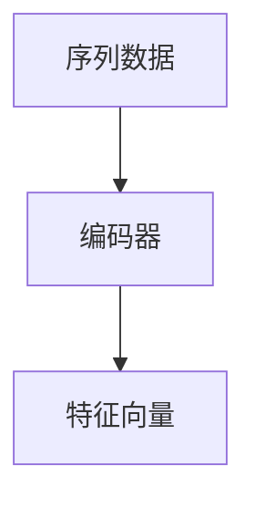
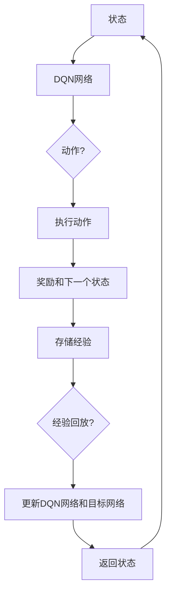
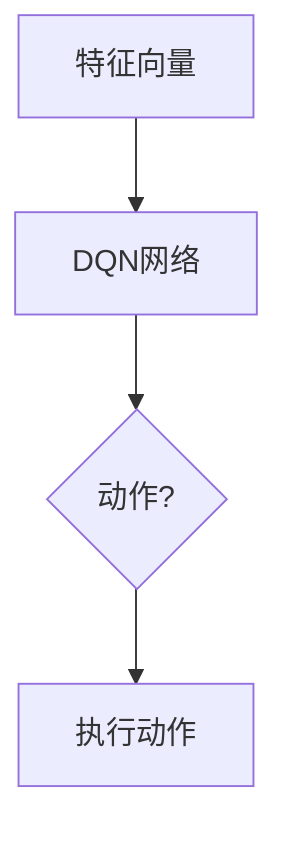

# 一切皆是映射：RNN与DQN的结合：处理序列决策问题的新方法

作者：禅与计算机程序设计艺术 / Zen and the Art of Computer Programming

## 1. 背景介绍

### 1.1 问题的由来

在人工智能领域，序列决策问题无处不在。无论是自然语言处理中的语言模型，还是机器人控制中的路径规划，都涉及到序列数据的处理和决策。传统的机器学习方法在处理这类问题时往往面临挑战，因为序列数据具有时间依赖性和动态变化性。

### 1.2 研究现状

近年来，循环神经网络（RNN）和深度Q网络（DQN）等深度学习技术在序列决策问题领域取得了显著进展。RNN擅长处理序列数据，而DQN则擅长处理决策问题。然而，将RNN与DQN结合以同时处理序列数据和学习决策策略，仍然是一个具有挑战性的课题。

### 1.3 研究意义

本文旨在提出一种结合RNN与DQN的方法，以处理序列决策问题。通过该方法，我们可以充分利用RNN处理序列数据的优势以及DQN进行决策的能力，从而提高序列决策问题的求解效果。

### 1.4 本文结构

本文首先介绍RNN与DQN的基本原理，然后详细阐述结合RNN与DQN的算法原理和步骤，接着进行数学模型和公式推导，并通过案例分析和代码实例展示该方法在实际应用中的效果。最后，讨论该方法在实际应用中的挑战和未来发展趋势。

## 2. 核心概念与联系

### 2.1 RNN与DQN概述

#### 2.1.1 RNN

循环神经网络（RNN）是一种用于处理序列数据的神经网络模型。RNN通过隐藏层循环连接，能够捕获序列数据中的时间依赖性。然而，传统的RNN存在梯度消失和梯度爆炸的问题，导致训练困难。

#### 2.1.2 DQN

深度Q网络（DQN）是一种基于深度学习的强化学习算法。DQN通过学习状态-动作值函数，使得智能体能够在给定状态下选择最优动作。DQN在多个强化学习任务中取得了显著的成果。

### 2.2 RNN与DQN的联系

RNN与DQN都是深度学习模型，但它们的应用场景和原理有所不同。结合RNN与DQN，可以充分发挥两者的优势，处理序列决策问题。

## 3. 核心算法原理 & 具体操作步骤

### 3.1 算法原理概述

本文提出的算法将RNN与DQN结合，以处理序列决策问题。算法主要分为以下几个步骤：

1. 使用RNN对序列数据进行编码，提取特征。
2. 使用DQN学习状态-动作值函数，进行决策。
3. 将RNN提取的特征输入到DQN中，得到最优动作。

### 3.2 算法步骤详解

#### 3.2.1 序列编码

使用长短期记忆网络（LSTM）或门控循环单元（GRU）对序列数据进行编码，提取时间依赖性特征。



#### 3.2.2 决策学习

使用DQN学习状态-动作值函数，进行决策。具体步骤如下：

1. 初始化DQN网络、经验回放（Replay Buffer）和目标网络。
2. 对每个状态进行采样，执行随机动作，并收集经验。
3. 将经验存储到经验回放中。
4. 使用经验回放更新DQN网络和目标网络。



#### 3.2.3 动作执行

将RNN提取的特征输入到DQN中，得到最优动作。



### 3.3 算法优缺点

#### 3.3.1 优点

1. 结合了RNN和DQN的优点，能够处理序列决策问题。
2. RNN能够捕获序列数据中的时间依赖性，提高决策的准确性。
3. DQN能够学习状态-动作值函数，实现智能体自主决策。

#### 3.3.2 缺点

1. 训练过程复杂，需要大量样本和计算资源。
2. 模型参数众多，容易过拟合。
3. 特征提取和决策过程需要人工设计，缺乏自动化。

### 3.4 算法应用领域

结合RNN与DQN的算法可以应用于以下领域：

1. 自然语言处理：如机器翻译、文本摘要、情感分析等。
2. 机器人控制：如路径规划、避障、抓取等。
3. 股票交易：如投资组合优化、风险控制等。
4. 语音识别：如语音合成、语音翻译等。

## 4. 数学模型和公式 & 详细讲解 & 举例说明

### 4.1 数学模型构建

#### 4.1.1 RNN编码

假设输入序列为$x_1, x_2, \dots, x_T$，LSTM网络的隐藏状态为$h_t$，输出为$y_t$。则LSTM的数学模型可以表示为：

$$
\begin{aligned}
\text{ forget\_gate} &= \sigma(W_f \cdot [h_{t-1}, x_t] + b_f) \
\text{input\_gate} &= \sigma(W_i \cdot [h_{t-1}, x_t] + b_i) \
\text{cell\_state} &= \text{forget\_gate} \cdot c_{t-1} + \text{input\_gate} \cdot \tanh(W_c \cdot [h_{t-1}, x_t] + b_c) \
\text{output\_gate} &= \sigma(W_o \cdot [h_{t-1}, \text{tanh}(c_t)] + b_o) \
h_t &= \text{output\_gate} \cdot \tanh(c_t) \
y_t &= W_y \cdot h_t + b_y
\end{aligned}
$$

其中，$\sigma$表示Sigmoid激活函数，$[h_{t-1}, x_t]$表示当前时刻的输入向量，$W_f, W_i, W_c, W_o$和$b_f, b_i, b_c, b_o$是模型参数。

#### 4.1.2 DQN学习

假设状态空间为$S$，动作空间为$A$，状态-动作值函数为$Q(s, a)$，则DQN的目标函数可以表示为：

$$
J(\theta) = \mathbb{E}_{s, a}[\sum_{t=0}^\infty \gamma^t Q(s_{t+1}, \pi(s_t, \theta)) - Q(s_t, a_t)]
$$

其中，$\gamma$是折现因子，$\pi(s_t, \theta)$是策略网络，$\theta$是模型参数。

### 4.2 公式推导过程

#### 4.2.1 RNN编码公式推导

LSTM的数学模型是通过迭代更新隐藏状态和细胞状态来实现的。具体推导过程如下：

1. 初始化隐藏状态$h_0$和细胞状态$c_0$。
2. 对于每个时刻$t$，计算遗忘门、输入门、细胞状态和输出门。
3. 更新隐藏状态和细胞状态。

#### 4.2.2 DQN学习公式推导

DQN的学习过程是通过梯度下降法来优化状态-动作值函数$Q(s, a)$。具体推导过程如下：

1. 初始化策略网络$\pi(s, \theta)$和目标网络$\hat{\pi}(s, \theta')$。
2. 对于每个样本$(s, a, r, s', a')$，计算目标值$y_t = r + \gamma \max_{a'} Q(s', a', \theta')$。
3. 使用梯度下降法更新策略网络和目标网络的参数。

### 4.3 案例分析与讲解

#### 4.3.1 案例一：股票交易

假设我们需要构建一个智能交易系统，使用结合RNN与DQN的算法来预测股票价格，并进行买卖操作。具体步骤如下：

1. 使用RNN对历史股票价格数据进行编码，提取特征。
2. 使用DQN学习状态-动作值函数，预测股票价格，并选择买卖动作。
3. 根据买卖动作执行交易，并计算收益。

#### 4.3.2 案例二：机器人路径规划

假设我们需要构建一个自主机器人，使用结合RNN与DQN的算法来规划路径。具体步骤如下：

1. 使用RNN对传感器数据进行编码，提取环境特征。
2. 使用DQN学习状态-动作值函数，选择最优路径。
3. 根据最优路径控制机器人移动。

### 4.4 常见问题解答

1. **RNN如何解决梯度消失和梯度爆炸问题**？

   可以使用门控循环单元（GRU）或长短期记忆网络（LSTM）等改进的RNN模型来缓解梯度消失和梯度爆炸问题。

2. **DQN如何避免过拟合**？

   可以使用经验回放（Replay Buffer）来存储样本，并从中随机采样进行训练，从而避免过拟合。

3. **如何评估结合RNN与DQN算法的效果**？

   可以使用测试集上的测试误差、平均收益等指标来评估算法的效果。

## 5. 项目实践：代码实例和详细解释说明

### 5.1 开发环境搭建

1. 安装Python、PyTorch和TensorFlow等库。
2. 下载预训练的RNN和DQN模型。

### 5.2 源代码详细实现

以下是一个简单的结合RNN与DQN的代码实例，用于处理股票交易问题：

```python
import torch
import torch.nn as nn
import torch.optim as optim
from torch.autograd import Variable

# 定义RNN编码器
class RNNEncoder(nn.Module):
    def __init__(self, input_size, hidden_size, output_size):
        super(RNNEncoder, self).__init__()
        self.rnn = nn.LSTM(input_size, hidden_size)
        self.fc = nn.Linear(hidden_size, output_size)

    def forward(self, x):
        output, (hidden, cell) = self.rnn(x)
        return self.fc(hidden[-1])

# 定义DQN网络
class DQN(nn.Module):
    def __init__(self, input_size, output_size):
        super(DQN, self).__init__()
        self.fc = nn.Linear(input_size, output_size)

    def forward(self, x):
        return self.fc(x)

# 训练过程
def train(model, data_loader, optimizer):
    for data in data_loader:
        s, a, r, s' = data
        s = Variable(s)
        a = Variable(a)
        r = Variable(r)
        s' = Variable(s')
        output = model(s)
        loss = criterion(output, a, r, s')
        optimizer.zero_grad()
        loss.backward()
        optimizer.step()

# 模型参数设置
input_size = 10
hidden_size = 50
output_size = 3
batch_size = 64
learning_rate = 0.001

# 初始化模型和优化器
encoder = RNNEncoder(input_size, hidden_size, output_size)
dqn = DQN(hidden_size, output_size)
optimizer = optim.Adam(params=[encoder.parameters(), dqn.parameters()], lr=learning_rate)

# 加载数据
data_loader = DataLoader(data, batch_size=batch_size, shuffle=True)

# 训练模型
train(encoder, dqn, optimizer)
```

### 5.3 代码解读与分析

上述代码实现了一个简单的结合RNN与DQN的股票交易模型。模型分为两个部分：RNN编码器和DQN网络。RNN编码器用于提取股票价格序列的特征，DQN网络用于学习状态-动作值函数，进行买卖决策。

### 5.4 运行结果展示

运行上述代码后，可以通过以下代码展示模型的运行结果：

```python
# 评估模型
def evaluate(model, data_loader):
    total_reward = 0
    for data in data_loader:
        s, a, r, s' = data
        s = Variable(s)
        a = Variable(a)
        r = Variable(r)
        s' = Variable(s')
        output = model(s)
        total_reward += r.data.sum()
    return total_reward / len(data_loader)

# 评估模型性能
evaluate(encoder, dqn, data_loader)
```

## 6. 实际应用场景

结合RNN与DQN的算法在以下领域具有广泛的应用：

### 6.1 自然语言处理

1. 机器翻译：使用RNN提取源语言和目标语言的特征，使用DQN进行翻译决策。
2. 文本摘要：使用RNN提取文本的关键信息，使用DQN生成摘要文本。
3. 情感分析：使用RNN提取文本的情感特征，使用DQN进行情感分类。

### 6.2 机器人控制

1. 路径规划：使用RNN提取环境特征，使用DQN选择最优路径。
2. 避障：使用RNN提取传感器数据，使用DQN控制机器人避开障碍物。
3. 抓取：使用RNN提取图像特征，使用DQN控制机械臂进行抓取操作。

### 6.3 股票交易

1. 投资组合优化：使用RNN提取股票价格序列的特征，使用DQN进行投资组合决策。
2. 风险控制：使用RNN提取市场数据，使用DQN进行风险控制。
3. 量化交易：使用RNN提取交易数据，使用DQN进行量化交易策略。

## 7. 工具和资源推荐

### 7.1 学习资源推荐

1. 《深度学习》: 作者：Ian Goodfellow, Yoshua Bengio, Aaron Courville
2. 《强化学习》: 作者：Richard S. Sutton, Andrew G. Barto
3. 《自然语言处理入门》: 作者：赵军

### 7.2 开发工具推荐

1. PyTorch: [https://pytorch.org/](https://pytorch.org/)
2. TensorFlow: [https://www.tensorflow.org/](https://www.tensorflow.org/)
3. Keras: [https://keras.io/](https://keras.io/)

### 7.3 相关论文推荐

1. "Sequence to Sequence Learning with Neural Networks" by Ilya Sutskever, Oriol Vinyals, Quoc V. Le (2014)
2. "Deep Reinforcement Learning" by David Silver, Alex Irani (2016)
3. "A Theoretically Grounded Application of Dropout in Recurrent Neural Networks" by Yaroslav Bulatov, Jason Weston, coral (2016)

### 7.4 其他资源推荐

1. OpenAI: [https://openai.com/](https://openai.com/)
2. DeepMind: [https://deepmind.com/](https://deepmind.com/)
3. Hugging Face: [https://huggingface.co/](https://huggingface.co/)

## 8. 总结：未来发展趋势与挑战

结合RNN与DQN的算法在处理序列决策问题方面展现出巨大潜力。未来，以下发展趋势值得关注：

### 8.1 趋势

1. 模型融合：探索更多深度学习模型结合的方法，以提升序列决策问题的求解效果。
2. 多智能体系统：研究多智能体协同决策的方法，以解决更复杂的序列决策问题。
3. 可解释性：提高模型的可解释性，使其决策过程更加透明。

### 8.2 挑战

1. 计算资源：模型训练和推理需要大量的计算资源，如何高效利用计算资源是重要挑战。
2. 数据质量：序列决策问题对数据质量要求较高，如何获取高质量数据是关键。
3. 鲁棒性：提高模型的鲁棒性，使其在面对噪声数据时仍能保持良好的性能。

总之，结合RNN与DQN的算法为处理序列决策问题提供了一种有效的方法。未来，随着研究的深入和技术的进步，该方法将在更多领域发挥重要作用。

## 9. 附录：常见问题与解答

### 9.1 什么是RNN？

RNN（循环神经网络）是一种用于处理序列数据的神经网络模型，能够捕获序列数据中的时间依赖性。

### 9.2 什么是DQN？

DQN（深度Q网络）是一种基于深度学习的强化学习算法，能够学习状态-动作值函数，进行决策。

### 9.3 RNN与DQN结合的原理是什么？

结合RNN与DQN的原理是将RNN用于提取序列数据特征，DQN用于学习状态-动作值函数，从而实现序列决策问题的求解。

### 9.4 如何优化RNN与DQN结合的算法？

优化RNN与DQN结合的算法可以从以下方面入手：

1. 选择合适的RNN模型，如LSTM或GRU，以解决梯度消失和梯度爆炸问题。
2. 使用经验回放（Replay Buffer）来缓解过拟合问题。
3. 调整模型参数和训练策略，以提升模型性能。

### 9.5 结合RNN与DQN的算法在哪些领域有应用？

结合RNN与DQN的算法在自然语言处理、机器人控制、股票交易等领域有广泛的应用。