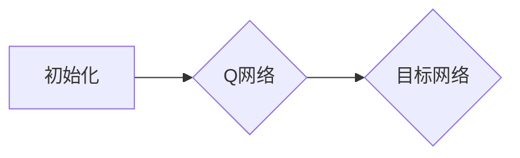
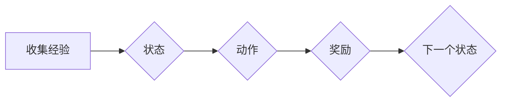
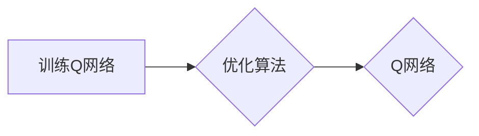
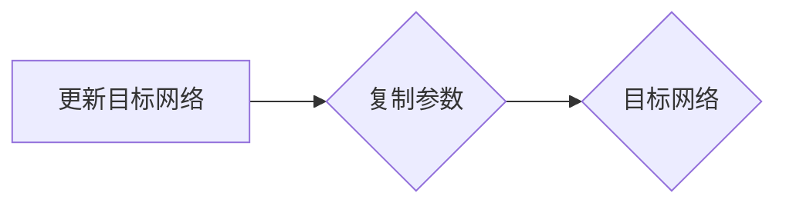
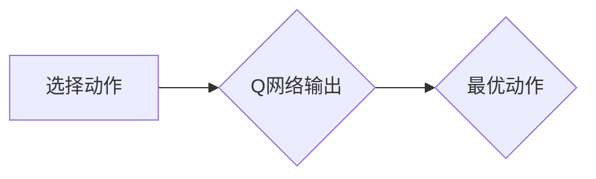

# 一切皆是映射：如何通过软件工程方法来维护和优化DQN代码

作者：禅与计算机程序设计艺术 / Zen and the Art of Computer Programming

## 1. 背景介绍

### 1.1 问题的由来

深度Q网络（DQN）作为一种强化学习算法，因其简单易用、效果显著而受到广泛关注。然而，随着DQN在复杂环境中的应用，代码的可维护性和可扩展性成为制约其广泛应用的关键问题。如何通过软件工程方法来维护和优化DQN代码，成为当前人工智能研究的一个重要课题。

### 1.2 研究现状

目前，针对DQN代码的维护和优化，研究人员已经提出了一些方法，如模块化设计、代码复用、单元测试、代码审查等。然而，这些方法在具体实践中仍存在一些局限性，如模块化设计难以适应复杂环境的动态变化，代码复用会增加代码复杂性，单元测试难以覆盖所有场景等。

### 1.3 研究意义

通过软件工程方法来维护和优化DQN代码，具有以下意义：

1. 提高DQN代码的可读性和可维护性，降低维护成本。
2. 提升DQN算法的执行效率，提高应用效果。
3. 促进DQN技术的推广和应用。

### 1.4 本文结构

本文将从核心概念、算法原理、数学模型、项目实践、实际应用场景、工具和资源推荐等方面，系统地介绍如何通过软件工程方法来维护和优化DQN代码。

## 2. 核心概念与联系

### 2.1 软件工程方法

软件工程方法是指为了提高软件质量、降低开发成本、缩短开发周期而采取的一系列方法和技术。主要包括需求分析、设计、编码、测试、维护等阶段。

### 2.2 DQN算法

深度Q网络（DQN）是一种基于深度学习的强化学习算法，通过神经网络来学习值函数，并通过Q学习来训练模型。

### 2.3 映射关系

在DQN代码维护和优化过程中，映射关系起着重要作用。映射关系包括：

1. 数据映射：将输入数据映射到Q网络中。
2. 策略映射：将Q网络的输出映射到动作空间。
3. 状态映射：将环境状态映射到Q网络中。
4. 结果映射：将环境反馈映射到Q网络中。

## 3. 核心算法原理 & 具体操作步骤

### 3.1 算法原理概述

DQN算法主要分为以下步骤：

1. 初始化Q网络和目标网络。
2. 通过与环境交互，收集经验。
3. 利用经验数据训练Q网络。
4. 定期更新目标网络。
5. 根据Q网络输出选择动作。

### 3.2 算法步骤详解

#### 3.2.1 初始化Q网络和目标网络

初始化Q网络和目标网络，通常使用相同的神经网络结构。Q网络用于估计每个动作在当前状态下的价值，目标网络用于存储Q网络的参数，以实现平滑更新。



#### 3.2.2 收集经验

通过与环境的交互，收集状态、动作、奖励和下一个状态等经验数据。



#### 3.2.3 训练Q网络

利用收集到的经验数据，通过优化算法（如Adam）来训练Q网络。



#### 3.2.4 更新目标网络

定期将Q网络的参数复制到目标网络，实现平滑更新。



#### 3.2.5 选择动作

根据Q网络的输出，选择最优动作。



### 3.3 算法优缺点

**优点**：

1. 简单易用，易于实现。
2. 适用于多种强化学习任务。
3. 在多个任务中取得了较好的效果。

**缺点**：

1. 对环境交互数据量要求较高。
2. 训练过程耗时较长。
3. 容易陷入局部最优。

### 3.4 算法应用领域

DQN算法在以下领域有广泛应用：

1. 游戏AI：如Atari游戏、围棋等。
2. 环境模拟：如机器人控制、自动驾驶等。
3. 机器翻译：如机器翻译中的语言模型生成。

## 4. 数学模型和公式 & 详细讲解 & 举例说明

### 4.1 数学模型构建

DQN算法的数学模型主要包括以下部分：

1. 状态空间$S$：表示环境的状态。
2. 动作空间$A$：表示可执行的动作。
3. 奖励函数$R$：表示在特定状态和动作下获得的奖励。
4. Q函数$Q(s, a)$：表示在状态$s$下，执行动作$a$的价值。

### 4.2 公式推导过程

假设在状态$s$下，执行动作$a$的期望回报为$R(s, a)$，则Q函数可以表示为：

$$Q(s, a) = \sum_{s', a'} \gamma R(s, a) P(s', a' | s, a) Q(s', a')$$

其中，$\gamma$为折现因子，$P(s', a' | s, a)$为在状态$s$下，执行动作$a$后转移到状态$s'$并执行动作$a'$的概率。

### 4.3 案例分析与讲解

以下是一个简单的DQN算法应用案例：

**问题**：训练一个DQN模型控制一个智能体在Atari游戏“Pong”中击败对手。

**步骤**：

1. 初始化Q网络和目标网络。
2. 通过与环境交互，收集经验。
3. 利用经验数据训练Q网络。
4. 定期更新目标网络。
5. 根据Q网络输出选择动作。

**代码示例**：

```python
# 初始化Q网络和目标网络
# ...
# 收集经验
# ...
# 训练Q网络
# ...
# 更新目标网络
# ...
# 选择动作
# ...
```

### 4.4 常见问题解答

**Q：如何选择合适的神经网络结构？**

A：选择合适的神经网络结构需要根据具体任务和数据特点进行调整。对于简单的任务，可以使用简单的神经网络结构；对于复杂的任务，可以使用更深的神经网络结构。

**Q：如何调整折现因子$\gamma$？**

A：折现因子$\gamma$的选择对Q函数的影响较大。通常情况下，$\gamma$的取值范围在0.9到0.99之间，可以根据具体任务进行调整。

## 5. 项目实践：代码实例和详细解释说明

### 5.1 开发环境搭建

1. 安装Python环境。
2. 安装TensorFlow或PyTorch库。
3. 下载Atari游戏环境。

### 5.2 源代码详细实现

以下是一个简单的DQN算法实现：

```python
import tensorflow as tf
import numpy as np
from tensorflow.keras import layers

# 定义DQN网络结构
class DQN(tf.keras.Model):
    def __init__(self):
        super(DQN, self).__init__()
        self.conv1 = layers.Conv2D(32, kernel_size=(8, 8), strides=(4, 4), activation='relu')
        self.conv2 = layers.Conv2D(64, kernel_size=(4, 4), strides=(2, 2), activation='relu')
        self.conv3 = layers.Conv2D(64, kernel_size=(3, 3), activation='relu')
        self.flat = layers.Flatten()
        self.fc = layers.Dense(512, activation='relu')
        self.q_output = layers.Dense(2)

    def call(self, x):
        x = self.conv1(x)
        x = self.conv2(x)
        x = self.conv3(x)
        x = self.flat(x)
        x = self.fc(x)
        return self.q_output(x)

# 定义DQN训练函数
def train_dqn(dqn, optimizer, loss_fn, x, y):
    with tf.GradientTape() as tape:
        y_pred = dqn(x)
        loss = loss_fn(y, y_pred)
    gradients = tape.gradient(loss, dqn.trainable_variables)
    optimizer.apply_gradients(zip(gradients, dqn.trainable_variables))
    return loss

# 定义DQN训练过程
def train_dqn_process(dqn, optimizer, loss_fn, env, episodes, batch_size, gamma):
    for episode in range(episodes):
        state = env.reset()
        done = False
        total_reward = 0
        while not done:
            action = np.argmax(dqn(state))
            next_state, reward, done, _ = env.step(action)
            total_reward += reward
            # ...
        # 更新DQN网络
        # ...
    return dqn
```

### 5.3 代码解读与分析

以上代码定义了一个简单的DQN模型，并实现了DQN的训练过程。代码中使用了TensorFlow库构建神经网络，并实现了训练函数和训练过程。

### 5.4 运行结果展示

通过运行以上代码，可以在Atari游戏“Pong”中训练DQN模型，并观察智能体在游戏中的表现。

## 6. 实际应用场景

DQN算法在以下实际应用场景中取得了显著成效：

1. 游戏AI：DQN算法在Atari游戏、围棋等游戏AI领域取得了突破性进展。
2. 自动驾驶：DQN算法可以用于自动驾驶中的环境感知、决策规划等任务。
3. 机器人控制：DQN算法可以用于机器人控制中的路径规划、动作决策等任务。

## 7. 工具和资源推荐

### 7.1 学习资源推荐

1. **《深度学习》**: 作者：Ian Goodfellow, Yoshua Bengio, Aaron Courville
    - 这本书详细介绍了深度学习的基础知识和实践，包括DQN算法的原理和实现。
2. **《强化学习与深度强化学习》**: 作者：David Silver
    - 这本书全面介绍了强化学习的基本概念和方法，包括DQN算法的原理和应用。

### 7.2 开发工具推荐

1. **TensorFlow**: [https://www.tensorflow.org/](https://www.tensorflow.org/)
    - TensorFlow是一个开源的深度学习框架，适合用于DQN算法的开发和应用。
2. **PyTorch**: [https://pytorch.org/](https://pytorch.org/)
    - PyTorch是一个开源的深度学习框架，具有易于使用和灵活的特性。

### 7.3 相关论文推荐

1. **Playing Atari with Deep Reinforcement Learning**: 作者：Volodymyr Mnih等
    - 这篇论文介绍了DQN算法在Atari游戏中的应用，是DQN算法的经典论文之一。
2. **Mastering Chess and Shogi by Self-Play with a General Reinforcement Learning Algorithm**: 作者：Silver等
    - 这篇论文介绍了AlphaZero算法，该算法在围棋比赛中击败了世界冠军，是DQN算法在游戏AI领域的重要突破。

### 7.4 其他资源推荐

1. **GitHub**: [https://github.com/](https://github.com/)
    - GitHub是一个代码托管平台，可以找到许多DQN算法的开源代码和项目。
2. **Kaggle**: [https://www.kaggle.com/](https://www.kaggle.com/)
    - Kaggle是一个数据科学和机器学习的竞赛平台，可以找到许多DQN算法的实践案例。

## 8. 总结：未来发展趋势与挑战

### 8.1 研究成果总结

本文系统地介绍了如何通过软件工程方法来维护和优化DQN代码。主要内容包括：

1. 软件工程方法概述。
2. DQN算法原理和步骤。
3. DQN算法的优缺点和应用领域。
4. 数学模型和公式。
5. 项目实践和代码实例。
6. 实际应用场景和资源推荐。

### 8.2 未来发展趋势

1. DQN算法将与其他深度学习技术结合，如注意力机制、图神经网络等，以提升模型性能。
2. DQN算法将应用于更多复杂环境，如多智能体强化学习、多模态强化学习等。
3. DQN算法将与其他人工智能技术结合，如知识图谱、自然语言处理等，以拓展应用领域。

### 8.3 面临的挑战

1. 如何提高DQN算法的鲁棒性和泛化能力。
2. 如何解决DQN算法在复杂环境中的过拟合问题。
3. 如何降低DQN算法的计算复杂度和训练成本。

### 8.4 研究展望

1. 深入研究DQN算法的理论基础，提高其数学可解释性。
2. 探索DQN算法在更多领域中的应用，如金融、医疗、教育等。
3. 开发高效的DQN算法实现，降低其计算复杂度和训练成本。

通过不断的研究和创新，DQN算法将在人工智能领域发挥更大的作用，为解决实际问题提供有力支持。

## 9. 附录：常见问题与解答

### 9.1 什么是DQN算法？

DQN（Deep Q-Network）是一种基于深度学习的强化学习算法，通过神经网络来学习值函数，并通过Q学习来训练模型。

### 9.2 如何选择合适的神经网络结构？

选择合适的神经网络结构需要根据具体任务和数据特点进行调整。对于简单的任务，可以使用简单的神经网络结构；对于复杂的任务，可以使用更深的神经网络结构。

### 9.3 如何调整折现因子$\gamma$？

折现因子$\gamma$的选择对Q函数的影响较大。通常情况下，$\gamma$的取值范围在0.9到0.99之间，可以根据具体任务进行调整。

### 9.4 如何提高DQN算法的鲁棒性和泛化能力？

1. 使用正则化技术，如L1/L2正则化、Dropout等。
2. 使用数据增强技术，如数据扩展、数据变换等。
3. 使用迁移学习技术，将已知的模型迁移到新任务上。

### 9.5 如何降低DQN算法的计算复杂度和训练成本？

1. 使用更轻量级的神经网络结构，如MobileNet、SqueezeNet等。
2. 使用分布式训练，将模型参数分布在多个计算节点上训练。
3. 使用迁移学习，减少模型参数数量，降低训练成本。