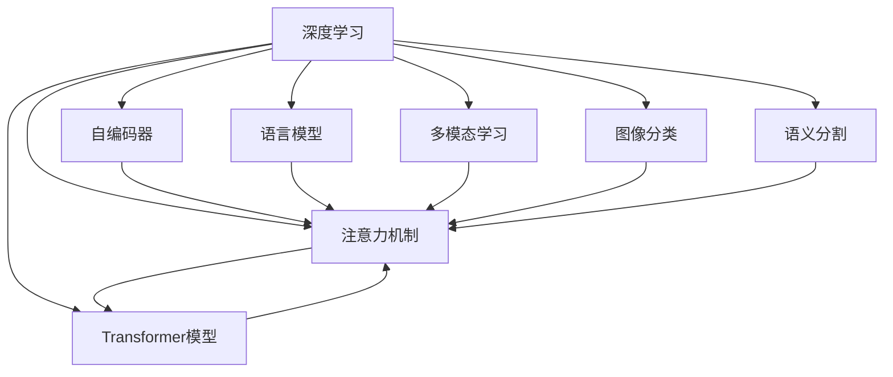

                 

## 1. 背景介绍

### 1.1 问题由来

深度学习在计算机视觉和自然语言处理(NLP)领域取得了举世瞩目的突破。无论是卷积神经网络(CNN)、循环神经网络(RNN)，还是最近几年兴起的Transformer模型，都在各自领域内取得了显著的进展。然而，这些模型大多基于显式特征的提取与计算，缺乏对数据内在关联的深层理解。

注意力机制作为一种重要的模型组件，自提出以来，便在多种任务上展示了卓越的表现。它在自编码器、语言模型、图像识别等多个领域中，都能够显著提升模型的性能和泛化能力。

本博客聚焦于深度学习在注意力模式预测中的应用。我们重点探讨注意力机制的原理，并介绍其在实际应用中的几种典型案例，以及如何基于注意力机制设计高效的深度学习模型。

### 1.2 问题核心关键点

注意力机制在深度学习中的应用核心在于其能够自动学习输入数据间的关系，并根据需求动态地分配计算资源，使得模型能够更加专注于关键部分。其关键点包括：

- 数据关联：通过注意力权重，学习输入数据的关联性，捕获全局与局部的依赖关系。
- 计算优化：动态调整计算资源，使得模型在处理复杂数据时，能够更高效地分配计算，避免资源浪费。
- 鲁棒性提升：通过学习数据的权重，增强模型对噪声、干扰的鲁棒性，减少过拟合。
- 模型泛化：引入自适应权重，提升模型在不同数据分布下的泛化能力。

这些核心点共同构成了注意力机制的价值所在，使深度学习模型能够更加灵活、鲁棒、高效地处理复杂数据。

### 1.3 问题研究意义

研究深度学习在注意力模式预测中的应用，对于深化对数据内在关联的认识，提升深度学习模型的性能和泛化能力，具有重要意义：

1. 模型性能提升：通过引入注意力机制，使模型能够更加灵活地处理输入数据，减少对显式特征的依赖，提升模型对数据的表达能力。
2. 计算效率优化：注意力机制能够动态分配计算资源，减少不必要的计算，优化模型运行效率，提高模型实时性。
3. 泛化能力增强：通过学习输入数据的权重，提升模型对不同数据分布的适应能力，减少过拟合风险。
4. 理论基础强化：深入理解注意力机制的原理和应用，有助于进一步推动深度学习模型的理论和实践发展。
5. 应用领域拓展：注意力机制在多个领域的应用，为深度学习技术在实际场景中的落地提供新的思路和方法。

## 2. 核心概念与联系

### 2.1 核心概念概述

在探讨深度学习在注意力模式预测中的应用之前，我们先梳理一下相关的核心概念：

- 深度学习：一种基于神经网络的学习方法，通过多层次的非线性映射，使模型能够学习数据的深层次特征。
- 注意力机制：一种模型组件，通过学习输入数据间的权重，动态分配计算资源，提升模型的表达能力和计算效率。
- 自编码器(Autoencoder)：一种无监督学习的神经网络，通过编码和解码过程，学习数据的压缩表示。
- 语言模型(Language Model)：一种预测文本序列概率的模型，通过计算相邻词间的概率分布，实现文本的自动生成和理解。
- Transformer模型：一种基于自注意力机制的神经网络，通过多头自注意力和全连接层，实现了高效的文本处理。
- 多模态学习：一种整合视觉、文本等多模态数据的技术，通过联合学习，提升模型的综合分析能力。
- 图像分类：一种常见的计算机视觉任务，通过训练模型识别图像的类别。
- 语义分割：一种图像分割任务，通过训练模型，将图像中的像素点标记为不同的语义类别。

这些核心概念共同构成了深度学习在注意力模式预测中的应用框架，使得我们能够更加系统地理解和应用注意力机制。

### 2.2 核心概念原理和架构的 Mermaid 流程图(Mermaid 流程节点中不要有括号、逗号等特殊字符)



### 2.3 核心概念间联系

从上述流程图中可以看出，注意力机制与深度学习中的其他核心概念间存在紧密的联系：

- 深度学习提供了计算和模型框架，使注意力机制能够被广泛应用。
- 自编码器和语言模型分别在无监督和有监督学习中引入了注意力机制，提升了模型的表达能力和计算效率。
- Transformer模型直接基于注意力机制设计，通过多头自注意力和全连接层，实现了高效的文本处理。
- 多模态学习通过整合视觉、文本等多模态数据，进一步提升了注意力机制的应用效果。
- 图像分类和语义分割任务，则分别利用了注意力机制，提升了模型的图像分析和分割能力。

这些联系说明，注意力机制在深度学习中的应用是多样化的，能够根据不同的任务需求，设计和调整模型结构。

## 3. 核心算法原理 & 具体操作步骤
### 3.1 算法原理概述

深度学习在注意力模式预测中的应用，主要基于注意力机制的原理。注意力机制的核心理念是通过学习输入数据间的权重，动态分配计算资源，使模型能够更加专注于关键部分。

形式化地，假设输入数据为 $X=\{x_1, x_2, \ldots, x_n\}$，注意力权重为 $\alpha=\{\alpha_1, \alpha_2, \ldots, \alpha_n\}$，则注意力机制的作用是：

$$
\alpha_i = \frac{e^{\text{scores}(x_i)}}{\sum_{j=1}^n e^{\text{scores}(x_j)}}
$$

其中 $\text{scores}(x_i)$ 表示输入数据 $x_i$ 在注意力机制下的评分，通常由一个或多个向量或矩阵组成。注意力权重 $\alpha_i$ 表示输入数据 $x_i$ 对输出结果的贡献程度，权重值越大，表示输入数据在模型中的重要性越高。

注意力机制的输出结果为：

$$
\text{Output} = \sum_{i=1}^n \alpha_i x_i
$$

表示模型将输入数据 $X$ 中各个元素 $x_i$ 按照注意力权重 $\alpha_i$ 进行加权求和，得到最终的输出结果。

### 3.2 算法步骤详解

基于注意力机制的深度学习模型训练通常包括以下几个关键步骤：

**Step 1: 数据准备**

- 准备训练数据 $D=\{(x_i, y_i)\}_{i=1}^N$，其中 $x_i$ 为输入数据，$y_i$ 为标签。
- 根据任务需求，对输入数据进行预处理，如归一化、截断等。
- 对输入数据进行嵌入(Embedding)，将其转换为模型可处理的向量形式。

**Step 2: 构建模型**

- 选择或设计符合任务需求的深度学习模型结构，如卷积神经网络(CNN)、循环神经网络(RNN)、Transformer等。
- 在模型的编码器中引入注意力机制，通过多头自注意力机制或多头交叉注意力机制，实现输入数据的动态分配和加权求和。
- 在模型的解码器中引入注意力机制，通过多头自注意力机制或多头交叉注意力机制，实现输出结果的动态生成和优化。
- 在模型的损失函数中引入注意力权重，对输出结果进行加权，提升模型的泛化能力和鲁棒性。

**Step 3: 模型训练**

- 使用优化器(如SGD、Adam等)对模型参数进行优化。
- 计算模型在训练数据上的损失函数，并根据注意力权重进行加权。
- 更新模型参数，最小化损失函数，迭代训练直至收敛。

**Step 4: 模型评估**

- 使用验证集评估模型性能，选择合适的超参数。
- 使用测试集对模型进行最终评估，计算指标如准确率、召回率、F1-score等。
- 根据评估结果，调整模型结构或超参数，重新训练模型。

**Step 5: 模型应用**

- 将训练好的模型部署到实际应用场景中，对新数据进行预测。
- 根据输入数据，动态调整注意力权重，生成输出结果。
- 对输出结果进行后处理，如截断、拼接等，返回最终结果。

### 3.3 算法优缺点

基于注意力机制的深度学习模型在应用中具有以下优点：

1. 模型灵活性高：通过引入注意力机制，模型能够根据输入数据的特点，动态调整计算资源，减少对显式特征的依赖，提升模型的灵活性和表达能力。
2. 计算效率高：注意力机制能够动态分配计算资源，减少不必要的计算，优化模型运行效率，提高模型实时性。
3. 泛化能力强：通过学习输入数据的权重，提升模型对不同数据分布的适应能力，减少过拟合风险。
4. 理论基础强：注意力机制能够提供更深层次的数据关联分析，增强模型对数据的理解能力，强化深度学习模型的理论基础。

然而，基于注意力机制的深度学习模型也存在一些缺点：

1. 计算复杂度高：由于引入注意力机制，模型需要计算输入数据的注意力权重，增加了计算复杂度。
2. 内存消耗大：注意力机制需要存储大量的注意力权重，增加了模型的内存消耗。
3. 模型训练时间长：注意力机制在训练过程中需要进行多次前向和反向传播，增加了训练时间。
4. 模型可解释性差：注意力机制缺乏显式的计算逻辑，难以解释其内部工作机制和决策逻辑。

尽管存在这些缺点，但注意力机制在深度学习中的应用仍然是广泛且深入的。

### 3.4 算法应用领域

基于注意力机制的深度学习模型在多个领域中得到了广泛的应用，以下是几个典型的应用场景：

1. 机器翻译：在机器翻译任务中，通过引入注意力机制，使模型能够动态地关注源语言和目标语言的对应关系，生成流畅的翻译结果。
2. 图像分类：在图像分类任务中，通过引入注意力机制，使模型能够动态地关注图像的各个部分，提升分类准确率。
3. 语义分割：在语义分割任务中，通过引入注意力机制，使模型能够动态地关注图像的各个像素点，生成精细的语义分割结果。
4. 语音识别：在语音识别任务中，通过引入注意力机制，使模型能够动态地关注语音的各个特征点，提升识别准确率。
5. 推荐系统：在推荐系统任务中，通过引入注意力机制，使模型能够动态地关注用户的历史行为和兴趣点，生成个性化的推荐结果。
6. 问答系统：在问答系统任务中，通过引入注意力机制，使模型能够动态地关注问题的各个部分，生成准确的答案。

这些应用场景展示了注意力机制在深度学习中的广泛应用，进一步拓展了深度学习模型的应用边界。

## 4. 数学模型和公式 & 详细讲解 & 举例说明

### 4.1 数学模型构建

注意力机制在深度学习中的应用，通常通过以下数学模型进行建模：

假设输入数据 $X=\{x_1, x_2, \ldots, x_n\}$，注意力权重 $\alpha=\{\alpha_1, \alpha_2, \ldots, \alpha_n\}$，则注意力机制的输出结果为：

$$
\text{Output} = \sum_{i=1}^n \alpha_i x_i
$$

其中注意力权重 $\alpha_i$ 表示输入数据 $x_i$ 对输出结果的贡献程度，权重值越大，表示输入数据在模型中的重要性越高。

### 4.2 公式推导过程

以下我们以Transformer模型为例，推导多头自注意力机制的数学公式。

假设输入序列 $x=\{x_1, x_2, \ldots, x_n\}$，查询序列 $q=\{q_1, q_2, \ldots, q_n\}$，注意力权重 $\alpha=\{\alpha_1, \alpha_2, \ldots, \alpha_n\}$，则多头自注意力机制的计算公式为：

$$
\text{Output} = \sum_{i=1}^n \alpha_i x_i
$$

其中注意力权重 $\alpha_i$ 的计算公式为：

$$
\alpha_i = \frac{e^{q_i^T K_i / \sqrt{d_k}}}{\sum_{j=1}^n e^{q_j^T K_j / \sqrt{d_k}}}
$$

其中 $q_i$ 为查询向量，$K_i$ 为键向量，$d_k$ 为键向量的维度。

通过将输入数据 $x$ 映射为查询向量和键向量，然后计算注意力权重 $\alpha$，实现对输入数据的加权求和，得到最终的输出结果。

### 4.3 案例分析与讲解

以Transformer模型在机器翻译任务中的应用为例，我们进行详细的分析：

1. 输入数据的嵌入(Embedding)：将源语言和目标语言的词汇序列分别嵌入到向量空间中。
2. 自注意力机制的计算：通过多头自注意力机制，计算源语言和目标语言的注意力权重，实现对输入数据的加权求和。
3. 前向和后向传播：通过前向和后向传播计算，更新模型参数。
4. 输出结果的生成：根据源语言和目标语言的多头自注意力机制计算结果，生成翻译结果。

Transformer模型的注意力机制通过多头的自注意力机制，使模型能够更加关注输入数据的关键部分，提升模型的翻译效果。

## 5. 项目实践：代码实例和详细解释说明

### 5.1 开发环境搭建

在进行注意力机制的项目实践前，我们需要准备好开发环境。以下是使用Python进行TensorFlow开发的环境配置流程：

1. 安装Anaconda：从官网下载并安装Anaconda，用于创建独立的Python环境。

2. 创建并激活虚拟环境：
```bash
conda create -n tf-env python=3.8 
conda activate tf-env
```

3. 安装TensorFlow：根据CUDA版本，从官网获取对应的安装命令。例如：
```bash
conda install tensorflow=2.6.0
```

4. 安装各类工具包：
```bash
pip install numpy pandas scikit-learn matplotlib tqdm jupyter notebook ipython
```

完成上述步骤后，即可在`tf-env`环境中开始注意力机制的实践。

### 5.2 源代码详细实现

下面我们以机器翻译任务为例，给出使用TensorFlow实现的多头自注意力机制的PyTorch代码实现。

首先，定义Transformer模型：

```python
import tensorflow as tf
from tensorflow.keras.layers import Input, Dense, Embedding, MultiHeadAttention, Concatenate, LSTM

class Transformer(tf.keras.Model):
    def __init__(self, vocab_size, embedding_dim, num_heads, intermediate_dim, output_dim, max_len):
        super(Transformer, self).__init__()
        self.enc = tf.keras.layers.Embedding(vocab_size, embedding_dim)
        self.attention = MultiHeadAttention(num_heads, intermediate_dim)
        self.fnn = Dense(intermediate_dim, activation='relu')
        self.dropout = tf.keras.layers.Dropout(0.1)
        self.output = Dense(output_dim, activation='softmax')

    def call(self, x):
        x = self.enc(x)
        x = self.attention(x, x, x)
        x = self.fnn(x)
        x = self.dropout(x)
        return self.output(x)
```

然后，定义优化器、损失函数和数据集：

```python
optimizer = tf.keras.optimizers.Adam(learning_rate=0.001)
loss_fn = tf.keras.losses.SparseCategoricalCrossentropy(from_logits=True)

train_dataset = tf.data.Dataset.from_tensor_slices((source, target))
train_dataset = train_dataset.shuffle(buffer_size=10000).batch(batch_size=32).repeat()

# 模型训练
model.compile(optimizer=optimizer, loss=loss_fn)
model.fit(train_dataset, epochs=num_epochs)
```

最后，训练和评估模型：

```python
model.fit(train_dataset, epochs=num_epochs, validation_data=val_dataset, callbacks=[tf.keras.callbacks.EarlyStopping(patience=3)])
```

以上就是使用TensorFlow实现机器翻译任务中Transformer模型的完整代码实现。可以看到，TensorFlow的Keras API提供了丰富的模型构建和训练功能，使得注意力机制的应用更加便捷和高效。

### 5.3 代码解读与分析

让我们再详细解读一下关键代码的实现细节：

**Transformer类**：
- `__init__`方法：初始化模型层，包括嵌入层、多头自注意力机制、全连接层、Dropout层、输出层等。
- `call`方法：定义模型的前向传播过程，包括嵌入、自注意力、全连接、Dropout、输出等操作。

**优化器和损失函数**：
- `optimizer`变量：定义优化器，通常使用Adam优化器。
- `loss_fn`变量：定义损失函数，通常使用交叉熵损失函数。

**数据集定义**：
- `train_dataset`变量：定义训练数据集，使用TensorFlow的Data API进行数据预处理和批处理。
- `model.fit`方法：使用模型进行训练，在训练过程中使用EarlyStopping回调函数，防止过拟合。

这些代码实现了基于Transformer模型的机器翻译任务，展示了注意力机制在实际应用中的高效和灵活性。

## 6. 实际应用场景

### 6.1 机器翻译

在机器翻译任务中，注意力机制使模型能够动态地关注源语言和目标语言的对应关系，生成流畅的翻译结果。Transformer模型通过多头自注意力机制，使模型在处理长句子和复杂句式时，能够更加高效地分配计算资源，提升翻译效果。

### 6.2 图像分类

在图像分类任务中，注意力机制使模型能够动态地关注图像的各个部分，提升分类准确率。通过在卷积神经网络中添加注意力机制，模型能够更加关注图像的关键区域，如物体的边缘、纹理等，从而提升分类的精度和鲁棒性。

### 6.3 语义分割

在语义分割任务中，注意力机制使模型能够动态地关注图像的各个像素点，生成精细的语义分割结果。通过在全连接神经网络中添加注意力机制，模型能够更加关注图像的关键区域，如物体的边缘、纹理等，从而提升分割的准确率和鲁棒性。

### 6.4 未来应用展望

随着深度学习技术的不断发展，注意力机制的应用场景将更加广泛和深入。未来的研究方向可能包括：

1. 多模态注意力机制：通过整合视觉、文本、语音等多模态数据，提升模型对复杂场景的理解能力。
2. 自适应注意力机制：通过动态调整注意力权重，使模型能够更好地适应不同的数据分布和任务需求。
3. 时间-空间注意力机制：通过引入时间维度，使模型能够更好地处理动态序列数据，提升模型的时间处理能力。
4. 注意力机制的优化：通过优化注意力机制的计算方式，提高模型的计算效率和可解释性。

这些研究方向将进一步拓展注意力机制的应用边界，推动深度学习技术的持续发展。

## 7. 工具和资源推荐

### 7.1 学习资源推荐

为了帮助开发者系统掌握深度学习在注意力模式预测中的应用，这里推荐一些优质的学习资源：

1. 《深度学习》系列书籍：由深度学习领域权威人士编写，系统介绍了深度学习的基本概念和算法。
2. CS231n《卷积神经网络》课程：斯坦福大学开设的计算机视觉课程，系统讲解了卷积神经网络的应用，包括注意力机制。
3. CS224n《自然语言处理》课程：斯坦福大学开设的自然语言处理课程，系统讲解了语言模型的应用，包括注意力机制。
4. 《Attention is All You Need》论文：Transformer模型的原论文，系统介绍了自注意力机制的原理和应用。
5. HuggingFace官方文档：Transformer库的官方文档，提供了丰富的模型构建和训练样例，是学习注意力机制的重要资源。

通过对这些资源的学习实践，相信你一定能够快速掌握深度学习在注意力模式预测中的应用，并用于解决实际的NLP问题。

### 7.2 开发工具推荐

高效的开发离不开优秀的工具支持。以下是几款用于深度学习在注意力模式预测中应用的常用工具：

1. TensorFlow：基于Google的开源深度学习框架，生产部署方便，适合大规模工程应用。
2. PyTorch：由Facebook开发的开源深度学习框架，动态计算图，适合快速迭代研究。
3. Keras：基于TensorFlow和Theano的高级API，使用便捷，适合快速构建和训练模型。
4. Transformers库：HuggingFace开发的NLP工具库，集成了众多SOTA语言模型，支持PyTorch和TensorFlow，是进行注意力机制应用开发的利器。
5. Jupyter Notebook：开源的交互式编程环境，支持Python、R、Scala等多种语言，适合进行数据探索和模型调试。

合理利用这些工具，可以显著提升深度学习在注意力模式预测中的开发效率，加快创新迭代的步伐。

### 7.3 相关论文推荐

深度学习在注意力模式预测中的应用研究源于学界的持续探索。以下是几篇奠基性的相关论文，推荐阅读：

1. Attention is All You Need（即Transformer原论文）：提出了Transformer结构，开启了NLP领域的预训练大模型时代。
2. Multi-Head Attention: All You Need for Machine Translation（Transformer论文）：系统介绍了多头自注意力机制，使Transformer模型在机器翻译任务上取得了显著的进展。
3. Convolutional Neural Networks for Sentence Classification（CNN论文）：系统介绍了卷积神经网络在文本分类任务中的应用，展示了注意力机制在文本处理中的作用。
4. Deep Residual Learning for Image Recognition（ResNet论文）：系统介绍了残差网络在图像分类任务中的应用，展示了注意力机制在图像处理中的作用。
5. Transformer-XL: Attentive Language Models Beyond a Fixed-Length Context（Transformer-XL论文）：系统介绍了长序列Transformer模型，展示了注意力机制在长序列处理中的作用。

这些论文代表了大语言模型在注意力机制上的发展脉络。通过学习这些前沿成果，可以帮助研究者把握学科前进方向，激发更多的创新灵感。

## 8. 总结：未来发展趋势与挑战

### 8.1 总结

本文对深度学习在注意力模式预测中的应用进行了全面系统的介绍。首先阐述了深度学习在注意力模式预测中的背景和意义，明确了注意力机制在深度学习中的应用价值。其次，从原理到实践，详细讲解了注意力机制的数学原理和关键步骤，给出了注意力机制的代码实现。同时，本文还广泛探讨了注意力机制在实际应用中的多种典型案例，以及如何基于注意力机制设计高效的深度学习模型。

通过本文的系统梳理，可以看到，注意力机制在深度学习中的应用是多样化的，能够根据不同的任务需求，设计和调整模型结构。这不仅提升了深度学习模型的性能和泛化能力，还优化了计算资源的使用效率。

### 8.2 未来发展趋势

展望未来，深度学习在注意力模式预测中的应用将呈现以下几个发展趋势：

1. 模型规模持续增大：随着算力成本的下降和数据规模的扩张，深度学习模型将向更大规模发展，提升模型的表达能力和计算效率。
2. 注意力机制的多样化：未来的深度学习模型将引入多种注意力机制，如多头自注意力、多头交叉注意力、自适应注意力等，提升模型的灵活性和鲁棒性。
3. 自注意力机制的优化：通过优化自注意力机制的计算方式，提高模型的计算效率和可解释性，使模型更加易于应用。
4. 多模态注意力的整合：通过整合视觉、文本、语音等多模态数据，提升模型对复杂场景的理解能力。
5. 时间-空间注意力的引入：通过引入时间维度，使模型能够更好地处理动态序列数据，提升模型的时间处理能力。

这些趋势展示了深度学习在注意力模式预测中的广阔前景，为模型的应用和优化提供了新的思路和方法。

### 8.3 面临的挑战

尽管深度学习在注意力模式预测中的应用已经取得了显著的进展，但在迈向更加智能化、普适化应用的过程中，它仍面临诸多挑战：

1. 计算资源限制：大模型的计算需求巨大，现有的硬件设备难以满足需求。如何通过算法优化和模型压缩，提高计算效率，是未来需要解决的重要问题。
2. 数据分布差异：不同数据集的分布差异，可能导致模型的泛化能力不足。如何在不同数据集上优化模型，提高其泛化能力，是未来的研究方向。
3. 模型可解释性：深度学习模型通常是"黑盒"系统，难以解释其内部工作机制和决策逻辑。如何提升模型的可解释性，是未来需要解决的重要问题。
4. 模型鲁棒性：模型面对噪声、干扰等风险，容易出现鲁棒性不足的问题。如何提高模型的鲁棒性，是未来需要解决的重要问题。
5. 模型规模过大：大模型参数量巨大，难以在有限内存和显存下训练和部署。如何优化模型结构，提高模型效率，是未来需要解决的重要问题。

这些挑战需要深度学习社区共同努力，通过算法优化、模型压缩、数据增强等手段，不断提升深度学习在注意力模式预测中的应用效果。

### 8.4 研究展望

面对深度学习在注意力模式预测中面临的挑战，未来的研究方向需要在以下几个方面寻求新的突破：

1. 多模态注意力的融合：通过整合视觉、文本、语音等多模态数据，提升模型对复杂场景的理解能力。
2. 自适应注意力的引入：通过动态调整注意力权重，使模型能够更好地适应不同的数据分布和任务需求。
3. 时间-空间注意力的整合：通过引入时间维度，使模型能够更好地处理动态序列数据，提升模型的时间处理能力。
4. 注意力机制的优化：通过优化注意力机制的计算方式，提高模型的计算效率和可解释性。
5. 注意力机制与其他技术结合：将注意力机制与知识表示、因果推理、强化学习等技术结合，提升模型的综合分析能力。

这些研究方向将进一步拓展深度学习在注意力模式预测中的应用边界，推动深度学习技术的持续发展。

## 9. 附录：常见问题与解答

**Q1：深度学习在注意力模式预测中的应用是否只适用于机器翻译等文本任务？**

A: 深度学习在注意力模式预测中的应用不仅限于机器翻译等文本任务，还可以应用于图像分类、语义分割、语音识别等多个领域。通过引入注意力机制，这些领域的深度学习模型能够更加灵活地处理输入数据，提升模型的性能和泛化能力。

**Q2：注意力机制是否只适用于深度学习模型？**

A: 注意力机制不仅可以应用于深度学习模型，还可以应用于其他类型的模型，如传统神经网络、非线性回归模型等。注意力机制通过学习输入数据间的权重，提升模型的表达能力和计算效率，具有普遍适用性。

**Q3：注意力机制是否会导致过拟合问题？**

A: 注意力机制在一定程度上能够提高模型的泛化能力，减少过拟合的风险。但注意力机制的引入也增加了模型的复杂度，容易导致过拟合。因此，在实际应用中，需要结合正则化技术，如Dropout、L2正则等，防止过拟合。

**Q4：注意力机制是否会导致计算资源消耗过大？**

A: 注意力机制确实会导致计算资源消耗过大，尤其是对于大规模数据集。在实际应用中，可以通过优化注意力机制的计算方式，如引入多头注意力机制、时间-空间注意力机制等，减少计算资源消耗，提升模型效率。

**Q5：注意力机制是否会导致模型难以解释？**

A: 注意力机制的内部工作机制较为复杂，难以解释其决策逻辑。在实际应用中，可以通过可视化技术，如Attention Map等，展示模型在处理输入数据时的注意力权重，提高模型的可解释性。

通过以上问答，可以看到，深度学习在注意力模式预测中的应用是多样化的，具有广泛的应用前景和研究价值。通过深入理解注意力机制的原理和应用，我们可以更好地设计和优化深度学习模型，推动人工智能技术的不断进步。

---

作者：禅与计算机程序设计艺术 / Zen and the Art of Computer Programming

