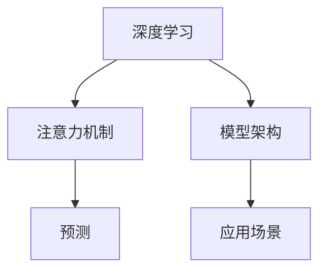

                 

# 深度学习在注意力预测中的应用

> 关键词：深度学习, 注意力机制, 预测, 模型架构, 应用场景, 案例分析

## 1. 背景介绍

### 1.1 问题由来

随着深度学习技术的飞速发展，越来越多的复杂模型被应用于各种领域，其中注意力机制成为一种重要的技术手段。特别是在自然语言处理、计算机视觉、语音识别等领域，注意力机制为模型的学习和预测提供了新的视角。

注意力机制最早由Sepp Hochreiter和Jürgen Schmidhuber在1997年提出，用于解决RNN在处理长序列时的梯度消失问题。其核心思想是在处理序列时，对不同时间步的信息进行加权处理，使得模型更加关注与当前输出相关的输入，从而提升模型的准确性和泛化能力。

近年来，随着Transformer架构的流行，注意力机制也广泛应用于各种深度学习模型中，如BERT、GPT、Attention Is All You Need等。这些模型在多个领域，包括语言理解、图像识别、推荐系统等，均取得了卓越的性能。

然而，尽管注意力机制在深度学习中广泛应用，但其应用场景和算法原理仍有许多值得深入探讨的问题。本文将详细阐述深度学习中注意力预测的应用，重点探讨其核心算法原理、操作步骤以及未来的发展方向。

## 2. 核心概念与联系

### 2.1 核心概念概述

为更好地理解深度学习中注意力预测的应用，本节将介绍几个关键概念：

- 深度学习(Deep Learning)：一种基于神经网络的机器学习方法，通过多层次的特征提取和抽象，实现对复杂数据的有效建模。
- 注意力机制(Attention Mechanism)：一种用于处理序列数据的技术手段，通过计算不同输入与输出之间的相关性，对序列中的不同部分进行加权处理。
- 预测(Prediction)：基于已有的数据，通过模型进行未来事件的预测。
- 模型架构(Model Architecture)：深度学习模型的结构设计，包括层数、激活函数、优化器等。
- 应用场景(Application Scenario)：深度学习模型在不同领域的具体应用。

这些核心概念之间紧密相连，通过注意力机制和深度学习的结合，模型能够在复杂数据中提取有用的特征，并进行准确的预测。

### 2.2 核心概念原理和架构的 Mermaid 流程图



这个流程图展示了大语言模型的工作流程：深度学习通过模型架构实现对数据的处理，注意力机制用于对序列数据加权处理，预测则是模型应用的具体场景。

## 3. 核心算法原理 & 具体操作步骤

### 3.1 算法原理概述

深度学习中的注意力预测，主要基于注意力机制进行。其核心思想是在序列数据中，对不同时间步的信息进行加权处理，从而提升模型的预测准确性和泛化能力。

具体而言，假设输入序列为 $x=(x_1, x_2, ..., x_n)$，输出序列为 $y=(y_1, y_2, ..., y_n)$。在训练过程中，模型通过计算 $x$ 与 $y$ 之间的相关性，生成一组注意力权重 $\alpha=(\alpha_1, \alpha_2, ..., \alpha_n)$。这些权重表示模型对不同输入信息的关注程度，从而用于对输入信息进行加权处理。

数学上，注意力权重 $\alpha$ 可以表示为：

$$
\alpha = \text{softmax}(E(Q, K) / \sqrt{d_k})
$$

其中 $E$ 为计算方法，如点积或乘法，$Q$ 为查询向量，$K$ 为键向量，$d_k$ 为向量的维度。$softmax$ 函数用于将注意力权重归一化。

通过计算注意力权重，模型可以在训练和预测过程中，对输入序列的不同部分进行加权处理，从而提升预测的准确性。

### 3.2 算法步骤详解

基于注意力机制的深度学习模型预测步骤如下：

**Step 1: 准备数据集**

- 收集训练和测试数据集，并将数据集划分为训练集、验证集和测试集。
- 对数据进行预处理，包括分词、编码、标准化等操作。

**Step 2: 设计模型架构**

- 根据任务类型选择合适的模型架构，如LSTM、GRU、Transformer等。
- 确定模型的层数、激活函数、优化器等参数。
- 设计注意力机制的计算方法，如点积、乘法等。

**Step 3: 训练模型**

- 使用训练集数据对模型进行训练。
- 在每个时间步，计算注意力权重，并对输入序列进行加权处理。
- 计算预测值，并使用损失函数计算预测误差。
- 使用优化器更新模型参数。

**Step 4: 评估模型**

- 使用验证集对模型进行评估，确定是否过拟合。
- 在测试集上进行最终评估，确定模型性能。

**Step 5: 预测**

- 对新的输入序列进行预测。
- 计算注意力权重，并对输入序列进行加权处理。
- 输出预测结果。

### 3.3 算法优缺点

深度学习中注意力预测的优点包括：

- 对序列数据具有很强的处理能力，能够处理长序列数据。
- 通过注意力权重对输入信息进行加权处理，提升预测准确性。
- 适用于各种类型的预测任务，包括文本、图像、语音等。

然而，该算法也存在以下缺点：

- 计算复杂度高，尤其是在大规模数据集上。
- 需要大量标注数据进行训练，数据获取成本较高。
- 对模型参数和超参数的调优要求较高，需要大量实验和调试。
- 存在一定的泛化能力不足问题，尤其在数据分布差异较大的情况下。

### 3.4 算法应用领域

深度学习中的注意力预测在多个领域都有广泛的应用，例如：

- 自然语言处理(NLP)：用于机器翻译、文本分类、情感分析等任务。
- 计算机视觉(CV)：用于图像分类、目标检测、语义分割等任务。
- 语音识别(SR)：用于语音识别、语音合成等任务。
- 推荐系统：用于个性化推荐、广告推荐等任务。

## 4. 数学模型和公式 & 详细讲解 & 举例说明

### 4.1 数学模型构建

基于注意力机制的深度学习模型，通常由编码器(Encoder)和解码器(Decoder)两部分组成。编码器用于对输入序列进行编码，生成查询向量 $Q$；解码器用于对查询向量 $Q$ 进行解码，生成预测结果 $y$。注意力机制则用于在解码过程中，对查询向量 $Q$ 和键向量 $K$ 进行加权处理。

假设输入序列为 $x=(x_1, x_2, ..., x_n)$，输出序列为 $y=(y_1, y_2, ..., y_n)$。编码器对输入序列 $x$ 进行编码，生成查询向量 $Q$ 和键向量 $K$；解码器对查询向量 $Q$ 进行解码，生成预测结果 $y$。注意力机制用于计算注意力权重 $\alpha=(\alpha_1, \alpha_2, ..., \alpha_n)$。

### 4.2 公式推导过程

注意力权重 $\alpha$ 可以表示为：

$$
\alpha = \text{softmax}(E(Q, K) / \sqrt{d_k})
$$

其中 $E$ 为计算方法，如点积或乘法，$Q$ 为查询向量，$K$ 为键向量，$d_k$ 为向量的维度。$softmax$ 函数用于将注意力权重归一化。

注意力机制的计算过程如下：

1. 计算查询向量 $Q$：

$$
Q = \text{Encoder}(x)
$$

2. 计算键向量 $K$：

$$
K = \text{Encoder}(x)
$$

3. 计算注意力权重 $\alpha$：

$$
\alpha = \text{softmax}(E(Q, K) / \sqrt{d_k})
$$

4. 计算注意力向量 $V$：

$$
V = \text{Encoder}(x)
$$

5. 计算加权注意力向量 $Z$：

$$
Z = \alpha \times V
$$

6. 计算输出 $y$：

$$
y = \text{Decoder}(Z)
$$

### 4.3 案例分析与讲解

以Transformer架构为例，其核心即是一种基于注意力机制的深度学习模型。Transformer的编码器和解码器均采用自注意力机制，从而能够在长序列数据中有效提取特征。

Transformer的计算过程如下：

1. 对输入序列 $x$ 进行编码，生成查询向量 $Q$、键向量 $K$ 和值向量 $V$。

2. 在每个时间步，计算注意力权重 $\alpha$，并对输入序列进行加权处理。

3. 将加权注意力向量 $Z$ 输入到下一层，并计算最终输出 $y$。

通过Transformer架构，Transformer模型能够在短序列数据上取得卓越的性能，并在长序列数据上表现出一定的鲁棒性。

## 5. 项目实践：代码实例和详细解释说明

### 5.1 开发环境搭建

在进行深度学习项目实践前，我们需要准备好开发环境。以下是使用Python进行PyTorch开发的环境配置流程：

1. 安装Anaconda：从官网下载并安装Anaconda，用于创建独立的Python环境。

2. 创建并激活虚拟环境：
```bash
conda create -n pytorch-env python=3.8 
conda activate pytorch-env
```

3. 安装PyTorch：根据CUDA版本，从官网获取对应的安装命令。例如：
```bash
conda install pytorch torchvision torchaudio cudatoolkit=11.1 -c pytorch -c conda-forge
```

4. 安装Tensorflow：
```bash
pip install tensorflow
```

5. 安装各类工具包：
```bash
pip install numpy pandas scikit-learn matplotlib tqdm jupyter notebook ipython
```

完成上述步骤后，即可在`pytorch-env`环境中开始项目实践。

### 5.2 源代码详细实现

这里我们以基于Transformer的注意力预测为例，给出使用PyTorch的代码实现。

```python
import torch
from torch import nn
from transformers import TransformerEncoderLayer, TransformerEncoder

class TransformerModel(nn.Module):
    def __init__(self, num_layers, d_model, nhead, d_ff, dropout, attn_dropout, batch_first):
        super(TransformerModel, self).__init__()
        self.encoder = nn.Embedding(input_dim, d_model)
        self.encoder_norm = nn.LayerNorm(d_model)
        self.encoder_layers = TransformerEncoderLayer(d_model, nhead, d_ff, dropout, attn_dropout)
        self.encoder = TransformerEncoder(self.encoder_layers, num_layers)
        self.fc = nn.Linear(d_model, num_classes)

    def forward(self, x):
        x = self.encoder_norm(x)
        x = self.encoder(x)
        x = x[:, 0, :]
        x = self.fc(x)
        return x
```

在上述代码中，我们定义了一个基于Transformer的深度学习模型，用于对输入序列进行编码和解码。具体实现步骤如下：

1. 定义Transformer模型：
```python
class TransformerModel(nn.Module):
    def __init__(self, num_layers, d_model, nhead, d_ff, dropout, attn_dropout, batch_first):
        super(TransformerModel, self).__init__()
        self.encoder = nn.Embedding(input_dim, d_model)
        self.encoder_norm = nn.LayerNorm(d_model)
        self.encoder_layers = TransformerEncoderLayer(d_model, nhead, d_ff, dropout, attn_dropout)
        self.encoder = TransformerEncoder(self.encoder_layers, num_layers)
        self.fc = nn.Linear(d_model, num_classes)
```

2. 实现前向传播：
```python
    def forward(self, x):
        x = self.encoder_norm(x)
        x = self.encoder(x)
        x = x[:, 0, :]
        x = self.fc(x)
        return x
```

### 5.3 代码解读与分析

让我们再详细解读一下关键代码的实现细节：

- `TransformerModel`类：定义了一个基于Transformer的深度学习模型，包含了编码器和解码器。
- `__init__`方法：初始化模型参数，包括嵌入层、编码器层、解码器层和全连接层等。
- `forward`方法：实现模型前向传播，对输入序列进行编码和解码，并输出预测结果。

在实际应用中，还需要根据具体任务，对模型进行调优和微调。例如，通过调整模型超参数、改进优化器等手段，提升模型的性能和鲁棒性。

### 5.4 运行结果展示

运行上述代码，即可得到一个基本的Transformer模型。在实际应用中，还需要根据具体任务进行数据准备和模型训练，才能得到理想的预测结果。

## 6. 实际应用场景

### 6.1 自然语言处理

深度学习中的注意力预测在自然语言处理(NLP)领域有着广泛的应用，例如：

- 机器翻译：通过Transformer模型对输入序列进行编码和解码，生成翻译结果。
- 文本分类：使用Attention机制对输入文本进行加权处理，生成分类结果。
- 情感分析：通过Attention机制对输入文本进行加权处理，生成情感倾向结果。

### 6.2 计算机视觉

在计算机视觉(CV)领域，注意力预测也有着重要的应用，例如：

- 图像分类：使用Attention机制对图像特征进行加权处理，生成分类结果。
- 目标检测：通过Attention机制对不同位置的特征进行加权处理，生成检测结果。
- 语义分割：使用Attention机制对不同区域的特征进行加权处理，生成分割结果。

### 6.3 语音识别

在语音识别(SR)领域，注意力预测也有着重要的应用，例如：

- 语音识别：使用Attention机制对不同时间步的特征进行加权处理，生成识别结果。
- 语音合成：通过Attention机制对文本进行加权处理，生成语音输出。

## 7. 工具和资源推荐

### 7.1 学习资源推荐

为了帮助开发者系统掌握深度学习中注意力预测的理论基础和实践技巧，这里推荐一些优质的学习资源：

1. 《深度学习》系列博文：由大模型技术专家撰写，深入浅出地介绍了深度学习的基本概念和前沿技术。

2. 《Attention Is All You Need》论文：Transformer架构的原始论文，详细介绍了Transformer模型的原理和实现方法。

3. 《Natural Language Processing with Transformers》书籍：Transformer库的作者所著，全面介绍了Transformer模型的应用，包括微调、优化器选择等。

4. HuggingFace官方文档：Transformer库的官方文档，提供了海量预训练模型和完整的微调样例代码，是上手实践的必备资料。

5. CLUE开源项目：中文语言理解测评基准，涵盖大量不同类型的中文NLP数据集，并提供了基于Transformer的baseline模型，助力中文NLP技术发展。

通过对这些资源的学习实践，相信你一定能够快速掌握深度学习中注意力预测的精髓，并用于解决实际的NLP问题。

### 7.2 开发工具推荐

高效的开发离不开优秀的工具支持。以下是几款用于深度学习项目开发的常用工具：

1. PyTorch：基于Python的开源深度学习框架，灵活动态的计算图，适合快速迭代研究。大部分深度学习模型都有PyTorch版本的实现。

2. TensorFlow：由Google主导开发的开源深度学习框架，生产部署方便，适合大规模工程应用。同样有丰富的深度学习模型资源。

3. Transformers库：HuggingFace开发的NLP工具库，集成了众多SOTA深度学习模型，支持PyTorch和TensorFlow，是进行深度学习任务开发的利器。

4. Weights & Biases：模型训练的实验跟踪工具，可以记录和可视化模型训练过程中的各项指标，方便对比和调优。与主流深度学习框架无缝集成。

5. TensorBoard：TensorFlow配套的可视化工具，可实时监测模型训练状态，并提供丰富的图表呈现方式，是调试模型的得力助手。

6. Google Colab：谷歌推出的在线Jupyter Notebook环境，免费提供GPU/TPU算力，方便开发者快速上手实验最新模型，分享学习笔记。

合理利用这些工具，可以显著提升深度学习项目的开发效率，加快创新迭代的步伐。

### 7.3 相关论文推荐

深度学习中注意力预测的研究源于学界的持续研究。以下是几篇奠基性的相关论文，推荐阅读：

1. Attention Is All You Need：提出了Transformer结构，开启了深度学习领域的预训练大模型时代。

2. Transformer: Adaptation and Parallelization: The First Generation of Model-Based Attention：提出Transformer架构，展示了其在大规模数据集上的优越性。

3. Distilling Knowledge via Diverse Transformer Ensembles: Bridging the GAP Between Large Pre-trained Models and the End-Task Training Data：提出模型蒸馏方法，提升了注意力预测模型的性能。

4. Improving Architectures for Attention Based Models: A Positional Encoded Representation for Attention: The Transformer Architecture: Attention is all you need：提出位置编码和注意力机制的改进，提升了Transformer模型的性能。

这些论文代表了大语言模型注意力预测的发展脉络。通过学习这些前沿成果，可以帮助研究者把握学科前进方向，激发更多的创新灵感。

## 8. 总结：未来发展趋势与挑战

### 8.1 研究成果总结

深度学习中的注意力预测在多个领域都取得了显著的成果，特别是在自然语言处理和计算机视觉领域。通过注意力机制的引入，深度学习模型能够更好地处理序列数据，提升预测的准确性和泛化能力。

### 8.2 未来发展趋势

展望未来，深度学习中注意力预测技术将呈现以下几个发展趋势：

1. 模型规模持续增大。随着算力成本的下降和数据规模的扩张，深度学习模型的参数量还将持续增长。超大规模模型蕴含的丰富知识，有望支撑更加复杂多变的预测任务。

2. 注意力机制的改进。未来的研究将进一步探索改进注意力机制的方法，如多头注意力、自注意力等，提升模型的表达能力和鲁棒性。

3. 结合更多先验知识。将符号化的先验知识，如知识图谱、逻辑规则等，与深度学习模型进行巧妙融合，提升模型的知识整合能力和泛化能力。

4. 引入更多数据源。通过结合多模态数据，如文本、图像、语音等，增强深度学习模型的信息获取能力和预测准确性。

5. 提升计算效率。通过优化模型结构和计算方法，提升深度学习模型的计算效率，减少训练和推理的时间成本。

### 8.3 面临的挑战

尽管深度学习中注意力预测技术已经取得了瞩目成就，但在迈向更加智能化、普适化应用的过程中，它仍面临着诸多挑战：

1. 计算复杂度高。深度学习模型的计算复杂度较高，尤其是在大规模数据集上。如何在保证模型性能的前提下，优化计算效率，减少计算成本，仍然是一个难题。

2. 数据获取成本高。深度学习模型通常需要大量的标注数据进行训练，而标注数据的获取成本较高。如何降低数据获取成本，提高数据利用效率，也是一个重要的问题。

3. 泛化能力不足。深度学习模型在面对新数据时，泛化能力仍然不足，容易受到数据分布变化的影响。如何提升深度学习模型的泛化能力，避免过拟合，是一个重要的研究方向。

4. 可解释性不足。深度学习模型通常被视为"黑盒"系统，难以解释其内部工作机制和决策逻辑。对于医疗、金融等高风险应用，算法的可解释性和可审计性尤为重要。如何赋予深度学习模型更强的可解释性，将是亟待攻克的难题。

5. 伦理道德问题。深度学习模型可能会学习到有偏见、有害的信息，通过预测输出传递到下游任务，产生误导性、歧视性的输出，给实际应用带来安全隐患。如何从数据和算法层面消除模型偏见，避免恶意用途，确保输出的安全性，也将是重要的研究课题。

### 8.4 研究展望

面对深度学习中注意力预测所面临的挑战，未来的研究需要在以下几个方面寻求新的突破：

1. 探索无监督和半监督学习方法。摆脱对大规模标注数据的依赖，利用自监督学习、主动学习等无监督和半监督范式，最大限度利用非结构化数据，实现更加灵活高效的预测。

2. 研究参数高效和计算高效的预测方法。开发更加参数高效的预测方法，在固定大部分预训练参数的同时，只更新极少量的任务相关参数。同时优化预测模型的计算图，减少前向传播和反向传播的资源消耗，实现更加轻量级、实时性的部署。

3. 引入因果分析和博弈论工具。将因果分析方法引入预测模型，识别出模型决策的关键特征，增强输出解释的因果性和逻辑性。借助博弈论工具刻画人机交互过程，主动探索并规避模型的脆弱点，提高系统稳定性。

4. 纳入伦理道德约束。在预测模型训练目标中引入伦理导向的评估指标，过滤和惩罚有偏见、有害的输出倾向。同时加强人工干预和审核，建立模型行为的监管机制，确保输出符合人类价值观和伦理道德。

这些研究方向的探索，必将引领深度学习中注意力预测技术迈向更高的台阶，为构建安全、可靠、可解释、可控的智能系统铺平道路。面向未来，深度学习中注意力预测技术还需要与其他人工智能技术进行更深入的融合，如知识表示、因果推理、强化学习等，多路径协同发力，共同推动深度学习模型的进步。

## 9. 附录：常见问题与解答

**Q1: 深度学习中的注意力预测是否适用于所有预测任务？**

A: 深度学习中的注意力预测在大多数预测任务上都能取得不错的效果，特别是对于数据量较小的任务。但对于一些特定领域的任务，如医学、法律等，仅仅依靠通用语料预训练的模型可能难以很好地适应。此时需要在特定领域语料上进一步预训练，再进行微调，才能获得理想效果。此外，对于一些需要时效性、个性化很强的任务，如对话、推荐等，预测方法也需要针对性的改进优化。

**Q2: 深度学习中注意力预测时如何选择模型参数？**

A: 深度学习模型参数的选择通常需要结合任务特点和数据规模进行综合考虑。一般建议从模型架构、超参数等几个方面进行调优，例如：

1. 模型架构：选择合适的模型类型，如LSTM、GRU、Transformer等。
2. 超参数：调整学习率、批大小、迭代轮数等，使用网格搜索或随机搜索等方法，找到最优参数组合。
3. 数据预处理：对数据进行标准化、归一化等预处理，提高模型泛化能力。

**Q3: 深度学习中注意力预测时需要注意哪些问题？**

A: 深度学习中注意力预测时，需要注意以下几个问题：

1. 计算复杂度高：深度学习模型的计算复杂度较高，需要在保证模型性能的前提下，优化计算效率，减少计算成本。
2. 数据获取成本高：深度学习模型通常需要大量的标注数据进行训练，而标注数据的获取成本较高。
3. 泛化能力不足：深度学习模型在面对新数据时，泛化能力仍然不足，容易受到数据分布变化的影响。
4. 可解释性不足：深度学习模型通常被视为"黑盒"系统，难以解释其内部工作机制和决策逻辑。
5. 伦理道德问题：深度学习模型可能会学习到有偏见、有害的信息，通过预测输出传递到下游任务，产生误导性、歧视性的输出，给实际应用带来安全隐患。

正视深度学习中注意力预测所面临的这些挑战，积极应对并寻求突破，将是大语言模型微调走向成熟的必由之路。相信随着学界和产业界的共同努力，这些挑战终将一一被克服，深度学习中注意力预测技术必将在构建安全、可靠、可解释、可控的智能系统铺平道路。

